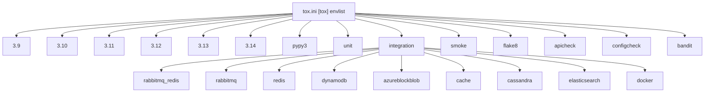
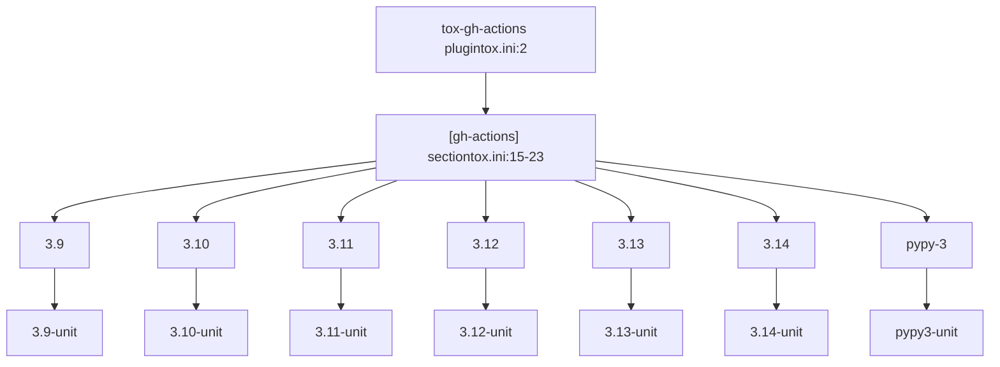
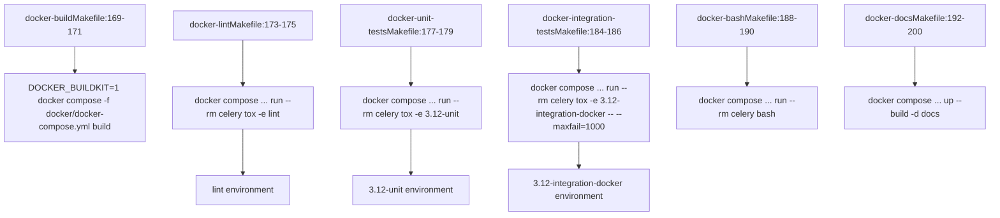

# Test Matrix and Environments

Relevant source files

-   [Makefile](https://github.com/celery/celery/blob/4d068b56/Makefile)
-   [celery/app/backends.py](https://github.com/celery/celery/blob/4d068b56/celery/app/backends.py)
-   [docs/Makefile](https://github.com/celery/celery/blob/4d068b56/docs/Makefile)
-   [docs/\_ext/celerydocs.py](https://github.com/celery/celery/blob/4d068b56/docs/_ext/celerydocs.py)
-   [docs/changelog\_formatter.py](https://github.com/celery/celery/blob/4d068b56/docs/changelog_formatter.py)
-   [requirements/docs.txt](https://github.com/celery/celery/blob/4d068b56/requirements/docs.txt)
-   [requirements/pkgutils.txt](https://github.com/celery/celery/blob/4d068b56/requirements/pkgutils.txt)
-   [requirements/test-integration.txt](https://github.com/celery/celery/blob/4d068b56/requirements/test-integration.txt)
-   [tox.ini](https://github.com/celery/celery/blob/4d068b56/tox.ini)

This document describes Celery's test matrix, tox environment configuration, and test execution infrastructure. The test matrix defines combinations of Python versions, test types, and broker/backend configurations used to verify Celery functionality across different deployment scenarios.

For information about the actual test infrastructure (pytest setup, fixtures, test organization), see [Testing Infrastructure](/celery/celery/10.1-testing-infrastructure). For CI/CD pipeline configuration, see [CI/CD Pipeline](/celery/celery/10.4-code-quality-and-documentation). For code quality tools configuration, see [Code Quality Tools](#10.5).

## Overview

Celery uses `tox` to manage test environments and ensure consistent testing across multiple Python versions and broker/backend combinations. The test matrix is defined in [tox.ini1-135](https://github.com/celery/celery/blob/4d068b56/tox.ini#L1-L135) and covers:

-   **Python versions**: 3.9, 3.10, 3.11, 3.12, 3.13, 3.14, and PyPy3
-   **Test types**: unit tests, integration tests, smoke tests
-   **Backend combinations**: RabbitMQ, Redis, DynamoDB, Azure Block Blob, Cassandra, Elasticsearch, and various combinations
-   **Quality checks**: flake8, apicheck, configcheck, bandit

## Test Matrix Dimensions

The test matrix is structured along three primary dimensions defined in `[tox]` section's `envlist` configuration that can be combined to create specific test environments.

**Tox Environment List Configuration**


**Sources**: [tox.ini4-12](https://github.com/celery/celery/blob/4d068b56/tox.ini#L4-L12)

### Environment Naming Convention

Tox environments follow the pattern: `{python_version}-{test_type}-{backend_config}`

| Component | Values | Example |
| --- | --- | --- |
| Python Version | `3.9`, `3.10`, `3.11`, `3.12`, `3.13`, `3.14`, `pypy3` | `3.12` |
| Test Type | `unit`, `integration`, `smoke` | `integration` |
| Backend Config | `rabbitmq_redis`, `redis`, `dynamodb`, `cassandra`, etc. | `redis` |

**Examples**:

-   `3.12-unit`: Unit tests on Python 3.12
-   `3.11-integration-rabbitmq_redis`: Integration tests with RabbitMQ broker and Redis backend on Python 3.11
-   `pypy3-smoke`: Smoke tests on PyPy3

**Sources**: [tox.ini5-7](https://github.com/celery/celery/blob/4d068b56/tox.ini#L5-L7)

## Tox Environment Configuration

### Base Environment Settings

All test environments inherit common configuration from the `[testenv]` section:

**Testenv Configuration Structure**

```mermaid
flowchart TD
    TestEnvSection["[testenv] tox.ini:25-99"]
    SitePackages["sitepackages = False"]
    Recreate["recreate = False"]
    UseDevelop["usedevelop = True"]
    TestTxt["-r{toxinidir}/requirements/test.txt"]
    PkgUtilsTxt["-r{toxinidir}/requirements/pkgutils.txt"]
    TestCIDefault["-r{toxinidir}/requirements/test-ci-default.txt"]
    DocsTxt["-r{toxinidir}/requirements/docs.txt"]
    TestIntegration["-r{toxinidir}/requirements/test-integration.txt"]
    PytestXdist["pytest-xdist>=3.5"]
    PreCommit["pre-commit"]
    BanditPkg["bandit"]
    PipExtra["PIP_EXTRA_INDEX_URL=https://celery.github.io/celery-wheelhouse/repo/simple/"]
    BotoConfig["BOTO_CONFIG=/dev/null"]
    WorkerLog["WORKER_LOGLEVEL=INFO"]
    PythonIO["PYTHONIOENCODING=UTF-8"]
    Unbuffered["PYTHONUNBUFFERED=1"]
    NoBytecode["PYTHONDONTWRITEBYTECODE=1"]
    TestBroker["TEST_BROKER="]
    TestBackend["TEST_BACKEND="]
    Py39Map["3.9: python3.9"]
    Py310Map["3.10: python3.10"]
    Py311Map["3.11: python3.11"]
    Py312Map["3.12: python3.12"]
    Py313Map["3.13: python3.13"]
    Py314Map["3.14: python3.14"]
    PyPy3Map["pypy3: pypy3"]

    TestEnvSection --> SitePackages
    TestEnvSection --> Recreate
    TestEnvSection --> UseDevelop
    TestEnvSection --> TestTxt
    TestEnvSection --> PkgUtilsTxt
    TestEnvSection --> TestCIDefault
    TestEnvSection --> DocsTxt
    TestEnvSection --> TestIntegration
    TestEnvSection --> PytestXdist
    TestEnvSection --> PreCommit
    TestEnvSection --> BanditPkg
    TestEnvSection --> PipExtra
    TestEnvSection --> BotoConfig
    TestEnvSection --> WorkerLog
    TestEnvSection --> PythonIO
    TestEnvSection --> Unbuffered
    TestEnvSection --> NoBytecode
    TestEnvSection --> TestBroker
    TestEnvSection --> TestBackend
    TestEnvSection --> Py39Map
    TestEnvSection --> Py310Map
    TestEnvSection --> Py311Map
    TestEnvSection --> Py312Map
    TestEnvSection --> Py313Map
    TestEnvSection --> Py314Map
    TestEnvSection --> PyPy3Map
```


**Sources**: [tox.ini25-99](https://github.com/celery/celery/blob/4d068b56/tox.ini#L25-L99)

### Python Version Mapping

The `basepython` configuration maps tox environment prefixes to specific Python executables:

| Environment Prefix | Python Executable | Line Reference |
| --- | --- | --- |
| `3.9` | `python3.9` | [tox.ini88](https://github.com/celery/celery/blob/4d068b56/tox.ini#L88-L88) |
| `3.10` | `python3.10` | [tox.ini89](https://github.com/celery/celery/blob/4d068b56/tox.ini#L89-L89) |
| `3.11` | `python3.11` | [tox.ini90](https://github.com/celery/celery/blob/4d068b56/tox.ini#L90-L90) |
| `3.12` | `python3.12` | [tox.ini91](https://github.com/celery/celery/blob/4d068b56/tox.ini#L91-L91) |
| `3.13` | `python3.13` | [tox.ini92](https://github.com/celery/celery/blob/4d068b56/tox.ini#L92-L92) |
| `3.14` | `python3.14` | [tox.ini93](https://github.com/celery/celery/blob/4d068b56/tox.ini#L93-L93) |
| `pypy3` | `pypy3` | [tox.ini94](https://github.com/celery/celery/blob/4d068b56/tox.ini#L94-L94) |
| `mypy` | `python3.13` | [tox.ini95](https://github.com/celery/celery/blob/4d068b56/tox.ini#L95-L95) |
| `lint`, `apicheck`, `linkcheck`, `configcheck`, `bandit` | `python3.13` | [tox.ini96](https://github.com/celery/celery/blob/4d068b56/tox.ini#L96-L96) |

**Sources**: [tox.ini87-96](https://github.com/celery/celery/blob/4d068b56/tox.ini#L87-L96)

## Test Type Configurations

### Unit Tests

Unit tests run with pytest and generate coverage reports:

```
# Command executed for unit tests
pytest -vv --maxfail=10 --capture=no -v \
    --cov=celery --cov-report=xml \
    --junitxml=junit.xml -o junit_family=legacy \
    --cov-report term {posargs}
```
**Key Features**:

-   Maximum 10 failures before stopping (`--maxfail=10`)
-   Coverage tracking for the `celery` package
-   XML and terminal coverage reports
-   JUnit XML output for CI integration
-   No output capture (`--capture=no`) for debugging

**Dependencies**:

-   [requirements/test.txt1](https://github.com/celery/celery/blob/4d068b56/requirements/test.txt#L1-L1) - Core test dependencies
-   [requirements/test-ci-default.txt35-37](https://github.com/celery/celery/blob/4d068b56/requirements/test-ci-default.txt#L35-L37) - CI-specific dependencies for CPython
-   [requirements/docs.txt1-9](https://github.com/celery/celery/blob/4d068b56/requirements/docs.txt#L1-L9) - Documentation dependencies

**Sources**: [tox.ini47](https://github.com/celery/celery/blob/4d068b56/tox.ini#L47-L47) [tox.ini31-37](https://github.com/celery/celery/blob/4d068b56/tox.ini#L31-L37)

### Integration Tests

Integration tests verify Celery with real broker and backend implementations:

```
# Command executed for integration tests
pytest -xsvv t/integration {posargs}
```
**Key Features**:

-   Stop on first failure (`-x`)
-   Verbose output (`-svv`)
-   Test directory: `t/integration/`
-   Environment-specific broker/backend configuration via environment variables

**Dependencies**:

-   Base test dependencies
-   [requirements/test-integration.txt1-6](https://github.com/celery/celery/blob/4d068b56/requirements/test-integration.txt#L1-L6) including:
    -   Redis extras
    -   Azure Block Blob extras
    -   Auth extras
    -   Memcache extras
    -   pytest-rerunfailures for flaky test handling
    -   Development Kombu from Git

**Sources**: [tox.ini48](https://github.com/celery/celery/blob/4d068b56/tox.ini#L48-L48) [tox.ini39](https://github.com/celery/celery/blob/4d068b56/tox.ini#L39-L39) [requirements/test-integration.txt1-6](https://github.com/celery/celery/blob/4d068b56/requirements/test-integration.txt#L1-L6)

### Smoke Tests

Smoke tests are quick validation tests that can be parallelized:

```
# Command executed for smoke tests
pytest -xsvv t/smoke --dist=loadscope \
    --reruns 5 --reruns-delay 10 {posargs}
```
**Key Features**:

-   Parallel execution with `--dist=loadscope` (distributed by test scope)
-   Automatic retry on failure: 5 retries with 10-second delays
-   Test directory: `t/smoke/`
-   Requires `pytest-xdist>=3.5` for parallel execution

**Sources**: [tox.ini49](https://github.com/celery/celery/blob/4d068b56/tox.ini#L49-L49) [tox.ini40](https://github.com/celery/celery/blob/4d068b56/tox.ini#L40-L40)

## Backend-Specific Environment Variables

Integration tests use `TEST_BROKER` and `TEST_BACKEND` environment variables configured in the `setenv` section of `[testenv]` to route tests to specific broker and backend implementations.

**setenv Configuration Mapping**

```mermaid
flowchart TD
    SetenvSection["[testenv] setenv sectiontox.ini:52-87"]
    CacheBroker["TEST_BROKER=redis://"]
    CacheBackend["TEST_BACKEND=cache+pylibmc://"]
    CassandraBroker["TEST_BROKER=redis://"]
    CassandraBackend["TEST_BACKEND=cassandra://"]
    ElasticBroker["TEST_BROKER=redis://"]
    ElasticBackend["TEST_BACKEND=elasticsearch://@localhost:9200"]
    RabbitBroker["TEST_BROKER=pyamqp://"]
    RabbitBackend["TEST_BACKEND=rpc"]
    RedisBroker["TEST_BROKER=redis://"]
    RedisBackend["TEST_BACKEND=redis://"]
    RabbitRedisBroker["TEST_BROKER=pyamqp://"]
    RabbitRedisBackend["TEST_BACKEND=redis://"]
    DockerBroker["TEST_BROKER=pyamqp://rabbit:5672"]
    DockerBackend["TEST_BACKEND=redis://redis"]
    DynamoBroker["TEST_BROKER=redis://"]
    DynamoBackend["TEST_BACKEND=dynamodb://@localhost:8000"]
    DynamoAWSKey["AWS_ACCESS_KEY_ID=test_aws_key_id"]
    DynamoAWSSecret["AWS_SECRET_ACCESS_KEY=test_aws_secret_key"]
    AzureBroker["TEST_BROKER=redis://"]
    AzureBackend["TEST_BACKEND=azureblockblob://..."]

    SetenvSection --> CacheBroker
    SetenvSection --> CacheBackend
    SetenvSection --> CassandraBroker
    SetenvSection --> CassandraBackend
    SetenvSection --> ElasticBroker
    SetenvSection --> ElasticBackend
    SetenvSection --> RabbitBroker
    SetenvSection --> RabbitBackend
    SetenvSection --> RedisBroker
    SetenvSection --> RedisBackend
    SetenvSection --> RabbitRedisBroker
    SetenvSection --> RabbitRedisBackend
    SetenvSection --> DockerBroker
    SetenvSection --> DockerBackend
    SetenvSection --> DynamoBroker
    SetenvSection --> DynamoBackend
    SetenvSection --> DynamoAWSKey
    SetenvSection --> DynamoAWSSecret
    SetenvSection --> AzureBroker
    SetenvSection --> AzureBackend
```


**Sources**: [tox.ini52-87](https://github.com/celery/celery/blob/4d068b56/tox.ini#L52-L87)

### Environment Variable Details

| Integration Env | TEST\_BROKER | TEST\_BACKEND | Additional Variables |
| --- | --- | --- | --- |
| `cache` | `redis://` | `cache+pylibmc://` | \- |
| `cassandra` | `redis://` | `cassandra://` | \- |
| `elasticsearch` | `redis://` | `elasticsearch://@localhost:9200` | \- |
| `rabbitmq` | `pyamqp://` | `rpc` | \- |
| `redis` | `redis://` | `redis://` | \- |
| `rabbitmq_redis` | `pyamqp://` | `redis://` | \- |
| `docker` | `pyamqp://rabbit:5672` | `redis://redis` | \- |
| `dynamodb` | `redis://` | `dynamodb://@localhost:8000` | `AWS_ACCESS_KEY_ID=test_aws_key_id`
`AWS_SECRET_ACCESS_KEY=test_aws_secret_key` |
| `azureblockblob` | `redis://` | `azureblockblob://...` | Full connection string in [tox.ini85](https://github.com/celery/celery/blob/4d068b56/tox.ini#L85-L85) |

**Sources**: [tox.ini58-85](https://github.com/celery/celery/blob/4d068b56/tox.ini#L58-L85)

### Passthrough Environment Variables

Some environment variables are passed through from the host environment:

-   `AZUREBLOCKBLOB_URL` - Custom Azure Blob Storage endpoint [tox.ini29](https://github.com/celery/celery/blob/4d068b56/tox.ini#L29-L29)

**Sources**: [tox.ini28-29](https://github.com/celery/celery/blob/4d068b56/tox.ini#L28-L29)

## Code Quality Environments

Celery includes several tox environments for code quality checks that execute tools instead of running tests:

**Quality Check Environment Commands**

**Sources**: [tox.ini101-136](https://github.com/celery/celery/blob/4d068b56/tox.ini#L101-L136)

### Flake8 Environment

The `flake8` environment is implicitly defined and runs style checks on the codebase. The actual flake8 configuration is in `setup.cfg` or `.flake8` (not shown in provided files).

**Command**: Standard flake8 execution via `make flakecheck` [Makefile94-95](https://github.com/celery/celery/blob/4d068b56/Makefile#L94-L95)

**Sources**: [Makefile86](https://github.com/celery/celery/blob/4d068b56/Makefile#L86-L86) [Makefile94-95](https://github.com/celery/celery/blob/4d068b56/Makefile#L94-L95)

### API Check Environment

The `apicheck` environment verifies that all modules are documented in the API reference using a custom Sphinx builder.

**Command**:

```
sphinx-build -j2 -b apicheck -d {envtmpdir}/doctrees docs docs/_build/apicheck
```
**Configuration**:

-   `PYTHONHASHSEED = 100` for reproducible output [tox.ini106](https://github.com/celery/celery/blob/4d068b56/tox.ini#L106-L106)
-   Parallel build with 2 jobs (`-j2`)
-   Custom Sphinx builder: `apicheck` defined in `sphinx_celery`
-   Ignored modules configured in [docs/conf.py28-43](https://github.com/celery/celery/blob/4d068b56/docs/conf.py#L28-L43) via `apicheck_ignore_modules`
-   Requires dependencies from [requirements/docs.txt1-9](https://github.com/celery/celery/blob/4d068b56/requirements/docs.txt#L1-L9)

The `apicheck` builder validates that all Python modules in the `celery` package have corresponding API documentation entries. Modules listed in `apicheck_ignore_modules` are excluded from this check, such as:

-   `celery.__main__`
-   `celery.contrib.testing.*`
-   `celery.bin.*` modules
-   `celery.fixups.*` modules

**Sources**: [tox.ini104-108](https://github.com/celery/celery/blob/4d068b56/tox.ini#L104-L108) [docs/conf.py28-43](https://github.com/celery/celery/blob/4d068b56/docs/conf.py#L28-L43)

### Config Check Environment

The `configcheck` environment verifies that all configuration options are documented using a custom Sphinx builder that validates against `celery.app.defaults.NAMESPACES`.

**Command**:

```
sphinx-build -j2 -b configcheck -d {envtmpdir}/doctrees docs docs/_build/configcheck
```
**Configuration**:

-   Parallel build with 2 jobs
-   Custom Sphinx builder: `configcheck` defined in `sphinx_celery`
-   Settings extraction via `configcheck_project_settings()` [docs/conf.py90-93](https://github.com/celery/celery/blob/4d068b56/docs/conf.py#L90-L93)
-   Ignored settings defined in `ignored_settings` [docs/conf.py54-87](https://github.com/celery/celery/blob/4d068b56/docs/conf.py#L54-L87)
-   Settings check function: `configcheck_should_ignore()` [docs/conf.py103-104](https://github.com/celery/celery/blob/4d068b56/docs/conf.py#L103-L104)

The builder calls `configcheck_project_settings()` which imports `celery.app.defaults.NAMESPACES` and flattens it to get all configuration options. Settings in `ignored_settings` (deprecated settings) and those with `deprecate_by` attributes are excluded from validation.

**Sources**: [tox.ini110-112](https://github.com/celery/celery/blob/4d068b56/tox.ini#L110-L112) [docs/conf.py54-104](https://github.com/celery/celery/blob/4d068b56/docs/conf.py#L54-L104)

### Bandit Environment

The `bandit` environment performs security scanning:

**Command**:

```
bandit -b bandit.json -r celery/
```
**Configuration**:

-   Configuration file: `bandit.json`
-   Scans the `celery/` directory recursively
-   Requires `bandit` package

**Sources**: [tox.ini116-118](https://github.com/celery/celery/blob/4d068b56/tox.ini#L116-L118) [tox.ini44](https://github.com/celery/celery/blob/4d068b56/tox.ini#L44-L44)

### Mypy Environment

The `mypy` environment performs type checking:

**Command**:

```
python -m mypy --config-file pyproject.toml
```
**Configuration**:

-   Configuration in `pyproject.toml`
-   Uses Python 3.13 [tox.ini95](https://github.com/celery/celery/blob/4d068b56/tox.ini#L95-L95)

**Sources**: [tox.ini99-100](https://github.com/celery/celery/blob/4d068b56/tox.ini#L99-L100)

### Lint Environment

The `lint` environment runs pre-commit hooks:

**Command**:

```
pre-commit {posargs:run --all-files --show-diff-on-failure}
```
**Configuration**:

-   Runs all pre-commit hooks by default
-   Shows diffs on failure
-   Requires `pre-commit` package

**Sources**: [tox.ini120-122](https://github.com/celery/celery/blob/4d068b56/tox.ini#L120-L122) [tox.ini43](https://github.com/celery/celery/blob/4d068b56/tox.ini#L43-L43)

### Link Check Environment

The `linkcheck` environment verifies external links in documentation:

**Command**:

```
sphinx-build -j2 -b linkcheck -d {envtmpdir}/doctrees docs docs/_build/linkcheck
```
**Sources**: [tox.ini112-114](https://github.com/celery/celery/blob/4d068b56/tox.ini#L112-L114)

### Clean Environment

The `clean` environment removes test artifacts and temporary files using bash commands and cleanup tools:

**Commands**:

1.  **Coverage Cleanup** [tox.ini130](https://github.com/celery/celery/blob/4d068b56/tox.ini#L130-L130):

```
bash -c 'files=$(find . -name "*.coverage*" -type f); if [ -n "$files" ]; then echo "Removed coverage file(s):"; echo "$files" | tr " " "\n"; rm $files; fi'
```
2.  **Docker Container Cleanup** [tox.ini131](https://github.com/celery/celery/blob/4d068b56/tox.ini#L131-L131):

```
bash -c 'containers=$(docker ps -aq --filter label=creator=pytest-docker-tools); if [ -n "$containers" ]; then echo "Removed Docker container(s):"; docker rm -f $containers; fi'
```
3.  **Docker Network Cleanup** [tox.ini132](https://github.com/celery/celery/blob/4d068b56/tox.ini#L132-L132):

```
bash -c 'networks=$(docker network ls --filter name=pytest- -q); if [ -n "$networks" ]; then echo "Removed Docker network(s):"; docker network rm $networks; fi'
```
4.  **Docker Volume Cleanup** [tox.ini133](https://github.com/celery/celery/blob/4d068b56/tox.ini#L133-L133):

```
bash -c 'volumes=$(docker volume ls --filter name=pytest- -q); if [ -n "$volumes" ]; then echo "Removed Docker volume(s):"; docker volume rm $volumes; fi'
```
5.  **Python Artifacts** [tox.ini134](https://github.com/celery/celery/blob/4d068b56/tox.ini#L134-L134):

```
python -m cleanpy .
```
6.  **Build Artifacts** [tox.ini135](https://github.com/celery/celery/blob/4d068b56/tox.ini#L135-L135):

```
make clean
```
7.  **Test Databases** [tox.ini136](https://github.com/celery/celery/blob/4d068b56/tox.ini#L136-L136):

```
rm -f test.db statefilename.db
```
**Dependencies**:

-   `cleanpy` package [tox.ini127](https://github.com/celery/celery/blob/4d068b56/tox.ini#L127-L127)
-   `bash`, `make`, `rm` allowlisted executables [tox.ini128](https://github.com/celery/celery/blob/4d068b56/tox.ini#L128-L128)

**Sources**: [tox.ini126-136](https://github.com/celery/celery/blob/4d068b56/tox.ini#L126-L136)

## GitHub Actions Integration

The `tox-gh-actions` plugin automatically maps GitHub Actions Python versions to tox environments via the `[gh-actions]` section.

**tox-gh-actions Version Mapping**


The `[gh-actions]` section defines the mapping:

```
[gh-actions]
python =
    3.9: 3.9-unit
    3.10: 3.10-unit
    3.11: 3.11-unit
    3.12: 3.12-unit
    3.13: 3.13-unit
    3.14: 3.14-unit
    pypy-3: pypy3-unit
```
When running in GitHub Actions with a specific Python version, `tox-gh-actions` reads the Python version from the environment and automatically executes the corresponding tox environment. For example, if the GitHub Actions matrix specifies `python: "3.12"`, tox will automatically run `3.12-unit`.

**Sources**: [tox.ini2-3](https://github.com/celery/celery/blob/4d068b56/tox.ini#L2-L3) [tox.ini15-23](https://github.com/celery/celery/blob/4d068b56/tox.ini#L15-L23)

## Running Tests Locally

### Running All Tests

```
# Run all environments
tox

# Run specific Python version unit tests
tox -e 3.12-unit

# Run integration tests with Redis
tox -e 3.12-integration-redis

# Run smoke tests
tox -e 3.12-smoke
```
### Running Specific Tests with Pytest Arguments

Tox supports passing arguments to pytest using `--`:

```
# Run specific test file
tox -e 3.12-unit -- t/unit/test_app.py

# Run specific test function
tox -e 3.12-unit -- t/unit/test_app.py::test_task_decorator

# Run with keyword filter
tox -e 3.12-unit -- -k "test_redis"

# Increase verbosity
tox -e 3.12-unit -- -vvv
```
**Sources**: [tox.ini47-49](https://github.com/celery/celery/blob/4d068b56/tox.ini#L47-L49)

### Running Code Quality Checks

```
# Run all lint checks
make lint

# Individual checks
tox -e flake8
tox -e apicheck
tox -e configcheck
tox -e bandit
tox -e mypy
tox -e lint
```
**Sources**: [Makefile86](https://github.com/celery/celery/blob/4d068b56/Makefile#L86-L86) [tox.ini9-12](https://github.com/celery/celery/blob/4d068b56/tox.ini#L9-L12)

## Docker-Based Testing

Celery supports running tests in Docker containers for consistent environments using Docker Compose and Makefile targets.

**Makefile Docker Test Targets**


**Sources**: [Makefile169-200](https://github.com/celery/celery/blob/4d068b56/Makefile#L169-L200)

### Docker Test Commands

| Makefile Target | Docker Compose Command | Tox Environment | Line Reference |
| --- | --- | --- | --- |
| `docker-build` | `DOCKER_BUILDKIT=1 docker compose -f docker/docker-compose.yml build` | \- | [Makefile169-171](https://github.com/celery/celery/blob/4d068b56/Makefile#L169-L171) |
| `docker-lint` | `docker compose ... run --rm -w /home/developer/celery celery tox -e lint` | `lint` | [Makefile173-175](https://github.com/celery/celery/blob/4d068b56/Makefile#L173-L175) |
| `docker-unit-tests` | `docker compose ... run --rm -w /home/developer/celery celery tox -e 3.12-unit -- $(filter-out $@,$(MAKECMDGOALS))` | `3.12-unit` | [Makefile177-179](https://github.com/celery/celery/blob/4d068b56/Makefile#L177-L179) |
| `docker-integration-tests` | `docker compose ... run --rm -w /home/developer/celery celery tox -e 3.12-integration-docker -- --maxfail=1000` | `3.12-integration-docker` | [Makefile184-186](https://github.com/celery/celery/blob/4d068b56/Makefile#L184-L186) |
| `docker-bash` | `docker compose ... run --rm -w /home/developer/celery celery bash` | \- | [Makefile188-190](https://github.com/celery/celery/blob/4d068b56/Makefile#L188-L190) |
| `docker-docs` | `docker compose ... up --build -d docs` | \- | [Makefile192-200](https://github.com/celery/celery/blob/4d068b56/Makefile#L192-L200) |

**Docker Integration Environment Configuration**:

The `docker` integration factor in tox.ini configures service hostnames that match Docker Compose service names:

```
docker: TEST_BROKER=pyamqp://rabbit:5672
docker: TEST_BACKEND=redis://redis
```
These correspond to service names defined in `docker/docker-compose.yml`:

-   `rabbit` service: RabbitMQ broker
-   `redis` service: Redis backend

**Integration Tests Note**: The `docker-integration-tests` target allows up to 1000 failures (`--maxfail=1000`) as full Docker support for integration tests is still in development [Makefile181-186](https://github.com/celery/celery/blob/4d068b56/Makefile#L181-L186)

**Sources**: [Makefile169-200](https://github.com/celery/celery/blob/4d068b56/Makefile#L169-L200) [tox.ini78-79](https://github.com/celery/celery/blob/4d068b56/tox.ini#L78-L79)

### Docker Test Example

```
# Run specific unit test in Docker
make docker-unit-tests -- -k test_canvas

# Run integration tests (allows failures)
make docker-integration-tests
```
The integration tests in Docker allow up to 1000 failures (`--maxfail=1000`) as full support is still in development [Makefile186](https://github.com/celery/celery/blob/4d068b56/Makefile#L186-L186)

**Sources**: [Makefile177-186](https://github.com/celery/celery/blob/4d068b56/Makefile#L177-L186)

## Dependency Management

Test dependencies are organized in the `requirements/` directory with conditional loading based on environment type.

**Requirements File Dependencies**

```mermaid
flowchart TD
    DocsTxt["requirements/docs.txt"]
    SphinxCelery["sphinx_celery>=2.1.1"]
    Sphinx["Sphinx>=7.0.0"]
    SphinxTesting["sphinx-testing~=1.0.1"]
    SphinxClick["sphinx-click==6.0.0"]
    SQLAlchemyExtras["-r extras/sqlalchemy.txt"]
    TestTxtRef["-r test.txt"]
    MockDeps["-r deps/mock.txt"]
    AuthExtrasRef["-r extras/auth.txt"]
    SphinxAutobuildExtras["-r extras/sphinxautobuild.txt"]
    TestIntegrationTxt["requirements/test-integration.txt"]
    RedisExtras["-r extras/redis.txt"]
    AzureExtras["-r extras/azureblockblob.txt"]
    AuthExtras["-r extras/auth.txt"]
    MemcacheExtras["-r extras/memcache.txt"]
    PytestRerun["pytest-rerunfailures>=11.1.2"]
    KombuGit["git+https://github.com/celery/kombu.git"]
    TestCIDefaultTxt["requirements/test-ci-default.txtCI-specific packages"]
    TestTxt["requirements/test.txtpytest, pytest-cov, etc."]
    PkgUtilsTxt["requirements/pkgutils.txtsetuptools, wheel, tox, etc."]
    Setuptools["setuptools>=40.8.0"]
    Wheel["wheel>=0.33.1"]
    Flake8["flake8>=3.8.3"]
    Flake8Docstrings["flake8-docstrings>=1.7.0"]
    Pydocstyle["pydocstyle==6.3.0"]
    ToxPkg["tox>=3.8.4"]
    Sphinx2rst["sphinx2rst>=1.0"]
    Bumpversion["bumpversion==0.6.0"]
    Pyperclip["pyperclip==1.11.0"]

    PkgUtilsTxt --> Setuptools
    PkgUtilsTxt --> Wheel
    PkgUtilsTxt --> Flake8
    PkgUtilsTxt --> Flake8Docstrings
    PkgUtilsTxt --> Pydocstyle
    PkgUtilsTxt --> ToxPkg
    PkgUtilsTxt --> Sphinx2rst
    PkgUtilsTxt --> Bumpversion
    PkgUtilsTxt --> Pyperclip
    DocsTxt --> SphinxCelery
    DocsTxt --> Sphinx
    DocsTxt --> SphinxTesting
    DocsTxt --> SphinxClick
    DocsTxt --> SQLAlchemyExtras
    DocsTxt --> TestTxtRef
    DocsTxt --> MockDeps
    DocsTxt --> AuthExtrasRef
    DocsTxt --> SphinxAutobuildExtras
    TestIntegrationTxt --> RedisExtras
    TestIntegrationTxt --> AzureExtras
    TestIntegrationTxt --> AuthExtras
    TestIntegrationTxt --> MemcacheExtras
    TestIntegrationTxt --> PytestRerun
    TestIntegrationTxt --> KombuGit
```


**Sources**: [tox.ini31-44](https://github.com/celery/celery/blob/4d068b56/tox.ini#L31-L44) [requirements/docs.txt1-9](https://github.com/celery/celery/blob/4d068b56/requirements/docs.txt#L1-L9) [requirements/pkgutils.txt1-11](https://github.com/celery/celery/blob/4d068b56/requirements/pkgutils.txt#L1-L11)

### Dependency Loading Strategy

Dependencies are loaded conditionally based on Python version and test type:

| Condition | Dependencies Loaded |
| --- | --- |
| All environments | `requirements/test.txt`, `requirements/pkgutils.txt` |
| CPython (3.9-3.14) | `requirements/test-ci-default.txt`, `requirements/docs.txt` |
| PyPy3 | `requirements/test-ci-default.txt` |
| Integration tests | `requirements/test-integration.txt` |
| Smoke tests | `pytest-xdist>=3.5` |
| Documentation checks | `requirements/docs.txt` |
| Lint environment | `pre-commit` |
| Bandit environment | `bandit` |

**Sources**: [tox.ini35-44](https://github.com/celery/celery/blob/4d068b56/tox.ini#L35-L44)

### Celery Wheelhouse

Test environments use a custom PyPI index for pre-built wheels:

```
PIP_EXTRA_INDEX_URL=https://celery.github.io/celery-wheelhouse/repo/simple/
```
This provides optimized binary packages for faster installation in CI environments.

**Sources**: [tox.ini51](https://github.com/celery/celery/blob/4d068b56/tox.ini#L51-L51)

## Environment Variables Reference

Common environment variables set across all test environments:

| Variable | Value | Purpose |
| --- | --- | --- |
| `PIP_EXTRA_INDEX_URL` | `https://celery.github.io/celery-wheelhouse/repo/simple/` | Custom wheelhouse for faster installs |
| `BOTO_CONFIG` | `/dev/null` | Disable AWS config file lookup |
| `WORKER_LOGLEVEL` | `INFO` | Set worker log verbosity |
| `PYTHONIOENCODING` | `UTF-8` | Force UTF-8 encoding |
| `PYTHONUNBUFFERED` | `1` | Disable Python output buffering |
| `PYTHONDONTWRITEBYTECODE` | `1` | Don't create `.pyc` files |

**Sources**: [tox.ini50-56](https://github.com/celery/celery/blob/4d068b56/tox.ini#L50-L56)

## Coverage Reporting

Unit tests generate coverage reports in multiple formats:

1.  **XML Report**: `--cov-report=xml` - for CI integration and code coverage services
2.  **Terminal Report**: `--cov-report term` - immediate feedback during test runs
3.  **JUnit XML**: `--junitxml=junit.xml` - for CI test result reporting

Coverage is tracked for the `celery` package: `--cov=celery`

**Sources**: [tox.ini47](https://github.com/celery/celery/blob/4d068b56/tox.ini#L47-L47)

## Special Test Configurations

### Smoke Tests with Retry

Smoke tests use `pytest-rerunfailures` to handle transient failures:

```
pytest -xsvv t/smoke --dist=loadscope --reruns 5 --reruns-delay 10
```
-   **Reruns**: 5 attempts per failing test
-   **Delay**: 10 seconds between retry attempts
-   **Distribution**: Tests distributed by scope for parallel execution

**Sources**: [tox.ini49](https://github.com/celery/celery/blob/4d068b56/tox.ini#L49-L49)

### Integration Test Requirements

Integration tests require additional packages from [requirements/test-integration.txt1-6](https://github.com/celery/celery/blob/4d068b56/requirements/test-integration.txt#L1-L6):

-   Redis support: `requirements/extras/redis.txt`
-   Azure Blob support: `requirements/extras/azureblockblob.txt`
-   Authentication extras: `requirements/extras/auth.txt`
-   Memcache support: `requirements/extras/memcache.txt`
-   Retry handling: `pytest-rerunfailures>=11.1.2`
-   Development Kombu: `git+https://github.com/celery/kombu.git`

**Sources**: [requirements/test-integration.txt1-6](https://github.com/celery/celery/blob/4d068b56/requirements/test-integration.txt#L1-L6)

## Makefile Integration

The Makefile provides convenient targets that invoke tox:

```
# Run all tests across all Python versions
make test-all

# Run tests with current Python version
make test

# Run linting
make lint

# Individual checks
make apicheck
make configcheck
make flakecheck
```
The Makefile targets ultimately delegate to tox or pytest commands.

**Sources**: [Makefile141-154](https://github.com/celery/celery/blob/4d068b56/Makefile#L141-L154)
