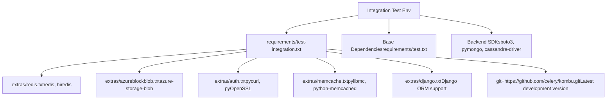
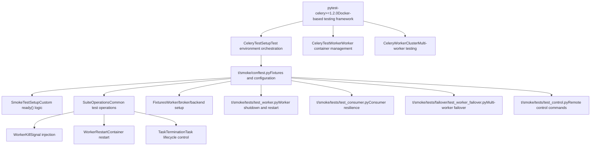
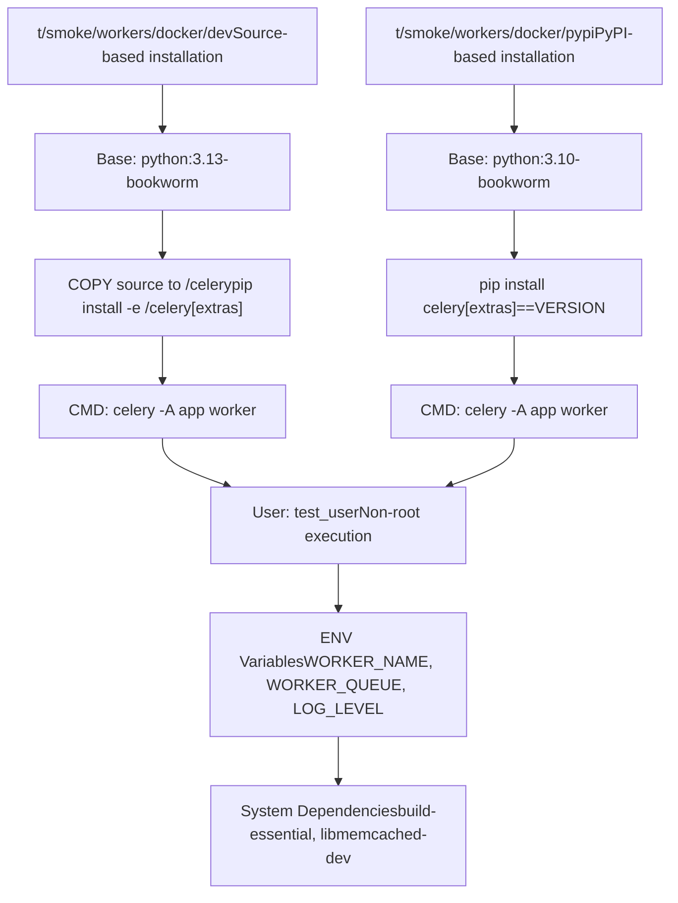
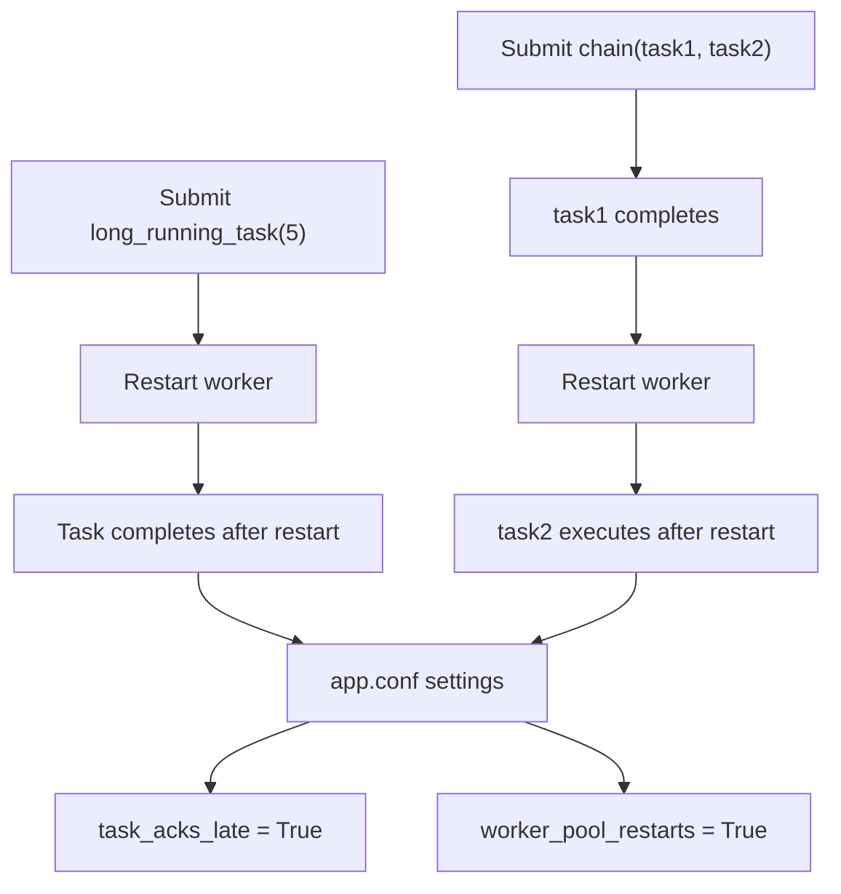
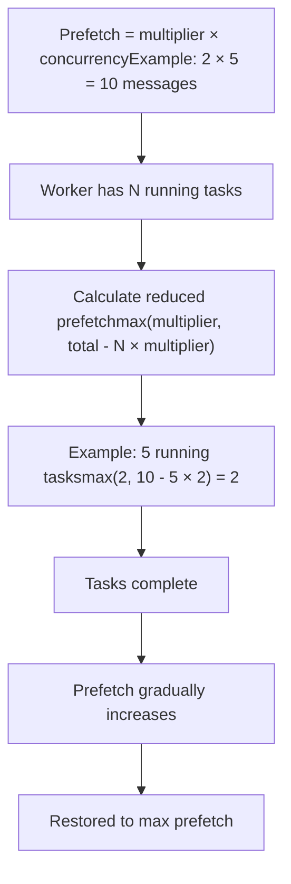
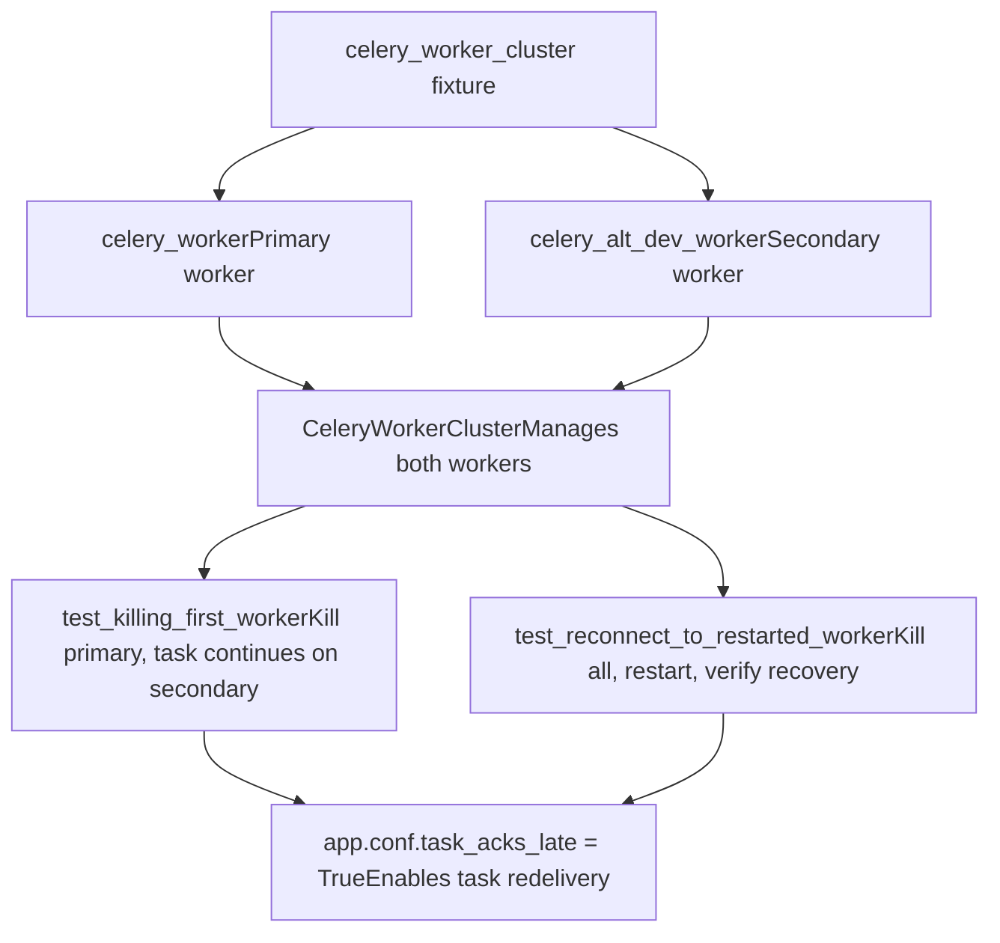
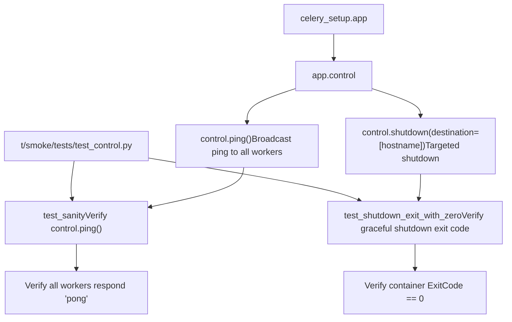

# Integration and Smoke Tests

Relevant source files

-   [Makefile](https://github.com/celery/celery/blob/4d068b56/Makefile)
-   [celery/app/backends.py](https://github.com/celery/celery/blob/4d068b56/celery/app/backends.py)
-   [docs/Makefile](https://github.com/celery/celery/blob/4d068b56/docs/Makefile)
-   [docs/\_ext/celerydocs.py](https://github.com/celery/celery/blob/4d068b56/docs/_ext/celerydocs.py)
-   [docs/changelog\_formatter.py](https://github.com/celery/celery/blob/4d068b56/docs/changelog_formatter.py)
-   [requirements/docs.txt](https://github.com/celery/celery/blob/4d068b56/requirements/docs.txt)
-   [requirements/extras/pytest.txt](https://github.com/celery/celery/blob/4d068b56/requirements/extras/pytest.txt)
-   [requirements/pkgutils.txt](https://github.com/celery/celery/blob/4d068b56/requirements/pkgutils.txt)
-   [requirements/test-integration.txt](https://github.com/celery/celery/blob/4d068b56/requirements/test-integration.txt)
-   [requirements/test.txt](https://github.com/celery/celery/blob/4d068b56/requirements/test.txt)
-   [t/smoke/conftest.py](https://github.com/celery/celery/blob/4d068b56/t/smoke/conftest.py)
-   [t/smoke/operations/\_\_init\_\_.py](https://github.com/celery/celery/blob/4d068b56/t/smoke/operations/__init__.py)
-   [t/smoke/redis.conf](https://github.com/celery/celery/blob/4d068b56/t/smoke/redis.conf)
-   [t/smoke/tasks.py](https://github.com/celery/celery/blob/4d068b56/t/smoke/tasks.py)
-   [t/smoke/tests/\_\_init\_\_.py](https://github.com/celery/celery/blob/4d068b56/t/smoke/tests/__init__.py)
-   [t/smoke/tests/failover/\_\_init\_\_.py](https://github.com/celery/celery/blob/4d068b56/t/smoke/tests/failover/__init__.py)
-   [t/smoke/tests/failover/test\_broker\_failover.py](https://github.com/celery/celery/blob/4d068b56/t/smoke/tests/failover/test_broker_failover.py)
-   [t/smoke/tests/failover/test\_worker\_failover.py](https://github.com/celery/celery/blob/4d068b56/t/smoke/tests/failover/test_worker_failover.py)
-   [t/smoke/tests/test\_consumer.py](https://github.com/celery/celery/blob/4d068b56/t/smoke/tests/test_consumer.py)
-   [t/smoke/tests/test\_control.py](https://github.com/celery/celery/blob/4d068b56/t/smoke/tests/test_control.py)
-   [t/smoke/tests/test\_worker.py](https://github.com/celery/celery/blob/4d068b56/t/smoke/tests/test_worker.py)
-   [t/smoke/workers/docker/dev](https://github.com/celery/celery/blob/4d068b56/t/smoke/workers/docker/dev)
-   [t/smoke/workers/docker/pypi](https://github.com/celery/celery/blob/4d068b56/t/smoke/workers/docker/pypi)
-   [tox.ini](https://github.com/celery/celery/blob/4d068b56/tox.ini)

## Purpose and Scope

This document explains Celery's integration and smoke testing infrastructure, which validates system behavior against real message brokers and result backends. Integration tests verify correct interaction with external services like RabbitMQ, Redis, and various database backends. Smoke tests verify worker resilience under adverse conditions such as broker failures, signal handling, and shutdown scenarios.

For information about unit testing infrastructure and fixtures, see [Testing Infrastructure](/celery/celery/10.1-testing-infrastructure). For the test matrix configuration and CI execution, see [Test Matrix and Environments](/celery/celery/10.2-test-matrix-and-environments) and [CI/CD Pipeline](/celery/celery/10.4-code-quality-and-documentation).

---

## Test Architecture Overview

The testing infrastructure consists of two distinct test suites with different purposes and execution characteristics:

```mermaid
flowchart TD
    ToxIni["tox.iniTest Orchestrator"]
    UnitTests["Unit Testst/unit/"]
    IntegrationTests["Integration Testst/integration/"]
    SmokeTests["Smoke Testst/smoke/"]
    MatrixDef["9 Backend Configs× 7 Python Versions"]
    RabbitMQRedis["rabbitmq_redisAMQP + Redis"]
    RabbitMQ["rabbitmqAMQP + RPC"]
    Redis["redisRedis + Redis"]
    DynamoDB["dynamodbRedis + DynamoDB"]
    Azure["azureblockblobRedis + Azure"]
    Cache["cacheRedis + Cache"]
    Cassandra["cassandraRedis + Cassandra"]
    ES["elasticsearchRedis + Elasticsearch"]
    Docker["dockerContainerized"]
    PytestCelery["pytest-celeryFramework"]
    WorkerContainers["Worker Containerst/smoke/workers/docker/"]
    BrokerContainers["Broker ContainersRabbitMQ/Redis"]
    BackendContainers["Backend ContainersRedis"]
    DevImage["devSource Install"]
    PyPIImage["pypiPyPI Install"]
    ToxConfig["Test Environment Config"]
    TestDeps["requirements/test.txtrequirements/test-integration.txt"]
    EnvVars["Environment VariablesTEST_BROKER, TEST_BACKEND"]
    ExecCmd["Execution Commandspytest with options"]

    ToxIni --> UnitTests
    ToxIni --> IntegrationTests
    ToxIni --> SmokeTests
    IntegrationTests --> MatrixDef
    MatrixDef --> RabbitMQRedis
    MatrixDef --> RabbitMQ
    MatrixDef --> Redis
    MatrixDef --> DynamoDB
    MatrixDef --> Azure
    MatrixDef --> Cache
    MatrixDef --> Cassandra
    MatrixDef --> ES
    MatrixDef --> Docker
    SmokeTests --> PytestCelery
    PytestCelery --> WorkerContainers
    PytestCelery --> BrokerContainers
    PytestCelery --> BackendContainers
    WorkerContainers --> DevImage
    WorkerContainers --> PyPIImage
    ToxConfig --> TestDeps
    ToxConfig --> EnvVars
    ToxConfig --> ExecCmd
    IntegrationTests --> ToxConfig
    SmokeTests --> ToxConfig
```


**Integration Tests** validate Celery's interaction with real external services, testing protocol-level communication and data persistence.

**Smoke Tests** validate worker resilience and runtime behavior under adverse conditions like crashes, signal interrupts, and network failures.

Sources: [tox.ini1-137](https://github.com/celery/celery/blob/4d068b56/tox.ini#L1-L137) [requirements/test.txt1-20](https://github.com/celery/celery/blob/4d068b56/requirements/test.txt#L1-L20) [requirements/test-integration.txt1-8](https://github.com/celery/celery/blob/4d068b56/requirements/test-integration.txt#L1-L8)

---

## Integration Tests

### Configuration and Execution

Integration tests execute against real message brokers and result backends. The test matrix is defined in `tox.ini` and creates 63 test environments (9 backend configurations × 7 Python versions).

```mermaid
flowchart TD
    EnvList["envlistintegration-{...}"]
    SetEnv["setenv SectionBackend-specific vars"]
    RabbitMQRedis["rabbitmq_redisTEST_BROKER=pyamqp://TEST_BACKEND=redis://"]
    RabbitMQ["rabbitmqTEST_BROKER=pyamqp://TEST_BACKEND=rpc"]
    Redis["redisTEST_BROKER=redis://TEST_BACKEND=redis://"]
    Cassandra["cassandraTEST_BROKER=redis://TEST_BACKEND=cassandra://"]
    DynamoDB["dynamodbTEST_BROKER=redis://TEST_BACKEND=dynamodb://@localhost:8000"]
    Azure["azureblockblobTEST_BACKEND=azureblockblob://..."]
    Cache["cacheTEST_BACKEND=cache+pylibmc://"]
    ES["elasticsearchTEST_BACKEND=elasticsearch://@localhost:9200"]
    Docker["dockerTEST_BROKER=pyamqp://rabbit:5672TEST_BACKEND=redis://redis"]
    Command["pytest -xsvv t/integration"]
    TestFiles["t/integration/Test Modules"]
    Fixtures["Backend/BrokerFixtures"]

    EnvList --> SetEnv
    SetEnv --> RabbitMQRedis
    SetEnv --> RabbitMQ
    SetEnv --> Redis
    SetEnv --> Cassandra
    SetEnv --> DynamoDB
    SetEnv --> Azure
    SetEnv --> Cache
    SetEnv --> ES
    SetEnv --> Docker
    Command --> TestFiles
    Command --> Fixtures
    EnvList --> Command
```


Each integration test environment sets `TEST_BROKER` and `TEST_BACKEND` environment variables that configure which services to use. Tests read these variables to construct appropriate connection URLs.

| Backend Config | Broker | Backend | Use Case |
| --- | --- | --- | --- |
| `rabbitmq_redis` | AMQP | Redis | Production-like setup |
| `rabbitmq` | AMQP | RPC | Zero-persistence testing |
| `redis` | Redis | Redis | Redis-only deployments |
| `dynamodb` | Redis | DynamoDB | AWS deployments |
| `azureblockblob` | Redis | Azure Blob | Azure deployments |
| `cache` | Redis | Memcached | Cache-based results |
| `cassandra` | Redis | Cassandra | High-throughput backends |
| `elasticsearch` | Redis | Elasticsearch | Search-integrated results |
| `docker` | RabbitMQ (container) | Redis (container) | Isolated containerized testing |

Sources: [tox.ini6-7](https://github.com/celery/celery/blob/4d068b56/tox.ini#L6-L7) [tox.ini52-88](https://github.com/celery/celery/blob/4d068b56/tox.ini#L52-L88)

### Dependencies and Extras

Integration tests require additional dependencies for each backend being tested:


The integration test dependencies are installed when tox detects the `integration` factor in the environment name:

```
deps=
    integration: -r{toxinidir}/requirements/test-integration.txt
```
Sources: [tox.ini39](https://github.com/celery/celery/blob/4d068b56/tox.ini#L39-L39) [requirements/test-integration.txt1-8](https://github.com/celery/celery/blob/4d068b56/requirements/test-integration.txt#L1-L8)

### Running Integration Tests

Integration tests are executed via tox using the following command patterns:

```
# Run all integration tests for a specific Python version
tox -e 3.12-integration-redis

# Run specific backend configuration
tox -e 3.12-integration-rabbitmq_redis

# Run with custom options
tox -e 3.12-integration-dynamodb -- -v -k test_name
```
The test command in `tox.ini` is:

```
integration: pytest -xsvv t/integration {posargs}
```
The `-xsvv` flags provide:

-   `-x`: Stop on first failure
-   `-s`: No output capture (show print statements)
-   `-vv`: Very verbose output

Sources: [tox.ini50](https://github.com/celery/celery/blob/4d068b56/tox.ini#L50-L50)

---

## Smoke Tests

### Architecture and Purpose

Smoke tests validate worker resilience under adverse conditions. Unlike integration tests that verify protocol correctness, smoke tests verify operational behavior like graceful shutdown, signal handling, failover, and recovery from broker failures.


The `SmokeTestSetup` class customizes the ready check to skip ping and control checks, relying only on Docker container status:

```
def ready(self, *args, **kwargs) -> bool:
    return super().ready(
        ping=False,
        control=False,
        docker=True,
    )
```
Sources: [t/smoke/conftest.py20-32](https://github.com/celery/celery/blob/4d068b56/t/smoke/conftest.py#L20-L32) [requirements/test.txt2](https://github.com/celery/celery/blob/4d068b56/requirements/test.txt#L2-L2)

### Docker Worker Images

Smoke tests use containerized workers to enable realistic testing of process lifecycle, signals, and crashes. Two Dockerfile templates are provided:


Both images include:

-   Non-root user (`test_user`) for security testing
-   System dependencies for compilation (libmemcached-dev, libffi-dev)
-   Environment variable configuration for worker name and queue
-   Extras for Redis, memcache, pydantic, and SQS

Sources: [t/smoke/workers/docker/dev1-52](https://github.com/celery/celery/blob/4d068b56/t/smoke/workers/docker/dev#L1-L52) [t/smoke/workers/docker/pypi1-52](https://github.com/celery/celery/blob/4d068b56/t/smoke/workers/docker/pypi#L1-L52)

### Test Execution and Retries

Smoke tests are executed with retry logic and parallel execution:

```
smoke: pytest -xsvv t/smoke --dist=loadscope --reruns 5 --reruns-delay 10 {posargs}
```
| Option | Purpose |
| --- | --- |
| `--dist=loadscope` | Distribute tests across CPUs by scope (class/module) |
| `--reruns 5` | Retry failed tests up to 5 times |
| `--reruns-delay 10` | Wait 10 seconds between retries |

This configuration accounts for timing-sensitive tests that may occasionally fail due to Docker container startup delays or network race conditions.

Sources: [tox.ini51](https://github.com/celery/celery/blob/4d068b56/tox.ini#L51-L51) [tox.ini40](https://github.com/celery/celery/blob/4d068b56/tox.ini#L40-L40)

---

## Worker Resilience Tests

### Shutdown Tests

Worker shutdown tests validate the three-tier shutdown mechanism (warm, soft, cold) documented in [Worker Lifecycle and Shutdown](/celery/celery/5.2-worker-lifecycle-and-shutdown).

> **[Mermaid sequence]**
> *(图表结构无法解析)*

The test class `test_worker_shutdown` validates different shutdown scenarios:

| Test Method | Signal | Expected Behavior |
| --- | --- | --- |
| `test_warm_shutdown` | SIGTERM | Wait for task completion |
| `test_cold_shutdown` | SIGQUIT | Terminate immediately |
| `test_hard_shutdown_from_warm` | SIGTERM → SIGQUIT → SIGQUIT | Escalate to hard kill |
| `test_hard_shutdown_from_cold` | SIGQUIT → SIGQUIT | Hard kill after cold |

Each test uses helper methods from `SuiteOperations`:

-   `self.kill_worker(worker, WorkerKill.Method.SIGTERM)` - Send signal to container
-   `worker.assert_log_exists("message")` - Verify log messages
-   `assert_container_exited(worker)` - Wait for container exit

Sources: [t/smoke/tests/test\_worker.py66-144](https://github.com/celery/celery/blob/4d068b56/t/smoke/tests/test_worker.py#L66-L144) [t/smoke/conftest.py35-49](https://github.com/celery/celery/blob/4d068b56/t/smoke/conftest.py#L35-L49)

### Restart Tests

Worker restart tests validate that tasks can survive worker restarts when `task_acks_late=True` is configured:


The restart test fixture configures the worker for resilient behavior:

```
@pytest.fixture
def default_worker_app(self, default_worker_app: Celery) -> Celery:
    app = default_worker_app
    app.conf.worker_pool_restarts = True
    app.conf.task_acks_late = True
    return app
```
Restart methods are parameterized:

```
@pytest.mark.parametrize("method", list(WorkerRestart.Method))
```
Sources: [t/smoke/tests/test\_worker.py28-64](https://github.com/celery/celery/blob/4d068b56/t/smoke/tests/test_worker.py#L28-L64)

### Soft Shutdown with Timeout

The `worker_soft_shutdown_timeout` configuration enables graceful shutdown with a time limit:

> **[Mermaid sequence]**
> *(图表结构无法解析)*

Test scenarios:

| Test | Task Duration | Timeout | Expected Result |
| --- | --- | --- | --- |
| `test_soft_shutdown` | 5s | 10s | Task completes |
| `test_task_completes_during_soft_shutdown` | 5s | 10s | Task completes |
| `test_hard_shutdown_from_soft` | 420s | 10s | Multiple SIGQUITs → hard kill |

Sources: [t/smoke/tests/test\_worker.py178-236](https://github.com/celery/celery/blob/4d068b56/t/smoke/tests/test_worker.py#L178-L236)

---

## Consumer Resilience Tests

### Prefetch Count Reduction

The `worker_enable_prefetch_count_reduction` feature prevents over-fetching when the broker restarts:


The test validates log messages:

```
expected_prefetch_reduce_message = (
    f"Temporarily reducing the prefetch count to {expected_reduced_prefetch} "
    f"to avoid over-fetching since {expected_running_tasks_count} tasks are currently being processed."
)
celery_setup.worker.assert_log_exists(expected_prefetch_reduce_message)
```
Sources: [t/smoke/tests/test\_consumer.py32-76](https://github.com/celery/celery/blob/4d068b56/t/smoke/tests/test_consumer.py#L32-L76)

### Broker Restart Recovery

Tests validate that workers can recover from complete broker failures:

> **[Mermaid sequence]**
> *(图表结构无法解析)*

The test waits for specific retry log messages:

```
celery_setup.broker.kill()
celery_setup.worker.wait_for_log("Trying again in 8.00 seconds... (4/100)")
celery_setup.broker.restart()
```
Sources: [t/smoke/tests/test\_consumer.py120-148](https://github.com/celery/celery/blob/4d068b56/t/smoke/tests/test_consumer.py#L120-L148)

### Visibility Timeout Reset

For brokers supporting visibility timeout (Redis, SQS), tests verify that unacknowledged messages are restored on shutdown:

> **[Mermaid sequence]**
> *(图表结构无法解析)*

The test configuration sets high visibility timeout to prevent automatic redelivery:

```
app.conf.visibility_timeout = 3600  # 1 hour
app.conf.broker_transport_options = {
    "visibility_timeout": app.conf.visibility_timeout,
    "polling_interval": 1,
}
```
Sources: [t/smoke/tests/test\_worker.py318-408](https://github.com/celery/celery/blob/4d068b56/t/smoke/tests/test_worker.py#L318-L408)

---

## Multi-Worker Failover Tests

### Worker Cluster Configuration

Failover tests use `CeleryWorkerCluster` to manage multiple workers:


The cluster fixture creates and tears down multiple workers:

```
@pytest.fixture
def celery_worker_cluster(
    celery_worker: CeleryTestWorker,
    celery_alt_dev_worker: CeleryTestWorker,
) -> CeleryWorkerCluster:
    cluster = CeleryWorkerCluster(celery_worker, celery_alt_dev_worker)
    yield cluster
    cluster.teardown()
```
Sources: [t/smoke/tests/failover/test\_worker\_failover.py11-19](https://github.com/celery/celery/blob/4d068b56/t/smoke/tests/failover/test_worker_failover.py#L11-L19)

### Failover Test Execution

> **[Mermaid sequence]**
> *(图表结构无法解析)*

Both workers share the same queue, allowing tasks to failover when one worker becomes unavailable.

Sources: [t/smoke/tests/failover/test\_worker\_failover.py22-56](https://github.com/celery/celery/blob/4d068b56/t/smoke/tests/failover/test_worker_failover.py#L22-L56)

---

## Remote Control Tests

Remote control tests verify broadcast-based commands:


The ping test validates responses from all workers:

```
r = celery_setup.app.control.ping()
assert all(
    [
        all([res["ok"] == "pong" for _, res in response.items()])
        for response in r
    ]
)
```
The shutdown test verifies clean exit:

```
celery_setup.app.control.shutdown(destination=[celery_setup.worker.hostname()])
while celery_setup.worker.container.status != "exited":
    celery_setup.worker.container.reload()
assert celery_setup.worker.container.attrs["State"]["ExitCode"] == 0
```
Sources: [t/smoke/tests/test\_control.py1-19](https://github.com/celery/celery/blob/4d068b56/t/smoke/tests/test_control.py#L1-L19)

---

## Custom Fixtures and Configuration

### SmokeTestSetup Customization

The `SmokeTestSetup` class overrides readiness checking to be more permissive for smoke tests:

```
class SmokeTestSetup(CeleryTestSetup):
    def ready(self, *args, **kwargs) -> bool:
        # Force false, false, true
        return super().ready(
            ping=False,     # Skip ping check
            control=False,  # Skip control check
            docker=True,    # Only verify Docker status
        )
```
This is necessary because smoke tests often test scenarios where ping/control are temporarily unavailable.

Sources: [t/smoke/conftest.py20-32](https://github.com/celery/celery/blob/4d068b56/t/smoke/conftest.py#L20-L32)

### Worker Task Registration

All integration and smoke test tasks are automatically registered in worker containers:

```
@pytest.fixture
def default_worker_tasks(default_worker_tasks: set) -> set:
    from t.integration import tasks as integration_tests_tasks
    from t.smoke import tasks as smoke_tests_tasks

    default_worker_tasks.add(integration_tests_tasks)
    default_worker_tasks.add(smoke_tests_tasks)
    return default_worker_tasks
```
This allows smoke tests to use tasks from both test suites.

Sources: [t/smoke/conftest.py51-59](https://github.com/celery/celery/blob/4d068b56/t/smoke/conftest.py#L51-L59)

### Redis Container Configuration

A dedicated Redis container is configured for integration test tasks that need Redis:

```
redis_test_container: RedisContainer = container(
    image="{redis_image.id}",
    ports=REDIS_PORTS,
    environment=REDIS_ENV,
    network="{default_pytest_celery_network.name}",
    wrapper_class=RedisContainer,
    timeout=REDIS_CONTAINER_TIMEOUT,
    command=redis_command,
    volumes={
        os.path.abspath("t/smoke/redis.conf"): {
            "bind": "/usr/local/etc/redis/redis.conf",
            "mode": "ro",
        }
    },
)
```
The Redis configuration file disables persistence for faster tests:

```
save ""           # Disable RDB snapshots
appendonly no     # Disable AOF
```
Sources: [t/smoke/conftest.py66-84](https://github.com/celery/celery/blob/4d068b56/t/smoke/conftest.py#L66-L84) [t/smoke/redis.conf1-7](https://github.com/celery/celery/blob/4d068b56/t/smoke/redis.conf#L1-L7)

### Environment Variable Propagation

Test fixtures ensure Redis connection details are available in both test and worker contexts:

```
@pytest.fixture(autouse=True)
def set_redis_test_container(redis_test_container: RedisContainer):
    # For test environment
    os.environ["REDIS_HOST"] = "localhost"
    os.environ["REDIS_PORT"] = str(redis_test_container.port)

@pytest.fixture
def default_worker_env(default_worker_env: dict, redis_test_container: RedisContainer) -> dict:
    # For worker environment
    default_worker_env.update({
        "REDIS_HOST": redis_test_container.hostname,
        "REDIS_PORT": 6379,
    })
    return default_worker_env
```
This ensures tasks can connect to Redis when executed inside worker containers.

Sources: [t/smoke/conftest.py87-106](https://github.com/celery/celery/blob/4d068b56/t/smoke/conftest.py#L87-L106)

---

## Running Tests Locally

### Prerequisites

Ensure Docker is installed and running. Integration tests may require specific services:

```
# Start required services for integration tests
docker run -d -p 5672:5672 rabbitmq:3-management
docker run -d -p 6379:6379 redis:7-alpine
docker run -d -p 9042:9042 cassandra:4
docker run -d -p 8000:8000 amazon/dynamodb-local
```
### Executing Integration Tests

```
# Run all integration tests with default backend
tox -e 3.12-integration-redis

# Run specific integration test
tox -e 3.12-integration-rabbitmq_redis -- -k test_task_name

# Run with coverage
tox -e 3.12-integration-redis -- --cov=celery --cov-report=html
```
### Executing Smoke Tests

```
# Run all smoke tests
tox -e 3.12-smoke

# Run specific smoke test suite
tox -e 3.12-smoke -- t/smoke/tests/test_worker.py

# Run with verbose output
tox -e 3.12-smoke -- -vvv

# Skip retries for faster feedback
tox -e 3.12-smoke -- --reruns 0
```
### Debugging Failed Tests

Use pytest options for debugging:

```
# Stop on first failure and enter debugger
tox -e 3.12-smoke -- -x --pdb

# Show full output
tox -e 3.12-smoke -- -s

# Run only failed tests from last run
tox -e 3.12-smoke -- --lf

# Show local variables in tracebacks
tox -e 3.12-smoke -- -l
```
Sources: [tox.ini46-51](https://github.com/celery/celery/blob/4d068b56/tox.ini#L46-L51)

---

## Test Matrix Summary

The complete test matrix provides comprehensive coverage across Python versions and backend configurations:

| Environment Type | Python Versions | Configurations | Total Environments |
| --- | --- | --- | --- |
| Unit Tests | 7 (3.9-3.14, pypy3) | 1 | 7 |
| Integration Tests | 7 | 9 backends | 63 |
| Smoke Tests | 7 | 1 | 7 |
| Quality Checks | 1 (3.13) | 4 (flake8, mypy, bandit, etc.) | 4 |
| **Total** |  |  | **81** |

The integration test matrix ensures Celery works correctly with:

-   **Message Brokers**: RabbitMQ (AMQP), Redis, SQS
-   **Result Backends**: RPC, Redis, DynamoDB, Azure Blob Storage, Cassandra, Elasticsearch, Memcached
-   **Python Versions**: 3.9, 3.10, 3.11, 3.12, 3.13, 3.14, PyPy3

This extensive testing matrix provides confidence in Celery's reliability across diverse deployment scenarios.

Sources: [tox.ini4-7](https://github.com/celery/celery/blob/4d068b56/tox.ini#L4-L7)
