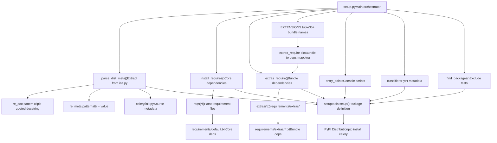
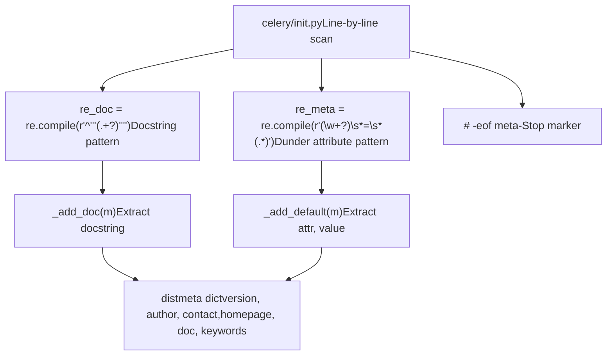
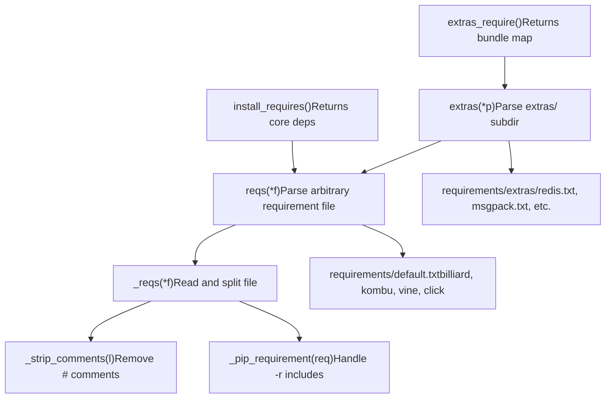
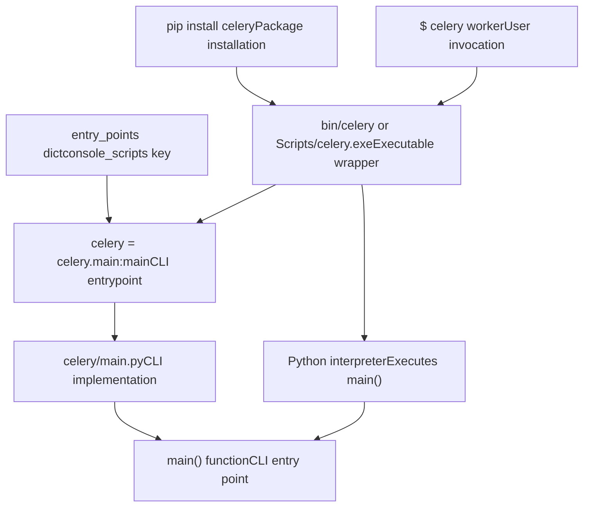

# Package Structure

Relevant source files

-   [docs/includes/installation.txt](https://github.com/celery/celery/blob/4d068b56/docs/includes/installation.txt)
-   [requirements/default.txt](https://github.com/celery/celery/blob/4d068b56/requirements/default.txt)
-   [setup.cfg](https://github.com/celery/celery/blob/4d068b56/setup.cfg)
-   [setup.py](https://github.com/celery/celery/blob/4d068b56/setup.py)

This document explains how Celery is packaged and distributed as a Python package. It covers the `setup.py` structure, metadata extraction from source files, requirement parsing, entry point registration, and setuptools integration. For information about the specific dependencies and extension bundles, see [Dependencies and Extras](/celery/celery/11.2-dependencies-and-extras). For version management and release processes, see [Version Management and Release](/celery/celery/11.3-version-management-and-release).

---

## Overview

The Celery package distribution system is defined in [setup.py1-183](https://github.com/celery/celery/blob/4d068b56/setup.py#L1-L183) which orchestrates metadata extraction, dependency management, and package configuration. The setup system supports:

-   **Dynamic metadata extraction** from source code
-   **Core dependencies** required for all installations
-   **35+ optional extension bundles** for features like brokers, backends, and concurrency models
-   **Console script entry points** for the CLI
-   **Python version constraints** and platform metadata

---

## Setup.py Architecture

The `setup.py` file follows a functional composition pattern, separating concerns into distinct functions that build up the package configuration.

**Setup.py Component Flow**


**Sources:** [setup.py1-183](https://github.com/celery/celery/blob/4d068b56/setup.py#L1-L183)

---

## Metadata Extraction System

Celery extracts package metadata dynamically from the source code using the `parse_dist_meta()` function, avoiding duplication between `setup.py` and the package's `__init__.py`.

**Metadata Extraction Process**


The extraction process in [setup.py63-76](https://github.com/celery/celery/blob/4d068b56/setup.py#L63-L76):

| Step | Action |
| --- | --- |
| 1\. Open | Opens `celery/__init__.py` for reading |
| 2\. Pattern Match | Applies `re_doc` and `re_meta` regex patterns to each line |
| 3\. Handler Dispatch | Calls `_add_doc()` or `_add_default()` based on match |
| 4\. Stop Condition | Breaks at `# -eof meta-` marker |
| 5\. Return | Returns `distmeta` dictionary with extracted values |

The patterns extract:

-   **`__version__`** - Package version string
-   **`__author__`** - Author name
-   **`__contact__`** - Contact email
-   **`__homepage__`** - Project URL
-   **`__doc__`** - Package description from module docstring
-   **`__keywords__`** - Search keywords for PyPI

**Sources:** [setup.py50-76](https://github.com/celery/celery/blob/4d068b56/setup.py#L50-L76)

---

## Requirements System

The requirements system provides a hierarchical approach to parsing dependency files from the `requirements/` directory.

**Requirements Function Chain**


### Core Functions

**`reqs(*f)`** [setup.py100-109](https://github.com/celery/celery/blob/4d068b56/setup.py#L100-L109) - Main entry point for parsing requirement files:

```
# Usage examples:
reqs('default.txt')          # requirements/default.txt
reqs('extras', 'redis.txt')  # requirements/extras/redis.txt
```
**`_pip_requirement(req)`** [setup.py85-89](https://github.com/celery/celery/blob/4d068b56/setup.py#L85-L89) - Handles recursive includes:

-   Processes `-r path/to/file.txt` syntax
-   Recursively loads referenced requirement files
-   Returns flat list of requirements

**`extras(*p)`** [setup.py112-114](https://github.com/celery/celery/blob/4d068b56/setup.py#L112-L114) - Convenience wrapper:

-   Automatically prefixes with `'extras'` directory
-   Used for all extension bundle dependencies

### Requirement File Processing

| Function | Line Range | Purpose |
| --- | --- | --- |
| `_strip_comments()` | [setup.py81-82](https://github.com/celery/celery/blob/4d068b56/setup.py#L81-L82) | Remove inline comments from requirement lines |
| `_pip_requirement()` | [setup.py85-89](https://github.com/celery/celery/blob/4d068b56/setup.py#L85-L89) | Handle `-r` recursive includes |
| `_reqs()` | [setup.py92-97](https://github.com/celery/celery/blob/4d068b56/setup.py#L92-L97) | Read file, strip comments, handle includes |
| `reqs()` | [setup.py100-109](https://github.com/celery/celery/blob/4d068b56/setup.py#L100-L109) | Flatten nested requirement lists |
| `extras()` | [setup.py112-114](https://github.com/celery/celery/blob/4d068b56/setup.py#L112-L114) | Parse files from `requirements/extras/` |
| `install_requires()` | [setup.py117-119](https://github.com/celery/celery/blob/4d068b56/setup.py#L117-L119) | Return core dependencies |
| `extras_require()` | [setup.py122-124](https://github.com/celery/celery/blob/4d068b56/setup.py#L122-L124) | Build bundle-to-deps mapping |

**Sources:** [setup.py78-124](https://github.com/celery/celery/blob/4d068b56/setup.py#L78-L124) [requirements/default.txt1-11](https://github.com/celery/celery/blob/4d068b56/requirements/default.txt#L1-L11)

---

## Extension Bundles

Celery defines 35+ optional extension bundles via the `EXTENSIONS` tuple [setup.py12-46](https://github.com/celery/celery/blob/4d068b56/setup.py#L12-L46):

**Bundle Categories**


### Bundle-to-Dependency Mapping

The `extras_require()` function [setup.py122-124](https://github.com/celery/celery/blob/4d068b56/setup.py#L122-L124) creates a dictionary mapping:

```
extras_require = {x: extras(x + '.txt') for x in EXTENSIONS}
# Result:
# {
#     'redis': ['redis>=4.5.2,!=4.5.5,<6.0.0'],
#     'msgpack': ['msgpack'],
#     'cassandra': ['cassandra-driver>=3.25.0,<4'],
#     ...
# }
```
Each bundle name corresponds to a file in `requirements/extras/{bundle}.txt` that lists the necessary pip packages.

**Installation Syntax:**

```
pip install celery[redis,msgpack]          # Multiple bundles
pip install celery[librabbitmq,auth]        # Combine broker + security
```
**Sources:** [setup.py12-46](https://github.com/celery/celery/blob/4d068b56/setup.py#L12-L46) [setup.py122-124](https://github.com/celery/celery/blob/4d068b56/setup.py#L122-L124) [docs/includes/installation.txt18-124](https://github.com/celery/celery/blob/4d068b56/docs/includes/installation.txt#L18-L124)

---

## Entry Points

Entry points define command-line executables that are created when the package is installed.

**Entry Point Configuration**


The entry point definition [setup.py154-158](https://github.com/celery/celery/blob/4d068b56/setup.py#L154-L158):

```
entry_points={
    'console_scripts': [
        'celery = celery.__main__:main',
    ]
}
```
This creates a `celery` executable that:

1.  **Import Path**: `celery.__main__`
2.  **Function Call**: `main()`
3.  **Executable Location**:
    -   Unix/Linux: `<venv>/bin/celery`
    -   Windows: `<venv>/Scripts/celery.exe`

When users run `celery worker` or any other subcommand, the wrapper script imports `celery.__main__` and calls `main()`, which initializes the CLI framework. For details on the CLI implementation, see [CLI Architecture](/celery/celery/9.1-cli-architecture).

**Sources:** [setup.py154-158](https://github.com/celery/celery/blob/4d068b56/setup.py#L154-L158)

---

## Setuptools Integration

The `setuptools.setup()` call [setup.py137-182](https://github.com/celery/celery/blob/4d068b56/setup.py#L137-L182) integrates all components into the package definition.

**Setup Call Parameters**

| Parameter | Source | Description |
| --- | --- | --- |
| `name` | `NAME` variable | Package name: `'celery'` |
| `packages` | `find_packages()` | Auto-discover packages, exclude tests |
| `version` | `meta['version']` | From `parse_dist_meta()` |
| `description` | `meta['doc']` | Short description from module docstring |
| `long_description` | `long_description()` | Full description from README.rst |
| `keywords` | `meta['keywords']` | PyPI search keywords |
| `author` | `meta['author']` | Author name from metadata |
| `author_email` | `meta['contact']` | Contact email from metadata |
| `url` | `meta['homepage']` | Project homepage URL |
| `license` | `'BSD-3-Clause'` | SPDX license identifier |
| `platforms` | `['any']` | Platform compatibility |
| `install_requires` | `install_requires()` | Core dependencies from default.txt |
| `python_requires` | `">=3.9"` | Minimum Python version |
| `tests_require` | `reqs('test.txt')` | Testing dependencies |
| `extras_require` | `extras_require()` | Optional bundle dependencies |
| `include_package_data` | `True` | Include files from MANIFEST.in |
| `entry_points` | Entry points dict | Console scripts |
| `project_urls` | URLs dict | Links to docs, changelog, issues, funding |
| `classifiers` | Classifier list | PyPI metadata for filtering/display |

### Package Discovery

The `find_packages()` call [setup.py139](https://github.com/celery/celery/blob/4d068b56/setup.py#L139-L139) automatically discovers all Python packages:

```
packages=setuptools.find_packages(exclude=['t', 't.*'])
```
This:

-   **Scans** the project root for packages (directories with `__init__.py`)
-   **Excludes** test packages (`t` and `t.*`)
-   **Includes** all subpackages like `celery.app`, `celery.worker`, `celery.backends`

### Python Version Requirements

[setup.py150](https://github.com/celery/celery/blob/4d068b56/setup.py#L150-L150) enforces Python 3.9+ through `python_requires`:

```
python_requires=">=3.9"
```
The classifiers [setup.py166-181](https://github.com/celery/celery/blob/4d068b56/setup.py#L166-L181) declare explicit version support:

-   Python 3.9, 3.10, 3.11, 3.12, 3.13
-   CPython and PyPy implementations

### Project URLs

[setup.py159-165](https://github.com/celery/celery/blob/4d068b56/setup.py#L159-L165) defines supplementary project links:

```
project_urls={
    "Documentation": "https://docs.celeryq.dev/en/stable/",
    "Changelog": "https://docs.celeryq.dev/en/stable/changelog.html",
    "Code": "https://github.com/celery/celery",
    "Tracker": "https://github.com/celery/celery/issues",
    "Funding": "https://opencollective.com/celery"
}
```
These appear on the PyPI package page and provide easy navigation for users.

**Sources:** [setup.py137-182](https://github.com/celery/celery/blob/4d068b56/setup.py#L137-L182)

---

## Additional Configuration Files

### setup.cfg

[setup.cfg1-44](https://github.com/celery/celery/blob/4d068b56/setup.cfg#L1-L44) provides additional configuration for build tools:

**Build Configuration:**

-   `[build_sphinx]` - Sphinx documentation build settings
-   `[flake8]` - Code linting rules and exclusions
-   `[bdist_rpm]` - RPM package dependencies
-   `[metadata]` - License file references

**Flake8 Linting Rules** [setup.cfg6-33](https://github.com/celery/celery/blob/4d068b56/setup.cfg#L6-L33):

-   Max line length: 117 characters
-   Ignored rules: E203 (black compatibility), D102/D104/D105/D107/D401/D412 (docstring rules), E741/E742 (ambiguous names)
-   Per-file ignores: Skip docstring checks in tests, examples, docs

### Core Dependencies

[requirements/default.txt1-11](https://github.com/celery/celery/blob/4d068b56/requirements/default.txt#L1-L11) defines the minimal dependencies:

| Dependency | Version Constraint | Purpose |
| --- | --- | --- |
| `billiard` | `>=4.2.1,<5.0` | Multiprocessing pool implementation |
| `kombu` | `>=5.6.0` | Messaging library for broker abstraction |
| `vine` | `>=5.1.0,<6.0` | Promise/futures implementation |
| `click` | `>=8.1.2,<9.0` | CLI framework |
| `click-didyoumean` | `>=0.3.0` | CLI typo suggestions |
| `click-repl` | `>=0.2.0` | Interactive REPL mode |
| `click-plugins` | `>=1.1.1` | Plugin system for CLI |
| `python-dateutil` | `>=2.8.2` | Date/time utilities |
| `exceptiongroup` | `>=1.3.0` | Exception groups (Python <3.11) |
| `tzlocal` | (latest) | Local timezone detection |

**Sources:** [setup.cfg1-44](https://github.com/celery/celery/blob/4d068b56/setup.cfg#L1-L44) [requirements/default.txt1-11](https://github.com/celery/celery/blob/4d068b56/requirements/default.txt#L1-L11)

---

## Summary

The Celery package structure implements a modular, extensible distribution system:

1.  **Dynamic Metadata**: Extracts version and author info from source code to maintain single source of truth
2.  **Hierarchical Requirements**: Separates core dependencies from 35+ optional feature bundles
3.  **Flexible Installation**: Users install only needed features via pip bundle syntax
4.  **Automated Discovery**: Finds packages automatically, excluding test directories
5.  **Entry Point Integration**: Creates CLI executables through setuptools console\_scripts
6.  **Rich PyPI Metadata**: Provides comprehensive classifiers, project URLs, and version constraints

This architecture enables Celery to support diverse use cases—from minimal deployments with just Redis to complex setups with Cassandra, eventlet, and custom serializers—while maintaining a clean dependency tree.
