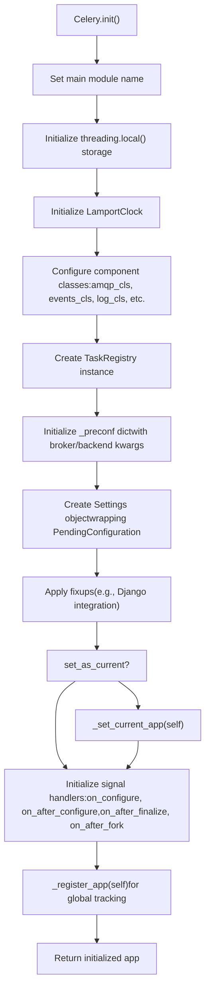
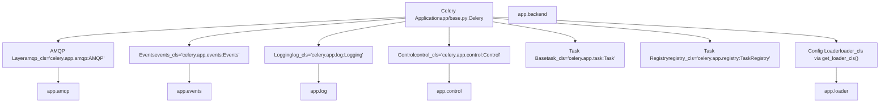
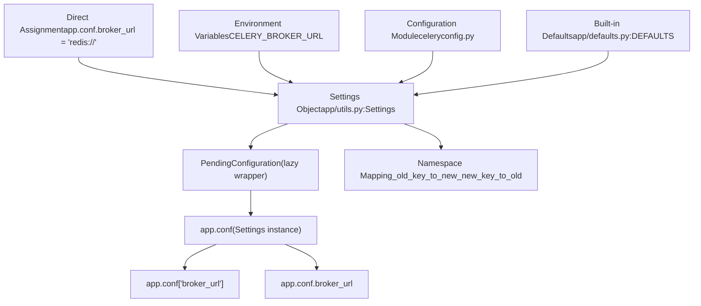
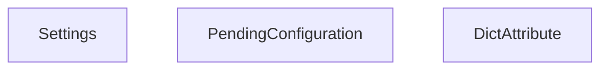
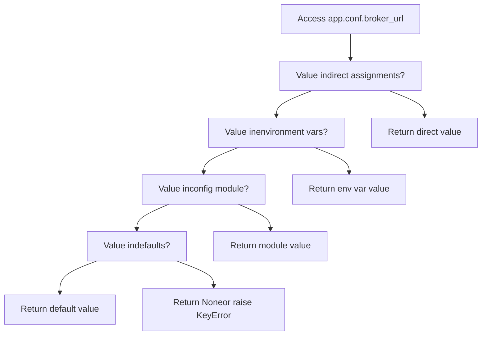
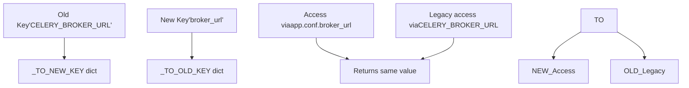
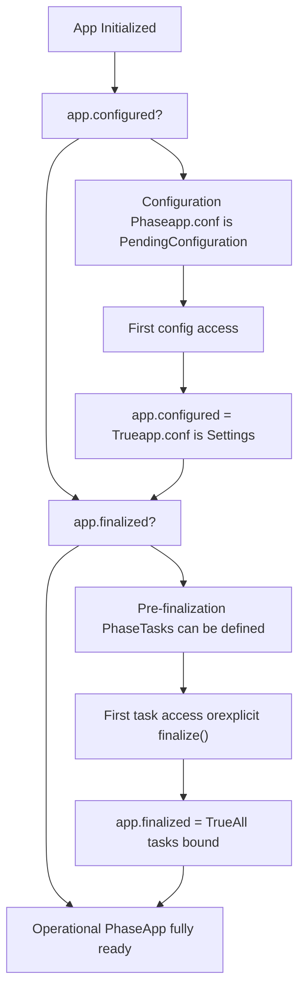
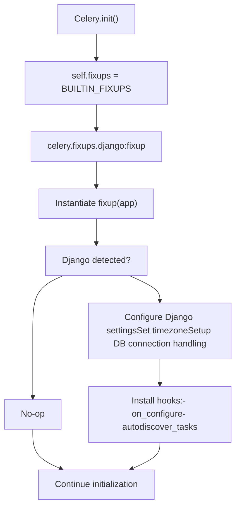

# Application Initialization and Configuration

Relevant source files

-   [celery/app/amqp.py](https://github.com/celery/celery/blob/4d068b56/celery/app/amqp.py)
-   [celery/app/base.py](https://github.com/celery/celery/blob/4d068b56/celery/app/base.py)
-   [celery/app/defaults.py](https://github.com/celery/celery/blob/4d068b56/celery/app/defaults.py)
-   [celery/app/task.py](https://github.com/celery/celery/blob/4d068b56/celery/app/task.py)
-   [celery/canvas.py](https://github.com/celery/celery/blob/4d068b56/celery/canvas.py)
-   [celery/utils/\_\_init\_\_.py](https://github.com/celery/celery/blob/4d068b56/celery/utils/__init__.py)
-   [docs/faq.rst](https://github.com/celery/celery/blob/4d068b56/docs/faq.rst)
-   [docs/getting-started/first-steps-with-celery.rst](https://github.com/celery/celery/blob/4d068b56/docs/getting-started/first-steps-with-celery.rst)
-   [docs/getting-started/next-steps.rst](https://github.com/celery/celery/blob/4d068b56/docs/getting-started/next-steps.rst)
-   [docs/userguide/calling.rst](https://github.com/celery/celery/blob/4d068b56/docs/userguide/calling.rst)
-   [docs/userguide/canvas.rst](https://github.com/celery/celery/blob/4d068b56/docs/userguide/canvas.rst)
-   [docs/userguide/monitoring.rst](https://github.com/celery/celery/blob/4d068b56/docs/userguide/monitoring.rst)
-   [docs/userguide/periodic-tasks.rst](https://github.com/celery/celery/blob/4d068b56/docs/userguide/periodic-tasks.rst)
-   [docs/userguide/routing.rst](https://github.com/celery/celery/blob/4d068b56/docs/userguide/routing.rst)
-   [docs/userguide/tasks.rst](https://github.com/celery/celery/blob/4d068b56/docs/userguide/tasks.rst)
-   [docs/userguide/workers.rst](https://github.com/celery/celery/blob/4d068b56/docs/userguide/workers.rst)
-   [t/integration/conftest.py](https://github.com/celery/celery/blob/4d068b56/t/integration/conftest.py)
-   [t/integration/tasks.py](https://github.com/celery/celery/blob/4d068b56/t/integration/tasks.py)
-   [t/integration/test\_canvas.py](https://github.com/celery/celery/blob/4d068b56/t/integration/test_canvas.py)
-   [t/integration/test\_quorum\_queue\_qos\_cluster\_simulation.py](https://github.com/celery/celery/blob/4d068b56/t/integration/test_quorum_queue_qos_cluster_simulation.py)
-   [t/integration/test\_security.py](https://github.com/celery/celery/blob/4d068b56/t/integration/test_security.py)
-   [t/integration/test\_tasks.py](https://github.com/celery/celery/blob/4d068b56/t/integration/test_tasks.py)
-   [t/smoke/tests/test\_canvas.py](https://github.com/celery/celery/blob/4d068b56/t/smoke/tests/test_canvas.py)
-   [t/unit/app/test\_app.py](https://github.com/celery/celery/blob/4d068b56/t/unit/app/test_app.py)
-   [t/unit/tasks/test\_canvas.py](https://github.com/celery/celery/blob/4d068b56/t/unit/tasks/test_canvas.py)
-   [t/unit/tasks/test\_tasks.py](https://github.com/celery/celery/blob/4d068b56/t/unit/tasks/test_tasks.py)

This document describes how Celery applications are initialized and configured. It covers the `Celery` application class, the hierarchical configuration system, configuration sources and priorities, namespace organization, and the application finalization process.

For information about how tasks are registered with the application, see [Task Registration](/celery/celery/2.2-task-registration). For information about broker and backend configuration specifics, see [Message Brokers and Routing](/celery/celery/2.3-message-brokers-and-routing) and [Result Backend Architecture](/celery/celery/6.1-backend-architecture).

## The Celery Application Class

The `Celery` class serves as the central entry point for all Celery functionality. Every Celery-based application creates at least one instance of this class, which orchestrates task registration, configuration, worker management, and message routing.

### Initialization Process

The `Celery` class is instantiated with several key parameters that define the application's identity and initial configuration:

```
app = Celery(
    main='myapp',                    # Module name for task naming
    broker='redis://localhost',      # Message broker URL
    backend='redis://localhost',     # Result backend URL
    config_source='myapp.config',    # Optional config module
    set_as_current=True,             # Set as thread-local current app
    autofinalize=True                # Automatically finalize on first use
)
```
The initialization sequence performs several critical operations:


**Sources:** [celery/app/base.py317-408](https://github.com/celery/celery/blob/4d068b56/celery/app/base.py#L317-L408)

### Key Initialization Parameters

| Parameter | Type | Default | Purpose |
| --- | --- | --- | --- |
| `main` | str | None | Module name used as prefix for auto-generated task names |
| `loader` | str/class | 'celery.loaders.app:AppLoader' | Configuration loader class |
| `broker` | str | None | Message broker URL (stored in config as `broker_url`) |
| `backend` | str | None | Result backend URL (stored in config as `result_backend`) |
| `set_as_current` | bool | True | Make this app the thread-local current app |
| `autofinalize` | bool | True | Automatically finalize app when first accessed |
| `namespace` | str | None | Configuration namespace prefix (e.g., 'CELERY') |
| `config_source` | str/object | None | Configuration module or object to load |

The `main` parameter is particularly important for standalone scripts. When tasks are defined in the `__main__` module, Celery uses this value to generate stable task names that remain consistent across different execution contexts.

**Sources:** [celery/app/base.py230-376](https://github.com/celery/celery/blob/4d068b56/celery/app/base.py#L230-L376) [docs/getting-started/first-steps-with-celery.rst116-151](https://github.com/celery/celery/blob/4d068b56/docs/getting-started/first-steps-with-celery.rst#L116-L151)

### Component Architecture

The Celery application lazily instantiates several component subsystems, each responsible for a specific aspect of functionality:


Each component class can be customized by passing an alternative class name or class object during initialization. For example, to use a custom AMQP layer:

```
app = Celery('myapp', amqp='myapp.amqp:CustomAMQP')
```
**Sources:** [celery/app/base.py289-296](https://github.com/celery/celery/blob/4d068b56/celery/app/base.py#L289-L296) [celery/app/base.py410-416](https://github.com/celery/celery/blob/4d068b56/celery/app/base.py#L410-L416)

## Configuration System Architecture

Celery's configuration system uses a hierarchical, namespace-based approach that supports multiple configuration sources with well-defined precedence rules.

### Configuration Flow


### The Settings Class

The `Settings` class provides a dict-like interface with attribute access, namespace support, and key compatibility mapping:


Before the app is configured, `app.conf` is a `PendingConfiguration` object that delays configuration finalization. On first access, it triggers finalization and becomes a `Settings` object backed by a concrete dictionary.

**Sources:** [celery/app/base.py186-228](https://github.com/celery/celery/blob/4d068b56/celery/app/base.py#L186-L228) [celery/app/utils.py](https://github.com/celery/celery/blob/4d068b56/celery/app/utils.py)

### Configuration State Machine

The application configuration goes through distinct states during its lifecycle:

> **[Mermaid stateDiagram]**
> *(图表结构无法解析)*

**Sources:** [celery/app/base.py349-383](https://github.com/celery/celery/blob/4d068b56/celery/app/base.py#L349-L383) [celery/app/base.py631-651](https://github.com/celery/celery/blob/4d068b56/celery/app/base.py#L631-L651)

## Configuration Sources and Priority

Configuration can be supplied from multiple sources. Later sources override earlier ones in this priority order (highest to lowest):

### 1\. Direct Assignment (Highest Priority)

Direct assignment to `app.conf` takes precedence over all other sources:

```
app.conf.broker_url = 'redis://localhost:6379/0'
app.conf.task_serializer = 'json'
app.conf.result_expires = 3600
```
This works even before configuration is finalized and is useful for programmatic configuration.

**Sources:** [celery/app/base.py421-424](https://github.com/celery/celery/blob/4d068b56/celery/app/base.py#L421-L424)

### 2\. Environment Variables

Environment variables with the `CELERY_` prefix (or custom namespace if set) override configuration module settings:

```
export CELERY_BROKER_URL='redis://localhost'
export CELERY_RESULT_BACKEND='redis://localhost'
export CELERY_TASK_SERIALIZER='json'
```
The loader automatically reads these during configuration.

**Sources:** [celery/loaders/base.py](https://github.com/celery/celery/blob/4d068b56/celery/loaders/base.py)

### 3\. Configuration Module

A Python module or object can provide bulk configuration:

```
# celeryconfig.py
broker_url = 'redis://localhost:6379/0'
result_backend = 'redis://localhost:6379/1'
task_serializer = 'json'
accept_content = ['json']
timezone = 'Europe/London'

# Loading the config
app.config_from_object('celeryconfig')
# or
app.config_from_envvar('CELERY_CONFIG_MODULE')
```
The `config_from_object` method accepts:

-   Module name as string (e.g., `'myapp.celeryconfig'`)
-   Module object (e.g., `import celeryconfig; app.config_from_object(celeryconfig)`)
-   Any object with configuration attributes

**Sources:** [celery/app/base.py677-717](https://github.com/celery/celery/blob/4d068b56/celery/app/base.py#L677-L717) [celery/loaders/base.py](https://github.com/celery/celery/blob/4d068b56/celery/loaders/base.py)

### 4\. Built-in Defaults (Lowest Priority)

If no other source provides a value, Celery uses built-in defaults defined in the `NAMESPACES` structure:

```
# Example defaults from defaults.py
broker_connection_timeout = 4.0  # seconds
broker_connection_retry = True
broker_connection_max_retries = 100
task_serializer = 'json'
task_always_eager = False
worker_prefetch_multiplier = 4
```
**Sources:** [celery/app/defaults.py66-363](https://github.com/celery/celery/blob/4d068b56/celery/app/defaults.py#L66-L363) [celery/app/defaults.py391-393](https://github.com/celery/celery/blob/4d068b56/celery/app/defaults.py#L391-L393)

### Configuration Override Diagram


**Sources:** [celery/app/utils.py](https://github.com/celery/celery/blob/4d068b56/celery/app/utils.py)

## Configuration Namespaces

Celery organizes configuration settings into logical namespaces. Each namespace groups related settings together, making the configuration more maintainable and discoverable.

### Namespace Structure

The `NAMESPACES` structure in `defaults.py` defines the complete configuration schema:

```mermaid
flowchart TD
    Root["Configuration Root"]
    Broker["broker_*Message broker settings"]
    Task["task_*Task execution settings"]
    Worker["worker_*Worker process settings"]
    Result["result_*Result backend settings"]
    Beat["beat_*Periodic scheduler settings"]
    Redis["redis_*Redis-specific settings"]
    Database["database_*Database backend settings"]
    Security["security_*Message signing settings"]
    Event["event_*Event monitoring settings"]
    Control["control_*Worker control settings"]
    Cache["cache_*Cache backend settings"]
    BrokerUrl["broker_url"]
    BrokerRetry["broker_connection_retry"]
    BrokerTimeout["broker_connection_timeout"]
    TaskSerializer["task_serializer"]
    TaskRoutes["task_routes"]
    TaskQueues["task_queues"]
    TaskAcksLate["task_acks_late"]
    WorkerPool["worker_pool"]
    WorkerConcurrency["worker_concurrency"]
    WorkerPrefetch["worker_prefetch_multiplier"]
    WorkerMaxTasks["worker_max_tasks_per_child"]
    ResultBackend["result_backend"]
    ResultExpires["result_expires"]
    ResultSerializer["result_serializer"]

    Root --> Broker
    Root --> Task
    Root --> Worker
    Root --> Result
    Root --> Beat
    Root --> Redis
    Root --> Database
    Root --> Security
    Root --> Event
    Root --> Control
    Root --> Cache
    Broker --> BrokerUrl
    Broker --> BrokerRetry
    Broker --> BrokerTimeout
    Task --> TaskSerializer
    Task --> TaskRoutes
    Task --> TaskQueues
    Task --> TaskAcksLate
    Worker --> WorkerPool
    Worker --> WorkerConcurrency
    Worker --> WorkerPrefetch
    Worker --> WorkerMaxTasks
    Result --> ResultBackend
    Result --> ResultExpires
    Result --> ResultSerializer
```


### Major Configuration Namespaces

| Namespace | Prefix | Purpose | Key Settings |
| --- | --- | --- | --- |
| **Broker** | `broker_` | Message broker connection and behavior | `broker_url`, `broker_connection_retry`, `broker_connection_timeout`, `broker_heartbeat` |
| **Task** | `task_` | Task execution and routing | `task_serializer`, `task_routes`, `task_queues`, `task_acks_late`, `task_time_limit`, `task_soft_time_limit` |
| **Worker** | `worker_` | Worker process configuration | `worker_pool`, `worker_concurrency`, `worker_prefetch_multiplier`, `worker_max_tasks_per_child`, `worker_redirect_stdouts` |
| **Result** | `result_` | Result backend storage | `result_backend`, `result_expires`, `result_serializer`, `result_compression`, `result_extended` |
| **Beat** | `beat_` | Periodic task scheduler | `beat_schedule`, `beat_scheduler`, `beat_schedule_filename`, `beat_max_loop_interval` |
| **Security** | `security_` | Message signing and encryption | `security_key`, `security_certificate`, `security_cert_store`, `security_digest` |
| **Event** | `event_` | Event monitoring | `event_queue_expires`, `event_queue_ttl`, `event_serializer`, `event_exchange` |

**Sources:** [celery/app/defaults.py66-363](https://github.com/celery/celery/blob/4d068b56/celery/app/defaults.py#L66-L363)

### The Option Class

Each configuration option is defined using the `Option` class, which specifies the default value, type, and deprecated/old key names:

```
class Option:
    """Describes a Celery configuration option."""

    def __init__(self, default=None, type='string', old=set(),
                 deprecate_by=None, remove_by=None, alt=None):
        self.default = default
        self.type = type  # 'string', 'int', 'float', 'bool', 'dict', 'tuple', 'any'
        self.old = old  # Set of deprecated key names
        self.deprecate_by = deprecate_by  # Version when deprecated
        self.remove_by = remove_by  # Version when removed
        self.alt = alt  # Alternative setting name
```
For example, the broker URL option is defined as:

```
broker=Namespace(
    url=Option(None, type='string'),
    read_url=Option(None, type='string'),
    write_url=Option(None, type='string'),
    transport=Option(type='string'),
    connection_timeout=Option(4, type='float'),
    # ... more options
)
```
**Sources:** [celery/app/defaults.py42-64](https://github.com/celery/celery/blob/4d068b56/celery/app/defaults.py#L42-L64) [celery/app/defaults.py83-107](https://github.com/celery/celery/blob/4d068b56/celery/app/defaults.py#L83-L107)

### Backwards Compatibility

Celery maintains backwards compatibility with old configuration key names through a mapping system:


The `_TO_NEW_KEY` and `_TO_OLD_KEY` dictionaries (generated from the `old` attribute in `Option` definitions) enable seamless translation between old and new key names.

**Sources:** [celery/app/defaults.py394-398](https://github.com/celery/celery/blob/4d068b56/celery/app/defaults.py#L394-L398) [celery/app/utils.py](https://github.com/celery/celery/blob/4d068b56/celery/app/utils.py)

## Application Finalization

Finalization is the process where the application transitions from configuration phase to operational phase. During finalization, all pending tasks are registered, components are initialized, and the app is ready to execute tasks.

### Finalization Process

> **[Mermaid sequence]**
> *(图表结构无法解析)*

### Lazy Task Evaluation

Tasks defined with decorators before finalization are stored as `PromiseProxy` objects in the `_pending` deque. During finalization, these promises are evaluated and the actual task classes are created:

```
# When task decorator is used before finalization
@app.task
def add(x, y):
    return x + y

# Internally, this creates a PromiseProxy:
ret = PromiseProxy(app._task_from_fun, (add,), options, __doc__=add.__doc__)
app._pending.append(ret)

# During finalization:
while app._pending:
    maybe_evaluate(app._pending.popleft())  # Evaluates the promise
```
**Sources:** [celery/app/base.py631-651](https://github.com/celery/celery/blob/4d068b56/celery/app/base.py#L631-L651) [celery/app/base.py538-544](https://github.com/celery/celery/blob/4d068b56/celery/app/base.py#L538-L544)

### Manual vs Automatic Finalization

| Mode | When Used | Behavior |
| --- | --- | --- |
| **Automatic** (`autofinalize=True`) | Default mode | App finalizes on first access to tasks or task registry |
| **Manual** (`autofinalize=False`) | Advanced use cases, testing | Must call `app.finalize()` explicitly before using app |

Manual finalization is useful when you need precise control over initialization order or when writing tests:

```
app = Celery('myapp', autofinalize=False)

# Configure the app
app.conf.broker_url = 'redis://localhost'
app.config_from_object('myconfig')

# Explicitly finalize when ready
app.finalize()
```
If you access tasks before finalization with `autofinalize=False`, you'll get a `RuntimeError`:

```
RuntimeError: Contract breach: app not finalized
```
**Sources:** [celery/app/base.py345](https://github.com/celery/celery/blob/4d068b56/celery/app/base.py#L345-L345) [celery/app/base.py576-577](https://github.com/celery/celery/blob/4d068b56/celery/app/base.py#L576-L577)

### Finalization State Tracking

The application tracks finalization state through several boolean flags:


**Sources:** [celery/app/base.py349](https://github.com/celery/celery/blob/4d068b56/celery/app/base.py#L349-L349) [celery/app/base.py354](https://github.com/celery/celery/blob/4d068b56/celery/app/base.py#L354-L354)

## Loaders and Fixups

Loaders and fixups provide extension points for customizing configuration loading and integrating with frameworks like Django.

### Loader System

The loader is responsible for loading configuration from various sources. Celery provides several built-in loaders:

| Loader | Class | Purpose |
| --- | --- | --- |
| **App Loader** | `celery.loaders.app:AppLoader` | Default loader, loads config from objects/modules |
| **Default Loader** | `celery.loaders.default:Loader` | Deprecated, backwards compatibility |

The loader is selected via the `loader` parameter or `CELERY_LOADER` environment variable:

```
app = Celery('myapp', loader='celery.loaders.app:AppLoader')
# or
os.environ['CELERY_LOADER'] = 'myapp.loader:CustomLoader'
```
**Sources:** [celery/app/base.py410-416](https://github.com/celery/celery/blob/4d068b56/celery/app/base.py#L410-L416) [celery/loaders/\_\_init\_\_.py](https://github.com/celery/celery/blob/4d068b56/celery/loaders/__init__.py)

### Fixup System

Fixups are plugins that modify the app's behavior for specific frameworks. The most common fixup is for Django:


The Django fixup automatically:

-   Detects Django presence
-   Loads Django settings
-   Configures timezone from Django's `TIME_ZONE`
-   Handles database connection cleanup
-   Provides `autodiscover_tasks()` for automatic task discovery

**Sources:** [celery/app/base.py60-62](https://github.com/celery/celery/blob/4d068b56/celery/app/base.py#L60-L62) [celery/app/base.py384-388](https://github.com/celery/celery/blob/4d068b56/celery/app/base.py#L384-L388) [celery/fixups/django.py](https://github.com/celery/celery/blob/4d068b56/celery/fixups/django.py)

### Custom Fixups

You can provide custom fixups during initialization:

```
app = Celery('myapp', fixups=['myapp.fixups:MyFixup'])

# Fixup class example
class MyFixup:
    def __init__(self, app):
        self.app = app

    def on_configure(self):
        """Called when app is configured"""
        pass

    def autodiscover_tasks(self):
        """Return list of packages to scan for tasks"""
        return ['myapp.tasks', 'myapp.jobs']
```
**Sources:** [celery/app/base.py385](https://github.com/celery/celery/blob/4d068b56/celery/app/base.py#L385-L385) [celery/fixups/\_\_init\_\_.py](https://github.com/celery/celery/blob/4d068b56/celery/fixups/__init__.py)

## Configuration Access Patterns

Once configured, settings can be accessed through several patterns:

### Dictionary-style Access

```
# Get with default
broker_url = app.conf.get('broker_url', 'redis://localhost')

# Direct access (raises KeyError if missing)
broker_url = app.conf['broker_url']

# Set value
app.conf['task_serializer'] = 'json'
```
### Attribute-style Access

```
# Get attribute
broker_url = app.conf.broker_url

# Set attribute
app.conf.task_serializer = 'json'

# Check existence
if hasattr(app.conf, 'result_backend'):
    backend = app.conf.result_backend
```
### Namespace Traversal

```
# Access nested namespace settings
broker_timeout = app.conf.get_by_parts('broker', 'connection_timeout')
# Equivalent to: app.conf.broker_connection_timeout
```
### Bulk Updates

```
# Update multiple settings at once
app.conf.update(
    broker_url='redis://localhost',
    result_backend='redis://localhost',
    task_serializer='json',
    accept_content=['json'],
)
```
**Sources:** [celery/app/utils.py](https://github.com/celery/celery/blob/4d068b56/celery/app/utils.py) [celery/app/base.py720-722](https://github.com/celery/celery/blob/4d068b56/celery/app/base.py#L720-L722)

## Configuration Best Practices

1.  **Use configuration modules for production**: Keep configuration in separate files rather than hardcoding in application code.

2.  **Leverage environment variables**: Override configuration per-environment using `CELERY_*` environment variables.

3.  **Namespace custom settings**: If adding custom settings, follow the namespace pattern (e.g., `myapp_setting_name`).

4.  **Finalize explicitly in tests**: Use `autofinalize=False` and call `finalize()` explicitly for better test control.

5.  **Validate configuration early**: Access configuration during app startup to catch errors before workers start.

6.  **Document custom settings**: If extending configuration, document new settings with their types and defaults.


**Sources:** [docs/userguide/tasks.rst1-435](https://github.com/celery/celery/blob/4d068b56/docs/userguide/tasks.rst#L1-L435) [docs/getting-started/first-steps-with-celery.rst1-397](https://github.com/celery/celery/blob/4d068b56/docs/getting-started/first-steps-with-celery.rst#L1-L397)

---

**Primary Sources:**

-   [celery/app/base.py1-2800](https://github.com/celery/celery/blob/4d068b56/celery/app/base.py#L1-L2800)
-   [celery/app/defaults.py1-436](https://github.com/celery/celery/blob/4d068b56/celery/app/defaults.py#L1-L436)
-   [celery/app/utils.py](https://github.com/celery/celery/blob/4d068b56/celery/app/utils.py)
-   [celery/loaders/base.py](https://github.com/celery/celery/blob/4d068b56/celery/loaders/base.py)
-   [docs/getting-started/first-steps-with-celery.rst1-397](https://github.com/celery/celery/blob/4d068b56/docs/getting-started/first-steps-with-celery.rst#L1-L397)
-   [docs/userguide/tasks.rst89-436](https://github.com/celery/celery/blob/4d068b56/docs/userguide/tasks.rst#L89-L436)
