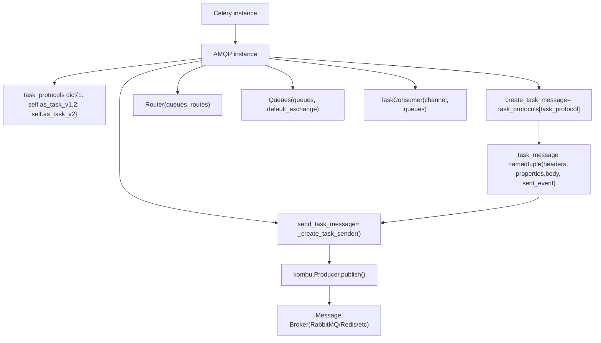
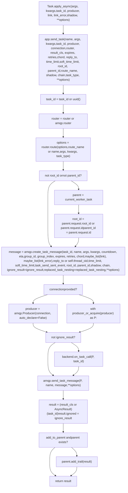

# AMQP Layer and Message Protocol

Relevant source files

-   [celery/app/amqp.py](https://github.com/celery/celery/blob/4d068b56/celery/app/amqp.py)
-   [celery/app/base.py](https://github.com/celery/celery/blob/4d068b56/celery/app/base.py)
-   [celery/app/task.py](https://github.com/celery/celery/blob/4d068b56/celery/app/task.py)
-   [celery/canvas.py](https://github.com/celery/celery/blob/4d068b56/celery/canvas.py)
-   [celery/utils/\_\_init\_\_.py](https://github.com/celery/celery/blob/4d068b56/celery/utils/__init__.py)
-   [docs/userguide/canvas.rst](https://github.com/celery/celery/blob/4d068b56/docs/userguide/canvas.rst)
-   [t/integration/conftest.py](https://github.com/celery/celery/blob/4d068b56/t/integration/conftest.py)
-   [t/integration/tasks.py](https://github.com/celery/celery/blob/4d068b56/t/integration/tasks.py)
-   [t/integration/test\_canvas.py](https://github.com/celery/celery/blob/4d068b56/t/integration/test_canvas.py)
-   [t/integration/test\_quorum\_queue\_qos\_cluster\_simulation.py](https://github.com/celery/celery/blob/4d068b56/t/integration/test_quorum_queue_qos_cluster_simulation.py)
-   [t/integration/test\_security.py](https://github.com/celery/celery/blob/4d068b56/t/integration/test_security.py)
-   [t/integration/test\_tasks.py](https://github.com/celery/celery/blob/4d068b56/t/integration/test_tasks.py)
-   [t/smoke/tests/test\_canvas.py](https://github.com/celery/celery/blob/4d068b56/t/smoke/tests/test_canvas.py)
-   [t/unit/app/test\_app.py](https://github.com/celery/celery/blob/4d068b56/t/unit/app/test_app.py)
-   [t/unit/tasks/test\_canvas.py](https://github.com/celery/celery/blob/4d068b56/t/unit/tasks/test_canvas.py)
-   [t/unit/tasks/test\_tasks.py](https://github.com/celery/celery/blob/4d068b56/t/unit/tasks/test_tasks.py)

## Purpose and Scope

The AMQP layer (`celery.app.amqp.AMQP`) creates, serializes, and publishes task messages to message brokers. This document covers message protocol versions (v1/v2), the `task_message` structure, serialization logic, and the `send_task_message` publishing mechanism.

Related: [2.3 Message Brokers and Routing](https://github.com/celery/celery/blob/4d068b56/2.3 Message Brokers and Routing) [3.1 Task Definition and Invocation](https://github.com/celery/celery/blob/4d068b56/3.1 Task Definition and Invocation)

## The AMQP Class

The `AMQP` class [celery/app/amqp.py219-673](https://github.com/celery/celery/blob/4d068b56/celery/app/amqp.py#L219-L673) provides the application's AMQP interface, accessible via `app.amqp`. It coordinates message creation, serialization, and broker publishing.

**celery.app.amqp.AMQP Architecture**


**Sources:** [celery/app/amqp.py219-265](https://github.com/celery/celery/blob/4d068b56/celery/app/amqp.py#L219-L265) [celery/app/amqp.py259-265](https://github.com/celery/celery/blob/4d068b56/celery/app/amqp.py#L259-L265) [celery/app/base.py820-959](https://github.com/celery/celery/blob/4d068b56/celery/app/base.py#L820-L959)

### Core Components

| Component | Type | Purpose |
| --- | --- | --- |
| `task_protocols` | dict | Maps protocol version (1 or 2) to `as_task_v1` or `as_task_v2` methods |
| `create_task_message` | cached\_property | Resolves to `task_protocols[app.conf.task_protocol]` |
| `send_task_message` | cached\_property | Returns closure from `_create_task_sender()` |
| `Router()` | method | Creates `celery.app.routes.Router` instance |
| `Queues()` | method | Creates `celery.app.amqp.Queues` instance |
| `TaskConsumer()` | method | Creates `kombu.Consumer` for task queues |

**AMQP.**init** Structure** [celery/app/amqp.py251-257](https://github.com/celery/celery/blob/4d068b56/celery/app/amqp.py#L251-L257):

```
def __init__(self, app):
    self.app = app
    self.task_protocols = {
        1: self.as_task_v1,
        2: self.as_task_v2,
    }
    self.app._conf.bind_to(self._handle_conf_update)
```
**Sources:** [celery/app/amqp.py219-318](https://github.com/celery/celery/blob/4d068b56/celery/app/amqp.py#L219-L318)

## Task Message Protocol Versions

Celery supports two message protocol versions. The protocol version is configured via `app.conf.task_protocol` (default is 2).

### Protocol v2 (Current)

Protocol v2 is the current and recommended message format. It separates message metadata into headers, properties, and body sections for better structure and extensibility.

#### Message Creation with as\_task\_v2

The `as_task_v2` method [celery/app/amqp.py320-412](https://github.com/celery/celery/blob/4d068b56/celery/app/amqp.py#L320-L412) creates protocol v2 messages:

**as\_task\_v2() Processing Pipeline**

**Sources:** [celery/app/amqp.py320-412](https://github.com/celery/celery/blob/4d068b56/celery/app/amqp.py#L320-L412)

#### v2 Message Structure

The v2 protocol structures data as follows:

| Component | Contents | Purpose |
| --- | --- | --- |
| **headers** | Task metadata (name, id, eta, expires, retries, timelimits, origin, etc.) | Core task execution parameters |
| **properties** | AMQP message properties (correlation\_id, reply\_to) | Broker-level message handling |
| **body** | Tuple of (args, kwargs, embed dict) | Task arguments and embedded objects (callbacks, errbacks, chain, chord) |
| **sent\_event** | Event data for monitoring (optional) | Task-sent event tracking |

**Headers Dictionary Structure** [celery/app/amqp.py364-385](https://github.com/celery/celery/blob/4d068b56/celery/app/amqp.py#L364-L385):

```
headers = {
    'lang': 'py',                    # Language
    'task': name,                    # Task name
    'id': task_id,                   # Task UUID
    'shadow': shadow,                # Shadow name for logging
    'eta': eta,                      # ISO8601 ETA
    'expires': expires,              # ISO8601 expiration
    'group': group_id,               # Group ID (for groups)
    'group_index': group_index,      # Index within group
    'retries': retries,              # Retry count
    'timelimit': [time_limit, soft_time_limit],
    'root_id': root_id,              # Root task ID in chain
    'parent_id': parent_id,          # Parent task ID
    'argsrepr': argsrepr,            # String repr of args
    'kwargsrepr': kwargsrepr,        # String repr of kwargs
    'origin': origin,                # Node name
    'ignore_result': ignore_result,  # Result backend flag
    'replaced_task_nesting': replaced_task_nesting,
    'stamped_headers': stamped_headers,  # List of stamped header keys
    'stamps': stamps,                # Stamped header values
}
```
**Body Tuple Structure** [celery/app/amqp.py393-400](https://github.com/celery/celery/blob/4d068b56/celery/app/amqp.py#L393-L400):

```
body = (
    args,      # Task positional arguments
    kwargs,    # Task keyword arguments
    {
        'callbacks': callbacks,    # Success callbacks
        'errbacks': errbacks,      # Error callbacks
        'chain': chain,            # Chain continuation
        'chord': chord,            # Chord body signature
    }
)
```
**Sources:** [celery/app/amqp.py320-412](https://github.com/celery/celery/blob/4d068b56/celery/app/amqp.py#L320-L412)

### Protocol v1 (Legacy)

Protocol v1 is the legacy format maintained for backward compatibility. It stores all task metadata in the message body rather than headers.

The `as_task_v1` method creates v1 protocol messages [celery/app/amqp.py414-472](https://github.com/celery/celery/blob/4d068b56/celery/app/amqp.py#L414-L472):

**v1 Message Structure:**

| Component | Contents | Purpose |
| --- | --- | --- |
| **headers** | Empty dict | Unused in v1 |
| **properties** | correlation\_id, reply\_to | AMQP properties |
| **body** | Single dict with all task data | All metadata and arguments combined |

**Body Dictionary Structure** [celery/app/amqp.py446-462](https://github.com/celery/celery/blob/4d068b56/celery/app/amqp.py#L446-L462):

```
body = {
    'task': name,
    'id': task_id,
    'args': args,
    'kwargs': kwargs,
    'group': group_id,
    'group_index': group_index,
    'retries': retries,
    'eta': eta,
    'expires': expires,
    'utc': utc,
    'callbacks': callbacks,
    'errbacks': errbacks,
    'timelimit': (time_limit, soft_time_limit),
    'taskset': group_id,  # Compat alias
    'chord': chord,
}
```
**Sources:** [celery/app/amqp.py414-472](https://github.com/celery/celery/blob/4d068b56/celery/app/amqp.py#L414-L472)

## The task\_message Namedtuple

Both protocol versions return a `task_message` namedtuple that encapsulates the complete message structure [celery/app/amqp.py32-33](https://github.com/celery/celery/blob/4d068b56/celery/app/amqp.py#L32-L33):

```
task_message = namedtuple('task_message',
                          ('headers', 'properties', 'body', 'sent_event'))
```
This structure is then passed to `send_task_message` for serialization and publishing to the broker.

**Sources:** [celery/app/amqp.py32-33](https://github.com/celery/celery/blob/4d068b56/celery/app/amqp.py#L32-L33)

## Message Creation Flow

**Message Creation and Publishing Flow**

> **[Mermaid sequence]**
> *(图表结构无法解析)*

**Sources:** [celery/app/task.py446-613](https://github.com/celery/celery/blob/4d068b56/celery/app/task.py#L446-L613) [celery/app/base.py820-959](https://github.com/celery/celery/blob/4d068b56/celery/app/base.py#L820-L959) [celery/app/amqp.py259-265](https://github.com/celery/celery/blob/4d068b56/celery/app/amqp.py#L259-L265) [celery/app/amqp.py320-412](https://github.com/celery/celery/blob/4d068b56/celery/app/amqp.py#L320-L412) [celery/app/amqp.py479-567](https://github.com/celery/celery/blob/4d068b56/celery/app/amqp.py#L479-L567)

## Message Serialization

### Argument Validation and Type Checking

Before message creation, the protocol methods validate argument types [celery/app/amqp.py332-335](https://github.com/celery/celery/blob/4d068b56/celery/app/amqp.py#L332-L335):

```
if not isinstance(args, (list, tuple)):
    raise TypeError('task args must be a list or tuple')
if not isinstance(kwargs, Mapping):
    raise TypeError('task keyword arguments must be a mapping')
```
**Sources:** [celery/app/amqp.py330-335](https://github.com/celery/celery/blob/4d068b56/celery/app/amqp.py#L330-L335)

### Time-based Fields Processing

The protocol handles countdown and relative expires by converting them to absolute datetime values:

**Countdown to ETA Conversion** [celery/app/amqp.py336-342](https://github.com/celery/celery/blob/4d068b56/celery/app/amqp.py#L336-L342):

```
if countdown:
    self._verify_seconds(countdown, 'countdown')
    now = now or self.app.now()
    timezone = timezone or self.app.timezone
    eta = maybe_make_aware(
        now + timedelta(seconds=countdown), tz=timezone,
    )
```
**Expires Conversion** [celery/app/amqp.py343-349](https://github.com/celery/celery/blob/4d068b56/celery/app/amqp.py#L343-L349):

```
if isinstance(expires, numbers.Real):
    self._verify_seconds(expires, 'expires')
    now = now or self.app.now()
    timezone = timezone or self.app.timezone
    expires = maybe_make_aware(
        now + timedelta(seconds=expires), tz=timezone,
    )
```
Both ETA and expires are then converted to ISO8601 format strings [celery/app/amqp.py350-354](https://github.com/celery/celery/blob/4d068b56/celery/app/amqp.py#L350-L354):

```
if not isinstance(eta, str):
    eta = eta and eta.isoformat()
if not isinstance(expires, str):
    expires = expires and expires.isoformat()
```
**Sources:** [celery/app/amqp.py336-354](https://github.com/celery/celery/blob/4d068b56/celery/app/amqp.py#L336-L354)

### Argument Representation

For logging and monitoring, the protocol generates safe string representations of arguments using `saferepr` with configurable size limits [celery/app/amqp.py356-359](https://github.com/celery/celery/blob/4d068b56/celery/app/amqp.py#L356-L359):

```
if argsrepr is None:
    argsrepr = saferepr(args, self.argsrepr_maxsize)
if kwargsrepr is None:
    kwargsrepr = saferepr(kwargs, self.kwargsrepr_maxsize)
```
The max sizes are configurable:

-   `argsrepr_maxsize`: Default 1024 bytes [celery/app/amqp.py246](https://github.com/celery/celery/blob/4d068b56/celery/app/amqp.py#L246-L246)
-   `kwargsrepr_maxsize`: Default 1024 bytes [celery/app/amqp.py249](https://github.com/celery/celery/blob/4d068b56/celery/app/amqp.py#L249-L249)

**Sources:** [celery/app/amqp.py244-249](https://github.com/celery/celery/blob/4d068b56/celery/app/amqp.py#L244-L249) [celery/app/amqp.py356-359](https://github.com/celery/celery/blob/4d068b56/celery/app/amqp.py#L356-L359)

### Root ID Defaulting

If no root\_id is provided, it defaults to the task\_id [celery/app/amqp.py361-362](https://github.com/celery/celery/blob/4d068b56/celery/app/amqp.py#L361-L362):

```
if not root_id:
    root_id = task_id
```
This ensures every task in a workflow can trace back to the original root task.

**Sources:** [celery/app/amqp.py361-362](https://github.com/celery/celery/blob/4d068b56/celery/app/amqp.py#L361-L362)

### Stamped Headers

Protocol v2 supports stamped headers for workflow tracking. The `stamped_headers` list identifies which header keys are stamps, and the `stamps` dict contains their values [celery/app/amqp.py364](https://github.com/celery/celery/blob/4d068b56/celery/app/amqp.py#L364-L364):

```
stamps = {header: options[header] for header in stamped_headers or []}
```
**Sources:** [celery/app/amqp.py364](https://github.com/celery/celery/blob/4d068b56/celery/app/amqp.py#L364-L364) [celery/canvas.py553-612](https://github.com/celery/celery/blob/4d068b56/celery/canvas.py#L553-L612)

## Message Sending

The `_create_task_sender` method returns a closure `send_task_message` that handles the actual message publishing [celery/app/amqp.py479-567](https://github.com/celery/celery/blob/4d068b56/celery/app/amqp.py#L479-L567)

### Message Sending Flow

**send\_task\_message() Internal Logic**

**Sources:** [celery/app/amqp.py479-567](https://github.com/celery/celery/blob/4d068b56/celery/app/amqp.py#L479-L567)

### Queue and Exchange Resolution

The sender resolves the target queue and exchange in this order [celery/app/amqp.py515-543](https://github.com/celery/celery/blob/4d068b56/celery/app/amqp.py#L515-L543):

1.  **Queue Resolution**: If queue name is string, look up in `app.amqp.queues`
2.  **Delivery Mode**: Use queue's exchange delivery\_mode, or default to `task_default_delivery_mode`
3.  **Exchange Type**: Extract from queue's exchange or default to 'direct'
4.  **Anonymous Exchange Conversion**: For direct exchanges without explicit exchange/routing\_key, use anonymous exchange (exchange='', routing\_key=queue\_name)
5.  **Named Exchange**: Otherwise use queue's exchange name or default exchange

**Sources:** [celery/app/amqp.py515-543](https://github.com/celery/celery/blob/4d068b56/celery/app/amqp.py#L515-L543)

### Serialization and Compression

The actual serialization and compression is delegated to the Kombu Producer [celery/app/amqp.py559-565](https://github.com/celery/celery/blob/4d068b56/celery/app/amqp.py#L559-L565):

```
ret = producer.publish(
    body,
    exchange=exchange,
    routing_key=routing_key,
    serializer=serializer or default_serializer,
    compression=compression or default_compressor,
    retry=retry, retry_policy=_rp,
    # ... other options
)
```
The serializer and compression are determined by:

-   Explicit `serializer` option in task options
-   `task_serializer` configuration (default: 'json')
-   Explicit `compression` option in task options
-   `task_compression` configuration (default: None)

**Sources:** [celery/app/amqp.py559-567](https://github.com/celery/celery/blob/4d068b56/celery/app/amqp.py#L559-L567) [celery/app/amqp.py497-498](https://github.com/celery/celery/blob/4d068b56/celery/app/amqp.py#L497-L498)

### Signals

Three signals are sent during message publishing [celery/app/amqp.py485-491](https://github.com/celery/celery/blob/4d068b56/celery/app/amqp.py#L485-L491) [celery/app/amqp.py552-558](https://github.com/celery/celery/blob/4d068b56/celery/app/amqp.py#L552-L558) [celery/app/amqp.py568-573](https://github.com/celery/celery/blob/4d068b56/celery/app/amqp.py#L568-L573):

1.  **before\_task\_publish**: Sent before publishing, allows modification of message
2.  **after\_task\_publish**: Sent after successful publish
3.  **task\_sent**: Legacy compatibility signal (deprecated)

**Sources:** [celery/app/amqp.py485-491](https://github.com/celery/celery/blob/4d068b56/celery/app/amqp.py#L485-L491) [celery/app/amqp.py552-573](https://github.com/celery/celery/blob/4d068b56/celery/app/amqp.py#L552-L573)

## Configuration Options

Key configuration settings that affect the AMQP layer:

| Setting | Default | Purpose |
| --- | --- | --- |
| `task_protocol` | 2 | Message protocol version (1 or 2) |
| `task_serializer` | 'json' | Serialization format (json, pickle, yaml, msgpack) |
| `task_compression` | None | Compression method (zlib, bzip2) |
| `task_publish_retry` | True | Enable retry on connection failure |
| `task_publish_retry_policy` | {...} | Retry policy configuration |
| `task_default_delivery_mode` | 2 | AMQP delivery mode (1=transient, 2=persistent) |
| `task_default_queue` | 'celery' | Default queue name |
| `task_default_exchange` | 'celery' | Default exchange name |
| `task_default_routing_key` | 'celery' | Default routing key |
| `task_send_sent_event` | False | Send task-sent monitoring events |

**Sources:** [celery/app/defaults.py](https://github.com/celery/celery/blob/4d068b56/celery/app/defaults.py) [celery/app/amqp.py479-498](https://github.com/celery/celery/blob/4d068b56/celery/app/amqp.py#L479-L498)

## Integration with Task Submission

The AMQP layer is invoked from the application's `send_task` method [celery/app/base.py820-959](https://github.com/celery/celery/blob/4d068b56/celery/app/base.py#L820-L959):

**app.send\_task() Integration**


Integration points:

-   `Task.apply_async()` invokes `app.send_task()` with task name [celery/app/task.py608-613](https://github.com/celery/celery/blob/4d068b56/celery/app/task.py#L608-L613)
-   `app.send_task()` generates UUID, routes task, creates message [celery/app/base.py838-934](https://github.com/celery/celery/blob/4d068b56/celery/app/base.py#L838-L934)
-   Message sent via `producer_or_acquire()` from producer pool [celery/app/base.py943-947](https://github.com/celery/celery/blob/4d068b56/celery/app/base.py#L943-L947)
-   Returns `AsyncResult` immediately without blocking [celery/app/base.py948-959](https://github.com/celery/celery/blob/4d068b56/celery/app/base.py#L948-L959)

**Sources:** [celery/app/task.py446-613](https://github.com/celery/celery/blob/4d068b56/celery/app/task.py#L446-L613) [celery/app/base.py820-959](https://github.com/celery/celery/blob/4d068b56/celery/app/base.py#L820-L959)

## Example Message Structures

### Protocol v2 Example

```
task_message(
    headers={
        'lang': 'py',
        'task': 'tasks.add',
        'id': 'd3a7f2b0-1234-5678-9abc-def123456789',
        'shadow': None,
        'eta': '2024-01-15T10:30:00.000000+00:00',
        'expires': None,
        'group': None,
        'group_index': None,
        'retries': 0,
        'timelimit': [None, None],
        'root_id': 'd3a7f2b0-1234-5678-9abc-def123456789',
        'parent_id': None,
        'argsrepr': '(2, 3)',
        'kwargsrepr': '{}',
        'origin': 'gen123@hostname',
        'ignore_result': False,
        'replaced_task_nesting': 0,
        'stamped_headers': None,
        'stamps': {},
    },
    properties={
        'correlation_id': 'd3a7f2b0-1234-5678-9abc-def123456789',
        'reply_to': 'gen123@hostname',
    },
    body=(
        (2, 3),  # args
        {},      # kwargs
        {
            'callbacks': None,
            'errbacks': None,
            'chain': None,
            'chord': None,
        }
    ),
    sent_event=None  # or event dict if task_send_sent_event=True
)
```
### Protocol v1 Example

```
task_message(
    headers={},
    properties={
        'correlation_id': 'd3a7f2b0-1234-5678-9abc-def123456789',
        'reply_to': 'gen123@hostname',
    },
    body={
        'task': 'tasks.add',
        'id': 'd3a7f2b0-1234-5678-9abc-def123456789',
        'args': (2, 3),
        'kwargs': {},
        'group': None,
        'group_index': None,
        'retries': 0,
        'eta': '2024-01-15T10:30:00.000000+00:00',
        'expires': None,
        'utc': True,
        'callbacks': None,
        'errbacks': None,
        'timelimit': (None, None),
        'taskset': None,
        'chord': None,
    },
    sent_event=None
)
```
**Sources:** [celery/app/amqp.py320-472](https://github.com/celery/celery/blob/4d068b56/celery/app/amqp.py#L320-L472)
