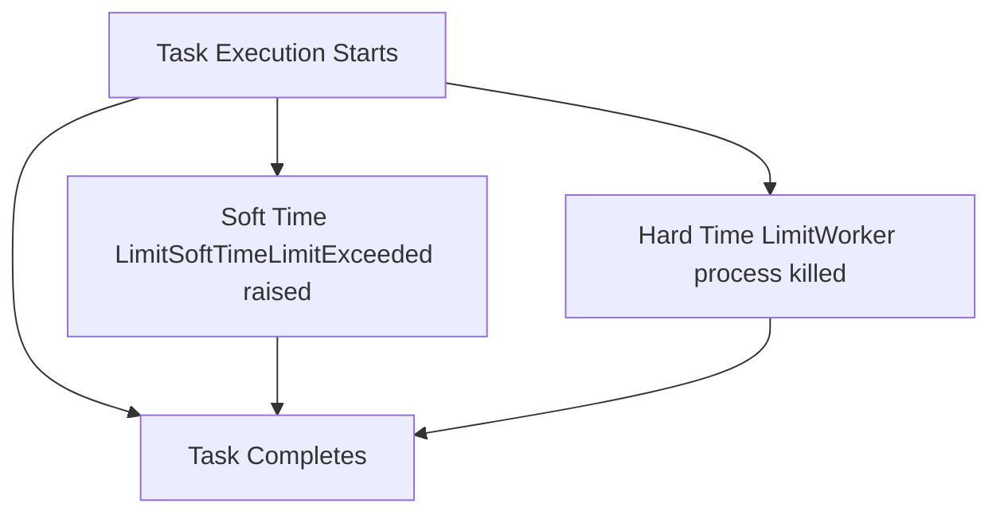
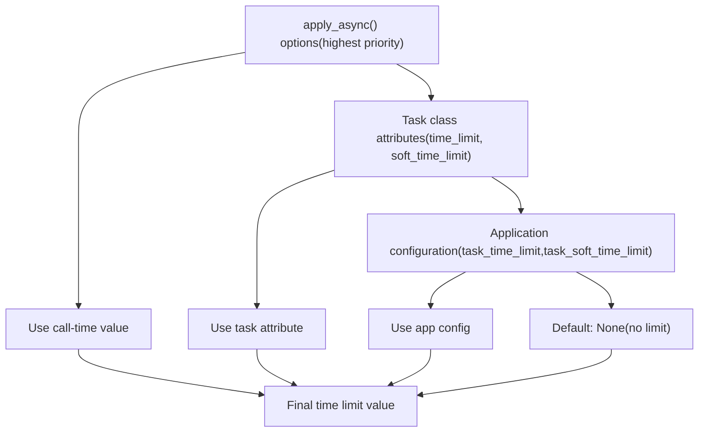
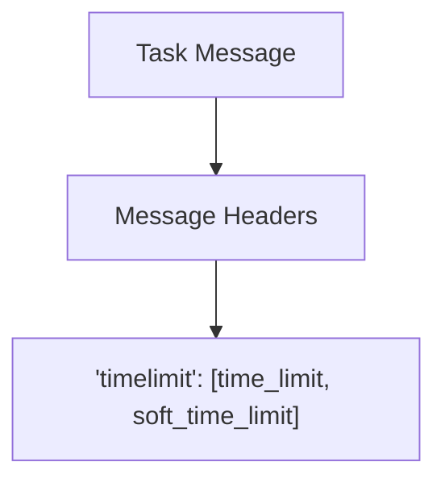
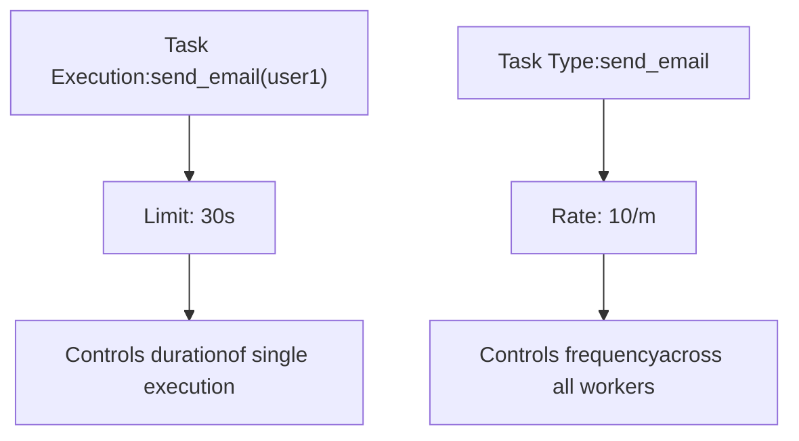

# Time Limits and Rate Limits

Relevant source files

-   [celery/app/defaults.py](https://github.com/celery/celery/blob/4d068b56/celery/app/defaults.py)
-   [docs/faq.rst](https://github.com/celery/celery/blob/4d068b56/docs/faq.rst)
-   [docs/getting-started/first-steps-with-celery.rst](https://github.com/celery/celery/blob/4d068b56/docs/getting-started/first-steps-with-celery.rst)
-   [docs/getting-started/next-steps.rst](https://github.com/celery/celery/blob/4d068b56/docs/getting-started/next-steps.rst)
-   [docs/userguide/calling.rst](https://github.com/celery/celery/blob/4d068b56/docs/userguide/calling.rst)
-   [docs/userguide/monitoring.rst](https://github.com/celery/celery/blob/4d068b56/docs/userguide/monitoring.rst)
-   [docs/userguide/periodic-tasks.rst](https://github.com/celery/celery/blob/4d068b56/docs/userguide/periodic-tasks.rst)
-   [docs/userguide/routing.rst](https://github.com/celery/celery/blob/4d068b56/docs/userguide/routing.rst)
-   [docs/userguide/tasks.rst](https://github.com/celery/celery/blob/4d068b56/docs/userguide/tasks.rst)
-   [docs/userguide/workers.rst](https://github.com/celery/celery/blob/4d068b56/docs/userguide/workers.rst)

## Purpose and Scope

This page describes Celery's mechanisms for controlling task execution time and throughput. Time limits prevent tasks from running indefinitely, while rate limits control how frequently tasks execute. For information about task retries and error handling, see [Error Handling and Retry](/celery/celery/3.3-error-handling-and-retry).

## Overview

Celery provides two complementary control mechanisms:

| Mechanism | Purpose | Scope |
| --- | --- | --- |
| **Time Limits** | Maximum execution duration for a single task invocation | Per-task execution |
| **Rate Limits** | Maximum task execution frequency | Per-task type |

Both mechanisms can be configured at the task definition level or overridden per invocation.

**Sources:** [celery/app/task.py236-242](https://github.com/celery/celery/blob/4d068b56/celery/app/task.py#L236-L242) [celery/app/task.py208](https://github.com/celery/celery/blob/4d068b56/celery/app/task.py#L208-L208)

## Time Limits

### Hard and Soft Time Limits

Celery supports two types of time limits:


**Soft Time Limit** (`soft_time_limit`):

-   Raises `SoftTimeLimitExceeded` exception in the task
-   Task can catch the exception and perform cleanup
-   Allows graceful handling of timeout situations
-   Configured in seconds

**Hard Time Limit** (`time_limit`):

-   Forcefully terminates the worker process executing the task
-   Cannot be caught by the task
-   Used as a last resort when soft limit is insufficient
-   Configured in seconds

**Sources:** [celery/app/task.py236-242](https://github.com/celery/celery/blob/4d068b56/celery/app/task.py#L236-L242) [docs/userguide/tasks.rst62-65](https://github.com/celery/celery/blob/4d068b56/docs/userguide/tasks.rst#L62-L65)

### Task-Level Configuration

Time limits are defined as class attributes on the `Task` class:

```
class Task:
    #: Hard time limit.
    #: Defaults to the :setting:`task_time_limit` setting.
    time_limit = None

    #: Soft time limit.
    #: Defaults to the :setting:`task_soft_time_limit` setting.
    soft_time_limit = None
```
Example task definition:

```
@app.task(time_limit=60, soft_time_limit=50)
def process_document(document_id):
    # Task will receive SoftTimeLimitExceeded after 50 seconds
    # Task will be killed after 60 seconds
    pass
```
**Sources:** [celery/app/task.py236-242](https://github.com/celery/celery/blob/4d068b56/celery/app/task.py#L236-L242)

### Per-Invocation Configuration

Time limits can be overridden when calling a task:

```
# Override at call time
result = process_document.apply_async(
    args=(doc_id,),
    time_limit=120,
    soft_time_limit=100
)
```
The `apply_async` method accepts `time_limit` and `soft_time_limit` as execution options alongside other parameters like `countdown`, `eta`, and `queue`.

**Sources:** [celery/app/task.py446-613](https://github.com/celery/celery/blob/4d068b56/celery/app/task.py#L446-L613) [celery/app/base.py826-828](https://github.com/celery/celery/blob/4d068b56/celery/app/base.py#L826-L828)

### Configuration Hierarchy


The resolution order ensures maximum flexibility:

1.  Call-time options (via `apply_async`)
2.  Task class attributes
3.  Application-wide configuration settings
4.  No limit (None)

**Sources:** [celery/app/task.py325-336](https://github.com/celery/celery/blob/4d068b56/celery/app/task.py#L325-L336) [celery/app/task.py580-581](https://github.com/celery/celery/blob/4d068b56/celery/app/task.py#L580-L581)

### Time Limit Validation

Celery validates that soft time limits do not exceed hard time limits:

```
if self.soft_time_limit and self.time_limit and self.soft_time_limit > self.time_limit:
    raise ValueError('soft_time_limit must be less than or equal to time_limit')
```
This validation occurs during `apply_async` to fail fast on configuration errors.

**Sources:** [celery/app/task.py564-565](https://github.com/celery/celery/blob/4d068b56/celery/app/task.py#L564-L565)

### Time Limits in Task Messages

Time limits are encoded in the task message protocol:

#### Protocol Version 2 (Default)


In protocol v2, time limits are stored in the message headers as a two-element list:

```
headers = {
    'timelimit': [time_limit, soft_time_limit],
    # ... other headers
}
```
The `AMQP.as_task_v2` method creates this structure:

```
def as_task_v2(self, task_id, name, args=None, kwargs=None,
               countdown=None, eta=None, ...,
               time_limit=None, soft_time_limit=None,
               ...):
    headers = {
        ...
        'timelimit': [time_limit, soft_time_limit],
        ...
    }
```
**Sources:** [celery/app/amqp.py320-328](https://github.com/celery/celery/blob/4d068b56/celery/app/amqp.py#L320-L328) [celery/app/amqp.py375](https://github.com/celery/celery/blob/4d068b56/celery/app/amqp.py#L375-L375)

### Task Request Context

During execution, the worker populates the task's request context with time limit information:

```
class Context:
    timelimit = None  # Tuple: (hard_limit, soft_limit)
```
The `as_execution_options` method unpacks the tuple:

```
def as_execution_options(self):
    limit_hard, limit_soft = self.timelimit or (None, None)
    execution_options = {
        ...
        'soft_time_limit': limit_soft,
        'time_limit': limit_hard,
        ...
    }
```
**Sources:** [celery/app/task.py94](https://github.com/celery/celery/blob/4d068b56/celery/app/task.py#L94-L94) [celery/app/task.py126-153](https://github.com/celery/celery/blob/4d068b56/celery/app/task.py#L126-L153)

### Handling Soft Time Limits

Tasks can catch `SoftTimeLimitExceeded` to perform cleanup:

```
from celery.exceptions import SoftTimeLimitExceeded

@app.task(soft_time_limit=30)
def long_running_task():
    try:
        # Perform work
        process_large_dataset()
    except SoftTimeLimitExceeded:
        # Cleanup and save partial progress
        save_checkpoint()
        raise  # Re-raise to mark task as failed
```
Example from integration tests showing soft time limit handling:

**Sources:** [t/integration/test\_canvas.py346-361](https://github.com/celery/celery/blob/4d068b56/t/integration/test_canvas.py#L346-L361) [t/integration/tasks.py1-27](https://github.com/celery/celery/blob/4d068b56/t/integration/tasks.py#L1-L27)

## Rate Limits

### Concept and Format

Rate limits control how frequently tasks of a specific type can execute. Unlike time limits which apply to individual task executions, rate limits apply to the task type across all workers.

The `rate_limit` attribute accepts string values in the format:

| Format | Meaning | Example |
| --- | --- | --- |
| `'N/s'` | N tasks per second | `'100/s'` = 100 tasks/second |
| `'N/m'` | N tasks per minute | `'60/m'` = 1 task/second |
| `'N/h'` | N tasks per hour | `'3600/h'` = 1 task/second |
| `None` | No rate limit | Unlimited |

**Sources:** [celery/app/task.py207-208](https://github.com/celery/celery/blob/4d068b56/celery/app/task.py#L207-L208)

### Task-Level Configuration

```
@app.task(rate_limit='10/m')
def send_email(to, subject, body):
    # This task can execute at most 10 times per minute
    # across all workers
    pass
```
Rate limits are defined as a class attribute:

```
class Task:
    #: Rate limit for this task type.  Examples: :const:`None` (no rate
    #: limit), `'100/s'` (hundred tasks a second), `'100/m'` (hundred tasks
    #: a minute),`'100/h'` (hundred tasks an hour)
    rate_limit = None
```
**Sources:** [celery/app/task.py207-208](https://github.com/celery/celery/blob/4d068b56/celery/app/task.py#L207-L208)

### Rate Limit vs Time Limit


**Key Differences:**

-   **Rate Limit**: Throttles task **invocation frequency** globally
-   **Time Limit**: Constrains **individual execution duration** per worker

### Worker-Level Enforcement

Rate limits are enforced by the worker consuming tasks from the queue. The worker tracks execution times and delays task processing to maintain the specified rate.

Configuration hierarchy:

1.  Task class attribute: `rate_limit`
2.  Application default: `task_default_rate_limit` setting

**Sources:** [celery/app/task.py325-336](https://github.com/celery/celery/blob/4d068b56/celery/app/task.py#L325-L336)

## Execution Options Extraction

The `extract_exec_options` utility extracts time and rate limit information for task publishing:

```
extract_exec_options = mattrgetter(
    'queue', 'routing_key', 'exchange', 'priority', 'expires',
    'serializer', 'delivery_mode', 'compression', 'time_limit',
    'soft_time_limit', 'immediate', 'mandatory',
)
```
This function is used by the task binding system to extract execution options from task instances when preparing messages for publication.

**Sources:** [celery/app/task.py28-32](https://github.com/celery/celery/blob/4d068b56/celery/app/task.py#L28-L32)

## Configuration Flow

> **[Mermaid sequence]**
> *(图表结构无法解析)*

**Sources:** [celery/app/task.py446-613](https://github.com/celery/celery/blob/4d068b56/celery/app/task.py#L446-L613) [celery/app/amqp.py320-412](https://github.com/celery/celery/blob/4d068b56/celery/app/amqp.py#L320-L412)

## Best Practices

### Time Limits

1.  **Always set time limits for tasks with external I/O**:

    ```
    @app.task(time_limit=300, soft_time_limit=270)
    def fetch_external_data(url):
        # Network I/O with potential for hanging
        pass
    ```

2.  **Use soft limits for graceful cleanup**:

    -   Set `soft_time_limit` to 80-90% of `time_limit`
    -   Handle `SoftTimeLimitExceeded` to save partial progress
3.  **Consider worker pool implications**:

    -   Hard time limits kill worker processes (prefork pool)
    -   May affect other tasks in the same worker process

### Rate Limits

1.  **Use rate limits for resource-constrained operations**:

    ```
    @app.task(rate_limit='100/m')
    def call_rate_limited_api():
        # External API with rate limiting
        pass
    ```

2.  **Balance rate limits with concurrency**:

    -   Rate limits apply across all workers
    -   Consider total worker concurrency when setting rates
3.  **Monitor and adjust**:

    -   Start conservative, increase based on monitoring
    -   Different task types may need different limits

**Sources:** [docs/userguide/tasks.rst62-77](https://github.com/celery/celery/blob/4d068b56/docs/userguide/tasks.rst#L62-L77)

## Summary

Time limits and rate limits provide complementary mechanisms for task control:

| Feature | Scope | Granularity | Enforcement |
| --- | --- | --- | --- |
| **Time Limit (Hard)** | Single execution | Per-task | Worker kills process |
| **Time Limit (Soft)** | Single execution | Per-task | Worker raises exception |
| **Rate Limit** | Task type | Global | Worker delays consumption |

Both are configured through task attributes or per-invocation options, with validation ensuring consistency and proper message encoding for worker enforcement.

**Sources:** [celery/app/task.py164-336](https://github.com/celery/celery/blob/4d068b56/celery/app/task.py#L164-L336) [celery/app/amqp.py320-412](https://github.com/celery/celery/blob/4d068b56/celery/app/amqp.py#L320-L412)
