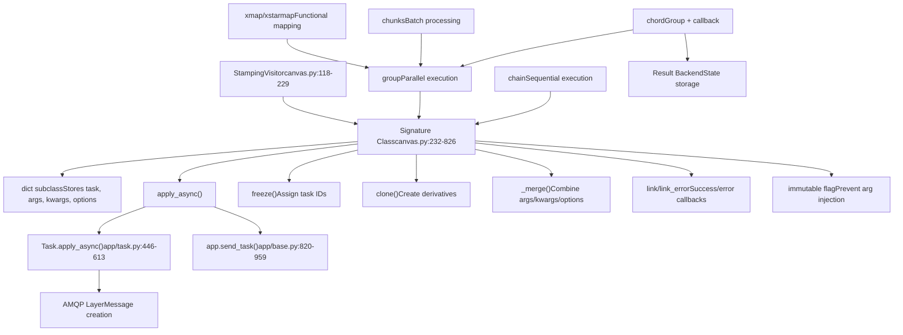
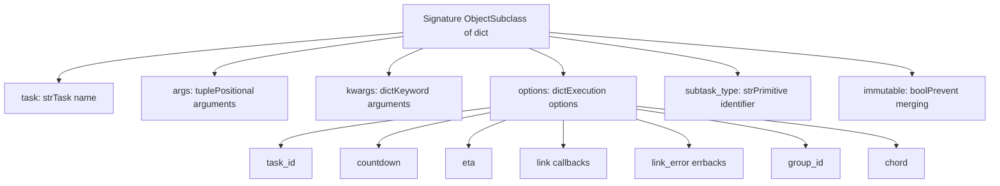
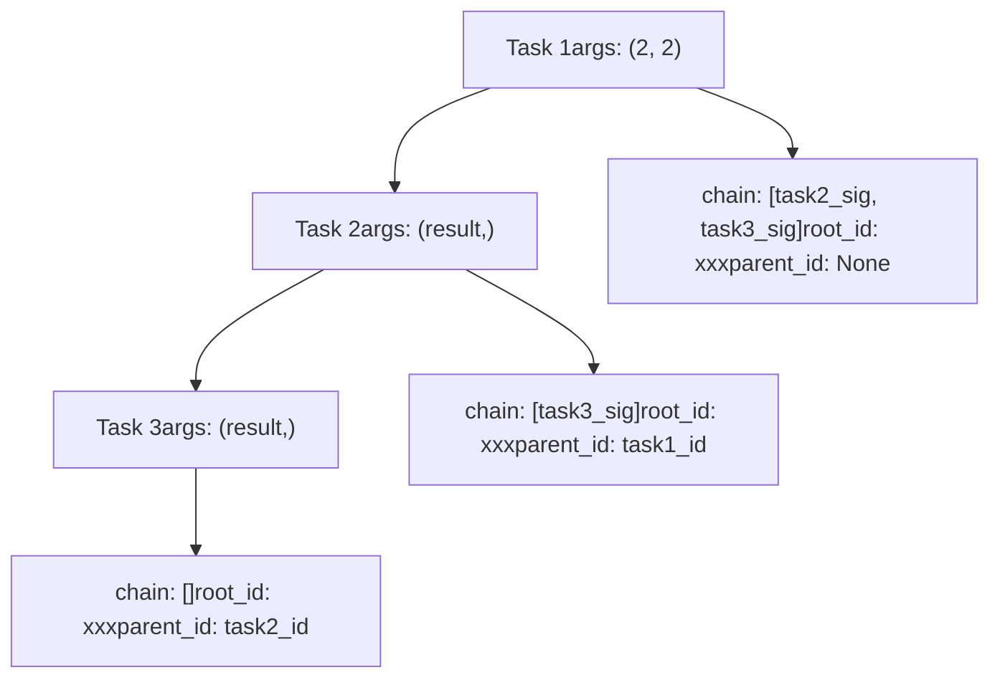
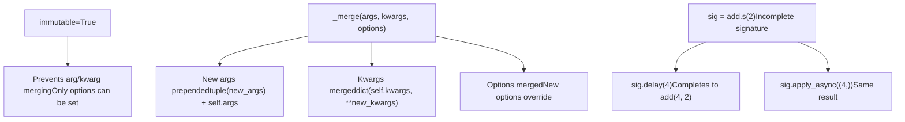
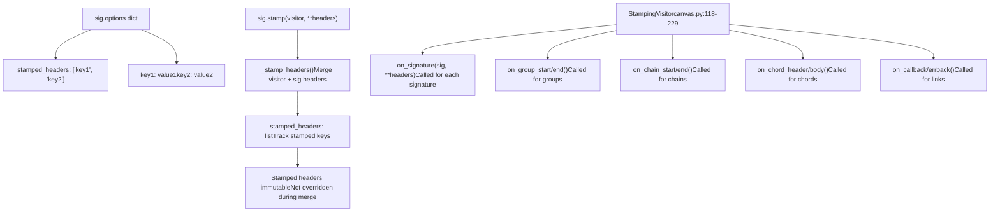
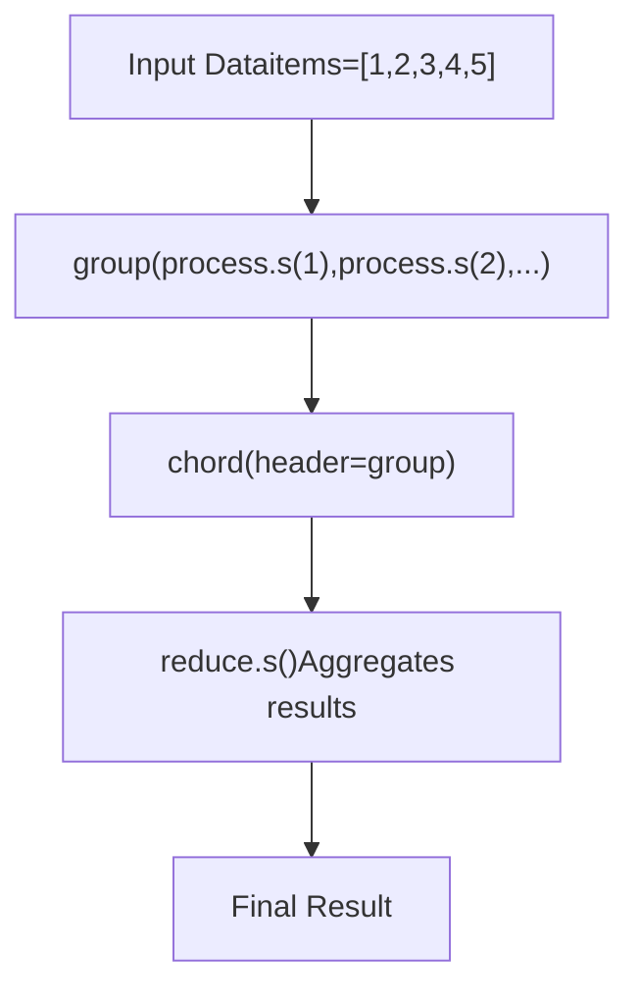
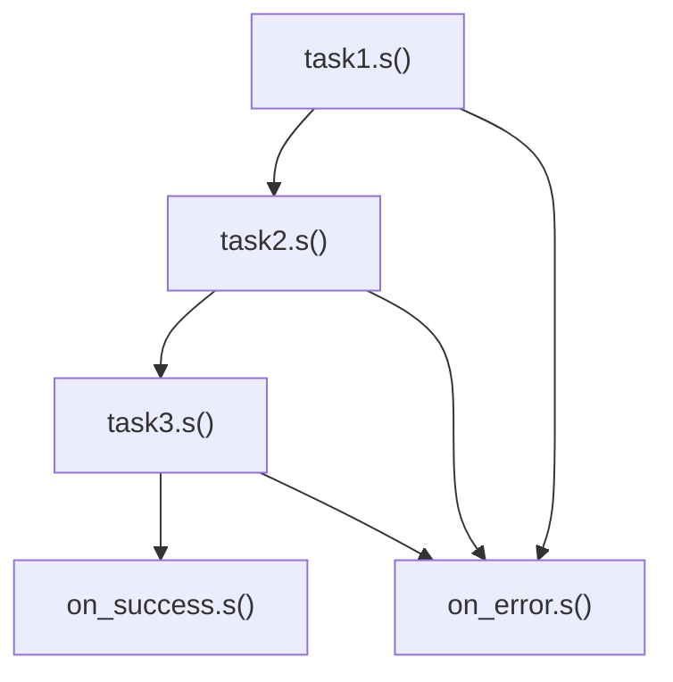
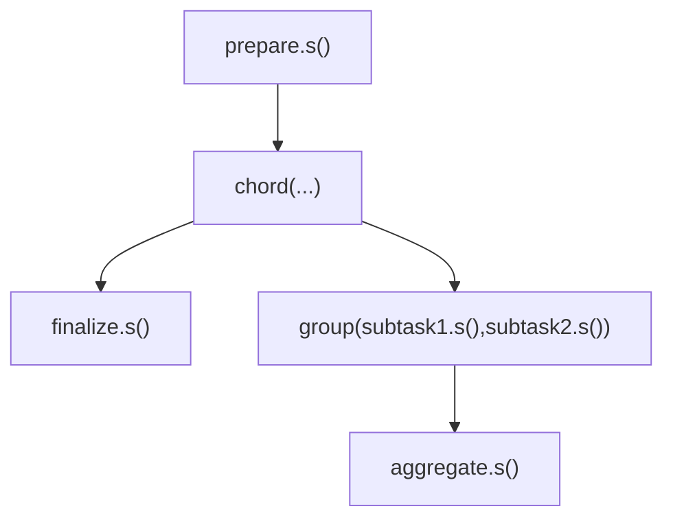
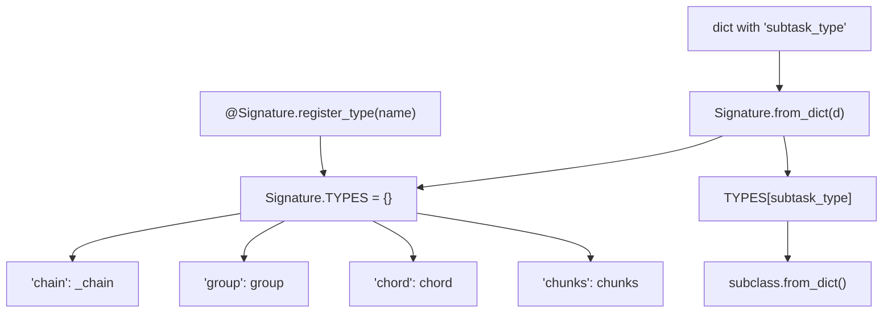

# Canvas Workflows

Relevant source files

-   [celery/app/amqp.py](https://github.com/celery/celery/blob/4d068b56/celery/app/amqp.py)
-   [celery/app/base.py](https://github.com/celery/celery/blob/4d068b56/celery/app/base.py)
-   [celery/app/task.py](https://github.com/celery/celery/blob/4d068b56/celery/app/task.py)
-   [celery/canvas.py](https://github.com/celery/celery/blob/4d068b56/celery/canvas.py)
-   [celery/utils/\_\_init\_\_.py](https://github.com/celery/celery/blob/4d068b56/celery/utils/__init__.py)
-   [docs/userguide/canvas.rst](https://github.com/celery/celery/blob/4d068b56/docs/userguide/canvas.rst)
-   [t/integration/conftest.py](https://github.com/celery/celery/blob/4d068b56/t/integration/conftest.py)
-   [t/integration/tasks.py](https://github.com/celery/celery/blob/4d068b56/t/integration/tasks.py)
-   [t/integration/test\_canvas.py](https://github.com/celery/celery/blob/4d068b56/t/integration/test_canvas.py)
-   [t/integration/test\_quorum\_queue\_qos\_cluster\_simulation.py](https://github.com/celery/celery/blob/4d068b56/t/integration/test_quorum_queue_qos_cluster_simulation.py)
-   [t/integration/test\_security.py](https://github.com/celery/celery/blob/4d068b56/t/integration/test_security.py)
-   [t/integration/test\_tasks.py](https://github.com/celery/celery/blob/4d068b56/t/integration/test_tasks.py)
-   [t/smoke/tests/test\_canvas.py](https://github.com/celery/celery/blob/4d068b56/t/smoke/tests/test_canvas.py)
-   [t/unit/app/test\_app.py](https://github.com/celery/celery/blob/4d068b56/t/unit/app/test_app.py)
-   [t/unit/tasks/test\_canvas.py](https://github.com/celery/celery/blob/4d068b56/t/unit/tasks/test_canvas.py)
-   [t/unit/tasks/test\_tasks.py](https://github.com/celery/celery/blob/4d068b56/t/unit/tasks/test_tasks.py)

**Purpose**: Document Celery's Canvas system for composing complex distributed workflows from simple task primitives. Canvas provides signature objects and workflow primitives (chain, group, chord, chunks) that enable declarative workflow composition, parallel execution, and result coordination.

**Scope**: This page covers the overall Canvas architecture, core concepts, and workflow execution model. For detailed information on specific topics, see:

-   Signature objects and composition patterns: [4.1](/celery/celery/4.1-signatures)
-   Individual workflow primitives and usage: [4.2](/celery/celery/4.2-workflow-primitives)
-   Advanced features like stamping and callbacks: [4.3](/celery/celery/4.3-advanced-canvas-features)
-   Chord execution and backend coordination: [4.4](/celery/celery/4.4-chord-execution)

For information about defining individual tasks (without composition), see [3](/celery/celery/3-tasks). For result backends that store workflow state, see [6](/celery/celery/6-result-backends).

## Overview

Canvas is Celery's workflow composition system that allows you to build complex task execution patterns by combining simple building blocks. The system is based on **signatures** - serializable representations of task invocations that can be linked, grouped, and chained together.

The Canvas system enables:

-   Sequential task execution with result passing (chains)
-   Parallel task execution (groups)
-   Synchronization barriers with callbacks (chords)
-   Workflow stamping and tracing
-   Partial application and immutability patterns

### Canvas Architecture

**Sources**: [celery/canvas.py1-2000](https://github.com/celery/celery/blob/4d068b56/celery/canvas.py#L1-L2000) [celery/app/base.py820-959](https://github.com/celery/celery/blob/4d068b56/celery/app/base.py#L820-L959) [celery/app/task.py446-613](https://github.com/celery/celery/blob/4d068b56/celery/app/task.py#L446-L613)

## Signature Objects

A `Signature` is a serializable representation of a task invocation. It wraps the task name, positional arguments, keyword arguments, and execution options into a single object that can be passed around, serialized, and composed with other signatures.

### Signature Structure

**Sources**: [celery/canvas.py232-344](https://github.com/celery/celery/blob/4d068b56/celery/canvas.py#L232-L344) [celery/canvas.py289-294](https://github.com/celery/celery/blob/4d068b56/celery/canvas.py#L289-L294)

### Signature Creation

Signatures can be created in multiple ways:

| Method | Syntax | Description |
| --- | --- | --- |
| Task method | `task.s(args)` | Shortcut using task's `.s()` method |
| Task signature | `task.signature((args,), kwargs)` | Full signature with options |
| Signature function | `signature('task.name', args, kwargs)` | By task name string |
| Immutable shortcut | `task.si(args)` | Creates immutable signature |

**Sources**: [celery/canvas.py232-344](https://github.com/celery/celery/blob/4d068b56/celery/canvas.py#L232-L344) [docs/userguide/canvas.rst16-203](https://github.com/celery/celery/blob/4d068b56/docs/userguide/canvas.rst#L16-L203)

## Workflow Primitives

Canvas provides five core primitives for workflow composition. Each primitive is itself a `Signature` subclass, enabling recursive composition.

### Primitive Types

```mermaid
flowchart TD
    MapDef["task.map/starmap(items)Apply task to each item"]
    MapImpl["xmap/xstarmapcanvas.py:2700-2900"]
    ChunksDef["task.chunks(items, n)Split work into batches"]
    ChunksSize["n items per batch"]
    ChunksImpl["chunks classcanvas.py:2500-2700"]
    ChordDef["chord(header, body)Synchronization barrier"]
    ChordHeader["Header: group of tasks"]
    ChordBody["Body: single callback task"]
    ChordImpl["chord classcanvas.py:2000-2500"]
    ChordBackend["Requires: Result backend"]
    GroupDef["group(s1, s2, s3)Execute tasks in parallel"]
    GroupResult["Returns: GroupResult"]
    GroupImpl["group classcanvas.py:1500-2000"]
    ChainDef["chain(s1, s2, s3)Result passing between tasks"]
    ChainOp["Operator: s1 | s2 | s3"]
    ChainImpl["_chain classcanvas.py:1000-1500"]

    MapDef --> MapImpl
    ChunksDef --> ChunksSize
    ChunksDef --> ChunksImpl
    ChordDef --> ChordHeader
    ChordDef --> ChordBody
    ChordDef --> ChordImpl
    ChordDef --> ChordBackend
    GroupDef --> GroupResult
    GroupDef --> GroupImpl
    ChainDef --> ChainOp
    ChainDef --> ChainImpl
```

**Sources**: [celery/canvas.py1000-2900](https://github.com/celery/celery/blob/4d068b56/celery/canvas.py#L1000-L2900) [docs/userguide/canvas.rst250-306](https://github.com/celery/celery/blob/4d068b56/docs/userguide/canvas.rst#L250-L306)

### Primitive Comparison

| Primitive | Execution Mode | Result Type | Backend Required | Use Case |
| --- | --- | --- | --- | --- |
| `chain` | Sequential | AsyncResult (last task) | No | Pipeline processing |
| `group` | Parallel | GroupResult | No | Fan-out operations |
| `chord` | Parallel + callback | AsyncResult (body) | Yes | Map-reduce patterns |
| `chunks` | Parallel batches | group | No | Bulk data processing |
| `map`/`starmap` | Parallel | group | No | Functional mapping |

**Sources**: [celery/canvas.py1-2900](https://github.com/celery/celery/blob/4d068b56/celery/canvas.py#L1-L2900) [docs/userguide/canvas.rst250-306](https://github.com/celery/celery/blob/4d068b56/docs/userguide/canvas.rst#L250-L306)

## Workflow Execution Model

Canvas workflows are executed through a multi-stage process: composition, freezing, message creation, and execution.

### Execution Flow

> **[Mermaid sequence]**
> *(图表结构无法解析)*

**Sources**: [celery/canvas.py369-519](https://github.com/celery/celery/blob/4d068b56/celery/canvas.py#L369-L519) [celery/app/base.py820-959](https://github.com/celery/celery/blob/4d068b56/celery/app/base.py#L820-L959) [celery/canvas.py472-519](https://github.com/celery/celery/blob/4d068b56/celery/canvas.py#L472-L519)

### Chain Execution Details

Chains execute tasks sequentially, passing results from one task to the next. The chain mechanism uses the `chain` option in task headers to track remaining tasks.

**Sources**: [celery/canvas.py758-786](https://github.com/celery/celery/blob/4d068b56/celery/canvas.py#L758-L786) [celery/canvas.py1000-1500](https://github.com/celery/celery/blob/4d068b56/celery/canvas.py#L1000-L1500)

## Signature Composition

Signatures support composition through various operators and methods, enabling flexible workflow construction.

### Composition Operators

| Operator | Syntax | Result | Description |
| --- | --- | --- | --- |
| Pipe `|` | `s1 | s2` | `chain` | Chain two signatures |
| Pipe to group | `s1 | group(...)` | `chain` | Chain signature to group |
| `clone()` | `s.clone(args, kwargs)` | `Signature` | Create modified copy |
| `set()` | `s.set(countdown=10)` | `Signature` | Set execution options |
| `link()` | `s.link(callback)` | `Signature` | Add success callback |
| `link_error()` | `s.link_error(errback)` | `Signature` | Add error callback |

**Sources**: [celery/canvas.py758-786](https://github.com/celery/celery/blob/4d068b56/celery/canvas.py#L758-L786) [celery/canvas.py444-469](https://github.com/celery/celery/blob/4d068b56/celery/canvas.py#L444-L469) [celery/canvas.py716-745](https://github.com/celery/celery/blob/4d068b56/celery/canvas.py#L716-L745)

### Partial Application

Signatures support partial application, where additional arguments can be prepended during execution:

**Sources**: [celery/canvas.py402-442](https://github.com/celery/celery/blob/4d068b56/celery/canvas.py#L402-L442) [celery/canvas.py538-551](https://github.com/celery/celery/blob/4d068b56/celery/canvas.py#L538-L551) [docs/userguide/canvas.rst167-189](https://github.com/celery/celery/blob/4d068b56/docs/userguide/canvas.rst#L167-L189)

## Workflow Stamping

The stamping system allows custom metadata to be propagated through workflows using the `StampingVisitor` pattern. This enables tracing, debugging, and custom workflow coordination.

### Stamping Architecture

**Sources**: [celery/canvas.py118-229](https://github.com/celery/celery/blob/4d068b56/celery/canvas.py#L118-L229) [celery/canvas.py553-633](https://github.com/celery/celery/blob/4d068b56/celery/canvas.py#L553-L633) [celery/canvas.py635-682](https://github.com/celery/celery/blob/4d068b56/celery/canvas.py#L635-L682)

### Stamping Process

When a workflow is stamped, headers are merged hierarchically:

1.  **Visitor headers**: Returned by visitor methods (`on_signature()`, etc.)
2.  **Provided headers**: Passed to `.stamp()` method
3.  **Existing headers**: Already in signature's `options`

The `_IMMUTABLE_OPTIONS` set (`{"group_id", "stamped_headers"}`) prevents certain headers from being overridden during merging, ensuring workflow coordination remains consistent.

**Sources**: [celery/canvas.py291-294](https://github.com/celery/celery/blob/4d068b56/celery/canvas.py#L291-L294) [celery/canvas.py553-611](https://github.com/celery/celery/blob/4d068b56/celery/canvas.py#L553-L611)

## Common Workflow Patterns

Canvas primitives can be combined to create sophisticated workflow patterns:

### Pattern: Map-Reduce

### Pattern: Pipeline with Error Handling

### Pattern: Nested Workflows

**Sources**: [docs/userguide/canvas.rst310-500](https://github.com/celery/celery/blob/4d068b56/docs/userguide/canvas.rst#L310-L500) [t/integration/test\_canvas.py1-600](https://github.com/celery/celery/blob/4d068b56/t/integration/test_canvas.py#L1-L600)

## Integration with Task Execution

Canvas workflows integrate with the core task execution system through specific headers and coordination mechanisms.

### Task Message Headers

Canvas-related headers in task messages:

| Header | Type | Description |
| --- | --- | --- |
| `chain` | list | Remaining tasks in chain |
| `chord` | Signature | Chord callback information |
| `group` | str | Group ID for grouped tasks |
| `group_index` | int | Task position within group |
| `root_id` | str | ID of first task in workflow |
| `parent_id` | str | ID of calling task |
| `stamped_headers` | list | Keys of stamped headers |
| `stamps` | dict | Stamped header values |

**Sources**: [celery/app/amqp.py320-404](https://github.com/celery/celery/blob/4d068b56/celery/app/amqp.py#L320-L404) [celery/app/task.py60-161](https://github.com/celery/celery/blob/4d068b56/celery/app/task.py#L60-L161)

### Result Coordination

Different primitives use different result coordination mechanisms:

-   **chain**: No special coordination; tasks send next task in sequence
-   **group**: Returns `GroupResult` tracking multiple `AsyncResult` objects
-   **chord**: Uses backend to track completion via `on_chord_part_return()`
-   **chunks**: Implemented as group, returns `GroupResult`

**Sources**: [celery/canvas.py1000-2900](https://github.com/celery/celery/blob/4d068b56/celery/canvas.py#L1000-L2900) [celery/result.py1-500](https://github.com/celery/celery/blob/4d068b56/celery/result.py#L1-L500)

## Type Registration System

Canvas supports custom primitive types through a registration system, enabling extensibility:

**Sources**: [celery/canvas.py295-320](https://github.com/celery/celery/blob/4d068b56/celery/canvas.py#L295-L320) [celery/canvas.py289-294](https://github.com/celery/celery/blob/4d068b56/celery/canvas.py#L289-L294)

## Summary

Canvas provides a powerful abstraction for workflow composition in Celery:

-   **Signatures** encapsulate task invocations as serializable, composable objects
-   **Primitives** (chain, group, chord, chunks, map) provide building blocks for complex patterns
-   **Stamping** enables metadata propagation and workflow tracing
-   **Integration** with core task system through headers and result backends
-   **Extensibility** through type registration and visitor pattern

For detailed information on specific aspects, see the related pages: [4.1](/celery/celery/4.1-signatures) for signatures, [4.2](/celery/celery/4.2-workflow-primitives) for primitives, [4.3](/celery/celery/4.3-advanced-canvas-features) for advanced features, and [4.4](/celery/celery/4.4-chord-execution) for chord execution.

**Sources**: [celery/canvas.py1-2900](https://github.com/celery/celery/blob/4d068b56/celery/canvas.py#L1-L2900) [docs/userguide/canvas.rst1-1000](https://github.com/celery/celery/blob/4d068b56/docs/userguide/canvas.rst#L1-L1000) [celery/app/base.py820-959](https://github.com/celery/celery/blob/4d068b56/celery/app/base.py#L820-L959) [celery/app/task.py1-700](https://github.com/celery/celery/blob/4d068b56/celery/app/task.py#L1-L700)
