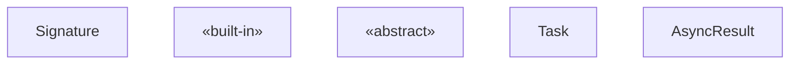
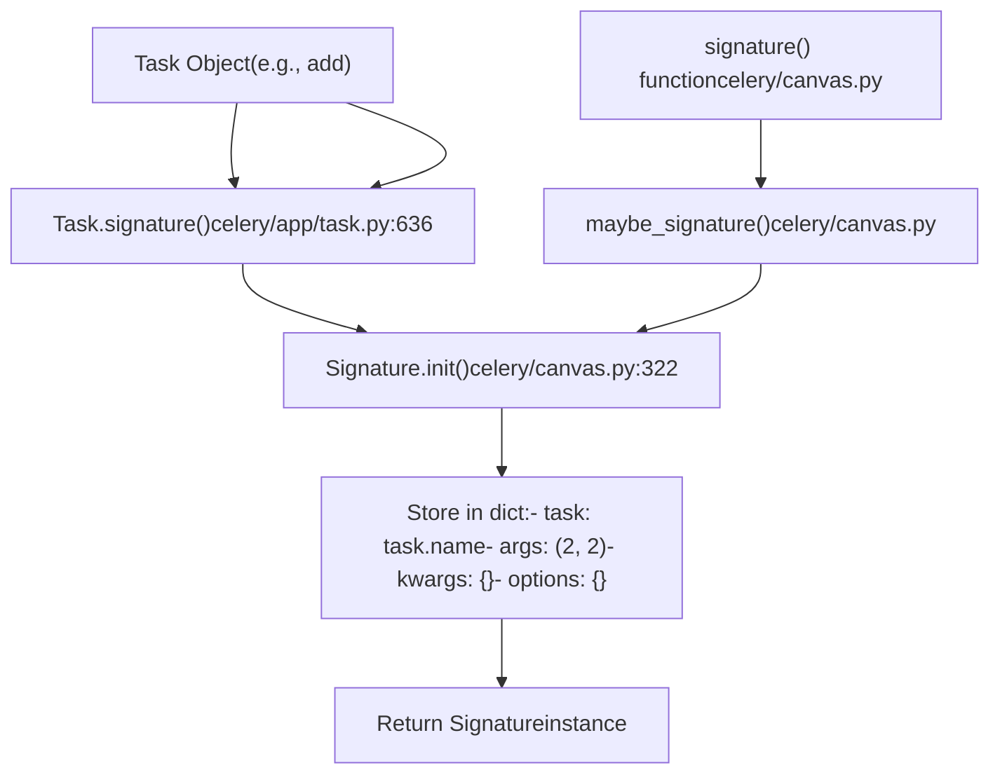
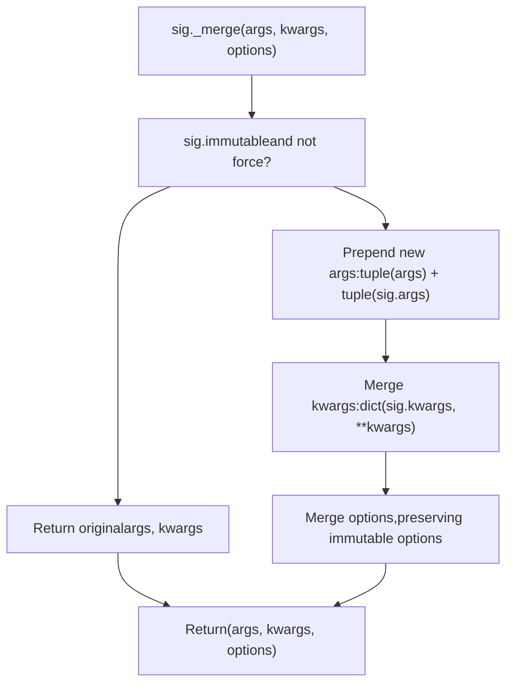
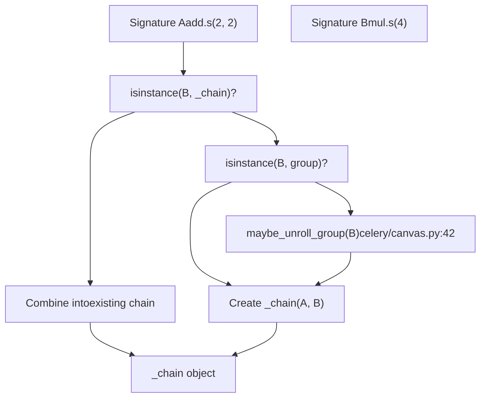
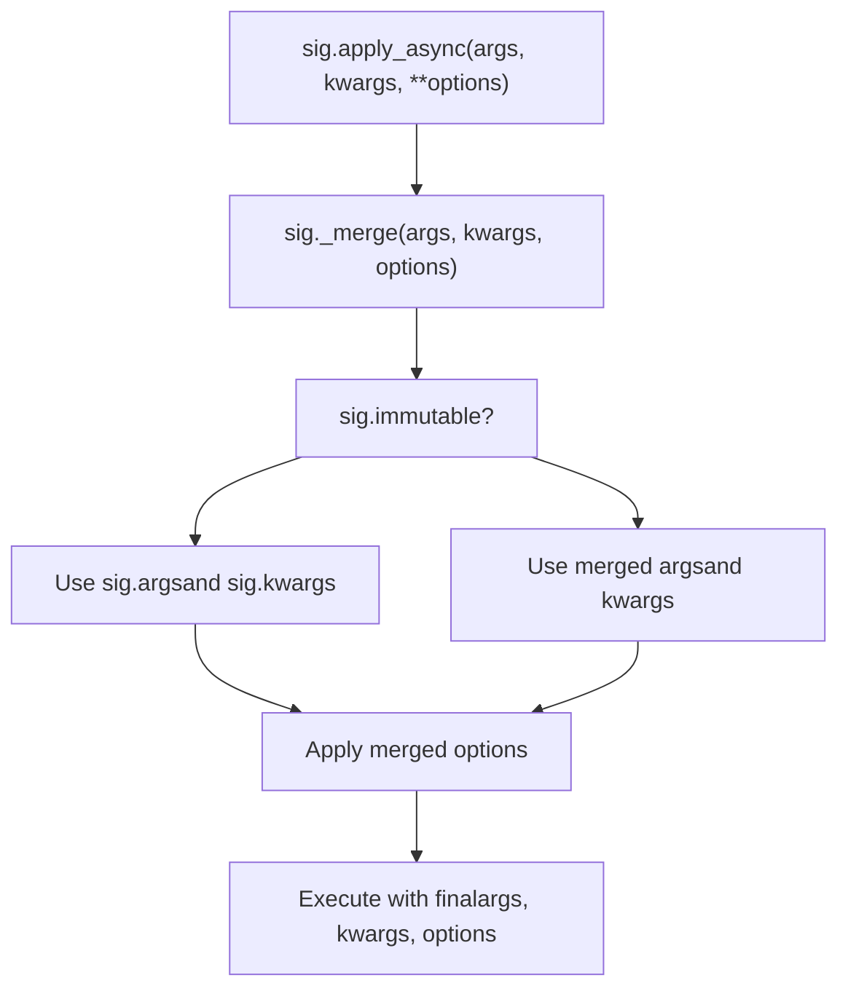
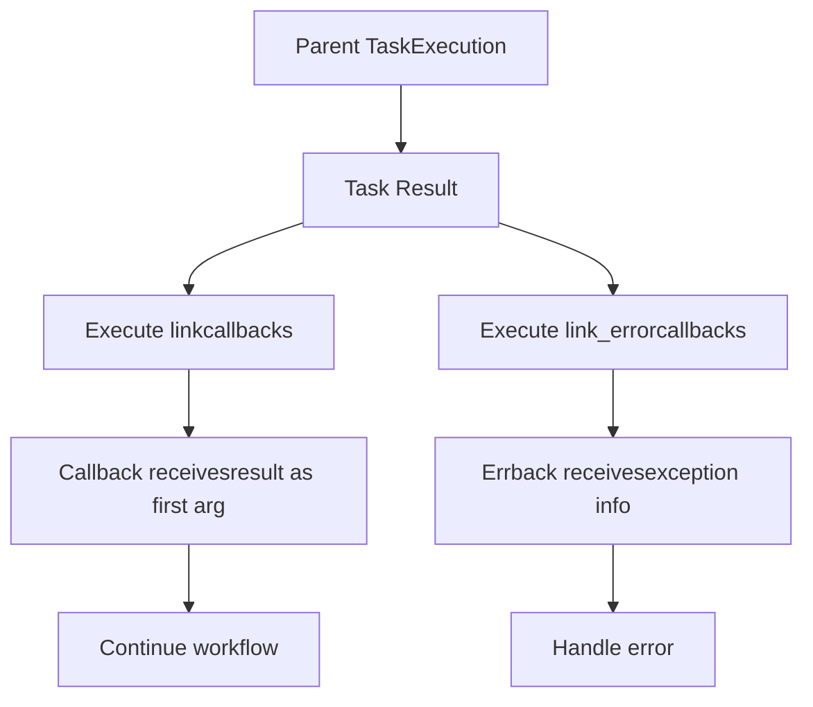
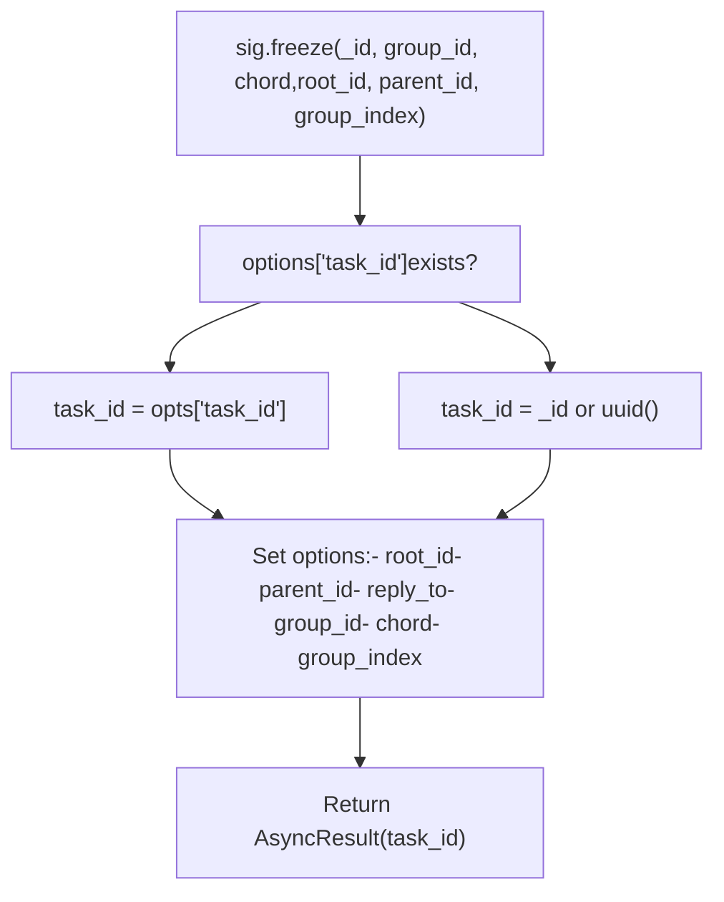

# Signature and Composition

Relevant source files

-   [celery/app/amqp.py](https://github.com/celery/celery/blob/4d068b56/celery/app/amqp.py)
-   [celery/app/base.py](https://github.com/celery/celery/blob/4d068b56/celery/app/base.py)
-   [celery/app/task.py](https://github.com/celery/celery/blob/4d068b56/celery/app/task.py)
-   [celery/canvas.py](https://github.com/celery/celery/blob/4d068b56/celery/canvas.py)
-   [celery/utils/\_\_init\_\_.py](https://github.com/celery/celery/blob/4d068b56/celery/utils/__init__.py)
-   [docs/userguide/canvas.rst](https://github.com/celery/celery/blob/4d068b56/docs/userguide/canvas.rst)
-   [t/integration/conftest.py](https://github.com/celery/celery/blob/4d068b56/t/integration/conftest.py)
-   [t/integration/tasks.py](https://github.com/celery/celery/blob/4d068b56/t/integration/tasks.py)
-   [t/integration/test\_canvas.py](https://github.com/celery/celery/blob/4d068b56/t/integration/test_canvas.py)
-   [t/integration/test\_quorum\_queue\_qos\_cluster\_simulation.py](https://github.com/celery/celery/blob/4d068b56/t/integration/test_quorum_queue_qos_cluster_simulation.py)
-   [t/integration/test\_security.py](https://github.com/celery/celery/blob/4d068b56/t/integration/test_security.py)
-   [t/integration/test\_tasks.py](https://github.com/celery/celery/blob/4d068b56/t/integration/test_tasks.py)
-   [t/smoke/tests/test\_canvas.py](https://github.com/celery/celery/blob/4d068b56/t/smoke/tests/test_canvas.py)
-   [t/unit/app/test\_app.py](https://github.com/celery/celery/blob/4d068b56/t/unit/app/test_app.py)
-   [t/unit/tasks/test\_canvas.py](https://github.com/celery/celery/blob/4d068b56/t/unit/tasks/test_canvas.py)
-   [t/unit/tasks/test\_tasks.py](https://github.com/celery/celery/blob/4d068b56/t/unit/tasks/test_tasks.py)

This document explains the `Signature` object as the foundation for Celery's Canvas workflow system. It covers how signatures wrap task invocations, support partial application, and compose together using operators to form complex workflows.

For information about specific Canvas primitives like `chain`, `group`, and `chord`, see [Workflow Primitives](/celery/celery/4.2-workflow-primitives). For advanced Canvas features like stamping and immutability, see [Advanced Canvas Features](/celery/celery/4.3-advanced-canvas-features).

---

## Overview

A `Signature` is an immutable data structure that wraps the arguments, keyword arguments, and execution options for a single task invocation. Signatures enable passing task invocations as first-class objects, serializing them across the wire, and composing them into complex workflows.

Signatures are callable objects that can be:

-   Created from task objects using `.s()` or `.signature()` methods
-   Invoked directly in the current process with `()`
-   Sent to workers with `.delay()` or `.apply_async()`
-   Combined using the pipe operator `|` to form chains
-   Serialized and deserialized for message passing

**Sources:** [celery/canvas.py232-287](https://github.com/celery/celery/blob/4d068b56/celery/canvas.py#L232-L287) [docs/userguide/canvas.rst15-203](https://github.com/celery/celery/blob/4d068b56/docs/userguide/canvas.rst#L15-L203)

---

## The Signature Class

The `Signature` class is defined as a dictionary subclass that implements the `CallableSignature` abstract interface. It stores task metadata in a structured format that can be easily serialized.

### Signature Class Structure


**Key Fields:**

-   `task`: The name of the task as a string (e.g., `"tasks.add"`)
-   `args`: Tuple of positional arguments
-   `kwargs`: Dictionary of keyword arguments
-   `options`: Dictionary of execution options (e.g., `countdown`, `eta`, `queue`)
-   `subtask_type`: Type identifier for Canvas primitives (empty string for basic signatures)
-   `immutable`: Boolean flag preventing argument modification during composition

**Sources:** [celery/canvas.py232-344](https://github.com/celery/celery/blob/4d068b56/celery/canvas.py#L232-L344) [celery/app/task.py163-395](https://github.com/celery/celery/blob/4d068b56/celery/app/task.py#L163-L395)

---

## Creating Signatures

Signatures can be created in multiple ways, each with different use cases.

### Creation Methods

| Method | Example | Use Case |
| --- | --- | --- |
| `signature()` function | `signature('tasks.add', args=(2, 2))` | Create from task name string |
| `.signature()` method | `add.signature((2, 2), countdown=10)` | Create from task instance |
| `.s()` shortcut | `add.s(2, 2)` | Quick creation with partial args |
| `.si()` shortcut | `add.si(2, 2)` | Create immutable signature |
| From dict | `Signature.from_dict(d, app=app)` | Deserialize from message |

### Creation Flow Diagram


**Sources:** [celery/canvas.py322-344](https://github.com/celery/celery/blob/4d068b56/celery/canvas.py#L322-L344) [celery/app/task.py636-658](https://github.com/celery/celery/blob/4d068b56/celery/app/task.py#L636-L658) [docs/userguide/canvas.rst29-72](https://github.com/celery/celery/blob/4d068b56/docs/userguide/canvas.rst#L29-L72)

---

## Partial Application

Signatures support partial application, where additional arguments can be prepended and options merged when the signature is invoked. This is fundamental to Canvas composition.

### The `_merge()` Method

The `_merge()` method implements partial application logic:


**Immutable Options:** Certain options like `group_id` and `stamped_headers` are never overwritten during merging to prevent disrupting parent task completion [celery/canvas.py293](https://github.com/celery/celery/blob/4d068b56/celery/canvas.py#L293-L293)

**Examples:**

-   `add.s(2).delay(4)` → calls `add(4, 2)` (args prepended)
-   `add.s(2, 2).delay(debug=True)` → calls `add(2, 2, debug=True)` (kwargs merged)
-   `add.si(2, 2).delay(4)` → calls `add(2, 2)` (immutable, args ignored)

**Sources:** [celery/canvas.py402-442](https://github.com/celery/celery/blob/4d068b56/celery/canvas.py#L402-L442) [docs/userguide/canvas.rst129-156](https://github.com/celery/celery/blob/4d068b56/docs/userguide/canvas.rst#L129-L156)

---

## Composition with the Pipe Operator

The pipe operator `|` enables composing signatures into sequential workflows (chains). When signatures are piped together, they form a `_chain` object.

### Pipe Operator Implementation


The `__or__` method is implemented in [celery/canvas.py758-779](https://github.com/celery/celery/blob/4d068b56/celery/canvas.py#L758-L779):

-   **Signature | Signature** → Creates a new `_chain`
-   **Signature | \_chain** → Prepends signature to the chain's tasks
-   **Signature | group** → Creates a chord-like structure

**Python 3.9+ Compatibility:** The `__ior__` method delegates to `__or__` to prevent dict merge behavior from overriding Canvas composition [celery/canvas.py781-785](https://github.com/celery/celery/blob/4d068b56/celery/canvas.py#L781-L785)

**Sources:** [celery/canvas.py758-785](https://github.com/celery/celery/blob/4d068b56/celery/canvas.py#L758-L785) [docs/userguide/canvas.rst327-333](https://github.com/celery/celery/blob/4d068b56/docs/userguide/canvas.rst#L327-L333)

---

## Immutability

Immutable signatures prevent their arguments from being modified during composition. This is essential for callbacks that should not receive the parent task's return value.

### Setting Immutability

| Method | Example | Description |
| --- | --- | --- |
| `.si()` shortcut | `reset.si()` | Create immutable signature |
| `.signature(immutable=True)` | `reset.signature(immutable=True)` | Set during creation |
| `.set(immutable=True)` | `sig.set(immutable=True)` | Set on existing signature |

### Immutability Behavior

When a signature is immutable:

-   Arguments passed to `.delay()` or `.apply_async()` are ignored
-   The signature's original args and kwargs are always used
-   Execution options can still be set and merged


**Use Cases:**

-   Callbacks that don't need parent results: `task.apply_async(link=notify.si())`
-   Independent tasks in chains: `add.si(2, 2) | add.si(4, 4)`
-   Chord bodies that ignore header results: `chord(header, body.si())`

**Sources:** [celery/canvas.py438-442](https://github.com/celery/celery/blob/4d068b56/celery/canvas.py#L438-L442) [celery/canvas.py550-551](https://github.com/celery/celery/blob/4d068b56/celery/canvas.py#L550-L551) [docs/userguide/canvas.rst168-190](https://github.com/celery/celery/blob/4d068b56/docs/userguide/canvas.rst#L168-L190)

---

## Cloning and Replacing

Signatures can be cloned to create modified copies without mutating the original.

### Clone Method

The `clone()` method creates a deep copy with optional modifications:

```
new_sig = sig.clone(args=(new_args,), kwargs={'new_kw': 'val'}, task_id='123')
```
**Implementation:** [celery/canvas.py444-468](https://github.com/celery/celery/blob/4d068b56/celery/canvas.py#L444-L468)

-   Performs `_merge()` to combine arguments
-   Deep copies the options dictionary to prevent shared references
-   Creates a new `Signature` instance via `Signature.from_dict()`
-   Preserves the `_type` reference to the task class

### Replace Method

The `replace()` method creates a clone with complete replacement (not merging) of specified fields:

```
new_sig = sig.replace(args=(1, 2), kwargs={'x': 1}, options={'queue': 'fast'})
```
**Implementation:** [celery/canvas.py523-536](https://github.com/celery/celery/blob/4d068b56/celery/canvas.py#L523-L536)

-   Creates a clone of the signature
-   If `args` is not None, completely replaces `signature.args`
-   If `kwargs` is not None, completely replaces `signature.kwargs`
-   If `options` is not None, completely replaces `signature.options`

**Sources:** [celery/canvas.py444-536](https://github.com/celery/celery/blob/4d068b56/celery/canvas.py#L444-L536) [t/unit/tasks/test\_canvas.py164-172](https://github.com/celery/celery/blob/4d068b56/t/unit/tasks/test_canvas.py#L164-L172)

---

## Callbacks and Error Callbacks

Signatures support attaching callback tasks that execute on success or failure.

### Callback Types


### Callback Methods

| Method | Behavior | Returns |
| --- | --- | --- |
| `.link(callback)` | Add success callback | The callback signature (for chaining) |
| `.link_error(errback)` | Add error callback | The errback signature (for chaining) |
| `.on_error(errback)` | Chainable error callback | The original signature (not errback) |

**Key Difference:** `.on_error()` returns the parent signature for chaining, while `.link_error()` returns the errback [celery/canvas.py734-745](https://github.com/celery/celery/blob/4d068b56/celery/canvas.py#L734-L745)

### Link Storage

Callbacks are stored in the signature's `options` dictionary as lists:

-   `options['link']`: List of success callbacks
-   `options['link_error']`: List of error callbacks

The `_with_list_option()` helper ensures these are always lists [celery/canvas.py684-699](https://github.com/celery/celery/blob/4d068b56/celery/canvas.py#L684-L699)

**Sources:** [celery/canvas.py716-745](https://github.com/celery/celery/blob/4d068b56/celery/canvas.py#L716-L745) [docs/userguide/canvas.rst205-243](https://github.com/celery/celery/blob/4d068b56/docs/userguide/canvas.rst#L205-L243) [docs/userguide/canvas.rst538-556](https://github.com/celery/celery/blob/4d068b56/docs/userguide/canvas.rst#L538-L556)

---

## Freezing Signatures

Freezing a signature finalizes it by assigning a concrete task ID and setting workflow metadata. This prepares the signature for execution.

### Freeze Method


**Implementation Details:** [celery/canvas.py472-519](https://github.com/celery/celery/blob/4d068b56/celery/canvas.py#L472-L519)

**Parameters:**

-   `_id`: Task ID to use (generates UUID if not provided)
-   `group_id`: Group identifier for group/chord tasks
-   `chord`: Chord body signature for chord header tasks
-   `root_id`: Root task ID for the workflow
-   `parent_id`: Parent task ID in the chain
-   `group_index`: Task index within a group

**When Freezing Occurs:**

-   Before `apply_async()` is called on complex Canvas structures
-   When chains/groups/chords need to establish parent-child relationships
-   During workflow serialization and message creation

**Return Value:** An `AsyncResult` instance that can be used to track the task's execution.

**Sources:** [celery/canvas.py472-519](https://github.com/celery/celery/blob/4d068b56/celery/canvas.py#L472-L519) [celery/app/amqp.py925-933](https://github.com/celery/celery/blob/4d068b56/celery/app/amqp.py#L925-L933)

---

## Signature Invocation Flow

The complete lifecycle of a signature from creation to execution:

> **[Mermaid sequence]**
> *(图表结构无法解析)*

**Sources:** [celery/canvas.py346-400](https://github.com/celery/celery/blob/4d068b56/celery/canvas.py#L346-L400) [celery/app/task.py446-613](https://github.com/celery/celery/blob/4d068b56/celery/app/task.py#L446-L613) [celery/app/amqp.py820-959](https://github.com/celery/celery/blob/4d068b56/celery/app/amqp.py#L820-L959)

---

## Signature Serialization

Signatures are serialized as dictionaries for message passing and result storage.

### Serialization Format

A signature serializes to a dictionary with these fields:

```
{
    'task': 'tasks.add',
    'args': (2, 2),
    'kwargs': {'debug': True},
    'options': {'countdown': 10, 'task_id': 'abc123'},
    'subtask_type': '',
    'immutable': False
}
```
### Serialization Methods

| Method | Purpose | Location |
| --- | --- | --- |
| `__reduce__()` | Pickle serialization | [celery/canvas.py820-823](https://github.com/celery/celery/blob/4d068b56/celery/canvas.py#L820-L823) |
| `__json__()` | JSON serialization | [celery/canvas.py825-826](https://github.com/celery/celery/blob/4d068b56/celery/canvas.py#L825-L826) |
| `dict(sig)` | Dictionary conversion | Inherited from `dict` |
| `.from_dict(d, app)` | Deserialization | [celery/canvas.py310-320](https://github.com/celery/celery/blob/4d068b56/celery/canvas.py#L310-L320) |

### Type Registration

Canvas primitive types (chain, group, chord) register themselves with `Signature.TYPES` for proper deserialization:

```
@Signature.register_type()
class _chain(Signature):
    def __init__(self, *tasks, **options):
        self.subtask_type = 'chain'
        # ...
```
When deserializing, `from_dict()` checks the `subtask_type` field and instantiates the correct class [celery/canvas.py315-319](https://github.com/celery/celery/blob/4d068b56/celery/canvas.py#L315-L319)

**Sources:** [celery/canvas.py295-320](https://github.com/celery/celery/blob/4d068b56/celery/canvas.py#L295-L320) [celery/canvas.py820-826](https://github.com/celery/celery/blob/4d068b56/celery/canvas.py#L820-L826) [t/unit/tasks/test\_canvas.py154-162](https://github.com/celery/celery/blob/4d068b56/t/unit/tasks/test_canvas.py#L154-L162)

---

## Common Patterns and Examples

### Pattern: Partial Application in Chains

```
# Create a signature with partial args
partial = add.s(2)  # Incomplete: missing one argument

# Chain with partial application
result = (add.s(1, 1) | partial).delay()
# Result: add(1, 1) = 2, then add(2, 2) = 4
```
### Pattern: Immutable Callbacks

```
# Callback that ignores parent result
task.apply_async((2, 2), link=notify.si('Task completed'))

# Chain with independent tasks
workflow = add.si(2, 2) | add.si(4, 4) | add.si(8, 8)
```
### Pattern: Error Handling

```
# Add error callback
sig = process_data.s(data).on_error(log_error.s())

# Multiple error callbacks
sig.link_error(retry_task.s())
sig.link_error(send_alert.s())
```
### Pattern: Dynamic Workflow Building

```
# Clone and modify
base_sig = process.s(data).set(queue='high')
modified = base_sig.clone(kwargs={'priority': 10})

# Freeze with metadata
sig.freeze(root_id='workflow-123', parent_id='parent-456')
result = sig.apply_async()
```
**Sources:** [docs/userguide/canvas.rst129-203](https://github.com/celery/celery/blob/4d068b56/docs/userguide/canvas.rst#L129-L203) [t/integration/test\_canvas.py188-252](https://github.com/celery/celery/blob/4d068b56/t/integration/test_canvas.py#L188-L252)
