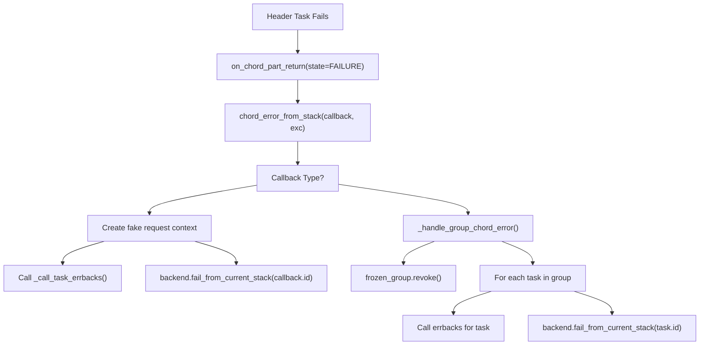
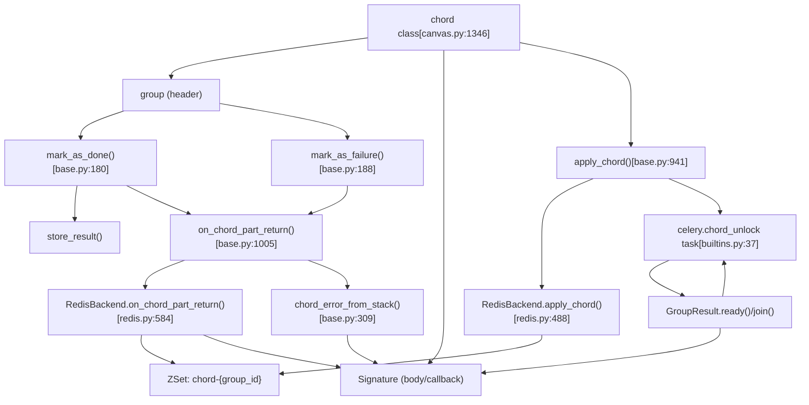

# Chord Execution

Relevant source files

-   [celery/app/amqp.py](https://github.com/celery/celery/blob/4d068b56/celery/app/amqp.py)
-   [celery/app/base.py](https://github.com/celery/celery/blob/4d068b56/celery/app/base.py)
-   [celery/app/builtins.py](https://github.com/celery/celery/blob/4d068b56/celery/app/builtins.py)
-   [celery/app/task.py](https://github.com/celery/celery/blob/4d068b56/celery/app/task.py)
-   [celery/backends/base.py](https://github.com/celery/celery/blob/4d068b56/celery/backends/base.py)
-   [celery/backends/redis.py](https://github.com/celery/celery/blob/4d068b56/celery/backends/redis.py)
-   [celery/canvas.py](https://github.com/celery/celery/blob/4d068b56/celery/canvas.py)
-   [celery/result.py](https://github.com/celery/celery/blob/4d068b56/celery/result.py)
-   [celery/utils/\_\_init\_\_.py](https://github.com/celery/celery/blob/4d068b56/celery/utils/__init__.py)
-   [docs/userguide/canvas.rst](https://github.com/celery/celery/blob/4d068b56/docs/userguide/canvas.rst)
-   [docs/userguide/configuration.rst](https://github.com/celery/celery/blob/4d068b56/docs/userguide/configuration.rst)
-   [t/integration/conftest.py](https://github.com/celery/celery/blob/4d068b56/t/integration/conftest.py)
-   [t/integration/tasks.py](https://github.com/celery/celery/blob/4d068b56/t/integration/tasks.py)
-   [t/integration/test\_canvas.py](https://github.com/celery/celery/blob/4d068b56/t/integration/test_canvas.py)
-   [t/integration/test\_quorum\_queue\_qos\_cluster\_simulation.py](https://github.com/celery/celery/blob/4d068b56/t/integration/test_quorum_queue_qos_cluster_simulation.py)
-   [t/integration/test\_security.py](https://github.com/celery/celery/blob/4d068b56/t/integration/test_security.py)
-   [t/integration/test\_tasks.py](https://github.com/celery/celery/blob/4d068b56/t/integration/test_tasks.py)
-   [t/smoke/tests/test\_canvas.py](https://github.com/celery/celery/blob/4d068b56/t/smoke/tests/test_canvas.py)
-   [t/unit/app/test\_app.py](https://github.com/celery/celery/blob/4d068b56/t/unit/app/test_app.py)
-   [t/unit/backends/test\_base.py](https://github.com/celery/celery/blob/4d068b56/t/unit/backends/test_base.py)
-   [t/unit/backends/test\_redis.py](https://github.com/celery/celery/blob/4d068b56/t/unit/backends/test_redis.py)
-   [t/unit/tasks/test\_canvas.py](https://github.com/celery/celery/blob/4d068b56/t/unit/tasks/test_canvas.py)
-   [t/unit/tasks/test\_chord.py](https://github.com/celery/celery/blob/4d068b56/t/unit/tasks/test_chord.py)
-   [t/unit/tasks/test\_result.py](https://github.com/celery/celery/blob/4d068b56/t/unit/tasks/test_result.py)
-   [t/unit/tasks/test\_tasks.py](https://github.com/celery/celery/blob/4d068b56/t/unit/tasks/test_tasks.py)

## Purpose and Scope

This page documents the implementation details of chord execution in Celery. A chord combines a group of tasks (the header) with a callback task (the body) that executes once all header tasks complete. This page covers the coordination mechanisms used by different result backends to track task completion and trigger the callback.

For basic chord usage and composition patterns, see [Workflow Primitives](/celery/celery/4.2-workflow-primitives). For signature manipulation and freezing, see [Signatures](/celery/celery/4.1-signatures).

---

## Chord Architecture

A chord consists of two components:

-   **Header**: A `group` of tasks that execute in parallel
-   **Body**: A callback `Signature` that receives the collected results from the header

The chord class is defined in [celery/canvas.py1346-1722](https://github.com/celery/celery/blob/4d068b56/celery/canvas.py#L1346-L1722) and inherits from `Signature`. When a chord is applied, the header tasks are dispatched immediately, and the backend is responsible for tracking their completion and invoking the body callback with the aggregated results.

**Key architectural concepts:**

| Component | Description | Implementation |
| --- | --- | --- |
| `chord` class | Canvas primitive combining group + callback | [celery/canvas.py1346](https://github.com/celery/celery/blob/4d068b56/celery/canvas.py#L1346-L1346) |
| `apply_chord()` | Backend method to register chord coordination | [celery/backends/base.py941-1003](https://github.com/celery/celery/blob/4d068b56/celery/backends/base.py#L941-L1003) |
| `on_chord_part_return()` | Backend method called when each header task completes | [celery/backends/base.py1005-1152](https://github.com/celery/celery/blob/4d068b56/celery/backends/base.py#L1005-L1152) |
| `chord_unlock` task | Polling task for backends without native support | [celery/app/builtins.py37-98](https://github.com/celery/celery/blob/4d068b56/celery/app/builtins.py#L37-L98) |

Sources: [celery/canvas.py1346-1722](https://github.com/celery/celery/blob/4d068b56/celery/canvas.py#L1346-L1722) [celery/backends/base.py941-1152](https://github.com/celery/celery/blob/4d068b56/celery/backends/base.py#L941-L1152) [celery/app/builtins.py37-98](https://github.com/celery/celery/blob/4d068b56/celery/app/builtins.py#L37-L98)

---

## Backend Coordination Mechanisms

Celery supports two approaches to chord execution depending on the result backend's capabilities.

### Native Chord Support

Backends with `supports_native_join = True` implement chord coordination directly using backend-specific features. These backends must override `apply_chord()` and `on_chord_part_return()` methods.

**Native support backends:**

-   **RedisBackend**: Uses sorted sets (ZSets) for atomic completion tracking [celery/backends/redis.py584-677](https://github.com/celery/celery/blob/4d068b56/celery/backends/redis.py#L584-L677)
-   **RPCBackend**: Uses AMQP message passing for real-time coordination
-   **DatabaseBackend**: Uses database transactions for consistency

The Redis implementation stores chord state in ZSets where the score represents the task's state and the member is the task ID. When all members have scores indicating completion, the callback is triggered.

Sources: [celery/backends/base.py119-121](https://github.com/celery/celery/blob/4d068b56/celery/backends/base.py#L119-L121) [celery/backends/redis.py207](https://github.com/celery/celery/blob/4d068b56/celery/backends/redis.py#L207-L207) [celery/backends/redis.py584-677](https://github.com/celery/celery/blob/4d068b56/celery/backends/redis.py#L584-L677)

### Non-Native Support (Unlock Task)

Backends without native chord support use a polling mechanism via the `celery.chord_unlock` task. This task periodically checks if all header tasks have completed by calling `GroupResult.ready()`.

**The unlock task:**

1.  Is registered automatically via `add_unlock_chord_task()` [celery/app/builtins.py37-98](https://github.com/celery/celery/blob/4d068b56/celery/app/builtins.py#L37-L98)
2.  Receives the `group_id`, `callback`, and result metadata
3.  Retries with exponential backoff configured by `result_chord_retry_interval`
4.  Calls `GroupResult.join()` when ready and invokes the callback

**Configuration settings:**

-   `result_chord_retry_interval`: Delay between unlock task retries (default from config)
-   `result_chord_join_timeout`: Timeout for joining header results

Sources: [celery/app/builtins.py37-98](https://github.com/celery/celery/blob/4d068b56/celery/app/builtins.py#L37-L98) [celery/backends/base.py941-1003](https://github.com/celery/celery/blob/4d068b56/celery/backends/base.py#L941-L1003)

---

## Chord Application Flow

> **[Mermaid sequence]**
> *(图表结构无法解析)*

**Chord application workflow:**

Sources: [celery/canvas.py1550-1722](https://github.com/celery/celery/blob/4d068b56/celery/canvas.py#L1550-L1722) [celery/backends/base.py941-1152](https://github.com/celery/celery/blob/4d068b56/celery/backends/base.py#L941-L1152) [celery/app/builtins.py48-98](https://github.com/celery/celery/blob/4d068b56/celery/app/builtins.py#L48-L98)

---

## Completion Tracking Mechanisms

### Redis ZSet Implementation

The Redis backend tracks chord completion using sorted sets (ZSets) where:

-   **Key**: `{key_prefix}chord-{group_id}`
-   **Score**: Task state encoded as integer (SUCCESS=1, FAILURE=-1, etc.)
-   **Member**: Task ID

**Tracking logic** [celery/backends/redis.py584-677](https://github.com/celery/celery/blob/4d068b56/celery/backends/redis.py#L584-L677):

```
# on_chord_part_return() checks completion
with pipeline.watch(chord_key):
    ready = pipeline.zcount(chord_key, '-inf', '+inf') == 0
    if ready:
        # All tasks done, invoke callback
```
The atomic `ZCOUNT` operation ensures thread-safe completion detection. The backend removes completed task IDs from the ZSet after storing their results.

**Key operations:**

-   `ZADD`: Add task to tracking set with initial state
-   `ZREM`: Remove task when it completes successfully
-   `ZCOUNT`: Count remaining incomplete tasks
-   `EXPIRE`: Set TTL on chord metadata

Sources: [celery/backends/redis.py584-677](https://github.com/celery/celery/blob/4d068b56/celery/backends/redis.py#L584-L677) [celery/backends/redis.py488-552](https://github.com/celery/celery/blob/4d068b56/celery/backends/redis.py#L488-L552)

### Counter-Based Implementation

Some backends use simple counter keys to track completion:

```
counter_key = f'{key_prefix}chord-{group_id}-count'
# Decrement counter on each task completion
remaining = backend.decrement(counter_key)
if remaining == 0:
    # Trigger callback
```
This approach is simpler but may have race conditions without atomic operations.

Sources: [celery/backends/base.py1005-1152](https://github.com/celery/celery/blob/4d068b56/celery/backends/base.py#L1005-L1152)

### Polling Implementation (Non-Native)

The `chord_unlock` task polls the group result periodically:

```
deps = GroupResult(group_id, results, app=app)
if not deps.ready():
    raise self.retry(countdown=interval, max_retries=max_retries)

# All ready, join and invoke callback
ret = deps.join(timeout=app.conf.result_chord_join_timeout, propagate=True)
callback.delay(ret)
```
This approach works with any backend but has higher latency and increased backend load from polling.

Sources: [celery/app/builtins.py56-98](https://github.com/celery/celery/blob/4d068b56/celery/app/builtins.py#L56-L98)

---

## Error Handling

### Chord Error Propagation

When a header task fails, the backend's `on_chord_part_return()` method detects the failure and calls `chord_error_from_stack()` [celery/backends/base.py309-336](https://github.com/celery/celery/blob/4d068b56/celery/backends/base.py#L309-L336)

**Error handling flow:**


**Special handling for group callbacks** [celery/backends/base.py337-403](https://github.com/celery/celery/blob/4d068b56/celery/backends/base.py#L337-L403):

When the chord body is itself a `group`, the error handler must prevent all body tasks from hanging indefinitely. The `_handle_group_chord_error()` method:

1.  Freezes the group to get concrete task IDs
2.  Revokes all pending tasks in the group body
3.  Marks each task as failed with the original exception
4.  Calls error callbacks for each task individually

This prevents the issue described in GitHub issue #8786 where group body tasks would hang after chord header failure.

Sources: [celery/backends/base.py309-403](https://github.com/celery/celery/blob/4d068b56/celery/backends/base.py#L309-L403) [celery/backends/base.py68-77](https://github.com/celery/celery/blob/4d068b56/celery/backends/base.py#L68-L77)

### Error Helper Functions

The codebase provides helper functions for consistent error handling:

**`_create_chord_error_with_cause(message, original_exc)`** [celery/backends/base.py68-77](https://github.com/celery/celery/blob/4d068b56/celery/backends/base.py#L68-L77): Creates a `ChordError` with the original exception as `__cause__`, preserving the exception chain for debugging.

**`_create_fake_task_request(task_id, errbacks, task_name, **extra)`** [celery/backends/base.py80-92](https://github.com/celery/celery/blob/4d068b56/celery/backends/base.py#L80-L92): Creates a `Context` object simulating a task request for error callback invocation when the actual task context is unavailable.

Sources: [celery/backends/base.py68-92](https://github.com/celery/celery/blob/4d068b56/celery/backends/base.py#L68-L92)

---

## Configuration and Options

### Chord-Specific Settings

| Setting | Description | Default |
| --- | --- | --- |
| `result_chord_retry_interval` | Delay between unlock task retries | Backend-dependent |
| `result_chord_join_timeout` | Timeout for joining header results | Backend-dependent |
| `task_allow_error_cb_on_chord_header` | Allow errbacks on chord header tasks | Backend-dependent |

### Freezing and Task ID Assignment

When a chord is applied, the header tasks are "frozen" to assign concrete task IDs [celery/canvas.py1611-1643](https://github.com/celery/celery/blob/4d068b56/celery/canvas.py#L1611-L1643):

```
# Each header task gets a unique ID and shares the group_id
for task_sig in header.tasks:
    task_sig.freeze(
        group_id=group_id,
        chord=body_sig,  # Reference to callback
        root_id=options.get('root_id'),
        parent_id=options.get('parent_id')
    )
```
The `chord` option in each header task's metadata links it to the chord coordination system.

Sources: [celery/canvas.py1611-1643](https://github.com/celery/celery/blob/4d068b56/celery/canvas.py#L1611-L1643) [celery/canvas.py472-519](https://github.com/celery/celery/blob/4d068b56/celery/canvas.py#L472-L519)

---

## Integration with Task Execution

### Worker-Side Coordination

When a worker completes a header task, the backend's `mark_as_done()` or `mark_as_failure()` method is called [celery/backends/base.py180-186](https://github.com/celery/celery/blob/4d068b56/celery/backends/base.py#L180-L186) [celery/backends/base.py188-242](https://github.com/celery/celery/blob/4d068b56/celery/backends/base.py#L188-L242):

```
def mark_as_done(self, task_id, result, request=None, ...):
    if store_result:
        self.store_result(task_id, result, state, request=request)
    if request and request.chord:
        # Task is part of a chord header
        self.on_chord_part_return(request, state, result)
```
The `request.chord` attribute contains the callback signature, indicating this task is part of a chord header.

Sources: [celery/backends/base.py180-242](https://github.com/celery/celery/blob/4d068b56/celery/backends/base.py#L180-L242)

### Callback Invocation

Once all header tasks complete:

**Native backends:** Directly invoke the callback using `callback.apply_async()` or `callback.delay()` with the aggregated results.

**Non-native backends:** The `chord_unlock` task invokes the callback [celery/app/builtins.py77-97](https://github.com/celery/celery/blob/4d068b56/celery/app/builtins.py#L77-L97):

```
try:
    with allow_join_result():
        ret = j(timeout=app.conf.result_chord_join_timeout, propagate=True)
except Exception as exc:
    # Handle header failure
    chord_error = _create_chord_error_with_cause(...)
    app.backend.chord_error_from_stack(callback=callback, exc=chord_error)
else:
    try:
        callback.delay(ret)
    except Exception as exc:
        # Handle callback dispatch failure
        chord_error = _create_chord_error_with_cause(...)
        app.backend.chord_error_from_stack(callback=callback, exc=chord_error)
```
Sources: [celery/app/builtins.py77-97](https://github.com/celery/celery/blob/4d068b56/celery/app/builtins.py#L77-L97)

---

## Backend-Specific Implementations

### RedisBackend

**Key methods:**

-   `apply_chord()` [celery/backends/redis.py488-552](https://github.com/celery/celery/blob/4d068b56/celery/backends/redis.py#L488-L552): Sets up ZSet tracking
-   `on_chord_part_return()` [celery/backends/redis.py584-677](https://github.com/celery/celery/blob/4d068b56/celery/backends/redis.py#L584-L677): Atomic completion check using ZSets
-   `_create_chord_zset()`: Initializes tracking structure
-   `_remove_from_chord()`: Removes completed task from ZSet

**Advantages:**

-   Atomic operations prevent race conditions
-   Low latency callback triggering
-   Minimal polling overhead

Sources: [celery/backends/redis.py488-677](https://github.com/celery/celery/blob/4d068b56/celery/backends/redis.py#L488-L677)

### DatabaseBackend

Uses the `chord_unlock` polling task since database transactions alone cannot provide efficient completion tracking without excessive locking.

Sources: [celery/backends/database.py](https://github.com/celery/celery/blob/4d068b56/celery/backends/database.py) (referenced but not in provided files)

### RPCBackend

Uses AMQP queues for real-time notification when header tasks complete. Each header task publishes to a coordination queue monitored by the callback dispatcher.

Sources: [celery/backends/rpc.py](https://github.com/celery/celery/blob/4d068b56/celery/backends/rpc.py) (referenced but not in provided files)

---

## Testing and Debugging

### Integration Tests

The test suite includes extensive chord testing scenarios [t/integration/test\_canvas.py312-877](https://github.com/celery/celery/blob/4d068b56/t/integration/test_canvas.py#L312-L877):

-   Basic chord execution
-   Nested chords (chord inside chord)
-   Chords with callbacks and errbacks
-   Error propagation from header to body
-   Group bodies with chord headers
-   Chord with empty groups
-   Replaced tasks in chord headers

**Example test pattern:**

```
def test_chord_on_error():
    c = chord([add.s(1, 2), fail.s(), add.s(3, 4)], body=add.s(0))
    res = c.delay()

    with pytest.raises(ExpectedException):
        res.get(propagate=True)
```
Sources: [t/integration/test\_canvas.py312-877](https://github.com/celery/celery/blob/4d068b56/t/integration/test_canvas.py#L312-L877)

### Common Issues

1.  **Chord hangs indefinitely**: Usually indicates backend doesn't support chords or `chord_unlock` task not registered
2.  **Callback not invoked**: Check that all header tasks completed and backend tracking is functioning
3.  **Race conditions**: Ensure backend uses atomic operations for completion tracking
4.  **Group body hangs on error**: Fixed by `_handle_group_chord_error()` in [celery/backends/base.py337-403](https://github.com/celery/celery/blob/4d068b56/celery/backends/base.py#L337-L403)

Sources: [t/integration/test\_canvas.py](https://github.com/celery/celery/blob/4d068b56/t/integration/test_canvas.py) [celery/backends/base.py337-403](https://github.com/celery/celery/blob/4d068b56/celery/backends/base.py#L337-L403)

---

## Summary: Chord Execution Code Entity Map


Sources: [celery/canvas.py1346-1722](https://github.com/celery/celery/blob/4d068b56/celery/canvas.py#L1346-L1722) [celery/backends/base.py180-1152](https://github.com/celery/celery/blob/4d068b56/celery/backends/base.py#L180-L1152) [celery/backends/redis.py488-677](https://github.com/celery/celery/blob/4d068b56/celery/backends/redis.py#L488-L677) [celery/app/builtins.py37-98](https://github.com/celery/celery/blob/4d068b56/celery/app/builtins.py#L37-L98)
