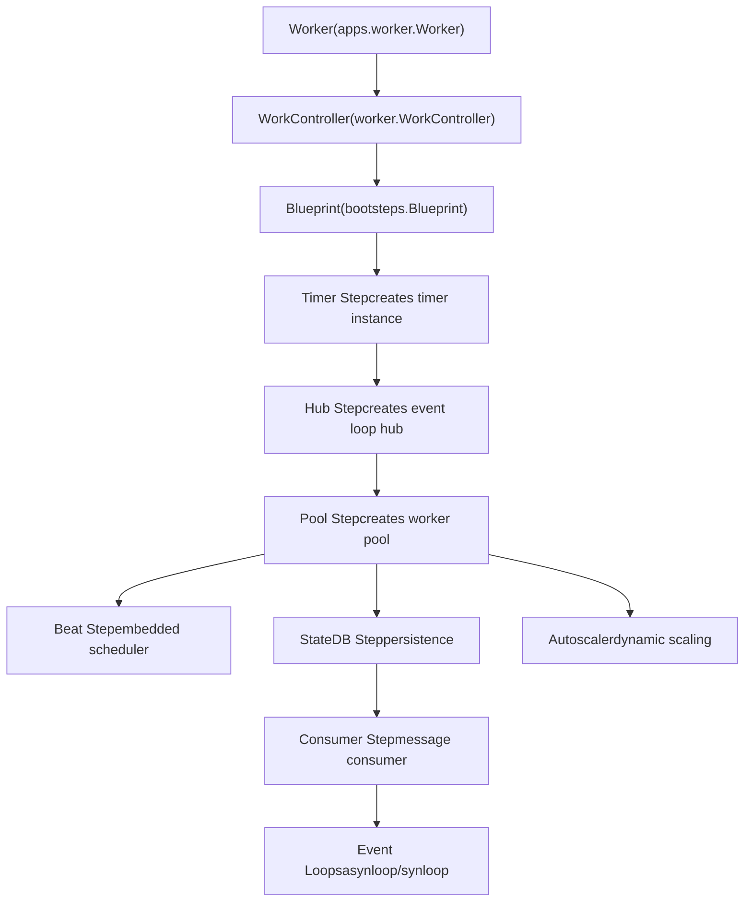
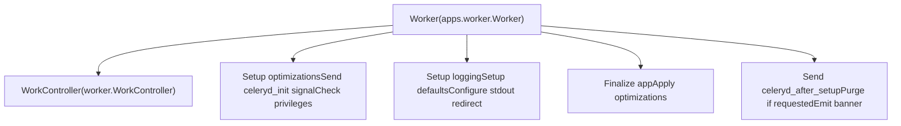
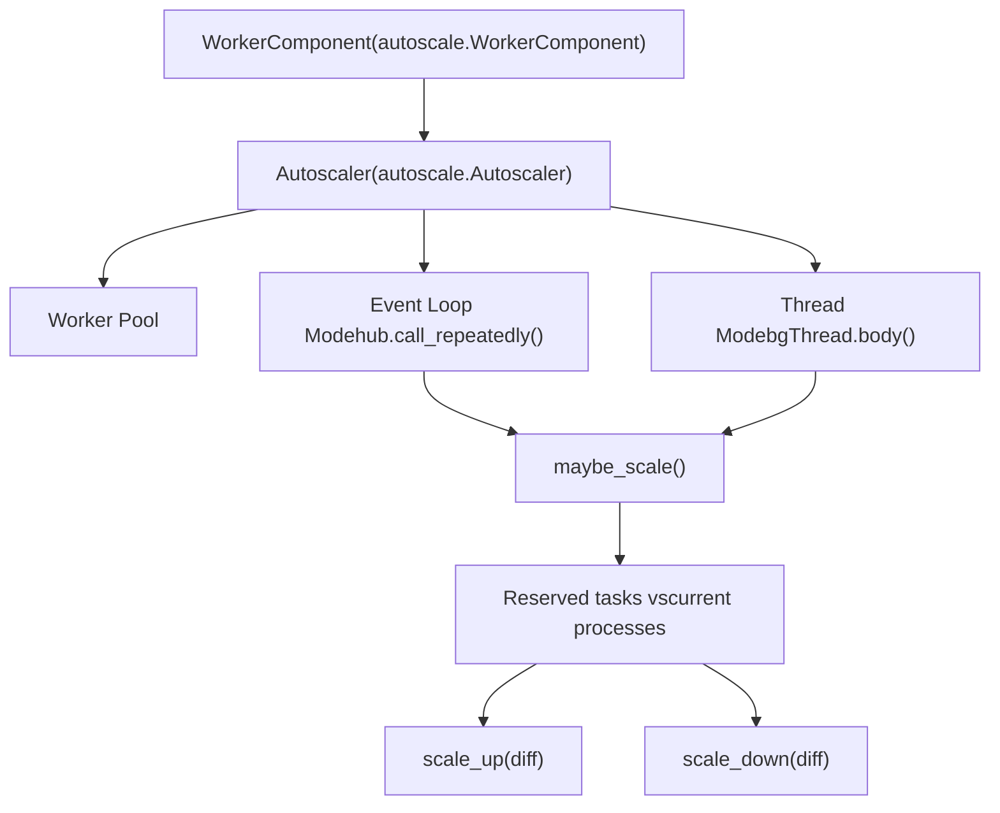

# Workers

Relevant source files

-   [celery/apps/beat.py](https://github.com/celery/celery/blob/4d068b56/celery/apps/beat.py)
-   [celery/apps/worker.py](https://github.com/celery/celery/blob/4d068b56/celery/apps/worker.py)
-   [celery/bootsteps.py](https://github.com/celery/celery/blob/4d068b56/celery/bootsteps.py)
-   [celery/worker/\_\_init\_\_.py](https://github.com/celery/celery/blob/4d068b56/celery/worker/__init__.py)
-   [celery/worker/autoscale.py](https://github.com/celery/celery/blob/4d068b56/celery/worker/autoscale.py)
-   [celery/worker/components.py](https://github.com/celery/celery/blob/4d068b56/celery/worker/components.py)
-   [celery/worker/loops.py](https://github.com/celery/celery/blob/4d068b56/celery/worker/loops.py)

Workers are the core execution engines in Celery that consume tasks from message queues and execute them. This page documents the worker system architecture, lifecycle management, concurrency models, and runtime behavior.

For information about scheduling periodic tasks, see [Periodic Tasks (Beat)](/celery/celery/7-periodic-tasks-(beat)). For details about the CLI commands to start workers, see [Worker and Beat Commands](/celery/celery/9.2-worker-and-beat-commands). For task execution and state management, see [Tasks](/celery/celery/3-tasks).

---

## Overview

The Celery worker system is built around a sophisticated **bootsteps framework** that manages component lifecycle through a directed acyclic graph (DAG). The primary components are:

-   **Worker Application** (`Worker` class) - High-level worker program interface
-   **WorkController** - Core worker orchestration and lifecycle management
-   **Blueprint** - Component initialization and dependency resolution system
-   **Consumer** - Message consumption and task dispatching
-   **Pool** - Task execution backend (prefork/eventlet/gevent/solo/threads)
-   **Event Loop** - Message polling and event handling (asynloop/synloop)
-   **Autoscaler** - Dynamic concurrency adjustment

Sources: [celery/apps/worker.py1-518](https://github.com/celery/celery/blob/4d068b56/celery/apps/worker.py#L1-L518) [celery/worker/\_\_init\_\_.py1-5](https://github.com/celery/celery/blob/4d068b56/celery/worker/__init__.py#L1-L5)

---

## Worker Architecture

The worker uses a layered architecture where bootsteps orchestrate component initialization in dependency order:


**Diagram: Worker Component Hierarchy**

The dependency chain ensures proper initialization order. For example, `Pool` requires `Hub` (which requires `Timer`) to be initialized first, and `Consumer` is always initialized last since it depends on all other components.

Sources: [celery/worker/components.py1-247](https://github.com/celery/celery/blob/4d068b56/celery/worker/components.py#L1-L247) [celery/bootsteps.py74-263](https://github.com/celery/celery/blob/4d068b56/celery/bootsteps.py#L74-L263)

---

## Bootsteps Framework

The bootsteps framework implements lifecycle management through the `Blueprint` class, which resolves dependencies and orchestrates component initialization, startup, and shutdown.

### Blueprint Lifecycle

> **[Mermaid sequence]**
> *(图表结构无法解析)*

**Diagram: Blueprint Lifecycle Phases**

The lifecycle consists of three phases:

1.  **Apply Phase** - Creates step instances, resolves dependencies via topological sort, calls `include()` to add steps to `parent.steps`
2.  **Start Phase** - Calls `start()` on each step in dependency order
3.  **Stop Phase** - Calls `stop()` on each step in reverse order

Sources: [celery/bootsteps.py186-212](https://github.com/celery/celery/blob/4d068b56/celery/bootsteps.py#L186-L212) [celery/bootsteps.py109-117](https://github.com/celery/celery/blob/4d068b56/celery/bootsteps.py#L109-L117) [celery/bootsteps.py155-176](https://github.com/celery/celery/blob/4d068b56/celery/bootsteps.py#L155-L176)

### Step Types

| Step Type | Purpose | Methods |
| --- | --- | --- |
| `Step` | Base class for non-service steps | `__init__`, `create`, `include`, `include_if` |
| `StartStopStep` | Steps requiring start/stop lifecycle | `start`, `stop`, `close`, `terminate` |
| `ConsumerStep` | Message consumer bootsteps | `get_consumers`, `start`, `stop`, `shutdown` |

The `conditional` flag allows steps to be included only when specific conditions are met. For example, `Beat` step is only enabled when `--beat` is passed:

```
class Beat(bootsteps.StartStopStep):
    conditional = True

    def __init__(self, w, beat=False, **kwargs):
        self.enabled = w.beat = beat
```
Sources: [celery/bootsteps.py288-353](https://github.com/celery/celery/blob/4d068b56/celery/bootsteps.py#L288-L353) [celery/bootsteps.py355-384](https://github.com/celery/celery/blob/4d068b56/celery/bootsteps.py#L355-L384) [celery/bootsteps.py386-416](https://github.com/celery/celery/blob/4d068b56/celery/bootsteps.py#L386-L416)

---

## Worker Initialization

### Worker Class Hierarchy


**Diagram: Worker Initialization Hooks**

The `Worker` class (in `celery/apps/worker.py`) extends `WorkController` and provides hooks for program-level setup:

-   **`on_before_init`** - Called before blueprint initialization. Sets up trace optimizations and sends `celeryd_init` signal
-   **`on_after_init`** - Configures logging, stdout redirection, and worker defaults
-   **`on_init_blueprint`** - Finalizes the app and applies task execution optimizations
-   **`on_start`** - Sends `celeryd_after_setup` signal, purges queues if requested, emits startup banner

Sources: [celery/apps/worker.py88-99](https://github.com/celery/celery/blob/4d068b56/celery/apps/worker.py#L88-L99) [celery/apps/worker.py100-114](https://github.com/celery/celery/blob/4d068b56/celery/apps/worker.py#L100-L114) [celery/apps/worker.py116-121](https://github.com/celery/celery/blob/4d068b56/celery/apps/worker.py#L116-L121) [celery/apps/worker.py122-161](https://github.com/celery/celery/blob/4d068b56/celery/apps/worker.py#L122-L161)

### Startup Banner

The worker emits a detailed banner showing configuration on startup:

```
 -------------- celery@hostname v5.x.x
--- ***** -----
-- ******* ---- [config]
- *** --- * --- .> app:         __main__:0x...
- ** ---------- .> transport:   amqp://guest:**@localhost:5672//
- ** ---------- .> results:     redis://localhost:6379/0
- ** ---------- .> concurrency: 4 (prefork)
- ** ---------- .> task events: OFF
- *** --- * ---
-- ******* ---- [queues]
--- ***** ----- .> celery           exchange=celery(direct) key=celery
 --------------
```
This is generated by `startup_info()` and `emit_banner()`:

Sources: [celery/apps/worker.py162-173](https://github.com/celery/celery/blob/4d068b56/celery/apps/worker.py#L162-L173) [celery/apps/worker.py206-246](https://github.com/celery/celery/blob/4d068b56/celery/apps/worker.py#L206-L246)

---

## Worker Components

### Timer Component

The `Timer` bootstep creates the timer instance used for scheduling delayed callbacks:

```
class Timer(bootsteps.Step):
    def create(self, w):
        if w.use_eventloop:
            # Non-blocking timer for async event loops
            w.timer = _Timer(max_interval=10.0)
        else:
            # Pool-specific timer (e.g., eventlet needs custom timer)
            w.timer = self.instantiate(w.timer_cls,
                                       max_interval=w.timer_precision,
                                       on_error=self.on_timer_error,
                                       on_tick=self.on_timer_tick)
```
Sources: [celery/worker/components.py32-53](https://github.com/celery/celery/blob/4d068b56/celery/worker/components.py#L32-L53)

### Hub Component

The `Hub` bootstep initializes the event loop hub for async transports:

```
class Hub(bootsteps.StartStopStep):
    requires = (Timer,)

    def include_if(self, w):
        return w.use_eventloop

    def create(self, w):
        w.hub = get_event_loop()
        if w.hub is None:
            required_hub = getattr(w._conninfo, 'requires_hub', None)
            w.hub = set_event_loop((required_hub if required_hub else _Hub)(w.timer))
        self._patch_thread_primitives(w)
```
The hub is only created when using async-capable transports (AMQP, Redis). It patches thread primitives with dummy locks since event loops are single-threaded.

Sources: [celery/worker/components.py56-99](https://github.com/celery/celery/blob/4d068b56/celery/worker/components.py#L56-L99)

### Pool Component

The `Pool` bootstep creates the worker pool for task execution:

| Configuration | Purpose |
| --- | --- |
| `w.pool_cls` | Pool implementation (prefork/eventlet/gevent/solo/threads) |
| `w.min_concurrency` | Number of worker processes/threads |
| `w.max_tasks_per_child` | Tasks per worker before restart (memory leak prevention) |
| `w.time_limit` | Hard task time limit |
| `w.soft_time_limit` | Soft task time limit (raises exception) |
| `w.pool_putlocks` | Enable locks for thread safety |

The pool creation logic handles both threaded and non-threaded execution:

```
threaded = not w.use_eventloop or IS_WINDOWS
if not threaded:
    semaphore = w.semaphore = LaxBoundedSemaphore(procs)
    w._quick_acquire = w.semaphore.acquire
    w._quick_release = w.semaphore.release
```
Sources: [celery/worker/components.py101-179](https://github.com/celery/celery/blob/4d068b56/celery/worker/components.py#L101-L179)

### Consumer Component

The `Consumer` bootstep is marked `last = True` and starts message consumption:

```
class Consumer(bootsteps.StartStopStep):
    last = True

    def create(self, w):
        if w.max_concurrency:
            prefetch_count = max(w.max_concurrency, 1) * w.prefetch_multiplier
        else:
            prefetch_count = w.concurrency * w.prefetch_multiplier
        c = w.consumer = self.instantiate(
            w.consumer_cls, w.process_task,
            hostname=w.hostname,
            task_events=w.task_events,
            initial_prefetch_count=prefetch_count,
            pool=w.pool,
            timer=w.timer,
            app=w.app,
            controller=w,
            hub=w.hub,
            worker_options=w.options,
            disable_rate_limits=w.disable_rate_limits,
            prefetch_multiplier=w.prefetch_multiplier,
        )
```
The prefetch count controls how many messages are fetched from the broker at once, calculated as `concurrency * prefetch_multiplier`.

Sources: [celery/worker/components.py221-246](https://github.com/celery/celery/blob/4d068b56/celery/worker/components.py#L221-L246)

---

## Event Loops

Workers use two different event loop implementations depending on the broker transport capabilities:

### asynloop (Non-blocking)

Used for async-capable transports (AMQP, Redis). Integrates with Kombu's event loop hub:

```
def asynloop(obj, connection, consumer, blueprint, hub, qos,
             heartbeat, clock, hbrate=2.0):
    """Non-blocking event loop."""
    on_task_received = obj.create_task_handler()
    heartbeat_error = _enable_amqheartbeats(hub.timer, connection, rate=hbrate)

    consumer.on_message = on_task_received
    obj.controller.register_with_event_loop(hub)
    obj.register_with_event_loop(hub)
    consumer.consume()
    obj.on_ready()

    hub.propagate_errors = errors
    loop = hub.create_loop()

    while blueprint.state == RUN and obj.connection:
        state.maybe_shutdown()
        if heartbeat_error[0] is not None:
            raise heartbeat_error[0]
        if qos.prev != qos.value:
            update_qos()
        try:
            next(loop)
        except StopIteration:
            loop = hub.create_loop()
```
Key features:

-   Uses `hub.create_loop()` for non-blocking event polling
-   Enables broker heartbeats via `_enable_amqheartbeats()`
-   Updates QoS (prefetch) only when changed
-   Checks for shutdown signals via `state.maybe_shutdown()`

Sources: [celery/worker/loops.py50-99](https://github.com/celery/celery/blob/4d068b56/celery/worker/loops.py#L50-L99)

### synloop (Blocking)

Fallback for blocking transports that don't support async I/O:

```
def synloop(obj, connection, consumer, blueprint, hub, qos,
            heartbeat, clock, hbrate=2.0, **kwargs):
    """Fallback blocking event loop for transports that doesn't support AIO."""
    on_task_received = obj.create_task_handler()
    perform_pending_operations = obj.perform_pending_operations
    heartbeat_error = [None]
    if getattr(obj.pool, 'is_green', False):
        heartbeat_error = _enable_amqheartbeats(obj.timer, connection, rate=hbrate)
    consumer.on_message = on_task_received
    consumer.consume()
    obj.on_ready()

    def _loop_cycle():
        if heartbeat_error[0] is not None:
            raise heartbeat_error[0]
        if qos.prev != qos.value:
            qos.update()
        try:
            perform_pending_operations()
            connection.drain_events(timeout=2.0)
        except socket.timeout:
            pass
        except OSError:
            if blueprint.state == RUN:
                raise

    while blueprint.state == RUN and obj.connection:
        try:
            state.maybe_shutdown()
        finally:
            _loop_cycle()
```
Key differences from asynloop:

-   Uses blocking `connection.drain_events(timeout=2.0)`
-   Handles socket timeouts explicitly
-   Heartbeats only enabled for green pools (eventlet/gevent)

Sources: [celery/worker/loops.py101-137](https://github.com/celery/celery/blob/4d068b56/celery/worker/loops.py#L101-L137)

---

## Signal Handling and Shutdown

Workers implement a sophisticated three-tier shutdown system via signal handlers:

> **[Mermaid stateDiagram]**
> *(图表结构无法解析)*

**Diagram: Worker Shutdown State Machine**

### Signal Handlers

| Signal | Handler | Behavior |
| --- | --- | --- |
| `SIGTERM` | `install_worker_term_handler` | Warm shutdown (wait for tasks) |
| `SIGQUIT` | `install_worker_term_hard_handler` | Cold shutdown (cancel tasks after soft timeout) |
| `SIGINT` | `install_worker_int_handler` | First: warn, replace handler; Second: cold shutdown |
| `SIGHUP` | `install_worker_restart_handler` | Restart worker (non-macOS) |
| `SIGUSR1` | `install_cry_handler` | Dump stack traces |
| `SIGUSR2` | `install_rdb_handler` | Remote debugger breakpoint |

Sources: [celery/apps/worker.py282-311](https://github.com/celery/celery/blob/4d068b56/celery/apps/worker.py#L282-L311) [celery/apps/worker.py427-461](https://github.com/celery/celery/blob/4d068b56/celery/apps/worker.py#L427-L461)

### Shutdown Stages

**1\. Warm Shutdown (SIGTERM)**

```
def _shutdown_handler(worker, sig='SIGTERM', how='Warm', ...):
    def _handle_request(*args):
        with in_sighandler():
            if current_process()._name == 'MainProcess':
                if callback:
                    callback(worker)
                safe_say(f'worker: {how} shutdown (MainProcess)')
                signals.worker_shutting_down.send(
                    sender=worker.hostname, sig=sig, how=how, exitcode=exitcode,
                )
            setattr(state, 'should_stop', exitcode)
    platforms.signals[sig] = _handle_request
```
Sets `state.should_stop`, allowing currently executing tasks to complete.

Sources: [celery/apps/worker.py282-311](https://github.com/celery/celery/blob/4d068b56/celery/apps/worker.py#L282-L311)

**2\. Cold Shutdown (SIGQUIT)**

```
def on_cold_shutdown(worker):
    # Replace SIGINT/SIGQUIT handlers to during_soft_shutdown
    install_worker_term_hard_handler(worker, sig='SIGINT', callback=during_soft_shutdown)
    install_worker_term_hard_handler(worker, sig='SIGQUIT', callback=during_soft_shutdown)

    # Wait for soft shutdown timeout (if enabled)
    worker.wait_for_soft_shutdown()

    # Stop consuming new tasks
    if worker.consumer.task_consumer:
        worker.consumer.task_consumer.cancel()

    # Cancel all unacked requests
    worker.consumer.cancel_active_requests()

    state.should_terminate = True

    # Stop the pool to allow successful tasks call on_success()
    if worker.consumer.pool:
        worker.consumer.pool.stop()
```
Initiates soft shutdown timeout, then cancels all active tasks. Sets `state.should_terminate = True`.

Sources: [celery/apps/worker.py363-425](https://github.com/celery/celery/blob/4d068b56/celery/apps/worker.py#L363-L425)

**3\. Hard Shutdown (Multiple SIGQUIT/SIGINT)**

```
def on_hard_shutdown(worker):
    """Terminate worker immediately by force using exit code EX_FAILURE."""
    from celery.exceptions import WorkerTerminate
    raise WorkerTerminate(EX_FAILURE)
```
Raises `WorkerTerminate` exception to force immediate exit.

Sources: [celery/apps/worker.py313-329](https://github.com/celery/celery/blob/4d068b56/celery/apps/worker.py#L313-L329)

### Soft Shutdown

During cold shutdown, if soft shutdown is configured, the worker waits for tasks to finish before canceling them:

```
def during_soft_shutdown(worker):
    # Replace handlers with hard shutdown for next signal
    install_worker_term_hard_handler(worker, sig='SIGINT', callback=on_hard_shutdown, verbose=False)
    install_worker_term_hard_handler(worker, sig='SIGQUIT', callback=on_hard_shutdown)

    # Cancel all unacked requests
    worker.consumer.cancel_active_requests()

    safe_say('Waiting gracefully for cold shutdown to complete...')
```
Sources: [celery/apps/worker.py332-361](https://github.com/celery/celery/blob/4d068b56/celery/apps/worker.py#L332-L361)

---

## Autoscaling

The autoscaling system dynamically adjusts worker pool size based on workload. It's enabled via `--autoscale=MAX,MIN`:


**Diagram: Autoscaler Architecture**

### Autoscaler Implementation

```
class Autoscaler(bgThread):
    def __init__(self, pool, max_concurrency, min_concurrency=0,
                 worker=None, keepalive=AUTOSCALE_KEEPALIVE, mutex=None):
        self.pool = pool
        self.max_concurrency = max_concurrency
        self.min_concurrency = min_concurrency
        self.keepalive = keepalive  # Default 30 seconds
        self._last_scale_up = None

    def maybe_scale(self, req=None):
        if self._maybe_scale(req):
            self.pool.maintain_pool()

    def _maybe_scale(self, req=None):
        procs = self.processes
        cur = min(self.qty, self.max_concurrency)
        if cur > procs:
            self.scale_up(cur - procs)
            return True
        cur = max(self.qty, self.min_concurrency)
        if cur < procs:
            self.scale_down(procs - cur)
            return True
```
Key properties:

-   `qty` - Number of reserved tasks (`len(state.reserved_requests)`)
-   `processes` - Current pool size (`self.pool.num_processes`)
-   `keepalive` - Minimum time between scale-down operations (default 30s)

Sources: [celery/worker/autoscale.py61-155](https://github.com/celery/celery/blob/4d068b56/celery/worker/autoscale.py#L61-L155)

### Integration Modes

**Event Loop Integration** (async pools):

```
class WorkerComponent(bootsteps.StartStopStep):
    def register_with_event_loop(self, w, hub):
        w.consumer.on_task_message.add(w.autoscaler.maybe_scale)
        hub.call_repeatedly(
            w.autoscaler.keepalive, w.autoscaler.maybe_scale,
        )
```
Triggered on every task message + periodic keepalive checks.

Sources: [celery/worker/autoscale.py50-54](https://github.com/celery/celery/blob/4d068b56/celery/worker/autoscale.py#L50-L54)

**Background Thread** (blocking pools):

```
def body(self):
    with self.mutex:
        self.maybe_scale()
    sleep(1.0)
```
Runs in dedicated thread, checking every second.

Sources: [celery/worker/autoscale.py78-81](https://github.com/celery/celery/blob/4d068b56/celery/worker/autoscale.py#L78-L81)

### Scale-Up and Scale-Down Logic

```
def scale_up(self, n):
    self._last_scale_up = monotonic()
    return self._grow(n)

def scale_down(self, n):
    # Only scale down if keepalive period has elapsed since last scale-up
    if self._last_scale_up and (monotonic() - self._last_scale_up > self.keepalive):
        return self._shrink(n)

def _grow(self, n):
    info('Scaling up %s processes.', n)
    self.pool.grow(n)

def _shrink(self, n):
    info('Scaling down %s processes.', n)
    try:
        self.pool.shrink(n)
    except ValueError:
        debug("Autoscaler won't scale down: all processes busy.")
```
The `keepalive` period prevents rapid scale-down after scale-up, avoiding thrashing.

Sources: [celery/worker/autoscale.py111-132](https://github.com/celery/celery/blob/4d068b56/celery/worker/autoscale.py#L111-L132)

---

## Worker State Management

Workers maintain global state in `celery.worker.state`:

| State Variable | Purpose |
| --- | --- |
| `should_stop` | Set by warm shutdown (SIGTERM) |
| `should_terminate` | Set by cold shutdown (SIGQUIT) |
| `reserved_requests` | Set of currently reserved/executing tasks |
| `active_requests` | Deprecated alias for `reserved_requests` |
| `total_count` | Total tasks executed by this worker |

The event loops check these flags:

```
while blueprint.state == RUN and obj.connection:
    state.maybe_shutdown()  # Checks should_stop/should_terminate
    # ... process events
```
Sources: [celery/worker/loops.py84-85](https://github.com/celery/celery/blob/4d068b56/celery/worker/loops.py#L84-L85) [celery/worker/loops.py132-134](https://github.com/celery/celery/blob/4d068b56/celery/worker/loops.py#L132-L134)

---

## Worker Configuration Summary

| Configuration | Default | Purpose |
| --- | --- | --- |
| `worker_concurrency` | CPU count | Number of worker processes/threads |
| `worker_prefetch_multiplier` | 4 | Messages to prefetch (concurrency \* multiplier) |
| `worker_max_tasks_per_child` | None | Tasks per worker before restart |
| `worker_max_memory_per_child` | None | Memory limit before worker restart (KB) |
| `worker_lost_wait` | 10.0 | Seconds to wait for lost worker |
| `worker_disable_rate_limits` | False | Disable task rate limiting |
| `worker_pool` | 'prefork' | Pool implementation (prefork/eventlet/gevent/solo/threads) |
| `worker_pool_putlocks` | True | Enable pool putlocks |
| `worker_pool_restarts` | True | Enable pool restarts on failure |
| `worker_autoscaler` | 'celery.worker.autoscale:Autoscaler' | Autoscaler class |
| `worker_timer_precision` | 1.0 | Timer tick precision (seconds) |
| `worker_redirect_stdouts` | True | Redirect stdout/stderr to logging |
| `worker_redirect_stdouts_level` | 'WARNING' | Log level for redirected output |

Sources: [celery/worker/components.py101-179](https://github.com/celery/celery/blob/4d068b56/celery/worker/components.py#L101-L179) [celery/worker/components.py221-246](https://github.com/celery/celery/blob/4d068b56/celery/worker/components.py#L221-L246)

---

## Platform Tweaks

The worker installs platform-specific handlers and workarounds:

```
def install_platform_tweaks(self, worker):
    if self.app.IS_macOS:
        self.macOS_proxy_detection_workaround()

    if not self._isatty:
        if self.app.IS_macOS:
            # macOS can't exec from process using threads
            install_HUP_not_supported_handler(worker)
        else:
            install_worker_restart_handler(worker)

    install_worker_term_handler(worker)
    install_worker_term_hard_handler(worker)
    install_worker_int_handler(worker)
    install_cry_handler()  # SIGUSR1 - dump stack traces
    install_rdb_handler()  # SIGUSR2 - remote debugger
```
**macOS Proxy Detection Workaround**:

```
def macOS_proxy_detection_workaround(self):
    os.environ.setdefault('celery_dummy_proxy', 'set_by_celeryd')
```
This works around macOS proxy detection issues.

Sources: [celery/apps/worker.py248-268](https://github.com/celery/celery/blob/4d068b56/celery/apps/worker.py#L248-L268) [celery/apps/worker.py270-272](https://github.com/celery/celery/blob/4d068b56/celery/apps/worker.py#L270-L272)

---

## Worker Process Title

Workers set the process title for easy identification in process lists:

```
def set_process_status(self, info):
    return platforms.set_mp_process_title(
        'celeryd',
        info=f'{info} ({platforms.strargv(sys.argv)})',
        hostname=self.hostname,
    )
```
Process title format: `celeryd: <hostname> <info> (args)`

Example: `celeryd: celery@worker1 -active- (celery worker -l info)`

Sources: [celery/apps/worker.py274-279](https://github.com/celery/celery/blob/4d068b56/celery/apps/worker.py#L274-L279)
