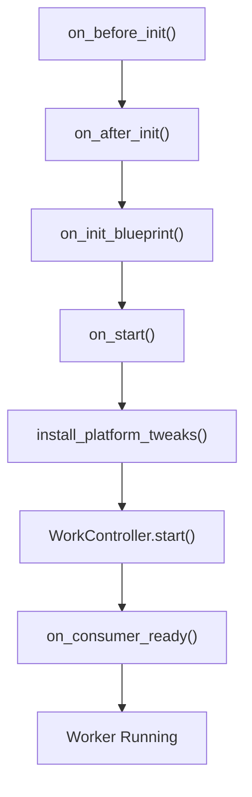
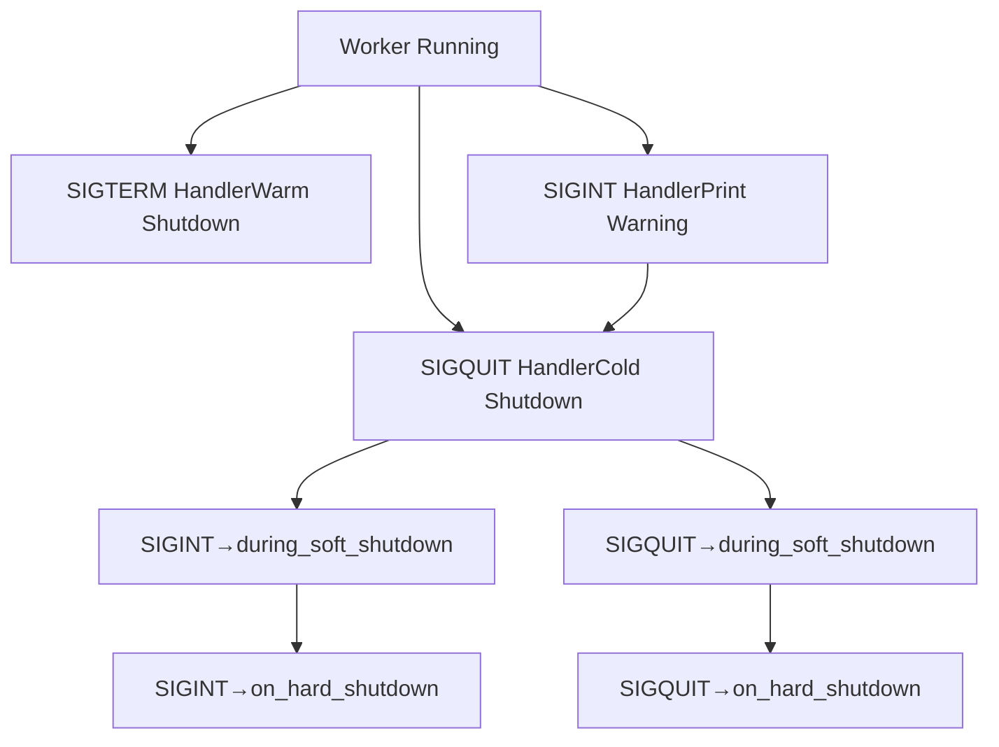

# Worker Lifecycle and Shutdown

Relevant source files

-   [celery/apps/beat.py](https://github.com/celery/celery/blob/4d068b56/celery/apps/beat.py)
-   [celery/apps/worker.py](https://github.com/celery/celery/blob/4d068b56/celery/apps/worker.py)
-   [celery/bootsteps.py](https://github.com/celery/celery/blob/4d068b56/celery/bootsteps.py)
-   [celery/worker/\_\_init\_\_.py](https://github.com/celery/celery/blob/4d068b56/celery/worker/__init__.py)
-   [celery/worker/autoscale.py](https://github.com/celery/celery/blob/4d068b56/celery/worker/autoscale.py)
-   [celery/worker/components.py](https://github.com/celery/celery/blob/4d068b56/celery/worker/components.py)
-   [celery/worker/loops.py](https://github.com/celery/celery/blob/4d068b56/celery/worker/loops.py)

This document describes the Celery worker process lifecycle from startup to shutdown, including the initialization sequence, signal handling mechanisms, and various shutdown modes. For information about the internal worker architecture and component system, see [Worker Architecture and Bootsteps](/celery/celery/5.1-worker-architecture-and-bootsteps). For details on concurrency models, see [Concurrency Models](/celery/celery/5.3-concurrency-models). For worker configuration, see [Worker Configuration and Control](/celery/celery/5.4-worker-configuration-and-control).

## Overview

The Celery worker (`Worker` class) is a long-running process that receives and executes tasks from a message broker. The worker lifecycle consists of three main phases:

1.  **Startup**: Initialization of components through the bootstep system
2.  **Operation**: Continuous task consumption and execution
3.  **Shutdown**: Graceful or forceful termination with various modes

The worker supports multiple shutdown modes to handle different operational requirements, from graceful completion of running tasks to immediate termination.

Sources: [celery/apps/worker.py1-518](https://github.com/celery/celery/blob/4d068b56/celery/apps/worker.py#L1-L518)

## Worker Startup Lifecycle

### Initialization Sequence

The worker startup follows a structured sequence managed by the `Worker` class (which extends `WorkController`):

> **[Mermaid sequence]**
> *(图表结构无法解析)*

Sources: [celery/apps/worker.py85-191](https://github.com/celery/celery/blob/4d068b56/celery/apps/worker.py#L85-L191)

### Signal Handler Installation

During `install_platform_tweaks()`, the worker installs platform-specific signal handlers:

| Signal | Handler Function | Purpose |
| --- | --- | --- |
| SIGTERM | `install_worker_term_handler` | Warm or cold shutdown (configurable) |
| SIGINT | `install_worker_int_handler` | Initial handler, transitions to cold |
| SIGQUIT | `install_worker_term_hard_handler` | Cold shutdown |
| SIGHUP | `install_worker_restart_handler` | Worker restart (non-macOS) |
| SIGUSR1 | `install_cry_handler` | Stack trace dump |
| SIGUSR2 | `install_rdb_handler` | Remote debugger breakpoint |

Sources: [celery/apps/worker.py248-268](https://github.com/celery/celery/blob/4d068b56/celery/apps/worker.py#L248-L268) [celery/apps/worker.py428-518](https://github.com/celery/celery/blob/4d068b56/celery/apps/worker.py#L428-L518)

### Startup Hooks

The worker provides several initialization hooks that execute at specific points:


Sources: [celery/apps/worker.py88-176](https://github.com/celery/celery/blob/4d068b56/celery/apps/worker.py#L88-L176)

## Shutdown Modes

The worker supports four distinct shutdown modes, each with different behavior regarding task completion:

### Shutdown Mode Comparison

| Mode | Signal | Task Completion | Requeue Behavior | Use Case |
| --- | --- | --- | --- | --- |
| **Warm** | SIGTERM | Wait for all tasks | No requeue | Graceful deployment updates |
| **Soft** | N/A (automatic) | Wait with timeout | Requeue on timeout | Visibility timeout brokers |
| **Cold** | SIGQUIT | Cancel all tasks | Immediate requeue | Force stop with cleanup |
| **Hard** | Multiple SIGINT/SIGQUIT | Immediate kill | No cleanup | Emergency termination |

Sources: [celery/apps/worker.py282-444](https://github.com/celery/celery/blob/4d068b56/celery/apps/worker.py#L282-L444)

### Warm Shutdown

Warm shutdown allows all currently executing tasks to complete before worker termination. The worker stops accepting new tasks but waits indefinitely for running tasks to finish.

**Trigger**: SIGTERM (default behavior)

**Behavior**:

1.  Set `state.should_stop = True`
2.  Stop accepting new tasks from broker
3.  Wait for all running tasks to complete
4.  Exit cleanly with status code `EX_OK`

> **[Mermaid stateDiagram]**
> *(图表结构无法解析)*

Sources: [celery/apps/worker.py282-310](https://github.com/celery/celery/blob/4d068b56/celery/apps/worker.py#L282-L310) [celery/apps/worker.py428-436](https://github.com/celery/celery/blob/4d068b56/celery/apps/worker.py#L428-L436)

### Cold Shutdown

Cold shutdown immediately cancels all running tasks and terminates the worker. Tasks are requeued to the broker for retry by other workers.

**Trigger**: SIGQUIT or SIGINT (after first SIGINT)

**Behavior**:

1.  Wait for soft shutdown timeout (if enabled)
2.  Cancel all unacknowledged requests
3.  Set `state.should_terminate = True`
4.  Stop the pool
5.  Exit with status code `EX_FAILURE`

> **[Mermaid stateDiagram]**
> *(图表结构无法解析)*

Sources: [celery/apps/worker.py363-425](https://github.com/celery/celery/blob/4d068b56/celery/apps/worker.py#L363-L425) [celery/apps/worker.py438-444](https://github.com/celery/celery/blob/4d068b56/celery/apps/worker.py#L438-L444)

### Soft Shutdown

Soft shutdown is a time-limited warm shutdown that occurs automatically before cold shutdown. It provides a grace period for tasks to complete before forced cancellation.

**Configuration**:

-   `worker_soft_shutdown_timeout`: Duration in seconds (default: `0.0`, disabled)
-   `worker_enable_soft_shutdown_on_idle`: Enable even when idle (default: `False`)

**Behavior**:

1.  Initiated automatically before cold shutdown
2.  Wait up to `worker_soft_shutdown_timeout` seconds
3.  If timeout expires, proceed with cold shutdown
4.  If all tasks complete within timeout, exit cleanly

This mechanism is particularly useful for brokers with visibility timeouts (Redis, SQS) to allow tasks to be properly requeued before the visibility timeout expires.

Sources: [celery/apps/worker.py409-410](https://github.com/celery/celery/blob/4d068b56/celery/apps/worker.py#L409-L410) [Changelog.rst414-439](https://github.com/celery/celery/blob/4d068b56/Changelog.rst#L414-L439)

### Hard Shutdown

Hard shutdown forcefully terminates the worker immediately without cleanup. This is a last-resort mechanism for stuck workers.

**Trigger**: Multiple SIGINT or SIGQUIT signals during shutdown

**Behavior**:

1.  Raise `WorkerTerminate` exception with `EX_FAILURE`
2.  Immediate process termination
3.  No task cleanup or requeuing
4.  May leave tasks in inconsistent state

> **[Mermaid stateDiagram]**
> *(图表结构无法解析)*

Sources: [celery/apps/worker.py313-329](https://github.com/celery/celery/blob/4d068b56/celery/apps/worker.py#L313-L329) [celery/apps/worker.py349-350](https://github.com/celery/celery/blob/4d068b56/celery/apps/worker.py#L349-L350)

## Signal Handling Implementation

### Signal Handler Architecture

The signal handling system uses a state machine pattern to handle multiple signals and transition between shutdown modes:


Sources: [celery/apps/worker.py282-461](https://github.com/celery/celery/blob/4d068b56/celery/apps/worker.py#L282-L461)

### SIGINT Progression

The SIGINT (Ctrl+C) handler implements a three-stage progression:

**Stage 1 - First SIGINT (`on_SIGINT`)**:

-   Print warning: "Hitting Ctrl+C again will initiate cold shutdown"
-   Replace SIGINT handler with cold shutdown handler
-   Continue running

**Stage 2 - Second SIGINT (`on_cold_shutdown`)**:

-   Print warning: "Hitting Ctrl+C again will terminate all running tasks"
-   Replace SIGINT/SIGQUIT handlers with `during_soft_shutdown`
-   Initiate soft shutdown (if enabled)
-   Cancel all tasks after timeout
-   Replace handlers with `on_hard_shutdown`

**Stage 3 - Third SIGINT (`on_hard_shutdown`)**:

-   Raise `WorkerTerminate` exception
-   Immediate process termination

Sources: [celery/apps/worker.py447-461](https://github.com/celery/celery/blob/4d068b56/celery/apps/worker.py#L447-L461) [celery/apps/worker.py363-425](https://github.com/celery/celery/blob/4d068b56/celery/apps/worker.py#L363-L425) [celery/apps/worker.py313-329](https://github.com/celery/celery/blob/4d068b56/celery/apps/worker.py#L313-L329)

### REMAP\_SIGTERM Feature

The `REMAP_SIGTERM` environment variable allows remapping SIGTERM to behave like SIGQUIT, enabling cold shutdown via SIGTERM instead of warm shutdown.

**Configuration**:

```
export REMAP_SIGTERM="SIGQUIT"
```
**Effect**:

-   SIGTERM triggers cold shutdown instead of warm shutdown
-   Useful in containerized environments where SIGTERM is standard
-   Allows soft shutdown mechanism with container orchestrators

**Implementation**:

```
# When REMAP_SIGTERM="SIGQUIT"
install_worker_term_handler = partial(
    _shutdown_handler, sig='SIGTERM', how='Cold',
    callback=on_cold_shutdown, exitcode=EX_FAILURE,
)
```
Sources: [celery/apps/worker.py428-436](https://github.com/celery/celery/blob/4d068b56/celery/apps/worker.py#L428-L436) [docs/history/changelog-5.5.rst251-271](https://github.com/celery/celery/blob/4d068b56/docs/history/changelog-5.5.rst#L251-L271)

## Shutdown Flow Details

### Warm Shutdown Handler

The `_shutdown_handler` function is the base implementation for warm shutdown:

> **[Mermaid sequence]**
> *(图表结构无法解析)*

Sources: [celery/apps/worker.py282-310](https://github.com/celery/celery/blob/4d068b56/celery/apps/worker.py#L282-L310)

### Cold Shutdown Handler

The `on_cold_shutdown` function implements the complete cold shutdown sequence:

> **[Mermaid sequence]**
> *(图表结构无法解析)*

Sources: [celery/apps/worker.py363-425](https://github.com/celery/celery/blob/4d068b56/celery/apps/worker.py#L363-L425)

### Soft Shutdown During Cold Shutdown

The `during_soft_shutdown` handler manages the transition period:

> **[Mermaid stateDiagram]**
> *(图表结构无法解析)*

The `during_soft_shutdown` function:

1.  Replaces SIGINT/SIGQUIT handlers with `on_hard_shutdown`
2.  Cancels all unacknowledged requests
3.  Prints message: "Waiting gracefully for cold shutdown to complete"
4.  Returns to allow soft shutdown timeout to continue

Sources: [celery/apps/worker.py332-361](https://github.com/celery/celery/blob/4d068b56/celery/apps/worker.py#L332-L361)

## Platform-Specific Behavior

### macOS Handling

On macOS, worker restart via SIGHUP is not supported due to thread limitations:

```
if self.app.IS_macOS:
    # macOS can't exec from a process using threads
    install_HUP_not_supported_handler(worker)
else:
    install_worker_restart_handler(worker)
```
The `install_HUP_not_supported_handler` displays a warning instead of restarting.

Sources: [celery/apps/worker.py258-263](https://github.com/celery/celery/blob/4d068b56/celery/apps/worker.py#L258-L263)

### Jython Handling

On Jython, SIGQUIT and SIGINT handlers are disabled:

```
if not is_jython:
    install_worker_term_hard_handler = partial(
        _shutdown_handler, sig='SIGQUIT', how='Cold',
        callback=on_cold_shutdown, exitcode=EX_FAILURE,
    )
else:
    install_worker_term_handler = \
        install_worker_term_hard_handler = lambda *a, **kw: None
```
Sources: [celery/apps/worker.py438-444](https://github.com/celery/celery/blob/4d068b56/celery/apps/worker.py#L438-L444)

## State Management

### Worker State Module

The worker maintains global state flags in `celery.worker.state`:

| State Variable | Type | Purpose |
| --- | --- | --- |
| `should_stop` | int/None | Warm shutdown signal, contains exit code |
| `should_terminate` | int/None | Cold shutdown signal, contains exit code |

These flags are checked by the worker's main loop and component lifecycle methods to determine when and how to shut down.

Sources: [celery/apps/worker.py307-308](https://github.com/celery/celery/blob/4d068b56/celery/apps/worker.py#L307-L308) [celery/apps/worker.py420](https://github.com/celery/celery/blob/4d068b56/celery/apps/worker.py#L420-L420)

### Signal Handler Context

All signal handlers execute within the `in_sighandler()` context manager to set proper state:

```
def _handle_request(*args):
    with in_sighandler():
        # Handler implementation
        ...
```
This ensures proper logging and state tracking during signal processing.

Sources: [celery/apps/worker.py296](https://github.com/celery/celery/blob/4d068b56/celery/apps/worker.py#L296-L296)

## Configuration Options

### Soft Shutdown Configuration

| Setting | Type | Default | Description |
| --- | --- | --- | --- |
| `worker_soft_shutdown_timeout` | float | 0.0 | Seconds to wait before cold shutdown |
| `worker_enable_soft_shutdown_on_idle` | bool | False | Enable soft shutdown when idle |

Example configuration:

```
app.conf.worker_soft_shutdown_timeout = 30.0
app.conf.worker_enable_soft_shutdown_on_idle = True
```
Sources: [Changelog.rst414-439](https://github.com/celery/celery/blob/4d068b56/Changelog.rst#L414-L439)

### Shutdown-Related Settings

| Setting | Type | Default | Description |
| --- | --- | --- | --- |
| `worker_redirect_stdouts` | bool | True | Redirect stdout/stderr |
| `worker_redirect_stdouts_level` | str | 'WARNING' | Log level for redirects |

Sources: [celery/apps/worker.py103-106](https://github.com/celery/celery/blob/4d068b56/celery/apps/worker.py#L103-L106)

## Best Practices

### Deployment Considerations

1.  **Use SIGTERM for graceful deployment updates**: Allows tasks to complete naturally
2.  **Configure soft shutdown for visibility timeout brokers**: Prevents task loss with Redis/SQS
3.  **Set appropriate soft shutdown timeout**: Should be less than visibility timeout
4.  **Use REMAP\_SIGTERM in containers**: Aligns with container orchestrator expectations
5.  **Avoid SIGKILL**: Always allow at least cold shutdown to complete for proper cleanup

### Signal Flow Example

**Containerized deployment with soft shutdown**:

```
# Configure container
export REMAP_SIGTERM="SIGQUIT"

# In app configuration
app.conf.worker_soft_shutdown_timeout = 25.0  # Less than 30s visibility timeout
app.conf.broker_transport_options = {'visibility_timeout': 30}
```
**Shutdown sequence**:

1.  Container sends SIGTERM (mapped to SIGQUIT)
2.  Worker enters cold shutdown mode
3.  Soft shutdown waits up to 25 seconds
4.  Tasks complete or are canceled
5.  Tasks requeued with 30s visibility timeout
6.  Worker exits cleanly

Sources: [docs/history/changelog-5.5.rst142-168](https://github.com/celery/celery/blob/4d068b56/docs/history/changelog-5.5.rst#L142-L168)

## Troubleshooting

### Worker Won't Shut Down

**Symptom**: Worker ignores shutdown signals

**Common Causes**:

1.  Task with infinite loop or blocking I/O
2.  Signal handler not installed (rare)
3.  Pool worker stuck

**Solution**: Send SIGQUIT for cold shutdown, then SIGQUIT again for hard shutdown if needed

### Tasks Lost During Shutdown

**Symptom**: Tasks disappear during worker restart

**Common Causes**:

1.  Using cold shutdown without visibility timeout
2.  Soft shutdown timeout too short
3.  Warm shutdown with visibility timeout broker

**Solution**: Configure soft shutdown with appropriate timeout for visibility timeout brokers

### Incomplete Task Cleanup

**Symptom**: Tasks remain in "started" state after worker shutdown

**Common Causes**:

1.  Hard shutdown used (multiple signals)
2.  Result backend not updated during shutdown

**Solution**: Avoid hard shutdown; use cold shutdown instead

Sources: [celery/apps/worker.py282-518](https://github.com/celery/celery/blob/4d068b56/celery/apps/worker.py#L282-L518)
