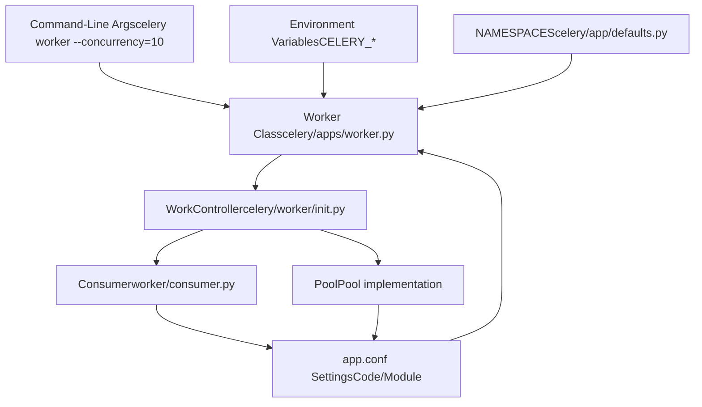
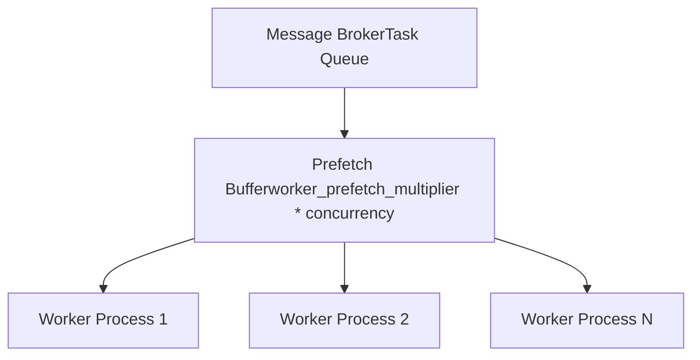
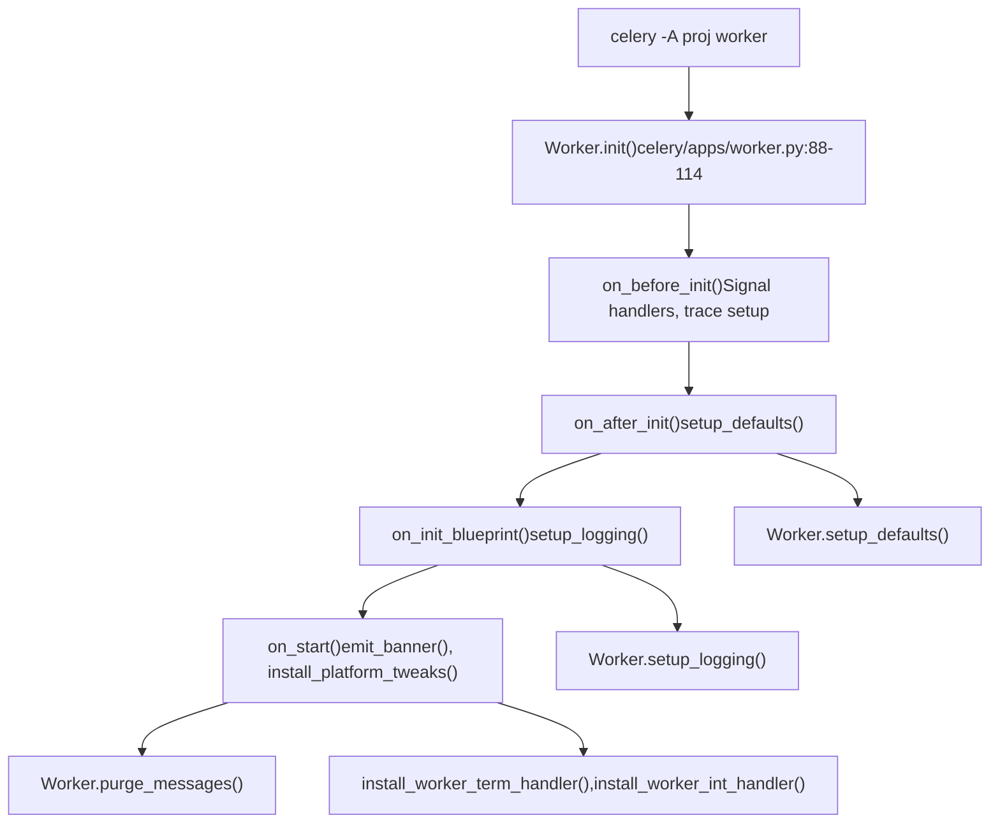

# Worker Configuration and Control

Relevant source files

-   [celery/app/defaults.py](https://github.com/celery/celery/blob/4d068b56/celery/app/defaults.py)
-   [docs/faq.rst](https://github.com/celery/celery/blob/4d068b56/docs/faq.rst)
-   [docs/getting-started/first-steps-with-celery.rst](https://github.com/celery/celery/blob/4d068b56/docs/getting-started/first-steps-with-celery.rst)
-   [docs/getting-started/next-steps.rst](https://github.com/celery/celery/blob/4d068b56/docs/getting-started/next-steps.rst)
-   [docs/userguide/calling.rst](https://github.com/celery/celery/blob/4d068b56/docs/userguide/calling.rst)
-   [docs/userguide/monitoring.rst](https://github.com/celery/celery/blob/4d068b56/docs/userguide/monitoring.rst)
-   [docs/userguide/periodic-tasks.rst](https://github.com/celery/celery/blob/4d068b56/docs/userguide/periodic-tasks.rst)
-   [docs/userguide/routing.rst](https://github.com/celery/celery/blob/4d068b56/docs/userguide/routing.rst)
-   [docs/userguide/tasks.rst](https://github.com/celery/celery/blob/4d068b56/docs/userguide/tasks.rst)
-   [docs/userguide/workers.rst](https://github.com/celery/celery/blob/4d068b56/docs/userguide/workers.rst)

This page documents worker configuration options and remote control mechanisms for managing Celery workers at runtime. It covers configuration sources, available settings, command-line options, and the control/inspect API for remote worker management.

For worker architecture and initialization, see page 5.1. For worker lifecycle and shutdown procedures, see page 5.2. For concurrency pool implementations, see page 5.3.

---

## Configuration Sources and Priority

Worker configuration is loaded from multiple sources with a specific precedence order. Settings from higher-priority sources override those from lower-priority sources. The `Worker` class in [celery/apps/worker.py85-280](https://github.com/celery/celery/blob/4d068b56/celery/apps/worker.py#L85-L280) processes these configurations during initialization.

### Configuration Flow Through Worker Components


**Sources:** [celery/apps/worker.py85-280](https://github.com/celery/celery/blob/4d068b56/celery/apps/worker.py#L85-L280) [celery/app/defaults.py1-436](https://github.com/celery/celery/blob/4d068b56/celery/app/defaults.py#L1-L436)

### Configuration Namespaces

Worker configuration is organized into namespaces defined by the `NAMESPACES` object in [celery/app/defaults.py66-363](https://github.com/celery/celery/blob/4d068b56/celery/app/defaults.py#L66-L363) Each namespace groups related `Option` instances:

| Namespace | Prefix | Purpose | Defined In |
| --- | --- | --- | --- |
| `worker` | `worker_*` | Worker process behavior and resources | [celery/app/defaults.py313-362](https://github.com/celery/celery/blob/4d068b56/celery/app/defaults.py#L313-L362) |
| `task` | `task_*` | Task execution settings affecting workers | [celery/app/defaults.py259-312](https://github.com/celery/celery/blob/4d068b56/celery/app/defaults.py#L259-L312) |
| `broker` | `broker_*` | Message broker connection settings | [celery/app/defaults.py83-107](https://github.com/celery/celery/blob/4d068b56/celery/app/defaults.py#L83-L107) |
| `result` | `result_*` | Result backend settings | [celery/app/defaults.py204-229](https://github.com/celery/celery/blob/4d068b56/celery/app/defaults.py#L204-L229) |
| `event` | `event_*` | Event monitoring settings | [celery/app/defaults.py178-188](https://github.com/celery/celery/blob/4d068b56/celery/app/defaults.py#L178-L188) |

**Sources:** [celery/app/defaults.py66-363](https://github.com/celery/celery/blob/4d068b56/celery/app/defaults.py#L66-L363)

---

## Worker Configuration Settings

### Core Worker Settings

The following table describes essential worker configuration options from the `worker` namespace in [celery/app/defaults.py313-362](https://github.com/celery/celery/blob/4d068b56/celery/app/defaults.py#L313-L362) Each setting is defined as an `Option` instance with a default value and type.

| Setting | Type | Default | Description | Option Line |
| --- | --- | --- | --- | --- |
| `worker_concurrency` | int | None | Number of worker processes/threads | [celery/app/defaults.py322](https://github.com/celery/celery/blob/4d068b56/celery/app/defaults.py#L322-L322) |
| `worker_pool` | str | `'prefork'` | Pool implementation (prefork, eventlet, gevent, solo, thread) | [celery/app/defaults.py340](https://github.com/celery/celery/blob/4d068b56/celery/app/defaults.py#L340-L340) |
| `worker_prefetch_multiplier` | int | 4 | Tasks to prefetch per worker process | [celery/app/defaults.py344](https://github.com/celery/celery/blob/4d068b56/celery/app/defaults.py#L344-L344) |
| `worker_max_tasks_per_child` | int | None | Restart worker after N tasks | [celery/app/defaults.py339](https://github.com/celery/celery/blob/4d068b56/celery/app/defaults.py#L339-L339) |
| `worker_max_memory_per_child` | int | None | Restart worker after memory limit (KB) | [celery/app/defaults.py338](https://github.com/celery/celery/blob/4d068b56/celery/app/defaults.py#L338-L338) |
| `worker_lost_wait` | float | 10.0 | Seconds to wait for lost worker process | [celery/app/defaults.py337](https://github.com/celery/celery/blob/4d068b56/celery/app/defaults.py#L337-L337) |
| `worker_disable_rate_limits` | bool | False | Disable all rate limits | [celery/app/defaults.py325-327](https://github.com/celery/celery/blob/4d068b56/celery/app/defaults.py#L325-L327) |
| `worker_enable_remote_control` | bool | True | Enable remote control commands | [celery/app/defaults.py331-333](https://github.com/celery/celery/blob/4d068b56/celery/app/defaults.py#L331-L333) |
| `worker_send_task_events` | bool | False | Emit task monitoring events | [celery/app/defaults.py354-356](https://github.com/celery/celery/blob/4d068b56/celery/app/defaults.py#L354-L356) |
| `worker_state_db` | str | None | Persistent state database file path | [celery/app/defaults.py357](https://github.com/celery/celery/blob/4d068b56/celery/app/defaults.py#L357-L357) |
| `worker_autoscaler` | str | `'celery.worker.autoscale:Autoscaler'` | Autoscaler class | [celery/app/defaults.py316](https://github.com/celery/celery/blob/4d068b56/celery/app/defaults.py#L316-L316) |
| `worker_consumer` | str | `'celery.worker.consumer:Consumer'` | Consumer class | [celery/app/defaults.py323](https://github.com/celery/celery/blob/4d068b56/celery/app/defaults.py#L323-L323) |

**Sources:** [celery/app/defaults.py313-362](https://github.com/celery/celery/blob/4d068b56/celery/app/defaults.py#L313-L362) [docs/userguide/workers.rst331-390](https://github.com/celery/celery/blob/4d068b56/docs/userguide/workers.rst#L331-L390)

### Prefetch and QoS Settings


The `worker_prefetch_multiplier` determines how many messages each worker process reserves from the broker:

-   **Default: 4** - Each worker prefetches 4 messages
-   **Total prefetch** = `concurrency * prefetch_multiplier`
-   **Example**: 8 workers × 4 prefetch = 32 messages reserved

To disable prefetch entirely (not recommended):

```
app.conf.worker_disable_prefetch = True
```
**Sources:** [celery/app/defaults.py344-347](https://github.com/celery/celery/blob/4d068b56/celery/app/defaults.py#L344-L347) [docs/userguide/workers.rst391-410](https://github.com/celery/celery/blob/4d068b56/docs/userguide/workers.rst#L391-L410)

### Worker Lifecycle Settings

| Setting | Type | Default | Description |
| --- | --- | --- | --- |
| `worker_soft_shutdown_timeout` | float | 0.0 | Time-limited warm shutdown before cold shutdown (seconds) |
| `worker_enable_soft_shutdown_on_idle` | bool | False | Enable soft shutdown even when no tasks running |
| `worker_cancel_long_running_tasks_on_connection_loss` | bool | False | Cancel tasks when broker connection lost |
| `worker_proc_alive_timeout` | float | 4.0 | Timeout to verify worker process is alive |
| `worker_pool_restarts` | bool | False | Enable automatic pool restarts |

**Sources:** [celery/app/defaults.py318-343](https://github.com/celery/celery/blob/4d068b56/celery/app/defaults.py#L318-L343)

### Logging and Monitoring Settings

| Setting | Type | Default | Description |
| --- | --- | --- | --- |
| `worker_log_format` | str | See defaults | Log message format for worker |
| `worker_log_color` | bool | Varies | Enable colored logging output |
| `worker_hijack_root_logger` | bool | True | Redirect root logger to Celery logger |
| `worker_redirect_stdouts` | bool | True | Redirect stdout/stderr to logger |
| `worker_redirect_stdouts_level` | str | `'WARNING'` | Log level for redirected output |
| `worker_task_log_format` | str | See defaults | Log format for task execution messages |

**Sources:** [celery/app/defaults.py334-358](https://github.com/celery/celery/blob/4d068b56/celery/app/defaults.py#L334-L358)

### Task Execution Settings

These task-level settings affect how workers execute tasks:

| Setting | Type | Default | Description |
| --- | --- | --- | --- |
| `task_acks_late` | bool | False | Acknowledge task after execution (not before) |
| `task_acks_on_failure_or_timeout` | bool | True | Acknowledge failed/timed-out tasks |
| `task_reject_on_worker_lost` | bool | None | Reject task if worker process dies |
| `task_track_started` | bool | False | Report STARTED state to result backend |
| `task_time_limit` | float | None | Hard time limit in seconds |
| `task_soft_time_limit` | float | None | Soft time limit (raises exception) |
| `task_default_rate_limit` | str | None | Default rate limit (e.g., '100/m') |
| `task_remote_tracebacks` | bool | False | Send exception tracebacks in task messages |

**Sources:** [celery/app/defaults.py259-311](https://github.com/celery/celery/blob/4d068b56/celery/app/defaults.py#L259-L311) [docs/userguide/tasks.rst1020-1100](https://github.com/celery/celery/blob/4d068b56/docs/userguide/tasks.rst#L1020-L1100)

---

## Command-Line Options

Workers accept numerous command-line options that override configuration settings. The `celery worker` command provides the primary interface, implemented by the `Worker` class in [celery/apps/worker.py85-280](https://github.com/celery/celery/blob/4d068b56/celery/apps/worker.py#L85-L280)

### Worker Initialization from Command-Line


**Sources:** [celery/apps/worker.py88-161](https://github.com/celery/celery/blob/4d068b56/celery/apps/worker.py#L88-L161)

### Essential Command-Line Options

| Option | Short | Type | Example | Description |
| --- | --- | --- | --- | --- |
| `--concurrency` | `-c` | int | `-c 8` | Number of worker processes |
| `--pool` | `-P` | str | `-P eventlet` | Pool implementation |
| `--hostname` | `-n` | str | `-n worker1@%h` | Worker node name |
| `--loglevel` | `-l` | str | `-l INFO` | Logging level |
| `--queues` | `-Q` | str | `-Q celery,priority` | Queues to consume from |
| `--autoscale` |  | str | `--autoscale=10,3` | Autoscale (max,min) |
| `--max-tasks-per-child` |  | int | `--max-tasks-per-child=1000` | Restart after N tasks |
| `--max-memory-per-child` |  | int | `--max-memory-per-child=200000` | Restart after memory limit (KB) |
| `--time-limit` |  | float | `--time-limit=300` | Hard time limit (seconds) |
| `--soft-time-limit` |  | float | `--soft-time-limit=240` | Soft time limit (seconds) |
| `--statedb` |  | str | `--statedb=/var/celery/worker.db` | State persistence file |
| `--purge` |  | flag | `--purge` | Purge messages on startup |
| `--task-events` | `-E` | flag | `-E` | Enable task event monitoring |

**Sources:** [docs/userguide/workers.rst11-62](https://github.com/celery/celery/blob/4d068b56/docs/userguide/workers.rst#L11-L62) [celery/apps/worker.py85-280](https://github.com/celery/celery/blob/4d068b56/celery/apps/worker.py#L85-L280)

### Hostname Variable Expansion

The `--hostname` option supports variable expansion for multi-worker deployments:

| Variable | Expansion | Example |
| --- | --- | --- |
| `%h` | Full hostname with domain | `worker@host.example.com` |
| `%n` | Hostname only | `worker@host` |
| `%d` | Domain name only | `worker@example.com` |
| `%i` | Pool process index (0 for main) | `worker-1` |
| `%I` | Pool process index with separator | `worker-1` (empty for main) |

Example starting multiple workers:

```
celery -A proj worker -n worker1@%h -c 4 -Q queue1
celery -A proj worker -n worker2@%h -c 4 -Q queue2
```
**Sources:** [docs/userguide/workers.rst36-62](https://github.com/celery/celery/blob/4d068b56/docs/userguide/workers.rst#L36-L62) [docs/userguide/workers.rst331-390](https://github.com/celery/celery/blob/4d068b56/docs/userguide/workers.rst#L331-L390)

---

## Remote Control Commands

Celery provides a control API for managing workers at runtime. Commands are sent via a broadcast mechanism using the broker's control exchange. The control interface is exposed through `app.control` methods.

### Control Message Flow

```mermaid
flowchart TD
    CLIENT["app.control.broadcast()app.control.inspect()"]
    CTRL_EX["Control Exchangecontrol_exchange setting"]
    CTRL_Q1["celery@worker1.celery.pidbox"]
    CTRL_Q2["celery@worker2.celery.pidbox"]
    CTRL_QN["celery@workerN.celery.pidbox"]
    CONSUMER1["Consumer.controlworker/consumer/control.py"]
    CONSUMER2["Consumer.controlworker/consumer/control.py"]
    CONSUMERN["Consumer.controlworker/consumer/control.py"]
    HANDLER1["Control.PanelCommand handlers"]
    HANDLER2["Control.PanelCommand handlers"]
    HANDLERN["Control.PanelCommand handlers"]
    REPLY_Q["Reply QueueTemporary pidbox queue"]

    CLIENT --> CTRL_EX
    CTRL --> EX_CTRL_Q1
    CTRL --> EX_CTRL_Q2
    CTRL --> EX_CTRL_QN
    CTRL --> Q1_CONSUMER1
    CTRL --> Q2_CONSUMER2
    CTRL --> QN_CONSUMERN
    CONSUMER1 --> HANDLER1
    CONSUMER2 --> HANDLER2
    CONSUMERN --> HANDLERN
    HANDLER1 --> REPLY_Q
    HANDLER2 --> REPLY_Q
    HANDLERN --> REPLY_Q
    REPLY --> Q_CLIENT
```


**Sources:** [docs/userguide/workers.rst412-497](https://github.com/celery/celery/blob/4d068b56/docs/userguide/workers.rst#L412-L497) [docs/userguide/monitoring.rst23-205](https://github.com/celery/celery/blob/4d068b56/docs/userguide/monitoring.rst#L23-L205)

### Control Exchange Configuration

The control exchange is configured via the `control` namespace in [celery/app/defaults.py150-156](https://github.com/celery/celery/blob/4d068b56/celery/app/defaults.py#L150-L156) These settings control the behavior of remote control message queues:

| Setting | Type | Default | Description | Option Line |
| --- | --- | --- | --- | --- |
| `control_exchange` | str | `'celery'` | Control exchange name | [celery/app/defaults.py155](https://github.com/celery/celery/blob/4d068b56/celery/app/defaults.py#L155-L155) |
| `control_queue_ttl` | float | 300.0 | Control queue TTL (seconds) | [celery/app/defaults.py151](https://github.com/celery/celery/blob/4d068b56/celery/app/defaults.py#L151-L151) |
| `control_queue_expires` | float | 10.0 | Control queue expiry (seconds) | [celery/app/defaults.py152](https://github.com/celery/celery/blob/4d068b56/celery/app/defaults.py#L152-L152) |
| `control_queue_exclusive` | bool | False | Exclusive control queues | [celery/app/defaults.py153](https://github.com/celery/celery/blob/4d068b56/celery/app/defaults.py#L153-L153) |
| `control_queue_durable` | bool | False | Durable control queues | [celery/app/defaults.py154](https://github.com/celery/celery/blob/4d068b56/celery/app/defaults.py#L154-L154) |

The control queue name format is `{exchange}@{hostname}.celery.pidbox` where exchange defaults to `'celery'` and hostname is the worker's node name.

**Sources:** [celery/app/defaults.py150-156](https://github.com/celery/celery/blob/4d068b56/celery/app/defaults.py#L150-L156) [docs/userguide/workers.rst412-497](https://github.com/celery/celery/blob/4d068b56/docs/userguide/workers.rst#L412-L497)

### Inspect Commands (Read-Only)

Inspect commands query worker state without modifying it. All inspect commands are accessed via `app.control.inspect()` and support targeting specific workers via the `destination` parameter.

#### Command Reference

| Command | Description | Returns | CLI Command |
| --- | --- | --- | --- |
| `active()` | List currently executing tasks | Dict of task info per worker | `celery -A proj inspect active` |
| `scheduled()` | List tasks with ETA/countdown | Dict of scheduled tasks per worker | `celery -A proj inspect scheduled` |
| `reserved()` | List prefetched tasks waiting to execute | Dict of reserved tasks per worker | `celery -A proj inspect reserved` |
| `stats()` | Worker statistics and metrics | Dict of stats per worker | `celery -A proj inspect stats` |
| `registered()` | List registered task names | List of task names per worker | `celery -A proj inspect registered` |
| `active_queues()` | List queues being consumed | List of queue info per worker | `celery -A proj inspect active_queues` |
| `conf()` | Worker configuration settings | Dict of configuration per worker | `celery -A proj inspect conf` |
| `query_task(task_ids)` | Query information about specific tasks | Dict of task info if found | `celery -A proj inspect query_task <id>` |
| `revoked()` | List revoked task IDs | Set of revoked task IDs per worker | `celery -A proj inspect revoked` |

#### Usage Examples

```
# Get stats from all workers
>>> app.control.inspect().stats()
{'worker1@host': {'total': {...}, 'pool': {...}},
 'worker2@host': {'total': {...}, 'pool': {...}}}

# Get active tasks from specific worker
>>> i = app.control.inspect(destination=['worker1@host'])
>>> i.active()
{'worker1@host': [{'id': 'task-id', 'name': 'myapp.tasks.add', ...}]}

# Query task by ID
>>> app.control.inspect().query_task('task-id-123')
{'worker1@host': {'id': 'task-id-123', 'name': '...', 'state': 'RUNNING'}}
```
Command-line equivalent:

```
# Inspect active tasks
celery -A proj inspect active

# Target specific worker
celery -A proj inspect active -d worker1@host
```
**Sources:** [docs/userguide/monitoring.rst101-159](https://github.com/celery/celery/blob/4d068b56/docs/userguide/monitoring.rst#L101-L159) [docs/userguide/workers.rst412-497](https://github.com/celery/celery/blob/4d068b56/docs/userguide/workers.rst#L412-L497)

### Worker Statistics Structure

The `stats()` command returns detailed worker metrics:

```
{
    'worker1@host': {
        'total': {
            'tasks.add': 1234,  # Count per task type
            # ...
        },
        'pool': {
            'max-concurrency': 8,
            'processes': [12345, 12346, ...],
            'max-tasks-per-child': 1000,
            'put-guarded-by-semaphore': True,
            'timeouts': (0.1, 0.1),
        },
        'clock': '12345',
        'uptime': 3600,
        'rusage': {...},  # Resource usage
        'prefetch_count': 4,
        'broker': {
            'hostname': 'localhost',
            'port': 5672,
            'transport': 'amqp',
        },
    }
}
```
**Sources:** [docs/userguide/monitoring.rst140-144](https://github.com/celery/celery/blob/4d068b56/docs/userguide/monitoring.rst#L140-L144)

### Control Commands (Write Operations)

Control commands modify worker state or trigger actions.

#### Pool Management

| Command | Parameters | Description | CLI Command |
| --- | --- | --- | --- |
| `pool_grow(n)` | `n`: int | Add n worker processes to pool | `celery -A proj control pool_grow <n>` |
| `pool_shrink(n)` | `n`: int | Remove n worker processes from pool | `celery -A proj control pool_shrink <n>` |
| `autoscale(max, min)` | `max`, `min`: int | Change autoscale settings | `celery -A proj control autoscale <max> <min>` |
| `pool_restart()` | None | Restart the worker pool | `celery -A proj control pool_restart` |

```
# Grow pool by 2 processes
>>> app.control.pool_grow(2)

# Set autoscale limits
>>> app.control.autoscale(max=10, min=3)
```
Command-line equivalent:

```
# Grow pool
celery -A proj control pool_grow 2

# Autoscale
celery -A proj control autoscale 10 3
```
**Sources:** [docs/userguide/monitoring.rst161-210](https://github.com/celery/celery/blob/4d068b56/docs/userguide/monitoring.rst#L161-L210)

#### Queue Management

| Command | Parameters | Description | CLI Command |
| --- | --- | --- | --- |
| `add_consumer(queue)` | `queue`: str, `exchange`, `routing_key`, `exchange_type` | Start consuming from queue | `celery -A proj control add_consumer <queue>` |
| `cancel_consumer(queue)` | `queue`: str | Stop consuming from queue | `celery -A proj control cancel_consumer <queue>` |

```
# Start consuming from new queue
>>> app.control.add_consumer('priority', reply=True)
{'worker1@host': {'ok': 'now consuming from priority'}}

# Stop consuming from queue
>>> app.control.cancel_consumer('low-priority')
```
Command-line equivalent:

```
# Add consumer
celery -A proj control add_consumer priority

# Cancel consumer
celery -A proj control cancel_consumer low-priority
```
**Sources:** [docs/userguide/monitoring.rst161-210](https://github.com/celery/celery/blob/4d068b56/docs/userguide/monitoring.rst#L161-L210)

#### Rate Limiting

| Command | Parameters | Description | CLI Command |
| --- | --- | --- | --- |
| `rate_limit(task_name, rate_limit)` | `task_name`: str, `rate_limit`: str | Set task rate limit | `celery -A proj control rate_limit <task> <limit>` |
| `time_limit(task_name, soft, hard)` | `task_name`: str, `soft`: float, `hard`: float | Set task time limits | `celery -A proj control time_limit <task> <soft> <hard>` |

```
# Set rate limit to 100 tasks per minute
>>> app.control.rate_limit('myapp.tasks.process', '100/m')

# Set time limits (soft=60s, hard=120s)
>>> app.control.time_limit('myapp.tasks.slow', soft=60, hard=120)
```
Command-line equivalent:

```
# Set rate limit
celery -A proj control rate_limit myapp.tasks.process 100/m

# Set time limits
celery -A proj control time_limit myapp.tasks.slow 60 120
```
**Sources:** [docs/userguide/workers.rst462-496](https://github.com/celery/celery/blob/4d068b56/docs/userguide/workers.rst#L462-L496) [docs/getting-started/first-steps-with-celery.rst401-414](https://github.com/celery/celery/blob/4d068b56/docs/getting-started/first-steps-with-celery.rst#L401-L414)

#### Event Monitoring

| Command | Description |
| --- | --- |
| `enable_events()` | Enable task event monitoring |
| `disable_events()` | Disable task event monitoring |

```
# Enable events on all workers
>>> app.control.enable_events()

# Disable events on specific worker
>>> app.control.broadcast('disable_events',
...                       destination=['worker1@host'])
```
#### Task Revocation

| Command | Parameters | Description |
| --- | --- | --- |
| `revoke(task_id)` | `task_id`: str, `terminate`: bool, `signal`: str | Revoke task by ID |
| `revoke_by_stamped_headers(headers)` | `headers`: dict | Revoke tasks by stamped headers |

```
# Revoke task (won't execute if pending)
>>> app.control.revoke('task-id-123')

# Revoke and terminate if running
>>> app.control.revoke('task-id-123', terminate=True, signal='SIGKILL')

# Revoke by header
>>> app.control.revoke_by_stamped_headers({'header': 'value'})
```
**Sources:** [docs/userguide/workers.rst498-645](https://github.com/celery/celery/blob/4d068b56/docs/userguide/workers.rst#L498-L645)

#### Worker Management

| Command | Parameters | Description | CLI Command |
| --- | --- | --- | --- |
| `shutdown()` | None | Initiate warm shutdown | `celery -A proj control shutdown` |
| `heartbeat()` | None | Request heartbeat response | N/A (automatic) |
| `ping()` | None | Check if workers are alive | `celery -A proj inspect ping` |
| `election()` | None | Elect a master worker | `celery -A proj control election` |

```
# Ping all workers (returns within timeout)
>>> app.control.ping(timeout=1.0)
[{'worker1@host': {'ok': 'pong'}},
 {'worker2@host': {'ok': 'pong'}}]

# Shutdown specific worker
>>> app.control.broadcast('shutdown', destination=['worker1@host'])

# Shutdown all workers
>>> app.control.shutdown()
```
Command-line equivalent:

```
# Ping workers
celery -A proj inspect ping

# Shutdown workers
celery -A proj control shutdown
```
**Sources:** [docs/userguide/monitoring.rst59-64](https://github.com/celery/celery/blob/4d068b56/docs/userguide/monitoring.rst#L59-L64)

### Broadcast API

The `broadcast()` method provides low-level access to the control system for sending commands to workers:

```
app.control.broadcast(
    command,              # Command name (str)
    arguments=None,       # Command arguments (dict)
    destination=None,     # Target workers (list of hostnames)
    reply=False,          # Wait for replies (bool)
    timeout=1.0,          # Reply timeout (float)
    limit=None,           # Max replies (int)
    callback=None,        # Reply callback (callable)
)
```
Example sending custom control command:

```
>>> app.control.broadcast(
...     'rate_limit',
...     arguments={'task_name': 'myapp.tasks.add', 'rate_limit': '200/m'},
...     destination=['worker1@host', 'worker2@host'],
...     reply=True
... )
[{'worker1@host': {'ok': 'rate limit set'}},
 {'worker2@host': {'ok': 'rate limit set'}}]
```
The `destination` parameter accepts:

-   `None` - broadcast to all workers (default)
-   `['worker1@host']` - single worker
-   `['worker1@host', 'worker2@host']` - multiple workers

The `timeout` parameter (default 1.0) determines how long to wait for replies. Increase for slow networks or busy workers.

**Sources:** [docs/userguide/workers.rst453-496](https://github.com/celery/celery/blob/4d068b56/docs/userguide/workers.rst#L453-L496)

---

## Configuration Patterns

### Configuration via Python Module

Create a `celeryconfig.py` module:

```
# celeryconfig.py
broker_url = 'amqp://localhost'
result_backend = 'redis://localhost'

# Worker settings
worker_concurrency = 8
worker_prefetch_multiplier = 4
worker_max_tasks_per_child = 1000
worker_max_memory_per_child = 200000  # 200MB in KB
worker_send_task_events = True
worker_state_db = '/var/celery/worker.db'

# Task settings
task_acks_late = True
task_track_started = True
task_time_limit = 300
task_soft_time_limit = 240
```
Load configuration:

```
app.config_from_object('celeryconfig')
```
**Sources:** [docs/getting-started/first-steps-with-celery.rst299-414](https://github.com/celery/celery/blob/4d068b56/docs/getting-started/first-steps-with-celery.rst#L299-L414)

### Environment Variable Configuration

All settings can be overridden via environment variables using the `CELERY_` prefix:

```
export CELERY_BROKER_URL='amqp://localhost'
export CELERY_WORKER_CONCURRENCY=8
export CELERY_WORKER_PREFETCH_MULTIPLIER=4
export CELERY_WORKER_MAX_TASKS_PER_CHILD=1000
```
### Runtime Configuration Example

Complete worker startup with configuration:

```
# Start worker with comprehensive configuration
celery -A myapp worker \
  --hostname=worker1@%h \
  --concurrency=8 \
  --pool=prefork \
  --autoscale=10,3 \
  --max-tasks-per-child=1000 \
  --max-memory-per-child=200000 \
  --time-limit=300 \
  --soft-time-limit=240 \
  --loglevel=INFO \
  --logfile=/var/log/celery/worker1.log \
  --pidfile=/var/run/celery/worker1.pid \
  --statedb=/var/celery/worker1.db \
  --queues=celery,priority \
  --task-events
```
**Sources:** [docs/userguide/workers.rst11-62](https://github.com/celery/celery/blob/4d068b56/docs/userguide/workers.rst#L11-L62) [celery/apps/worker.py85-280](https://github.com/celery/celery/blob/4d068b56/celery/apps/worker.py#L85-L280)

### Multi-Worker Management

The `celery multi` command manages multiple workers:

```
# Start multiple workers
celery multi start worker1 worker2 worker3 \
  -A myapp \
  --concurrency=8 \
  --logfile=/var/log/celery/%n%I.log \
  --pidfile=/var/run/celery/%n.pid

# Restart specific worker
celery multi restart worker1 \
  -A myapp \
  --concurrency=8

# Stop all workers
celery multi stopwait worker1 worker2 worker3
```
**Sources:** [docs/getting-started/next-steps.rst146-220](https://github.com/celery/celery/blob/4d068b56/docs/getting-started/next-steps.rst#L146-L220)

---

## Worker State Persistence

Workers can persist state to disk using the `--statedb` option. This preserves:

-   Revoked task IDs
-   Task execution statistics
-   Worker clock state

### State Database Configuration

```
# Configuration
app.conf.worker_state_db = '/var/celery/worker.db'
```
Or via command-line:

```
celery -A myapp worker --statedb=/var/run/celery/worker.state
```
### Revoked Task Persistence

Revoked tasks are stored in the state database (when `--statedb` is configured) and synchronized with other workers on startup:

```
# Revoke task with persistence
>>> app.control.revoke('task-id-123')

# After worker restart, revocation is maintained
>>> app.control.inspect().revoked()
{'worker1@host': ['task-id-123', ...]}
```
Environment variables control revoke limits:

-   `CELERY_WORKER_REVOKES_MAX`: Max revoked task IDs to keep in memory (default: 50000)
-   `CELERY_WORKER_REVOKE_EXPIRES`: Revoke expiry time in seconds (default: 10800, i.e., 3 hours)

When the revoke limit is exceeded, old revocations expire after the configured time. Similarly, successful task IDs can be limited via:

-   `CELERY_WORKER_SUCCESSFUL_MAX`: Max successful task IDs (default: 1000)
-   `CELERY_WORKER_SUCCESSFUL_EXPIRES`: Successful task expiry (default: 10800)

**Sources:** [docs/userguide/workers.rst509-524](https://github.com/celery/celery/blob/4d068b56/docs/userguide/workers.rst#L509-L524) [docs/userguide/workers.rst597-624](https://github.com/celery/celery/blob/4d068b56/docs/userguide/workers.rst#L597-L624)

---

## Summary

Worker configuration in Celery provides extensive control over worker behavior through:

1.  **Configuration Sources**: CLI arguments, environment variables, code configuration, config modules, and defaults with clear precedence
2.  **Worker Settings**: Control concurrency, pool type, resource limits, monitoring, and lifecycle behavior
3.  **Task Settings**: Configure acknowledgment, time limits, rate limits, and state tracking
4.  **Command-Line Interface**: Rich set of options for worker startup and configuration
5.  **Remote Control**: Inspect and control commands for runtime management without restart
6.  **State Persistence**: Maintain worker state across restarts using state database

The control API enables dynamic worker management through the broker's control exchange, supporting both read-only inspection and write operations for pool management, queue management, rate limiting, and task revocation.

**Sources:** [celery/app/defaults.py1-436](https://github.com/celery/celery/blob/4d068b56/celery/app/defaults.py#L1-L436) [celery/apps/worker.py1-518](https://github.com/celery/celery/blob/4d068b56/celery/apps/worker.py#L1-L518) [docs/userguide/workers.rst1-1500](https://github.com/celery/celery/blob/4d068b56/docs/userguide/workers.rst#L1-L1500) [docs/userguide/monitoring.rst1-650](https://github.com/celery/celery/blob/4d068b56/docs/userguide/monitoring.rst#L1-L650)
