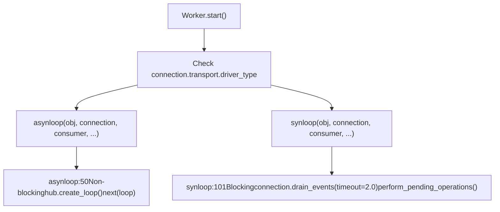
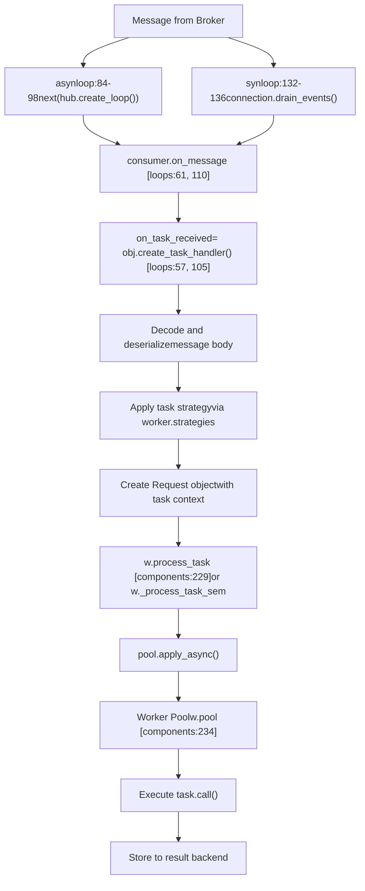
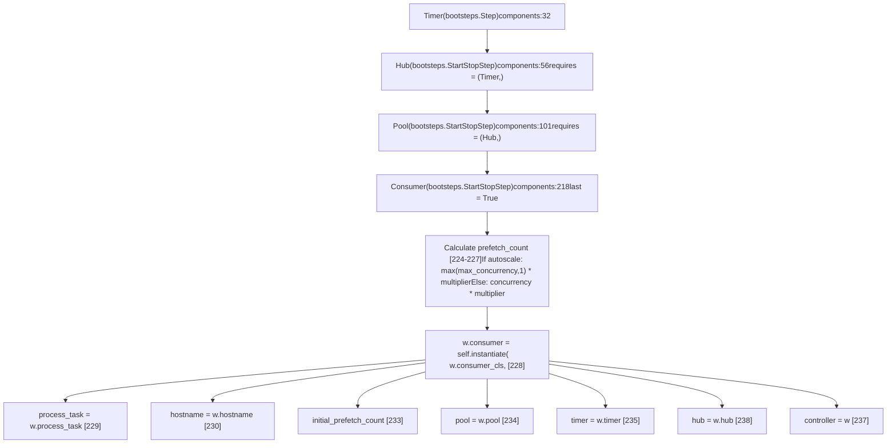
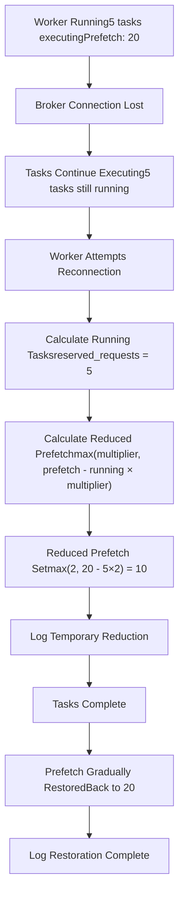
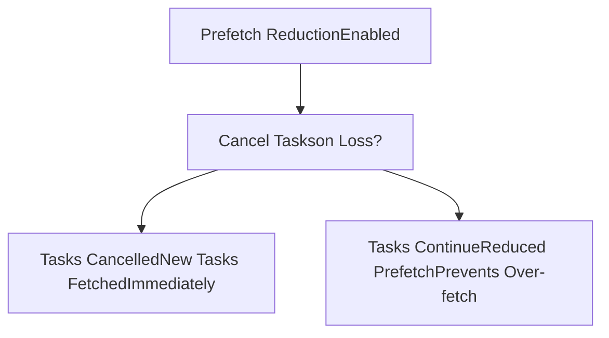
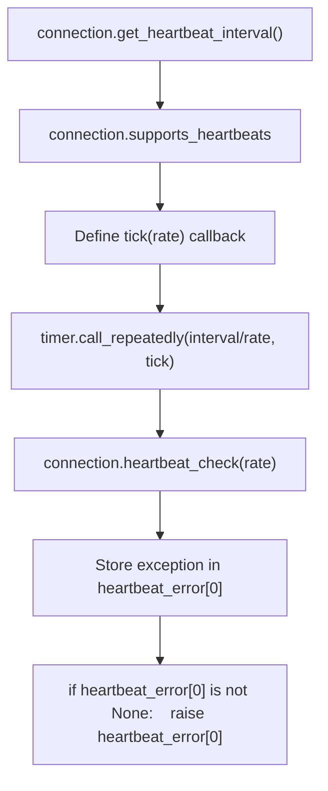

# Consumer and Event Loops

Relevant source files

-   [celery/bootsteps.py](https://github.com/celery/celery/blob/4d068b56/celery/bootsteps.py)
-   [celery/worker/autoscale.py](https://github.com/celery/celery/blob/4d068b56/celery/worker/autoscale.py)
-   [celery/worker/components.py](https://github.com/celery/celery/blob/4d068b56/celery/worker/components.py)
-   [celery/worker/loops.py](https://github.com/celery/celery/blob/4d068b56/celery/worker/loops.py)

This page documents the Consumer component and the event loop implementations (`asynloop` and `synloop`) that drive message consumption in Celery workers. It covers message processing flow, Quality of Service (QoS) management, prefetch count handling, and connection recovery mechanisms.

For information about the overall worker architecture and how the Consumer component is initialized, see page 5.1. For details on worker lifecycle events, see page 5.2. For autoscaling integration, see page 5.6.

## Overview

The `Consumer` class defined in [celery/worker/components.py218-243](https://github.com/celery/celery/blob/4d068b56/celery/worker/components.py#L218-L243) is the final bootstep in the worker's blueprint. It is marked with `last = True` to ensure it starts after all infrastructure components (Timer, Hub, Pool) are ready. The Consumer instantiates the actual consumer implementation (via `w.consumer_cls`) and manages message fetching from the broker.

After initialization, the consumer enters one of two event loop implementations defined in [celery/worker/loops.py](https://github.com/celery/celery/blob/4d068b56/celery/worker/loops.py):

| Event Loop | Function | Transport Support | Blocking Model |
| --- | --- | --- | --- |
| **asynloop** | `asynloop()` at line 50 | AMQP, async Redis | Non-blocking with `hub.create_loop()` |
| **synloop** | `synloop()` at line 101 | All transports (fallback) | Blocking with `connection.drain_events()` |

The event loops handle:

-   Integration with `kombu.asynchronous.Hub` for I/O multiplexing
-   QoS/prefetch count management for backpressure control
-   Automatic broker reconnection with exponential backoff
-   Coordination with the execution pool for task dispatch

**Sources:** [celery/worker/components.py218-243](https://github.com/celery/celery/blob/4d068b56/celery/worker/components.py#L218-L243) [celery/worker/loops.py1-11](https://github.com/celery/celery/blob/4d068b56/celery/worker/loops.py#L1-L11) [celery/worker/loops.py50](https://github.com/celery/celery/blob/4d068b56/celery/worker/loops.py#L50-L50) [celery/worker/loops.py101](https://github.com/celery/celery/blob/4d068b56/celery/worker/loops.py#L101-L101)

## Event Loops: asynloop vs synloop

Celery workers use one of two event loop implementations depending on the broker transport capabilities. The event loop is the core mechanism that continuously fetches and processes messages from the broker.

### Event Loop Selection

Diagram: Event Loop Selection Based on Transport Type


**Sources:** [celery/worker/loops.py50-99](https://github.com/celery/celery/blob/4d068b56/celery/worker/loops.py#L50-L99) [celery/worker/loops.py101-136](https://github.com/celery/celery/blob/4d068b56/celery/worker/loops.py#L101-L136)

### asynloop: Non-Blocking Event Loop

The `asynloop` function implements a non-blocking event loop using the Hub's poller for I/O multiplexing. It is used for transports that support asynchronous operations.

**Function Signature:**

```
def asynloop(obj, connection, consumer, blueprint, hub, qos,
             heartbeat, clock, hbrate=2.0):
    """Non-blocking event loop."""
```
**Key Characteristics:**

| Aspect | Implementation |
| --- | --- |
| **Blocking Strategy** | Non-blocking, uses `hub.create_loop()` iterator |
| **I/O Model** | Event-driven polling with Hub integration |
| **QoS Updates** | Batched when no messages are pending |
| **Heartbeat** | AMQP heartbeat handled by timer callbacks |
| **Integration** | Registers consumer and controller with event loop |

Diagram: asynloop Execution Flow with Code Entity References

**Sources:** [celery/worker/loops.py50-98](https://github.com/celery/celery/blob/4d068b56/celery/worker/loops.py#L50-L98)

**asynloop Implementation Details:**

1.  **Initialization (lines 53-65):**

    -   Creates task handler via `obj.create_task_handler()`
    -   Sets up AMQP heartbeat monitoring with `_enable_amqheartbeats()`
    -   Assigns handler to `consumer.on_message`
    -   Registers consumer and controller with Hub
    -   Calls `consumer.consume()` to start consuming
    -   Invokes `obj.on_ready()` callback
2.  **Event Loop (lines 84-98):**

    -   Checks `blueprint.state == RUN` and `obj.connection` each iteration
    -   Calls `state.maybe_shutdown()` to check for shutdown signals
    -   Verifies heartbeat status via `heartbeat_error[0]`
    -   Updates QoS when `qos.prev != qos.value` (lazy batching)
    -   Calls `next(loop)` to process next event from Hub
    -   Recreates loop on `StopIteration`
3.  **Pool Verification (lines 70-71):**

    -   On first start (`restart_count == 0`), verifies pool started successfully
    -   Raises `WorkerLostError` if pool processes failed to start
4.  **AMQP Quick Drain (lines 76-77):**

    -   For AMQP transports, performs quick drain after consume to clear prefetched messages
    -   Uses `hub.call_soon(_quick_drain, connection)`

**Sources:** [celery/worker/loops.py50-98](https://github.com/celery/celery/blob/4d068b56/celery/worker/loops.py#L50-L98)

### synloop: Blocking Fallback Loop

The `synloop` function implements a blocking event loop for transports that do not support asynchronous operations. It uses `connection.drain_events()` with a timeout.

**Function Signature:**

```
def synloop(obj, connection, consumer, blueprint, hub, qos,
            heartbeat, clock, hbrate=2.0, **kwargs):
    """Fallback blocking event loop for transports that doesn't support AIO."""
```
**Key Characteristics:**

| Aspect | Implementation |
| --- | --- |
| **Blocking Strategy** | Blocking, uses `connection.drain_events(timeout=2.0)` |
| **I/O Model** | Blocking with timeout |
| **QoS Updates** | Checked each iteration |
| **Heartbeat** | Only enabled for green pools (eventlet/gevent) |
| **Integration** | No Hub registration needed |

Diagram: synloop Execution Flow with Code Entity References

**Sources:** [celery/worker/loops.py101-136](https://github.com/celery/celery/blob/4d068b56/celery/worker/loops.py#L101-L136)

**synloop Implementation Details:**

1.  **Initialization (lines 105-113):**

    -   Creates task handler via `obj.create_task_handler()`
    -   Enables heartbeat only for green pools via `_enable_amqheartbeats()`
    -   Assigns handler to `consumer.on_message`
    -   Calls `consumer.consume()` to start consuming
    -   Invokes `obj.on_ready()` callback
2.  **Loop Cycle Function (lines 115-130):**

    -   `_loop_cycle()` performs one iteration:
        -   Checks heartbeat error and raises if present
        -   Updates QoS if needed (`qos.prev != qos.value`)
        -   Calls `obj.perform_pending_operations()` for periodic tasks
        -   Calls `connection.drain_events(timeout=2.0)` to block for messages
        -   Handles `socket.timeout` gracefully (expected when no messages)
        -   Raises `OSError` only if in `RUN` state
3.  **Main Loop (lines 132-136):**

    -   Continues while `blueprint.state == RUN` and `obj.connection` exists
    -   Calls `state.maybe_shutdown()` before each iteration
    -   Executes `_loop_cycle()` in finally block to ensure it runs

**Sources:** [celery/worker/loops.py101-136](https://github.com/celery/celery/blob/4d068b56/celery/worker/loops.py#L101-L136)

### Event Loop Comparison

| Feature | asynloop | synloop |
| --- | --- | --- |
| **Blocking Model** | Non-blocking (event-driven) | Blocking with timeout |
| **Transport Support** | AMQP, async Redis | All transports (fallback) |
| **Hub Integration** | Yes, registers with Hub | No Hub registration |
| **Loop Mechanism** | `next(hub.create_loop())` | `connection.drain_events(timeout=2.0)` |
| **QoS Update** | Lazy (when no messages) | Every iteration |
| **Heartbeat** | Always enabled via timer | Only for green pools |
| **Pool Verification** | Yes (on first start) | No |
| **AMQP Quick Drain** | Yes (after consume) | No |
| **Performance** | Higher (I/O multiplexing) | Lower (blocking per connection) |
| **Use Case** | Production with AMQP/Redis | Fallback/simple transports |

**Sources:** [celery/worker/loops.py50-136](https://github.com/celery/celery/blob/4d068b56/celery/worker/loops.py#L50-L136)

## Message Processing Flow

Once the event loop fetches a message from the broker, it flows through the consumer's message processing pipeline.

Diagram: Message Processing Pipeline with Code Entities


**Sources:** [celery/worker/loops.py57-61](https://github.com/celery/celery/blob/4d068b56/celery/worker/loops.py#L57-L61) [celery/worker/loops.py105-110](https://github.com/celery/celery/blob/4d068b56/celery/worker/loops.py#L105-L110) [celery/worker/components.py228-234](https://github.com/celery/celery/blob/4d068b56/celery/worker/components.py#L228-L234)

### Task Handler Creation

The task handler is created during event loop setup via `obj.create_task_handler()`. This handler is assigned to `consumer.on_message` to process incoming messages:

```
# In asynloop
on_task_received = obj.create_task_handler()
consumer.on_message = on_task_received

# In synloop
on_task_received = obj.create_task_handler()
consumer.on_message = on_task_received
```
The handler validates the message, creates a task request context, and dispatches to the pool using the appropriate strategy.

**Sources:** [celery/worker/loops.py57-61](https://github.com/celery/celery/blob/4d068b56/celery/worker/loops.py#L57-L61) [celery/worker/loops.py105-110](https://github.com/celery/celery/blob/4d068b56/celery/worker/loops.py#L105-L110)

### QoS Updates and Message Prioritization

Both event loops implement lazy QoS updates to optimize performance:

**asynloop QoS Strategy (lines 89-93):**

```
# We only update QoS when there's no more messages to read.
# This groups together qos calls, and makes sure that remote
# control commands will be prioritized over task messages.
if qos.prev != qos.value:
    update_qos()
```
**synloop QoS Strategy (lines 121-122):**

```
if qos.prev != qos.value:
    qos.update()
```
This lazy update strategy:

-   Batches QoS updates to reduce broker round-trips
-   Ensures remote control commands are processed before task messages
-   Updates only when the QoS value has changed

**Sources:** [celery/worker/loops.py89-93](https://github.com/celery/celery/blob/4d068b56/celery/worker/loops.py#L89-L93) [celery/worker/loops.py121-122](https://github.com/celery/celery/blob/4d068b56/celery/worker/loops.py#L121-L122)

### Pending Operations

The `synloop` explicitly calls `obj.perform_pending_operations()` each iteration to handle periodic tasks like:

-   Timer callbacks
-   Heartbeat checks
-   State persistence
-   Pool maintenance

The `asynloop` handles these operations implicitly through Hub integration.

**Sources:** [celery/worker/loops.py106](https://github.com/celery/celery/blob/4d068b56/celery/worker/loops.py#L106-L106) [celery/worker/loops.py124](https://github.com/celery/celery/blob/4d068b56/celery/worker/loops.py#L124-L124)

## Consumer Component Architecture

The Consumer is implemented as a bootstep that is always the last component to start in the worker's initialization sequence. This ensures all infrastructure components (Timer, Hub, Pool) are ready before message consumption begins.

Diagram: Consumer Bootstep Initialization with Code Entities


**Sources:** [celery/worker/components.py218-243](https://github.com/celery/celery/blob/4d068b56/celery/worker/components.py#L218-L243) [celery/worker/components.py32-48](https://github.com/celery/celery/blob/4d068b56/celery/worker/components.py#L32-L48) [celery/worker/components.py56-99](https://github.com/celery/celery/blob/4d068b56/celery/worker/components.py#L56-L99) [celery/worker/components.py101-179](https://github.com/celery/celery/blob/4d068b56/celery/worker/components.py#L101-L179) [celery/bootsteps.py313-314](https://github.com/celery/celery/blob/4d068b56/celery/bootsteps.py#L313-L314)

**Consumer Class Definition:**

The `Consumer` class in [celery/worker/components.py218-243](https://github.com/celery/celery/blob/4d068b56/celery/worker/components.py#L218-L243) is a `StartStopStep` that:

1.  **Marked as Last** (`last = True`) - Ensures it starts after all dependencies
2.  **Calculates Prefetch Count** - Based on concurrency and autoscaling settings
3.  **Instantiates Consumer Instance** - Creates the actual consumer with all required parameters
4.  **Registers Components** - Passes references to pool, timer, hub, and controller

**Key Parameters Passed to Consumer:**

| Parameter | Source | Purpose |
| --- | --- | --- |
| `process_task` | `w.process_task` | Message handler function |
| `hostname` | `w.hostname` | Worker hostname for identification |
| `task_events` | `w.task_events` | Enable task event publishing |
| `init_callback` | `w.ready_callback` | Callback when consumer ready |
| `initial_prefetch_count` | Calculated | Initial QoS prefetch count |
| `pool` | `w.pool` | Execution pool reference |
| `timer` | `w.timer` | Timer for periodic operations |
| `app` | `w.app` | Celery application instance |
| `controller` | `w` | Worker controller reference |
| `hub` | `w.hub` | Event loop hub (if async) |

**Sources:** [celery/worker/components.py224-242](https://github.com/celery/celery/blob/4d068b56/celery/worker/components.py#L224-L242)

## QoS and Prefetch Count Management

Quality of Service (QoS) and prefetch count control how many messages the consumer fetches from the broker before acknowledgment. This implements backpressure to prevent overwhelming workers with more messages than they can process.

### Prefetch Count Calculation

The initial prefetch count is calculated in [celery/worker/components.py224-227](https://github.com/celery/celery/blob/4d068b56/celery/worker/components.py#L224-L227) based on worker concurrency:

| Configuration | Formula | Example (concurrency=5, multiplier=4) |
| --- | --- | --- |
| **Without autoscaling** | `concurrency × prefetch_multiplier` | 5 × 4 = 20 |
| **With autoscaling** | `max(max_concurrency, 1) × prefetch_multiplier` | max(10, 1) × 4 = 40 |

**Calculation Logic:**

```
if w.max_concurrency:
    prefetch_count = max(w.max_concurrency, 1) * w.prefetch_multiplier
else:
    prefetch_count = w.concurrency * w.prefetch_multiplier
```
The prefetch multiplier defaults to 4 but can be configured via `worker_prefetch_multiplier`.

**Sources:** [celery/worker/components.py224-227](https://github.com/celery/celery/blob/4d068b56/celery/worker/components.py#L224-L227)

### QoS Update Strategy

The event loops implement lazy QoS updates to optimize performance. Updates only occur when the QoS value changes and no messages are pending:

**In asynloop:**

```
# Lines 89-93
# We only update QoS when there's no more messages to read.
# This groups together qos calls, and makes sure that remote
# control commands will be prioritized over task messages.
if qos.prev != qos.value:
    update_qos()
```
**In synloop:**

```
# Lines 121-122
if qos.prev != qos.value:
    qos.update()
```
This strategy:

-   Batches QoS updates to reduce broker communication overhead
-   Ensures remote control commands are processed before task messages
-   Only updates when prefetch count actually changes

**Sources:** [celery/worker/loops.py89-93](https://github.com/celery/celery/blob/4d068b56/celery/worker/loops.py#L89-L93) [celery/worker/loops.py121-122](https://github.com/celery/celery/blob/4d068b56/celery/worker/loops.py#L121-L122)

## Prefetch Count Reduction on Broker Reconnection

When the broker connection is lost and the worker reconnects, Celery can automatically reduce the prefetch count to prevent over-fetching messages when tasks are already running. This feature is controlled by the `worker_enable_prefetch_count_reduction` configuration setting.

### Prefetch Reduction Flow


**Sources:** [t/smoke/tests/test\_consumer.py32-76](https://github.com/celery/celery/blob/4d068b56/t/smoke/tests/test_consumer.py#L32-L76)

### Reduction Formula

The temporary prefetch count is calculated as:

```
reduced_prefetch = max(
    prefetch_multiplier,
    max_prefetch - (running_tasks_count × prefetch_multiplier)
)
```
Where:

-   `max_prefetch` = original prefetch count (e.g., 20)
-   `running_tasks_count` = number of currently executing tasks (from `state.reserved_requests`)
-   `prefetch_multiplier` = configured multiplier (e.g., 2)

**Example:** With `max_prefetch=20`, `prefetch_multiplier=2`, and 5 running tasks:

```
reduced_prefetch = max(2, 20 - (5 × 2)) = max(2, 10) = 10
```
**Sources:** [t/smoke/tests/test\_consumer.py39-61](https://github.com/celery/celery/blob/4d068b56/t/smoke/tests/test_consumer.py#L39-L61)

### Logging Messages

The worker logs the following messages during prefetch count reduction:

| Event | Log Message Example |
| --- | --- |
| **Reduction Applied** | `"Temporarily reducing the prefetch count to 10 to avoid over-fetching since 5 tasks are currently being processed."` |
| **Restoration Notice** | `"The prefetch count will be gradually restored to 20 as the tasks complete processing."` |
| **Full Restoration** | `"Resuming normal operations following a restart.\nPrefetch count has been restored to the maximum of 20"` |

**Sources:** [t/smoke/tests/test\_consumer.py52-75](https://github.com/celery/celery/blob/4d068b56/t/smoke/tests/test_consumer.py#L52-L75)

### Configuration

| Setting | Type | Default | Description |
| --- | --- | --- | --- |
| `worker_enable_prefetch_count_reduction` | bool | False | Enable automatic prefetch reduction on reconnection |
| `worker_prefetch_multiplier` | int | 4 | Multiplier for calculating prefetch count |
| `worker_cancel_long_running_tasks_on_connection_loss` | bool | False | Cancel long-running tasks on connection loss |

**Sources:** [t/smoke/tests/test\_consumer.py34-37](https://github.com/celery/celery/blob/4d068b56/t/smoke/tests/test_consumer.py#L34-L37) [t/smoke/tests/test\_consumer.py79-84](https://github.com/celery/celery/blob/4d068b56/t/smoke/tests/test_consumer.py#L79-L84) [t/smoke/tests/test\_consumer.py99-105](https://github.com/celery/celery/blob/4d068b56/t/smoke/tests/test_consumer.py#L99-L105)

### Interaction with Task Cancellation

When combined with `worker_cancel_long_running_tasks_on_connection_loss = True`, the consumer can cancel running tasks during reconnection, allowing new tasks to be fetched immediately:


**Sources:** [t/smoke/tests/test\_consumer.py77-94](https://github.com/celery/celery/blob/4d068b56/t/smoke/tests/test_consumer.py#L77-L94)

## Visibility Timeout Reset During Shutdown

When using brokers that support visibility timeout (such as SQS, Redis), unacknowledged messages become invisible to other consumers for a specified duration. During worker shutdown, Celery resets the visibility timeout for unacknowledged messages to make them immediately available to other workers.

### Visibility Timeout Mechanism

> **[Mermaid sequence]**
> *(图表结构无法解析)*

**Sources:** [t/smoke/tests/test\_worker.py318-407](https://github.com/celery/celery/blob/4d068b56/t/smoke/tests/test_worker.py#L318-L407)

### Configuration for Visibility Timeout

| Configuration | Location | Description |
| --- | --- | --- |
| `visibility_timeout` | app.conf | Global visibility timeout in seconds |
| `broker_transport_options['visibility_timeout']` | app.conf | Broker-specific visibility timeout |
| `result_backend_transport_options['visibility_timeout']` | app.conf | Backend-specific visibility timeout |

**Example Configuration:**

```
app.conf.visibility_timeout = 3600  # 1 hour
app.conf.broker_transport_options = {
    "visibility_timeout": 3600,
    "polling_interval": 1,
}
```
**Sources:** [t/smoke/tests/test\_worker.py323-333](https://github.com/celery/celery/blob/4d068b56/t/smoke/tests/test_worker.py#L323-L333)

### Shutdown Behavior with Visibility Timeout Reset

During soft shutdown (`SIGQUIT` or configurable via `REMAP_SIGTERM`):

1.  **Shutdown Initiated:** Worker receives shutdown signal
2.  **Soft Shutdown Period:** Worker waits for `worker_soft_shutdown_timeout` seconds
3.  **Task Tracking:** Worker tracks unacknowledged messages
4.  **Visibility Reset:** For unacknowledged messages, visibility timeout is reset to 0
5.  **Logging:** Worker logs: `"Restoring N unacknowledged message(s)"`
6.  **Exit:** Worker exits, allowing messages to be consumed by other workers

**Sources:** [t/smoke/tests/test\_worker.py335-354](https://github.com/celery/celery/blob/4d068b56/t/smoke/tests/test_worker.py#L335-L354)

### Test Scenarios

The following scenarios demonstrate visibility timeout reset behavior:

| Scenario | Description | Expected Behavior |
| --- | --- | --- |
| **Single Long Task** | One task running longer than shutdown timeout | Task interrupted, message restored, redelivered to restarted worker |
| **Group - Partial Completion** | Group with one short task (completes) and one long task (does not complete) | Short task ACKed, long task message restored (1 message) |
| **Group - No Completion** | Group with all long tasks that do not complete | All messages restored (2 messages) |

**Sources:** [t/smoke/tests/test\_worker.py335-407](https://github.com/celery/celery/blob/4d068b56/t/smoke/tests/test_worker.py#L335-L407)

### Example Log Output

```
worker: Soft shutdown (MainProcess)
Initiating Soft Shutdown, terminating in 10 seconds
worker: Cold shutdown (MainProcess)
Restoring 1 unacknowledged message(s)
```
**Sources:** [t/smoke/tests/test\_worker.py351](https://github.com/celery/celery/blob/4d068b56/t/smoke/tests/test_worker.py#L351-L351)

## Connection Management and Recovery

The event loops handle broker connection failures with automatic reconnection and state verification.

### Heartbeat Monitoring

Both event loops support AMQP heartbeat monitoring via the `_enable_amqheartbeats()` helper function in [celery/worker/loops.py28-47](https://github.com/celery/celery/blob/4d068b56/celery/worker/loops.py#L28-L47)

**Heartbeat Configuration:**


**Sources:** [celery/worker/loops.py28-47](https://github.com/celery/celery/blob/4d068b56/celery/worker/loops.py#L28-L47)

**Heartbeat Implementation:**

The `_enable_amqheartbeats()` function:

1.  Retrieves negotiated heartbeat interval from connection
2.  Verifies broker supports heartbeats
3.  Schedules `connection.heartbeat_check(rate)` via timer at `heartbeat/rate` intervals
4.  Stores any exceptions in `heartbeat_error` list (passed by reference)
5.  Event loop checks `heartbeat_error[0]` and raises if not None

**asynloop usage (line 59):**

```
heartbeat_error = _enable_amqheartbeats(hub.timer, connection, rate=hbrate)
```
**synloop usage (lines 108-109):**

```
if getattr(obj.pool, 'is_green', False):
    heartbeat_error = _enable_amqheartbeats(obj.timer, connection, rate=hbrate)
```
Note: `synloop` only enables heartbeats for green pools (eventlet/gevent) to avoid blocking.

**Sources:** [celery/worker/loops.py28-47](https://github.com/celery/celery/blob/4d068b56/celery/worker/loops.py#L28-L47) [celery/worker/loops.py59](https://github.com/celery/celery/blob/4d068b56/celery/worker/loops.py#L59-L59) [celery/worker/loops.py108-109](https://github.com/celery/celery/blob/4d068b56/celery/worker/loops.py#L108-L109)

### Connection State Verification

The event loops continuously verify connection state and worker status:

**Blueprint State Check:**

```
while blueprint.state == RUN and obj.connection:
    # Process messages
```
Both loops check:

-   `blueprint.state == RUN` - Worker not in shutdown mode
-   `obj.connection` - Connection still exists
-   `state.maybe_shutdown()` - Check for shutdown signals

**Sources:** [celery/worker/loops.py84](https://github.com/celery/celery/blob/4d068b56/celery/worker/loops.py#L84-L84) [celery/worker/loops.py132](https://github.com/celery/celery/blob/4d068b56/celery/worker/loops.py#L132-L132)

### Pool Process Verification (asynloop only)

The `asynloop` verifies that pool processes started successfully on the first run:

```
# Lines 70-71
if not obj.restart_count and not obj.pool.did_start_ok():
    raise WorkerLostError('Could not start worker processes')
```
This check:

-   Only runs on first start (`restart_count == 0`)
-   Prevents infinite loop if pool processes fail to start
-   Raises `WorkerLostError` to trigger graceful shutdown

**Sources:** [celery/worker/loops.py70-71](https://github.com/celery/celery/blob/4d068b56/celery/worker/loops.py#L70-L71)

### Broker Reconnection

When the broker connection fails, the worker automatically reconnects with exponential backoff:

1.  **Detection:** Event loop detects connection error during message drain
2.  **Retry Loop:** Kombu connection layer implements exponential backoff
3.  **Logging:** Worker logs `"Trying again in X.XX seconds... (N/100)"`
4.  **Reconnection:** Establishes new connection when broker available
5.  **Prefetch Adjustment:** Applies prefetch count reduction if enabled (see page 5.6)
6.  **Resume:** Event loop continues processing messages

**Retry Configuration:**

| Parameter | Default | Description |
| --- | --- | --- |
| `broker_connection_retry` | True | Enable automatic reconnection |
| `broker_connection_max_retries` | 100 | Maximum retry attempts |
| `broker_connection_retry_on_startup` | True | Retry connection during startup |

**Sources:** [celery/worker/loops.py84-98](https://github.com/celery/celery/blob/4d068b56/celery/worker/loops.py#L84-L98) [celery/worker/loops.py132-136](https://github.com/celery/celery/blob/4d068b56/celery/worker/loops.py#L132-L136)

## Hub and Event Loop Integration

The Hub (from kombu.asynchronous) provides the I/O multiplexing layer that drives the `asynloop`. It manages file descriptors, timers, and the event polling mechanism.

### Hub Registration

Components register with the Hub during `asynloop` initialization:

```
# Lines 62-63
obj.controller.register_with_event_loop(hub)
obj.register_with_event_loop(hub)
```
Registration allows components to:

-   Register file descriptors for I/O polling
-   Schedule callbacks on the event loop
-   Integrate with the Hub's poller

**Sources:** [celery/worker/loops.py62-63](https://github.com/celery/celery/blob/4d068b56/celery/worker/loops.py#L62-L63)

### Hub Loop Mechanism

The Hub creates an iterator that yields on each I/O event:

```
# Lines 82-98
hub.propagate_errors = errors
loop = hub.create_loop()

while blueprint.state == RUN and obj.connection:
    # ... state and QoS checks ...
    try:
        next(loop)
    except StopIteration:
        loop = hub.create_loop()
```
The `hub.create_loop()` method:

-   Returns an iterator that polls registered file descriptors
-   Yields control after each I/O event
-   Raises `StopIteration` when poller needs reset
-   Gets recreated after `StopIteration`

**Sources:** [celery/worker/loops.py82-98](https://github.com/celery/celery/blob/4d068b56/celery/worker/loops.py#L82-L98)

### Quick Drain for AMQP

For AMQP transports, `asynloop` performs a quick drain after consuming to clear any prefetched messages:

```
# Lines 76-77
if connection.transport.driver_type == 'amqp':
    hub.call_soon(_quick_drain, connection)
```
The `_quick_drain()` helper (lines 19-25):

```
def _quick_drain(connection, timeout=0.1):
    try:
        connection.drain_events(timeout=timeout)
    except Exception as exc:
        exc_errno = getattr(exc, 'errno', None)
        if exc_errno is not None and exc_errno != errno.EAGAIN:
            raise
```
This ensures the consumer starts in a clean state without buffered messages.

**Sources:** [celery/worker/loops.py76-77](https://github.com/celery/celery/blob/4d068b56/celery/worker/loops.py#L76-L77) [celery/worker/loops.py19-25](https://github.com/celery/celery/blob/4d068b56/celery/worker/loops.py#L19-L25)

## Autoscaling Integration

The Consumer integrates with the Autoscaler component (see page 5.6) to dynamically adjust prefetch count when worker concurrency changes.

### Autoscaler Registration

The `WorkerComponent` bootstep in [celery/worker/autoscale.py31-58](https://github.com/celery/celery/blob/4d068b56/celery/worker/autoscale.py#L31-L58) registers the autoscaler with the event loop:

**WorkerComponent.register\_with\_event\_loop() Implementation:**

```
# celery/worker/autoscale.py:50-54
def register_with_event_loop(self, w, hub):
    w.consumer.on_task_message.add(w.autoscaler.maybe_scale)
    hub.call_repeatedly(
        w.autoscaler.keepalive, w.autoscaler.maybe_scale,
    )
```
This method:

-   Adds `w.autoscaler.maybe_scale` to the `consumer.on_task_message` signal, triggering scaling checks on each task message
-   Schedules periodic `maybe_scale()` calls via `hub.call_repeatedly()` with `keepalive` interval (default 30 seconds from `AUTOSCALE_KEEPALIVE` at line 28)

**Scaling Logic:** The `Autoscaler.maybe_scale()` method at [celery/worker/autoscale.py94-96](https://github.com/celery/celery/blob/4d068b56/celery/worker/autoscale.py#L94-L96) checks if scaling is needed and calls `pool.maintain_pool()` if adjustments were made.

**Sources:** [celery/worker/autoscale.py28](https://github.com/celery/celery/blob/4d068b56/celery/worker/autoscale.py#L28-L28) [celery/worker/autoscale.py31-58](https://github.com/celery/celery/blob/4d068b56/celery/worker/autoscale.py#L31-L58) [celery/worker/autoscale.py50-54](https://github.com/celery/celery/blob/4d068b56/celery/worker/autoscale.py#L50-L54) [celery/worker/autoscale.py94-96](https://github.com/celery/celery/blob/4d068b56/celery/worker/autoscale.py#L94-L96)

### Prefetch Count Updates

When the `Autoscaler` changes max concurrency via the `update()` method at [celery/worker/autoscale.py98-109](https://github.com/celery/celery/blob/4d068b56/celery/worker/autoscale.py#L98-L109) it updates the consumer's prefetch count:

**Autoscaler.\_update\_consumer\_prefetch\_count() Implementation:**

```
# celery/worker/autoscale.py:133-138
def _update_consumer_prefetch_count(self, new_max):
    diff = new_max - self.max_concurrency
    if diff:
        self.worker.consumer._update_prefetch_count(diff)
```
This method:

-   Calculates the difference between new and old max concurrency
-   Calls `consumer._update_prefetch_count(diff)` to adjust prefetch incrementally
-   Maintains the relationship: `prefetch_count = max_concurrency × prefetch_multiplier`

The update is called from `Autoscaler.update()` at line 103 when `max` parameter is provided.

**Sources:** [celery/worker/autoscale.py98-109](https://github.com/celery/celery/blob/4d068b56/celery/worker/autoscale.py#L98-L109) [celery/worker/autoscale.py133-138](https://github.com/celery/celery/blob/4d068b56/celery/worker/autoscale.py#L133-L138)

## Configuration Reference

### Consumer and Event Loop Settings

| Setting | Type | Default | Description |
| --- | --- | --- | --- |
| `worker_prefetch_multiplier` | int | 4 | Multiplier for calculating prefetch count from concurrency |
| `worker_concurrency` | int | CPU count | Number of worker processes/threads |
| `worker_pool` | str | 'prefork' | Pool implementation (prefork, eventlet, gevent, solo, threads) |
| `broker_connection_retry` | bool | True | Enable automatic broker reconnection |
| `broker_connection_max_retries` | int | 100 | Maximum reconnection attempts |
| `broker_heartbeat` | int | 120 | AMQP heartbeat interval (seconds, 0 to disable) |
| `task_acks_late` | bool | False | Acknowledge messages after task execution |
| `worker_disable_rate_limits` | bool | False | Disable rate limiting for tasks |

**Sources:** [celery/worker/components.py224-242](https://github.com/celery/celery/blob/4d068b56/celery/worker/components.py#L224-L242) [celery/worker/loops.py28-47](https://github.com/celery/celery/blob/4d068b56/celery/worker/loops.py#L28-L47)

### Transport-Specific Settings

| Transport | Event Loop | Heartbeat Support | Configuration Notes |
| --- | --- | --- | --- |
| **AMQP (RabbitMQ)** | asynloop | Yes | Native async support, uses Hub |
| **Redis** | asynloop/synloop | No (uses polling) | Async Redis uses asynloop |
| **SQS** | synloop | No | Polling-based, blocking loop |
| **Kafka** | synloop | No | Requires blocking drain |

**Sources:** [celery/worker/loops.py50](https://github.com/celery/celery/blob/4d068b56/celery/worker/loops.py#L50-L50) [celery/worker/loops.py101](https://github.com/celery/celery/blob/4d068b56/celery/worker/loops.py#L101-L101)

### Event Loop Selection

The event loop is selected based on:

1.  **Transport driver type** - AMQP transports use asynloop
2.  **Pool type** - Green pools (eventlet/gevent) may use synloop with heartbeats
3.  **Worker configuration** - Can be influenced by pool selection

To explicitly select event loop characteristics:

-   Use `-P prefork` with AMQP for asynloop
-   Use `-P solo` or `-P threads` with non-AMQP for synloop
-   Green pools (eventlet/gevent) use synloop but with green heartbeats

**Sources:** [celery/worker/loops.py1-11](https://github.com/celery/celery/blob/4d068b56/celery/worker/loops.py#L1-L11) [celery/worker/loops.py108-109](https://github.com/celery/celery/blob/4d068b56/celery/worker/loops.py#L108-L109)

## Testing Consumer Behavior

The Celery test suite includes comprehensive smoke tests for consumer behavior:

### Test Coverage

| Test Category | File | Key Tests |
| --- | --- | --- |
| **Prefetch Count Reduction** | [t/smoke/tests/test\_consumer.py](https://github.com/celery/celery/blob/4d068b56/t/smoke/tests/test_consumer.py) | `test_reducing_prefetch_count`, `test_prefetch_count_restored` |
| **Visibility Timeout** | [t/smoke/tests/test\_worker.py318-407](https://github.com/celery/celery/blob/4d068b56/t/smoke/tests/test_worker.py#L318-L407) | `test_soft_shutdown_reset_visibility_timeout` |
| **Broker Recovery** | [t/smoke/tests/test\_consumer.py121-147](https://github.com/celery/celery/blob/4d068b56/t/smoke/tests/test_consumer.py#L121-L147) | `test_worker_consume_tasks_after_redis_broker_restart` |
| **Task Cancellation** | [t/smoke/tests/test\_consumer.py77-94](https://github.com/celery/celery/blob/4d068b56/t/smoke/tests/test_consumer.py#L77-L94) | `test_max_prefetch_passed_on_broker_restart` |

**Sources:** [t/smoke/tests/test\_consumer.py](https://github.com/celery/celery/blob/4d068b56/t/smoke/tests/test_consumer.py) [t/smoke/tests/test\_worker.py](https://github.com/celery/celery/blob/4d068b56/t/smoke/tests/test_worker.py)

### Example Test Configurations

The smoke tests use specific worker configurations to verify consumer behavior:

```
# Prefetch count reduction test configuration
app.conf.worker_prefetch_multiplier = 2
app.conf.worker_concurrency = 5
app.conf.worker_enable_prefetch_count_reduction = True
app.conf.visibility_timeout = 3600
app.conf.broker_transport_options = {
    "visibility_timeout": 3600,
    "polling_interval": 1,
}
```
**Sources:** [t/smoke/tests/test\_consumer.py14-29](https://github.com/celery/celery/blob/4d068b56/t/smoke/tests/test_consumer.py#L14-L29)

---

**Page Sources:** [celery/worker/components.py](https://github.com/celery/celery/blob/4d068b56/celery/worker/components.py) [celery/worker/autoscale.py](https://github.com/celery/celery/blob/4d068b56/celery/worker/autoscale.py) [celery/bootsteps.py](https://github.com/celery/celery/blob/4d068b56/celery/bootsteps.py) [t/smoke/tests/test\_consumer.py](https://github.com/celery/celery/blob/4d068b56/t/smoke/tests/test_consumer.py) [t/smoke/tests/test\_worker.py](https://github.com/celery/celery/blob/4d068b56/t/smoke/tests/test_worker.py) [t/smoke/conftest.py](https://github.com/celery/celery/blob/4d068b56/t/smoke/conftest.py)
