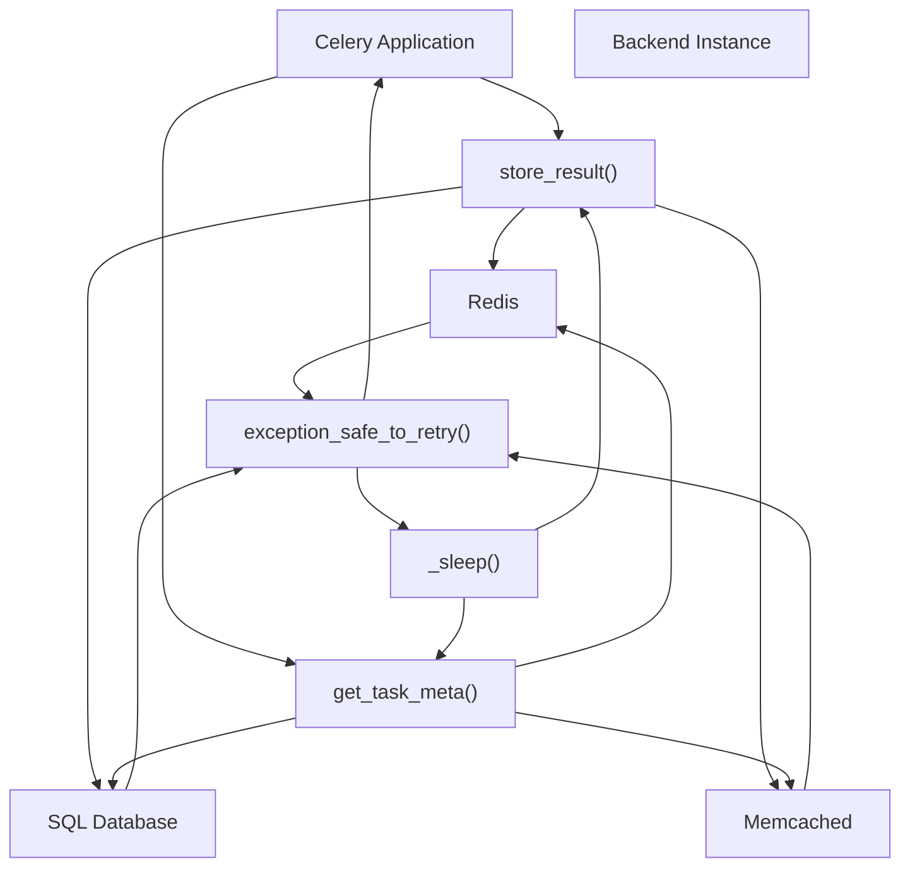
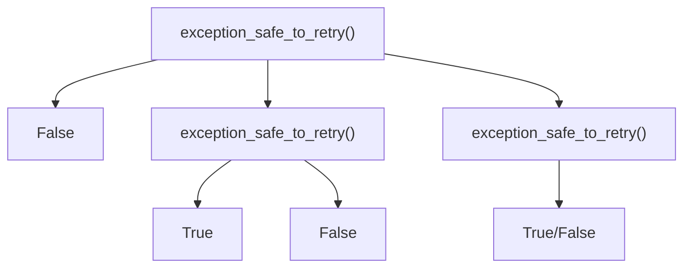
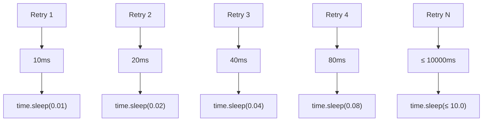
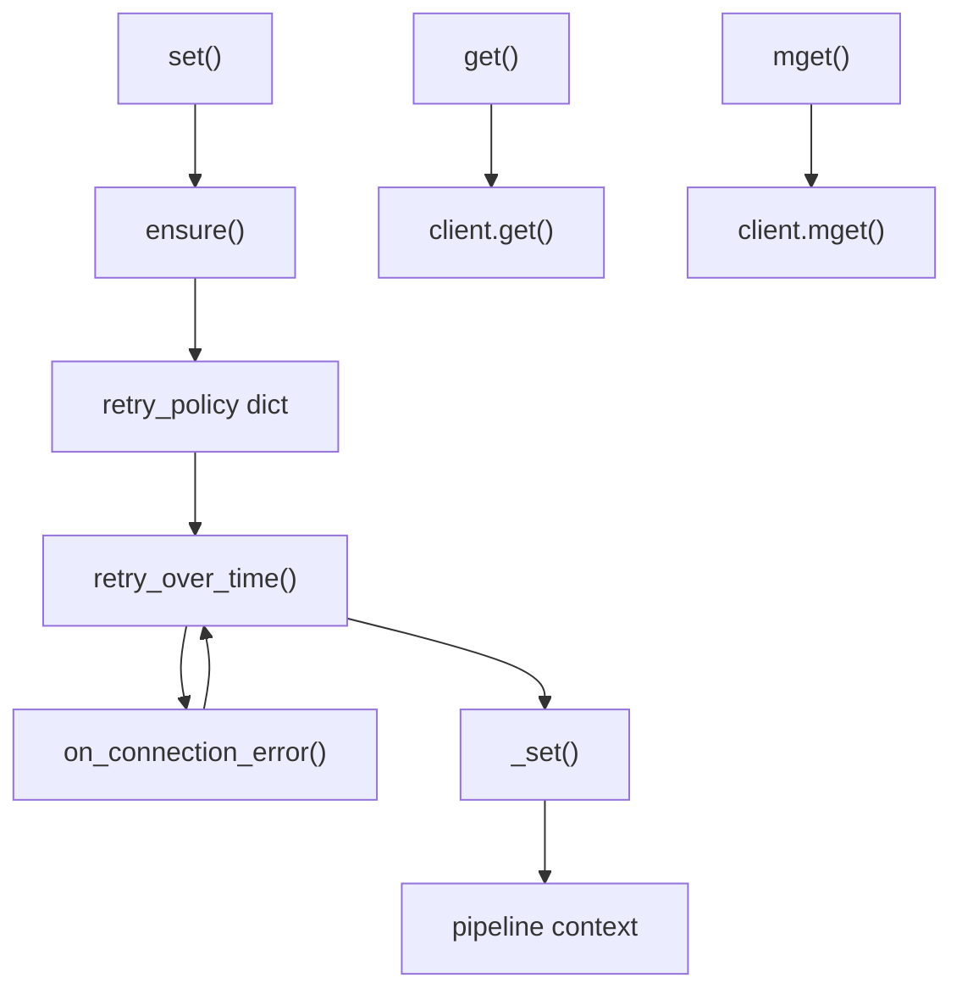

# Error Handling and Resilience

Relevant source files

-   [celery/app/builtins.py](https://github.com/celery/celery/blob/4d068b56/celery/app/builtins.py)
-   [celery/backends/base.py](https://github.com/celery/celery/blob/4d068b56/celery/backends/base.py)
-   [celery/backends/redis.py](https://github.com/celery/celery/blob/4d068b56/celery/backends/redis.py)
-   [celery/result.py](https://github.com/celery/celery/blob/4d068b56/celery/result.py)
-   [docs/userguide/configuration.rst](https://github.com/celery/celery/blob/4d068b56/docs/userguide/configuration.rst)
-   [t/unit/backends/test\_base.py](https://github.com/celery/celery/blob/4d068b56/t/unit/backends/test_base.py)
-   [t/unit/backends/test\_redis.py](https://github.com/celery/celery/blob/4d068b56/t/unit/backends/test_redis.py)
-   [t/unit/tasks/test\_chord.py](https://github.com/celery/celery/blob/4d068b56/t/unit/tasks/test_chord.py)
-   [t/unit/tasks/test\_result.py](https://github.com/celery/celery/blob/4d068b56/t/unit/tasks/test_result.py)

This document describes the error handling and resilience mechanisms in Celery's result backend system. These mechanisms ensure reliable operation even when backend services experience transient failures, connection errors, or unexpected exceptions during task execution.

For information about result backend architecture and implementations, see [Backend Architecture](/celery/celery/6.1-backend-architecture) and [Backend Implementations](/celery/celery/6.2-backend-implementations). For result retrieval patterns, see [Result Serialization and Retrieval](/celery/celery/6.3-result-storage-and-retrieval).

## Overview

Result backends interact with external storage systems (Redis, databases, caches, etc.) which can experience transient network issues, connection timeouts, or temporary unavailability. The retry and resilience system provides:

-   **Automatic retry** of failed backend operations
-   **Exponential backoff** to avoid overwhelming failing services
-   **Configurable limits** on retry attempts and delays
-   **Backend-specific exception classification** to determine which errors are retryable

This system applies to two critical operations: storing task results (`store_result`) and retrieving task metadata (`get_task_meta`).

**Sources:** [celery/backends/base.py612-644](https://github.com/celery/celery/blob/4d068b56/celery/backends/base.py#L612-L644) [celery/backends/base.py682-725](https://github.com/celery/celery/blob/4d068b56/celery/backends/base.py#L682-L725)

## Configuration Options

The retry behavior is controlled by five configuration settings accessed via `app.conf`:

| Setting | Type | Default | Description |
| --- | --- | --- | --- |
| `result_backend_always_retry` | bool | `False` | Enable automatic retry for recoverable backend exceptions |
| `result_backend_base_sleep_between_retries_ms` | int | `10` | Base sleep time in milliseconds for exponential backoff |
| `result_backend_max_sleep_between_retries_ms` | int | `10000` | Maximum sleep time in milliseconds (10 seconds) |
| `result_backend_max_retries` | float | `float("inf")` | Maximum number of retry attempts before raising error |
| `result_backend_thread_safe` | bool | `False` | Enable thread-safe backend operations for concurrent access |

These settings are initialized in the `Backend.__init__` method at [celery/backends/base.py138-161](https://github.com/celery/celery/blob/4d068b56/celery/backends/base.py#L138-L161)

**Sources:** [celery/backends/base.py138-161](https://github.com/celery/celery/blob/4d068b56/celery/backends/base.py#L138-L161)

## Retry Flow Architecture


**Sources:** [celery/backends/base.py612-644](https://github.com/celery/celery/blob/4d068b56/celery/backends/base.py#L612-L644) [celery/backends/base.py692-725](https://github.com/celery/celery/blob/4d068b56/celery/backends/base.py#L692-L725)

## Store Result Retry Mechanism

The `store_result` method wraps the actual backend storage operation in a retry loop when `result_backend_always_retry` is enabled:

> **[Mermaid stateDiagram]**
> *(图表结构无法解析)*

**Sources:** [celery/backends/base.py612-644](https://github.com/celery/celery/blob/4d068b56/celery/backends/base.py#L612-L644)

## Get Task Meta Retry Mechanism

The `get_task_meta` method uses identical retry logic for retrieving task metadata:

> **[Mermaid stateDiagram]**
> *(图表结构无法解析)*

**Sources:** [celery/backends/base.py692-729](https://github.com/celery/celery/blob/4d068b56/celery/backends/base.py#L692-L729)

## Exception Classification

The `exception_safe_to_retry` method determines which exceptions warrant retry attempts. The base implementation in `BaseBackend` is conservative and returns `False` for all exceptions:


Backend implementations must override this method to identify their specific transient errors:

**RedisBackend Implementation:**

```
def exception_safe_to_retry(self, exc):
    if isinstance(exc, self.connection_errors):
        return True
    return False
```
The `connection_errors` tuple is populated from `get_redis_error_classes()` which includes Redis-specific connection exceptions.

**Sources:** [celery/backends/base.py682-690](https://github.com/celery/celery/blob/4d068b56/celery/backends/base.py#L682-L690) [celery/backends/redis.py401-404](https://github.com/celery/celery/blob/4d068b56/celery/backends/redis.py#L401-L404)

## Exponential Backoff Strategy

The retry mechanism uses exponential backoff to progressively increase wait times between attempts, preventing overwhelming of failing services:


The backoff calculation is performed by `get_exponential_backoff_interval` from `celery.utils.time`:

```
sleep_amount = get_exponential_backoff_interval(
    self.base_sleep_between_retries_ms,  # 10ms default
    retries,                               # current retry count
    self.max_sleep_between_retries_ms,    # 10000ms cap
    True                                   # full jitter
) / 1000  # convert to seconds
```
The sleep amount is converted from milliseconds to seconds because `time.sleep()` accepts floats for sub-second precision.

**Sources:** [celery/backends/base.py635-638](https://github.com/celery/celery/blob/4d068b56/celery/backends/base.py#L635-L638) [celery/backends/base.py716-719](https://github.com/celery/celery/blob/4d068b56/celery/backends/base.py#L716-L719)

## Backend-Specific Retry Implementations

### Redis Backend Ensure Pattern

The Redis backend implements an additional retry layer using the `ensure` method with `retry_over_time`:


The `ensure` method wraps operations with retry logic:

```
def ensure(self, fun, args, **policy):
    retry_policy = dict(self.retry_policy, **policy)
    max_retries = retry_policy.get('max_retries')
    return retry_over_time(
        fun, self.connection_errors, args, {},
        partial(self.on_connection_error, max_retries),
        **retry_policy)
```
The `retry_policy` dictionary contains:

-   `max_retries`: 20 (default)
-   `interval_start`: 0
-   `interval_step`: 1
-   `interval_max`: 1

**Sources:** [celery/backends/redis.py425-431](https://github.com/celery/celery/blob/4d068b56/celery/backends/redis.py#L425-L431) [celery/backends/base.py131-136](https://github.com/celery/celery/blob/4d068b56/celery/backends/base.py#L131-L136)

## Error Handling and Limits

When retry limits are exceeded, specific exceptions are raised with context:

### BackendStoreError

Raised when `store_result` exhausts retry attempts:

```
raise_with_context(
    BackendStoreError(
        "failed to store result on the backend",
        task_id=task_id,
        state=state
    ),
)
```
### BackendGetMetaError

Raised when `get_task_meta` exhausts retry attempts:

```
raise_with_context(
    BackendGetMetaError(
        "failed to get meta",
        task_id=task_id
    ),
)
```
Both use `raise_with_context` to preserve the original exception as `__cause__`, providing a complete error chain for debugging.

**Sources:** [celery/backends/base.py640-642](https://github.com/celery/celery/blob/4d068b56/celery/backends/base.py#L640-L642) [celery/backends/base.py721-723](https://github.com/celery/celery/blob/4d068b56/celery/backends/base.py#L721-L723)

## Testable Retry Behavior

The `_sleep` method is separated as an instance method to facilitate testing without actual delays:

```
def _sleep(self, amount):
    time.sleep(amount)
```
Test code can mock `_sleep` to verify retry logic without waiting:

```
backend._sleep = Mock()
# Verify retry behavior without actual sleep delays
```
**Sources:** [celery/backends/base.py609-610](https://github.com/celery/celery/blob/4d068b56/celery/backends/base.py#L609-L610)

## Configuration Example

To enable resilient backend operations with custom limits:

```
app.conf.result_backend_always_retry = True
app.conf.result_backend_max_retries = 10
app.conf.result_backend_base_sleep_between_retries_ms = 50
app.conf.result_backend_max_sleep_between_retries_ms = 5000
```
This configuration:

-   Enables automatic retry for transient failures
-   Limits to 10 retry attempts per operation
-   Starts with 50ms delay between retries
-   Caps delays at 5 seconds

**Sources:** [celery/backends/base.py157-161](https://github.com/celery/celery/blob/4d068b56/celery/backends/base.py#L157-L161)
