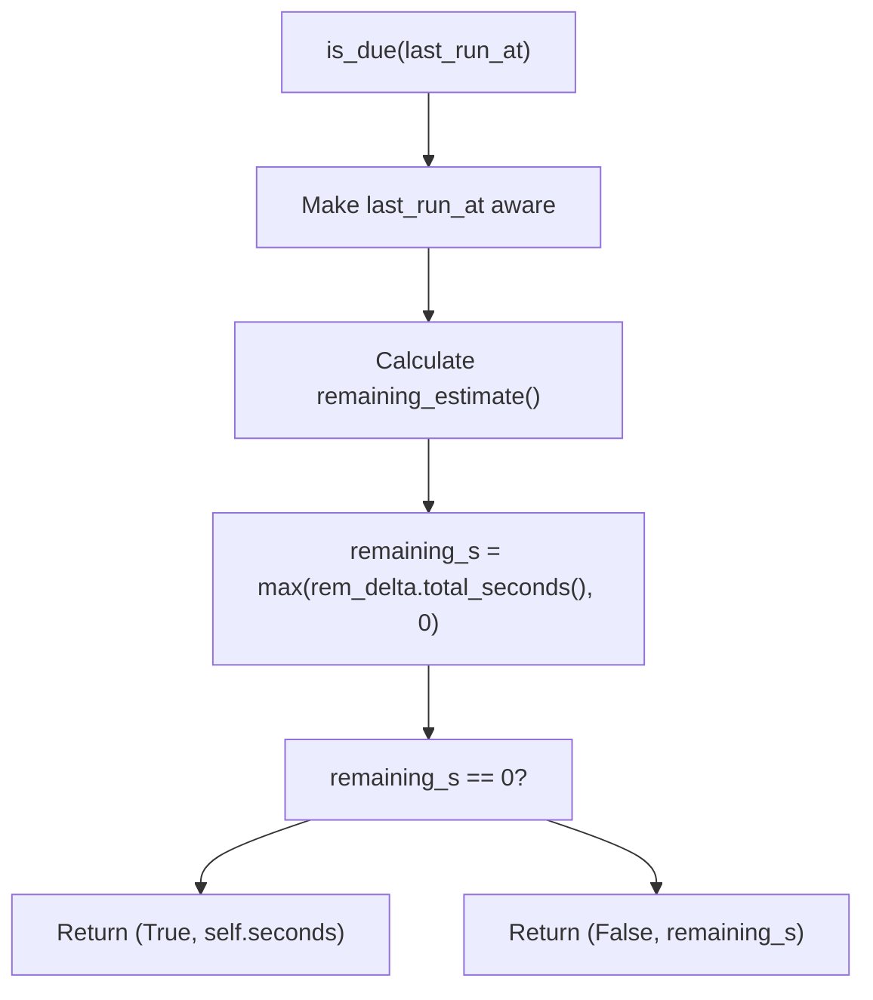
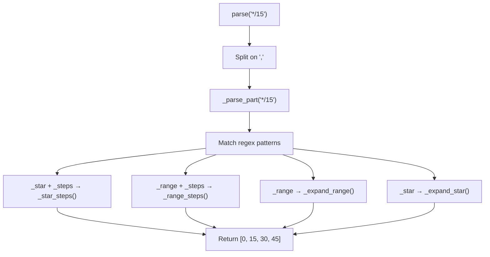
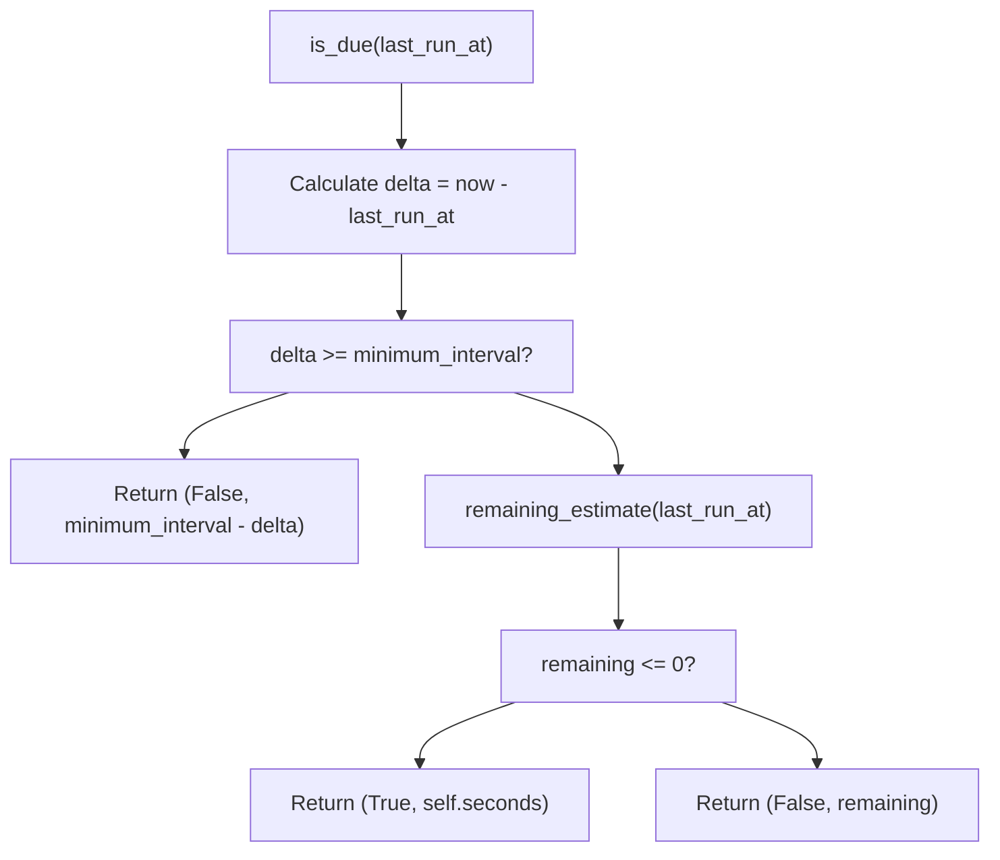
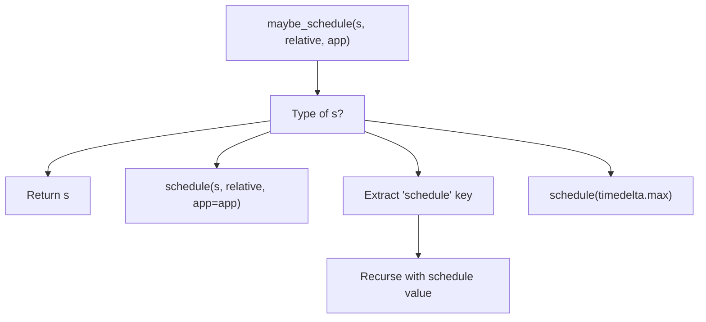
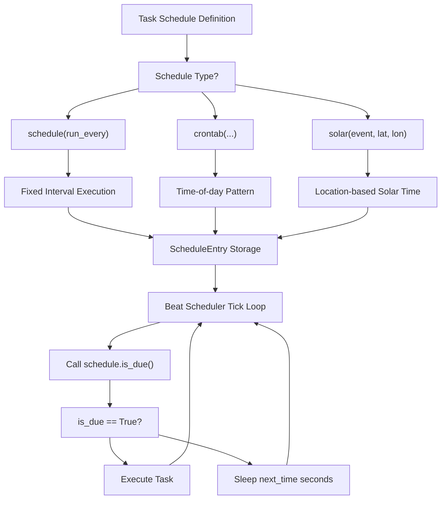

# Schedule Types

Relevant source files

-   [CONTRIBUTORS.txt](https://github.com/celery/celery/blob/4d068b56/CONTRIBUTORS.txt)
-   [celery/beat.py](https://github.com/celery/celery/blob/4d068b56/celery/beat.py)
-   [celery/schedules.py](https://github.com/celery/celery/blob/4d068b56/celery/schedules.py)
-   [celery/utils/iso8601.py](https://github.com/celery/celery/blob/4d068b56/celery/utils/iso8601.py)
-   [celery/utils/time.py](https://github.com/celery/celery/blob/4d068b56/celery/utils/time.py)
-   [docs/AUTHORS.txt](https://github.com/celery/celery/blob/4d068b56/docs/AUTHORS.txt)
-   [t/unit/app/test\_beat.py](https://github.com/celery/celery/blob/4d068b56/t/unit/app/test_beat.py)
-   [t/unit/app/test\_schedules.py](https://github.com/celery/celery/blob/4d068b56/t/unit/app/test_schedules.py)
-   [t/unit/backends/test\_cache.py](https://github.com/celery/celery/blob/4d068b56/t/unit/backends/test_cache.py)
-   [t/unit/utils/test\_serialization.py](https://github.com/celery/celery/blob/4d068b56/t/unit/utils/test_serialization.py)
-   [t/unit/utils/test\_time.py](https://github.com/celery/celery/blob/4d068b56/t/unit/utils/test_time.py)

This page documents the three schedule type implementations in Celery Beat: `schedule` (fixed intervals), `crontab` (cron expressions), and `solar` (astronomical events). These classes define when periodic tasks should execute.

For information about the Beat scheduler architecture and how these schedules are used, see [Beat Scheduler Architecture](/celery/celery/7.1-beat-scheduler-architecture). For timezone handling utilities used by schedules, see [Time and Timezone Handling](/celery/celery/7.3-time-and-timezone-handling).

## Overview

All schedule types inherit from `BaseSchedule` and implement two key methods:

-   `is_due(last_run_at)` - Returns `(is_due: bool, next_check_time: float)`
-   `remaining_estimate(last_run_at)` - Returns `timedelta` until next execution

Schedule instances are stored in `ScheduleEntry` objects and evaluated by the Beat service's tick loop.

**Sources:** [celery/schedules.py1-22](https://github.com/celery/celery/blob/4d068b56/celery/schedules.py#L1-L22) [celery/beat.py82-199](https://github.com/celery/celery/blob/4d068b56/celery/beat.py#L82-L199)

## BaseSchedule Foundation


The `BaseSchedule` class provides timezone-aware infrastructure for all schedule types. It maintains a reference to the Celery app to access timezone configuration and provides utilities for converting between naive and aware datetimes.

| Attribute | Type | Purpose |
| --- | --- | --- |
| `nowfun` | `Callable` or `None` | Custom function to get current time (defaults to `app.now()`) |
| `_app` | `Celery` or `None` | Reference to Celery application instance |
| `tz` | `tzinfo` (cached) | Timezone from `app.conf.timezone` |
| `utc_enabled` | `bool` (cached) | Value of `app.conf.enable_utc` |

The `maybe_make_aware()` method ensures datetime objects have timezone information, using `celery.utils.time.maybe_make_aware()` with the schedule's configured timezone.

**Sources:** [celery/schedules.py65-109](https://github.com/celery/celery/blob/4d068b56/celery/schedules.py#L65-L109) [celery/utils/time.py1-41](https://github.com/celery/celery/blob/4d068b56/celery/utils/time.py#L1-L41)

## schedule: Fixed Interval Schedules

The `schedule` class executes tasks at fixed time intervals defined by a `timedelta` or float (seconds).

### Basic Usage

```
from datetime import timedelta
from celery.schedules import schedule

# Every 30 seconds
s = schedule(run_every=30.0)

# Every 5 minutes
s = schedule(run_every=timedelta(minutes=5))

# Relative timing (rounds to interval resolution)
s = schedule(run_every=60.0, relative=True)
```
### Key Attributes and Methods

| Member | Type | Description |
| --- | --- | --- |
| `run_every` | `timedelta` | Interval between executions (converted via `maybe_timedelta()`) |
| `relative` | `bool` | If `True`, rounds execution time to interval resolution |
| `seconds` | `float` (property) | Total seconds in `run_every` (minimum 0) |
| `human_seconds` | `str` (property) | Human-readable interval (via `humanize_seconds()`) |

### is\_due() Implementation


The `is_due()` method:

1.  Converts `last_run_at` to timezone-aware datetime
2.  Calls `remaining_estimate()` to calculate time until next run
3.  Returns `(True, next_interval)` if due now, or `(False, seconds_to_wait)` otherwise

The `remaining_estimate()` uses `celery.utils.time.remaining()` which handles DST transitions when `relative=True`.

**Sources:** [celery/schedules.py111-194](https://github.com/celery/celery/blob/4d068b56/celery/schedules.py#L111-L194) [celery/utils/time.py133-175](https://github.com/celery/celery/blob/4d068b56/celery/utils/time.py#L133-L175) [docs/userguide/periodic-tasks.rst133-160](https://github.com/celery/celery/blob/4d068b56/docs/userguide/periodic-tasks.rst#L133-L160)

## crontab: Cron Expression Schedules

The `crontab` class provides cron-like scheduling with support for standard crontab syntax plus extensions.

### Crontab Syntax

Each field accepts:

-   **Integers**: Specific values (e.g., `7` for 7am)
-   **Lists**: Multiple values (e.g., `[0, 12]` for midnight and noon)
-   **Strings**: Cron patterns (e.g., `'*/15'` for every 15 units)

| Field | Range | String Examples |
| --- | --- | --- |
| `minute` | 0-59 | `'*/15'` (every 15 min), `'0,30'` (on the hour and half-hour) |
| `hour` | 0-23 | `'*/3'` (every 3 hours), `'8-17'` (business hours) |
| `day_of_week` | 0-6 (Sunday=0) | `'mon-fri'`, `'*/2'` (every even-numbered day) |
| `day_of_month` | 1-31 | `'1-7'` (first week), `'*/2'` (odd days) |
| `month_of_year` | 1-12 | `'*/3'` (quarterly), `'jan,apr,jul,oct'` |

### Usage Examples

```
from celery.schedules import crontab

# Every Monday morning at 7:30 AM
crontab(hour=7, minute=30, day_of_week=1)

# Every 15 minutes
crontab(minute='*/15')

# Weekdays at midnight
crontab(hour=0, minute=0, day_of_week='mon-fri')

# First and third Monday of every month at 7:30 AM
crontab(hour=7, minute=30, day_of_week=1, day_of_month='1-7,15-21')
```
**Sources:** [celery/schedules.py323-408](https://github.com/celery/celery/blob/4d068b56/celery/schedules.py#L323-L408) [docs/userguide/periodic-tasks.rst106-109](https://github.com/celery/celery/blob/4d068b56/docs/userguide/periodic-tasks.rst#L106-L109)

## crontab\_parser: Expression Parser

The `crontab_parser` class parses crontab expressions into sets of integers. It's used internally by `crontab` but can be used standalone.

### BNF Grammar

```
digit   :: '0'..'9'
dow     :: 'a'..'z'
number  :: digit+ | dow+
steps   :: number
range   :: number ( '-' number ) ?
numspec :: '*' | range
expr    :: numspec ( '/' steps ) ?
groups  :: expr ( ',' expr ) *
```
### Parser Initialization

```
# For minutes/hours (0-59, 0-23)
parser = crontab_parser(max_=60, min_=0)

# For days of month (1-31)
parser = crontab_parser(max_=31, min_=1)

# For months (1-12)
parser = crontab_parser(max_=12, min_=1)
```
### Parsing Patterns


| Pattern | Example | Result |
| --- | --- | --- |
| `'*'` | All values | `[0, 1, 2, ..., max]` |
| `'*/n'` | Step values | `[0, n, 2n, 3n, ...]` |
| `'a-b'` | Range | `[a, a+1, ..., b]` |
| `'a-b/n'` | Range with step | `[a, a+n, a+2n, ...]` |
| `'a,b,c'` | Multiple values | `[a, b, c]` |

### Special Handling

The parser recognizes textual day and month names:

-   Days: `'sun'`, `'mon'`, `'tue'`, `'wed'`, `'thu'`, `'fri'`, `'sat'` (mapped via `weekday()`)
-   Months: `'jan'`, `'feb'`, ..., `'dec'` (mapped via `yearmonth()`)

**Sources:** [celery/schedules.py196-321](https://github.com/celery/celery/blob/4d068b56/celery/schedules.py#L196-L321) [celery/utils/time.py44-48](https://github.com/celery/celery/blob/4d068b56/celery/utils/time.py#L44-L48)

## crontab: Execution Logic

### Internal State

Upon initialization, `crontab` parses all fields into integer sets:

```
# Initialization
crontab(minute='*/15', hour='8-17')
# Expands to:
# _minute = {0, 15, 30, 45}
# _hour = {8, 9, 10, 11, 12, 13, 14, 15, 16, 17}
```
Stored as:

-   `_orig_*` attributes: Original input (for repr/comparison)
-   `_*` attributes: Parsed integer sets (for matching)

### is\_due() Algorithm


The minimum interval is calculated from the most granular cron field:

-   If minute is `'*'`: 60 seconds
-   Otherwise: 60 seconds
-   Adjusts for hour/day patterns

The `remaining_estimate()` method uses `ffwd()` to fast-forward through time, checking each potential execution point:

1.  Start at `last_run_at`
2.  Increment by smallest unit (minute, hour, or day depending on pattern)
3.  Check if current time matches all cron fields
4.  Return time delta when match found

**Sources:** [celery/schedules.py408-650](https://github.com/celery/celery/blob/4d068b56/celery/schedules.py#L408-L650) [celery/utils/time.py177-267](https://github.com/celery/celery/blob/4d068b56/celery/utils/time.py#L177-L267)

## solar: Astronomical Event Schedules

The `solar` class schedules tasks based on astronomical events like sunrise/sunset. Requires the `ephem` library.

### Supported Events

| Event | Description |
| --- | --- |
| `'dawn_astronomical'` | Sun 18° below horizon (morning) |
| `'dawn_nautical'` | Sun 12° below horizon (morning) |
| `'dawn_civil'` | Sun 6° below horizon (morning) |
| `'sunrise'` | Sun crosses horizon (morning) |
| `'solar_noon'` | Sun at highest point |
| `'sunset'` | Sun crosses horizon (evening) |
| `'dusk_civil'` | Sun 6° below horizon (evening) |
| `'dusk_nautical'` | Sun 12° below horizon (evening) |
| `'dusk_astronomical'` | Sun 18° below horizon (evening) |

### Usage

```
from celery.schedules import solar

# Execute at sunrise in Oslo (60°N, 10°E)
s = solar('sunrise', 60, 10)

# Execute at sunset in New York (40.7°N, 74.0°W)
s = solar('sunset', 40.7, -74.0)
```
### Implementation

The `solar` class:

1.  Creates an `ephem.Observer` with specified latitude/longitude
2.  Computes event time for the current date
3.  Calculates remaining time until event
4.  Updates calculation daily (events change throughout the year)

Geographic coordinates must be valid:

-   Latitude: -90° to 90°
-   Longitude: -180° to 180°

Invalid values raise descriptive error messages referencing `SOLAR_INVALID_LATITUDE` or `SOLAR_INVALID_LONGITUDE`.

**Sources:** [celery/schedules.py650-800](https://github.com/celery/celery/blob/4d068b56/celery/schedules.py#L650-L800) [docs/userguide/periodic-tasks.rst267-308](https://github.com/celery/celery/blob/4d068b56/docs/userguide/periodic-tasks.rst#L267-L308)

## Schedule Integration with Beat

### maybe\_schedule() Conversion


The `maybe_schedule()` function in \[celery/beat.py\] converts various inputs to schedule instances:

-   Existing `schedule` objects pass through
-   Numbers/timedeltas become `schedule` instances
-   Dictionaries extract the `'schedule'` key
-   `None` becomes a schedule that never runs

### Usage in ScheduleEntry

```
from celery.beat import ScheduleEntry
from celery.schedules import crontab

entry = ScheduleEntry(
    name='morning-task',
    task='tasks.morning_routine',
    schedule=crontab(hour=7, minute=0),
    args=(),
    kwargs={},
    app=app
)

# ScheduleEntry.is_due() delegates to schedule.is_due()
is_due, next_time = entry.is_due()
```
The `ScheduleEntry.schedule` attribute always contains a schedule instance after initialization due to `maybe_schedule()` conversion.

**Sources:** [celery/beat.py82-199](https://github.com/celery/celery/blob/4d068b56/celery/beat.py#L82-L199) [celery/schedules.py800-820](https://github.com/celery/celery/blob/4d068b56/celery/schedules.py#L800-L820)

## Common Schedule Interface

All schedule types share this interface:

| Method | Arguments | Returns | Purpose |
| --- | --- | --- | --- |
| `is_due(last_run_at)` | `datetime` | `(bool, float)` | Check if due now, return seconds to next check |
| `remaining_estimate(last_run_at)` | `datetime` | `timedelta` | Time remaining until next execution |
| `now()` | \- | `datetime` | Current time (from `nowfun` or `app.now()`) |
| `maybe_make_aware(dt)` | `datetime` | `datetime` | Ensure datetime has timezone info |

### Serialization Support

All schedules support pickle serialization via `__reduce__()`:

```
from pickle import dumps, loads
from celery.schedules import crontab

c = crontab(hour=7, minute=30)
data = dumps(c)
restored = loads(data)
assert restored == c
```
The reduction includes:

-   `schedule`: `(run_every, relative, nowfun)`
-   `crontab`: `(minute, hour, day_of_week, day_of_month, month_of_year, nowfun, app)`
-   `solar`: `(event, lat, lon, nowfun, app)`

**Sources:** [celery/schedules.py183-185](https://github.com/celery/celery/blob/4d068b56/celery/schedules.py#L183-L185) [celery/schedules.py650-700](https://github.com/celery/celery/blob/4d068b56/celery/schedules.py#L650-L700) [t/unit/app/test\_schedules.py38-40](https://github.com/celery/celery/blob/4d068b56/t/unit/app/test_schedules.py#L38-L40)

## Schedule Type Selection Flow


**Sources:** [celery/beat.py219-473](https://github.com/celery/celery/blob/4d068b56/celery/beat.py#L219-L473) [celery/schedules.py1-820](https://github.com/celery/celery/blob/4d068b56/celery/schedules.py#L1-L820) [docs/userguide/periodic-tasks.rst79-243](https://github.com/celery/celery/blob/4d068b56/docs/userguide/periodic-tasks.rst#L79-L243)
