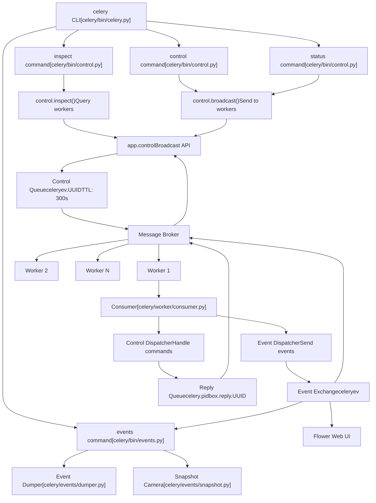
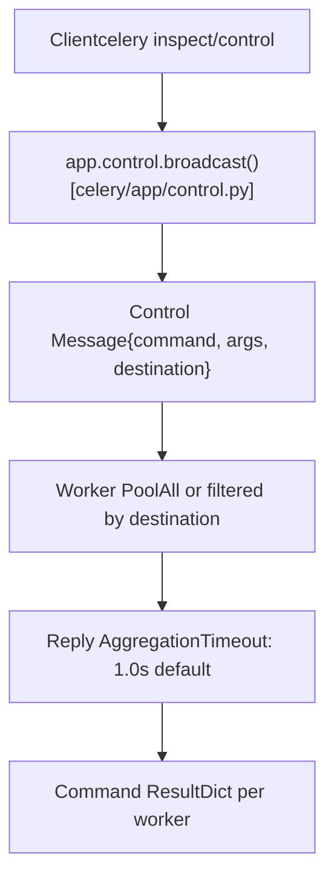
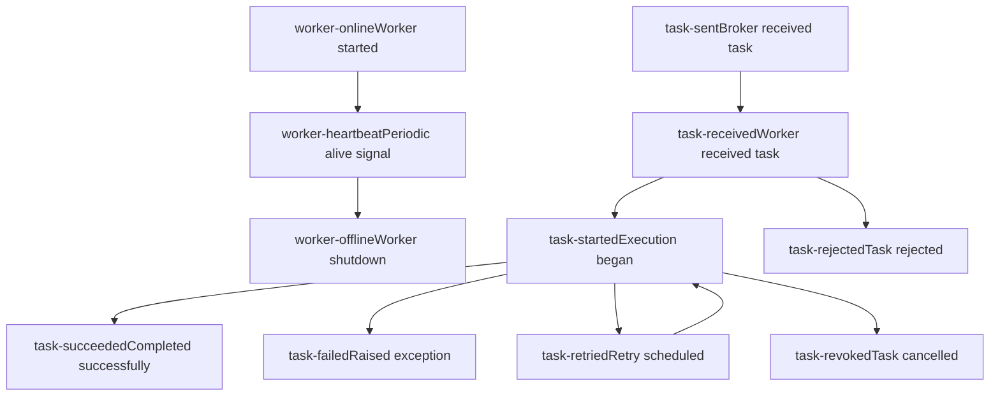
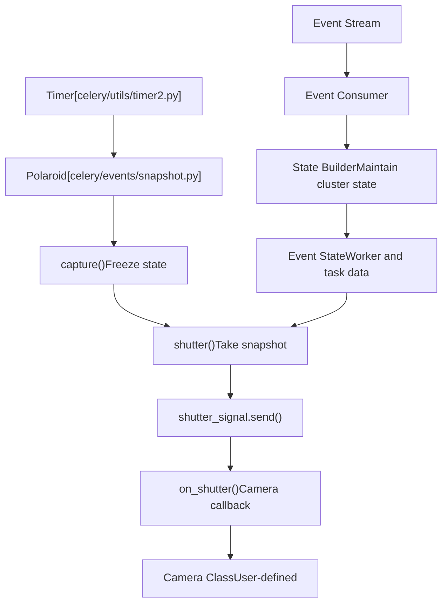
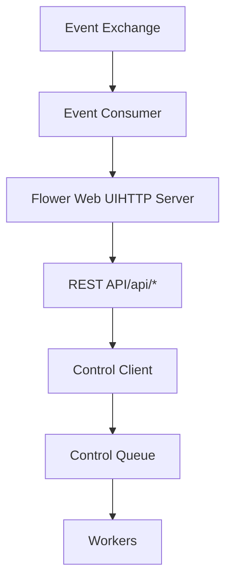
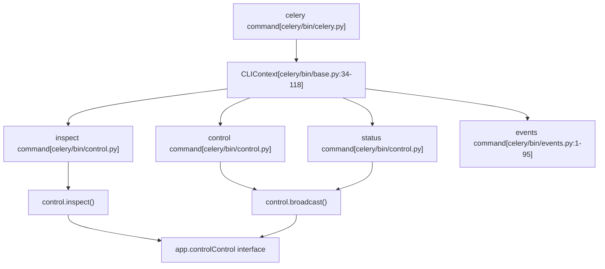

# Monitoring and Control

Relevant source files

-   [celery/app/defaults.py](https://github.com/celery/celery/blob/4d068b56/celery/app/defaults.py)
-   [celery/bin/base.py](https://github.com/celery/celery/blob/4d068b56/celery/bin/base.py)
-   [celery/bin/beat.py](https://github.com/celery/celery/blob/4d068b56/celery/bin/beat.py)
-   [celery/bin/celery.py](https://github.com/celery/celery/blob/4d068b56/celery/bin/celery.py)
-   [celery/bin/events.py](https://github.com/celery/celery/blob/4d068b56/celery/bin/events.py)
-   [celery/bin/worker.py](https://github.com/celery/celery/blob/4d068b56/celery/bin/worker.py)
-   [celery/events/snapshot.py](https://github.com/celery/celery/blob/4d068b56/celery/events/snapshot.py)
-   [docs/faq.rst](https://github.com/celery/celery/blob/4d068b56/docs/faq.rst)
-   [docs/getting-started/first-steps-with-celery.rst](https://github.com/celery/celery/blob/4d068b56/docs/getting-started/first-steps-with-celery.rst)
-   [docs/getting-started/next-steps.rst](https://github.com/celery/celery/blob/4d068b56/docs/getting-started/next-steps.rst)
-   [docs/userguide/calling.rst](https://github.com/celery/celery/blob/4d068b56/docs/userguide/calling.rst)
-   [docs/userguide/monitoring.rst](https://github.com/celery/celery/blob/4d068b56/docs/userguide/monitoring.rst)
-   [docs/userguide/periodic-tasks.rst](https://github.com/celery/celery/blob/4d068b56/docs/userguide/periodic-tasks.rst)
-   [docs/userguide/routing.rst](https://github.com/celery/celery/blob/4d068b56/docs/userguide/routing.rst)
-   [docs/userguide/tasks.rst](https://github.com/celery/celery/blob/4d068b56/docs/userguide/tasks.rst)
-   [docs/userguide/workers.rst](https://github.com/celery/celery/blob/4d068b56/docs/userguide/workers.rst)

This page documents Celery's monitoring and control capabilities, which provide runtime visibility into cluster operations and enable remote management of worker nodes. These facilities allow administrators to inspect worker state, manage task execution, collect real-time events, and control worker behavior without restarting processes.

For information about worker architecture and lifecycle, see [Workers](/celery/celery/5-workers). For details on Beat scheduling, see [Periodic Tasks (Beat)](/celery/celery/7-periodic-tasks-(beat)). For configuration options related to monitoring, see [Application Initialization and Configuration](/celery/celery/2.1-application-initialization-and-configuration).

## Overview

Celery provides three primary monitoring and control mechanisms:

1.  **Remote Control Commands** - Direct commands to inspect or control worker nodes via the `celery inspect` and `celery control` CLI interfaces
2.  **Event Monitoring** - Real-time event streams captured via `celery events` command and consumed by monitoring tools
3.  **External Tools** - Third-party monitoring solutions like Flower that provide web-based dashboards

All three mechanisms operate over the broker's messaging infrastructure, with control commands using a dedicated high-priority queue and events using a separate event exchange.

## Monitoring Architecture


**Control Queue and Event Exchange Architecture**

Sources: [docs/userguide/monitoring.rst1-527](https://github.com/celery/celery/blob/4d068b56/docs/userguide/monitoring.rst#L1-L527) [celery/app/defaults.py150-188](https://github.com/celery/celery/blob/4d068b56/celery/app/defaults.py#L150-L188) [celery/bin/celery.py1-228](https://github.com/celery/celery/blob/4d068b56/celery/bin/celery.py#L1-L228)

## Remote Control Commands

Remote control commands use a broadcast messaging pattern to communicate with worker nodes. Commands are sent to a high-priority control queue (`celery.pidbox`) that all workers consume from, enabling cluster-wide or targeted worker operations.

### Command Execution Model


**Remote Control Command Execution Flow**

The control system supports two command categories:

-   **`inspect` commands** - Read-only queries that return worker state without side effects
-   **`control` commands** - Operations that modify worker behavior or configuration

### Inspect Commands

Inspect commands query worker state and return information about tasks, queues, and worker configuration. All inspect commands are read-only.

| Command | Description | Output Format |
| --- | --- | --- |
| `active` | Currently executing tasks | List of task dicts with id, name, args, kwargs, worker\_pid |
| `scheduled` | Reserved tasks with ETA/countdown | List of task dicts with eta, priority |
| `reserved` | Prefetched tasks awaiting execution | List of task dicts |
| `registered` | All registered task names | List of fully qualified task names |
| `stats` | Worker statistics | Dict with pool, broker connection, total counts |
| `active_queues` | Queues currently consumed | List of queue dicts with name, exchange, routing\_key |
| `revoked` | Revoked task IDs | Set of task UUID strings |
| `query_task` | Status of specific task IDs | Dict of task\_id -> task info |
| `conf` | Worker configuration | Dict of all configuration keys |

**Example: Querying active tasks**

```
$ celery -A proj inspect active
-> worker1@example.com: OK
    * {
        'id': '4e196aa4-0141-4601-8138-7aa33db0f577',
        'name': 'tasks.add',
        'args': [4, 4],
        'kwargs': {},
        'worker_pid': 12345
    }
```
**Example: Targeting specific workers**

```
$ celery -A proj inspect -d worker1@example.com,worker2@example.com registered
```
The `-d` (destination) flag filters commands to specific workers. Without it, commands broadcast to all workers.

Sources: [docs/userguide/monitoring.rst101-161](https://github.com/celery/celery/blob/4d068b56/docs/userguide/monitoring.rst#L101-L161) [docs/userguide/workers.rst412-497](https://github.com/celery/celery/blob/4d068b56/docs/userguide/workers.rst#L412-L497)

### Control Commands

Control commands modify worker behavior or trigger actions. These commands have side effects and should be used carefully in production.

| Command | Description | Arguments |
| --- | --- | --- |
| `enable_events` | Start sending task events | None |
| `disable_events` | Stop sending task events | None |
| `shutdown` | Gracefully shut down worker | None |
| `pool_restart` | Restart worker pool processes | None |
| `pool_grow` | Add pool worker processes | `n` (int) |
| `pool_shrink` | Remove pool worker processes | `n` (int) |
| `autoscale` | Set autoscaling parameters | `max`, `min` (int) |
| `revoke` | Revoke task by ID | `task_id`, `terminate`, `signal` |
| `terminate` | Terminate task by ID (SIGTERM) | `task_id`, `signal` |
| `rate_limit` | Set task type rate limit | `task_name`, `rate_limit` |
| `time_limit` | Set task type time limits | `task_name`, `soft`, `hard` |
| `add_consumer` | Start consuming from queue | `queue`, `exchange`, `routing_key` |
| `cancel_consumer` | Stop consuming from queue | `queue` |
| `heartbeat` | Send heartbeat event | None |
| `election` | Trigger leader election | None |

**Example: Dynamic rate limiting**

```
$ celery -A proj control rate_limit tasks.heavy_task 10/m
worker@example.com: OK
    new rate limit set successfully
```
**Example: Revoking tasks**

```
$ celery -A proj control revoke 4e196aa4-0141-4601-8138-7aa33db0f577
$ celery -A proj control revoke 4e196aa4-0141-4601-8138-7aa33db0f577 --terminate
```
The `--terminate` flag sends `SIGTERM` to the worker process executing the task.

Sources: [docs/userguide/workers.rst498-683](https://github.com/celery/celery/blob/4d068b56/docs/userguide/workers.rst#L498-L683) [docs/userguide/monitoring.rst161-205](https://github.com/celery/celery/blob/4d068b56/docs/userguide/monitoring.rst#L161-L205)

### Control Configuration

Control queue configuration is defined in the application settings:

```
# Control queue settings
control.queue_ttl = 300.0          # Queue time-to-live (seconds)
control.queue_expires = 10.0       # Queue expires after inactivity (seconds)
control.queue_exclusive = False    # Exclusive queue flag
control.queue_durable = False      # Durable queue flag
control.exchange = 'celery'        # Control exchange name
```
Sources: [celery/app/defaults.py150-157](https://github.com/celery/celery/blob/4d068b56/celery/app/defaults.py#L150-L157)

## Event Monitoring System

Celery workers can emit event messages for state changes and task lifecycle events. These events form a real-time stream that monitoring tools consume to track cluster activity.

### Event Types and Lifecycle


**Task and Worker Event Lifecycle**

Events are disabled by default to reduce message overhead. Enable them per worker:

```
$ celery -A proj worker -E
$ celery -A proj worker --task-events
```
Or dynamically using control commands:

```
$ celery -A proj control enable_events
$ celery -A proj control disable_events
```
### Event Message Format

Event messages contain standardized fields:

```
{
    'type': 'task-started',          # Event type
    'uuid': 'task-id-here',          # Task UUID
    'hostname': 'worker@example.com', # Worker hostname
    'timestamp': 1634567890.123,     # Unix timestamp
    'local_received': 1634567890.125, # Local receive time
    'clock': 42,                     # Logical clock
    # Event-specific fields:
    'name': 'tasks.add',             # Task name
    'args': '[2, 2]',                # Task args (serialized)
    'kwargs': '{}',                  # Task kwargs (serialized)
    'runtime': 0.123,                # Execution time (for completed tasks)
    'result': '4',                   # Task result (for succeeded tasks)
    'exception': 'ValueError...',    # Exception (for failed tasks)
    'traceback': '...',              # Traceback (for failed tasks)
}
```
Sources: [docs/userguide/monitoring.rst485-527](https://github.com/celery/celery/blob/4d068b56/docs/userguide/monitoring.rst#L485-L527) [celery/app/defaults.py178-188](https://github.com/celery/celery/blob/4d068b56/celery/app/defaults.py#L178-L188)

### Event Configuration

Event system configuration:

```
# Event settings
event.queue_expires = 60.0        # Event queue expires after 60s
event.queue_ttl = 5.0             # Event message TTL
event.queue_prefix = 'celeryev'   # Event queue name prefix
event.queue_exclusive = False     # Exclusive queue flag
event.queue_durable = False       # Durable queue flag
event.serializer = 'json'         # Event serialization format
event.exchange = 'celeryev'       # Event exchange name

# Worker settings
worker.send_task_events = False   # Enable task events (default: False)
```
Sources: [celery/app/defaults.py178-188](https://github.com/celery/celery/blob/4d068b56/celery/app/defaults.py#L178-L188) [celery/app/defaults.py313-362](https://github.com/celery/celery/blob/4d068b56/celery/app/defaults.py#L313-L362)

## celery events Command

The `celery events` command provides three modes for consuming and processing events:

### Event Dumper Mode

Dumps events to stdout in real-time:

```
$ celery -A proj events --dump
task-received: tasks.add[d7e24d36-c5e8-4e0c-bf55-79a5eee7e69b] eta:None expires:None
task-started: tasks.add[d7e24d36-c5e8-4e0c-bf55-79a5eee7e69b]
task-succeeded: tasks.add[d7e24d36-c5e8-4e0c-bf55-79a5eee7e69b] runtime:0.123 result:4
```
Implementation: [celery/events/dumper.py](https://github.com/celery/celery/blob/4d068b56/celery/events/dumper.py)

### Curses Monitor Mode (evtop)

Interactive curses-based terminal UI showing real-time worker and task activity:

```
$ celery -A proj events
```
This displays a continuously updating dashboard with:

-   Active workers and their statistics
-   Recent task executions and states
-   Task history and tracebacks

Implementation: [celery/events/cursesmon.py](https://github.com/celery/celery/blob/4d068b56/celery/events/cursesmon.py)

### Camera/Snapshot Mode

Periodically captures cluster state snapshots using custom camera classes:

```
$ celery -A proj events --camera=myapp.MyCamera --frequency=2.0
```
A camera is a class that processes periodic state snapshots:

```
from celery.events.snapshot import Polaroid

class MyCamera(Polaroid):
    def on_shutter(self, state):
        # Called every `frequency` seconds
        # `state` contains current cluster state
        print(f"Active tasks: {len(state.tasks)}")
        print(f"Active workers: {len(state.workers)}")
```
The snapshot system uses the `Polaroid` class to manage periodic captures:


**Event Snapshot/Camera Architecture**

Sources: [celery/events/snapshot.py1-97](https://github.com/celery/celery/blob/4d068b56/celery/events/snapshot.py#L1-L97) [celery/bin/events.py1-95](https://github.com/celery/celery/blob/4d068b56/celery/bin/events.py#L1-L95) [docs/userguide/monitoring.rst485-527](https://github.com/celery/celery/blob/4d068b56/docs/userguide/monitoring.rst#L485-L527)

## Worker Statistics

The `inspect stats` command returns comprehensive worker statistics:

```
$ celery -A proj inspect stats
```
**Statistics Output Structure:**

```
{
    'worker@example.com': {
        'broker': {
            'hostname': 'localhost',
            'port': 5672,
            'transport': 'amqp',
            'virtual_host': '/',
            'connect_timeout': 4,
            'heartbeat': 120,
        },
        'clock': 12345,                    # Logical clock value
        'pool': {
            'implementation': 'prefork',    # Pool type
            'max-concurrency': 8,           # Max workers
            'processes': [1234, 1235, ...], # Worker PIDs
            'max-tasks-per-child': None,
            'put-guarded-by-semaphore': True,
            'timeouts': [0, 0],            # Soft, hard time limits
        },
        'prefetch_count': 32,              # Prefetch multiplier * concurrency
        'total': {                         # Lifetime counters
            'tasks.add': 42,               # Tasks by name
            'tasks.mul': 13,
        },
        'rusage': {                        # Resource usage (Unix only)
            'utime': 1.234,                # User CPU time
            'stime': 0.567,                # System CPU time
            'maxrss': 123456,              # Max RSS
            'ixrss': 0,
            'idrss': 0,
            'isrss': 0,
            'minflt': 1234,
            'majflt': 0,
            'nswap': 0,
            'inblock': 0,
            'oublock': 0,
            'msgsnd': 0,
            'msgrcv': 0,
            'nsignals': 0,
            'nvcsw': 123,
            'nivcsw': 456,
        },
    }
}
```
Sources: [docs/userguide/monitoring.rst140-144](https://github.com/celery/celery/blob/4d068b56/docs/userguide/monitoring.rst#L140-L144)

## Third-Party Monitoring Tools

### Flower

Flower is the recommended web-based monitoring and administration tool for Celery. It provides a real-time dashboard, task management, and HTTP API.

**Installation and Usage:**

```
$ pip install flower
$ celery -A proj flower
```
Access at `http://localhost:5555` (default port).

**Key Features:**

-   Real-time task and worker monitoring
-   Task history and detail views
-   Worker pool management (restart, grow, shrink, autoscale)
-   Queue management (add/cancel consumers)
-   Task revocation and termination
-   Rate limiting and time limit configuration
-   HTTP API for programmatic access
-   OpenID authentication support

**Flower Integration:**

Flower consumes events from the event exchange and provides control capabilities through the app.control interface:


**Flower Architecture and Celery Integration**

Sources: [docs/userguide/monitoring.rst207-317](https://github.com/celery/celery/blob/4d068b56/docs/userguide/monitoring.rst#L207-L317)

## Broker-Specific Monitoring

### RabbitMQ Monitoring

RabbitMQ provides native monitoring tools via `rabbitmqctl`:

**Queue inspection:**

```
# List queues with message counts
$ rabbitmqctl list_queues name messages messages_ready messages_unacknowledged

# List active consumers per queue
$ rabbitmqctl list_queues name consumers

# List queue memory usage
$ rabbitmqctl list_queues name memory
```
**Connection and channel inspection:**

```
# List connections
$ rabbitmqctl list_connections name peer_host peer_port state

# List channels
$ rabbitmqctl list_channels connection name number consumer_count
```
Sources: [docs/userguide/monitoring.rst364-420](https://github.com/celery/celery/blob/4d068b56/docs/userguide/monitoring.rst#L364-L420)

### Redis Monitoring

Redis monitoring uses `redis-cli` to inspect queue lengths:

```
# Get queue length
$ redis-cli -h HOST -p PORT -n DATABASE llen celery

# List all keys (includes all queues)
$ redis-cli -h HOST -p PORT -n DATABASE keys \*

# Get queue contents (first 10 items)
$ redis-cli -h HOST -p PORT -n DATABASE lrange celery 0 9
```
**Note:** Queue keys only exist when tasks are present. An absent key means an empty queue.

Sources: [docs/userguide/monitoring.rst422-461](https://github.com/celery/celery/blob/4d068b56/docs/userguide/monitoring.rst#L422-L461)

## Command-Line Interface Structure

The monitoring commands are implemented through Celery's CLI framework:


**Monitoring CLI Architecture**

The CLI provides common options for all monitoring commands:

-   `--timeout` - Response timeout in seconds (default: 1.0)
-   `--destination` / `-d` - Target specific workers by hostname
-   `--json` - Output results in JSON format

Sources: [celery/bin/celery.py1-228](https://github.com/celery/celery/blob/4d068b56/celery/bin/celery.py#L1-L228) [celery/bin/base.py34-118](https://github.com/celery/celery/blob/4d068b56/celery/bin/base.py#L34-L118) [docs/userguide/monitoring.rst183-205](https://github.com/celery/celery/blob/4d068b56/docs/userguide/monitoring.rst#L183-L205)

## Platform Integration

### Signal Handling

Workers respond to platform signals for monitoring and control:

| Signal | Effect | Handler Location |
| --- | --- | --- |
| `SIGUSR1` | Dump traceback for all threads | Worker process |
| `SIGUSR2` | Remote debug (celery.contrib.rdb) | Worker process |
| `SIGTERM` | Warm shutdown | Worker process |
| `SIGQUIT` | Cold shutdown | Worker process |
| `SIGINT` | Warm shutdown (first), cold (second) | Worker process |

Sources: [docs/userguide/workers.rst314-330](https://github.com/celery/celery/blob/4d068b56/docs/userguide/workers.rst#L314-L330) [celery/platforms.py1-820](https://github.com/celery/celery/blob/4d068b56/celery/platforms.py#L1-L820)

### Process Management

Platform utilities for monitoring integration:

-   **Pidfile Management** - [celery/platforms.py125-273](https://github.com/celery/celery/blob/4d068b56/celery/platforms.py#L125-L273) - `Pidfile` class for lock files
-   **Daemonization** - [celery/platforms.py310-430](https://github.com/celery/celery/blob/4d068b56/celery/platforms.py#L310-L430) - `DaemonContext` for background processes
-   **Signal Utilities** - [celery/platforms.py594-699](https://github.com/celery/celery/blob/4d068b56/celery/platforms.py#L594-L699) - `Signals` class for cross-platform signal handling

Sources: [celery/platforms.py1-820](https://github.com/celery/celery/blob/4d068b56/celery/platforms.py#L1-L820)

## Summary

Celery's monitoring and control system provides comprehensive visibility and management capabilities:

-   **Remote Control** - Synchronous request/reply pattern for querying and controlling workers
-   **Event Streaming** - Asynchronous event broadcast for real-time monitoring
-   **CLI Tools** - Unified command-line interface for all operations
-   **Third-Party Integration** - Open architecture supporting tools like Flower
-   **Broker Integration** - Native monitoring using broker-specific tools

This architecture enables both human-interactive monitoring (CLI, Flower) and programmatic integration (event consumers, cameras) for production deployment scenarios.
