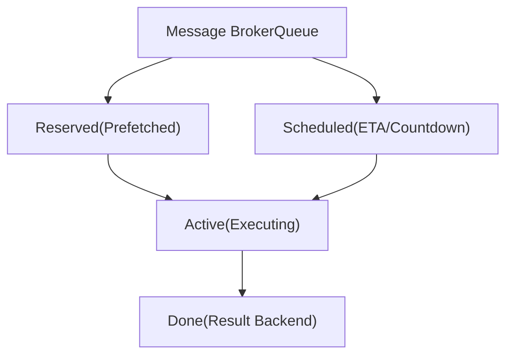
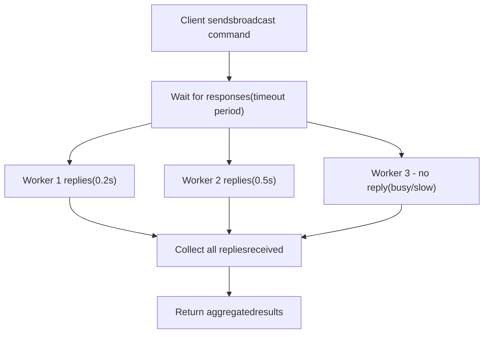
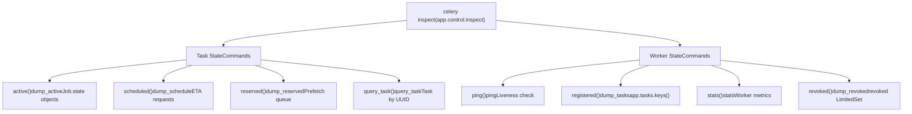

# Worker Inspection

Relevant source files

-   [celery/app/defaults.py](https://github.com/celery/celery/blob/4d068b56/celery/app/defaults.py)
-   [docs/faq.rst](https://github.com/celery/celery/blob/4d068b56/docs/faq.rst)
-   [docs/getting-started/first-steps-with-celery.rst](https://github.com/celery/celery/blob/4d068b56/docs/getting-started/first-steps-with-celery.rst)
-   [docs/getting-started/next-steps.rst](https://github.com/celery/celery/blob/4d068b56/docs/getting-started/next-steps.rst)
-   [docs/userguide/calling.rst](https://github.com/celery/celery/blob/4d068b56/docs/userguide/calling.rst)
-   [docs/userguide/monitoring.rst](https://github.com/celery/celery/blob/4d068b56/docs/userguide/monitoring.rst)
-   [docs/userguide/periodic-tasks.rst](https://github.com/celery/celery/blob/4d068b56/docs/userguide/periodic-tasks.rst)
-   [docs/userguide/routing.rst](https://github.com/celery/celery/blob/4d068b56/docs/userguide/routing.rst)
-   [docs/userguide/tasks.rst](https://github.com/celery/celery/blob/4d068b56/docs/userguide/tasks.rst)
-   [docs/userguide/workers.rst](https://github.com/celery/celery/blob/4d068b56/docs/userguide/workers.rst)

## Purpose and Scope

Worker inspection provides read-only commands for querying the current state of Celery workers. These commands allow you to monitor active tasks, view queued work, examine worker statistics, and verify task registrations without modifying worker behavior. Inspection commands use a broadcast-based protocol where commands are sent to all or specific workers, and responses are collected within a timeout period.

For commands that modify worker state (such as revoking tasks or changing rate limits), see [Remote Control Commands](/celery/celery/8.1-remote-control-commands). For comprehensive monitoring tools and event-based monitoring, see [Event Monitoring Tools](/celery/celery/8.3-event-system).

---

## Inspection Architecture

The worker inspection system uses Celery's broadcast messaging infrastructure to query worker state. When an inspection command is issued via `app.control.inspect()`, it is sent as a high-priority broadcast message to the target workers through the control exchange. Each worker's `Consumer.Control` component processes the command and returns a response.

**Sequence: Inspect Command Flow**

> **[Mermaid sequence]**
> *(图表结构无法解析)*

**Key Characteristics:**

-   **Control Exchange**: Commands use a dedicated control exchange (default name: `celery`, routing key pattern: `<hostname>.control`)
-   **Mailbox Pattern**: Implemented via `app.control.broadcast()` using the Mailbox protocol for request-reply messaging
-   **Async Responses**: Workers reply independently through temporary reply queues; no guarantee all workers will respond
-   **Configurable Timeout**: Default 1.0 second, configurable via `timeout` parameter
-   **Destination Filtering**: Can target specific workers using `destination=['worker@host']` parameter

**Sources:** [docs/userguide/workers.rst412-451](https://github.com/celery/celery/blob/4d068b56/docs/userguide/workers.rst#L412-L451) [docs/userguide/monitoring.rst23-44](https://github.com/celery/celery/blob/4d068b56/docs/userguide/monitoring.rst#L23-L44) [celery/bin/celery.py19](https://github.com/celery/celery/blob/4d068b56/celery/bin/celery.py#L19-L19)

---

## Command Line Interface

All inspection commands are invoked using the `celery inspect` subcommand:

```
# General syntax
$ celery -A <app> inspect <command> [options]

# With specific worker destination
$ celery -A proj inspect <command> -d worker1@example.com

# With custom timeout (in seconds)
$ celery -A proj inspect <command> --timeout=5.0
```
**Common Options:**

| Option | Description | Default |
| --- | --- | --- |
| `--destination` / `-d` | Target specific workers (comma-separated) | All workers |
| `--timeout` / `-t` | Response timeout in seconds | 1.0 |
| `--json` | Output results in JSON format | Human-readable |

**Sources:** [docs/userguide/monitoring.rst32-43](https://github.com/celery/celery/blob/4d068b56/docs/userguide/monitoring.rst#L32-L43) [docs/userguide/monitoring.rst186-204](https://github.com/celery/celery/blob/4d068b56/docs/userguide/monitoring.rst#L186-L204)

---

## Task State Inspection Commands

These commands inspect the current state of tasks within workers.

### Active Tasks

Lists all tasks currently being executed by workers.

```
$ celery -A proj inspect active
```
**Returns:** A dictionary mapping worker hostnames to lists of active task information. Each task entry includes:

-   `id`: Task UUID
-   `name`: Task name (e.g., `"myapp.tasks.process_order"`)
-   `args`: Positional arguments as string representation
-   `kwargs`: Keyword arguments as string representation
-   `type`: Task type
-   `hostname`: Worker hostname executing the task
-   `time_start`: Timestamp when execution started
-   `acknowledged`: Whether the task message has been acknowledged
-   `delivery_info`: Broker delivery metadata (exchange, routing\_key)
-   `worker_pid`: Process ID of the worker process executing the task

**Example Output:**

```
{
    'worker1@example.com': [
        {
            'id': '4e196aa4-0141-4601-8138-7aa33db0f577',
            'name': 'tasks.process_payment',
            'args': '[123, 45.99]',
            'kwargs': '{}',
            'time_start': 1634567890.123,
            'acknowledged': True,
            'worker_pid': 12345
        }
    ],
    'worker2@example.com': []
}
```
**Use Cases:**

-   Identifying long-running tasks
-   Detecting stuck workers
-   Monitoring current workload distribution

**Sources:** [docs/userguide/monitoring.rst101-107](https://github.com/celery/celery/blob/4d068b56/docs/userguide/monitoring.rst#L101-L107)

---

### Scheduled Tasks

Lists tasks that have been reserved with an ETA (estimated time of arrival) or countdown.

```
$ celery -A proj inspect scheduled
```
**Returns:** Dictionary mapping workers to lists of scheduled tasks. These are tasks that have been fetched from the broker but are waiting for their scheduled execution time.

**Task Attributes:**

-   `eta`: ISO 8601 formatted timestamp when task should execute
-   `priority`: Task priority (if supported by broker)
-   `request`: Full task request object including `id`, `name`, `args`, `kwargs`

**Example Output:**

```
{
    'worker1@example.com': [
        {
            'eta': '2024-01-15T10:30:00+00:00',
            'priority': 6,
            'request': {
                'id': 'abc-123',
                'name': 'tasks.send_reminder',
                'args': '[user_id_456]'
            }
        }
    ]
}
```
**Important:** Scheduled tasks reside in worker memory until their ETA arrives. They are already acknowledged by the broker and will not be redelivered if the worker crashes before execution.

**Sources:** [docs/userguide/monitoring.rst109-116](https://github.com/celery/celery/blob/4d068b56/docs/userguide/monitoring.rst#L109-L116) [docs/userguide/calling.rst226-276](https://github.com/celery/celery/blob/4d068b56/docs/userguide/calling.rst#L226-L276)

---

### Reserved Tasks

Lists tasks that have been prefetched from the broker and are waiting to be executed (excluding scheduled tasks).

```
$ celery -A proj inspect reserved
```
**Returns:** Dictionary mapping workers to lists of reserved (prefetched) tasks. These tasks are in the worker's internal queue waiting for an available worker process.

**Prefetching Behavior:**

-   Workers prefetch multiple tasks based on `worker_prefetch_multiplier` setting
-   Reserved tasks are acknowledged but not yet executing
-   Default prefetch count: `concurrency * worker_prefetch_multiplier` (default multiplier: 4)

**Diagram: Worker Task Queue States**


**Sources:** [docs/userguide/monitoring.rst118-126](https://github.com/celery/celery/blob/4d068b56/docs/userguide/monitoring.rst#L118-L126) [docs/userguide/workers.rst344-346](https://github.com/celery/celery/blob/4d068b56/docs/userguide/workers.rst#L344-L346)

---

### Query Specific Tasks

Retrieves detailed information about specific tasks by their IDs.

```
# Single task
$ celery -A proj inspect query_task e9f6c8f0-fec9-4ae8-a8c6-cf8c8451d4f8

# Multiple tasks
$ celery -A proj inspect query_task id1 id2 id3
```
**Returns:** Dictionary mapping worker hostnames to dictionaries of task information. Only workers that have the queried task(s) in their reserved or active set will respond.

**Response Structure:**

```
{
    'worker1@example.com': {
        'e9f6c8f0-fec9-4ae8-a8c6-cf8c8451d4f8': {
            'id': 'e9f6c8f0-fec9-4ae8-a8c6-cf8c8451d4f8',
            'name': 'tasks.process_order',
            'args': '[order_123]',
            'kwargs': '{"priority": "high"}',
            'type': 'tasks.process_order',
            'hostname': 'worker1@example.com',
            'time_start': 1634567890.123,
            'acknowledged': True,
            'state': 'RUNNING'
        }
    }
}
```
**Use Cases:**

-   Debugging specific task execution
-   Verifying task location in distributed system
-   Checking if a task is stuck on a particular worker

**Sources:** [docs/userguide/monitoring.rst146-159](https://github.com/celery/celery/blob/4d068b56/docs/userguide/monitoring.rst#L146-L159)

---

## Worker State Inspection Commands

These commands inspect worker-level state and configuration.

### Ping

Tests worker availability and measures round-trip time.

```
$ celery -A proj inspect ping
```
**Returns:** Dictionary mapping worker hostnames to `{'ok': 'pong'}` responses.

**Example Output:**

```
{
    'worker1@example.com': {'ok': 'pong'},
    'worker2@example.com': {'ok': 'pong'}
}
```
**Use Cases:**

-   Quickly check if workers are alive and responding
-   Measure network latency to workers
-   Verify control command routing is working
-   Health check for monitoring systems

**Note:** This is the lightest-weight inspection command. Workers respond immediately without collecting any state information. Useful for liveness probes.

**Sources:** [docs/userguide/monitoring.rst25-45](https://github.com/celery/celery/blob/4d068b56/docs/userguide/monitoring.rst#L25-L45)

---

### Registered Tasks

Lists all tasks registered in each worker's `app.tasks` registry.

```
$ celery -A proj inspect registered
```
**Returns:** Dictionary mapping worker hostnames to sorted lists of registered task names from `app.tasks.keys()`.

**Example Output:**

```
{
    'worker1@example.com': [
        'celery.chain',
        'celery.chord',
        'celery.group',
        'myapp.tasks.add',
        'myapp.tasks.process_order',
        'myapp.tasks.send_email'
    ],
    'worker2@example.com': [
        'celery.chain',
        'celery.chord',
        'celery.group',
        'myapp.tasks.add',
        'myapp.tasks.generate_report'
    ]
}
```
**Use Cases:**

-   Verifying task discovery and registration in the worker's task registry
-   Debugging "NotRegistered" exceptions
-   Confirming worker configuration differences (e.g., different `include` settings)
-   Checking which workers can execute specific tasks

**Note:** The list includes built-in Canvas tasks (prefix `celery.*`) and application-defined tasks. Task names are generated by `app.gen_task_name()` unless explicitly set via the `name` parameter in `@app.task()`.

**Sources:** [docs/userguide/monitoring.rst134-138](https://github.com/celery/celery/blob/4d068b56/docs/userguide/monitoring.rst#L134-L138) [docs/userguide/tasks.rst186-246](https://github.com/celery/celery/blob/4d068b56/docs/userguide/tasks.rst#L186-L246) [docs/userguide/tasks.rst244-246](https://github.com/celery/celery/blob/4d068b56/docs/userguide/tasks.rst#L244-L246)

---

### Worker Statistics

Retrieves comprehensive statistics about worker state and performance.

```
$ celery -A proj inspect stats
```
**Returns:** Dictionary mapping worker hostnames to detailed statistics dictionaries.

**Statistics Categories:**

| Category | Key | Description |
| --- | --- | --- |
| **Broker** | `broker` | Broker connection info (transport, hostname, port) |
| **Clock** | `clock` | Logical clock value for event ordering |
| **Pool** | `pool` | Pool implementation and worker process info |
|  | `pool.max-concurrency` | Maximum concurrent tasks |
|  | `pool.processes` | List of worker process IDs |
|  | `pool.max-tasks-per-child` | Task limit per worker process |
|  | `pool.timeouts` | Soft/hard timeout settings |
| **Prefetch** | `prefetch_count` | Current prefetch multiplier setting |
| **Total** | `total` | Cumulative counters since worker start |
|  | `total.tasks.received` | Total tasks received |
|  | `total.tasks.active` | Current active task count |
|  | `total.tasks.succeeded` | Successfully completed tasks |
|  | `total.tasks.failed` | Failed task count |
|  | `total.tasks.retried` | Retried task count |
|  | `total.tasks.revoked` | Revoked task count |
| **Rusage** | `rusage` | Resource usage (CPU time, memory, I/O) |

**Example Output:**

```
{
    'worker1@example.com': {
        'broker': {
            'hostname': 'localhost',
            'port': 5672,
            'transport': 'amqp',
            'virtual_host': '/'
        },
        'clock': 12345,
        'pool': {
            'implementation': 'prefork',
            'max-concurrency': 8,
            'processes': [12001, 12002, 12003, 12004],
            'max-tasks-per-child': None,
            'timeouts': [3600, 3660]
        },
        'prefetch_count': 4,
        'total': {
            'tasks.received': 15234,
            'tasks.active': 3,
            'tasks.succeeded': 14998,
            'tasks.failed': 42,
            'tasks.retried': 15,
            'tasks.revoked': 2
        },
        'rusage': {
            'utime': 123.45,
            'stime': 67.89,
            'maxrss': 524288,
            'idrss': 0,
            'isrss': 0
        }
    }
}
```
**Monitoring Use Cases:**

-   Performance analysis and capacity planning
-   Detecting resource exhaustion (memory, CPU)
-   Tracking task success/failure rates
-   Verifying worker configuration
-   Debugging connection issues

**Sources:** [docs/userguide/monitoring.rst140-144](https://github.com/celery/celery/blob/4d068b56/docs/userguide/monitoring.rst#L140-L144) [docs/userguide/workers.rst313-362](https://github.com/celery/celery/blob/4d068b56/docs/userguide/workers.rst#L313-L362)

---

### Revoked Tasks

Lists the history of revoked tasks stored in the worker's `revoked` set.

```
$ celery -A proj inspect revoked
```
**Returns:** Dictionary mapping worker hostnames to sets of revoked task UUIDs.

**Example Output:**

```
{
    'worker1@example.com': [
        'd9078da5-9915-40a0-bfa1-392c7bde42ed',
        'f565793e-b041-4b2b-9ca4-dca22762a55d'
    ],
    'worker2@example.com': [
        'd9078da5-9915-40a0-bfa1-392c7bde42ed'
    ]
}
```
**Revocation Memory:**

-   Workers maintain an in-memory `LimitedSet` of revoked task IDs
-   Default maximum: 50,000 revoked IDs (environment variable `CELERY_WORKER_REVOKES_MAX`)
-   Revocations expire after 10,800 seconds/3 hours (environment variable `CELERY_WORKER_REVOKE_EXPIRES`)
-   When limit is exceeded, oldest revocations are removed first

**Persistent Revocation:**

```
$ celery -A proj worker --statedb=/var/run/celery/worker.state
```
When using `--statedb`, revoked task lists are persisted to disk using `shelve` and survive worker restarts. The worker's `Consumer.Mingle` component synchronizes revocations across the cluster at startup.

**Sources:** [docs/userguide/monitoring.rst128-132](https://github.com/celery/celery/blob/4d068b56/docs/userguide/monitoring.rst#L128-L132) [docs/userguide/workers.rst509-524](https://github.com/celery/celery/blob/4d068b56/docs/userguide/workers.rst#L509-L524) [docs/userguide/workers.rst597-624](https://github.com/celery/celery/blob/4d068b56/docs/userguide/workers.rst#L597-L624)

---

## Targeting Specific Workers

By default, inspection commands are broadcast to all workers. You can target specific workers using the `--destination` option.

**Syntax:**

```
# Single worker
$ celery -A proj inspect active -d worker1@example.com

# Multiple workers (comma-separated, no spaces)
$ celery -A proj inspect active -d worker1@example.com,worker2@example.com

# Pattern matching (if supported by implementation)
$ celery -A proj inspect active -d worker*@example.com
```
**Worker Naming:**

Worker hostnames follow the pattern: `<nodename>@<hostname>`

-   `<nodename>`: Custom name specified with `--hostname` option (default: "celery")
-   `<hostname>`: System hostname

**Hostname Expansion Variables:**

| Variable | Expands To |
| --- | --- |
| `%h` | Full hostname with domain (e.g., `worker.example.com`) |
| `%n` | Hostname only (e.g., `worker`) |
| `%d` | Domain only (e.g., `example.com`) |

**Example:**

```
# Start worker with custom name
$ celery -A proj worker --hostname=worker1@%h

# Inspect that specific worker
$ celery -A proj inspect active -d worker1@worker.example.com
```
**Sources:** [docs/userguide/monitoring.rst193-204](https://github.com/celery/celery/blob/4d068b56/docs/userguide/monitoring.rst#L193-L204) [docs/userguide/workers.rst36-61](https://github.com/celery/celery/blob/4d068b56/docs/userguide/workers.rst#L36-L61)

---

## Timeouts and Response Handling

Inspection commands must complete within a specified timeout period. Since there's no central registry of workers, the client cannot know how many responses to expect.

**Timeout Behavior:**


**Configuring Timeout:**

```
# CLI: 5 second timeout
$ celery -A proj inspect active --timeout=5.0

# Programmatic: 10 second timeout
>>> app.control.inspect(timeout=10.0).active()
```
**When to Increase Timeout:**

-   High network latency between client and broker
-   Workers under heavy load
-   Large number of workers in cluster
-   Slow broker response times
-   Workers processing many tasks (response serialization overhead)

**Timeout vs. Missing Workers:**

A timeout doesn't necessarily indicate a dead worker. It could mean:

-   Worker is too busy to respond quickly
-   Network latency exceeded timeout
-   Broker queue is congested
-   Worker is processing a blocking task (especially with `solo` pool)

**Default Timeout:** 1.0 second

**Sources:** [docs/userguide/monitoring.rst186-189](https://github.com/celery/celery/blob/4d068b56/docs/userguide/monitoring.rst#L186-L189) [docs/userguide/workers.rst436-451](https://github.com/celery/celery/blob/4d068b56/docs/userguide/workers.rst#L436-L451)

---

## Programmatic Usage

Inspection commands can be called programmatically from Python code using the `app.control.inspect()` interface, which returns an `Inspect` instance that wraps `app.control.broadcast()`.

**Basic Pattern:**

```
from celery import Celery

app = Celery('myapp', broker='redis://localhost')

# Get an Inspect instance
inspect = app.control.inspect()

# Call inspection methods - each calls broadcast() internally
active_tasks = inspect.active()
scheduled_tasks = inspect.scheduled()
registered_tasks = inspect.registered()
worker_stats = inspect.stats()

# With custom timeout
inspect = app.control.inspect(timeout=5.0)
active_tasks = inspect.active()

# Target specific workers
inspect = app.control.inspect(destination=['worker1@example.com'])
active_tasks = inspect.active()
```
**Available Methods:**

All CLI inspection commands have corresponding methods on the `Inspect` object:

| Method | CLI Equivalent | Returns | Broadcast Command |
| --- | --- | --- | --- |
| `ping()` | `inspect ping` | Dict\[str, Dict\] | `'ping'` |
| `active()` | `inspect active` | Dict\[str, List\[Dict\]\] | `'dump_active'` |
| `scheduled()` | `inspect scheduled` | Dict\[str, List\[Dict\]\] | `'dump_schedule'` |
| `reserved()` | `inspect reserved` | Dict\[str, List\[Dict\]\] | `'dump_reserved'` |
| `revoked()` | `inspect revoked` | Dict\[str, List\[str\]\] | `'dump_revoked'` |
| `registered()` | `inspect registered` | Dict\[str, List\[str\]\] | `'dump_tasks'` |
| `stats()` | `inspect stats` | Dict\[str, Dict\] | `'stats'` |
| `query_task(*task_ids)` | `inspect query_task` | Dict\[str, Dict\] | `'query_task'` |

**Response Format:**

All methods return a dictionary mapping worker hostnames to their responses, or `None` if no workers responded. If a worker doesn't respond within the timeout, it won't appear in the result.

```
{
    'worker1@example.com': [...],  # Worker 1 response
    'worker2@example.com': [...],  # Worker 2 response
    # worker3 didn't respond within timeout
}
```
**Error Handling:**

```
inspect = app.control.inspect(timeout=1.0)
result = inspect.active()

if result is None:
    print("No workers responded within timeout")
elif not result:
    print("Workers responded but no active tasks")
else:
    for worker, tasks in result.items():
        print(f"{worker}: {len(tasks)} active tasks")
```
**Integration Example:**

```
def get_worker_health():
    """Get health status of all workers."""
    inspect = app.control.inspect(timeout=2.0)

    stats = inspect.stats()
    active = inspect.active()

    if not stats:
        return {"error": "No workers available"}

    health = {}
    for worker, stat_data in stats.items():
        health[worker] = {
            "status": "healthy",
            "active_tasks": len(active.get(worker, [])),
            "total_tasks": stat_data['total']['tasks.received'],
            "failed_tasks": stat_data['total']['tasks.failed'],
            "pool_size": stat_data['pool']['max-concurrency'],
            "prefetch_count": stat_data['prefetch_count']
        }

    return health
```
**Sources:** [docs/userguide/workers.rst455-496](https://github.com/celery/celery/blob/4d068b56/docs/userguide/workers.rst#L455-L496) [docs/userguide/monitoring.rst23-44](https://github.com/celery/celery/blob/4d068b56/docs/userguide/monitoring.rst#L23-L44)

---

## Inspection Command Reference

**Complete Command Summary:**


**Comparison Table:**

| Command | Inspection Target | Broadcast Command | When to Use |
| --- | --- | --- | --- |
| `ping` | Worker liveness | `'ping'` | Health checks, measure latency |
| `active` | `Job.state` objects | `'dump_active'` | Monitor current workload, detect long-running tasks |
| `scheduled` | ETA requests | `'dump_schedule'` | Check delayed task queue, debug scheduling |
| `reserved` | Prefetch queue | `'dump_reserved'` | Understand worker queue depth, tune prefetch |
| `query_task` | Specific UUIDs | `'query_task'` | Debug specific task execution, find task location |
| `registered` | `app.tasks` registry | `'dump_tasks'` | Verify task discovery, debug NotRegistered errors |
| `stats` | Worker metrics | `'stats'` | Performance monitoring, capacity planning |
| `revoked` | `revoked` LimitedSet | `'dump_revoked'` | Audit task revocations, verify revoke propagation |

**Sources:** [docs/userguide/monitoring.rst44-159](https://github.com/celery/celery/blob/4d068b56/docs/userguide/monitoring.rst#L44-L159) [celery/bin/celery.py19](https://github.com/celery/celery/blob/4d068b56/celery/bin/celery.py#L19-L19)

---

## Broker and Pool Support

Inspection commands rely on the broker's ability to support broadcast messaging and the worker pool's ability to respond to control messages.

**Broker Support:**

| Broker | Inspection Support | Notes |
| --- | --- | --- |
| RabbitMQ (AMQP) | ✅ Full | Best support, reliable broadcasts |
| Redis | ✅ Full | Reliable but may have latency |
| Amazon SQS | ❌ Limited | No native broadcast support |
| Other AMQP | ✅ Full | Same as RabbitMQ |

**Pool Support:**

| Pool Type | Inspection Support | Notes |
| --- | --- | --- |
| `prefork` | ✅ Full | Default, full support |
| `eventlet` | ✅ Full | Non-blocking, fast response |
| `gevent` | ✅ Full | Non-blocking, fast response |
| `threads` | ✅ Full | Full support |
| `solo` | ⚠️ Blocking | Will block on executing tasks |

**Solo Pool Caveat:**

The `solo` pool executes tasks in the main process. While it supports inspection commands, any task currently executing will block inspection responses. If workers are very busy, you may need to increase the timeout significantly.

```
# Solo pool worker - may need longer timeout
$ celery -A proj inspect active --timeout=10.0
```
**Sources:** [docs/userguide/workers.rst425-451](https://github.com/celery/celery/blob/4d068b56/docs/userguide/workers.rst#L425-L451)

---

## Best Practices

**1\. Set Appropriate Timeouts**

```
# For local development
inspect = app.control.inspect(timeout=1.0)

# For production with many workers
inspect = app.control.inspect(timeout=5.0)

# For distributed/high-latency networks
inspect = app.control.inspect(timeout=10.0)
```
**2\. Handle Missing Responses**

```
result = inspect.active()
if not result:
    # Could mean: no workers, timeout, or workers busy
    # Check broker and worker health separately
    pass
```
**3\. Use Specific Targeting for Large Clusters**

```
# Instead of querying all workers
inspect = app.control.inspect(
    destination=['worker1@example.com', 'worker2@example.com']
)
```
**4\. Cache Stats for Monitoring**

```
# Don't query stats too frequently
# Cache for 30 seconds in monitoring dashboards
@cached(ttl=30)
def get_cached_stats():
    return app.control.inspect(timeout=2.0).stats()
```
**5\. Combine Commands for Efficiency**

```
# Get multiple pieces of information efficiently
inspect = app.control.inspect(timeout=3.0)
active = inspect.active()
reserved = inspect.reserved()
stats = inspect.stats()

# Process all results together
for worker in stats.keys():
    worker_info = {
        'active_count': len(active.get(worker, [])),
        'reserved_count': len(reserved.get(worker, [])),
        'total_processed': stats[worker]['total']['tasks.received']
    }
```
**6\. Monitor Revoked Task Growth**

```
revoked = inspect.revoked()
for worker, revoked_ids in revoked.items():
    if len(revoked_ids) > 40000:  # Approaching 50k limit
        print(f"WARNING: {worker} has {len(revoked_ids)} revoked tasks")
```
**Sources:** [docs/userguide/monitoring.rst186-189](https://github.com/celery/celery/blob/4d068b56/docs/userguide/monitoring.rst#L186-L189) [docs/userguide/workers.rst509-524](https://github.com/celery/celery/blob/4d068b56/docs/userguide/workers.rst#L509-L524)
