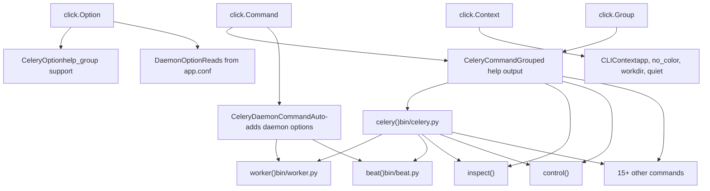
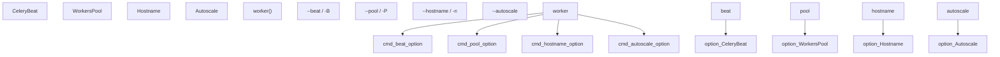
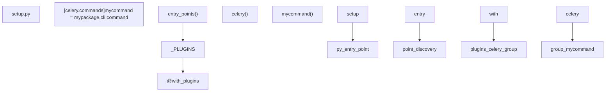

# CLI Architecture

Relevant source files

-   [celery/bin/base.py](https://github.com/celery/celery/blob/4d068b56/celery/bin/base.py)
-   [celery/bin/beat.py](https://github.com/celery/celery/blob/4d068b56/celery/bin/beat.py)
-   [celery/bin/celery.py](https://github.com/celery/celery/blob/4d068b56/celery/bin/celery.py)
-   [celery/bin/events.py](https://github.com/celery/celery/blob/4d068b56/celery/bin/events.py)
-   [celery/bin/worker.py](https://github.com/celery/celery/blob/4d068b56/celery/bin/worker.py)
-   [celery/events/snapshot.py](https://github.com/celery/celery/blob/4d068b56/celery/events/snapshot.py)

## Purpose and Scope

This page documents the architecture of Celery's command-line interface (CLI), which is built on the Click framework and provides an extensible system for managing Celery operations. It covers the custom Click components, application loading mechanism, plugin system, and how commands are organized and registered.

For information about specific command implementations, see:

-   Worker and beat daemon commands: [9.2](/celery/celery/9.2-worker-and-beat-commands)
-   Management commands (inspect, control, purge, etc.): [9.3](/celery/celery/9.3-management-commands)
-   Multi-worker management: [9.4](/celery/celery/9.4-multi-worker-management)

## CLI Framework Overview

Celery's CLI is built on the Click framework and extends it with custom components to support grouped help output, daemon options, application context management, and a plugin architecture for third-party extensions.


**Sources:** [celery/bin/base.py1-307](https://github.com/celery/celery/blob/4d068b56/celery/bin/base.py#L1-L307) [celery/bin/celery.py1-228](https://github.com/celery/celery/blob/4d068b56/celery/bin/celery.py#L1-L228)

## CLI Entry Point and Command Discovery

The main CLI entry point is the `celery` group function, which uses Click's plugin system to discover and register commands from entry points.

### Entry Point Structure

```mermaid
flowchart TD
    main["main()"]
    celery_group["celery()"]
    plugins["@with_plugins(_PLUGINS)"]
    entry_points["entry_points()"]
    third_party["Third-party Extensions"]
    worker["worker()"]
    beat["beat()"]
    events["events()"]
    inspect["inspect()"]
    control["control()"]
    purge["purge()"]
    others["10+ more"]

    main --> celery_group
    plugins --> celery_group
    entry --> points_plugins
    third --> party_entry_points
    celery --> group_worker
    celery --> group_beat
    celery --> group_events
    celery --> group_inspect
    celery --> group_control
    celery --> group_purge
    celery --> group_others
```


**Entry Point Discovery Code:**

The CLI discovers plugins using Python's entry points mechanism, with version-specific handling:

```
Python >= 3.10:
  _PLUGINS = entry_points(group='celery.commands')

Python < 3.10:
  _PLUGINS = entry_points().get('celery.commands', [])
  OR
  _PLUGINS = entry_points().select(group='celery.commands')
```
[celery/bin/celery.py46-53](https://github.com/celery/celery/blob/4d068b56/celery/bin/celery.py#L46-L53)

**Main Entry Point:**

The `main()` function serves as the package entry point and enables auto-prefixing of environment variables:

[celery/bin/celery.py220-227](https://github.com/celery/celery/blob/4d068b56/celery/bin/celery.py#L220-L227)

**Sources:** [celery/bin/celery.py46-53](https://github.com/celery/celery/blob/4d068b56/celery/bin/celery.py#L46-L53) [celery/bin/celery.py220-227](https://github.com/celery/celery/blob/4d068b56/celery/bin/celery.py#L220-L227)

## Custom Click Components

Celery extends Click with four custom component classes that provide specialized functionality.

### Component Hierarchy

| Component | Base Class | Purpose | Key Features |
| --- | --- | --- | --- |
| `CeleryOption` | `click.Option` | Enhanced option with help grouping | `help_group`, `default_value_from_context` |
| `CeleryCommand` | `click.Command` | Command with grouped help output | Organizes options by `help_group` |
| `DaemonOption` | `CeleryOption` | Daemon-specific option | Reads defaults from `app.conf.{command}_{option}` |
| `CeleryDaemonCommand` | `CeleryCommand` | Daemon command with auto-options | Auto-adds logfile, pidfile, uid, gid, umask, executable |

### CeleryOption

Extends `click.Option` to support help grouping and context-based defaults:

[celery/bin/base.py140-152](https://github.com/celery/celery/blob/4d068b56/celery/bin/base.py#L140-L152)

**Key features:**

-   `help_group`: Groups related options in help output (e.g., "Worker Options", "Pool Options")
-   `default_value_from_context`: Retrieves default from `ctx.obj` dictionary

### CeleryCommand

Overrides help formatting to display options grouped by `help_group`:

[celery/bin/base.py155-171](https://github.com/celery/celery/blob/4d068b56/celery/bin/base.py#L155-L171)

**Help organization:**

-   Options with `help_group` are grouped under that heading
-   Options without `help_group` fall under "Options"
-   Uses `OrderedDict` to maintain group order

### DaemonOption

Specialized option that reads defaults from application configuration:

[celery/bin/base.py174-188](https://github.com/celery/celery/blob/4d068b56/celery/bin/base.py#L174-L188)

**Configuration lookup pattern:**

```
For command: worker
For option: --pidfile
Reads from: app.conf.worker_pidfile

For command: beat
For option: --logfile
Reads from: app.conf.beat_logfile
```
### CeleryDaemonCommand

Automatically adds common daemon options to commands:

[celery/bin/base.py191-204](https://github.com/celery/celery/blob/4d068b56/celery/bin/base.py#L191-L204)

**Auto-added options:**

-   `--logfile` / `-f`: Log destination
-   `--pidfile`: PID file path
-   `--uid`: User ID for privilege dropping
-   `--gid`: Group ID for privilege dropping
-   `--umask`: File creation umask
-   `--executable`: Python executable override

All options are added to the "Daemonization Options" help group.

**Sources:** [celery/bin/base.py140-204](https://github.com/celery/celery/blob/4d068b56/celery/bin/base.py#L140-L204)

## Context Management

The CLI uses a custom context object (`CLIContext`) to pass application state and configuration through the command chain.

### CLIContext Structure

```mermaid
flowchart TD
    CLIContext["CLIContext"]
    app["app: Celery"]
    no_color["no_color: bool"]
    workdir["workdir: Path"]
    quiet["quiet: bool"]
    OK["OK"]
    ERROR["ERROR"]
    style_method["style()"]
    secho["secho()"]
    echo["echo()"]
    error["error()"]
    pretty["pretty()"]
    pretty_list["pretty_list()"]
    pretty_dict_ok_error["pretty_dict_ok_error()"]
    say_chat["say_chat()"]

    CLIContext --> app
    CLIContext --> no_color
    CLIContext --> workdir
    CLIContext --> quiet
    CLIContext --> OK
    CLIContext --> ERROR
    CLIContext --> style_method
    CLIContext --> secho
    CLIContext --> echo
    CLIContext --> error
    CLIContext --> pretty
    CLIContext --> pretty_list
    CLIContext --> pretty_dict_ok_error
    CLIContext --> say_chat
```


**Context Creation:**

The main `celery` group creates the context and stores it in `ctx.obj`:

[celery/bin/celery.py154-155](https://github.com/celery/celery/blob/4d068b56/celery/bin/celery.py#L154-L155)

**Context Usage Pattern:**

Commands access the context via the `@click.pass_context` decorator:

```
@click.pass_context
def worker(ctx, **kwargs):
    app = ctx.obj.app           # Access application
    ctx.obj.echo("Starting...")  # Use output methods
```
**Pretty Printing:**

The context includes sophisticated pretty-printing for command output:

[celery/bin/base.py80-109](https://github.com/celery/celery/blob/4d068b56/celery/bin/base.py#L80-L109)

Supports:

-   Lists: Bullet-point formatting
-   Dicts with `ok`/`error` keys: Status-based formatting
-   JSON objects: Syntax highlighting (if pygments available)
-   Other objects: `pformat()` fallback

**Sources:** [celery/bin/base.py34-117](https://github.com/celery/celery/blob/4d068b56/celery/bin/base.py#L34-L117) [celery/bin/celery.py154-155](https://github.com/celery/celery/blob/4d068b56/celery/bin/celery.py#L154-L155)

## Application Loading and Global Options

The main `celery` group defines global options that apply to all subcommands and handles application loading.

### Global Options

| Option | Environment Variable | Purpose | Type |
| --- | --- | --- | --- |
| `-A`, `--app` | `APP` | Application module path | `UNPROCESSED` |
| `-b`, `--broker` | `BROKER_URL` | Broker URL | String |
| `--result-backend` | `RESULT_BACKEND` | Result backend URL | String |
| `--loader` | `LOADER` | Loader class | String |
| `--config` | `CONFIG_MODULE` | Config module | String |
| `--workdir` | \- | Working directory | Path |
| `-C`, `--no-color` | `NO_COLOR` | Disable color | Flag |
| `-q`, `--quiet` | \- | Quiet mode | Flag |
| `--version` | \- | Show version | Flag |
| `--skip-checks` | `SKIP_CHECKS` | Skip Django checks | Flag |

[celery/bin/celery.py57-111](https://github.com/celery/celery/blob/4d068b56/celery/bin/celery.py#L57-L111)

### Application Loading Flow

> **[Mermaid sequence]**
> *(图表结构无法解析)*

**Application Loading Code:**

[celery/bin/celery.py135-152](https://github.com/celery/celery/blob/4d068b56/celery/bin/celery.py#L135-L152)

**User Options Extension:**

After loading the application, the CLI extends command parameters with application-defined user options:

[celery/bin/celery.py158-163](https://github.com/celery/celery/blob/4d068b56/celery/bin/celery.py#L158-L163)

This allows applications to inject custom options into specific commands.

**Sources:** [celery/bin/celery.py57-163](https://github.com/celery/celery/blob/4d068b56/celery/bin/celery.py#L57-L163)

## Command Registration

Commands are registered with the main `celery` group using the `add_command()` method.

### Built-in Command Registration

**Command Registration Code:**

[celery/bin/celery.py166-191](https://github.com/celery/celery/blob/4d068b56/celery/bin/celery.py#L166-L191)

**Inline Command Example:**

The `report` command is defined inline rather than in a separate module:

[celery/bin/celery.py166-172](https://github.com/celery/celery/blob/4d068b56/celery/bin/celery.py#L166-L172)

**Sources:** [celery/bin/celery.py166-191](https://github.com/celery/celery/blob/4d068b56/celery/bin/celery.py#L166-L191)

## Custom Parameter Types

Celery defines custom Click parameter types for specialized parsing and validation.

### Parameter Type Catalog

| Type | Class | Purpose | Example |
| --- | --- | --- | --- |
| `COMMA_SEPARATED_LIST` | `CommaSeparatedList` | Parse comma-separated values | `"queue1,queue2,queue3"` |
| `JSON_ARRAY` | `JsonArray` | Parse JSON array strings | `'["a", "b", "c"]'` |
| `JSON_OBJECT` | `JsonObject` | Parse JSON object strings | `'{"key": "value"}'` |
| `ISO8601` | `ISO8601DateTime` | Parse ISO 8601 datetime | `"2024-01-01T12:00:00"` |
| `ISO8601_OR_FLOAT` | `ISO8601DateTimeOrFloat` | Parse ISO 8601 or float | `"2024-01-01T12:00:00"` or `3600.5` |
| `LOG_LEVEL` | `LogLevel` | Parse log level names | `"DEBUG"`, `"INFO"`, `"WARNING"` |

### CommaSeparatedList

Splits comma-separated string into list:

[celery/bin/base.py207-213](https://github.com/celery/celery/blob/4d068b56/celery/bin/base.py#L207-L213)

**Usage example:**

```
@click.option('--queues', '-Q', type=COMMA_SEPARATED_LIST)
```
### JSON Array and Object

Parse JSON strings into Python data structures:

[celery/bin/base.py216-253](https://github.com/celery/celery/blob/4d068b56/celery/bin/base.py#L216-L253)

Validates that parsed value is correct type (list or dict).

### ISO8601 DateTime

Parses ISO 8601 date/time strings using `maybe_iso8601()`:

[celery/bin/base.py256-265](https://github.com/celery/celery/blob/4d068b56/celery/bin/base.py#L256-L265)

### LogLevel

Converts log level names to numeric values:

[celery/bin/base.py285-298](https://github.com/celery/celery/blob/4d068b56/celery/bin/base.py#L285-L298)

**Features:**

-   Accepts numeric values directly
-   Converts string names to uppercase
-   Uses `mlevel()` to get numeric level
-   Choices: DEBUG, INFO, WARNING, ERROR, CRITICAL, FATAL

**Sources:** [celery/bin/base.py207-306](https://github.com/celery/celery/blob/4d068b56/celery/bin/base.py#L207-L306)

## Worker and Beat Command Architecture

Daemon commands (worker, beat, events) follow a common pattern with specialized parameter types.

### Worker Command Parameter Types


### CeleryBeat Type

Validates that `-B` option is not used on Windows:

[celery/bin/worker.py22-32](https://github.com/celery/celery/blob/4d068b56/celery/bin/worker.py#L22-L32)

### WorkersPool Type

Validates and resolves pool implementation:

[celery/bin/worker.py35-63](https://github.com/celery/celery/blob/4d068b56/celery/bin/worker.py#L35-L63)

**Resolution logic:**

1.  If value is already a pool class, return it
2.  Convert pool name via Click choices
3.  If CLI value is 'prefork', check `worker_pool` configuration
4.  Use `concurrency.get_implementation()` to get pool class
5.  Fall back to configured `worker_pool` if lookup fails

### Hostname Type

Formats hostname using `host_format()` and `default_nodename()`:

[celery/bin/worker.py66-72](https://github.com/celery/celery/blob/4d068b56/celery/bin/worker.py#L66-L72)

Supports placeholders:

-   `%h`: Hostname
-   `%n`: Node name
-   `%d`: Domain

### Autoscale Type

Parses autoscale parameter as `"max,min"` or single value:

[celery/bin/worker.py75-97](https://github.com/celery/celery/blob/4d068b56/celery/bin/worker.py#L75-L97)

**Parsing rules:**

-   Single value: `"10"` → `(10, 0)`
-   Two values: `"10,3"` → `(10, 3)` (max, min)
-   Values are sorted with max first

**Sources:** [celery/bin/worker.py22-97](https://github.com/celery/celery/blob/4d068b56/celery/bin/worker.py#L22-L97)

## Error Handling and User Experience

The CLI includes sophisticated error handling to guide users toward correct usage.

### Application Loading Errors

Three distinct error messages for different failure modes:

| Error Type | Message Template | Trigger |
| --- | --- | --- |
| Module not found | `UNABLE_TO_LOAD_APP_MODULE_NOT_FOUND` | `ModuleNotFoundError` |
| Attribute error | `UNABLE_TO_LOAD_APP_APP_MISSING` | `AttributeError` |
| Other error | `UNABLE_TO_LOAD_APP_ERROR_OCCURRED` | Any other exception |

[celery/bin/celery.py32-43](https://github.com/celery/celery/blob/4d068b56/celery/bin/celery.py#L32-L43)

### Wrong App Option Usage

Custom error handling for common mistake of using `-A` as subcommand option:

[celery/bin/celery.py197-217](https://github.com/celery/celery/blob/4d068b56/celery/bin/celery.py#L197-L217)

**Intercepted pattern:**

```
# Wrong (old Celery 4.x syntax):
celery worker -A myapp

# Correct (Celery 5.x+):
celery -A myapp worker
```
The CLI monkey-patches `click.exceptions.NoSuchOption.show` to detect this pattern and display helpful guidance:

[celery/bin/celery.py199-203](https://github.com/celery/celery/blob/4d068b56/celery/bin/celery.py#L199-L203)

### Preload Options Handling

Commands can extract user-defined preload options and fire signals:

[celery/bin/base.py120-137](https://github.com/celery/celery/blob/4d068b56/celery/bin/base.py#L120-L137)

**Usage pattern:**

```
@click.pass_context
@handle_preload_options
def worker(ctx, **kwargs):
    # Preload options extracted and signal fired before function runs
    pass
```
The `handle_preload_options` decorator:

1.  Extracts options marked as 'preload' from `app.user_options`
2.  Creates dictionary of option values from kwargs
3.  Fires `user_preload_options` signal with app and options

**Sources:** [celery/bin/celery.py32-43](https://github.com/celery/celery/blob/4d068b56/celery/bin/celery.py#L32-L43) [celery/bin/celery.py197-217](https://github.com/celery/celery/blob/4d068b56/celery/bin/celery.py#L197-L217) [celery/bin/base.py120-137](https://github.com/celery/celery/blob/4d068b56/celery/bin/base.py#L120-L137)

## Plugin System

The CLI supports third-party extensions via Python entry points in the `celery.commands` group.

### Plugin Discovery Mechanism


**Plugin registration in third-party package:**

```
# Third-party setup.py
setup(
    name='celery-custom-plugin',
    entry_points={
        'celery.commands': [
            'mycommand = mypackage.cli:mycommand',
        ],
    },
)
```
**Plugin loading:**

[celery/bin/celery.py46-52](https://github.com/celery/celery/blob/4d068b56/celery/bin/celery.py#L46-L52)

The `@with_plugins` decorator from `click_plugins` automatically discovers and registers commands from the entry points.

**DYMGroup (Did You Mean):**

The main group uses `DYMGroup` from `click-didyoumean` to suggest corrections for typos:

[celery/bin/celery.py56](https://github.com/celery/celery/blob/4d068b56/celery/bin/celery.py#L56-L56)

Example:

```
$ celery wrker
Error: No such command 'wrker'.
Did you mean 'worker'?
```
**Sources:** [celery/bin/celery.py46-56](https://github.com/celery/celery/blob/4d068b56/celery/bin/celery.py#L46-L56)

## Configuration from Command Line

Both worker and beat commands support dynamic configuration via extra arguments.

### Extra Arguments Pattern

Commands use `context_settings={'allow_extra_args': True}` to accept additional arguments:

[celery/bin/worker.py136-137](https://github.com/celery/celery/blob/4d068b56/celery/bin/worker.py#L136-L137) [celery/bin/beat.py10-11](https://github.com/celery/celery/blob/4d068b56/celery/bin/beat.py#L10-L11)

### Configuration Parsing

Extra arguments are parsed and applied to the application configuration:

[celery/bin/worker.py329-335](https://github.com/celery/celery/blob/4d068b56/celery/bin/worker.py#L329-L335)

**Format:**

```
celery -A myapp worker \
    worker.prefetch_multiplier=4 \
    worker.max_tasks_per_child=1000
```
The `app.config_from_cmdline()` method:

-   Parses `key=value` pairs from `ctx.args`
-   Supports namespace prefix (e.g., `worker.` → `worker_prefetch_multiplier`)
-   Raises `KeyError` or `ValueError` for invalid configuration

**Error handling:**

[celery/bin/worker.py331-335](https://github.com/celery/celery/blob/4d068b56/celery/bin/worker.py#L331-L335)

Invalid configuration triggers `click.UsageError` with helpful message.

**Sources:** [celery/bin/worker.py136-137](https://github.com/celery/celery/blob/4d068b56/celery/bin/worker.py#L136-L137) [celery/bin/worker.py329-335](https://github.com/celery/celery/blob/4d068b56/celery/bin/worker.py#L329-L335) [celery/bin/beat.py10-11](https://github.com/celery/celery/blob/4d068b56/celery/bin/beat.py#L10-L11) [celery/bin/beat.py52-59](https://github.com/celery/celery/blob/4d068b56/celery/bin/beat.py#L52-L59)

## Summary

The Celery CLI architecture demonstrates a well-designed extension of the Click framework:

**Key architectural patterns:**

1.  **Component Extension**: Custom `CeleryOption`, `CeleryCommand`, `CeleryDaemonCommand` classes extend Click with Celery-specific features
2.  **Context Management**: `CLIContext` provides consistent application access and output formatting across all commands
3.  **Plugin Architecture**: Entry points enable third-party command extensions
4.  **Help Grouping**: Options organized by `help_group` for improved discoverability
5.  **Type System**: Custom parameter types handle domain-specific parsing (pools, log levels, autoscale, etc.)
6.  **Daemon Support**: `CeleryDaemonCommand` automatically adds common daemon options (pidfile, logfile, uid/gid)
7.  **Error Guidance**: Helpful error messages guide users toward correct usage patterns
8.  **Dynamic Configuration**: Extra arguments support runtime configuration overrides

The architecture balances extensibility (plugins, user options) with usability (grouped help, smart defaults) and maintainability (type safety, clear component boundaries).

**Sources:** [celery/bin/celery.py1-228](https://github.com/celery/celery/blob/4d068b56/celery/bin/celery.py#L1-L228) [celery/bin/base.py1-307](https://github.com/celery/celery/blob/4d068b56/celery/bin/base.py#L1-L307) [celery/bin/worker.py1-372](https://github.com/celery/celery/blob/4d068b56/celery/bin/worker.py#L1-L372) [celery/bin/beat.py1-73](https://github.com/celery/celery/blob/4d068b56/celery/bin/beat.py#L1-L73) [celery/bin/events.py1-95](https://github.com/celery/celery/blob/4d068b56/celery/bin/events.py#L1-L95)
