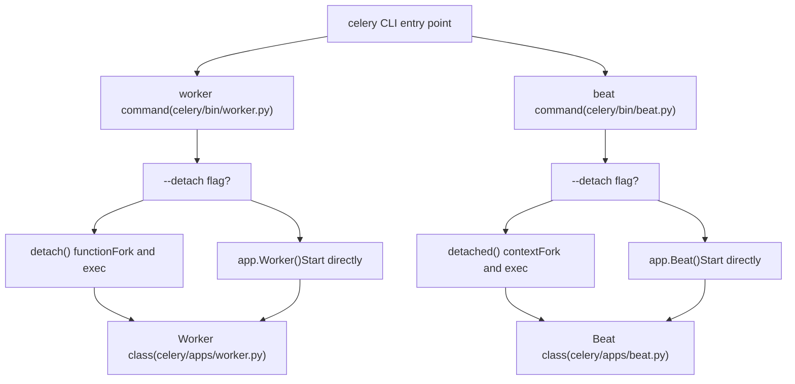
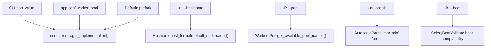
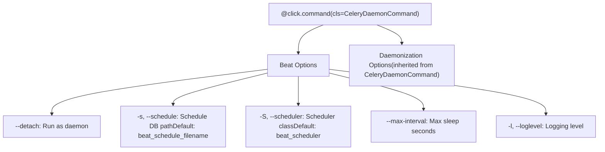
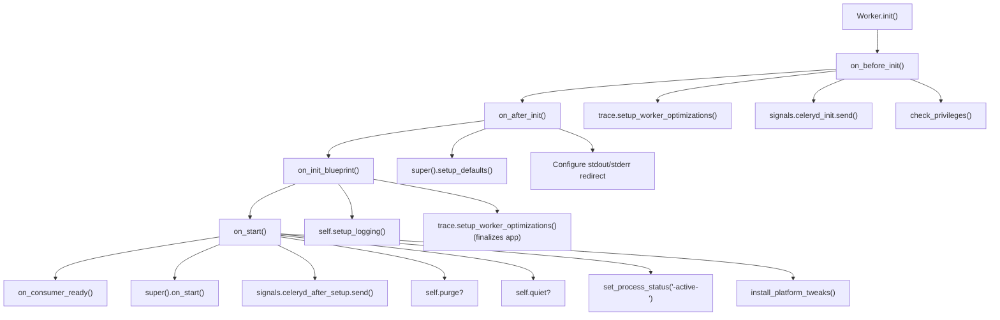
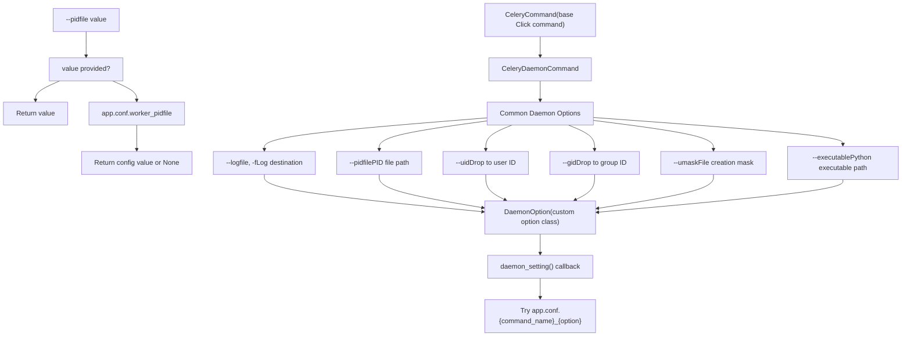
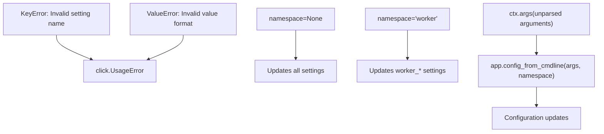

# Worker and Beat Commands

Relevant source files

-   [celery/apps/beat.py](https://github.com/celery/celery/blob/4d068b56/celery/apps/beat.py)
-   [celery/apps/worker.py](https://github.com/celery/celery/blob/4d068b56/celery/apps/worker.py)
-   [celery/bin/base.py](https://github.com/celery/celery/blob/4d068b56/celery/bin/base.py)
-   [celery/bin/beat.py](https://github.com/celery/celery/blob/4d068b56/celery/bin/beat.py)
-   [celery/bin/celery.py](https://github.com/celery/celery/blob/4d068b56/celery/bin/celery.py)
-   [celery/bin/events.py](https://github.com/celery/celery/blob/4d068b56/celery/bin/events.py)
-   [celery/bin/worker.py](https://github.com/celery/celery/blob/4d068b56/celery/bin/worker.py)
-   [celery/events/snapshot.py](https://github.com/celery/celery/blob/4d068b56/celery/events/snapshot.py)
-   [celery/worker/\_\_init\_\_.py](https://github.com/celery/celery/blob/4d068b56/celery/worker/__init__.py)

## Purpose and Scope

This page documents the `celery worker` and `celery beat` CLI subcommands, which are used to start worker instances and the periodic task scheduler respectively. These commands handle command-line option parsing, daemonization, and lifecycle management of long-running services.

For general CLI architecture and global options, see [CLI Architecture](/celery/celery/9.1-cli-architecture). For other management subcommands like `inspect`, `control`, and `purge`, see [Management Commands](/celery/celery/9.3-management-commands). For managing multiple worker instances simultaneously, see [Multi-worker Management](/celery/celery/9.4-multi-worker-management).

---

## Command Overview

Both `worker` and `beat` commands inherit from `CeleryDaemonCommand`, which provides common daemonization options. They support two execution modes:

-   **Foreground mode**: Process runs attached to the terminal
-   **Detached mode**: Process daemonizes and runs in the background


**Sources**: [celery/bin/worker.py136-372](https://github.com/celery/celery/blob/4d068b56/celery/bin/worker.py#L136-L372) [celery/bin/beat.py10-73](https://github.com/celery/celery/blob/4d068b56/celery/bin/beat.py#L10-L73) [celery/apps/worker.py85-280](https://github.com/celery/celery/blob/4d068b56/celery/apps/worker.py#L85-L280) [celery/apps/beat.py40-161](https://github.com/celery/celery/blob/4d068b56/celery/apps/beat.py#L40-L161)

---

## Worker Command

The worker command is defined in [celery/bin/worker.py136-372](https://github.com/celery/celery/blob/4d068b56/celery/bin/worker.py#L136-L372) and provides extensive configuration options for controlling worker behavior.

### Command Definition and Options

The worker command uses several custom parameter types and is organized into logical option groups:

| Option Group | Purpose |
| --- | --- |
| Worker Options | Core worker settings (hostname, detach, state database, loglevel, optimization) |
| Pool Options | Concurrency configuration (pool type, concurrency level, task events, time limits) |
| Queue Options | Queue consumption (queues, exclude-queues, include, purge) |
| Features | Advanced features (gossip, mingle, heartbeat, autoscale) |
| Embedded Beat Options | Optional embedded scheduler (beat flag, schedule file, scheduler class) |
| Daemonization Options | Daemon settings (logfile, pidfile, uid, gid, umask, executable) |

**Worker Options Diagram:**


**Sources**: [celery/bin/worker.py22-104](https://github.com/celery/celery/blob/4d068b56/celery/bin/worker.py#L22-L104) [celery/bin/worker.py136-305](https://github.com/celery/celery/blob/4d068b56/celery/bin/worker.py#L136-L305)

### Custom Parameter Types

Four custom parameter types handle specialized validation and conversion:

**Hostname Type** ([celery/bin/worker.py66-73](https://github.com/celery/celery/blob/4d068b56/celery/bin/worker.py#L66-L73)):

-   Converts hostname strings using `host_format(default_nodename(value))`
-   Expands templates: `%h` (hostname), `%n` (name), `%d` (domain)
-   Example: `'w1@%h'` becomes `'w1@myhost.example.com'`

**WorkersPool Type** ([celery/bin/worker.py35-64](https://github.com/celery/celery/blob/4d068b56/celery/bin/worker.py#L35-L64)):

-   Validates pool choice against `concurrency.get_available_pool_names()`
-   Handles pool precedence: CLI > `worker_pool` config > default
-   Returns pool implementation class via `concurrency.get_implementation()`

**Autoscale Type** ([celery/bin/worker.py75-98](https://github.com/celery/celery/blob/4d068b56/celery/bin/worker.py#L75-L98)):

-   Parses format: `"max,min"` or just `"max"` (min defaults to 0)
-   Returns tuple `(max, min)` in reversed sorted order
-   Example: `"10,3"` becomes `(10, 3)`

**CeleryBeat Type** ([celery/bin/worker.py22-33](https://github.com/celery/celery/blob/4d068b56/celery/bin/worker.py#L22-L33)):

-   Validates embedded beat is not used on Windows (not supported)
-   Fails with error message if Windows detected

**Sources**: [celery/bin/worker.py22-104](https://github.com/celery/celery/blob/4d068b56/celery/bin/worker.py#L22-L104)

### Worker Command Flow

> **[Mermaid sequence]**
> *(图表结构无法解析)*

**Sources**: [celery/bin/worker.py307-372](https://github.com/celery/celery/blob/4d068b56/celery/bin/worker.py#L307-L372) [celery/bin/worker.py108-134](https://github.com/celery/celery/blob/4d068b56/celery/bin/worker.py#L108-L134)

### Detach Function

The `detach()` function ([celery/bin/worker.py108-134](https://github.com/celery/celery/blob/4d068b56/celery/bin/worker.py#L108-L134)) handles daemonization:

1.  **Pre-format logfile**: Uses `node_format(logfile, hostname)` to expand templates before fork
2.  **Call `detached()` context**: From `celery.platforms`, handles actual fork
3.  **Execute new process**: Uses `os.execv(path, [path] + argv)` to replace process
4.  **Error handling**: Sets up logging and logs critical errors if exec fails

The `C_FAKEFORK` environment variable can be set to skip actual forking for testing.

**Sources**: [celery/bin/worker.py108-134](https://github.com/celery/celery/blob/4d068b56/celery/bin/worker.py#L108-L134)

---

## Beat Command

The beat command is simpler than worker, focusing on scheduler configuration.

### Command Definition


**Sources**: [celery/bin/beat.py10-73](https://github.com/celery/celery/blob/4d068b56/celery/bin/beat.py#L10-L73)

### Beat Command Flow

The beat command ([celery/bin/beat.py47-73](https://github.com/celery/celery/blob/4d068b56/celery/bin/beat.py#L47-L73)) executes as follows:

1.  **Parse extra config**: If `ctx.args` exists, call `app.config_from_cmdline(ctx.args)`
2.  **Create beat partial**: `beat = partial(app.Beat, logfile=..., pidfile=..., **kwargs)`
3.  **Detach if requested**: Use `detached()` context manager or run directly
4.  **Run beat**: Call `beat().run()` which starts the scheduler service

**Detached vs Direct Execution:**

| Mode | Privileges | Context | Execution |
| --- | --- | --- | --- |
| Foreground | `maybe_drop_privileges(uid, gid)` called first | Direct execution | `beat().run()` |
| Detached | Handled by `detached()` context | Fork and daemonize | `beat().run()` inside context |

**Sources**: [celery/bin/beat.py47-73](https://github.com/celery/celery/blob/4d068b56/celery/bin/beat.py#L47-L73)

---

## Worker Lifecycle and Signal Handlers

The `Worker` class ([celery/apps/worker.py85-280](https://github.com/celery/celery/blob/4d068b56/celery/apps/worker.py#L85-L280)) extends `WorkController` and manages the complete worker lifecycle through hooks and signal handlers.

### Lifecycle Hooks


**Sources**: [celery/apps/worker.py88-161](https://github.com/celery/celery/blob/4d068b56/celery/apps/worker.py#L88-L161)

### Signal Handlers

The worker installs multiple signal handlers in `install_platform_tweaks()` ([celery/apps/worker.py248-269](https://github.com/celery/celery/blob/4d068b56/celery/apps/worker.py#L248-L269)):

| Signal | Handler Function | Purpose |
| --- | --- | --- |
| SIGTERM | `install_worker_term_handler` | Warm shutdown (wait for tasks) |
| SIGQUIT | `install_worker_term_hard_handler` | Cold shutdown (cancel tasks) |
| SIGINT | `install_worker_int_handler` | First: message, Second: cold shutdown |
| SIGHUP | `install_worker_restart_handler` or `install_HUP_not_supported_handler` | Restart worker (not on macOS) |
| SIGUSR1 | `install_cry_handler` | Dump stack traces of all threads |
| SIGUSR2 | `install_rdb_handler` | Set rdb breakpoint (if `CELERY_RDBSIG` env var set) |

**SIGTERM Remapping**: If `billiard.common.REMAP_SIGTERM == "SIGQUIT"`, SIGTERM triggers cold shutdown instead of warm shutdown.

**Sources**: [celery/apps/worker.py248-269](https://github.com/celery/celery/blob/4d068b56/celery/apps/worker.py#L248-L269) [celery/apps/worker.py428-518](https://github.com/celery/celery/blob/4d068b56/celery/apps/worker.py#L428-L518)

### Shutdown Stages

The worker implements a sophisticated three-stage shutdown system:

> **[Mermaid stateDiagram]**
> *(图表结构无法解析)*

**Warm Shutdown** ([celery/apps/worker.py282-311](https://github.com/celery/celery/blob/4d068b56/celery/apps/worker.py#L282-L311) [celery/apps/worker.py428-436](https://github.com/celery/celery/blob/4d068b56/celery/apps/worker.py#L428-L436)):

-   Triggered by SIGTERM (or first SIGINT)
-   Sets `state.should_stop = EX_OK`
-   Worker stops consuming new tasks but waits for running tasks to complete
-   Clean exit when all tasks finish

**Cold Shutdown** ([celery/apps/worker.py363-425](https://github.com/celery/celery/blob/4d068b56/celery/apps/worker.py#L363-L425) [celery/apps/worker.py438-445](https://github.com/celery/celery/blob/4d068b56/celery/apps/worker.py#L438-L445)):

-   Triggered by SIGQUIT or second SIGINT
-   During shutdown, replaces signal handlers with `during_soft_shutdown` ([celery/apps/worker.py332-361](https://github.com/celery/celery/blob/4d068b56/celery/apps/worker.py#L332-L361))
-   Calls `wait_for_soft_shutdown()` if soft shutdown enabled (limited warm shutdown)
-   Stops task consumer to prevent requeuing
-   Cancels all active requests via `consumer.cancel_active_requests()`
-   Sets `state.should_terminate = True`
-   Stops pool to allow successful tasks to call `on_success()`

**Hard Shutdown** ([celery/apps/worker.py313-330](https://github.com/celery/celery/blob/4d068b56/celery/apps/worker.py#L313-L330)):

-   Triggered by third SIGINT/SIGQUIT during cold shutdown
-   Raises `WorkerTerminate(EX_FAILURE)` immediately
-   Forces termination without waiting

**During Soft Shutdown Handler** ([celery/apps/worker.py332-361](https://github.com/celery/celery/blob/4d068b56/celery/apps/worker.py#L332-L361)):

-   Installed after first SIGQUIT/SIGINT during cold shutdown
-   Replaces SIGINT/SIGQUIT with `on_hard_shutdown` handler
-   Cancels active requests but still waits for soft shutdown timeout
-   Gives one last chance for graceful termination

**Sources**: [celery/apps/worker.py282-425](https://github.com/celery/celery/blob/4d068b56/celery/apps/worker.py#L282-L425) [celery/apps/worker.py428-518](https://github.com/celery/celery/blob/4d068b56/celery/apps/worker.py#L428-L518)

### Platform-Specific Handlers

**Restart Handler** ([celery/apps/worker.py470-482](https://github.com/celery/celery/blob/4d068b56/celery/apps/worker.py#L470-L482)):

-   SIGHUP triggers worker restart via `os.execv()`
-   Only installed if not attached to tty (detached mode)
-   Not installed on macOS due to threading limitations
-   Uses `atexit.register(_reload_current_worker)`

**macOS HUP Handler** ([celery/apps/worker.py511-518](https://github.com/celery/celery/blob/4d068b56/celery/apps/worker.py#L511-L518)):

-   Shows warning message that restart is not supported
-   Installed on macOS when detached

**Cry Handler** ([celery/apps/worker.py484-494](https://github.com/celery/celery/blob/4d068b56/celery/apps/worker.py#L484-L494)):

-   SIGUSR1 dumps stack traces via `celery.utils.debug.cry()`
-   Not available on PyPy (lacks `sys._current_frames`)

**RDB Handler** ([celery/apps/worker.py496-509](https://github.com/celery/celery/blob/4d068b56/celery/apps/worker.py#L496-L509)):

-   SIGUSR2 sets rdb breakpoint for debugging
-   Only installed if `CELERY_RDBSIG` environment variable is set

**Sources**: [celery/apps/worker.py470-518](https://github.com/celery/celery/blob/4d068b56/celery/apps/worker.py#L470-L518)

### Worker Banner

The worker displays a banner on startup ([celery/apps/worker.py162-173](https://github.com/celery/celery/blob/4d068b56/celery/apps/worker.py#L162-L173) [celery/apps/worker.py206-246](https://github.com/celery/celery/blob/4d068b56/celery/apps/worker.py#L206-L246)):

```
 -------------- celery@hostname v5.x.x (...)
---- *****  -----
--- *******  ---- [config]
-- *** --- *  --- .> app:         proj:0x...
- **  ----------- .> transport:   redis://localhost:6379//
- **  ----------- .> results:     redis://localhost:6379/1
- **  ----------- .> concurrency: 4 (prefork)
- **  ----------- .> task events: OFF
- *** --- *  ---
-- *******  ---- [queues]
--- *****  ----- .> celery           exchange=celery(direct) key=celery
 --------------

[tasks]
  . proj.tasks.add
  . proj.tasks.mul
```
Banner includes:

-   Hostname, version, platform
-   App configuration (transport, results, concurrency, events)
-   Queue configuration
-   Registered tasks (if loglevel <= INFO)

**Sources**: [celery/apps/worker.py162-173](https://github.com/celery/celery/blob/4d068b56/celery/apps/worker.py#L162-L173) [celery/apps/worker.py206-246](https://github.com/celery/celery/blob/4d068b56/celery/apps/worker.py#L206-L246) [celery/apps/worker.py37-71](https://github.com/celery/celery/blob/4d068b56/celery/apps/worker.py#L37-L71)

---

## Beat Lifecycle

The `Beat` class ([celery/apps/beat.py40-161](https://github.com/celery/celery/blob/4d068b56/celery/apps/beat.py#L40-L161)) manages the periodic task scheduler.

### Beat Initialization and Execution

**Sources**: [celery/apps/beat.py46-119](https://github.com/celery/celery/blob/4d068b56/celery/apps/beat.py#L46-L119)

### Beat Banner

The beat service displays a banner ([celery/apps/beat.py120-147](https://github.com/celery/celery/blob/4d068b56/celery/apps/beat.py#L120-L147)):

```
__    -    ... __   -        _
LocalTime -> 2024-01-15 12:00:00
Configuration ->
    . broker -> redis://localhost:6379//
    . loader -> celery.loaders.app.AppLoader
    . scheduler -> celery.beat.PersistentScheduler
    . db -> celerybeat-schedule
    . logfile -> [stderr]@WARNING
    . maxinterval -> 5.00 minutes (300s)
```
**Sources**: [celery/apps/beat.py120-147](https://github.com/celery/celery/blob/4d068b56/celery/apps/beat.py#L120-L147) [celery/apps/beat.py26-36](https://github.com/celery/celery/blob/4d068b56/celery/apps/beat.py#L26-L36)

### Beat Signal Handlers

The beat service installs a sync handler for clean shutdown ([celery/apps/beat.py155-161](https://github.com/celery/celery/blob/4d068b56/celery/apps/beat.py#L155-L161)):

```
def _sync(signum, frame):
    service.sync()  # Persist schedule to disk
    raise SystemExit()

platforms.signals.update(SIGTERM=_sync, SIGINT=_sync)
```
This ensures the schedule is saved before exit on SIGTERM or SIGINT (Ctrl+C).

**Sources**: [celery/apps/beat.py155-161](https://github.com/celery/celery/blob/4d068b56/celery/apps/beat.py#L155-L161)

---

## Daemonization Architecture

Both worker and beat commands inherit common daemonization capabilities from `CeleryDaemonCommand`.

### CeleryDaemonCommand Class


**Sources**: [celery/bin/base.py174-205](https://github.com/celery/celery/blob/4d068b56/celery/bin/base.py#L174-L205)

### DaemonOption Implementation

The `DaemonOption` class ([celery/bin/base.py174-189](https://github.com/celery/celery/blob/4d068b56/celery/bin/base.py#L174-L189)) implements a callback pattern:

1.  **Initialization**: Sets help\_group to "Daemonization Options" and callback to `daemon_setting`
2.  **Callback execution**: `daemon_setting(ctx, opt, value)` checks:
    -   If `value` provided, return it
    -   Otherwise, check `ctx.obj.app.conf.{command_name}_{option_name}`
    -   Command name comes from `ctx.command.name` (e.g., "worker" or "beat")

**Example configurations:**

| Option | Worker Config Key | Beat Config Key |
| --- | --- | --- |
| `--pidfile` | `worker_pidfile` | `beat_pidfile` |
| `--logfile` | `worker_logfile` | `beat_logfile` |
| `--uid` | `worker_uid` | `beat_uid` |
| `--gid` | `worker_gid` | `beat_gid` |

**Sources**: [celery/bin/base.py174-189](https://github.com/celery/celery/blob/4d068b56/celery/bin/base.py#L174-L189)

### Detached Context Manager

The `detached()` context manager from `celery.platforms` handles the actual daemonization process:

1.  **Pre-fork setup**:
    -   Touch logfile to verify writability
    -   Format logfile with node name
2.  **Fork process**:
    -   First fork: Create child, parent exits
    -   `os.setsid()`: Create new session
    -   Second fork: Prevent acquiring controlling terminal
3.  **Post-fork setup**:
    -   Change working directory
    -   Set umask
    -   Drop privileges (uid/gid)
    -   Create pidfile
    -   Close file descriptors (except stdin/stdout/stderr)
    -   Redirect stdout/stderr to logfile
4.  **Execute context**:
    -   Yield control to caller
    -   Caller executes `os.execv()` to replace process

**Fake mode**: Setting `C_FAKEFORK` environment variable or passing `fake=True` skips forking for testing.

**Sources**: [celery/bin/worker.py108-134](https://github.com/celery/celery/blob/4d068b56/celery/bin/worker.py#L108-L134) [celery/bin/beat.py68-70](https://github.com/celery/celery/blob/4d068b56/celery/bin/beat.py#L68-L70)

---

## Option Parsing and Extra Arguments

Both commands use `context_settings={'allow_extra_args': True}` to accept additional configuration via command-line arguments.

### Extra Configuration Parsing


**Worker example** ([celery/bin/worker.py328-335](https://github.com/celery/celery/blob/4d068b56/celery/bin/worker.py#L328-L335)):

```
celery -A proj worker -l INFO worker_prefetch_multiplier=1
# Sets app.conf.worker_prefetch_multiplier = 1
```
**Beat example** ([celery/bin/beat.py52-59](https://github.com/celery/celery/blob/4d068b56/celery/bin/beat.py#L52-L59)):

```
celery -A proj beat max_interval=10
# Sets app.conf.max_interval = 10
```
**Sources**: [celery/bin/worker.py328-335](https://github.com/celery/celery/blob/4d068b56/celery/bin/worker.py#L328-L335) [celery/bin/beat.py52-59](https://github.com/celery/celery/blob/4d068b56/celery/bin/beat.py#L52-L59)

---

## Summary Table: Worker vs Beat Commands

| Aspect | Worker Command | Beat Command |
| --- | --- | --- |
| **File** | [celery/bin/worker.py](https://github.com/celery/celery/blob/4d068b56/celery/bin/worker.py) | [celery/bin/beat.py](https://github.com/celery/celery/blob/4d068b56/celery/bin/beat.py) |
| **Implementation Class** | `celery.apps.worker.Worker` | `celery.apps.beat.Beat` |
| **Primary Options** | hostname, pool, concurrency, queues, autoscale | schedule, scheduler, max-interval |
| **Custom Types** | Hostname, WorkersPool, Autoscale, CeleryBeat | None |
| **Option Groups** | 6 groups (Worker, Pool, Queue, Features, Beat, Daemon) | 2 groups (Beat, Daemon) |
| **Signals** | SIGTERM, SIGQUIT, SIGINT, SIGHUP, SIGUSR1, SIGUSR2 | SIGTERM, SIGINT |
| **Shutdown Stages** | Warm, Cold, Hard | Single stage (sync and exit) |
| **Detach Function** | `detach()` with `os.execv()` | `detached()` context manager |
| **Extra Config Namespace** | `'worker'` | None (global) |
| **Embedded Beat** | Supports `-B` flag | N/A (is beat) |
| **Banner Display** | ASCII art + config details | Simple text banner |

**Sources**: [celery/bin/worker.py1-372](https://github.com/celery/celery/blob/4d068b56/celery/bin/worker.py#L1-L372) [celery/bin/beat.py1-73](https://github.com/celery/celery/blob/4d068b56/celery/bin/beat.py#L1-L73) [celery/apps/worker.py1-518](https://github.com/celery/celery/blob/4d068b56/celery/apps/worker.py#L1-L518) [celery/apps/beat.py1-161](https://github.com/celery/celery/blob/4d068b56/celery/apps/beat.py#L1-L161)
