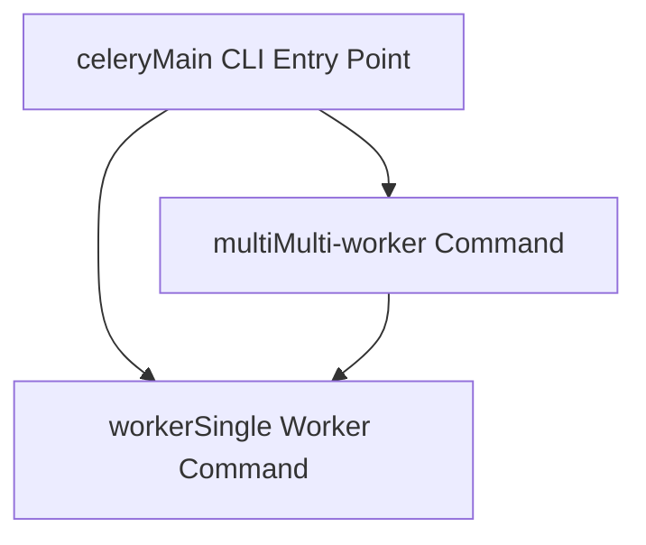
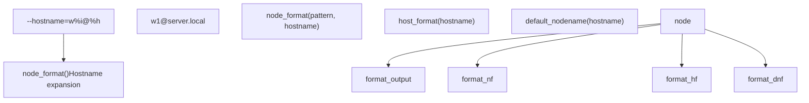
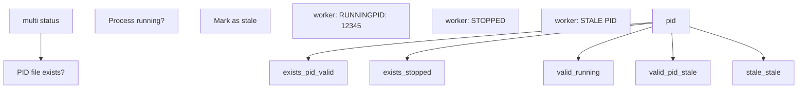
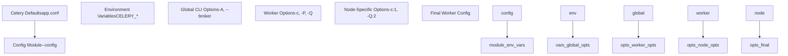
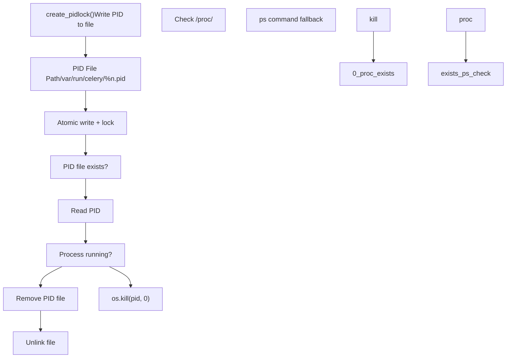
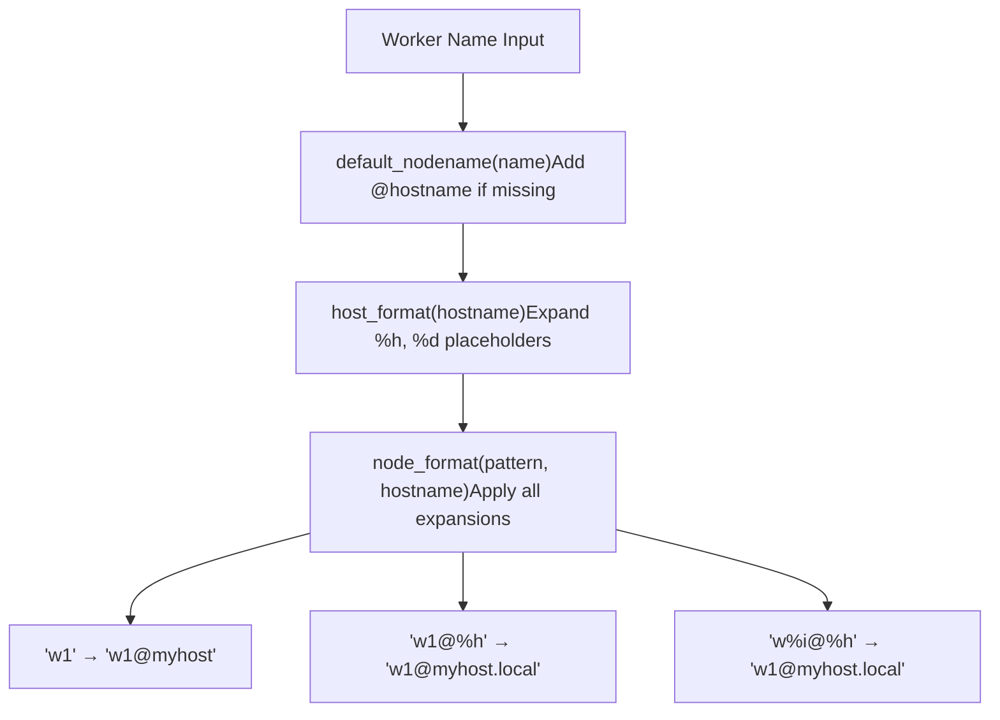
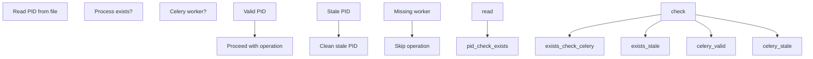

# Multi-worker Management

Relevant source files

-   [celery/bin/base.py](https://github.com/celery/celery/blob/4d068b56/celery/bin/base.py)
-   [celery/bin/beat.py](https://github.com/celery/celery/blob/4d068b56/celery/bin/beat.py)
-   [celery/bin/celery.py](https://github.com/celery/celery/blob/4d068b56/celery/bin/celery.py)
-   [celery/bin/events.py](https://github.com/celery/celery/blob/4d068b56/celery/bin/events.py)
-   [celery/bin/worker.py](https://github.com/celery/celery/blob/4d068b56/celery/bin/worker.py)
-   [celery/events/snapshot.py](https://github.com/celery/celery/blob/4d068b56/celery/events/snapshot.py)

## Purpose and Scope

This document describes the `multi` command and related infrastructure for managing multiple Celery worker processes on a single host. The multi-worker management system enables starting, stopping, restarting, and monitoring multiple worker instances with different configurations, hostnames, and queue assignments from a single command.

For information about starting individual worker instances, see [Worker and Beat Commands](/celery/celery/9.2-worker-and-beat-commands). For details on worker architecture and lifecycle, see [Workers](/celery/celery/5-workers) and [Worker Lifecycle and Shutdown](/celery/celery/5.2-worker-lifecycle-and-shutdown). For platform-specific process management utilities, see [Platform Utilities](#9.5).

---

## Multi Command Overview

The `multi` command provides a higher-level interface for managing collections of worker processes. It wraps the standard `worker` command and extends it with batch operations, process tracking, and coordinated lifecycle management across multiple instances.

### Command Registration

The multi command is registered with the main Celery CLI as a plugin command:


**Multi Command Registration Flow**

Sources: [celery/bin/celery.py25](https://github.com/celery/celery/blob/4d068b56/celery/bin/celery.py#L25-L25) [celery/bin/celery.py191](https://github.com/celery/celery/blob/4d068b56/celery/bin/celery.py#L191-L191)

### Purpose and Use Cases

The multi command addresses several operational requirements:

| Use Case | Description |
| --- | --- |
| **Queue Specialization** | Run separate workers for different queue priorities (e.g., `high`, `default`, `low`) |
| **Resource Isolation** | Allocate different concurrency levels to different worker types |
| **Hostname Differentiation** | Create uniquely identifiable worker instances for monitoring |
| **Coordinated Deployment** | Start/stop all workers in a deployment group atomically |
| **Process Supervision** | Track and manage worker process health across the system |

---

## Multi Command Architecture

The multi command operates as a process supervisor that manages worker instances through shell commands and process signals.

### Component Architecture

```mermaid
flowchart TD
    multi_cmd["multi commandProcess Supervisor"]
    node_args["Node ArgumentsPer-worker config"]
    expansion["Name Expansion%n, %i placeholders"]
    worker_spawner["Worker SpawnerFork/exec workers"]
    pid_tracker["PID File TrackerProcess identification"]
    signal_sender["Signal SenderTERM/INT/QUIT"]
    detach["detached()Daemonization"]
    pidlock["create_pidlock()PID file creation"]
    privileges["maybe_drop_privileges()User switching"]
    w1["worker w1--hostname=w1@host"]
    w2["worker w2--hostname=w2@host"]
    w3["worker w3--hostname=w3@host"]

    multi --> cmd_node_args
    multi --> cmd_expansion
    node --> args_worker_spawner
    expansion --> worker_spawner
    worker --> spawner_pid_tracker
    worker --> spawner_signal_sender
    worker --> spawner_detach
    worker --> spawner_pidlock
    worker --> spawner_privileges
    detach --> w1
    detach --> w2
    detach --> w3
    pid --> tracker_w1
    pid --> tracker_w2
    pid --> tracker_w3
    signal --> sender_w1
    signal --> sender_w2
    signal --> sender_w3
```


**Multi Command Process Management Architecture**

Sources: [celery/bin/celery.py25](https://github.com/celery/celery/blob/4d068b56/celery/bin/celery.py#L25-L25) [celery/bin/celery.py191](https://github.com/celery/celery/blob/4d068b56/celery/bin/celery.py#L191-L191) [celery/bin/worker.py108-134](https://github.com/celery/celery/blob/4d068b56/celery/bin/worker.py#L108-L134)

### Name Expansion System

The multi command supports placeholder expansion in worker arguments to generate unique configurations:

| Placeholder | Expansion | Example |
| --- | --- | --- |
| `%n` | Node name | `worker1` → `w1@hostname` |
| `%h` | Full hostname | `myserver.example.com` |
| `%d` | Domain name | `example.com` |
| `%i` | Process index | `0`, `1`, `2` for multiple instances |
| `%%` | Literal percent | `%` character |

This expansion is handled by the `node_format()` and `host_format()` utilities:


**Hostname and Node Name Expansion**

Sources: [celery/utils/nodenames.py](https://github.com/celery/celery/blob/4d068b56/celery/utils/nodenames.py) [celery/bin/worker.py66-73](https://github.com/celery/celery/blob/4d068b56/celery/bin/worker.py#L66-L73) [celery/bin/worker.py362](https://github.com/celery/celery/blob/4d068b56/celery/bin/worker.py#L362-L362)

---

## Process Management Operations

The multi command provides several operations for managing worker lifecycles.

### Start Operation

The `start` operation spawns new worker processes with specified configurations:

> **[Mermaid sequence]**
> *(图表结构无法解析)*

**Multi Start Sequence**

The start operation performs these steps for each worker:

1.  **Argument Construction** - Build complete worker command line with expanded placeholders
2.  **Daemonization** - Use `detached()` context manager to fork background process
3.  **PID File Creation** - Write process ID to tracking file for later operations
4.  **Worker Execution** - `execv()` to replace process with worker instance
5.  **Status Verification** - Optionally verify worker startup via PID file presence

Sources: [celery/bin/worker.py108-134](https://github.com/celery/celery/blob/4d068b56/celery/bin/worker.py#L108-L134) [celery/platforms.py](https://github.com/celery/celery/blob/4d068b56/celery/platforms.py)

### Stop Operation

The `stop` operation sends termination signals to running workers:

> **[Mermaid sequence]**
> *(图表结构无法解析)*

**Multi Stop Sequence**

The stop operation implements graceful shutdown with fallback:

1.  **PID Lookup** - Read worker PID from tracking file
2.  **SIGTERM Signal** - Send graceful shutdown signal (allows task completion)
3.  **Grace Period** - Wait for worker to finish current tasks and exit
4.  **SIGKILL Fallback** - Force termination if worker doesn't respond
5.  **Cleanup** - Remove PID files after verification

Sources: [celery/bin/worker.py](https://github.com/celery/celery/blob/4d068b56/celery/bin/worker.py) [celery/platforms.py](https://github.com/celery/celery/blob/4d068b56/celery/platforms.py)

### Restart Operation

The `restart` operation combines stop and start with logic to handle non-running workers:

| Restart Strategy | Behavior |
| --- | --- |
| **Running Worker** | SIGTERM → wait → start new |
| **Stopped Worker** | Skip stop → start new |
| **Stale PID** | Clean stale file → start new |
| **Failed Start** | Report error, continue with others |

### Status Operation

The `status` operation reports the running state of managed workers:


**Multi Status Check Logic**

Sources: [celery/platforms.py](https://github.com/celery/celery/blob/4d068b56/celery/platforms.py)

---

## Worker Instance Configuration

The multi command allows per-worker configuration through argument expansion and option passing.

### Node-Specific Arguments

Workers can be configured with different arguments using the node name syntax:

```
celery multi start 3 \
    --hostname=w%i@%h \
    -c:1 4 \
    -c:2 8 \
    -c:3 16 \
    -Q:1 high \
    -Q:2 default \
    -Q:3 low
```
This creates three workers with different concurrency and queue assignments:

| Worker | Hostname | Concurrency | Queues |
| --- | --- | --- | --- |
| w1 | `w1@hostname` | 4 | `high` |
| w2 | `w2@hostname` | 8 | `default` |
| w3 | `w3@hostname` | 16 | `low` |

### Configuration Inheritance

Configuration flows from multiple sources with the following precedence:


**Configuration Precedence Flow**

Sources: [celery/bin/celery.py113-156](https://github.com/celery/celery/blob/4d068b56/celery/bin/celery.py#L113-L156) [celery/bin/worker.py307-336](https://github.com/celery/celery/blob/4d068b56/celery/bin/worker.py#L307-L336)

### Common Multi-Worker Patterns

#### Queue-Based Worker Pools

Separate workers by queue priority:

```
celery multi start priority_workers -A myapp \
    --hostname=priority_%i@%h \
    -Q:1 critical \
    -Q:2 high \
    -Q:3 default \
    -Q:4 low \
    -c:1 2 \
    -c:2 4 \
    -c:3 8 \
    -c:4 8
```
#### Pool-Type Specialization

Run different concurrency models:

```
celery multi start mixed_pool -A myapp \
    --hostname=pool_%i@%h \
    -P:1 prefork -c:1 4 -Q:1 cpu_intensive \
    -P:2 eventlet -c:2 100 -Q:2 io_bound \
    -P:3 gevent -c:3 100 -Q:3 network_calls
```
Sources: [celery/bin/worker.py35-64](https://github.com/celery/celery/blob/4d068b56/celery/bin/worker.py#L35-L64) [celery/bin/worker.py100-103](https://github.com/celery/celery/blob/4d068b56/celery/bin/worker.py#L100-L103)

---

## Process Identification and Tracking

The multi command tracks worker processes through PID files and hostname resolution.

### PID File Management


**PID File Management Flow**

The PID file naming follows the pattern specified in the DaemonOption callback:

Sources: [celery/bin/base.py174-189](https://github.com/celery/celery/blob/4d068b56/celery/bin/base.py#L174-L189) [celery/platforms.py](https://github.com/celery/celery/blob/4d068b56/celery/platforms.py) [celery/bin/worker.py362](https://github.com/celery/celery/blob/4d068b56/celery/bin/worker.py#L362-L362)

### Hostname Resolution

Worker hostnames are normalized through the hostname resolution system:


**Hostname Resolution Pipeline**

Sources: [celery/utils/nodenames.py](https://github.com/celery/celery/blob/4d068b56/celery/utils/nodenames.py) [celery/bin/worker.py66-73](https://github.com/celery/celery/blob/4d068b56/celery/bin/worker.py#L66-L73) [celery/bin/worker.py138-145](https://github.com/celery/celery/blob/4d068b56/celery/bin/worker.py#L138-L145)

---

## Daemonization and Detachment

The multi command uses the platform utilities to properly daemonize worker processes.

### Detached Process Creation

The `detached()` context manager handles daemonization:

> **[Mermaid sequence]**
> *(图表结构无法解析)*

**Detached Worker Process Creation**

The detachment process ensures:

1.  **Session Leadership** - Worker becomes session leader via `setsid()`
2.  **Double Fork** - Second fork prevents TTY reacquisition
3.  **File Descriptor Management** - Close inherited descriptors, redirect standard streams
4.  **Log File Setup** - Open and verify log file accessibility before detaching
5.  **PID Recording** - Write daemon PID for later management
6.  **Privilege Drop** - Optional user/group switching after fork
7.  **Working Directory** - Change to specified workdir or root

Sources: [celery/platforms.py](https://github.com/celery/celery/blob/4d068b56/celery/platforms.py) [celery/bin/worker.py108-134](https://github.com/celery/celery/blob/4d068b56/celery/bin/worker.py#L108-L134)

### Log File Handling

The multi command formats log file paths with node name expansion:

| Format String | Expansion | Usage |
| --- | --- | --- |
| `--logfile=%n.log` | `w1.log`, `w2.log` | Per-worker logs |
| `--logfile=/var/log/celery/%n-%i.log` | `/var/log/celery/w1-0.log` | Indexed logs |
| `--logfile=/var/log/celery/worker.log` | All workers → same file | Shared log (not recommended) |

The log file path is formatted before process detachment:

Sources: [celery/bin/worker.py108-118](https://github.com/celery/celery/blob/4d068b56/celery/bin/worker.py#L108-L118)

---

## Integration with Worker Command

The multi command internally invokes the worker command for each managed instance.

### Worker Command Options

All standard worker options are available for multi-managed workers:


**Worker Command Options Available in Multi**

Sources: [celery/bin/worker.py136-304](https://github.com/celery/celery/blob/4d068b56/celery/bin/worker.py#L136-L304)

### Worker Initialization Flow

When a multi-spawned worker starts:

> **[Mermaid sequence]**
> *(图表结构无法解析)*

**Multi-Spawned Worker Initialization**

Sources: [celery/bin/worker.py307-368](https://github.com/celery/celery/blob/4d068b56/celery/bin/worker.py#L307-L368) [celery/bin/celery.py113-156](https://github.com/celery/celery/blob/4d068b56/celery/bin/celery.py#L113-L156)

---

## Command Line Examples

### Basic Multi-Worker Usage

Start three workers with default settings:

```
celery multi start 3 -A myapp
```
Creates workers: `celery@hostname`, `celery@hostname:1`, `celery@hostname:2`

### Custom Hostnames

Start workers with custom hostname pattern:

```
celery multi start 3 -A myapp --hostname=worker%i@%h
```
Creates: `worker1@hostname`, `worker2@hostname`, `worker3@hostname`

### Queue-Specific Workers

Start workers for different queue sets:

```
celery multi start high_worker default_worker -A myapp \
    --hostname=%n@%h \
    -Q:high_worker urgent,high \
    -Q:default_worker default,low \
    -c:high_worker 4 \
    -c:default_worker 8
```
### Restart Specific Workers

Restart subset of managed workers:

```
celery multi restart worker1 worker3 -A myapp
```
Only restarts `worker1` and `worker3`, leaves others running.

### Stop All Workers

Stop all workers managed by multi:

```
celery multi stop 3 -A myapp --hostname=worker%i@%h
```
Must match the same hostname pattern used in `start`.

### Check Worker Status

Query running status of managed workers:

```
celery multi status 3 -A myapp --hostname=worker%i@%h
```
Output shows PID and running state for each worker.

Sources: [celery/bin/worker.py](https://github.com/celery/celery/blob/4d068b56/celery/bin/worker.py) [celery/bin/celery.py](https://github.com/celery/celery/blob/4d068b56/celery/bin/celery.py)

---

## Advanced Configuration

### PID File Directory

Configure custom PID file location:

```
celery multi start 3 -A myapp \
    --pidfile=/var/run/celery/%n.pid
```
### Log File Organization

Separate log files per worker:

```
celery multi start 3 -A myapp \
    --logfile=/var/log/celery/%n%I.log \
    --loglevel=INFO
```
Creates: `/var/log/celery/celery.log`, `/var/log/celery/celery1.log`, `/var/log/celery/celery2.log`

### Privilege Dropping

Start workers as different user:

```
celery multi start 3 -A myapp \
    --uid=celery \
    --gid=celery
```
Requires starting as root, then drops privileges after fork.

Sources: [celery/bin/base.py174-205](https://github.com/celery/celery/blob/4d068b56/celery/bin/base.py#L174-L205) [celery/platforms.py](https://github.com/celery/celery/blob/4d068b56/celery/platforms.py)

### Working Directory

Set working directory for workers:

```
celery multi start 3 -A myapp \
    --workdir=/opt/myapp
```
Workers change to this directory after forking.

---

## Comparison with Direct Worker Command

### Multi Command vs Direct Worker

| Aspect | `celery multi` | `celery worker` |
| --- | --- | --- |
| **Process Count** | Multiple workers | Single worker |
| **PID Management** | Automatic tracking | Manual PID files |
| **Batch Operations** | Start/stop all at once | One at a time |
| **Configuration** | Per-node arguments | Single config |
| **Monitoring** | Built-in status | External tools |
| **Use Case** | Production deployments | Development, single instance |

### When to Use Multi

Use `celery multi` when:

-   Running multiple worker types on one host
-   Need coordinated start/stop of worker groups
-   Want simplified PID file management
-   Deploying queue-specialized workers

Use `celery worker` when:

-   Running single worker instance
-   Using external process supervisor (systemd, supervisord)
-   Need detailed control over single worker
-   Development and testing

Sources: [celery/bin/worker.py](https://github.com/celery/celery/blob/4d068b56/celery/bin/worker.py) [celery/bin/celery.py25](https://github.com/celery/celery/blob/4d068b56/celery/bin/celery.py#L25-L25) [celery/bin/celery.py191](https://github.com/celery/celery/blob/4d068b56/celery/bin/celery.py#L191-L191)

---

## Error Handling and Troubleshooting

### Common Issues

| Issue | Cause | Resolution |
| --- | --- | --- |
| **Stale PID files** | Worker crashed without cleanup | Remove PID files manually |
| **Permission denied** | Insufficient permissions for PID/log directory | Check directory permissions |
| **Worker won't stop** | Process hung, SIGTERM ignored | Use `stop` with `--force` or manual `SIGKILL` |
| **Hostname mismatch** | Different pattern in start/stop | Use same `--hostname` pattern |
| **Port conflicts** | Multiple workers binding same port | Use different ports per worker |

### PID File Validation

The multi command validates PID files before operations:


**PID File Validation Logic**

Sources: [celery/platforms.py](https://github.com/celery/celery/blob/4d068b56/celery/platforms.py)

---

## Integration with System Supervisors

The multi command can be integrated with system-level process supervisors.

### Systemd Integration

While `celery multi` provides its own process management, systemd can supervise the multi command itself:

```
[Unit]
Description=Celery Multi Workers
After=network.target

[Service]
Type=forking
User=celery
Group=celery
WorkingDirectory=/opt/myapp
ExecStart=/usr/bin/celery multi start 3 -A myapp --pidfile=/var/run/celery/%n.pid --logfile=/var/log/celery/%n.log
ExecStop=/usr/bin/celery multi stop 3 --pidfile=/var/run/celery/%n.pid
ExecReload=/usr/bin/celery multi restart 3 --pidfile=/var/run/celery/%n.pid

[Install]
WantedBy=multi-user.target
```
### Supervisor Integration

Alternatively, use supervisor to manage individual workers instead of multi:

```
[program:celery_worker_%(process_num)02d]
command=celery -A myapp worker --hostname=w%(process_num)02d@%%h -Q queue_%(process_num)02d
process_name=%(program_name)s
numprocs=3
directory=/opt/myapp
user=celery
autostart=true
autorestart=true
```
Sources: [celery/bin/worker.py336-356](https://github.com/celery/celery/blob/4d068b56/celery/bin/worker.py#L336-L356)

---

## Summary

The multi command provides coordinated management of multiple Celery worker processes through:

1.  **Batch Operations** - Start, stop, restart, and status commands for worker groups
2.  **Name Expansion** - Placeholder system for generating unique worker configurations
3.  **PID Tracking** - Automatic process identification and lifecycle management
4.  **Daemonization** - Platform-independent background process creation
5.  **Per-Worker Config** - Node-specific arguments for specialized worker roles

The multi command builds on the standard worker command infrastructure while adding process supervision capabilities suitable for production deployments with multiple worker types on a single host.

For alternative process management approaches using systemd or supervisord, see [Platform Utilities](#9.5). For details on worker architecture and configuration, see [Workers](/celery/celery/5-workers) and [Worker Configuration and Control](/celery/celery/5.4-worker-configuration-and-control).

Sources: [celery/bin/celery.py](https://github.com/celery/celery/blob/4d068b56/celery/bin/celery.py) [celery/bin/worker.py](https://github.com/celery/celery/blob/4d068b56/celery/bin/worker.py) [celery/bin/base.py](https://github.com/celery/celery/blob/4d068b56/celery/bin/base.py) [celery/platforms.py](https://github.com/celery/celery/blob/4d068b56/celery/platforms.py)
