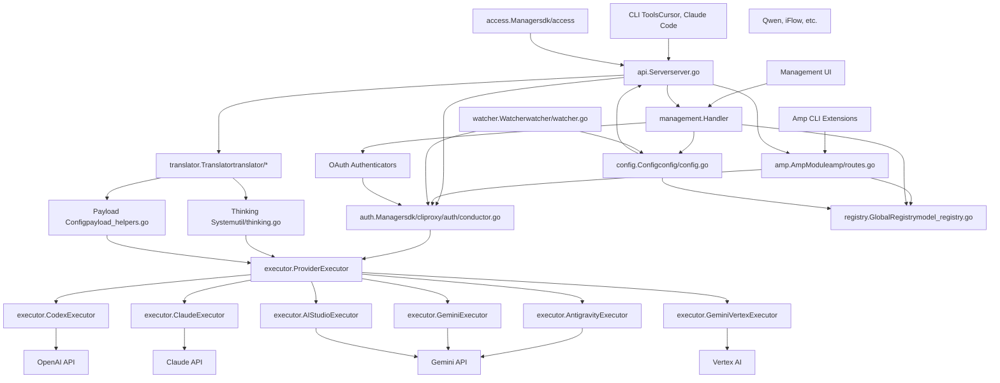
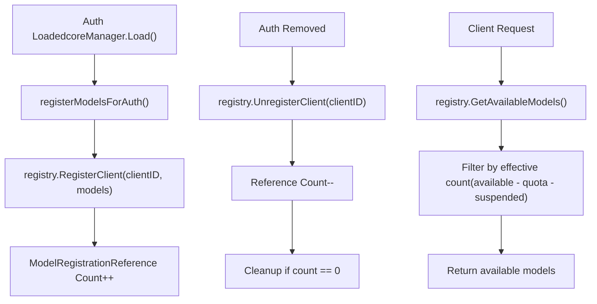

# Overview

Relevant source files

-   [README.md](https://github.com/router-for-me/CLIProxyAPI/blob/c66cb0af/README.md)
-   [README\_CN.md](https://github.com/router-for-me/CLIProxyAPI/blob/c66cb0af/README_CN.md)
-   [cmd/server/main.go](https://github.com/router-for-me/CLIProxyAPI/blob/c66cb0af/cmd/server/main.go)
-   [config.example.yaml](https://github.com/router-for-me/CLIProxyAPI/blob/c66cb0af/config.example.yaml)
-   [go.mod](https://github.com/router-for-me/CLIProxyAPI/blob/c66cb0af/go.mod)
-   [go.sum](https://github.com/router-for-me/CLIProxyAPI/blob/c66cb0af/go.sum)
-   [internal/api/handlers/management/auth\_files.go](https://github.com/router-for-me/CLIProxyAPI/blob/c66cb0af/internal/api/handlers/management/auth_files.go)
-   [internal/api/handlers/management/config\_basic.go](https://github.com/router-for-me/CLIProxyAPI/blob/c66cb0af/internal/api/handlers/management/config_basic.go)
-   [internal/api/handlers/management/config\_lists.go](https://github.com/router-for-me/CLIProxyAPI/blob/c66cb0af/internal/api/handlers/management/config_lists.go)
-   [internal/api/handlers/management/logs.go](https://github.com/router-for-me/CLIProxyAPI/blob/c66cb0af/internal/api/handlers/management/logs.go)
-   [internal/api/server.go](https://github.com/router-for-me/CLIProxyAPI/blob/c66cb0af/internal/api/server.go)
-   [internal/config/config.go](https://github.com/router-for-me/CLIProxyAPI/blob/c66cb0af/internal/config/config.go)
-   [internal/managementasset/updater.go](https://github.com/router-for-me/CLIProxyAPI/blob/c66cb0af/internal/managementasset/updater.go)
-   [internal/store/gitstore.go](https://github.com/router-for-me/CLIProxyAPI/blob/c66cb0af/internal/store/gitstore.go)
-   [internal/store/postgresstore.go](https://github.com/router-for-me/CLIProxyAPI/blob/c66cb0af/internal/store/postgresstore.go)
-   [internal/watcher/watcher.go](https://github.com/router-for-me/CLIProxyAPI/blob/c66cb0af/internal/watcher/watcher.go)
-   [sdk/cliproxy/service.go](https://github.com/router-for-me/CLIProxyAPI/blob/c66cb0af/sdk/cliproxy/service.go)
-   [test/amp\_management\_test.go](https://github.com/router-for-me/CLIProxyAPI/blob/c66cb0af/test/amp_management_test.go)

## Purpose

CLIProxyAPI is a unified proxy gateway for multiple AI provider APIs, exposing OpenAI-compatible endpoints to CLI tools and IDE extensions. It provides multi-account management, OAuth authentication, request translation, dynamic configuration hot-reload, and automatic credential failover.

The system acts as middleware between client applications (Cursor, Claude Code, Cline, Amp CLI) and AI providers (Google Gemini, Anthropic Claude, OpenAI Codex, Qwen, iFlow, Antigravity), abstracting provider-specific authentication and API format differences behind a unified interface.

**Key Features:**

-   OpenAI/Gemini/Claude/Codex compatible API endpoints
-   Multi-provider authentication (OAuth, API keys, service accounts)
-   Format translation between OpenAI, Claude, Gemini, and Antigravity protocols
-   Hot-reload configuration without service restart
-   Multi-account load balancing (round-robin, fill-first strategies)
-   Model availability tracking with quota management
-   WebSocket runtime authentication for AI Studio
-   Management API for runtime configuration

For detailed information on specific subsystems, see:

-   Installation and setup: [Getting Started](/router-for-me/CLIProxyAPI/2-getting-started)
-   Internal architecture: [Core Architecture](/router-for-me/CLIProxyAPI/3-core-architecture)
-   API endpoints: [API Reference](/router-for-me/CLIProxyAPI/4-api-reference)
-   Configuration: [Configuration Guide](/router-for-me/CLIProxyAPI/5-configuration-guide)
-   Provider setup: [Provider Integration](/router-for-me/CLIProxyAPI/6-provider-integration)
-   Authentication: [Authentication Flows](/router-for-me/CLIProxyAPI/7-authentication-flows)
-   Advanced features: [Advanced Features](/router-for-me/CLIProxyAPI/8-advanced-features)

Sources: [README.md1-58](https://github.com/router-for-me/CLIProxyAPI/blob/c66cb0af/README.md#L1-L58) [internal/api/server.go1-6](https://github.com/router-for-me/CLIProxyAPI/blob/c66cb0af/internal/api/server.go#L1-L6) [sdk/cliproxy/service.go1-4](https://github.com/router-for-me/CLIProxyAPI/blob/c66cb0af/sdk/cliproxy/service.go#L1-L4)

## System Architecture Overview

CLIProxyAPI uses a layered architecture separating concerns across HTTP API, authentication, routing, translation, and provider execution layers. The system is designed for extensibility through the `cliproxy.Builder` pattern and hot-reload capability via `watcher.Watcher`.

### Primary Components

| Component | Code Entity | Purpose |
| --- | --- | --- |
| **Service** | `cliproxy.Service` | Application lifecycle coordinator, integrates all subsystems |
| **API Server** | `api.Server` | Gin HTTP engine, CORS middleware, route registration |
| **Core Auth Manager** | `auth.Manager` (SDK) | Credential lifecycle, OAuth refresh, selector delegation |
| **Access Manager** | `access.Manager` | Request authentication via API keys or custom providers |
| **Model Registry** | `registry.GlobalRegistry` | Reference-counted model availability tracking |
| **Provider Executors** | `executor.*Executor` | Per-provider HTTP request execution implementations |
| **Translators** | `translator.*Translator` | Bidirectional format conversion (OpenAI↔Claude↔Gemini) |
| **File Watcher** | `watcher.Watcher` | fsnotify-based config/auth hot-reload with debouncing |
| **WebSocket Gateway** | `wsrelay.Manager` | Runtime AI Studio authentication via WebSocket |
| **Management API** | `management.Handler` | Runtime configuration control endpoints |
| **Config Manager** | `config.Config` | YAML configuration structure with hot-reload support |
| **Token Store** | `auth.Store` interface | Pluggable storage backends (file/postgres/git/S3) |

Sources: [internal/api/server.go114-173](https://github.com/router-for-me/CLIProxyAPI/blob/c66cb0af/internal/api/server.go#L114-L173) [sdk/cliproxy/service.go29-92](https://github.com/router-for-me/CLIProxyAPI/blob/c66cb0af/sdk/cliproxy/service.go#L29-L92) [internal/config/config.go26-118](https://github.com/router-for-me/CLIProxyAPI/blob/c66cb0af/internal/config/config.go#L26-L118) [internal/watcher/watcher.go30-55](https://github.com/router-for-me/CLIProxyAPI/blob/c66cb0af/internal/watcher/watcher.go#L30-L55)

## System Architecture Diagram

The following diagram shows major components and their relationships using actual code entities from the repository:


**System Architecture: Component Relationships**

This diagram maps high-level concepts to concrete code entities. Search for entity names (e.g., `api.Server`, `executor.ClaudeExecutor`) to locate implementations in the codebase.

Sources: [internal/api/server.go1-1000](https://github.com/router-for-me/CLIProxyAPI/blob/c66cb0af/internal/api/server.go#L1-L1000) [sdk/cliproxy/auth/](https://github.com/router-for-me/CLIProxyAPI/blob/c66cb0af/sdk/cliproxy/auth/) [internal/runtime/executor/](https://github.com/router-for-me/CLIProxyAPI/blob/c66cb0af/internal/runtime/executor/) [internal/registry/](https://github.com/router-for-me/CLIProxyAPI/blob/c66cb0af/internal/registry/) [internal/watcher/watcher.go1-149](https://github.com/router-for-me/CLIProxyAPI/blob/c66cb0af/internal/watcher/watcher.go#L1-L149)

## Request Flow Diagram

The following sequence diagram shows how a client request flows through the system, referencing actual code paths:

> **[Mermaid sequence]**
> *(图表结构无法解析)*

**Request Flow: Client to Provider**

This diagram traces the execution path from client request to provider response, showing component interactions and key transformation steps.

Sources: [internal/api/server.go308-349](https://github.com/router-for-me/CLIProxyAPI/blob/c66cb0af/internal/api/server.go#L308-L349) [sdk/api/handlers/openai/](https://github.com/router-for-me/CLIProxyAPI/blob/c66cb0af/sdk/api/handlers/openai/) [sdk/cliproxy/auth/](https://github.com/router-for-me/CLIProxyAPI/blob/c66cb0af/sdk/cliproxy/auth/) [internal/runtime/executor/](https://github.com/router-for-me/CLIProxyAPI/blob/c66cb0af/internal/runtime/executor/)

---

## Core Capabilities

### Multi-Provider Support

CLIProxyAPI integrates multiple AI providers through the `executor.ProviderExecutor` interface. Each provider has a dedicated executor implementation registered by `auth.Manager`:

| Provider | Executor Class | Authentication Methods | Handler Type |
| --- | --- | --- | --- |
| Google Gemini | `executor.GeminiExecutor` | API Key, CLI OAuth | OpenAI, Gemini |
| Google Vertex AI | `executor.GeminiVertexExecutor` | Service Account JSON, API Key | OpenAI, Gemini |
| Anthropic Claude | `executor.ClaudeExecutor` | API Key, OAuth | OpenAI, Claude |
| OpenAI Codex | `executor.CodexExecutor` | OAuth | OpenAI, Responses |
| Qwen Code | `executor.QwenExecutor` | Device Flow OAuth | OpenAI |
| iFlow | `executor.IFlowExecutor` | OAuth, Cookie Auth | OpenAI |
| Antigravity | `executor.AntigravityExecutor` | OAuth | OpenAI, Claude |
| AI Studio | `executor.AIStudioExecutor` | WebSocket Runtime Auth | OpenAI, Gemini |
| Kimi | `executor.KimiExecutor` | OAuth | OpenAI |
| OpenAI-compatible | `executor.OpenAICompatExecutor` | Configurable API Key | OpenAI |

Each executor implements request preparation, authentication injection, HTTP transport, response parsing, and usage reporting for its provider.

Sources: [internal/runtime/executor/](https://github.com/router-for-me/CLIProxyAPI/blob/c66cb0af/internal/runtime/executor/) [sdk/cliproxy/service.go359-410](https://github.com/router-for-me/CLIProxyAPI/blob/c66cb0af/sdk/cliproxy/service.go#L359-L410)

### Hot-Reload System

The `watcher.Watcher` monitors `config.yaml` and authentication files using `fsnotify.Watcher`, implementing debounced reload with differential updates:

**Debouncing Strategy:**

-   `configReloadDebounce = 150ms`: Groups rapid config file writes
-   `replaceCheckDelay = 50ms`: Detects atomic rename operations
-   `authRemoveDebounceWindow = 1s`: Defers auth deletion to distinguish move from remove

**Change Detection:**

-   SHA256 hash comparison prevents redundant reloads when content unchanged
-   YAML snapshot diffing identifies exact configuration changes
-   Auth file content comparison triggers targeted updates

**Update Propagation:**

-   `server.UpdateClients(cfg)`: Applies new configuration to `api.Server`
-   `coreManager.SetConfig(cfg)`: Updates authentication manager
-   `ampModule.OnConfigUpdated(cfg)`: Reloads Amp model mappings
-   Component-specific updates (logger, usage stats, cooling config)

Zero-downtime hot-reload enables runtime configuration changes without request interruption.

Sources: [internal/watcher/watcher.go1-149](https://github.com/router-for-me/CLIProxyAPI/blob/c66cb0af/internal/watcher/watcher.go#L1-L149) [internal/api/server.go859-975](https://github.com/router-for-me/CLIProxyAPI/blob/c66cb0af/internal/api/server.go#L859-L975) [sdk/cliproxy/service.go531-583](https://github.com/router-for-me/CLIProxyAPI/blob/c66cb0af/sdk/cliproxy/service.go#L531-L583)

### Format Translation

The translation layer implements bidirectional conversion between different AI API formats through the `translator.Translator` interface:

-   **OpenAI ↔ Claude**: Message format conversion, tool response handling
-   **OpenAI ↔ Gemini**: Content structure conversion, function response grouping
-   **Claude ↔ Antigravity**: Signature-based validation, thinking block parsing
-   **Gemini ↔ Antigravity**: Tool response grouping, format normalization

Sources: [internal/translator/](https://github.com/router-for-me/CLIProxyAPI/blob/c66cb0af/internal/translator/) Diagram 6 from system architecture

### Authentication Architecture

CLIProxyAPI implements dual-layer authentication:

**Request Authentication** (`access.Manager`):

-   Validates incoming client API keys via `AuthMiddleware`
-   Supports multiple access providers (config-based, custom)
-   Applied at HTTP middleware layer before routing

**Provider Authentication** (`auth.Manager`):

-   Manages OAuth tokens, API keys, service account credentials
-   Implements automatic token refresh with exponential backoff
-   Tracks quota limits and cooldown periods per credential
-   Selects credentials via `auth.Selector` (round-robin or fill-first)

**Credential Lifecycle:**

-   OAuth tokens refreshed automatically before expiration
-   Failed requests trigger cooldown (30min for 401, 12hr for 404)
-   Quota exceeded marks credential unavailable temporarily
-   Priority field enables credential preference when multiple match

**Storage Backends:**

-   `auth.FileTokenStore`: Local file storage
-   `store.PostgresStore`: PostgreSQL-backed persistence
-   `store.GitTokenStore`: Git repository versioning
-   `store.ObjectTokenStore`: S3-compatible object storage

Sources: [sdk/cliproxy/auth/](https://github.com/router-for-me/CLIProxyAPI/blob/c66cb0af/sdk/cliproxy/auth/) [sdk/access/](https://github.com/router-for-me/CLIProxyAPI/blob/c66cb0af/sdk/access/) [internal/api/server.go850-857](https://github.com/router-for-me/CLIProxyAPI/blob/c66cb0af/internal/api/server.go#L850-L857) [internal/store/](https://github.com/router-for-me/CLIProxyAPI/blob/c66cb0af/internal/store/)

---

## Storage Backend Architecture

CLIProxyAPI supports pluggable storage backends through the `auth.Store` interface:

| Backend | Implementation Class | Use Case |
| --- | --- | --- |
| **File** | `FileTokenStore` | Local development, single server |
| **PostgreSQL** | `PostgresStore` | Multi-instance deployment, shared state |
| **Git** | `GitTokenStore` | Version control, audit trail |
| **S3-compatible** | `ObjectTokenStore` | Cloud deployment, containerized |

All storage backends implement credential persistence and are configured via environment variables (`PGSTORE_DSN`, `GITSTORE_GIT_URL`, `OBJECTSTORE_ENDPOINT`, etc.).

Sources: [internal/store/](https://github.com/router-for-me/CLIProxyAPI/blob/c66cb0af/internal/store/) [cmd/server/main.go115-442](https://github.com/router-for-me/CLIProxyAPI/blob/c66cb0af/cmd/server/main.go#L115-L442)

---

## Configuration System

The `config.Config` struct is loaded from `config.yaml` and supports hot-reload through `watcher.Watcher`:

### Key Configuration Sections

| Section | Purpose | Hot-Reloadable |
| --- | --- | --- |
| `host`, `port` | Server bind address | No (restart required) |
| `tls` | HTTPS certificate configuration | No (restart required) |
| `remote-management` | Management API secret key | Yes |
| `auth-dir` | Authentication file storage path | No |
| `api-keys` | Client request authentication | Yes |
| `debug` | Debug logging level | Yes |
| `pprof` | pprof debug server settings | Yes |
| `logging-to-file` | Log output destination | Yes |
| `usage-statistics-enabled` | Usage tracking toggle | Yes |
| `request-retry` | Retry count for failed requests | Yes |
| `max-retry-interval` | Maximum cooldown wait time | Yes |
| `quota-exceeded` | Auto-switch behavior | Yes |
| `routing.strategy` | Credential selection (round-robin/fill-first) | Yes |
| `ws-auth` | WebSocket authentication requirement | Yes |
| `gemini-api-key` | Gemini API keys with models/aliases | Yes |
| `claude-api-key` | Claude API keys with models/aliases | Yes |
| `codex-api-key` | Codex API keys with models/aliases | Yes |
| `openai-compatibility` | Custom OpenAI-compatible providers | Yes |
| `vertex-api-key` | Vertex-compatible endpoints | Yes |
| `ampcode` | Amp CLI upstream/mapping configuration | Yes |
| `oauth-model-alias` | Global OAuth model name aliases | Yes |
| `oauth-excluded-models` | Per-provider model exclusions | Yes |
| `payload` | Request transformation rules | Yes |

**Hot-Reload Mechanism:**

-   `watcher.Watcher` monitors `config.yaml` with 150ms debounce
-   YAML snapshot diffing identifies changed sections
-   `server.UpdateClients(cfg)` propagates updates to subsystems
-   Credential configuration triggers model re-registration

Sources: [internal/config/config.go26-118](https://github.com/router-for-me/CLIProxyAPI/blob/c66cb0af/internal/config/config.go#L26-L118) [config.example.yaml1-314](https://github.com/router-for-me/CLIProxyAPI/blob/c66cb0af/config.example.yaml#L1-L314) [internal/watcher/watcher.go1-149](https://github.com/router-for-me/CLIProxyAPI/blob/c66cb0af/internal/watcher/watcher.go#L1-L149)

---

## Service Lifecycle

The `cliproxy.Service` manages the complete application lifecycle using a builder pattern:

> **[Mermaid stateDiagram]**
> *(图表结构无法解析)*

**Diagram: Service Lifecycle State Machine**

Sources: [sdk/cliproxy/service.go403-658](https://github.com/router-for-me/CLIProxyAPI/blob/c66cb0af/sdk/cliproxy/service.go#L403-L658) [cmd/server/main.go448-482](https://github.com/router-for-me/CLIProxyAPI/blob/c66cb0af/cmd/server/main.go#L448-L482)

---

## Model Registry and Routing

The `registry.GlobalRegistry` tracks model availability across all providers using reference counting:

### Model Registration Flow


**Diagram: Model Registry Reference Counting**

Each credential registers its available models with the global registry. When a request arrives, the registry reports only models with at least one active credential.

Sources: [internal/registry/registry.go](https://github.com/router-for-me/CLIProxyAPI/blob/c66cb0af/internal/registry/registry.go) [sdk/cliproxy/service.go678-833](https://github.com/router-for-me/CLIProxyAPI/blob/c66cb0af/sdk/cliproxy/service.go#L678-L833)

---

## Management API

The management API (`/v0/management/*`) provides runtime control via `management.Handler`. All endpoints require authentication through `secret-key` (hashed with bcrypt) or `MANAGEMENT_PASSWORD` environment variable.

### Management Endpoint Categories

**Configuration:**

-   `GET /v0/management/config`: Retrieve current configuration
-   `GET /v0/management/config.yaml`: Download raw YAML with comments
-   `PUT /v0/management/config.yaml`: Upload new configuration (validated before apply)
-   `GET /v0/management/debug`: Debug mode status
-   `PUT /v0/management/debug`: Enable/disable debug logging
-   `GET /v0/management/request-log`: Request logging status
-   `PUT /v0/management/request-log`: Enable/disable request logging

**Authentication Files:**

-   `GET /v0/management/auth-files`: List authentication files
-   `GET /v0/management/auth-files/models`: Get available models per credential
-   `GET /v0/management/auth-files/download?filename=...`: Download credential file
-   `POST /v0/management/auth-files`: Upload new credential file
-   `DELETE /v0/management/auth-files?filename=...`: Remove credential
-   `PATCH /v0/management/auth-files/status`: Enable/disable credential

**OAuth Flows:**

-   `GET /v0/management/anthropic-auth-url`: Initiate Claude OAuth
-   `GET /v0/management/codex-auth-url`: Initiate Codex OAuth
-   `GET /v0/management/gemini-cli-auth-url`: Initiate Gemini CLI OAuth
-   `GET /v0/management/antigravity-auth-url`: Initiate Antigravity OAuth
-   `GET /v0/management/qwen-auth-url`: Initiate Qwen OAuth
-   `GET /v0/management/iflow-auth-url`: Initiate iFlow OAuth
-   `POST /v0/management/oauth-callback`: Complete OAuth flow

**Usage Statistics:**

-   `GET /v0/management/usage`: Retrieve aggregated usage statistics
-   `GET /v0/management/usage/export`: Export usage data as JSON
-   `POST /v0/management/usage/import`: Import usage data

**API Keys:**

-   `GET /v0/management/api-keys`: List configured API keys
-   `PUT /v0/management/api-keys`: Replace API keys
-   `PATCH /v0/management/api-keys`: Add API key
-   `DELETE /v0/management/api-keys`: Remove API key

**Amp Integration:**

-   `GET /v0/management/ampcode/model-mappings`: List model mappings
-   `PUT /v0/management/ampcode/model-mappings`: Replace mappings
-   `PATCH /v0/management/ampcode/model-mappings`: Add mapping
-   `DELETE /v0/management/ampcode/model-mappings`: Remove mapping

**Middleware Protection:**

-   `management.Handler.Middleware()`: Validates secret key via constant-time comparison
-   Localhost-only access when `remote-management.allow-remote = false`
-   Routes only registered when `secret-key` or `MANAGEMENT_PASSWORD` configured

Sources: [internal/api/handlers/management/](https://github.com/router-for-me/CLIProxyAPI/blob/c66cb0af/internal/api/handlers/management/) [internal/api/server.go465-632](https://github.com/router-for-me/CLIProxyAPI/blob/c66cb0af/internal/api/server.go#L465-L632)

---

## Entry Points

The `main.go` entry point supports multiple operation modes via command-line flags:

| Mode | Flag | Entry Function | Purpose |
| --- | --- | --- | --- |
| **HTTP Server** | (default) | `cmd.StartService()` | Run API server with hot-reload |
| **Gemini OAuth** | `--login` | `cmd.DoLogin()` | Authenticate Google account |
| **Codex OAuth** | `--codex-login` | `cmd.DoCodexLogin()` | Authenticate OpenAI account |
| **Claude OAuth** | `--claude-login` | `cmd.DoClaudeLogin()` | Authenticate Anthropic account |
| **Qwen OAuth** | `--qwen-login` | `cmd.DoQwenLogin()` | Authenticate Qwen account |
| **iFlow OAuth** | `--iflow-login` | `cmd.DoIFlowLogin()` | Authenticate iFlow account |
| **iFlow Cookie** | `--iflow-cookie` | `cmd.DoIFlowCookieAuth()` | iFlow cookie-based authentication |
| **Antigravity OAuth** | `--antigravity-login` | `cmd.DoAntigravityLogin()` | Authenticate Antigravity account |
| **Kimi OAuth** | `--kimi-login` | `cmd.DoKimiLogin()` | Authenticate Kimi account |
| **Vertex Import** | `--vertex-import <path>` | `cmd.DoVertexImport()` | Import service account JSON |

**Configuration Path:**

-   `--config <path>`: Specify config file location (default: `./config.yaml`)
-   Environment: `DEPLOY=cloud` enables cloud deploy standby mode

**Storage Backend Selection:**

-   `PGSTORE_DSN`: Enable PostgreSQL storage backend
-   `GITSTORE_GIT_URL`: Enable Git repository backend
-   `OBJECTSTORE_ENDPOINT`: Enable S3-compatible object storage
-   Default: Local file storage via `auth.FileTokenStore`

Sources: [cmd/server/main.go50-486](https://github.com/router-for-me/CLIProxyAPI/blob/c66cb0af/cmd/server/main.go#L50-L486) [internal/cmd/](https://github.com/router-for-me/CLIProxyAPI/blob/c66cb0af/internal/cmd/)

---

## SDK Integration

CLIProxyAPI can be embedded in Go applications using the `cliproxy.Builder` pattern:

```
// Example: Embed CLIProxyAPI in your applicationcfg, _ := config.LoadConfig("config.yaml") builder := cliproxy.NewBuilder(cfg).    WithConfigPath("config.yaml").    WithServerOptions(        api.WithMiddleware(customMiddleware),        api.WithKeepAliveEndpoint(5*time.Minute, onTimeout),    ) service := builder.Build()if err := service.Run(ctx); err != nil {    log.Fatal(err)}
```
**SDK Components:**

| Package | Purpose |
| --- | --- |
| `sdk/cliproxy` | Service builder and lifecycle management |
| `sdk/api/handlers` | OpenAI/Claude/Gemini handler implementations |
| `sdk/auth` | Token store interface and authenticators |
| `sdk/access` | Request authentication provider interface |
| `sdk/cliproxy/auth` | Core auth manager and selectors |
| `sdk/cliproxy/usage` | Usage tracking plugin interface |
| `sdk/config` | Configuration struct definitions |

**Extension Points:**

-   Implement `executor.ProviderExecutor` for custom AI providers
-   Implement `translator.Translator` for new API format conversions
-   Register `usage.Plugin` for custom usage tracking
-   Implement `access.Provider` for custom request authentication
-   Implement `auth.Store` for custom credential storage

**Builder Options:**

-   `WithConfigPath(path)`: Override config file location
-   `WithServerOptions(...ServerOption)`: Add Gin middleware, keep-alive endpoint
-   `WithTokenProvider(provider)`: Custom token client loading
-   `WithAPIKeyProvider(provider)`: Custom API key client loading

Sources: [sdk/cliproxy/builder.go](https://github.com/router-for-me/CLIProxyAPI/blob/c66cb0af/sdk/cliproxy/builder.go) [sdk/cliproxy/service.go1-707](https://github.com/router-for-me/CLIProxyAPI/blob/c66cb0af/sdk/cliproxy/service.go#L1-L707) [docs/sdk-usage.md](https://github.com/router-for-me/CLIProxyAPI/blob/c66cb0af/docs/sdk-usage.md)

---

## Next Steps

-   **Installation and deployment**: See [Getting Started](/router-for-me/CLIProxyAPI/2-getting-started) for installation methods and initial setup
-   **Configuration details**: See [Configuration Guide](/router-for-me/CLIProxyAPI/5-configuration-guide) for comprehensive configuration options
-   **API endpoints**: See [API Reference](/router-for-me/CLIProxyAPI/4-api-reference) for endpoint documentation
-   **Provider setup**: See [Provider Integration](/router-for-me/CLIProxyAPI/6-provider-integration) for provider-specific setup guides
-   **Authentication setup**: See [Authentication Flows](/router-for-me/CLIProxyAPI/7-authentication-flows) for OAuth and API key configuration
-   **Advanced features**: See [Advanced Features](/router-for-me/CLIProxyAPI/8-advanced-features) for credential routing, model mapping, thinking configuration, and more
