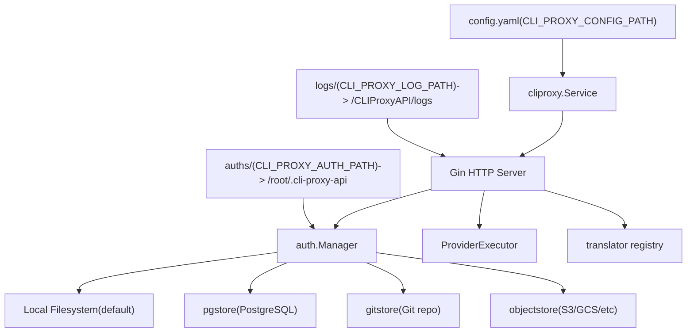
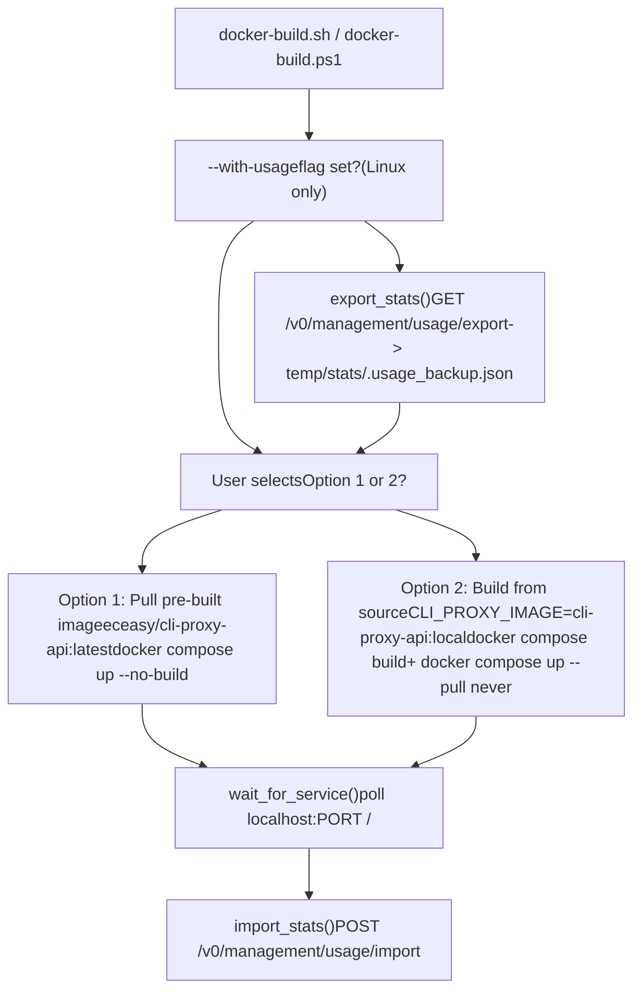

# Deployment Scenarios

Relevant source files

-   [.dockerignore](https://github.com/router-for-me/CLIProxyAPI/blob/c66cb0af/.dockerignore)
-   [.gitignore](https://github.com/router-for-me/CLIProxyAPI/blob/c66cb0af/.gitignore)
-   [auths/.gitkeep](https://github.com/router-for-me/CLIProxyAPI/blob/c66cb0af/auths/.gitkeep)
-   [docker-build.ps1](https://github.com/router-for-me/CLIProxyAPI/blob/c66cb0af/docker-build.ps1)
-   [docker-build.sh](https://github.com/router-for-me/CLIProxyAPI/blob/c66cb0af/docker-build.sh)
-   [docker-compose.yml](https://github.com/router-for-me/CLIProxyAPI/blob/c66cb0af/docker-compose.yml)

This section covers practical deployment guides for running CLIProxyAPI in different environments and at different scales. It covers the supported deployment modes, the infrastructure components involved, and helps you select the right topology for your situation.

For configuration file settings applicable to all deployments, see [Configuration Guide](/router-for-me/CLIProxyAPI/5-configuration-guide). For storage backend specifics, see [Storage Backend Options](/router-for-me/CLIProxyAPI/5.2-storage-backend-options). For the Go SDK-based programmatic deployment, see [Using the Go SDK](/router-for-me/CLIProxyAPI/9.1-using-the-go-sdk).

---

## Deployment Modes

CLIProxyAPI supports three primary deployment topologies:

| Deployment Mode | State Storage | Instances | Best For |
| --- | --- | --- | --- |
| Single-Server | Local filesystem | 1 | Personal use, small teams |
| Cloud-Native | External (PostgreSQL, Git, Object Storage) | 1 | Cloud environments, managed infra |
| High Availability | External (shared) | Multiple | Large teams, high request volume |

The choice of topology is driven primarily by two factors: **how many instances** you need to run, and **where auth credentials and usage statistics are stored**. External storage backends (PostgreSQL, Git, object storage) are required when running more than one instance, because auth tokens and configuration must be accessible to all nodes.

Sources: [.gitignore16-19](https://github.com/router-for-me/CLIProxyAPI/blob/c66cb0af/.gitignore#L16-L19) [docker-compose.yml1-28](https://github.com/router-for-me/CLIProxyAPI/blob/c66cb0af/docker-compose.yml#L1-L28)

---

## Core Infrastructure Components

Regardless of topology, every CLIProxyAPI deployment shares the same internal components. The diagram below maps conceptual components to their concrete code-level representations.

**Diagram: CLIProxyAPI Deployment Component Map**

Sources: [docker-compose.yml24-27](https://github.com/router-for-me/CLIProxyAPI/blob/c66cb0af/docker-compose.yml#L24-L27) [.gitignore16-19](https://github.com/router-for-me/CLIProxyAPI/blob/c66cb0af/.gitignore#L16-L19)

---

## Exposed Ports

All ports are declared in `docker-compose.yml` and exposed on the host. Different AI CLI tools connect to different ports.

| Host Port | Container Port | Protocol / Purpose |
| --- | --- | --- |
| `8317` | `8317` | Primary API port (default, configurable via `port` in config.yaml) |
| `8085` | `8085` | Gemini CLI / AI Studio compatible endpoint |
| `1455` | `1455` | Claude API endpoint |
| `54545` | `54545` | Codex / OpenAI Responses endpoint |
| `51121` | `51121` | Amp CLI control plane proxy |
| `11451` | `11451` | Additional provider endpoint |

Sources: [docker-compose.yml17-23](https://github.com/router-for-me/CLIProxyAPI/blob/c66cb0af/docker-compose.yml#L17-L23)

---

## Volume Mounts and Path Overrides

Three directories are mounted into the container and can be overridden via environment variables before running `docker compose`.

| Environment Variable | Default Value | Mount Target in Container |
| --- | --- | --- |
| `CLI_PROXY_CONFIG_PATH` | `./config.yaml` | `/CLIProxyAPI/config.yaml` |
| `CLI_PROXY_AUTH_PATH` | `./auths` | `/root/.cli-proxy-api` |
| `CLI_PROXY_LOG_PATH` | `./logs` | `/CLIProxyAPI/logs` |

The `auths/` directory (mounted to `/root/.cli-proxy-api`) holds OAuth token files and API key credential files managed by `auth.Manager`. The `config.yaml` is read at startup and monitored for changes by the file watcher (see [Hot Reload and Configuration Updates](/router-for-me/CLIProxyAPI/3.7-hot-reload-and-configuration-updates)).

The `DEPLOY` environment variable [docker-compose.yml16](https://github.com/router-for-me/CLIProxyAPI/blob/c66cb0af/docker-compose.yml#L16-L16) is passed into the container to select a deployment profile when using cloud-native or HA configurations.

Sources: [docker-compose.yml24-27](https://github.com/router-for-me/CLIProxyAPI/blob/c66cb0af/docker-compose.yml#L24-L27) [.gitignore25-26](https://github.com/router-for-me/CLIProxyAPI/blob/c66cb0af/.gitignore#L25-L26)

---

## Build and Run Scripts

Two build scripts are provided to simplify the deploy cycle.

**Diagram: docker-build.sh and docker-build.ps1 Execution Flow**

The `--with-usage` flag on `docker-build.sh` preserves usage statistics across container rebuilds by exporting stats to `temp/stats/.usage_backup.json` before the rebuild and re-importing via the management API after the new container starts. The management API key is read from `temp/stats/.api_secret` (created on first use). This mechanism is only available in `docker-build.sh` (Linux/macOS); the Windows `docker-build.ps1` does not include the usage preservation logic.

Sources: [docker-build.sh1-180](https://github.com/router-for-me/CLIProxyAPI/blob/c66cb0af/docker-build.sh#L1-L180) [docker-build.ps11-53](https://github.com/router-for-me/CLIProxyAPI/blob/c66cb0af/docker-build.ps1#L1-L53)

---

## Deployment Scenario Comparison

The following diagram shows how the three deployment scenarios differ in their use of storage and service topology.

**Diagram: Deployment Topology Comparison**

```mermaid
flowchart TD
    ha_lb["Load Balancer"]
    ha_p1["cli-proxy-apiInstance 1"]
    ha_p2["cli-proxy-apiInstance 2"]
    ha_shared["Shared External Storage(pgstore / gitstore / objectstore)"]
    cn_client["AI CLI Client"]
    cn_proxy["cli-proxy-api(Cloud Container)"]
    cn_ext["External Storage(pgstore / gitstore / objectstore)"]
    ss_client["AI CLI Client"]
    ss_proxy["cli-proxy-api(Docker Compose)"]
    ss_fs["Local auths/Local logs/"]

    ha --> lb_ha_p1
    ha --> lb_ha_p2
    ha --> p1_ha_shared
    ha --> p2_ha_shared
    cn --> client_cn_proxy
    cn --> proxy_cn_ext
    ss --> client_ss_proxy
    ss --> proxy_ss_fs
```

Sources: [.gitignore16-19](https://github.com/router-for-me/CLIProxyAPI/blob/c66cb0af/.gitignore#L16-L19) [docker-compose.yml1-28](https://github.com/router-for-me/CLIProxyAPI/blob/c66cb0af/docker-compose.yml#L1-L28)

---

## Choosing a Deployment Scenario

Use this table to select the appropriate sub-page based on your requirements.

| Requirement | Recommended Scenario |
| --- | --- |
| Personal use or single developer | [Single-Server Deployment](/router-for-me/CLIProxyAPI/10.1-single-server-deployment) |
| Running in AWS/GCP/Azure with managed DB | [Cloud-Native Deployment](/router-for-me/CLIProxyAPI/10.2-cloud-native-deployment) |
| Multiple users, high availability needed | [High Availability and Scaling](/router-for-me/CLIProxyAPI/10.3-high-availability-and-scaling) |
| Need to share auth tokens across instances | [High Availability and Scaling](/router-for-me/CLIProxyAPI/10.3-high-availability-and-scaling) |
| Simplest possible setup | [Single-Server Deployment](/router-for-me/CLIProxyAPI/10.1-single-server-deployment) |
| Using PostgreSQL or object storage | [Cloud-Native Deployment](/router-for-me/CLIProxyAPI/10.2-cloud-native-deployment) or [HA](/router-for-me/CLIProxyAPI/10.3-high-availability-and-scaling) |

External storage backends (covered in [Storage Backend Options](/router-for-me/CLIProxyAPI/5.2-storage-backend-options)) are the key enabler for both cloud-native and HA deployments. The `Builder` API (covered in [Using the Go SDK](/router-for-me/CLIProxyAPI/9.1-using-the-go-sdk)) can be used to programmatically configure deployments without `config.yaml` when embedding CLIProxyAPI in a larger Go application.
