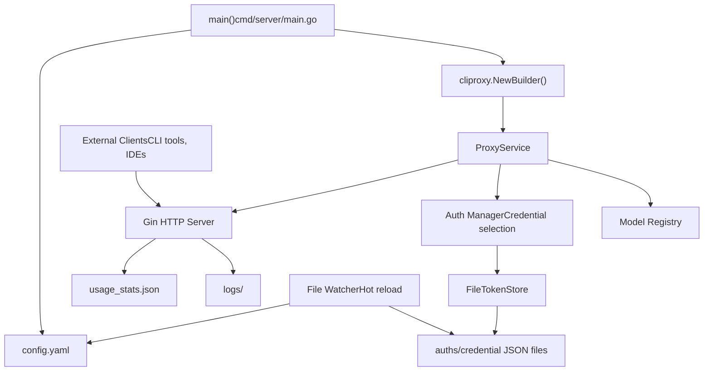
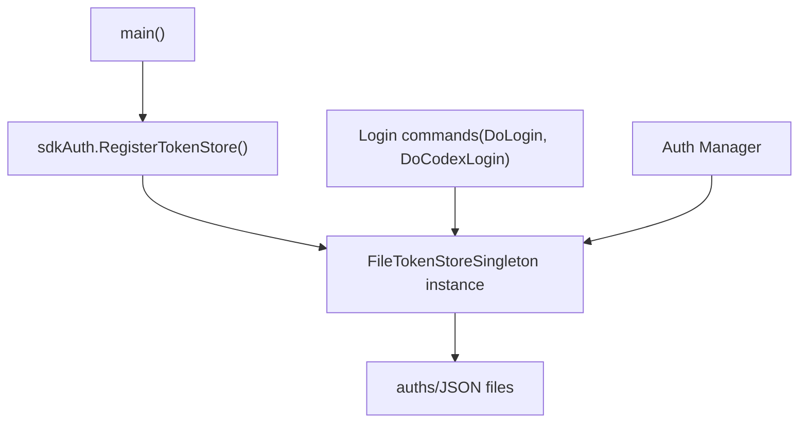
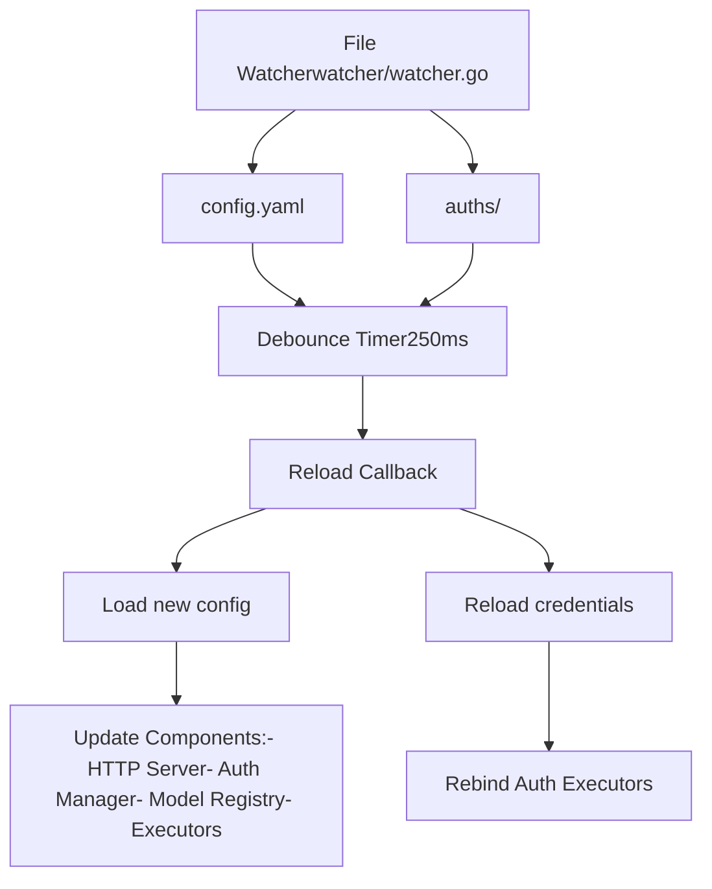

# Single-Server Deployment

Relevant source files

-   [.dockerignore](https://github.com/router-for-me/CLIProxyAPI/blob/c66cb0af/.dockerignore)
-   [.gitignore](https://github.com/router-for-me/CLIProxyAPI/blob/c66cb0af/.gitignore)
-   [auths/.gitkeep](https://github.com/router-for-me/CLIProxyAPI/blob/c66cb0af/auths/.gitkeep)
-   [cmd/server/main.go](https://github.com/router-for-me/CLIProxyAPI/blob/c66cb0af/cmd/server/main.go)
-   [docker-build.ps1](https://github.com/router-for-me/CLIProxyAPI/blob/c66cb0af/docker-build.ps1)
-   [docker-build.sh](https://github.com/router-for-me/CLIProxyAPI/blob/c66cb0af/docker-build.sh)
-   [docker-compose.yml](https://github.com/router-for-me/CLIProxyAPI/blob/c66cb0af/docker-compose.yml)
-   [go.mod](https://github.com/router-for-me/CLIProxyAPI/blob/c66cb0af/go.mod)
-   [go.sum](https://github.com/router-for-me/CLIProxyAPI/blob/c66cb0af/go.sum)
-   [internal/api/handlers/management/logs.go](https://github.com/router-for-me/CLIProxyAPI/blob/c66cb0af/internal/api/handlers/management/logs.go)
-   [internal/managementasset/updater.go](https://github.com/router-for-me/CLIProxyAPI/blob/c66cb0af/internal/managementasset/updater.go)
-   [internal/store/gitstore.go](https://github.com/router-for-me/CLIProxyAPI/blob/c66cb0af/internal/store/gitstore.go)
-   [internal/store/postgresstore.go](https://github.com/router-for-me/CLIProxyAPI/blob/c66cb0af/internal/store/postgresstore.go)

## Purpose and Scope

This document covers deploying CLIProxyAPI on a single server using Docker Compose with local file-based storage. It walks through the Docker Compose configuration, volume mount paths, the provided build scripts (`docker-build.sh` and `docker-build.ps1`), and preserving usage statistics across container rebuilds.

For cloud-based deployments with external storage backends, see page 10.2. For high-availability configurations with load balancing, see page 10.3.

## Deployment Architecture

A single-server deployment uses the local file system for all storage needs. The server process handles all HTTP requests, manages credentials in local files, and stores configuration and usage statistics locally.


**Sources:** [cmd/server/main.go1-486](https://github.com/router-for-me/CLIProxyAPI/blob/c66cb0af/cmd/server/main.go#L1-L486) [internal/cmd/run.go1-71](https://github.com/router-for-me/CLIProxyAPI/blob/c66cb0af/internal/cmd/run.go#L1-L71)

## File System Layout

The single-server deployment organizes files in the following structure:

| Path | Purpose | Created By |
| --- | --- | --- |
| `config.yaml` | Main configuration file | User/bootstrap |
| `config.example.yaml` | Configuration template | Repository |
| `auths/` | Directory containing credential JSON files | OAuth flows or manual creation |
| `auths/*.json` | Individual credential files (e.g., `gemini_user@example.com.json`) | Login commands |
| `usage_stats.json` | Token usage tracking (optional) | Runtime when enabled |
| `logs/` | Log files (optional) | Runtime if file logging configured |
| `.env` | Environment variables (optional) | User |

The working directory is determined at startup and all relative paths resolve from there.

**Sources:** [cmd/server/main.go144-156](https://github.com/router-for-me/CLIProxyAPI/blob/c66cb0af/cmd/server/main.go#L144-L156) [cmd/server/main.go369-387](https://github.com/router-for-me/CLIProxyAPI/blob/c66cb0af/cmd/server/main.go#L369-L387)

## Prerequisites

Before deploying, ensure the following requirements are met:

### System Requirements

-   **Operating System:** Linux, macOS, or Windows
-   **Go Runtime:** Go 1.21+ (if building from source)
-   **Network:** Outbound HTTPS access to AI provider APIs
-   **Ports:** One available TCP port (default 8080, configurable)

### Binary Installation

Download the appropriate binary for your platform from the releases page or build from source:

```
# Clone repositorygit clone https://github.com/router-for-me/CLIProxyAPI.gitcd CLIProxyAPI # Build binarygo build -o cliproxyapi ./cmd/server
```
The resulting `cliproxyapi` binary is self-contained and can be moved to any location.

**Sources:** [README.md59-61](https://github.com/router-for-me/CLIProxyAPI/blob/c66cb0af/README.md#L59-L61) [cmd/server/main.go1-4](https://github.com/router-for-me/CLIProxyAPI/blob/c66cb0af/cmd/server/main.go#L1-L4)

## Initialization Sequence

The server follows a specific initialization sequence on startup:

> **[Mermaid sequence]**
> *(图表结构无法解析)*

**Sources:** [cmd/server/main.go53-486](https://github.com/router-for-me/CLIProxyAPI/blob/c66cb0af/cmd/server/main.go#L53-L486) [internal/cmd/run.go27-56](https://github.com/router-for-me/CLIProxyAPI/blob/c66cb0af/internal/cmd/run.go#L27-L56)

## Initial Configuration

### Creating the Configuration File

If `config.yaml` does not exist, create it from the example template:

```
cp config.example.yaml config.yaml
```
Edit `config.yaml` to set basic server parameters:

```
port: 8080                    # HTTP porthost: "0.0.0.0"               # Bind address (use 127.0.0.1 for localhost-only)auth_dir: "./auths"           # Directory for credential fileslog_level: "info"             # Logging verbosity: debug, info, warn, errorusage_statistics_enabled: true # Track token usage
```
The server reads this configuration on startup. The configuration file is monitored for changes and automatically reloaded without requiring a restart.

### Environment Variables

Alternatively, use environment variables by creating a `.env` file in the working directory:

```
# .env filePORT=8080HOST=0.0.0.0AUTH_DIR=./authsLOG_LEVEL=info
```
The server loads `.env` automatically on startup if present.

**Sources:** [cmd/server/main.go150-155](https://github.com/router-for-me/CLIProxyAPI/blob/c66cb0af/cmd/server/main.go#L150-L155) [cmd/server/main.go369-387](https://github.com/router-for-me/CLIProxyAPI/blob/c66cb0af/cmd/server/main.go#L369-L387)

### Configuration Loading Priority

The configuration system follows this precedence:

1.  Command-line flags (`--config`)
2.  Postgres store (if `PGSTORE_DSN` environment variable set)
3.  Object store (if `OBJECTSTORE_ENDPOINT` environment variable set)
4.  Git store (if `GITSTORE_GIT_URL` environment variable set)
5.  Local file (`config.yaml` in working directory)

For single-server deployment, use option 5 (local file).

**Sources:** [cmd/server/main.go168-380](https://github.com/router-for-me/CLIProxyAPI/blob/c66cb0af/cmd/server/main.go#L168-L380)

## Starting the Service

### Basic Startup

Start the server with default settings:

```
./cliproxyapi
```
The server will:

1.  Load `config.yaml` from the current directory
2.  Initialize the FileTokenStore pointing to `./auths`
3.  Start the HTTP server on the configured port
4.  Begin watching for configuration changes

Expected output:

```
CLIProxyAPI Version: <version>, Commit: <commit>, BuiltAt: <date>
INFO[0000] CLIProxyAPI Version: <version>, Commit: <commit>, BuiltAt: <date>
INFO[0000] Listening on 0.0.0.0:8080
```
### Startup with Custom Configuration

Specify a custom configuration file location:

```
./cliproxyapi --config /path/to/config.yaml
```
The `--config` flag overrides the default configuration path.

### Cloud Deploy Mode

If the environment variable `DEPLOY=cloud` is set and no valid configuration exists, the server enters standby mode:

```
export DEPLOY=cloud./cliproxyapi
```
Output:

```
INFO[0000] Cloud deploy mode: No config found; standing by for configuration. API server is not started. Press Ctrl+C to exit.
```
In this mode, the server waits for a valid configuration to be provided before starting the HTTP service. This is useful for containerized deployments where configuration is injected post-startup.

**Sources:** [cmd/server/main.go219-223](https://github.com/router-for-me/CLIProxyAPI/blob/c66cb0af/cmd/server/main.go#L219-L223) [cmd/server/main.go389-408](https://github.com/router-for-me/CLIProxyAPI/blob/c66cb0af/cmd/server/main.go#L389-L408) [internal/cmd/run.go58-70](https://github.com/router-for-me/CLIProxyAPI/blob/c66cb0af/internal/cmd/run.go#L58-L70)

## Authentication Setup

After starting the server, configure authentication for AI providers. The single-server deployment uses the FileTokenStore, which saves credentials as JSON files in the `auth_dir`.

### File-Based Token Store Registration

The FileTokenStore is registered as the global token store during initialization:


**Sources:** [cmd/server/main.go437-445](https://github.com/router-for-me/CLIProxyAPI/blob/c66cb0af/cmd/server/main.go#L437-L445)

### Authentication Flow for Providers

Each provider has a dedicated login command that executes the OAuth flow and saves credentials to the FileTokenStore:

> **[Mermaid sequence]**
> *(图表结构无法解析)*

**Sources:** [internal/cmd/login.go51-183](https://github.com/router-for-me/CLIProxyAPI/blob/c66cb0af/internal/cmd/login.go#L51-L183) [cmd/server/main.go450-475](https://github.com/router-for-me/CLIProxyAPI/blob/c66cb0af/cmd/server/main.go#L450-L475)

### Provider-Specific Login Commands

| Provider | Command | Output File Pattern |
| --- | --- | --- |
| Google Gemini | `--login` | `gemini_<email>_<project_id>.json` |
| OpenAI Codex | `--codex-login` | `codex_<email>.json` |
| Claude | `--claude-login` | `claude_<email>.json` |
| Qwen | `--qwen-login` | `qwen_<email>.json` |
| iFlow | `--iflow-login` | `iflow_<email>.json` |
| Antigravity | `--antigravity-login` | `antigravity_<email>.json` |
| Kimi | `--kimi-login` | `kimi_<email>.json` |

### Example: Google Gemini Login

```
# Interactive login with project selection./cliproxyapi --login # Login with specific project ID./cliproxyapi --login --project_id my-project-123 # Login without opening browser (displays URL to open manually)./cliproxyapi --login --no-browser
```
The login process:

1.  Opens browser to Google OAuth consent page
2.  Prompts for project selection from available GCP projects
3.  Performs Gemini CLI onboarding for the selected project
4.  Saves credentials to `auths/gemini_user@example.com_my-project-123.json`

**Sources:** [internal/cmd/login.go51-183](https://github.com/router-for-me/CLIProxyAPI/blob/c66cb0af/internal/cmd/login.go#L51-L183) [cmd/server/main.go455-457](https://github.com/router-for-me/CLIProxyAPI/blob/c66cb0af/cmd/server/main.go#L455-L457)

### Vertex AI Service Account Import

For Vertex AI, import a service account key instead of using OAuth:

```
./cliproxyapi --vertex-import /path/to/service-account-key.json
```
This command copies the service account JSON to the `auths/` directory with the appropriate naming convention.

**Sources:** [cmd/server/main.go452-454](https://github.com/router-for-me/CLIProxyAPI/blob/c66cb0af/cmd/server/main.go#L452-L454)

### Multiple Accounts

To add multiple accounts for the same provider, run the login command multiple times. Each account is saved as a separate JSON file. The Auth Manager will use round-robin or fill-first strategy (configurable in `config.yaml`) to distribute requests across accounts.

Example with multiple Gemini accounts:

```
auths/
├── gemini_user1@example.com_project-a.json
├── gemini_user2@example.com_project-b.json
└── gemini_user3@example.com_project-c.json
```
**Sources:** [README.md47-56](https://github.com/router-for-me/CLIProxyAPI/blob/c66cb0af/README.md#L47-L56)

## Runtime File Watching and Hot Reload

The single-server deployment includes a file watcher that monitors for changes:


Changes to `config.yaml` or files in `auths/` are automatically detected and applied without restarting the server. The debounce timer prevents excessive reloads during rapid successive changes (e.g., during atomic file writes).

**Sources:** Based on system architecture diagrams, Diagram 4 "Configuration Management and Hot Reload System"

## Service Verification

### Health Check

Verify the server is running:

```
curl http://localhost:8080/v1/models
```
Expected response:

```
{  "object": "list",  "data": [...]}
```
This endpoint lists all available models based on registered credentials.

### Check Registered Models

If authentication files are present in `auths/`, the models endpoint will list available models. If empty, only statically-defined models appear, but API calls will fail without valid credentials.

### Test API Request

Send a test completion request:

```
curl http://localhost:8080/v1/chat/completions \  -H "Content-Type: application/json" \  -d '{    "model": "gemini-2.0-flash-exp",    "messages": [{"role": "user", "content": "Hello"}]  }'
```
A successful response indicates the system is fully operational.

## Service Management

### Graceful Shutdown

The server handles `SIGINT` and `SIGTERM` signals for graceful shutdown:

```
# Send interrupt signal (Ctrl+C in terminal)kill -INT <pid> # Or termination signalkill -TERM <pid>
```
The shutdown process:

1.  Stops accepting new HTTP connections
2.  Waits for in-flight requests to complete
3.  Closes all persistent connections
4.  Exits cleanly

**Sources:** [internal/cmd/run.go33-34](https://github.com/router-for-me/CLIProxyAPI/blob/c66cb0af/internal/cmd/run.go#L33-L34)

### Viewing Logs

Logs are written to `stdout` by default. Configure file-based logging in `config.yaml`:

```
log_output: "./logs/cliproxyapi.log"
```
Log levels: `debug`, `info`, `warn`, `error`

### Usage Statistics

If `usage_statistics_enabled: true` in configuration, token usage is tracked in `usage_stats.json`. This file is updated in real-time as requests are processed.

View usage data:

```
cat usage_stats.json
```
Or use the Management API endpoint:

```
curl http://localhost:8080/v0/management/usage-stats/export
```
**Sources:** [cmd/server/main.go409-410](https://github.com/router-for-me/CLIProxyAPI/blob/c66cb0af/cmd/server/main.go#L409-L410)

## Directory Permissions

Ensure the process has appropriate file system permissions:

| Path | Required Permissions | Purpose |
| --- | --- | --- |
| `config.yaml` | Read/Write | Configuration loading and updates |
| `auths/` | Read/Write | Credential storage and updates |
| `usage_stats.json` | Read/Write | Usage tracking (if enabled) |
| `logs/` | Write | Log file output (if configured) |
| Working directory | Read/Write | General operations |

The server runs under the invoking user's permissions. Avoid running as root unless necessary.

## Troubleshooting

### Configuration Not Loading

**Symptom:** Server starts but config.yaml changes are not reflected.

**Solution:** Verify the configuration file path:

```
./cliproxyapi --config $(pwd)/config.yaml
```
Check file watcher is active in logs (debug level).

### Authentication Files Not Found

**Symptom:** API requests return authentication errors despite running login commands.

**Solution:** Verify `auth_dir` in `config.yaml` matches the location where login commands save files:

```
ls -la ./auths/
```
Ensure the path is absolute or correctly relative to the working directory.

### Port Already in Use

**Symptom:** `bind: address already in use` error on startup.

**Solution:** Change the port in `config.yaml`:

```
port: 8081
```
Or identify and stop the conflicting process:

```
lsof -i :8080
```
## Limitations

Single-server deployment has these limitations:

1.  **Single Point of Failure:** If the server process crashes or the host becomes unavailable, the service is completely down.
2.  **Scalability:** All requests are handled by one process, limiting throughput.
3.  **File System Dependency:** Configuration and credentials are stored locally, making migration to another host require manual file transfers.
4.  **No Built-in Backup:** Authentication tokens and configuration must be backed up manually.
5.  **Localhost Management Access:** Management API endpoints are restricted to localhost by default for security.

For production deployments requiring high availability, consider [High Availability and Scaling](/router-for-me/CLIProxyAPI/10.3-high-availability-and-scaling).

## Next Steps

-   Configure provider-specific settings in `config.yaml` (see [Configuration File Structure](/router-for-me/CLIProxyAPI/5.1-configuration-file-structure))
-   Set up payload manipulation rules (see [Payload Configuration Rules](/router-for-me/CLIProxyAPI/5.4-payload-configuration-rules))
-   Configure model mappings and exclusions (see [Model Mapping and Exclusion](/router-for-me/CLIProxyAPI/8.2-model-mapping-and-exclusion))
-   Enable request logging for debugging (see [Request and Response Logging](/router-for-me/CLIProxyAPI/8.4-request-and-response-logging))
-   Explore the Management API (see [Management API](/router-for-me/CLIProxyAPI/4.4-management-api))

**Sources:** [README.md1-170](https://github.com/router-for-me/CLIProxyAPI/blob/c66cb0af/README.md#L1-L170) [cmd/server/main.go1-486](https://github.com/router-for-me/CLIProxyAPI/blob/c66cb0af/cmd/server/main.go#L1-L486) [internal/cmd/run.go1-71](https://github.com/router-for-me/CLIProxyAPI/blob/c66cb0af/internal/cmd/run.go#L1-L71)
