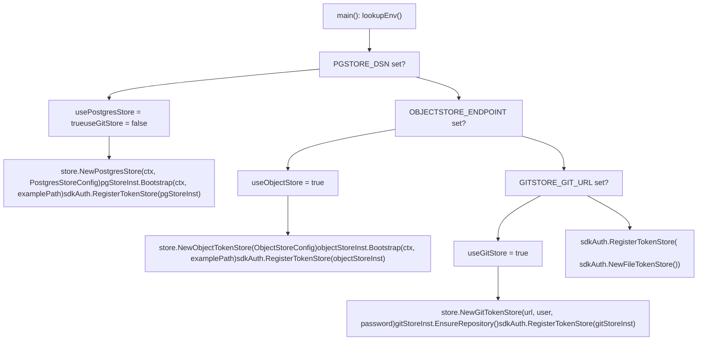

# Cloud-Native Deployment

Relevant source files

-   [.dockerignore](https://github.com/router-for-me/CLIProxyAPI/blob/c66cb0af/.dockerignore)
-   [.env.example](https://github.com/router-for-me/CLIProxyAPI/blob/c66cb0af/.env.example)
-   [.gitignore](https://github.com/router-for-me/CLIProxyAPI/blob/c66cb0af/.gitignore)
-   [auths/.gitkeep](https://github.com/router-for-me/CLIProxyAPI/blob/c66cb0af/auths/.gitkeep)
-   [cmd/server/main.go](https://github.com/router-for-me/CLIProxyAPI/blob/c66cb0af/cmd/server/main.go)
-   [docker-build.ps1](https://github.com/router-for-me/CLIProxyAPI/blob/c66cb0af/docker-build.ps1)
-   [docker-build.sh](https://github.com/router-for-me/CLIProxyAPI/blob/c66cb0af/docker-build.sh)
-   [docker-compose.yml](https://github.com/router-for-me/CLIProxyAPI/blob/c66cb0af/docker-compose.yml)
-   [go.mod](https://github.com/router-for-me/CLIProxyAPI/blob/c66cb0af/go.mod)
-   [go.sum](https://github.com/router-for-me/CLIProxyAPI/blob/c66cb0af/go.sum)
-   [internal/api/handlers/management/logs.go](https://github.com/router-for-me/CLIProxyAPI/blob/c66cb0af/internal/api/handlers/management/logs.go)
-   [internal/managementasset/updater.go](https://github.com/router-for-me/CLIProxyAPI/blob/c66cb0af/internal/managementasset/updater.go)
-   [internal/store/gitstore.go](https://github.com/router-for-me/CLIProxyAPI/blob/c66cb0af/internal/store/gitstore.go)
-   [internal/store/objectstore.go](https://github.com/router-for-me/CLIProxyAPI/blob/c66cb0af/internal/store/objectstore.go)
-   [internal/store/postgresstore.go](https://github.com/router-for-me/CLIProxyAPI/blob/c66cb0af/internal/store/postgresstore.go)

## Purpose and Scope

This page covers deploying CLIProxyAPI in cloud environments that require externalized, persistent state. It describes the `DEPLOY=cloud` startup mode, the three external storage backends (PostgreSQL, Git repository, and S3-compatible object storage), and how to configure each via environment variables.

For single-server Docker Compose setup, see [Single-Server Deployment](/router-for-me/CLIProxyAPI/10.1-single-server-deployment). For running multiple CLIProxyAPI instances with shared state, see [High Availability and Scaling](/router-for-me/CLIProxyAPI/10.3-high-availability-and-scaling). For a reference of all storage backend options and their trade-offs, see [Storage Backend Options](/router-for-me/CLIProxyAPI/5.2-storage-backend-options).

---

## Cloud Deploy Mode

Setting `DEPLOY=cloud` in the environment changes startup behavior. When this mode is active and no valid `config.yaml` is found (either locally or via the configured remote store), the server does not exit. Instead, it calls `cmd.WaitForCloudDeploy()` and blocks until an OS shutdown signal is received. This keeps the container alive while an operator provides configuration through the management API.

**Cloud Deploy Mode Startup Flow**

Sources: [cmd/server/main.go228-416](https://github.com/router-for-me/CLIProxyAPI/blob/c66cb0af/cmd/server/main.go#L228-L416) [cmd/server/main.go486-570](https://github.com/router-for-me/CLIProxyAPI/blob/c66cb0af/cmd/server/main.go#L486-L570)

The validity check considers the config file missing if:

-   The file path does not exist on disk
-   The path points to a directory
-   The file exists but `cfg.Port == 0` (file is empty or unparseable)

---

## Storage Backend Selection

Exactly one token store is active at runtime. The startup code in `main()` checks environment variables in a fixed priority order and registers the selected store with `sdkAuth.RegisterTokenStore()`. Setting `PGSTORE_DSN` also sets `useGitStore = false` explicitly, disabling Git even if `GITSTORE_GIT_URL` is also set.

**Storage Backend Selection — Code-Level View**


Sources: [cmd/server/main.go176-453](https://github.com/router-for-me/CLIProxyAPI/blob/c66cb0af/cmd/server/main.go#L176-L453)

| Priority | Activated by | Type |
| --- | --- | --- |
| 1 (highest) | `PGSTORE_DSN` | `*store.PostgresStore` |
| 2 | `OBJECTSTORE_ENDPOINT` | `*store.ObjectTokenStore` |
| 3 | `GITSTORE_GIT_URL` | `*store.GitTokenStore` |
| 4 (default) | *(none)* | `sdkAuth.FileTokenStore` |

---

## PostgreSQL Backend

`PostgresStore` in `internal/store/postgresstore.go` stores configuration YAML and auth tokens in two database tables while mirroring everything to a local spool directory so the rest of the application can use standard file-based workflows.

### Environment Variables

| Variable | Alias | Required | Description |
| --- | --- | --- | --- |
| `PGSTORE_DSN` | `pgstore_dsn` | Yes | PostgreSQL connection string |
| `PGSTORE_SCHEMA` | `pgstore_schema` | No | Database schema (defaults to `public`) |
| `PGSTORE_LOCAL_PATH` | `pgstore_local_path` | No | Root for local spool (defaults to working dir) |

### Database Schema

`Bootstrap()` calls `EnsureSchema()`, which creates the following tables (using `CREATE TABLE IF NOT EXISTS`):

| Table constant | Default name | Primary key | Data column |
| --- | --- | --- | --- |
| `defaultConfigTable` | `config_store` | `id TEXT` | `content TEXT` |
| `defaultAuthTable` | `auth_store` | `id TEXT` | `content JSONB` |

Both tables include `created_at TIMESTAMPTZ` and `updated_at TIMESTAMPTZ`. Upserts use `ON CONFLICT (id) DO UPDATE SET content = EXCLUDED.content`.

Sources: [internal/store/postgresstore.go22-144](https://github.com/router-for-me/CLIProxyAPI/blob/c66cb0af/internal/store/postgresstore.go#L22-L144)

### Initialization Sequence

**`PostgresStore` Bootstrap Sequence**

Sources: [internal/store/postgresstore.go49-158](https://github.com/router-for-me/CLIProxyAPI/blob/c66cb0af/internal/store/postgresstore.go#L49-L158) [internal/store/postgresstore.go394-476](https://github.com/router-for-me/CLIProxyAPI/blob/c66cb0af/internal/store/postgresstore.go#L394-L476)

### Local Spool Layout

```
{PGSTORE_LOCAL_PATH}/pgstore/
├── config/
│   └── config.yaml          ← mirrored from config_store table
└── auths/
    └── *.json               ← mirrored from auth_store table
```
---

## Git Backend

`GitTokenStore` in `internal/store/gitstore.go` uses a remote Git repository to persist config and auth files. On every token save, the file is committed and pushed to the remote.

### Environment Variables

| Variable | Alias | Required | Description |
| --- | --- | --- | --- |
| `GITSTORE_GIT_URL` | `gitstore_git_url` | Yes | Remote repository URL |
| `GITSTORE_GIT_USERNAME` | `gitstore_git_username` | No | Git username |
| `GITSTORE_GIT_TOKEN` | `gitstore_git_token` | No | Personal access token or password |
| `GITSTORE_LOCAL_PATH` | `gitstore_local_path` | No | Local clone root (defaults to working dir) |

> **Note:** `GITSTORE_GIT_TOKEN` is also used as a GitHub API bearer token when fetching the management panel asset from `github.com`, if `GITSTORE_GIT_URL` refers to a GitHub repository.

Sources: [internal/managementasset/updater.go336-339](https://github.com/router-for-me/CLIProxyAPI/blob/c66cb0af/internal/managementasset/updater.go#L336-L339)

### Repository Layout

```
{GITSTORE_LOCAL_PATH}/gitstore/
├── .git/
├── auths/
│   ├── .gitkeep
│   └── *.json               ← one file per auth credential
└── config/
    ├── .gitkeep
    └── config.yaml
```
### Initialization

`EnsureRepository()` performs the following logic:

1.  If `.git/` does not exist: clone via `git.PlainClone()`. If the remote is empty (`transport.ErrEmptyRemoteRepository`), initialize a fresh repository, create the `auths/` and `config/` directories, and push an initial commit.
2.  If `.git/` exists: open the repository and run `git pull`. Non-fatal pull errors (already up-to-date, unstaged changes, non-fast-forward) are silently ignored.

Each call to `Save()` ends with `commitAndPushLocked()`, producing one commit per credential update. `PersistAuthFiles()` and `PersistConfig()` follow the same pattern.

Sources: [internal/store/gitstore.go92-213](https://github.com/router-for-me/CLIProxyAPI/blob/c66cb0af/internal/store/gitstore.go#L92-L213) [internal/store/gitstore.go215-399](https://github.com/router-for-me/CLIProxyAPI/blob/c66cb0af/internal/store/gitstore.go#L215-L399)

---

## Object Storage Backend

`ObjectTokenStore` in `internal/store/objectstore.go` uses any S3-compatible service via the `minio-go/v7` client. Configuration and auth tokens are stored as objects in a single bucket.

### Environment Variables

| Variable | Alias | Required | Description |
| --- | --- | --- | --- |
| `OBJECTSTORE_ENDPOINT` | `objectstore_endpoint` | Yes | S3 endpoint URL |
| `OBJECTSTORE_ACCESS_KEY` | `objectstore_access_key` | Yes | Access key ID |
| `OBJECTSTORE_SECRET_KEY` | `objectstore_secret_key` | Yes | Secret access key |
| `OBJECTSTORE_BUCKET` | `objectstore_bucket` | Yes | Bucket name |
| `OBJECTSTORE_LOCAL_PATH` | `objectstore_local_path` | No | Local mirror root (defaults to working dir) |

The endpoint accepts an `http://` or `https://` scheme prefix; the scheme determines whether SSL is enabled. If no scheme is provided, SSL defaults to enabled. Path-style bucket access is always used (`BucketLookupPath`).

Sources: [cmd/server/main.go275-303](https://github.com/router-for-me/CLIProxyAPI/blob/c66cb0af/cmd/server/main.go#L275-L303) [internal/store/objectstore.go95-110](https://github.com/router-for-me/CLIProxyAPI/blob/c66cb0af/internal/store/objectstore.go#L95-L110)

### Bucket Layout

| Object key | Contents |
| --- | --- |
| `config/config.yaml` | Configuration YAML |
| `auths/{relative}.json` | Auth token JSON files |

### Initialization Sequence

**`ObjectTokenStore` Bootstrap Sequence**

> **[Mermaid sequence]**
> *(图表结构无法解析)*

Sources: [internal/store/objectstore.go55-156](https://github.com/router-for-me/CLIProxyAPI/blob/c66cb0af/internal/store/objectstore.go#L55-L156) [internal/store/objectstore.go327-438](https://github.com/router-for-me/CLIProxyAPI/blob/c66cb0af/internal/store/objectstore.go#L327-L438)

> The auth sync deliberately avoids `os.RemoveAll()` on the local mirror directory. Wiping the directory triggers file-watcher delete events that would propagate as deletions back to the remote bucket.

Sources: [internal/store/objectstore.go388-395](https://github.com/router-for-me/CLIProxyAPI/blob/c66cb0af/internal/store/objectstore.go#L388-L395)

---

## Environment Variable Reference

All variables can be defined in a `.env` file at the working directory (loaded via `godotenv.Load()`) or as container environment variables. The repository provides `.env.example` as a commented template.

| Variable | Activates | Notes |
| --- | --- | --- |
| `DEPLOY` | Cloud deploy mode | Must be `cloud` |
| `PGSTORE_DSN` | PostgreSQL backend | Also disables Git backend |
| `PGSTORE_SCHEMA` | PostgreSQL backend | Optional |
| `PGSTORE_LOCAL_PATH` | PostgreSQL backend | Optional |
| `GITSTORE_GIT_URL` | Git backend |  |
| `GITSTORE_GIT_USERNAME` | Git backend | Optional |
| `GITSTORE_GIT_TOKEN` | Git backend | Also used for GitHub API auth in management asset updater |
| `GITSTORE_LOCAL_PATH` | Git backend | Optional |
| `OBJECTSTORE_ENDPOINT` | Object storage | Accepts `http://` or `https://` prefix |
| `OBJECTSTORE_ACCESS_KEY` | Object storage |  |
| `OBJECTSTORE_SECRET_KEY` | Object storage |  |
| `OBJECTSTORE_BUCKET` | Object storage |  |
| `OBJECTSTORE_LOCAL_PATH` | Object storage | Optional |
| `MANAGEMENT_STATIC_PATH` | Management panel | Overrides default static asset location |

Sources: [cmd/server/main.go176-232](https://github.com/router-for-me/CLIProxyAPI/blob/c66cb0af/cmd/server/main.go#L176-L232) [.env.example1-35](https://github.com/router-for-me/CLIProxyAPI/blob/c66cb0af/.env.example#L1-L35)

---

## Local Spool Directories

Each remote backend maintains a local mirror on disk. The application's file-based internals (file watcher, auth manager, config reload) operate against these mirrored paths without knowledge of the remote backend.

| Backend | Spool root | Config file | Auth directory |
| --- | --- | --- | --- |
| PostgreSQL | `{PGSTORE_LOCAL_PATH}/pgstore/` | `pgstore/config/config.yaml` | `pgstore/auths/` |
| Git | `{GITSTORE_LOCAL_PATH}/gitstore/` | `gitstore/config/config.yaml` | `gitstore/auths/` |
| Object Storage | `{OBJECTSTORE_LOCAL_PATH}/objectstore/` | `objectstore/config/config.yaml` | `objectstore/auths/` |

If the `*_LOCAL_PATH` variable is not set, the fallback is the path returned by `util.WritablePath()`, or the current working directory if that is also unavailable.

Sources: [cmd/server/main.go180-225](https://github.com/router-for-me/CLIProxyAPI/blob/c66cb0af/cmd/server/main.go#L180-L225) [internal/store/postgresstore.go62-100](https://github.com/router-for-me/CLIProxyAPI/blob/c66cb0af/internal/store/postgresstore.go#L62-L100) [internal/store/objectstore.go75-119](https://github.com/router-for-me/CLIProxyAPI/blob/c66cb0af/internal/store/objectstore.go#L75-L119)

---

## Docker Compose Configuration

The default `docker-compose.yml` passes `DEPLOY` from the host environment. For cloud deployments, add backend environment variables in the `environment` block, or uncomment and use the `env_file` directive:

```
services:  cli-proxy-api:    environment:      DEPLOY: ${DEPLOY:-}    # env_file:    #   - .env
```
When a remote storage backend is configured, the volume mounts for `config.yaml` and `auths/` are not needed — the backend supplies those paths internally. The log volume mount remains useful.

Sources: [docker-compose.yml1-28](https://github.com/router-for-me/CLIProxyAPI/blob/c66cb0af/docker-compose.yml#L1-L28)

---

## Management Panel Asset

`managementasset.StartAutoUpdater()` runs a background goroutine that downloads `management.html` on startup and checks for updates every 3 hours. In cloud environments the asset is written to `{writable_path}/static/management.html` by default. Set `MANAGEMENT_STATIC_PATH` to override this location (can point to either the file or its parent directory).

Sources: [internal/managementasset/updater.go57-107](https://github.com/router-for-me/CLIProxyAPI/blob/c66cb0af/internal/managementasset/updater.go#L57-L107) [internal/managementasset/updater.go128-173](https://github.com/router-for-me/CLIProxyAPI/blob/c66cb0af/internal/managementasset/updater.go#L128-L173)

---

## Multi-Instance Deployment

When multiple CLIProxyAPI instances point to the same PostgreSQL database or the same object storage bucket, they share config and auth token state. This enables horizontal scaling. See [High Availability and Scaling](/router-for-me/CLIProxyAPI/10.3-high-availability-and-scaling) for guidance on load balancing, replica coordination, and the `Builder` SDK API for programmatic deployment.
