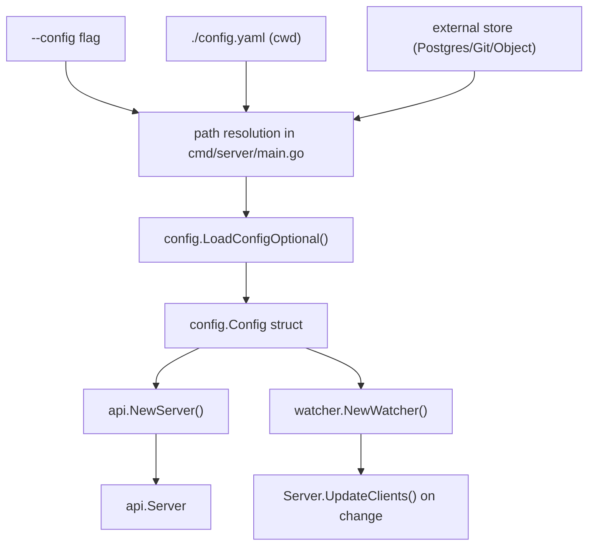
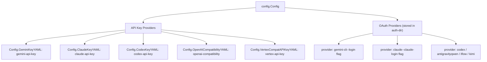

# Initial Configuration

Relevant source files

-   [cmd/server/main.go](https://github.com/router-for-me/CLIProxyAPI/blob/c66cb0af/cmd/server/main.go)
-   [config.example.yaml](https://github.com/router-for-me/CLIProxyAPI/blob/c66cb0af/config.example.yaml)
-   [go.mod](https://github.com/router-for-me/CLIProxyAPI/blob/c66cb0af/go.mod)
-   [go.sum](https://github.com/router-for-me/CLIProxyAPI/blob/c66cb0af/go.sum)
-   [internal/api/handlers/management/config\_basic.go](https://github.com/router-for-me/CLIProxyAPI/blob/c66cb0af/internal/api/handlers/management/config_basic.go)
-   [internal/api/handlers/management/config\_lists.go](https://github.com/router-for-me/CLIProxyAPI/blob/c66cb0af/internal/api/handlers/management/config_lists.go)
-   [internal/api/handlers/management/logs.go](https://github.com/router-for-me/CLIProxyAPI/blob/c66cb0af/internal/api/handlers/management/logs.go)
-   [internal/api/server.go](https://github.com/router-for-me/CLIProxyAPI/blob/c66cb0af/internal/api/server.go)
-   [internal/config/config.go](https://github.com/router-for-me/CLIProxyAPI/blob/c66cb0af/internal/config/config.go)
-   [internal/managementasset/updater.go](https://github.com/router-for-me/CLIProxyAPI/blob/c66cb0af/internal/managementasset/updater.go)
-   [internal/store/gitstore.go](https://github.com/router-for-me/CLIProxyAPI/blob/c66cb0af/internal/store/gitstore.go)
-   [internal/store/postgresstore.go](https://github.com/router-for-me/CLIProxyAPI/blob/c66cb0af/internal/store/postgresstore.go)
-   [internal/watcher/watcher.go](https://github.com/router-for-me/CLIProxyAPI/blob/c66cb0af/internal/watcher/watcher.go)
-   [sdk/cliproxy/service.go](https://github.com/router-for-me/CLIProxyAPI/blob/c66cb0af/sdk/cliproxy/service.go)
-   [test/amp\_management\_test.go](https://github.com/router-for-me/CLIProxyAPI/blob/c66cb0af/test/amp_management_test.go)

This page walks through the minimum settings required in `config.yaml` to get CLIProxyAPI accepting requests. It covers the configuration file location, server binding, the auth token directory, client access control, and connecting at least one AI provider.

For a complete reference of every field, see [Configuration File Structure](/router-for-me/CLIProxyAPI/5.1-configuration-file-structure). For deployment-specific setup (Docker Compose, volumes), see [Installation and Deployment](/router-for-me/CLIProxyAPI/2.1-installation-and-deployment). For adding OAuth credentials after the server is running, see [Authentication Setup](/router-for-me/CLIProxyAPI/2.3-authentication-setup).

---

## How the Configuration File Is Located

At startup, the server resolves the configuration file path in this order:

1.  The path given by the `--config` command-line flag
2.  `config.yaml` in the current working directory (default)
3.  A path managed by an external storage backend (PostgreSQL, Git, or object storage — see [Storage Backend Options](/router-for-me/CLIProxyAPI/5.2-storage-backend-options))

The file is parsed by `config.LoadConfigOptional` in [internal/config/config.go515-652](https://github.com/router-for-me/CLIProxyAPI/blob/c66cb0af/internal/config/config.go#L515-L652) which populates a `config.Config` struct. That struct is passed to `api.NewServer` to build the HTTP server, and to `watcher.NewWatcher` for hot-reload support.

**Config Loading Pipeline**


Sources: [cmd/server/main.go233-392](https://github.com/router-for-me/CLIProxyAPI/blob/c66cb0af/cmd/server/main.go#L233-L392) [internal/config/config.go508-652](https://github.com/router-for-me/CLIProxyAPI/blob/c66cb0af/internal/config/config.go#L508-L652) [sdk/cliproxy/service.go506](https://github.com/router-for-me/CLIProxyAPI/blob/c66cb0af/sdk/cliproxy/service.go#L506-L506) [internal/watcher/watcher.go82-108](https://github.com/router-for-me/CLIProxyAPI/blob/c66cb0af/internal/watcher/watcher.go#L82-L108)

---

## YAML Keys Mapped to `config.Config`

The file is parsed into `config.Config` (defined at [internal/config/config.go27-122](https://github.com/router-for-me/CLIProxyAPI/blob/c66cb0af/internal/config/config.go#L27-L122)). `SDKConfig` is inlined into `Config` and provides the `api-keys` and `proxy-url` fields.

**YAML keys to Go struct fields**

```mermaid
flowchart TD
    y_port["port"]
    y_host["host"]
    y_authdir["auth-dir"]
    y_apikeys["api-keys"]
    y_gemini["gemini-api-key"]
    y_claude["claude-api-key"]
    y_codex["codex-api-key"]
    y_openai["openai-compatibility"]
    y_vertex["vertex-api-key"]
    y_mgmt["remote-management"]
    g_port["Config.Port int"]
    g_host["Config.Host string"]
    g_authdir["Config.AuthDir string"]
    g_apikeys["SDKConfig.APIKeys string-slice"]
    g_gemini["Config.GeminiKey GeminiKey-slice"]
    g_claude["Config.ClaudeKey ClaudeKey-slice"]
    g_codex["Config.CodexKey CodexKey-slice"]
    g_openai["Config.OpenAICompatibility slice"]
    g_vertex["Config.VertexCompatAPIKey slice"]
    g_mgmt["Config.RemoteManagement struct"]

    y --> port_g_port
    y --> host_g_host
    y --> authdir_g_authdir
    y --> apikeys_g_apikeys
    y --> gemini_g_gemini
    y --> claude_g_claude
    y --> codex_g_codex
    y --> openai_g_openai
    y --> vertex_g_vertex
    y --> mgmt_g_mgmt
```


Sources: [internal/config/config.go27-122](https://github.com/router-for-me/CLIProxyAPI/blob/c66cb0af/internal/config/config.go#L27-L122) [config.example.yaml1-50](https://github.com/router-for-me/CLIProxyAPI/blob/c66cb0af/config.example.yaml#L1-L50)

---

## Minimum Required Fields

| YAML key | Go field | Required | Default | Notes |
| --- | --- | --- | --- | --- |
| `port` | `Config.Port` | **Yes** | none | e.g. `8317` |
| `auth-dir` | `Config.AuthDir` | **Yes** | none | Supports `~` expansion |
| (one provider key) | various | **Yes** | none | See provider sections below |
| `api-keys` | `SDKConfig.APIKeys` | No | none | Recommended; absent = all requests accepted |
| `host` | `Config.Host` | No | `""` | Empty = bind all interfaces |

Sources: [internal/config/config.go31-42](https://github.com/router-for-me/CLIProxyAPI/blob/c66cb0af/internal/config/config.go#L31-L42) [config.example.yaml1-38](https://github.com/router-for-me/CLIProxyAPI/blob/c66cb0af/config.example.yaml#L1-L38)

---

## Server Binding

```
# Bind all interfaces (default):host: "" # Restrict to localhost only:host: "127.0.0.1" port: 8317
```
`Config.Host` and `Config.Port` form the listen address `"host:port"` passed to `http.Server.Addr` [internal/api/server.go311-314](https://github.com/router-for-me/CLIProxyAPI/blob/c66cb0af/internal/api/server.go#L311-L314) An empty `host` binds to all interfaces (IPv4 and IPv6).

### TLS (optional)

```
tls:  enable: true  cert: "/path/to/cert.pem"  key: "/path/to/key.pem"
```
When `tls.enable` is `true`, the server calls `ListenAndServeTLS` instead of `ListenAndServe` [internal/api/server.go795-806](https://github.com/router-for-me/CLIProxyAPI/blob/c66cb0af/internal/api/server.go#L795-L806) Both `cert` and `key` must be non-empty or the server returns an error.

Sources: [internal/config/config.go31-36](https://github.com/router-for-me/CLIProxyAPI/blob/c66cb0af/internal/config/config.go#L31-L36) [internal/config/config.go133-141](https://github.com/router-for-me/CLIProxyAPI/blob/c66cb0af/internal/config/config.go#L133-L141) [config.example.yaml1-12](https://github.com/router-for-me/CLIProxyAPI/blob/c66cb0af/config.example.yaml#L1-L12) [internal/api/server.go311-314](https://github.com/router-for-me/CLIProxyAPI/blob/c66cb0af/internal/api/server.go#L311-L314)

---

## Auth Directory

```
auth-dir: "~/.cli-proxy-api"
```
`Config.AuthDir` specifies where OAuth token JSON files are stored and watched. At startup the service:

1.  Creates the directory if it does not exist (via `ensureAuthDir` in [sdk/cliproxy/service.go715-731](https://github.com/router-for-me/CLIProxyAPI/blob/c66cb0af/sdk/cliproxy/service.go#L715-L731))
2.  Watches for new, changed, or removed JSON files (via `watcher.Watcher`)
3.  Registers discovered credentials with the core auth manager

The `~` prefix is expanded to the user home directory by `util.ResolveAuthDir` [cmd/server/main.go430-435](https://github.com/router-for-me/CLIProxyAPI/blob/c66cb0af/cmd/server/main.go#L430-L435)

> OAuth-based providers (Gemini, Claude, Codex, Antigravity, Qwen, iFlow, Kimi) store their credentials here. These are created by running login commands or via the Management API — see [Authentication Setup](/router-for-me/CLIProxyAPI/2.3-authentication-setup).

Sources: [internal/config/config.go42](https://github.com/router-for-me/CLIProxyAPI/blob/c66cb0af/internal/config/config.go#L42-L42) [sdk/cliproxy/service.go715-731](https://github.com/router-for-me/CLIProxyAPI/blob/c66cb0af/sdk/cliproxy/service.go#L715-L731) [config.example.yaml32-33](https://github.com/router-for-me/CLIProxyAPI/blob/c66cb0af/config.example.yaml#L32-L33)

---

## Client Access Control

```
api-keys:  - "your-proxy-key-1"  - "your-proxy-key-2"
```
When this list is non-empty, every request to `/v1/*`, `/v1beta/*`, and other API routes must present a matching value as a Bearer token in the `Authorization` header.

When `api-keys` is empty or omitted, the server allows all requests without authentication. This is only acceptable for isolated local setups.

The check is performed by `AuthMiddleware` in [internal/api/server.go1030-1050](https://github.com/router-for-me/CLIProxyAPI/blob/c66cb0af/internal/api/server.go#L1030-L1050) which is applied to route groups during `setupRoutes` [internal/api/server.go321-439](https://github.com/router-for-me/CLIProxyAPI/blob/c66cb0af/internal/api/server.go#L321-L439)

Sources: [config.example.yaml35-38](https://github.com/router-for-me/CLIProxyAPI/blob/c66cb0af/config.example.yaml#L35-L38) [internal/api/server.go1030-1050](https://github.com/router-for-me/CLIProxyAPI/blob/c66cb0af/internal/api/server.go#L1030-L1050) [internal/api/server.go330-345](https://github.com/router-for-me/CLIProxyAPI/blob/c66cb0af/internal/api/server.go#L330-L345)

---

## Connecting a Provider

At least one AI provider must be configured. Providers fall into two categories:

-   **API key providers** — configured directly in `config.yaml`
-   **OAuth providers** — credentials are created by running a login flow; files are stored in `auth-dir`

**Provider types and their config.Config fields**


Sources: [internal/config/config.go85-102](https://github.com/router-for-me/CLIProxyAPI/blob/c66cb0af/internal/config/config.go#L85-L102) [sdk/cliproxy/service.go399-428](https://github.com/router-for-me/CLIProxyAPI/blob/c66cb0af/sdk/cliproxy/service.go#L399-L428) [config.example.yaml101-198](https://github.com/router-for-me/CLIProxyAPI/blob/c66cb0af/config.example.yaml#L101-L198)

### Gemini API Key

```
gemini-api-key:  - api-key: "AIzaSy..."
```
Minimal form. The server uses all default Gemini models for this key. Optional per-entry fields:

| Field | Type | Purpose |
| --- | --- | --- |
| `base-url` | string | Override the Gemini API endpoint |
| `proxy-url` | string | Per-key proxy override |
| `prefix` | string | Namespace models (e.g., `"myteam/gemini-3-pro"`) |
| `models` | list | Define upstream model names and client aliases |
| `excluded-models` | list | Models to hide for this key; supports wildcards (`*`) |

Sources: [internal/config/config.go406-448](https://github.com/router-for-me/CLIProxyAPI/blob/c66cb0af/internal/config/config.go#L406-L448) [config.example.yaml101-117](https://github.com/router-for-me/CLIProxyAPI/blob/c66cb0af/config.example.yaml#L101-L117)

### Claude API Key

```
claude-api-key:  - api-key: "sk-ant-..."
```
No `base-url` is needed for the official Anthropic API. Set `base-url` only when routing to a compatible third-party endpoint. All `ClaudeKey` fields are defined at [internal/config/config.go310-341](https://github.com/router-for-me/CLIProxyAPI/blob/c66cb0af/internal/config/config.go#L310-L341)

Sources: [internal/config/config.go310-341](https://github.com/router-for-me/CLIProxyAPI/blob/c66cb0af/internal/config/config.go#L310-L341) [config.example.yaml136-162](https://github.com/router-for-me/CLIProxyAPI/blob/c66cb0af/config.example.yaml#L136-L162)

### Codex API Key

```
codex-api-key:  - api-key: "sk-..."    base-url: "https://api.example.com"
```
`base-url` is **required** for Codex keys. Entries without one are silently dropped by `Config.SanitizeCodexKeys`. See [internal/config/config.go358-389](https://github.com/router-for-me/CLIProxyAPI/blob/c66cb0af/internal/config/config.go#L358-L389) for the `CodexKey` struct.

Sources: [internal/config/config.go358-389](https://github.com/router-for-me/CLIProxyAPI/blob/c66cb0af/internal/config/config.go#L358-L389) [config.example.yaml119-134](https://github.com/router-for-me/CLIProxyAPI/blob/c66cb0af/config.example.yaml#L119-L134)

### OpenAI-Compatible Provider

```
openai-compatibility:  - name: "openrouter"    base-url: "https://openrouter.ai/api/v1"    api-key-entries:      - api-key: "sk-or-v1-..."    models:      - name: "moonshotai/kimi-k2:free"        alias: "kimi-k2"
```
`name` and `base-url` are both required. `base-url` is also **required** — entries without it are dropped by `Config.SanitizeOpenAICompatibility`. Models must be explicitly listed under `models`. The `OpenAICompatibility` struct is defined at [internal/config/config.go450-493](https://github.com/router-for-me/CLIProxyAPI/blob/c66cb0af/internal/config/config.go#L450-L493)

Sources: [internal/config/config.go450-493](https://github.com/router-for-me/CLIProxyAPI/blob/c66cb0af/internal/config/config.go#L450-L493) [config.example.yaml172-185](https://github.com/router-for-me/CLIProxyAPI/blob/c66cb0af/config.example.yaml#L172-L185)

### Vertex-Compatible API Key

```
vertex-api-key:  - api-key: "vk-123..."    base-url: "https://example.com/api"    models:      - name: "gemini-2.5-pro"        alias: "vertex-pro"
```
Used for services that expose a Vertex AI-style API path with simple API key authentication. `base-url` is required. See [config.example.yaml187-199](https://github.com/router-for-me/CLIProxyAPI/blob/c66cb0af/config.example.yaml#L187-L199)

Sources: [internal/config/config.go100-102](https://github.com/router-for-me/CLIProxyAPI/blob/c66cb0af/internal/config/config.go#L100-L102) [config.example.yaml187-199](https://github.com/router-for-me/CLIProxyAPI/blob/c66cb0af/config.example.yaml#L187-L199)

### OAuth-based Providers

OAuth credentials are not stored in `config.yaml`. Run the corresponding login command after the server is running:

```
# Google Gemini (gemini-cli channel)
./server --login --config config.yaml

# Claude
./server --claude-login --config config.yaml

# Codex (authorization code flow)
./server --codex-login --config config.yaml

# Codex (device flow)
./server --codex-device-login --config config.yaml
```
Token files are written to `auth-dir` and picked up automatically. For full setup instructions, see [Authentication Setup](/router-for-me/CLIProxyAPI/2.3-authentication-setup).

Sources: [cmd/server/main.go463-486](https://github.com/router-for-me/CLIProxyAPI/blob/c66cb0af/cmd/server/main.go#L463-L486) [internal/config/config.go42](https://github.com/router-for-me/CLIProxyAPI/blob/c66cb0af/internal/config/config.go#L42-L42)

---

## Management API (Optional)

The Management API (`/v0/management/*`) is **disabled by default** — all routes return 404 unless a `secret-key` is set.

```
remote-management:  allow-remote: false       # false = localhost access only  secret-key: "plaintext"   # hashed to bcrypt on first startup  disable-control-panel: false
```
When `secret-key` is provided as plaintext, `LoadConfigOptional` bcrypt-hashes it and writes the hash back to `config.yaml` before the server starts [internal/config/config.go582-592](https://github.com/router-for-me/CLIProxyAPI/blob/c66cb0af/internal/config/config.go#L582-L592) Subsequent startups detect the `$2a$`/`$2b$` prefix and skip re-hashing.

Management routes are registered by `registerManagementRoutes` only when a secret is present [internal/api/server.go299-304](https://github.com/router-for-me/CLIProxyAPI/blob/c66cb0af/internal/api/server.go#L299-L304) The secret can also be supplied via the `MANAGEMENT_PASSWORD` environment variable.

See [Management API](/router-for-me/CLIProxyAPI/4.4-management-api) for endpoint reference.

Sources: [internal/config/config.go151-162](https://github.com/router-for-me/CLIProxyAPI/blob/c66cb0af/internal/config/config.go#L151-L162) [internal/config/config.go582-592](https://github.com/router-for-me/CLIProxyAPI/blob/c66cb0af/internal/config/config.go#L582-L592) [config.example.yaml14-29](https://github.com/router-for-me/CLIProxyAPI/blob/c66cb0af/config.example.yaml#L14-L29) [internal/api/server.go299-304](https://github.com/router-for-me/CLIProxyAPI/blob/c66cb0af/internal/api/server.go#L299-L304)

---

## Minimal Working Examples

**Absolute minimum** (no client auth, single Gemini key):

```
port: 8317auth-dir: "~/.cli-proxy-api" gemini-api-key:  - api-key: "AIzaSy..."
```
**Recommended minimum** (client auth, management API enabled):

```
host: "127.0.0.1"port: 8317auth-dir: "~/.cli-proxy-api" api-keys:  - "your-proxy-access-key" remote-management:  secret-key: "your-management-secret"  allow-remote: false gemini-api-key:  - api-key: "AIzaSy..."
```
Sources: [config.example.yaml1-50](https://github.com/router-for-me/CLIProxyAPI/blob/c66cb0af/config.example.yaml#L1-L50) [internal/config/config.go508-652](https://github.com/router-for-me/CLIProxyAPI/blob/c66cb0af/internal/config/config.go#L508-L652)

---

## Sanitization on Load

After parsing, `config.LoadConfigOptional` runs these sanitization passes before returning the struct:

| Method | Effect |
| --- | --- |
| `Config.SanitizeGeminiKeys()` | Drops malformed Gemini key entries |
| `Config.SanitizeCodexKeys()` | Drops Codex entries missing `base-url` |
| `Config.SanitizeClaudeKeys()` | Normalizes header maps on Claude keys |
| `Config.SanitizeOpenAICompatibility()` | Drops OpenAI-compat entries missing `base-url` |
| `Config.SanitizeVertexCompatKeys()` | Drops Vertex entries missing `base-url` |
| `Config.SanitizePayloadRules()` | Drops payload rules with invalid JSON values |

Invalid entries produce log warnings but do not prevent startup.

Sources: [internal/config/config.go612-635](https://github.com/router-for-me/CLIProxyAPI/blob/c66cb0af/internal/config/config.go#L612-L635)

---

## Hot Reload

After startup, changes to `config.yaml` are detected by `watcher.Watcher` (using `fsnotify`) and applied without a restart via the `reloadCallback` in [sdk/cliproxy/service.go556-608](https://github.com/router-for-me/CLIProxyAPI/blob/c66cb0af/sdk/cliproxy/service.go#L556-L608) That callback calls `server.UpdateClients` to propagate the new `config.Config` to the running `api.Server`. Changes to files inside `auth-dir` are similarly watched and applied incrementally.

See [Hot Reload and Configuration Updates](/router-for-me/CLIProxyAPI/3.7-hot-reload-and-configuration-updates) for the detailed mechanism.

Sources: [internal/watcher/watcher.go82-108](https://github.com/router-for-me/CLIProxyAPI/blob/c66cb0af/internal/watcher/watcher.go#L82-L108) [sdk/cliproxy/service.go556-608](https://github.com/router-for-me/CLIProxyAPI/blob/c66cb0af/sdk/cliproxy/service.go#L556-L608) [internal/api/server.go879-1016](https://github.com/router-for-me/CLIProxyAPI/blob/c66cb0af/internal/api/server.go#L879-L1016)
