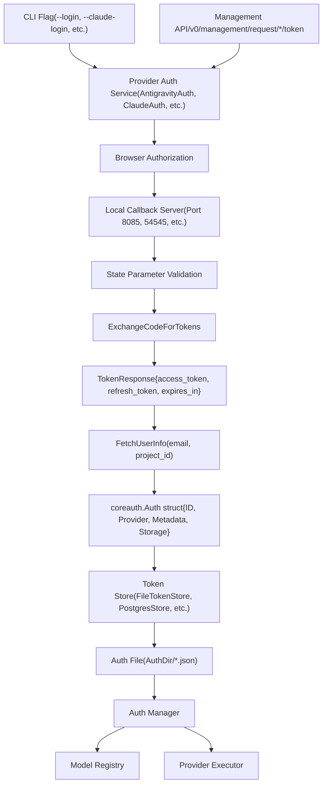
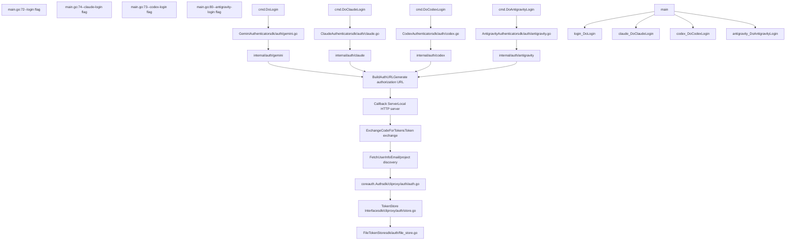

# Authentication Setup

Relevant source files

-   [README.md](https://github.com/router-for-me/CLIProxyAPI/blob/c66cb0af/README.md)
-   [README\_CN.md](https://github.com/router-for-me/CLIProxyAPI/blob/c66cb0af/README_CN.md)
-   [internal/api/handlers/management/auth\_files.go](https://github.com/router-for-me/CLIProxyAPI/blob/c66cb0af/internal/api/handlers/management/auth_files.go)
-   [internal/auth/antigravity/auth.go](https://github.com/router-for-me/CLIProxyAPI/blob/c66cb0af/internal/auth/antigravity/auth.go)
-   [internal/auth/claude/token.go](https://github.com/router-for-me/CLIProxyAPI/blob/c66cb0af/internal/auth/claude/token.go)
-   [internal/auth/codex/token.go](https://github.com/router-for-me/CLIProxyAPI/blob/c66cb0af/internal/auth/codex/token.go)
-   [internal/auth/gemini/gemini\_token.go](https://github.com/router-for-me/CLIProxyAPI/blob/c66cb0af/internal/auth/gemini/gemini_token.go)
-   [internal/auth/iflow/iflow\_token.go](https://github.com/router-for-me/CLIProxyAPI/blob/c66cb0af/internal/auth/iflow/iflow_token.go)
-   [internal/auth/kimi/token.go](https://github.com/router-for-me/CLIProxyAPI/blob/c66cb0af/internal/auth/kimi/token.go)
-   [internal/auth/qwen/qwen\_token.go](https://github.com/router-for-me/CLIProxyAPI/blob/c66cb0af/internal/auth/qwen/qwen_token.go)
-   [internal/cmd/anthropic\_login.go](https://github.com/router-for-me/CLIProxyAPI/blob/c66cb0af/internal/cmd/anthropic_login.go)
-   [internal/cmd/iflow\_login.go](https://github.com/router-for-me/CLIProxyAPI/blob/c66cb0af/internal/cmd/iflow_login.go)
-   [internal/cmd/openai\_login.go](https://github.com/router-for-me/CLIProxyAPI/blob/c66cb0af/internal/cmd/openai_login.go)
-   [internal/cmd/qwen\_login.go](https://github.com/router-for-me/CLIProxyAPI/blob/c66cb0af/internal/cmd/qwen_login.go)
-   [internal/misc/credentials.go](https://github.com/router-for-me/CLIProxyAPI/blob/c66cb0af/internal/misc/credentials.go)
-   [sdk/auth/antigravity.go](https://github.com/router-for-me/CLIProxyAPI/blob/c66cb0af/sdk/auth/antigravity.go)
-   [sdk/auth/claude.go](https://github.com/router-for-me/CLIProxyAPI/blob/c66cb0af/sdk/auth/claude.go)
-   [sdk/auth/codex.go](https://github.com/router-for-me/CLIProxyAPI/blob/c66cb0af/sdk/auth/codex.go)
-   [sdk/auth/iflow.go](https://github.com/router-for-me/CLIProxyAPI/blob/c66cb0af/sdk/auth/iflow.go)
-   [sdk/auth/qwen.go](https://github.com/router-for-me/CLIProxyAPI/blob/c66cb0af/sdk/auth/qwen.go)

This page guides you through setting up your first provider authentication after completing the initial server installation and configuration. You will learn how to authenticate with AI service providers using OAuth flows or API keys, save credentials, and verify that models are accessible.

For comprehensive details on the authentication architecture and credential management internals, see [Authentication and Credential Management](/router-for-me/CLIProxyAPI/3.3-authentication-and-credential-management). For storage backend configuration options, see [Storage Backend Options](/router-for-me/CLIProxyAPI/5.2-storage-backend-options). For provider-specific authentication details and OAuth setup procedures, see [Authentication Flows](/router-for-me/CLIProxyAPI/7-authentication-flows).

---

## Overview

CLIProxyAPI supports three primary authentication methods:

| Method | Use Case | Providers |
| --- | --- | --- |
| **OAuth 2.0** | Browser-based authorization for personal accounts | Gemini CLI, Claude Code, Codex, Qwen, iFlow, Antigravity |
| **API Keys** | Direct API access with existing keys | Gemini (AI Studio), Claude (API), OpenAI-compatible upstreams |
| **Service Accounts** | Google Cloud service account JSON files | Vertex AI |

After authentication, credentials are persisted to the configured storage backend (file system by default) and registered with the Auth Manager for immediate use.

Sources: [README.md36-58](https://github.com/router-for-me/CLIProxyAPI/blob/c66cb0af/README.md#L36-L58) [cmd/server/main.go56-85](https://github.com/router-for-me/CLIProxyAPI/blob/c66cb0af/cmd/server/main.go#L56-L85)

---

## Authentication Methods

### CLI Commands

The server binary provides dedicated flags for OAuth authentication with each provider:

```
# Google Gemini CLI OAuth./cliproxyapi --login [--project_id PROJECT_ID] # Claude Code OAuth  ./cliproxyapi --claude-login # OpenAI Codex OAuth./cliproxyapi --codex-login # Qwen Code OAuth./cliproxyapi --qwen-login # iFlow OAuth./cliproxyapi --iflow-login # Antigravity OAuth./cliproxyapi --antigravity-login # Vertex AI service account import./cliproxyapi --vertex-import path/to/service-account.json
```
Each command launches a provider-specific OAuth flow and saves the resulting credentials to the `AuthDir` configured in `config.yaml`.

**Optional flags:**

-   `--no-browser`: Disables automatic browser opening; prints URL for manual authentication
-   `--oauth-callback-port PORT`: Overrides the default OAuth callback port

Sources: [cmd/server/main.go72-84](https://github.com/router-for-me/CLIProxyAPI/blob/c66cb0af/cmd/server/main.go#L72-L84) [cmd/server/main.go448-471](https://github.com/router-for-me/CLIProxyAPI/blob/c66cb0af/cmd/server/main.go#L448-L471)

### Management API

For web-based integrations or remote administration, the Management API exposes OAuth initiation endpoints:

| Endpoint | Provider | Method |
| --- | --- | --- |
| `/v0/management/request/gemini/token` | Gemini CLI | GET |
| `/v0/management/request/anthropic/token` | Claude Code | GET |
| `/v0/management/request/codex/token` | Codex | GET |
| `/v0/management/request/qwen/token` | Qwen | GET |
| `/v0/management/request/iflow/token` | iFlow | GET |
| `/v0/management/request/antigravity/token` | Antigravity | GET |

These endpoints return an authorization URL and a state token. The client opens the URL in a browser, completes the OAuth flow, and polls for completion.

Query parameter `?is_webui=true` enables callback forwarding to the management server's port, allowing web UIs to handle callbacks directly.

Sources: [internal/api/handlers/management/auth\_files.go869-1011](https://github.com/router-for-me/CLIProxyAPI/blob/c66cb0af/internal/api/handlers/management/auth_files.go#L869-L1011) [internal/api/handlers/management/auth\_files.go1013-1299](https://github.com/router-for-me/CLIProxyAPI/blob/c66cb0af/internal/api/handlers/management/auth_files.go#L1013-L1299)

---

## Authentication Flow Architecture


**Authentication Flow Stages:**

1.  **Initiation**: User invokes CLI command or Management API endpoint
2.  **OAuth Flow**: Provider-specific auth service generates authorization URL, starts local callback server, and opens browser
3.  **Token Exchange**: Authorization code is exchanged for access/refresh tokens; user info (email, project ID) is fetched
4.  **Persistence**: Tokens are wrapped in `Auth` struct and saved via configured token store
5.  **Registration**: Auth Manager registers the credential, making models immediately available

Sources: [sdk/auth/antigravity.go36-215](https://github.com/router-for-me/CLIProxyAPI/blob/c66cb0af/sdk/auth/antigravity.go#L36-L215) [internal/auth/antigravity/auth.go50-108](https://github.com/router-for-me/CLIProxyAPI/blob/c66cb0af/internal/auth/antigravity/auth.go#L50-L108)

---

## Setting Up Your First Authentication

### Step 1: Choose a Provider

Select a provider based on your existing subscriptions or preferred models. The most common starting points:

-   **Gemini CLI**: Free tier available, supports Gemini models via OAuth
-   **Claude Code**: Requires active Claude subscription
-   **Codex**: Requires ChatGPT Plus or Pro subscription

### Step 2: Run Authentication Command

**Example: Gemini CLI OAuth**

```
./cliproxyapi --login
```
Expected output:

```
CLIProxyAPI Version: v6.x.x, Commit: xxxxx, BuiltAt: 2024-xx-xx
Initializing Google authentication...
Opening browser for authentication
Waiting for authentication callback...
```
The browser opens to Google's OAuth consent screen. After authorizing, you'll see:

```
Authenticated user email: user@example.com
Authentication successful! Token saved to /path/to/auth/gemini-user@example.com.json
You can now use Gemini services through this CLI
```
**Example: No-Browser Mode (SSH/Remote Server)**

```
./cliproxyapi --antigravity-login --no-browser
```
Output includes instructions for SSH tunneling:

```
To authenticate on a remote server via SSH:
  ssh -L 8085:localhost:8085 user@remote-server
Visit the following URL to continue authentication:
https://accounts.google.com/o/oauth2/v2/auth?access_type=offline&client_id=...
```
Sources: [cmd/server/main.go448-471](https://github.com/router-for-me/CLIProxyAPI/blob/c66cb0af/cmd/server/main.go#L448-L471) [sdk/auth/antigravity.go72-86](https://github.com/router-for-me/CLIProxyAPI/blob/c66cb0af/sdk/auth/antigravity.go#L72-L86)

### Step 3: Verify Credential File

Check that the credential file was created in your `AuthDir`:

```
ls -la /path/to/auth/
```
Expected files:

```
-rw------- 1 user user 2048 Jan 15 10:30 gemini-user@example.com.json
-rw------- 1 user user 1856 Jan 15 10:31 claude-user@example.com.json
```
Each file contains the provider type, tokens, and metadata:

```
{  "type": "gemini",  "access_token": "ya29.xxx...",  "refresh_token": "1//xxx...",  "email": "user@example.com",  "project_id": "project-123456",  "token_uri": "https://oauth2.googleapis.com/token",  "expired": "2024-01-15T11:30:00Z"}
```
Sources: [internal/api/handlers/management/auth\_files.go1142-1177](https://github.com/router-for-me/CLIProxyAPI/blob/c66cb0af/internal/api/handlers/management/auth_files.go#L1142-L1177)

---

## Credential Persistence Flow

> **[Mermaid sequence]**
> *(图表结构无法解析)*

**Persistence Components:**

-   **`Auth` struct**: Core credential representation ([sdk/cliproxy/auth/auth.go1-100](https://github.com/router-for-me/CLIProxyAPI/blob/c66cb0af/sdk/cliproxy/auth/auth.go#L1-L100))
-   **Token Store interface**: Pluggable persistence layer ([sdk/cliproxy/auth/store.go1-50](https://github.com/router-for-me/CLIProxyAPI/blob/c66cb0af/sdk/cliproxy/auth/store.go#L1-L50))
-   **File Token Store**: Default implementation writing JSON files ([sdk/auth/file\_store.go1-200](https://github.com/router-for-me/CLIProxyAPI/blob/c66cb0af/sdk/auth/file_store.go#L1-L200))
-   **Auth Manager**: Central registry tracking all credentials ([internal/auth/manager.go1-500](https://github.com/router-for-me/CLIProxyAPI/blob/c66cb0af/internal/auth/manager.go#L1-L500))

Sources: [sdk/auth/antigravity.go151-215](https://github.com/router-for-me/CLIProxyAPI/blob/c66cb0af/sdk/auth/antigravity.go#L151-L215) [internal/api/handlers/management/auth\_files.go680-742](https://github.com/router-for-me/CLIProxyAPI/blob/c66cb0af/internal/api/handlers/management/auth_files.go#L680-L742)

---

## Testing Connectivity

### Using Management API

List all registered auth files:

```
curl http://localhost:8080/v0/management/auth/files
```
Response:

```
{  "files": [    {      "id": "gemini-user@example.com.json",      "name": "gemini-user@example.com.json",      "type": "gemini",      "provider": "gemini",      "email": "user@example.com",      "status": "active",      "disabled": false,      "source": "file",      "size": 2048,      "created_at": "2024-01-15T10:30:00Z"    }  ]}
```
The `status` field indicates credential health:

-   `active`: Ready to use
-   `cooling`: Temporary rate limit cooldown
-   `quota_exceeded`: Quota exhausted (5-minute timeout)
-   `disabled`: Manually disabled or removed

Sources: [internal/api/handlers/management/auth\_files.go249-271](https://github.com/router-for-me/CLIProxyAPI/blob/c66cb0af/internal/api/handlers/management/auth_files.go#L249-L271) [internal/api/handlers/management/auth\_files.go355-428](https://github.com/router-for-me/CLIProxyAPI/blob/c66cb0af/internal/api/handlers/management/auth_files.go#L355-L428)

### Checking Available Models

Query models accessible by a specific credential:

```
curl "http://localhost:8080/v0/management/auth/models?name=gemini-user@example.com.json"
```
Response:

```
{  "models": [    {      "id": "gemini-1.5-pro",      "display_name": "Gemini 1.5 Pro",      "type": "chat",      "owned_by": "google"    },    {      "id": "gemini-2.0-flash-exp",      "display_name": "Gemini 2.0 Flash Experimental",      "type": "chat",      "owned_by": "google"    }  ]}
```
Sources: [internal/api/handlers/management/auth\_files.go273-319](https://github.com/router-for-me/CLIProxyAPI/blob/c66cb0af/internal/api/handlers/management/auth_files.go#L273-L319)

---

## Code Entity Mapping


**Key Code Entities:**

| Entity | File Path | Purpose |
| --- | --- | --- |
| `Authenticator` interface | [sdk/auth/auth.go1-50](https://github.com/router-for-me/CLIProxyAPI/blob/c66cb0af/sdk/auth/auth.go#L1-L50) | Defines `Login()`, `Provider()`, `RefreshLead()` methods |
| `AntigravityAuthenticator` | [sdk/auth/antigravity.go21-28](https://github.com/router-for-me/CLIProxyAPI/blob/c66cb0af/sdk/auth/antigravity.go#L21-L28) | Implements OAuth flow for Antigravity |
| `AntigravityAuth` service | [internal/auth/antigravity/auth.go32-48](https://github.com/router-for-me/CLIProxyAPI/blob/c66cb0af/internal/auth/antigravity/auth.go#L32-L48) | Handles API requests to Google OAuth |
| `Auth` struct | [sdk/cliproxy/auth/auth.go1-100](https://github.com/router-for-me/CLIProxyAPI/blob/c66cb0af/sdk/cliproxy/auth/auth.go#L1-L100) | In-memory credential representation |
| `Store` interface | [sdk/cliproxy/auth/store.go1-50](https://github.com/router-for-me/CLIProxyAPI/blob/c66cb0af/sdk/cliproxy/auth/store.go#L1-L50) | Defines `Save()`, `Load()`, `Delete()` operations |
| `FileTokenStore` | [sdk/auth/file\_store.go1-200](https://github.com/router-for-me/CLIProxyAPI/blob/c66cb0af/sdk/auth/file_store.go#L1-L200) | Default file-based storage implementation |

Sources: [sdk/auth/antigravity.go20-28](https://github.com/router-for-me/CLIProxyAPI/blob/c66cb0af/sdk/auth/antigravity.go#L20-L28) [internal/auth/antigravity/auth.go33-48](https://github.com/router-for-me/CLIProxyAPI/blob/c66cb0af/internal/auth/antigravity/auth.go#L33-L48)

---

## Management API Authentication Endpoints

The Management API provides programmatic access to OAuth flows for web-based clients:

> **[Mermaid sequence]**
> *(图表结构无法解析)*

**Callback Forwarder Architecture:**

When `is_webui=true` is set, the Management API starts a temporary HTTP server on the provider's default callback port (e.g., 54545 for Claude, 8085 for Gemini) that redirects OAuth callbacks to the management server's port. This allows web UIs to handle callbacks without requiring users to configure redirect URIs.

The forwarder is automatically stopped after the OAuth flow completes or times out.

Sources: [internal/api/handlers/management/auth\_files.go131-234](https://github.com/router-for-me/CLIProxyAPI/blob/c66cb0af/internal/api/handlers/management/auth_files.go#L131-L234) [internal/api/handlers/management/auth\_files.go869-1011](https://github.com/router-for-me/CLIProxyAPI/blob/c66cb0af/internal/api/handlers/management/auth_files.go#L869-L1011)

---

## Common Authentication Scenarios

### Scenario 1: Multiple Accounts for Same Provider

You can authenticate multiple accounts for load balancing:

```
# First account./cliproxyapi --claude-login# Saved as: claude-user1@example.com.json # Second account  ./cliproxyapi --claude-login# Saved as: claude-user2@example.com.json
```
The Auth Manager automatically discovers both credentials and uses the configured selector strategy (round-robin or fill-first) to distribute requests.

### Scenario 2: Vertex AI Service Account

For Vertex AI, import a service account JSON file:

```
./cliproxyapi --vertex-import /path/to/service-account.json
```
The command copies the file to `AuthDir` and registers it with the Auth Manager. Unlike OAuth credentials, service account keys don't expire but should be rotated periodically for security.

### Scenario 3: Remote Server Authentication

When authenticating on a remote server via SSH:

1.  Create SSH tunnel for callback port:

    ```
    ssh -L 8085:localhost:8085 user@remote-server
    ```

2.  Run login command with `--no-browser`:

    ```
    ./cliproxyapi --login --no-browser
    ```

3.  Copy the authorization URL and open it in your local browser

4.  After authorizing, the callback is forwarded through the SSH tunnel to the remote server


Sources: [sdk/auth/antigravity.go72-86](https://github.com/router-for-me/CLIProxyAPI/blob/c66cb0af/sdk/auth/antigravity.go#L72-L86)

---

## Troubleshooting Authentication

### Issue: "Failed to start callback server"

**Cause**: Callback port is already in use.

**Solution**: Specify a different port:

```
./cliproxyapi --antigravity-login --oauth-callback-port 9999
```
### Issue: "Authentication timed out"

**Cause**: OAuth flow not completed within 5-minute timeout.

**Solution**: Retry the authentication command. Check firewall rules if using remote server.

### Issue: Auth file exists but status is "cooling"

**Cause**: Recent rate limit or quota error triggered cooldown period.

**Solution**: Wait for cooldown to expire (30 minutes for 401 errors, 12 hours for 404 errors). Check quota limits in provider console.

Sources: [sdk/cliproxy/auth/manager.go1-500](https://github.com/router-for-me/CLIProxyAPI/blob/c66cb0af/sdk/cliproxy/auth/manager.go#L1-L500)

### Issue: "No models available" after authentication

**Cause**:

1.  Project ID not set (Gemini/Antigravity)
2.  Subscription not active
3.  Models not enabled in provider console

**Solution**:

1.  Re-authenticate with `--project_id` flag for Gemini
2.  Verify subscription status in provider dashboard
3.  Enable required APIs in Google Cloud Console

---

## Next Steps

After successfully authenticating:

1.  **Configure model mappings**: See [Model Mapping and Exclusion](/router-for-me/CLIProxyAPI/8.2-model-mapping-and-exclusion) to set up model aliases
2.  **Test requests**: Use the OpenAI-compatible endpoints documented in [OpenAI Compatible Endpoints](/router-for-me/CLIProxyAPI/4.1-openai-compatible-endpoints)
3.  **Set up multiple accounts**: Add additional credentials for load balancing
4.  **Configure storage backend**: Switch to PostgresStore or GitStore for production deployments ([Storage Backend Options](/router-for-me/CLIProxyAPI/5.2-storage-backend-options))
