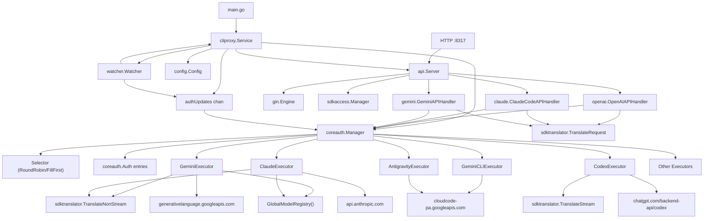
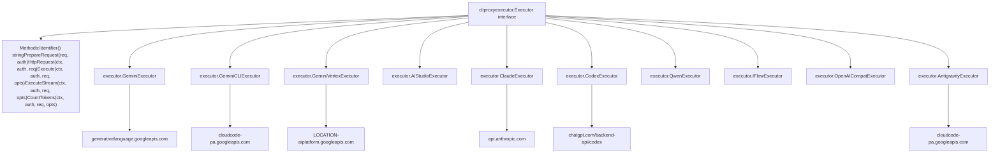
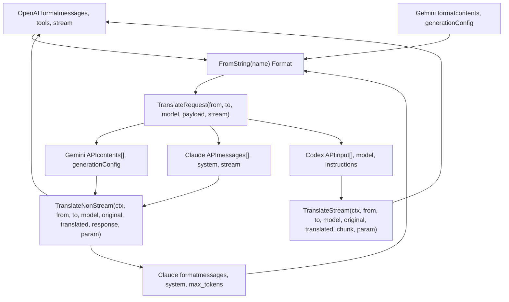
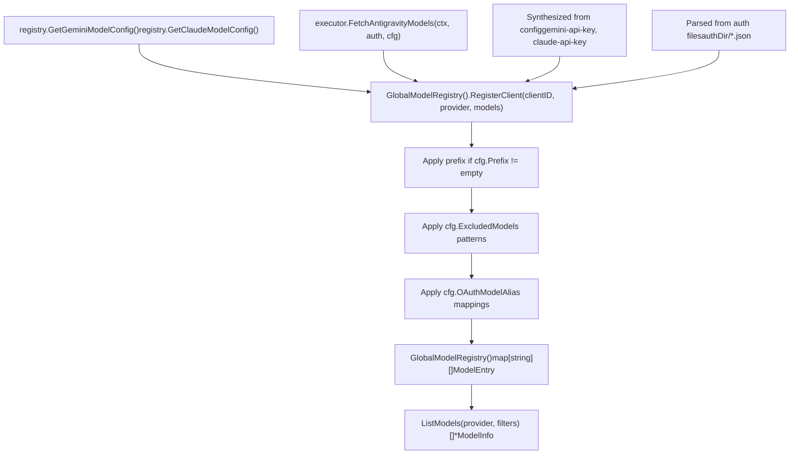

# Core Architecture

Relevant source files

-   [config.example.yaml](https://github.com/router-for-me/CLIProxyAPI/blob/c66cb0af/config.example.yaml)
-   [docs/sdk-access.md](https://github.com/router-for-me/CLIProxyAPI/blob/c66cb0af/docs/sdk-access.md)
-   [docs/sdk-access\_CN.md](https://github.com/router-for-me/CLIProxyAPI/blob/c66cb0af/docs/sdk-access_CN.md)
-   [internal/access/config\_access/provider.go](https://github.com/router-for-me/CLIProxyAPI/blob/c66cb0af/internal/access/config_access/provider.go)
-   [internal/access/reconcile.go](https://github.com/router-for-me/CLIProxyAPI/blob/c66cb0af/internal/access/reconcile.go)
-   [internal/api/handlers/management/config\_basic.go](https://github.com/router-for-me/CLIProxyAPI/blob/c66cb0af/internal/api/handlers/management/config_basic.go)
-   [internal/api/handlers/management/config\_lists.go](https://github.com/router-for-me/CLIProxyAPI/blob/c66cb0af/internal/api/handlers/management/config_lists.go)
-   [internal/api/server.go](https://github.com/router-for-me/CLIProxyAPI/blob/c66cb0af/internal/api/server.go)
-   [internal/config/config.go](https://github.com/router-for-me/CLIProxyAPI/blob/c66cb0af/internal/config/config.go)
-   [internal/watcher/watcher.go](https://github.com/router-for-me/CLIProxyAPI/blob/c66cb0af/internal/watcher/watcher.go)
-   [sdk/access/errors.go](https://github.com/router-for-me/CLIProxyAPI/blob/c66cb0af/sdk/access/errors.go)
-   [sdk/access/manager.go](https://github.com/router-for-me/CLIProxyAPI/blob/c66cb0af/sdk/access/manager.go)
-   [sdk/access/registry.go](https://github.com/router-for-me/CLIProxyAPI/blob/c66cb0af/sdk/access/registry.go)
-   [sdk/cliproxy/builder.go](https://github.com/router-for-me/CLIProxyAPI/blob/c66cb0af/sdk/cliproxy/builder.go)
-   [sdk/cliproxy/service.go](https://github.com/router-for-me/CLIProxyAPI/blob/c66cb0af/sdk/cliproxy/service.go)
-   [sdk/config/config.go](https://github.com/router-for-me/CLIProxyAPI/blob/c66cb0af/sdk/config/config.go)
-   [test/amp\_management\_test.go](https://github.com/router-for-me/CLIProxyAPI/blob/c66cb0af/test/amp_management_test.go)

## Purpose and Scope

This document provides a high-level overview of CLIProxyAPI's core architecture, describing the major components and their interactions. It covers the service lifecycle, HTTP server structure, authentication flow, provider execution model, request translation pipeline, and model registry. For specific implementation details on each subsystem, see the child pages: [Service Lifecycle and Initialization (3.1)](/router-for-me/CLIProxyAPI/3.1-service-lifecycle-and-initialization), [HTTP Server and Request Pipeline (3.2)](/router-for-me/CLIProxyAPI/3.2-http-server-and-request-pipeline), [Authentication and Credential Management (3.3)](/router-for-me/CLIProxyAPI/3.3-authentication-and-credential-management), [Provider Executor System (3.4)](/router-for-me/CLIProxyAPI/3.4-provider-executor-system), [Request Translation System (3.5)](/router-for-me/CLIProxyAPI/3.5-request-translation-system), [Model Registry and Selection (3.6)](/router-for-me/CLIProxyAPI/3.6-model-registry-and-selection), and [Hot Reload and Configuration Updates (3.7)](/router-for-me/CLIProxyAPI/3.7-hot-reload-and-configuration-updates). </old\_str> <new\_str> This document provides a high-level overview of CLIProxyAPI's core architecture, describing the major components and their interactions. It covers the service lifecycle, HTTP server structure, authentication flow, provider execution model, request translation pipeline, and model registry. For specific implementation details on each subsystem, see the child pages: [Service Lifecycle and Initialization (3.1)](/router-for-me/CLIProxyAPI/3.1-service-lifecycle-and-initialization), [HTTP Server and Request Pipeline (3.2)](/router-for-me/CLIProxyAPI/3.2-http-server-and-request-pipeline), [Authentication and Credential Management (3.3)](/router-for-me/CLIProxyAPI/3.3-authentication-and-credential-management), [Provider Executor System (3.4)](/router-for-me/CLIProxyAPI/3.4-provider-executor-system), [Request Translation System (3.5)](/router-for-me/CLIProxyAPI/3.5-request-translation-system), [Model Registry and Selection (3.6)](/router-for-me/CLIProxyAPI/3.6-model-registry-and-selection), and [Hot Reload and Configuration Updates (3.7)](/router-for-me/CLIProxyAPI/3.7-hot-reload-and-configuration-updates).

CLIProxyAPI is a unified proxy server that translates and routes requests across multiple AI service providers (Gemini, Claude, Codex, Qwen, iFlow, OpenAI-compatible services). The system provides API compatibility layers, credential management, hot-reload configuration, and usage tracking.

**Sources:** [internal/api/server.go1-40](https://github.com/router-for-me/CLIProxyAPI/blob/c66cb0af/internal/api/server.go#L1-L40) [sdk/cliproxy/service.go1-40](https://github.com/router-for-me/CLIProxyAPI/blob/c66cb0af/sdk/cliproxy/service.go#L1-L40)

---

## System Architecture Overview

The architecture consists of five primary layers: **Entry Points**, **Service Orchestration**, **Request Processing**, **Provider Execution**, and **External Integration**.

**Architecture Layer Diagram**

**Sources:** [sdk/cliproxy/service.go32-89](https://github.com/router-for-me/CLIProxyAPI/blob/c66cb0af/sdk/cliproxy/service.go#L32-L89) [internal/api/server.go114-174](https://github.com/router-for-me/CLIProxyAPI/blob/c66cb0af/internal/api/server.go#L114-L174) [internal/watcher/watcher.go30-54](https://github.com/router-for-me/CLIProxyAPI/blob/c66cb0af/internal/watcher/watcher.go#L30-L54) [internal/watcher/watcher.go56-70](https://github.com/router-for-me/CLIProxyAPI/blob/c66cb0af/internal/watcher/watcher.go#L56-L70)

---

## Component Responsibilities

### Service Orchestration Layer

| Component | Type | Responsibility |
| --- | --- | --- |
| `cliproxy.Builder` | struct | Fluent builder that constructs and validates a `Service` via `Build()` |
| `cliproxy.Service` | struct | Manages complete lifecycle: `Run()`, `Shutdown()`, component coordination |
| `watcher.Watcher` | struct | Monitors filesystem using `fsnotify.Watcher`, emits `AuthUpdate` events |
| `config.Config` | struct | Holds parsed YAML configuration with hot-reload via `LoadConfig()` |
| `authUpdates chan` | channel | Buffered channel (256) for asynchronous auth change processing |
| `coreauth.Manager` | struct | Runtime credential pool with `Register()`, `Update()`, `GetByID()` |

The `cliproxy.Builder` is the primary entry point for constructing the service. It provides fluent setters (`WithConfig()`, `WithConfigPath()`, `WithCoreAuthManager()`, `WithServerOptions()`, etc.) and validates inputs in `Build()`, applying defaults for any unset providers. The resulting `cliproxy.Service` orchestrates all subsystems: it initializes `api.Server`, `coreauth.Manager`, `sdkaccess.Manager`, `watcher.Watcher`, and provider executors. The service runs until context cancellation, handling graceful shutdown via `Shutdown()`.

**Sources:** [sdk/cliproxy/builder.go21-51](https://github.com/router-for-me/CLIProxyAPI/blob/c66cb0af/sdk/cliproxy/builder.go#L21-L51) [sdk/cliproxy/builder.go167-242](https://github.com/router-for-me/CLIProxyAPI/blob/c66cb0af/sdk/cliproxy/builder.go#L167-L242) [sdk/cliproxy/service.go32-89](https://github.com/router-for-me/CLIProxyAPI/blob/c66cb0af/sdk/cliproxy/service.go#L32-L89) [sdk/cliproxy/service.go111-147](https://github.com/router-for-me/CLIProxyAPI/blob/c66cb0af/sdk/cliproxy/service.go#L111-L147) [internal/watcher/watcher.go30-54](https://github.com/router-for-me/CLIProxyAPI/blob/c66cb0af/internal/watcher/watcher.go#L30-L54) [internal/config/config.go24-113](https://github.com/router-for-me/CLIProxyAPI/blob/c66cb0af/internal/config/config.go#L24-L113)

### HTTP Server Layer

| Component | Type | Responsibility |
| --- | --- | --- |
| `api.Server` | struct | Manages `gin.Engine`, routes via `setupRoutes()`, HTTP lifecycle |
| `AuthMiddleware()` | func | Validates credentials via `sdkaccess.Manager`, sets Gin context |
| `openai.OpenAIAPIHandler` | struct | Handles `/v1/chat/completions`, `/v1/completions` |
| `claude.ClaudeCodeAPIHandler` | struct | Handles `/v1/messages`, `/v1/messages/count_tokens` |
| `gemini.GeminiAPIHandler` | struct | Handles `/v1beta/models/*`, Gemini API format |
| `managementHandlers.Handler` | struct | Handles `/v0/management/*` configuration endpoints |

The `api.Server` configures the `gin.Engine` with middleware layers (`corsMiddleware()`, `logging.GinLogrusLogger()`, authentication) and registers routes via `setupRoutes()`. The `UpdateClients()` method supports hot-reloading of configuration without restart.

**Sources:** [internal/api/server.go114-174](https://github.com/router-for-me/CLIProxyAPI/blob/c66cb0af/internal/api/server.go#L114-L174) [internal/api/server.go308-426](https://github.com/router-for-me/CLIProxyAPI/blob/c66cb0af/internal/api/server.go#L308-L426) [internal/api/server.go850-920](https://github.com/router-for-me/CLIProxyAPI/blob/c66cb0af/internal/api/server.go#L850-L920)

### Authentication & Execution Layer

| Component | Type | Responsibility |
| --- | --- | --- |
| `coreauth.Manager` | struct | In-memory credential pool, `Select()` with routing strategies |
| `coreauth.Selector` | interface | Strategy interface: `RoundRobinSelector`, `FillFirstSelector` |
| `coreauth.Auth` | struct | Individual credential with metadata, status, attributes |
| `sdkaccess.Manager` | struct | Request-time API key validation via configured providers |
| `cliproxyexecutor.Executor` | interface | Executor interface: `Execute()`, `ExecuteStream()`, `CountTokens()` |

The `coreauth.Manager` maintains a runtime pool of `coreauth.Auth` entries loaded from file storage or synthesized from configuration. The `Select()` method uses a `Selector` implementation (configured via `SetSelector()`) to choose credentials. Each executor implements `PrepareRequest()` for credential injection and `HttpRequest()` for direct HTTP execution.

**Sources:** [sdk/cliproxy/service.go340-389](https://github.com/router-for-me/CLIProxyAPI/blob/c66cb0af/sdk/cliproxy/service.go#L340-L389) [internal/runtime/executor/gemini\_executor.go40-57](https://github.com/router-for-me/CLIProxyAPI/blob/c66cb0af/internal/runtime/executor/gemini_executor.go#L40-L57) [internal/runtime/executor/claude\_executor.go33-42](https://github.com/router-for-me/CLIProxyAPI/blob/c66cb0af/internal/runtime/executor/claude_executor.go#L33-L42) [internal/runtime/executor/antigravity\_executor.go59-76](https://github.com/router-for-me/CLIProxyAPI/blob/c66cb0af/internal/runtime/executor/antigravity_executor.go#L59-L76)

---

## Request Processing Flow

This diagram shows how a client request flows through the system from HTTP ingress to provider API response.

**Request Flow Diagram**

> **[Mermaid sequence]**
> *(图表结构无法解析)*

**Sources:** [internal/api/server.go308-349](https://github.com/router-for-me/CLIProxyAPI/blob/c66cb0af/internal/api/server.go#L308-L349) [sdk/api/handlers/openai/openai\_handler.go1-100](https://github.com/router-for-me/CLIProxyAPI/blob/c66cb0af/sdk/api/handlers/openai/openai_handler.go#L1-L100) [internal/runtime/executor/gemini\_executor.go59-90](https://github.com/router-for-me/CLIProxyAPI/blob/c66cb0af/internal/runtime/executor/gemini_executor.go#L59-L90) [internal/runtime/executor/gemini\_executor.go105-204](https://github.com/router-for-me/CLIProxyAPI/blob/c66cb0af/internal/runtime/executor/gemini_executor.go#L105-L204)

---

## Core Components Detail

### cliproxy.Service

The `cliproxy.Service` struct is the root lifecycle manager located in [sdk/cliproxy/service.go32-89](https://github.com/router-for-me/CLIProxyAPI/blob/c66cb0af/sdk/cliproxy/service.go#L32-L89) Key fields and methods:

**Fields:**

-   `cfg *config.Config` - Configuration with `sync.RWMutex` protection
-   `server *api.Server` - HTTP API server instance
-   `coreManager *coreauth.Manager` - Runtime credential pool
-   `accessManager *sdkaccess.Manager` - Request authentication provider
-   `watcher *WatcherWrapper` - File system monitor
-   `wsGateway *wsrelay.Manager` - Websocket relay for AI Studio
-   `authUpdates chan watcher.AuthUpdate` - Buffered channel (256) for async auth changes
-   `authQueueStop context.CancelFunc` - Cancellation for auth queue processing

**Methods:**

-   `Run(ctx context.Context) error` - Starts all subsystems, blocks until context cancellation
-   `Shutdown(ctx context.Context) error` - Graceful shutdown with timeout
-   `ensureAuthUpdateQueue(ctx)` - Initializes auth update processing via `consumeAuthUpdates()`
-   `handleAuthUpdate(ctx, update)` - Processes add/modify/delete auth events
-   `ensureExecutorsForAuth(auth)` - Binds provider executors based on `auth.Provider`
-   `rebindExecutors()` - Re-registers all executors on config reload

The `Run()` method sequence: load auth store → load token/API key clients → create `api.Server` → start websocket gateway → start HTTP server → start file watcher → start auto-refresh → block on context/error.

**Sources:** [sdk/cliproxy/service.go32-89](https://github.com/router-for-me/CLIProxyAPI/blob/c66cb0af/sdk/cliproxy/service.go#L32-L89) [sdk/cliproxy/service.go111-124](https://github.com/router-for-me/CLIProxyAPI/blob/c66cb0af/sdk/cliproxy/service.go#L111-L124) [sdk/cliproxy/service.go126-147](https://github.com/router-for-me/CLIProxyAPI/blob/c66cb0af/sdk/cliproxy/service.go#L126-L147) [sdk/cliproxy/service.go340-389](https://github.com/router-for-me/CLIProxyAPI/blob/c66cb0af/sdk/cliproxy/service.go#L340-L389) [sdk/cliproxy/service.go402-594](https://github.com/router-for-me/CLIProxyAPI/blob/c66cb0af/sdk/cliproxy/service.go#L402-L594)

### api.Server

The `api.Server` struct in [internal/api/server.go114-174](https://github.com/router-for-me/CLIProxyAPI/blob/c66cb0af/internal/api/server.go#L114-L174) manages HTTP serving:

**Fields:**

-   `engine *gin.Engine` - Gin web framework instance
-   `server *http.Server` - Underlying HTTP server
-   `handlers *handlers.BaseAPIHandler` - Base handler with `coreauth.Manager`
-   `cfg *config.Config` - Current configuration
-   `accessManager *sdkaccess.Manager` - Request auth provider
-   `mgmt *managementHandlers.Handler` - Management API handler
-   `ampModule *ampmodule.AmpModule` - Amp CLI integration module

**Key Methods:**

-   `NewServer(cfg, authManager, accessManager, configPath, opts)` - Constructor with options
-   `setupRoutes()` - Registers all HTTP routes
-   `Start() error` - Begins listening (HTTP or HTTPS based on `cfg.TLS.Enable`)
-   `Stop(ctx) error` - Graceful shutdown with timeout
-   `UpdateClients(newCfg)` - Hot-reload handler, updates config and rebinds components
-   `AttachWebsocketRoute(path, handler)` - Registers websocket upgrade handlers

**Route Structure:**

| Path | Method | Handler |
| --- | --- | --- |
| `/v1/chat/completions` | POST | `openai.OpenAIAPIHandler.ChatCompletions` |
| `/v1/completions` | POST | `openai.OpenAIAPIHandler.Completions` |
| `/v1/models` | GET | `unifiedModelsHandler` (routes to OpenAI or Claude by `User-Agent`) |
| `/v1/messages` | POST | `claude.ClaudeCodeAPIHandler.ClaudeMessages` |
| `/v1/messages/count_tokens` | POST | `claude.ClaudeCodeAPIHandler.ClaudeCountTokens` |
| `/v1/responses` | POST/GET | `openai.OpenAIResponsesAPIHandler` (GET upgrades to WebSocket) |
| `/v1/responses/compact` | POST | `openai.OpenAIResponsesAPIHandler.Compact` |
| `/v1beta/models/*` | GET/POST | `gemini.GeminiAPIHandler` |
| `/v1internal:method` | POST | `gemini.GeminiCLIAPIHandler.CLIHandler` |
| `/v0/management/*` | mixed | `managementHandlers.Handler` (requires secret key) |
| `/anthropic/callback`, `/codex/callback`, etc. | GET | OAuth callback handlers |

The server supports TLS when `cfg.TLS.Enable == true` and binds to `cfg.Host:cfg.Port`.

**Sources:** [internal/api/server.go114-174](https://github.com/router-for-me/CLIProxyAPI/blob/c66cb0af/internal/api/server.go#L114-L174) [internal/api/server.go175-306](https://github.com/router-for-me/CLIProxyAPI/blob/c66cb0af/internal/api/server.go#L175-L306) [internal/api/server.go308-426](https://github.com/router-for-me/CLIProxyAPI/blob/c66cb0af/internal/api/server.go#L308-L426) [internal/api/server.go761-791](https://github.com/router-for-me/CLIProxyAPI/blob/c66cb0af/internal/api/server.go#L761-L791) [internal/api/server.go850-920](https://github.com/router-for-me/CLIProxyAPI/blob/c66cb0af/internal/api/server.go#L850-L920)

### watcher.Watcher

The `watcher.Watcher` struct in [internal/watcher/watcher.go30-54](https://github.com/router-for-me/CLIProxyAPI/blob/c66cb0af/internal/watcher/watcher.go#L30-L54) monitors filesystem changes:

**Fields:**

-   `watcher *fsnotify.Watcher` - fsnotify instance
-   `configPath string` - Path to config.yaml
-   `authDir string` - Directory containing auth JSON files
-   `reloadCallback func(*config.Config)` - Called on config changes
-   `authQueue chan<- AuthUpdate` - Output channel for auth events
-   `lastAuthHashes map[string]string` - SHA256 hashes to detect changes
-   `configReloadTimer *time.Timer` - Debounce timer (150ms)

**Constants:**

-   `replaceCheckDelay = 50ms` - Delay to distinguish file replacement from deletion
-   `configReloadDebounce = 150ms` - Config reload debounce interval
-   `authRemoveDebounceWindow = 1s` - Window to suppress duplicate delete events

**Key Methods:**

-   `NewWatcher(configPath, authDir, reloadCallback)` - Constructor, creates `fsnotify.Watcher`
-   `Start(ctx) error` - Begins monitoring via `start(ctx)`
-   `Stop() error` - Closes fsnotify watcher
-   `SetAuthUpdateQueue(queue)` - Sets output channel for `AuthUpdate` events
-   `DispatchRuntimeAuthUpdate(update) bool` - Allows external auth updates (e.g., websocket)

The watcher distinguishes atomic file replacements (temp file rename) from true deletions using the `replaceCheckDelay` window. It computes YAML hashes to avoid spurious config reloads and emits structured `AuthUpdate` events (Add/Modify/Delete).

**Sources:** [internal/watcher/watcher.go30-54](https://github.com/router-for-me/CLIProxyAPI/blob/c66cb0af/internal/watcher/watcher.go#L30-L54) [internal/watcher/watcher.go56-78](https://github.com/router-for-me/CLIProxyAPI/blob/c66cb0af/internal/watcher/watcher.go#L56-L78) [internal/watcher/watcher.go80-147](https://github.com/router-for-me/CLIProxyAPI/blob/c66cb0af/internal/watcher/watcher.go#L80-L147)

### coreauth.Manager

The `coreauth.Manager` manages runtime credential state. While its implementation is in the SDK package, the service coordinates it via [sdk/cliproxy/service.go271-310](https://github.com/router-for-me/CLIProxyAPI/blob/c66cb0af/sdk/cliproxy/service.go#L271-L310):

**Core Responsibilities:**

-   **Credential Pool**: In-memory map of `coreauth.Auth` entries indexed by ID
-   **Selection Strategy**: Configurable via `SetSelector(selector Selector)` - supports `RoundRobinSelector` (default) and `FillFirstSelector`
-   **Health Tracking**: Each `Auth` has `Status` field (Active/QuotaExceeded/Disabled)
-   **Auto-Refresh**: Background goroutine calls `Refresh()` on OAuth credentials before expiry
-   **Executor Registry**: Maps provider names to `cliproxyexecutor.Executor` implementations

**Selection Flow (via `Select(provider, model, filters)`):**

1.  Filter credentials by `provider` field
2.  Filter by model availability (via registered executor's models)
3.  Filter by health status (exclude disabled, optionally skip quota-exceeded)
4.  Apply routing strategy (`Selector.Select(auths)`)
5.  Return selected `*coreauth.Auth` or error

**Integration with Service:** The service binds executors via `ensureExecutorsForAuth()` in [sdk/cliproxy/service.go340-389](https://github.com/router-for-me/CLIProxyAPI/blob/c66cb0af/sdk/cliproxy/service.go#L340-L389) which inspects `auth.Provider` and calls `coreManager.RegisterExecutor()` with the appropriate implementation (e.g., `GeminiExecutor`, `ClaudeExecutor`).

**Sources:** [sdk/cliproxy/service.go271-310](https://github.com/router-for-me/CLIProxyAPI/blob/c66cb0af/sdk/cliproxy/service.go#L271-L310) [sdk/cliproxy/service.go340-389](https://github.com/router-for-me/CLIProxyAPI/blob/c66cb0af/sdk/cliproxy/service.go#L340-L389) [sdk/cliproxy/service.go508-559](https://github.com/router-for-me/CLIProxyAPI/blob/c66cb0af/sdk/cliproxy/service.go#L508-L559)

---

## Provider Executor Architecture

Executors implement the `ProviderExecutor` interface, providing a uniform abstraction over heterogeneous AI provider APIs.

**Executor Interface & Implementations**

Each executor is stateless and receives `*config.Config` via constructor. Credentials are passed per-request via `*cliproxyauth.Auth` parameter.

**Common Executor Patterns:**

-   `Identifier() string` - Returns provider key (e.g., "gemini", "claude", "codex")
-   `PrepareRequest()` - Injects credentials into `http.Request` headers
-   `Execute()` - Non-streaming request with `sdktranslator.TranslateNonStream()`
-   `ExecuteStream()` - Streaming request with `sdktranslator.TranslateStream()`
-   `thinking.ApplyThinking()` - Injects extended reasoning configuration
-   `applyPayloadConfigWithRoot()` - Applies config-based parameter defaults/overrides

**Sources:** [internal/runtime/executor/gemini\_executor.go40-57](https://github.com/router-for-me/CLIProxyAPI/blob/c66cb0af/internal/runtime/executor/gemini_executor.go#L40-L57) [internal/runtime/executor/claude\_executor.go33-50](https://github.com/router-for-me/CLIProxyAPI/blob/c66cb0af/internal/runtime/executor/claude_executor.go#L33-L50) [internal/runtime/executor/codex\_executor.go32-40](https://github.com/router-for-me/CLIProxyAPI/blob/c66cb0af/internal/runtime/executor/codex_executor.go#L32-L40) [internal/runtime/executor/antigravity\_executor.go59-92](https://github.com/router-for-me/CLIProxyAPI/blob/c66cb0af/internal/runtime/executor/antigravity_executor.go#L59-L92) [internal/runtime/executor/openai\_compat\_executor.go23-37](https://github.com/router-for-me/CLIProxyAPI/blob/c66cb0af/internal/runtime/executor/openai_compat_executor.go#L23-L37)

---

## Translation Layer

The translation layer converts between API formats (OpenAI, Claude, Gemini) using the `sdktranslator` package.

**Translation Flow**

**Translation Functions:**

-   `FromString(name string) Format` - Creates format identifier from string ("openai", "claude", "gemini", "codex", etc.)
-   `TranslateRequest(from, to Format, model string, payload []byte, stream bool) []byte` - Bidirectional request translation
-   `TranslateNonStream(ctx, from, to Format, model, original, translated, response, *param) string` - Response conversion for non-streaming
-   `TranslateStream(ctx, from, to Format, model, original, translated, chunk, *param) []string` - SSE chunk conversion for streaming
-   `TranslateTokenCount(ctx, from, to Format, count int64, response []byte) string` - Token count response formatting

**Translation Capabilities:**

-   **Bidirectional**: OpenAI ↔ Gemini, OpenAI ↔ Claude, Claude ↔ Antigravity, etc.
-   **Streaming Aware**: Different logic for streaming (`stream: true`) vs non-streaming requests
-   **Thinking/Reasoning**: Converts between `thinkingBudget` (Gemini), `thinking` (Claude), `reasoning.effort` (Codex)
-   **Tool Calling**: Maps `tools`/`tool_choice` across formats
-   **Content Parts**: Handles text, image, function call content types

**Sources:** [internal/runtime/executor/gemini\_executor.go105-131](https://github.com/router-for-me/CLIProxyAPI/blob/c66cb0af/internal/runtime/executor/gemini_executor.go#L105-L131) [internal/runtime/executor/claude\_executor.go86-116](https://github.com/router-for-me/CLIProxyAPI/blob/c66cb0af/internal/runtime/executor/claude_executor.go#L86-L116) [internal/runtime/executor/codex\_executor.go75-104](https://github.com/router-for-me/CLIProxyAPI/blob/c66cb0af/internal/runtime/executor/codex_executor.go#L75-L104)

---

## Model Registry

The `GlobalModelRegistry` provides a unified catalog of available models across all providers and credentials.

**Model Registration Flow**

**Registration Triggers:**

1.  **Service Start**: `Run()` calls `registerModelsForAuth(auth)` for each loaded credential
2.  **Auth File Changes**: `handleAuthUpdate()` calls `registerModelsForAuth()` on add/modify
3.  **Config Reload**: `UpdateClients()` re-registers models for config-based credentials

**Model Processing Steps (in `registerModelsForAuth()`):**

1.  Fetch models via executor's model source (static or dynamic)
2.  Apply `prefix` if configured (e.g., `"teamA/" + modelName`)
3.  Apply `excluded-models` wildcard patterns (exact match, prefix `*`, suffix `*`, substring `*`)
4.  Apply `oauth-model-alias` mappings (rename, fork)
5.  Call `GlobalModelRegistry().RegisterClient(auth.ID, auth.Provider, models)`

**Registry Functions:**

-   `GlobalModelRegistry() *ModelRegistry` - Returns singleton registry instance
-   `RegisterClient(clientID, provider string, models []*ModelInfo)` - Registers models for client
-   `UnregisterClient(clientID string)` - Removes all models for client
-   `ListModels(provider string, filters ...FilterFunc) []*ModelInfo` - Query models with filters

**Sources:** [sdk/cliproxy/service.go677-766](https://github.com/router-for-me/CLIProxyAPI/blob/c66cb0af/sdk/cliproxy/service.go#L677-L766) [internal/runtime/executor/antigravity\_executor.go931-1033](https://github.com/router-for-me/CLIProxyAPI/blob/c66cb0af/internal/runtime/executor/antigravity_executor.go#L931-L1033)

---

## Configuration Hot Reload

Configuration changes are detected by `watcher.Watcher` and propagated through the system without restart.

**Hot Reload Event Flow**

> **[Mermaid sequence]**
> *(图表结构无法解析)*

**Reloadable Configuration Fields:**

-   `debug` → Log level update
-   `usage-statistics-enabled` → Toggle usage tracking
-   `request-retry`, `max-retry-interval` → Retry configuration via `SetRetryConfig()`
-   `routing.strategy` → Selector update: `RoundRobinSelector` or `FillFirstSelector`
-   `api-keys` → Access provider re-initialization
-   `gemini-api-key`, `claude-api-key`, etc. → Credential synthesis and re-registration
-   `oauth-model-alias`, `oauth-excluded-models` → Model filtering updates
-   `ampcode.*` → Amp module configuration (mappings, upstream)
-   `proxy-url` → HTTP client proxy configuration

**Non-Reloadable (Requires Restart):**

-   `host`, `port` → Server bind address
-   `auth-dir` → Watcher path configuration
-   `tls.*` → HTTPS certificate configuration

**Sources:** [sdk/cliproxy/service.go508-559](https://github.com/router-for-me/CLIProxyAPI/blob/c66cb0af/sdk/cliproxy/service.go#L508-L559) [internal/api/server.go850-920](https://github.com/router-for-me/CLIProxyAPI/blob/c66cb0af/internal/api/server.go#L850-L920) [internal/watcher/watcher.go1-147](https://github.com/router-for-me/CLIProxyAPI/blob/c66cb0af/internal/watcher/watcher.go#L1-L147)

---

## Summary

CLIProxyAPI's architecture separates concerns across five layers: entry points, service orchestration, HTTP handling, authentication/execution, and translation/registry. The `cliproxy.Service` coordinates all subsystems, the `api.Server` handles HTTP routing and middleware, the `coreauth.Manager` manages credential selection, provider executors abstract API differences, and the translation layer enables multi-format compatibility. Hot-reload support allows runtime configuration updates without service interruption.

For detailed information on each subsystem, see the child pages: [Service Lifecycle and Hot Reload](/router-for-me/CLIProxyAPI/3.1-service-lifecycle-and-initialization), [HTTP Server and Request Pipeline](/router-for-me/CLIProxyAPI/3.2-http-server-and-request-pipeline), [Authentication and Credential Management](/router-for-me/CLIProxyAPI/3.3-authentication-and-credential-management), [Provider Executor System](/router-for-me/CLIProxyAPI/3.4-provider-executor-system), [Request Translation System](/router-for-me/CLIProxyAPI/3.5-request-translation-system), and [Model Registry and Selection](/router-for-me/CLIProxyAPI/3.6-model-registry-and-selection).
