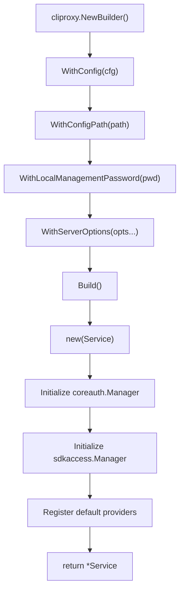
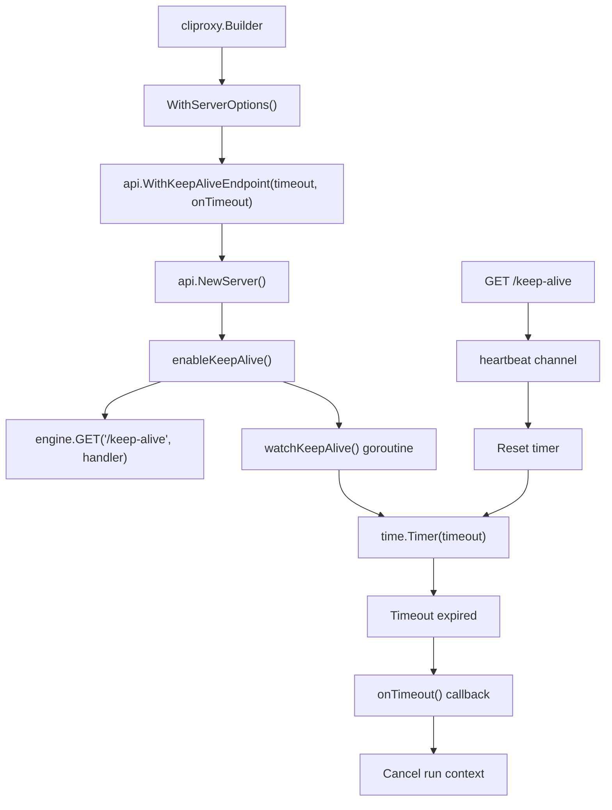
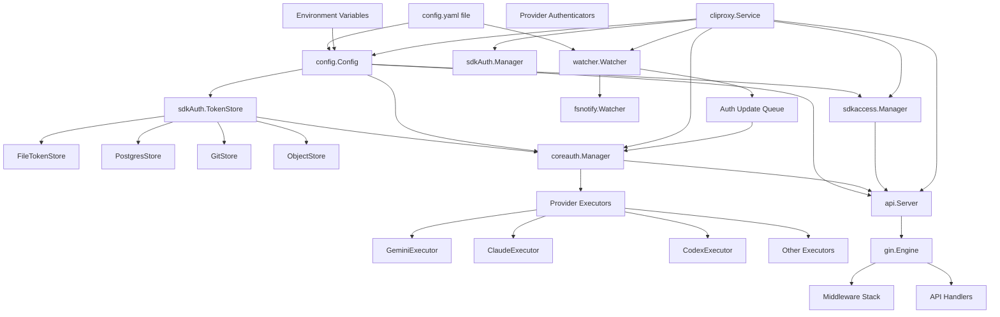
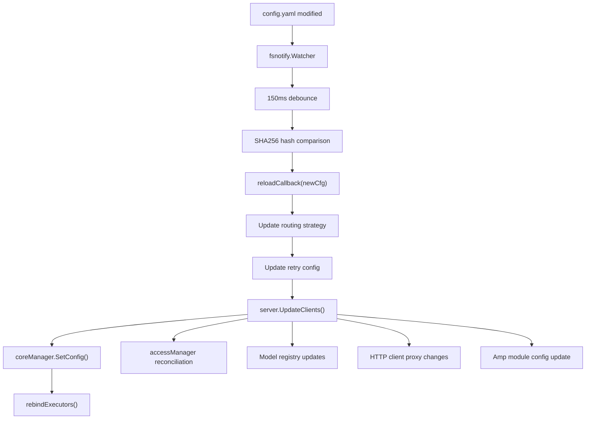

# Service Lifecycle and Initialization

Relevant source files

-   [config.example.yaml](https://github.com/router-for-me/CLIProxyAPI/blob/c66cb0af/config.example.yaml)
-   [docs/sdk-access.md](https://github.com/router-for-me/CLIProxyAPI/blob/c66cb0af/docs/sdk-access.md)
-   [docs/sdk-access\_CN.md](https://github.com/router-for-me/CLIProxyAPI/blob/c66cb0af/docs/sdk-access_CN.md)
-   [internal/access/config\_access/provider.go](https://github.com/router-for-me/CLIProxyAPI/blob/c66cb0af/internal/access/config_access/provider.go)
-   [internal/access/reconcile.go](https://github.com/router-for-me/CLIProxyAPI/blob/c66cb0af/internal/access/reconcile.go)
-   [internal/api/handlers/management/config\_basic.go](https://github.com/router-for-me/CLIProxyAPI/blob/c66cb0af/internal/api/handlers/management/config_basic.go)
-   [internal/api/handlers/management/config\_lists.go](https://github.com/router-for-me/CLIProxyAPI/blob/c66cb0af/internal/api/handlers/management/config_lists.go)
-   [internal/api/server.go](https://github.com/router-for-me/CLIProxyAPI/blob/c66cb0af/internal/api/server.go)
-   [internal/cmd/login.go](https://github.com/router-for-me/CLIProxyAPI/blob/c66cb0af/internal/cmd/login.go)
-   [internal/cmd/run.go](https://github.com/router-for-me/CLIProxyAPI/blob/c66cb0af/internal/cmd/run.go)
-   [internal/config/config.go](https://github.com/router-for-me/CLIProxyAPI/blob/c66cb0af/internal/config/config.go)
-   [internal/watcher/watcher.go](https://github.com/router-for-me/CLIProxyAPI/blob/c66cb0af/internal/watcher/watcher.go)
-   [sdk/access/errors.go](https://github.com/router-for-me/CLIProxyAPI/blob/c66cb0af/sdk/access/errors.go)
-   [sdk/access/manager.go](https://github.com/router-for-me/CLIProxyAPI/blob/c66cb0af/sdk/access/manager.go)
-   [sdk/access/registry.go](https://github.com/router-for-me/CLIProxyAPI/blob/c66cb0af/sdk/access/registry.go)
-   [sdk/cliproxy/builder.go](https://github.com/router-for-me/CLIProxyAPI/blob/c66cb0af/sdk/cliproxy/builder.go)
-   [sdk/cliproxy/service.go](https://github.com/router-for-me/CLIProxyAPI/blob/c66cb0af/sdk/cliproxy/service.go)
-   [sdk/config/config.go](https://github.com/router-for-me/CLIProxyAPI/blob/c66cb0af/sdk/config/config.go)
-   [test/amp\_management\_test.go](https://github.com/router-for-me/CLIProxyAPI/blob/c66cb0af/test/amp_management_test.go)

This document describes the complete lifecycle of the CLIProxyAPI service, from initial configuration through graceful shutdown. It covers the builder pattern used for service construction, the multi-stage initialization sequence, component dependencies, and the shutdown process.

For information about how configuration files are loaded and validated, see [Initial Configuration](/router-for-me/CLIProxyAPI/2.2-initial-configuration). For details on the HTTP server request pipeline after initialization, see [HTTP Server and Request Pipeline](/router-for-me/CLIProxyAPI/3.2-http-server-and-request-pipeline). For authentication credential lifecycle management, see [Authentication and Credential Management](/router-for-me/CLIProxyAPI/3.3-authentication-and-credential-management).

---

## Overview

The CLIProxyAPI service uses a **builder pattern** for construction and follows a well-defined initialization sequence that ensures all components are ready before accepting requests. The service manages its lifecycle through three distinct phases:

1.  **Construction Phase**: Configuration via `Builder`, option accumulation, component factory registration
2.  **Initialization Phase**: Sequential startup of authentication, HTTP server, file watchers, and background workers
3.  **Runtime Phase**: Request processing, hot-reload, signal monitoring
4.  **Shutdown Phase**: Graceful cleanup with context-based timeout control

The primary entry point is [\`cliproxy.NewBuilder()\`](https://github.com/router-for-me/CLIProxyAPI/blob/c66cb0af/`cliproxy.NewBuilder()`) which returns a `Builder` instance that accumulates configuration options. Once built, the [\`Service.Run()\`](https://github.com/router-for-me/CLIProxyAPI/blob/c66cb0af/`Service.Run()`) method executes the initialization sequence and blocks until shutdown is signaled.

**Sources**: [sdk/cliproxy/service.go1-677](https://github.com/router-for-me/CLIProxyAPI/blob/c66cb0af/sdk/cliproxy/service.go#L1-L677) [internal/cmd/run.go1-71](https://github.com/router-for-me/CLIProxyAPI/blob/c66cb0af/internal/cmd/run.go#L1-L71)

---

## Builder Pattern and Service Construction

### Builder Configuration

The `Builder` type in [\`sdk/cliproxy/builder.go\`](https://github.com/router-for-me/CLIProxyAPI/blob/c66cb0af/`sdk/cliproxy/builder.go`) implements a fluent API for configuring the service before initialization. Key builder methods include:

| Method | Purpose | Configuration Target |
| --- | --- | --- |
| `WithConfig()` | Sets application configuration | [\`config.Config\`](https://github.com/router-for-me/CLIProxyAPI/blob/c66cb0af/`config.Config`) |
| `WithConfigPath()` | Sets path to config.yaml | File system location |
| `WithLocalManagementPassword()` | Sets runtime-only management password | Management API authentication |
| `WithServerOptions()` | Adds HTTP server customization | [\`api.ServerOption\`](https://github.com/router-for-me/CLIProxyAPI/blob/c66cb0af/`api.ServerOption`) variadic functions |
| `WithHooks()` | Registers lifecycle callbacks | `OnBeforeStart`, `OnAfterStart` |

The builder defers actual construction until `Build()` is called, allowing options to be accumulated from multiple sources (CLI flags, environment variables, defaults).


**Figure 1**: Builder pattern flow for service construction. The builder accumulates options before creating the Service instance.

**Sources**: [sdk/cliproxy/builder.go](https://github.com/router-for-me/CLIProxyAPI/blob/c66cb0af/sdk/cliproxy/builder.go) [internal/cmd/run.go27-56](https://github.com/router-for-me/CLIProxyAPI/blob/c66cb0af/internal/cmd/run.go#L27-L56)

### Service Struct Components

The [\`Service\`](https://github.com/router-for-me/CLIProxyAPI/blob/c66cb0af/`Service`) struct encapsulates all runtime components:

```
type Service struct {    cfg          *config.Config           // Current configuration    configPath   string                   // Path to config.yaml    server       *api.Server              // HTTP API server    watcher      *WatcherWrapper          // File system watcher    authManager  *sdkAuth.Manager         // Legacy auth manager    accessManager *sdkaccess.Manager      // Request authentication    coreManager  *coreauth.Manager        // Core auth and execution    wsGateway    *wsrelay.Manager         // WebSocket gateway    // ... additional fields for lifecycle control}
```
Each component has a specific initialization order and lifecycle management responsibilities.

**Sources**: [sdk/cliproxy/service.go29-89](https://github.com/router-for-me/CLIProxyAPI/blob/c66cb0af/sdk/cliproxy/service.go#L29-L89)

---

## Initialization Sequence

### Startup Flow

The [\`Service.Run(ctx)\`](https://github.com/router-for-me/CLIProxyAPI/blob/c66cb0af/`Service.Run(ctx)`) method orchestrates the complete initialization sequence. The following diagram shows the sequential initialization of major components:

> **[Mermaid sequence]**
> *(图表结构无法解析)*

**Figure 2**: Complete initialization sequence from builder construction through running state.

**Sources**: [sdk/cliproxy/service.go412-594](https://github.com/router-for-me/CLIProxyAPI/blob/c66cb0af/sdk/cliproxy/service.go#L412-L594) [internal/cmd/run.go27-56](https://github.com/router-for-me/CLIProxyAPI/blob/c66cb0af/internal/cmd/run.go#L27-L56)

### Detailed Initialization Steps

#### Step 1: Usage Statistics Initialization

[\`usage.StartDefault(ctx)\`](https://github.com/router-for-me/CLIProxyAPI/blob/c66cb0af/`usage.StartDefault(ctx)`) initializes the global usage tracking subsystem, which aggregates token consumption and request metrics when `usage-statistics-enabled` is true in configuration.

**Sources**: [sdk/cliproxy/service.go420](https://github.com/router-for-me/CLIProxyAPI/blob/c66cb0af/sdk/cliproxy/service.go#L420-L420)

#### Step 2: Auth Directory Creation

[\`ensureAuthDir()\`](https://github.com/router-for-me/CLIProxyAPI/blob/c66cb0af/`ensureAuthDir()`) verifies that the configured `auth-dir` exists and is a directory, creating it with `0755` permissions if missing. This directory stores OAuth token files and service account JSON files.

**Sources**: [sdk/cliproxy/service.go430-676](https://github.com/router-for-me/CLIProxyAPI/blob/c66cb0af/sdk/cliproxy/service.go#L430-L676)

#### Step 3: Retry Configuration

[\`applyRetryConfig(cfg)\`](https://github.com/router-for-me/CLIProxyAPI/blob/c66cb0af/`applyRetryConfig(cfg)`) propagates `request-retry` and `max-retry-interval` settings from configuration to the core auth manager, which uses these values when executing provider requests.

**Sources**: [sdk/cliproxy/service.go434](https://github.com/router-for-me/CLIProxyAPI/blob/c66cb0af/sdk/cliproxy/service.go#L434-L434)

#### Step 4: Core Auth Manager Loading

[\`coreManager.Load(ctx)\`](https://github.com/router-for-me/CLIProxyAPI/blob/c66cb0af/`coreManager.Load(ctx)`) reads existing authentication credentials from the configured token store backend (file, Postgres, Git, or S3). Each loaded credential is registered in the core auth manager's internal registry.

**Sources**: [sdk/cliproxy/service.go436-440](https://github.com/router-for-me/CLIProxyAPI/blob/c66cb0af/sdk/cliproxy/service.go#L436-L440)

#### Step 5: Token and API Key Providers

The service delegates to provider interfaces for loading credentials:

-   [\`TokenClientProvider.Load(ctx, cfg)\`](https://github.com/router-for-me/CLIProxyAPI/blob/c66cb0af/`TokenClientProvider.Load(ctx, cfg)`): Loads OAuth-based clients from the token store
-   [\`APIKeyClientProvider.Load(ctx, cfg)\`](https://github.com/router-for-me/CLIProxyAPI/blob/c66cb0af/`APIKeyClientProvider.Load(ctx, cfg)`): Loads API key-based clients from configuration

These providers return results that were historically used to create legacy client objects, but in the current implementation, credentials are managed by the core auth manager.

**Sources**: [sdk/cliproxy/service.go442-456](https://github.com/router-for-me/CLIProxyAPI/blob/c66cb0af/sdk/cliproxy/service.go#L442-L456)

#### Step 6: HTTP Server Creation

[\`api.NewServer(cfg, coreManager, accessManager, configPath, opts...)\`](https://github.com/router-for-me/CLIProxyAPI/blob/c66cb0af/`api.NewServer(cfg, coreManager, accessManager, configPath, opts...)`) constructs the HTTP server with all components:

1.  **Gin Engine Setup**: Sets release/debug mode based on `cfg.Debug` [(185-201)](https://github.com/router-for-me/CLIProxyAPI/blob/c66cb0af/(185-201))
2.  **Middleware Registration**: Adds logging, recovery, CORS, request logging [(202-226)](https://github.com/router-for-me/CLIProxyAPI/blob/c66cb0af/(202-226))
3.  **Handler Initialization**: Creates OpenAI, Gemini, Claude API handlers [(238-239)](https://github.com/router-for-me/CLIProxyAPI/blob/c66cb0af/(238-239))
4.  **Route Registration**: Calls `setupRoutes()` to define all API endpoints [(268)](https://github.com/router-for-me/CLIProxyAPI/blob/c66cb0af/(268))
5.  **Management Routes**: Conditionally registers management API if secret key configured [(287-292)](https://github.com/router-for-me/CLIProxyAPI/blob/c66cb0af/(287-292))
6.  **HTTP Server Creation**: Wraps Gin engine in `http.Server` [(298-302)](https://github.com/router-for-me/CLIProxyAPI/blob/c66cb0af/(298-302))

**Sources**: [internal/api/server.go185-305](https://github.com/router-for-me/CLIProxyAPI/blob/c66cb0af/internal/api/server.go#L185-L305) [sdk/cliproxy/service.go461](https://github.com/router-for-me/CLIProxyAPI/blob/c66cb0af/sdk/cliproxy/service.go#L461-L461)

#### Step 7: WebSocket Gateway Setup

[\`ensureWebsocketGateway()\`](https://github.com/router-for-me/CLIProxyAPI/blob/c66cb0af/`ensureWebsocketGateway()`) creates a WebSocket relay manager for AI Studio runtime authentication. The gateway is attached to the HTTP server at `/v1/ws` and manages ephemeral credentials for WebSocket-based providers.

**Sources**: [sdk/cliproxy/service.go467-486](https://github.com/router-for-me/CLIProxyAPI/blob/c66cb0af/sdk/cliproxy/service.go#L467-L486)

#### Step 8: Server Start

The HTTP server starts in a background goroutine [(493-499)](https://github.com/router-for-me/CLIProxyAPI/blob/c66cb0af/(493-499)) allowing the main initialization sequence to continue. The server begins accepting connections immediately after `Start()` is called.

**Sources**: [sdk/cliproxy/service.go493-502](https://github.com/router-for-me/CLIProxyAPI/blob/c66cb0af/sdk/cliproxy/service.go#L493-L502)

#### Step 9: File Watcher Initialization

The watcher is created via the factory function [(562-566)](https://github.com/router-for-me/CLIProxyAPI/blob/c66cb0af/(562-566)) and started with its own context [(573-577)](https://github.com/router-for-me/CLIProxyAPI/blob/c66cb0af/(573-577)) It monitors:

-   **Config File**: Triggers `reloadCallback` when `config.yaml` changes
-   **Auth Directory**: Detects new/modified/deleted auth files and emits `AuthUpdate` events

**Sources**: [sdk/cliproxy/service.go562-579](https://github.com/router-for-me/CLIProxyAPI/blob/c66cb0af/sdk/cliproxy/service.go#L562-L579) [internal/watcher/watcher.go1-148](https://github.com/router-for-me/CLIProxyAPI/blob/c66cb0af/internal/watcher/watcher.go#L1-L148)

#### Step 10: Auto-Refresh Worker

[\`coreManager.StartAutoRefresh(ctx, 15\*time.Minute)\`](https://github.com/router-for-me/CLIProxyAPI/blob/c66cb0af/`coreManager.StartAutoRefresh(ctx, 15*time.Minute)`) launches a background goroutine that periodically checks all registered credentials for token expiry and refreshes them before they become invalid.

**Sources**: [sdk/cliproxy/service.go581-585](https://github.com/router-for-me/CLIProxyAPI/blob/c66cb0af/sdk/cliproxy/service.go#L581-L585)

---

## Signal Handling and Keep-Alive

### Graceful Shutdown via Signals

The service uses `signal.NotifyContext()` to listen for operating system signals [(33-34)](https://github.com/router-for-me/CLIProxyAPI/blob/c66cb0af/(33-34)):

```
ctxSignal, cancel := signal.NotifyContext(context.Background(),     syscall.SIGINT, syscall.SIGTERM)defer cancel()
```
When a signal is received, the context is cancelled, which cascades through all components:

1.  `Service.Run()` exits its blocking select statement [(587-593)](https://github.com/router-for-me/CLIProxyAPI/blob/c66cb0af/(587-593))
2.  Deferred `Shutdown(ctx)` call executes cleanup [(423-428)](https://github.com/router-for-me/CLIProxyAPI/blob/c66cb0af/(423-428))
3.  All background workers observe context cancellation and terminate

**Sources**: [internal/cmd/run.go33-34](https://github.com/router-for-me/CLIProxyAPI/blob/c66cb0af/internal/cmd/run.go#L33-L34) [sdk/cliproxy/service.go587-593](https://github.com/router-for-me/CLIProxyAPI/blob/c66cb0af/sdk/cliproxy/service.go#L587-L593)

### Keep-Alive Mechanism

The keep-alive feature enables automatic shutdown after a period of inactivity, useful for development environments or short-lived server instances.


**Figure 3**: Keep-alive mechanism for automatic shutdown after inactivity.

#### Keep-Alive Implementation

The keep-alive endpoint is configured via [\`api.WithKeepAliveEndpoint(timeout, onTimeout)\`](https://github.com/router-for-me/CLIProxyAPI/blob/c66cb0af/`api.WithKeepAliveEndpoint(timeout, onTimeout)`):

```
builder.WithServerOptions(api.WithKeepAliveEndpoint(10*time.Second, func() {    log.Warn("keep-alive endpoint idle for 10s, shutting down")    keepAliveCancel() // Cancels the run context}))
```
When enabled, the server:

1.  Registers a `GET /keep-alive` endpoint [(681)](https://github.com/router-for-me/CLIProxyAPI/blob/c66cb0af/(681))
2.  Starts a `watchKeepAlive()` goroutine with a timer [(718-746)](https://github.com/router-for-me/CLIProxyAPI/blob/c66cb0af/(718-746))
3.  Resets the timer on each request to `/keep-alive` [(734-741)](https://github.com/router-for-me/CLIProxyAPI/blob/c66cb0af/(734-741))
4.  Invokes `onTimeout()` callback if timer expires without reset [(728-732)](https://github.com/router-for-me/CLIProxyAPI/blob/c66cb0af/(728-732))

**Sources**: [internal/api/server.go95-746](https://github.com/router-for-me/CLIProxyAPI/blob/c66cb0af/internal/api/server.go#L95-L746) [internal/cmd/run.go38-44](https://github.com/router-for-me/CLIProxyAPI/blob/c66cb0af/internal/cmd/run.go#L38-L44)

---

## Component Dependencies

The following diagram illustrates the dependency relationships between major service components during initialization:


**Figure 4**: Component dependency graph showing initialization order constraints. Components are initialized top-to-bottom, respecting dependencies.

**Sources**: [sdk/cliproxy/service.go29-89](https://github.com/router-for-me/CLIProxyAPI/blob/c66cb0af/sdk/cliproxy/service.go#L29-L89) [internal/api/server.go114-173](https://github.com/router-for-me/CLIProxyAPI/blob/c66cb0af/internal/api/server.go#L114-L173)

---

## Shutdown Sequence

### Graceful Shutdown Process

The [\`Service.Shutdown(ctx)\`](https://github.com/router-for-me/CLIProxyAPI/blob/c66cb0af/`Service.Shutdown(ctx)`) method ensures all components are cleanly stopped:

> **[Mermaid sequence]**
> *(图表结构无法解析)*

**Figure 5**: Graceful shutdown sequence ensuring all components are cleanly stopped.

**Sources**: [sdk/cliproxy/service.go605-658](https://github.com/router-for-me/CLIProxyAPI/blob/c66cb0af/sdk/cliproxy/service.go#L605-L658)

### Shutdown Steps Detail

1.  **Watcher Context Cancellation** [(617-619)](https://github.com/router-for-me/CLIProxyAPI/blob/c66cb0af/(617-619)): Stops file system monitoring immediately
2.  **Core Auth Auto-Refresh Stop** [(620-622)](https://github.com/router-for-me/CLIProxyAPI/blob/c66cb0af/(620-622)): Terminates token refresh worker
3.  **Watcher Stop** [(623-628)](https://github.com/router-for-me/CLIProxyAPI/blob/c66cb0af/(623-628)): Closes fsnotify watcher and cleanup
4.  **WebSocket Gateway Stop** [(629-636)](https://github.com/router-for-me/CLIProxyAPI/blob/c66cb0af/(629-636)): Terminates all active WebSocket connections
5.  **Auth Queue Cancellation** [(637-640)](https://github.com/router-for-me/CLIProxyAPI/blob/c66cb0af/(637-640)): Stops auth update processing goroutine
6.  **HTTP Server Graceful Shutdown** [(644-653)](https://github.com/router-for-me/CLIProxyAPI/blob/c66cb0af/(644-653)): Waits up to 30 seconds for active requests to complete
7.  **Usage Statistics Stop** [(655)](https://github.com/router-for-me/CLIProxyAPI/blob/c66cb0af/(655)): Flushes aggregated statistics

The shutdown process uses [\`sync.Once\`](https://github.com/router-for-me/CLIProxyAPI/blob/c66cb0af/`sync.Once`) to ensure idempotent shutdown—calling `Shutdown()` multiple times is safe.

**Sources**: [sdk/cliproxy/service.go605-658](https://github.com/router-for-me/CLIProxyAPI/blob/c66cb0af/sdk/cliproxy/service.go#L605-L658)

### HTTP Server Shutdown Detail

The HTTP server's [\`Stop(ctx)\`](https://github.com/router-for-me/CLIProxyAPI/blob/c66cb0af/`Stop(ctx)`) method:

1.  Signals keep-alive watcher to terminate [(810-815)](https://github.com/router-for-me/CLIProxyAPI/blob/c66cb0af/(810-815))
2.  Calls `http.Server.Shutdown(ctx)` with the provided context [(818)](https://github.com/router-for-me/CLIProxyAPI/blob/c66cb0af/(818))
3.  Waits for all active connections to close or context timeout
4.  Returns error if shutdown fails [(818-820)](https://github.com/router-for-me/CLIProxyAPI/blob/c66cb0af/(818-820))

The default shutdown timeout is 30 seconds [(422)](https://github.com/router-for-me/CLIProxyAPI/blob/c66cb0af/(422)) but can be overridden by the context passed to `Shutdown()`.

**Sources**: [internal/api/server.go807-824](https://github.com/router-for-me/CLIProxyAPI/blob/c66cb0af/internal/api/server.go#L807-L824) [sdk/cliproxy/service.go422](https://github.com/router-for-me/CLIProxyAPI/blob/c66cb0af/sdk/cliproxy/service.go#L422-L422)

---

## Configuration Reload

### Hot Reload Architecture

The file watcher triggers configuration reloads without restarting the service. When `config.yaml` changes, the watcher invokes a callback that updates all components:


**Figure 6**: Configuration hot-reload flow triggered by file system events. Updates propagate to all components without restarting the service.

**Sources**: [sdk/cliproxy/service.go508-560](https://github.com/router-for-me/CLIProxyAPI/blob/c66cb0af/sdk/cliproxy/service.go#L508-L560) [internal/watcher/watcher.go1-148](https://github.com/router-for-me/CLIProxyAPI/blob/c66cb0af/internal/watcher/watcher.go#L1-L148)

### Reload Callback Implementation

The [\`reloadCallback\`](https://github.com/router-for-me/CLIProxyAPI/blob/c66cb0af/`reloadCallback`) function in `Service.Run()`:

1.  **Strategy Update** [(510-546)](https://github.com/router-for-me/CLIProxyAPI/blob/c66cb0af/(510-546)): Changes credential selection strategy (round-robin ↔ fill-first)
2.  **Retry Config** [(548)](https://github.com/router-for-me/CLIProxyAPI/blob/c66cb0af/(548)): Updates retry counts and intervals
3.  **Server Update** [(549-551)](https://github.com/router-for-me/CLIProxyAPI/blob/c66cb0af/(549-551)): Calls `server.UpdateClients()` to refresh all handlers
4.  **Core Auth Config** [(552-558)](https://github.com/router-for-me/CLIProxyAPI/blob/c66cb0af/(552-558)): Updates configuration and OAuth model aliases
5.  **Executor Rebinding** [(559)](https://github.com/router-for-me/CLIProxyAPI/blob/c66cb0af/(559)): Re-registers executors with updated configuration

The `server.UpdateClients()` method [(internal/api/server.go861-1002](https://github.com/router-for-me/CLIProxyAPI/blob/c66cb0af/(internal/api/server.go#L861-L1002) performs extensive differential updates:

-   Access provider reconciliation
-   Request logger enable/disable
-   Log output reconfiguration
-   Management route enable/disable based on secret key changes
-   Amp module configuration updates

For complete details on the hot-reload system, see [Hot Reload and Configuration Updates](/router-for-me/CLIProxyAPI/3.7-hot-reload-and-configuration-updates).

**Sources**: [sdk/cliproxy/service.go508-560](https://github.com/router-for-me/CLIProxyAPI/blob/c66cb0af/sdk/cliproxy/service.go#L508-L560) [internal/api/server.go861-1002](https://github.com/router-for-me/CLIProxyAPI/blob/c66cb0af/internal/api/server.go#L861-L1002)

---

## Error Handling and Recovery

### Initialization Error Handling

The initialization sequence uses context-aware error handling. If any critical component fails to initialize, the service returns an error from `Run()`:

```
if err := s.ensureAuthDir(); err != nil {    return err  // Fatal: cannot proceed without auth directory} if errLoad := s.coreManager.Load(ctx); errLoad != nil {    log.Warnf("failed to load auth store: %v", errLoad)    // Non-fatal: continue with empty auth store}
```
Critical failures (auth directory, server bind) abort initialization. Non-critical failures (auth store loading, watcher startup issues) are logged but allow the service to continue.

**Sources**: [sdk/cliproxy/service.go430-577](https://github.com/router-for-me/CLIProxyAPI/blob/c66cb0af/sdk/cliproxy/service.go#L430-L577)

### Runtime Error Recovery

The HTTP server includes Gin's recovery middleware [(205)](https://github.com/router-for-me/CLIProxyAPI/blob/c66cb0af/(205)) which:

1.  Catches panics in request handlers
2.  Logs the panic with stack trace
3.  Returns `500 Internal Server Error` to the client
4.  Prevents the panic from crashing the entire server

This ensures that errors in individual requests do not affect other concurrent requests or bring down the service.

**Sources**: [internal/api/server.go205](https://github.com/router-for-me/CLIProxyAPI/blob/c66cb0af/internal/api/server.go#L205-L205)

### Shutdown Error Aggregation

The `Shutdown()` method aggregates errors from all component shutdowns [(609, 626-627, 632-634, 648-651)](https://github.com/router-for-me/CLIProxyAPI/blob/c66cb0af/(609, 626-627, 632-634, 648-651)) returning the first error encountered while continuing to shut down remaining components. This ensures cleanup is attempted for all components even if some fail.

**Sources**: [sdk/cliproxy/service.go605-658](https://github.com/router-for-me/CLIProxyAPI/blob/c66cb0af/sdk/cliproxy/service.go#L605-L658)

---

## Summary

The CLIProxyAPI service lifecycle follows a well-defined pattern:

1.  **Construction**: Builder pattern accumulates configuration options
2.  **Initialization**: Sequential startup ensures dependency order
3.  **Runtime**: Concurrent request processing, hot-reload, signal monitoring
4.  **Shutdown**: Graceful cleanup with timeout control

Key design principles:

-   **Fail Fast**: Critical initialization failures abort startup
-   **Degrade Gracefully**: Non-critical failures allow partial operation
-   **Context Propagation**: Cancellation signals cascade through all components
-   **Idempotent Shutdown**: Safe to call multiple times via `sync.Once`
-   **Hot Reload**: Configuration changes propagate without restart

The service achieves zero-downtime configuration updates through differential reload callbacks and supports both long-running server deployments and development scenarios with keep-alive timeouts.

**Sources**: [sdk/cliproxy/service.go1-677](https://github.com/router-for-me/CLIProxyAPI/blob/c66cb0af/sdk/cliproxy/service.go#L1-L677) [internal/api/server.go1-1049](https://github.com/router-for-me/CLIProxyAPI/blob/c66cb0af/internal/api/server.go#L1-L1049) [internal/cmd/run.go1-71](https://github.com/router-for-me/CLIProxyAPI/blob/c66cb0af/internal/cmd/run.go#L1-L71)
