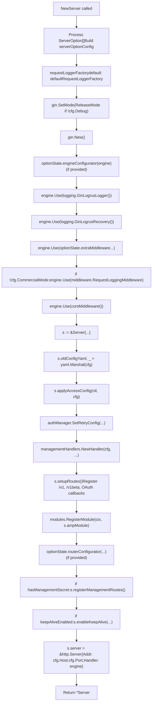
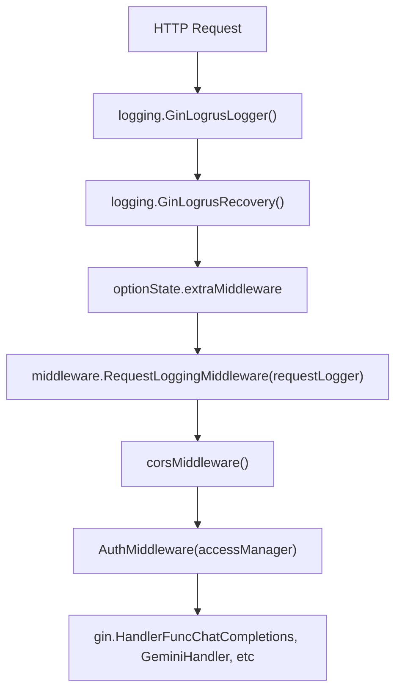
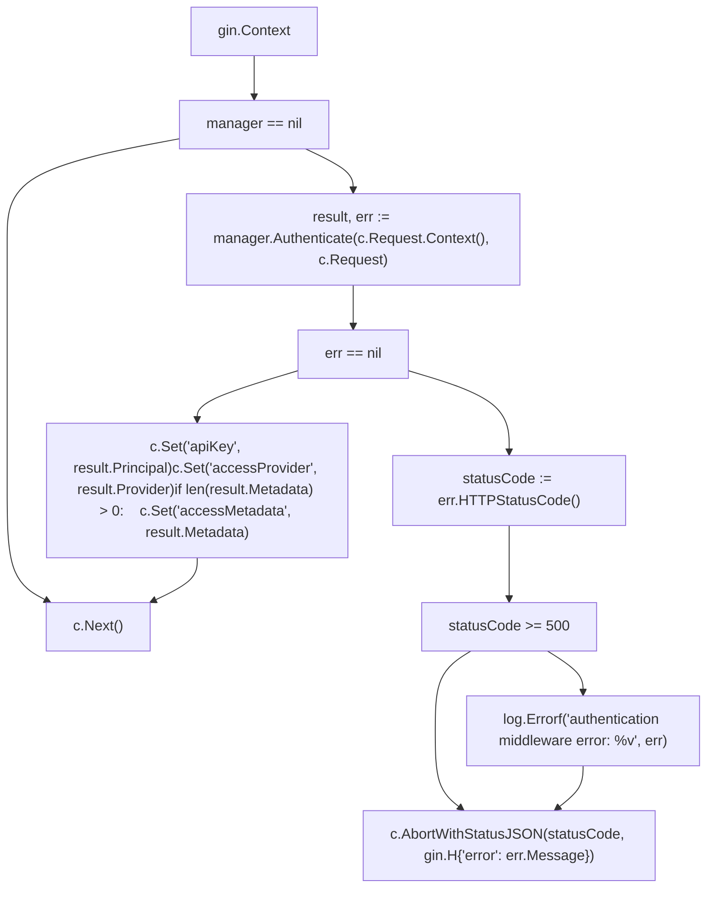
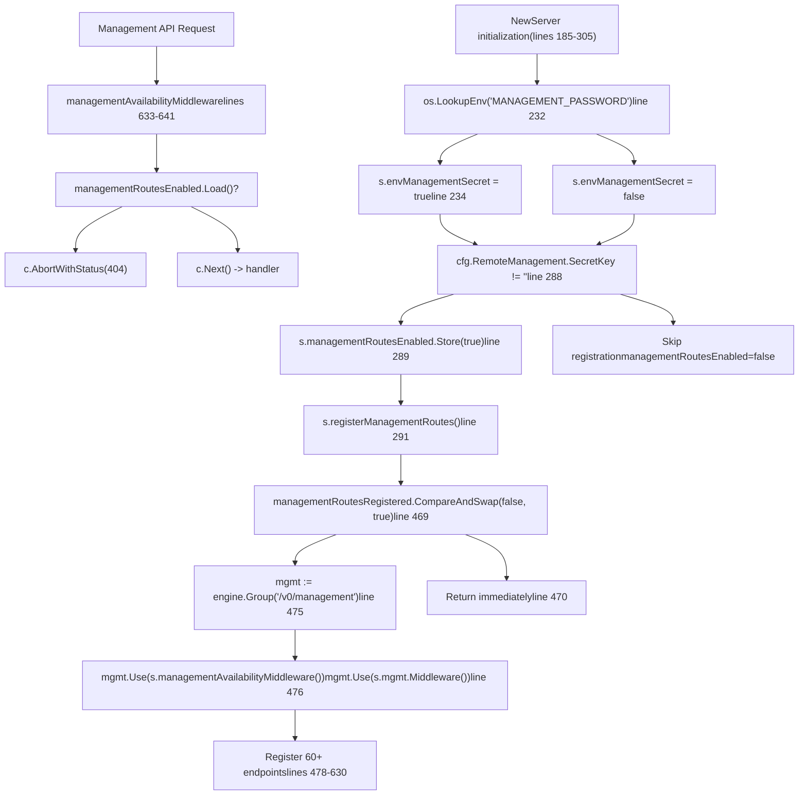
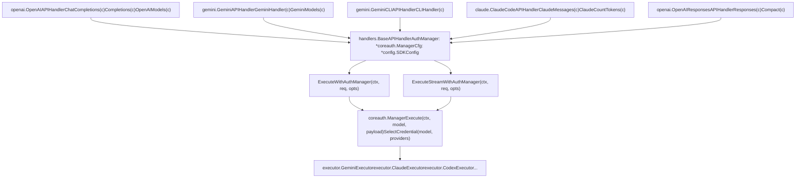
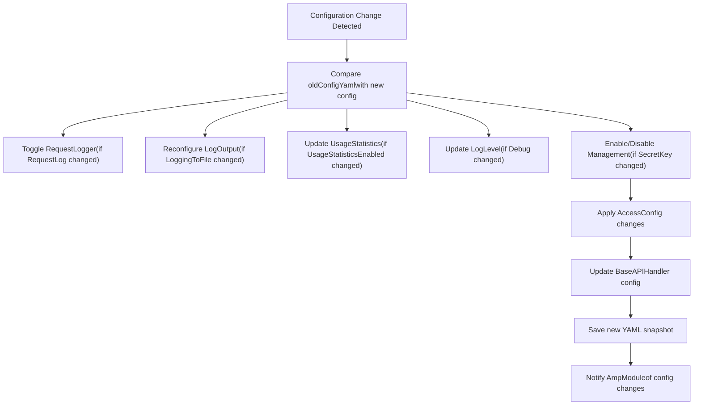
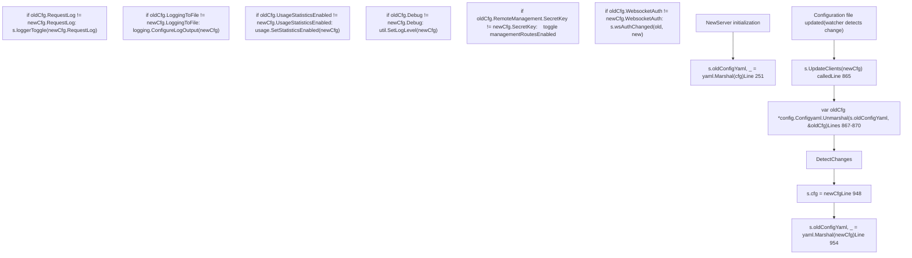

# HTTP Server and Request Pipeline

Relevant source files

-   [config.example.yaml](https://github.com/router-for-me/CLIProxyAPI/blob/c66cb0af/config.example.yaml)
-   [internal/api/handlers/management/config\_basic.go](https://github.com/router-for-me/CLIProxyAPI/blob/c66cb0af/internal/api/handlers/management/config_basic.go)
-   [internal/api/handlers/management/config\_lists.go](https://github.com/router-for-me/CLIProxyAPI/blob/c66cb0af/internal/api/handlers/management/config_lists.go)
-   [internal/api/middleware/request\_logging\_test.go](https://github.com/router-for-me/CLIProxyAPI/blob/c66cb0af/internal/api/middleware/request_logging_test.go)
-   [internal/api/middleware/response\_writer\_test.go](https://github.com/router-for-me/CLIProxyAPI/blob/c66cb0af/internal/api/middleware/response_writer_test.go)
-   [internal/api/server.go](https://github.com/router-for-me/CLIProxyAPI/blob/c66cb0af/internal/api/server.go)
-   [internal/config/config.go](https://github.com/router-for-me/CLIProxyAPI/blob/c66cb0af/internal/config/config.go)
-   [internal/config/sdk\_config.go](https://github.com/router-for-me/CLIProxyAPI/blob/c66cb0af/internal/config/sdk_config.go)
-   [internal/runtime/executor/codex\_websockets\_executor.go](https://github.com/router-for-me/CLIProxyAPI/blob/c66cb0af/internal/runtime/executor/codex_websockets_executor.go)
-   [internal/watcher/watcher.go](https://github.com/router-for-me/CLIProxyAPI/blob/c66cb0af/internal/watcher/watcher.go)
-   [sdk/api/handlers/claude/code\_handlers.go](https://github.com/router-for-me/CLIProxyAPI/blob/c66cb0af/sdk/api/handlers/claude/code_handlers.go)
-   [sdk/api/handlers/gemini/gemini\_handlers.go](https://github.com/router-for-me/CLIProxyAPI/blob/c66cb0af/sdk/api/handlers/gemini/gemini_handlers.go)
-   [sdk/api/handlers/handlers.go](https://github.com/router-for-me/CLIProxyAPI/blob/c66cb0af/sdk/api/handlers/handlers.go)
-   [sdk/api/handlers/handlers\_stream\_bootstrap\_test.go](https://github.com/router-for-me/CLIProxyAPI/blob/c66cb0af/sdk/api/handlers/handlers_stream_bootstrap_test.go)
-   [sdk/api/handlers/header\_filter.go](https://github.com/router-for-me/CLIProxyAPI/blob/c66cb0af/sdk/api/handlers/header_filter.go)
-   [sdk/api/handlers/header\_filter\_test.go](https://github.com/router-for-me/CLIProxyAPI/blob/c66cb0af/sdk/api/handlers/header_filter_test.go)
-   [sdk/api/handlers/openai/openai\_handlers.go](https://github.com/router-for-me/CLIProxyAPI/blob/c66cb0af/sdk/api/handlers/openai/openai_handlers.go)
-   [sdk/api/handlers/openai/openai\_responses\_handlers.go](https://github.com/router-for-me/CLIProxyAPI/blob/c66cb0af/sdk/api/handlers/openai/openai_responses_handlers.go)
-   [sdk/api/handlers/openai/openai\_responses\_handlers\_stream\_error\_test.go](https://github.com/router-for-me/CLIProxyAPI/blob/c66cb0af/sdk/api/handlers/openai/openai_responses_handlers_stream_error_test.go)
-   [sdk/api/handlers/openai/openai\_responses\_websocket.go](https://github.com/router-for-me/CLIProxyAPI/blob/c66cb0af/sdk/api/handlers/openai/openai_responses_websocket.go)
-   [sdk/api/handlers/openai\_responses\_stream\_error.go](https://github.com/router-for-me/CLIProxyAPI/blob/c66cb0af/sdk/api/handlers/openai_responses_stream_error.go)
-   [sdk/api/handlers/openai\_responses\_stream\_error\_test.go](https://github.com/router-for-me/CLIProxyAPI/blob/c66cb0af/sdk/api/handlers/openai_responses_stream_error_test.go)
-   [sdk/cliproxy/auth/conductor\_executor\_replace\_test.go](https://github.com/router-for-me/CLIProxyAPI/blob/c66cb0af/sdk/cliproxy/auth/conductor_executor_replace_test.go)
-   [sdk/cliproxy/service.go](https://github.com/router-for-me/CLIProxyAPI/blob/c66cb0af/sdk/cliproxy/service.go)
-   [test/amp\_management\_test.go](https://github.com/router-for-me/CLIProxyAPI/blob/c66cb0af/test/amp_management_test.go)

This document details the HTTP server architecture and request processing pipeline in CLIProxyAPI. It covers server initialization, middleware stack, route registration, and the flow of requests from client to provider executor.

For authentication and credential management details, see [Authentication and Credential Management](/router-for-me/CLIProxyAPI/3.3-authentication-and-credential-management). For provider executor implementations, see [Provider Executor System](/router-for-me/CLIProxyAPI/3.4-provider-executor-system). For configuration hot-reload mechanisms, see [Service Lifecycle and Hot Reload](/router-for-me/CLIProxyAPI/3.1-service-lifecycle-and-initialization).

---

## Overview

The HTTP server is built on the Gin web framework and provides multiple API surfaces:

-   **OpenAI-compatible endpoints** (`/v1/*`) for chat completions, completions, and responses API
-   **Gemini endpoints** (`/v1beta/*`) for native Gemini API format
-   **Claude endpoints** (`/v1/messages`) for Anthropic-style messages API
-   **Management API** (`/v0/management/*`) for configuration and administration
-   **Amp integration routes** (`/api/provider/:provider/*`) for Amp CLI proxy support
-   **OAuth callback endpoints** for authentication flow completion
-   **WebSocket relay** (`/v1/ws`) for AI Studio provider connections

The server supports TLS, hot-reload, conditional middleware, and multi-protocol request translation.

**Sources:** [internal/api/server.go1-307](https://github.com/router-for-me/CLIProxyAPI/blob/c66cb0af/internal/api/server.go#L1-L307)

---

## Server Structure and Initialization

### Server struct

The `api.Server` struct encapsulates the HTTP server state and dependencies:

**Title: Server Struct Fields and Their Roles**

```mermaid
flowchart TD
    KeepAlive["keepAliveHeartbeatchan struct{}Heartbeat signal"]
    KeepAliveStop["keepAliveStopchan struct{}Shutdown signal"]
    Amp["ampModule*ampmodule.AmpModuleAmp CLI routing"]
    WSRoutes["wsRoutesmap[string]struct{}Registered WS paths"]
    WSAuthEnabled["wsAuthEnabledatomic.BoolWebSocket auth toggle"]
    Engine["engine*gin.EngineRoutes & middleware"]
    HTTPServer["server*http.ServerTCP listener"]
    Handlers["handlers*handlers.BaseAPIHandlerProtocol handlers"]
    AccessMgr["accessManager*sdkaccess.ManagerRequest authentication"]
    ReqLogger["requestLoggerlogging.RequestLoggerRequest/response capture"]
    Config["cfg*config.ConfigCurrent config snapshot"]
    OldYAML["oldConfigYaml[]byteYAML snapshot for diff"]
    ConfigPath["configFilePathstringAbsolute config path"]
    Mgmt["mgmt*managementHandlers.HandlerAdmin API logic"]
    MgmtEnabled["managementRoutesEnabledatomic.BoolDynamic enable/disable"]
    MgmtRegistered["managementRoutesRegisteredatomic.BoolRegistration guard"]
    EnvSecret["envManagementSecretboolMANAGEMENT_PASSWORD set"]

    Engine --> Handlers
    Handlers --> AccessMgr
    Config --> Mgmt
    Mgmt --> MgmtEnabled
```


| Field | Type | Purpose |
| --- | --- | --- |
| `engine` | `*gin.Engine` | Gin framework instance managing routes and middleware |
| `server` | `*http.Server` | Underlying Go HTTP server with TCP listener |
| `handlers` | `*handlers.BaseAPIHandler` | Base handler providing `ExecuteWithAuthManager` and `ExecuteStreamWithAuthManager` |
| `cfg` | `*config.Config` | Current configuration snapshot |
| `oldConfigYaml` | `[]byte` | YAML-serialized previous config for change detection |
| `accessManager` | `*sdkaccess.Manager` | Request authentication provider manager |
| `requestLogger` | `logging.RequestLogger` | Request/response logging subsystem (nil if `CommercialMode`) |
| `loggerToggle` | `func(bool)` | Toggles request logger via `SetEnabled(bool)` |
| `configFilePath` | `string` | Absolute path to config.yaml for persistence |
| `mgmt` | `*managementHandlers.Handler` | Management API handler with auth middleware |
| `ampModule` | `*ampmodule.AmpModule` | Amp CLI integration for model mapping and upstream proxy |
| `managementRoutesRegistered` | `atomic.Bool` | Idempotency guard preventing duplicate route registration |
| `managementRoutesEnabled` | `atomic.Bool` | Runtime flag controlling management endpoint availability (checked by middleware) |
| `envManagementSecret` | `bool` | Indicates MANAGEMENT\_PASSWORD environment variable is set |
| `wsRoutes` | `map[string]struct{}` | Tracks registered WebSocket upgrade paths |
| `wsAuthEnabled` | `atomic.Bool` | Synchronized with `cfg.WebsocketAuth` for dynamic auth toggle |
| `keepAliveHeartbeat` | `chan struct{}` | Signals heartbeat to watchdog goroutine |
| `keepAliveStop` | `chan struct{}` | Signals shutdown to watchdog goroutine |

**Sources:** [internal/api/server.go114-173](https://github.com/router-for-me/CLIProxyAPI/blob/c66cb0af/internal/api/server.go#L114-L173)

### NewServer Constructor

The `NewServer` function initializes the server with layered configuration:

```
func NewServer(    cfg *config.Config,    authManager *auth.Manager,    accessManager *sdkaccess.Manager,    configFilePath string,    opts ...ServerOption) *Server
```
**Title: NewServer Initialization Flow**


Initialization sequence:

1.  **Option processing** - Collects `ServerOption` functions into `serverOptionConfig` (lines 186-191)
2.  **Mode selection** - Calls `gin.SetMode(gin.ReleaseMode)` unless `cfg.Debug` is true (lines 193-195)
3.  **Engine creation** - Creates `gin.Engine` via `gin.New()` (line 198)
4.  **Engine configuration** - Applies optional `engineConfigurator` before middleware (lines 199-201)
5.  **Middleware attachment** - Applies middleware in order (lines 204-226):
    -   `logging.GinLogrusLogger()` - Request start/end logging with Logrus
    -   `logging.GinLogrusRecovery()` - Panic recovery with stack traces
    -   Custom middleware from `optionState.extraMiddleware`
    -   `middleware.RequestLoggingMiddleware(requestLogger)` - Detailed request/response capture (skipped if `cfg.CommercialMode`)
    -   `corsMiddleware()` - CORS header injection
6.  **Server struct creation** - Initializes `Server` with all fields (lines 237-248)
7.  **Initial state** - Saves YAML snapshot, applies access config, sets retry config (lines 250-257)
8.  **Handler initialization** - Creates base API handler via `handlers.NewBaseAPIHandlers(&cfg.SDKConfig, authManager)` (line 239)
9.  **Management handler** - Initializes via `managementHandlers.NewHandler(cfg, configFilePath, authManager)` (line 259)
10.  **Route registration** - Calls `s.setupRoutes()` to register all endpoints (line 268)
11.  **Module registration** - Registers Amp module via `modules.RegisterModule(ctx, s.ampModule)` (line 278)
12.  **Custom router config** - Applies optional `routerConfigurator` (lines 283-285)
13.  **Management route registration** - Conditionally registers if `hasManagementSecret` (lines 288-292)
14.  **Keep-alive setup** - Enables keep-alive endpoint if requested (lines 294-296)
15.  **HTTP server creation** - Wraps engine in `http.Server` with configured address (lines 298-302)

**Sources:** [internal/api/server.go185-305](https://github.com/router-for-me/CLIProxyAPI/blob/c66cb0af/internal/api/server.go#L185-L305)

### ServerOption Pattern

The server supports functional options for customization:

| Option | Purpose |
| --- | --- |
| `WithMiddleware(mw ...gin.HandlerFunc)` | Appends additional Gin middleware |
| `WithEngineConfigurator(fn)` | Mutates engine before middleware setup |
| `WithRouterConfigurator(fn)` | Registers custom routes after defaults |
| `WithLocalManagementPassword(password)` | Sets runtime management password for localhost |
| `WithKeepAliveEndpoint(timeout, onTimeout)` | Enables keep-alive monitoring endpoint |
| `WithRequestLoggerFactory(factory)` | Custom request logger creation |

**Sources:** [internal/api/server.go44-111](https://github.com/router-for-me/CLIProxyAPI/blob/c66cb0af/internal/api/server.go#L44-L111)

---

## Middleware Stack

### Middleware Execution Order

**Title: Gin Middleware Stack Execution Order**

Requests traverse middleware in this sequence:


**Global Middleware (applied to all routes):**

| Order | Middleware Function | Location | Purpose |
| --- | --- | --- | --- |
| 1 | `logging.GinLogrusLogger()` | [internal/api/server.go204](https://github.com/router-for-me/CLIProxyAPI/blob/c66cb0af/internal/api/server.go#L204-L204) | Request logging with Logrus (start/end, status, latency) |
| 2 | `logging.GinLogrusRecovery()` | [internal/api/server.go205](https://github.com/router-for-me/CLIProxyAPI/blob/c66cb0af/internal/api/server.go#L205-L205) | Panic recovery with stack trace logging |
| 3 | Custom middleware | [internal/api/server.go206-208](https://github.com/router-for-me/CLIProxyAPI/blob/c66cb0af/internal/api/server.go#L206-L208) | User-defined middleware from `ServerOption` |
| 4 | `middleware.RequestLoggingMiddleware(requestLogger)` | [internal/api/server.go219](https://github.com/router-for-me/CLIProxyAPI/blob/c66cb0af/internal/api/server.go#L219-L219) | Request/response body capture (skipped if `cfg.CommercialMode`) |
| 5 | `corsMiddleware()` | [internal/api/server.go226](https://github.com/router-for-me/CLIProxyAPI/blob/c66cb0af/internal/api/server.go#L226-L226) | CORS header injection |

**Route Group Middleware (applied per group):**

| Group | Middleware | Application Point | Purpose |
| --- | --- | --- | --- |
| `/v1` | `AuthMiddleware(s.accessManager)` | [internal/api/server.go319](https://github.com/router-for-me/CLIProxyAPI/blob/c66cb0af/internal/api/server.go#L319-L319) | API key validation for OpenAI/Claude endpoints |
| `/v1beta` | `AuthMiddleware(s.accessManager)` | [internal/api/server.go332](https://github.com/router-for-me/CLIProxyAPI/blob/c66cb0af/internal/api/server.go#L332-L332) | API key validation for Gemini endpoints |
| `/v0/management` | `s.managementAvailabilityMiddleware()` + `s.mgmt.Middleware()` | [internal/api/server.go476](https://github.com/router-for-me/CLIProxyAPI/blob/c66cb0af/internal/api/server.go#L476-L476) | Dynamic enable/disable + secret key validation |

**Sources:** [internal/api/server.go203-226](https://github.com/router-for-me/CLIProxyAPI/blob/c66cb0af/internal/api/server.go#L203-L226) [internal/api/server.go319](https://github.com/router-for-me/CLIProxyAPI/blob/c66cb0af/internal/api/server.go#L319-L319) [internal/api/server.go332](https://github.com/router-for-me/CLIProxyAPI/blob/c66cb0af/internal/api/server.go#L332-L332) [internal/api/server.go476](https://github.com/router-for-me/CLIProxyAPI/blob/c66cb0af/internal/api/server.go#L476-L476)

### CORS Middleware

The `corsMiddleware` function injects permissive CORS headers on all responses:

-   `Access-Control-Allow-Origin: *`
-   `Access-Control-Allow-Methods: GET, POST, PUT, PATCH, DELETE, OPTIONS`
-   `Access-Control-Allow-Headers: *`

Preflight `OPTIONS` requests return `204 No Content` immediately.

**Sources:** [internal/api/server.go826-839](https://github.com/router-for-me/CLIProxyAPI/blob/c66cb0af/internal/api/server.go#L826-L839)

### Authentication Middleware

`AuthMiddleware` is applied per-route group via `v1.Use()` and `v1beta.Use()`. Function signature:

```
func AuthMiddleware(manager *sdkaccess.Manager) gin.HandlerFunc
```
**Title: AuthMiddleware Request Processing Flow**


**Context Values Set on Success:**

| Key | Source | Type | Purpose |
| --- | --- | --- | --- |
| `apiKey` | `result.Principal` | `string` | Authenticated API key or user identifier |
| `accessProvider` | `result.Provider` | `string` | Provider name that validated credential |
| `accessMetadata` | `result.Metadata` | `map[string]any` | Optional provider-specific metadata (set only if non-empty) |

These context values are retrieved by handlers via `c.Get("apiKey")` for usage tracking and logging.

**Sources:** [internal/api/server.go1016-1042](https://github.com/router-for-me/CLIProxyAPI/blob/c66cb0af/internal/api/server.go#L1016-L1042)

### Request Logging Middleware

When `cfg.RequestLog` is enabled and `cfg.CommercialMode` is false, the `RequestLoggingMiddleware` captures:

-   Request headers, method, path, query parameters
-   Request body (for POST/PUT/PATCH)
-   Response status code
-   Response body
-   Timing information

The logger is hot-reloadable via `SetEnabled(bool)` interface.

**Sources:** [internal/api/server.go214-223](https://github.com/router-for-me/CLIProxyAPI/blob/c66cb0af/internal/api/server.go#L214-L223) [internal/api/middleware/request\_logging.go](https://github.com/router-for-me/CLIProxyAPI/blob/c66cb0af/internal/api/middleware/request_logging.go)

---

## Route Registration

### setupRoutes Overview

The `setupRoutes` method registers all HTTP endpoints:

```mermaid
flowchart TD
    OAuthAnth["engine.GET('/anthropic/callback')"]
    OAuthCodex["engine.GET('/codex/callback')"]
    OAuthGoogle["engine.GET('/google/callback')"]
    OAuthIFlow["engine.GET('/iflow/callback')"]
    OAuthAntigrav["engine.GET('/antigravity/callback')"]
    Root["engine.GET('/')"]
    MgmtHTML["engine.GET('/management.html')"]
    KeepAlive["engine.GET('/keep-alive')(if keepAliveEnabled)"]
    Internal["engine.POST('/v1internal:method')"]
    V1["v1 := engine.Group('/v1')"]
    V1Beta["v1beta := engine.Group('/v1beta')"]
    Mgmt["mgmt := engine.Group('/v0/management')"]
    V1Handlers["openaiHandlers.claudeCodeHandlers.openaiResponsesHandlers.*"]
    GeminiHandlers["geminiHandlers.*"]
    MgmtHandlers["s.mgmt.Get*/Put*/Post*/Delete*"]

    V1 --> V1Handlers
    V1Beta --> GeminiHandlers
    Mgmt --> MgmtHandlers
```


**Sources:** [internal/api/server.go309-427](https://github.com/router-for-me/CLIProxyAPI/blob/c66cb0af/internal/api/server.go#L309-L427) [internal/api/server.go466-626](https://github.com/router-for-me/CLIProxyAPI/blob/c66cb0af/internal/api/server.go#L466-L626)

### OpenAI-Compatible Routes (/v1)

The `/v1` route group is created at [internal/api/server.go318](https://github.com/router-for-me/CLIProxyAPI/blob/c66cb0af/internal/api/server.go#L318-L318) and serves OpenAI-compatible and Claude API endpoints:

```
v1 := s.engine.Group("/v1")v1.Use(AuthMiddleware(s.accessManager))
```
**Registered Endpoints:**

| Method | Path | Handler | Handler Type | Line |
| --- | --- | --- | --- | --- |
| GET | `/v1/models` | `s.unifiedModelsHandler(openaiHandlers, claudeCodeHandlers)` | `func(c *gin.Context)` | [internal/api/server.go321](https://github.com/router-for-me/CLIProxyAPI/blob/c66cb0af/internal/api/server.go#L321-L321) |
| POST | `/v1/chat/completions` | `openaiHandlers.ChatCompletions` | `*openai.OpenAIAPIHandler` | [internal/api/server.go322](https://github.com/router-for-me/CLIProxyAPI/blob/c66cb0af/internal/api/server.go#L322-L322) |
| POST | `/v1/completions` | `openaiHandlers.Completions` | `*openai.OpenAIAPIHandler` | [internal/api/server.go323](https://github.com/router-for-me/CLIProxyAPI/blob/c66cb0af/internal/api/server.go#L323-L323) |
| POST | `/v1/messages` | `claudeCodeHandlers.ClaudeMessages` | `*claude.ClaudeCodeAPIHandler` | [internal/api/server.go324](https://github.com/router-for-me/CLIProxyAPI/blob/c66cb0af/internal/api/server.go#L324-L324) |
| POST | `/v1/messages/count_tokens` | `claudeCodeHandlers.ClaudeCountTokens` | `*claude.ClaudeCodeAPIHandler` | [internal/api/server.go325](https://github.com/router-for-me/CLIProxyAPI/blob/c66cb0af/internal/api/server.go#L325-L325) |
| POST | `/v1/responses` | `openaiResponsesHandlers.Responses` | `*openai.OpenAIResponsesAPIHandler` | [internal/api/server.go326](https://github.com/router-for-me/CLIProxyAPI/blob/c66cb0af/internal/api/server.go#L326-L326) |
| POST | `/v1/responses/compact` | `openaiResponsesHandlers.Compact` | `*openai.OpenAIResponsesAPIHandler` | [internal/api/server.go327](https://github.com/router-for-me/CLIProxyAPI/blob/c66cb0af/internal/api/server.go#L327-L327) |

All `/v1` routes inherit `AuthMiddleware(s.accessManager)` from the group.

**Sources:** [internal/api/server.go318-328](https://github.com/router-for-me/CLIProxyAPI/blob/c66cb0af/internal/api/server.go#L318-L328)

### Unified Models Handler

The `/v1/models` endpoint uses User-Agent routing:

-   User-Agent starts with `claude-cli` → routes to `claudeHandler.ClaudeModels`
-   Otherwise → routes to `openaiHandler.OpenAIModels`

This allows Claude CLI clients to receive Claude-formatted model lists while OpenAI clients receive OpenAI-formatted lists.

**Sources:** [internal/api/server.go743-760](https://github.com/router-for-me/CLIProxyAPI/blob/c66cb0af/internal/api/server.go#L743-L760)

### Gemini Routes (/v1beta)

The `/v1beta` group provides Gemini native API format:

| Method | Path | Handler | Description |
| --- | --- | --- | --- |
| GET | `/v1beta/models` | `geminiHandlers.GeminiModels` | Lists Gemini models |
| POST | `/v1beta/models/*action` | `geminiHandlers.GeminiHandler` | Gemini operations (generateContent, etc) |
| GET | `/v1beta/models/*action` | `geminiHandlers.GeminiGetHandler` | Gemini GET operations (model info) |

The wildcard `*action` captures model ID and method, e.g., `/v1beta/models/gemini-pro:generateContent`.

**Sources:** [internal/api/server.go331-338](https://github.com/router-for-me/CLIProxyAPI/blob/c66cb0af/internal/api/server.go#L331-L338)

### Gemini CLI Internal Route

The endpoint `/v1internal:method` handles Gemini CLI client requests using a custom protocol:

```
s.engine.POST("/v1internal:method", geminiCLIHandlers.CLIHandler)
```
This route does not pass through `AuthMiddleware` as it uses request-body embedded authentication.

**Sources:** [internal/api/server.go351](https://github.com/router-for-me/CLIProxyAPI/blob/c66cb0af/internal/api/server.go#L351-L351)

### OAuth Callback Routes

OAuth callback routes receive provider redirects and persist authorization codes:

| Provider | Path | Query Params |
| --- | --- | --- |
| Anthropic | `/anthropic/callback` | `code`, `state`, `error` |
| Codex | `/codex/callback` | `code`, `state`, `error` |
| Google | `/google/callback` | `code`, `state`, `error` |
| iFlow | `/iflow/callback` | `code`, `state`, `error` |
| Antigravity | `/antigravity/callback` | `code`, `state`, `error` |

Each callback writes the received code/error to a file in `cfg.AuthDir` for the waiting OAuth goroutine to consume, then returns the success HTML page.

**Sources:** [internal/api/server.go353-425](https://github.com/router-for-me/CLIProxyAPI/blob/c66cb0af/internal/api/server.go#L353-L425)

### Management API Routes

Management routes are registered conditionally by `registerManagementRoutes()` when:

1.  `cfg.RemoteManagement.SecretKey` is configured, OR
2.  Environment variable `MANAGEMENT_PASSWORD` is set

The routes are protected by two middleware layers:

1.  `managementAvailabilityMiddleware` - Returns 404 if `managementRoutesEnabled` is false
2.  `mgmt.Middleware()` - Validates management secret key and localhost restriction

Key management endpoints include:

| Category | Endpoints | Purpose |
| --- | --- | --- |
| Configuration | `/config`, `/config.yaml` | Get/update configuration |
| Usage Stats | `/usage`, `/usage/export`, `/usage/import` | Usage data management |
| Logging | `/logs`, `/request-error-logs`, `/request-log-by-id/:id` | Log file access |
| API Keys | `/api-keys`, `/gemini-api-key`, `/claude-api-key`, `/codex-api-key` | Credential management |
| OAuth | `/anthropic-auth-url`, `/codex-auth-url`, `/gemini-cli-auth-url` | OAuth flow initiation |
| Auth Files | `/auth-files`, `/auth-files/download` | Token file management |
| Amp Config | `/ampcode/*` | Amp integration settings |
| Routing | `/routing/strategy` | Credential selection strategy |
| Settings | `/debug`, `/request-log`, `/ws-auth` | Toggle feature flags |

**Sources:** [internal/api/server.go466-626](https://github.com/router-for-me/CLIProxyAPI/blob/c66cb0af/internal/api/server.go#L466-L626)

### Management Routes Registration Logic

Management routes registration uses atomic flags to control availability:

**Title: Management Route Registration and Availability Control**


**Two-flag design:**

-   **`managementRoutesRegistered`** - Idempotency guard preventing duplicate route registration (set once, never cleared)
-   **`managementRoutesEnabled`** - Runtime availability toggle checked by `managementAvailabilityMiddleware` (can be toggled via `UpdateClients`)

The middleware `managementAvailabilityMiddleware` (lines 633-641) checks `s.managementRoutesEnabled.Load()` and returns 404 if false, enabling dynamic management API enable/disable without re-registering routes.

**Sources:** [internal/api/server.go232-234](https://github.com/router-for-me/CLIProxyAPI/blob/c66cb0af/internal/api/server.go#L232-L234) [internal/api/server.go288-292](https://github.com/router-for-me/CLIProxyAPI/blob/c66cb0af/internal/api/server.go#L288-L292) [internal/api/server.go465-631](https://github.com/router-for-me/CLIProxyAPI/blob/c66cb0af/internal/api/server.go#L465-L631) [internal/api/server.go633-641](https://github.com/router-for-me/CLIProxyAPI/blob/c66cb0af/internal/api/server.go#L633-L641)

### Root and Utility Routes

| Path | Handler | Purpose |
| --- | --- | --- |
| `/` | Anonymous handler | Returns server info and endpoint list |
| `/management.html` | `serveManagementControlPanel` | Serves management UI asset |
| `/keep-alive` | `handleKeepAlive` | Keep-alive heartbeat (when enabled) |

**Sources:** [internal/api/server.go341-350](https://github.com/router-for-me/CLIProxyAPI/blob/c66cb0af/internal/api/server.go#L341-L350) [internal/api/server.go638-663](https://github.com/router-for-me/CLIProxyAPI/blob/c66cb0af/internal/api/server.go#L638-L663) [internal/api/server.go676-701](https://github.com/router-for-me/CLIProxyAPI/blob/c66cb0af/internal/api/server.go#L676-L701)

---

## Request Flow Through Pipeline

### Complete Request Flow

**Title: Request Processing Through Server and Handler Layers**

> **[Mermaid sequence]**
> *(图表结构无法解析)*

**Pipeline Stages:**

| Stage | Components | Key Functions |
| --- | --- | --- |
| **1\. HTTP Server** | `gin.Engine`, middleware stack | `engine.ServeHTTP()`, middleware chain execution |
| **2\. Authentication** | `AuthMiddleware`, `sdkaccess.Manager` | `manager.Authenticate(ctx, req)` |
| **3\. Handler Routing** | `openai.OpenAIAPIHandler`, `gemini.GeminiAPIHandler` | `ChatCompletions(c)`, `GeminiHandler(c)` |
| **4\. Request Translation** | `handlers.BaseAPIHandler`, `sdktranslator` | `TranslateRequest(from, to, model, payload)` |
| **5\. Thinking Config** | `thinking.ParseSuffix` | Parse model suffixes like `(8192)` or `(extended)` |
| **6\. Payload Config** | `applyPayloadConfig` | Apply default/override rules from `cfg.Payload` |
| **7\. Credential Selection** | `coreauth.Manager` | `SelectCredential(model, providers)` with round-robin/fill-first |
| **8\. Provider Execution** | `executor.GeminiExecutor`, etc | `ExecuteStream(ctx, auth, req, opts)` |
| **9\. Response Translation** | `sdktranslator` | `TranslateStream(chunks)` back to client format |

**Sources:** [internal/api/server.go203-226](https://github.com/router-for-me/CLIProxyAPI/blob/c66cb0af/internal/api/server.go#L203-L226) [internal/api/server.go1016-1042](https://github.com/router-for-me/CLIProxyAPI/blob/c66cb0af/internal/api/server.go#L1016-L1042) [sdk/api/handlers/openai/openai.go](https://github.com/router-for-me/CLIProxyAPI/blob/c66cb0af/sdk/api/handlers/openai/openai.go) [sdk/api/handlers/handlers.go171-196](https://github.com/router-for-me/CLIProxyAPI/blob/c66cb0af/sdk/api/handlers/handlers.go#L171-L196)

### Handler Delegation

**Title: Handler Instantiation and BaseAPIHandler Delegation**

API handlers are instantiated in `setupRoutes` at [internal/api/server.go311-316](https://github.com/router-for-me/CLIProxyAPI/blob/c66cb0af/internal/api/server.go#L311-L316):

```
openaiHandlers := openai.NewOpenAIAPIHandler(s.handlers)geminiHandlers := gemini.NewGeminiAPIHandler(s.handlers)geminiCLIHandlers := gemini.NewGeminiCLIAPIHandler(s.handlers)claudeCodeHandlers := claude.NewClaudeCodeAPIHandler(s.handlers)openaiResponsesHandlers := openai.NewOpenAIResponsesAPIHandler(s.handlers)
```
**Handler Type Architecture:**


**BaseAPIHandler Structure:**

Located at [sdk/api/handlers/handlers.go171-196](https://github.com/router-for-me/CLIProxyAPI/blob/c66cb0af/sdk/api/handlers/handlers.go#L171-L196):

```
type BaseAPIHandler struct {    AuthManager *coreauth.Manager    Cfg         *config.SDKConfig}
```
**Key Methods:**

| Method | Signature | Purpose |
| --- | --- | --- |
| `ExecuteWithAuthManager` | `(ctx, req, opts) → ([]byte, error)` | Non-streaming request execution with credential selection |
| `ExecuteStreamWithAuthManager` | `(ctx, req, opts) → (<-chan StreamChunk, error)` | Streaming request execution returning SSE channel |

**Request Flow Through Handlers:**

1.  `openai.OpenAIAPIHandler.ChatCompletions(c)` parses request body
2.  Calls `baseHandler.ExecuteStreamWithAuthManager(ctx, req, opts)`
3.  `BaseAPIHandler` performs translation: `sdktranslator.TranslateRequest(from, to, model, payload)`
4.  Delegates to `authManager.Execute(ctx, model, payload)`
5.  `coreauth.Manager` selects credential and invokes `executor.ExecuteStream()`
6.  Executor returns translated response chunks

**Sources:** [internal/api/server.go311-316](https://github.com/router-for-me/CLIProxyAPI/blob/c66cb0af/internal/api/server.go#L311-L316) [sdk/api/handlers/handlers.go171-196](https://github.com/router-for-me/CLIProxyAPI/blob/c66cb0af/sdk/api/handlers/handlers.go#L171-L196)

---

## WebSocket Route Attachment

### AttachWebsocketRoute Method

The server supports WebSocket upgrade routes via `AttachWebsocketRoute`:

```
func (s *Server) AttachWebsocketRoute(path string, handler http.Handler) {    // Track registered websocket routes    s.wsRoutes[path] = struct{}{}        // Conditional auth middleware    conditionalAuth := func(c *gin.Context) {        if !s.wsAuthEnabled.Load() {            c.Next()            return        }        authMiddleware(c)    }        // Wrap http.Handler in Gin handler    finalHandler := func(c *gin.Context) {        handler.ServeHTTP(c.Writer, c.Request)        c.Abort()    }        s.engine.GET(path, conditionalAuth, finalHandler)}
```
The conditional auth middleware checks `wsAuthEnabled` (synchronized with `cfg.WebsocketAuth`) to enable/disable authentication dynamically.

**Sources:** [internal/api/server.go429-464](https://github.com/router-for-me/CLIProxyAPI/blob/c66cb0af/internal/api/server.go#L429-L464)

### WebSocket Auth Change Handler

The server can react to `ws-auth` config changes via `SetWebsocketAuthChangeHandler`:

```
s.server.SetWebsocketAuthChangeHandler(func(oldEnabled, newEnabled bool) {    if oldEnabled == newEnabled {        return    }    if !oldEnabled && newEnabled {        // Terminate all websocket connections when auth is enabled        _ = s.wsGateway.Stop(ctx)        log.Debugf("ws-auth enabled; existing websocket sessions terminated")    }})
```
This ensures existing unauthenticated connections are dropped when authentication is enabled.

**Sources:** [sdk/cliproxy/service.go469-484](https://github.com/router-for-me/CLIProxyAPI/blob/c66cb0af/sdk/cliproxy/service.go#L469-L484)

---

## Server Lifecycle

### Start Method

The `Start()` method begins serving HTTP or HTTPS requests:

```
func (s *Server) Start() error {    useTLS := s.cfg != nil && s.cfg.TLS.Enable    if useTLS {        cert := strings.TrimSpace(s.cfg.TLS.Cert)        key := strings.TrimSpace(s.cfg.TLS.Key)        if cert == "" || key == "" {            return fmt.Errorf("tls.cert or tls.key is empty")        }        return s.server.ListenAndServeTLS(cert, key)    }        return s.server.ListenAndServe()}
```
This is a blocking call that returns only on fatal error or when `Stop()` is called.

**Sources:** [internal/api/server.go767-792](https://github.com/router-for-me/CLIProxyAPI/blob/c66cb0af/internal/api/server.go#L767-L792)

### Stop Method

The `Stop(ctx)` method gracefully shuts down the server:

```
func (s *Server) Stop(ctx context.Context) error {    // Signal keep-alive goroutine to stop    if s.keepAliveEnabled {        s.keepAliveStop <- struct{}{}    }        // Graceful HTTP server shutdown    if err := s.server.Shutdown(ctx); err != nil {        return fmt.Errorf("failed to shutdown HTTP server: %v", err)    }        return nil}
```
The shutdown context timeout (typically 30 seconds) determines how long the server waits for active connections to complete.

**Sources:** [internal/api/server.go802-819](https://github.com/router-for-me/CLIProxyAPI/blob/c66cb0af/internal/api/server.go#L802-L819)

---

## Hot Reload Integration

### UpdateClients Method

The `UpdateClients(cfg)` method applies configuration changes without restarting the server:


**Sources:** [internal/api/server.go856-1018](https://github.com/router-for-me/CLIProxyAPI/blob/c66cb0af/internal/api/server.go#L856-L1018)

### Configuration Change Detection

**Title: UpdateClients Change Detection via YAML Snapshot**

The `Server` struct maintains `oldConfigYaml []byte` [internal/api/server.go131](https://github.com/router-for-me/CLIProxyAPI/blob/c66cb0af/internal/api/server.go#L131-L131) to detect configuration changes. This field stores a YAML-serialized snapshot of the previous config state.

**Snapshot Lifecycle:**


**Change Detection Logic [internal/api/server.go867-954](https://github.com/router-for-me/CLIProxyAPI/blob/c66cb0af/internal/api/server.go#L867-L954):**

| Config Field | Detection Condition | Action Taken | Lines |
| --- | --- | --- | --- |
| `RequestLog` | `oldCfg.RequestLog != cfg.RequestLog` | Call `s.loggerToggle(cfg.RequestLog)` or `requestLogger.SetEnabled()` | 872-882 |
| `LoggingToFile` / `LogsMaxTotalSizeMB` | Field changed | `logging.ConfigureLogOutput(cfg)` | 884-889 |
| `UsageStatisticsEnabled` | Field changed | `usage.SetStatisticsEnabled(cfg.UsageStatisticsEnabled)` | 891-893 |
| `ErrorLogsMaxFiles` | Field changed | `requestLogger.SetErrorLogsMaxFiles(cfg.ErrorLogsMaxFiles)` | 895-899 |
| `DisableCooling` | Field changed | `auth.SetQuotaCooldownDisabled(cfg.DisableCooling)` | 901-903 |
| `Debug` | `oldCfg.Debug != cfg.Debug` | `util.SetLogLevel(cfg)` | 910-912 |
| `RemoteManagement.SecretKey` | Empty → non-empty or vice versa | Toggle `managementRoutesEnabled` atomic flag | 914-944 |
| `WebsocketAuth` | `oldCfg.WebsocketAuth != cfg.WebsocketAuth` | Invoke `s.wsAuthChanged(old, new)` callback | 946-951 |

The YAML snapshot approach prevents false positives when the Management API mutates config in-place. By unmarshaling the old snapshot into a fresh `oldCfg` struct, field-level comparisons remain accurate.

**Sources:** [internal/api/server.go131](https://github.com/router-for-me/CLIProxyAPI/blob/c66cb0af/internal/api/server.go#L131-L131) [internal/api/server.go251](https://github.com/router-for-me/CLIProxyAPI/blob/c66cb0af/internal/api/server.go#L251-L251) [internal/api/server.go865-954](https://github.com/router-for-me/CLIProxyAPI/blob/c66cb0af/internal/api/server.go#L865-L954)

### Management Routes Dynamic Registration

Management routes are registered only once but can be enabled/disabled dynamically:

-   **Registration**: `registerManagementRoutes()` sets `managementRoutesRegistered` atomic flag to prevent duplicate registration
-   **Availability**: `managementRoutesEnabled` atomic flag controls whether routes return real handlers or 404
-   **Middleware**: `managementAvailabilityMiddleware()` checks the enabled flag before routing to handlers

This allows the Management API to be enabled when a secret key is added without restarting the server.

**Sources:** [internal/api/server.go466-636](https://github.com/router-for-me/CLIProxyAPI/blob/c66cb0af/internal/api/server.go#L466-L636)

### AmpModule Configuration Notification

When configuration changes, the server notifies the Amp module:

```
if s.ampModule != nil {    if err := s.ampModule.OnConfigUpdated(cfg); err != nil {        log.Errorf("failed to update Amp module config: %v", err)    }}
```
This triggers model mapping recomputation and upstream URL updates in the Amp integration layer.

**Sources:** [internal/api/server.go982-990](https://github.com/router-for-me/CLIProxyAPI/blob/c66cb0af/internal/api/server.go#L982-L990)

---

## Keep-Alive Endpoint

### Purpose and Configuration

The keep-alive endpoint monitors process liveness and can trigger automatic shutdown when heartbeats stop:

```
WithKeepAliveEndpoint(timeout time.Duration, onTimeout func()) ServerOption
```
When enabled, the server exposes `GET /keep-alive` which:

1.  Validates local password (if configured)
2.  Signals the keep-alive goroutine
3.  Returns `{"status": "ok"}`

**Sources:** [internal/api/server.go95-104](https://github.com/router-for-me/CLIProxyAPI/blob/c66cb0af/internal/api/server.go#L95-L104) [internal/api/server.go665-679](https://github.com/router-for-me/CLIProxyAPI/blob/c66cb0af/internal/api/server.go#L665-L679)

### Keep-Alive Watchdog

The `watchKeepAlive` goroutine monitors heartbeat signals:

```
func (s *Server) watchKeepAlive() {    timer := time.NewTimer(s.keepAliveTimeout)    defer timer.Stop()        for {        select {        case <-timer.C:            // Timeout reached, invoke callback            if s.keepAliveOnTimeout != nil {                s.keepAliveOnTimeout()            }            return        case <-s.keepAliveHeartbeat:            // Heartbeat received, reset timer            timer.Reset(s.keepAliveTimeout)        case <-s.keepAliveStop:            return        }    }}
```
This pattern enables external process managers to monitor server health and trigger graceful shutdown on timeout.

**Sources:** [internal/api/server.go713-741](https://github.com/router-for-me/CLIProxyAPI/blob/c66cb0af/internal/api/server.go#L713-L741)

---

## Summary

The HTTP server architecture provides:

1.  **Multi-protocol API surface** - OpenAI, Gemini, Claude, Management, and Amp integration endpoints
2.  **Layered middleware** - Logging, recovery, request capture, CORS, and per-route authentication
3.  **Conditional route registration** - Management API enabled only when secret key is configured
4.  **Hot-reload support** - Configuration changes applied without restart via `UpdateClients()`
5.  **WebSocket integration** - Dynamic auth enforcement for AI Studio provider connections
6.  **OAuth callback handling** - Temporary HTTP routes for provider authentication flows
7.  **Keep-alive monitoring** - Optional health check endpoint with timeout-based shutdown

Request flow: `Client → Middleware Stack → AuthMiddleware → Route Handler → BaseAPIHandler → Translation Layer → Provider Executor → AI Provider API`

The server initialization and lifecycle are managed by `cliproxy.Service` (see [Service Lifecycle and Hot Reload](/router-for-me/CLIProxyAPI/3.1-service-lifecycle-and-initialization)), which coordinates the HTTP server with file watching, authentication updates, and executor binding.

**Sources:** [internal/api/server.go1-1050](https://github.com/router-for-me/CLIProxyAPI/blob/c66cb0af/internal/api/server.go#L1-L1050) [sdk/cliproxy/service.go1-700](https://github.com/router-for-me/CLIProxyAPI/blob/c66cb0af/sdk/cliproxy/service.go#L1-L700)
