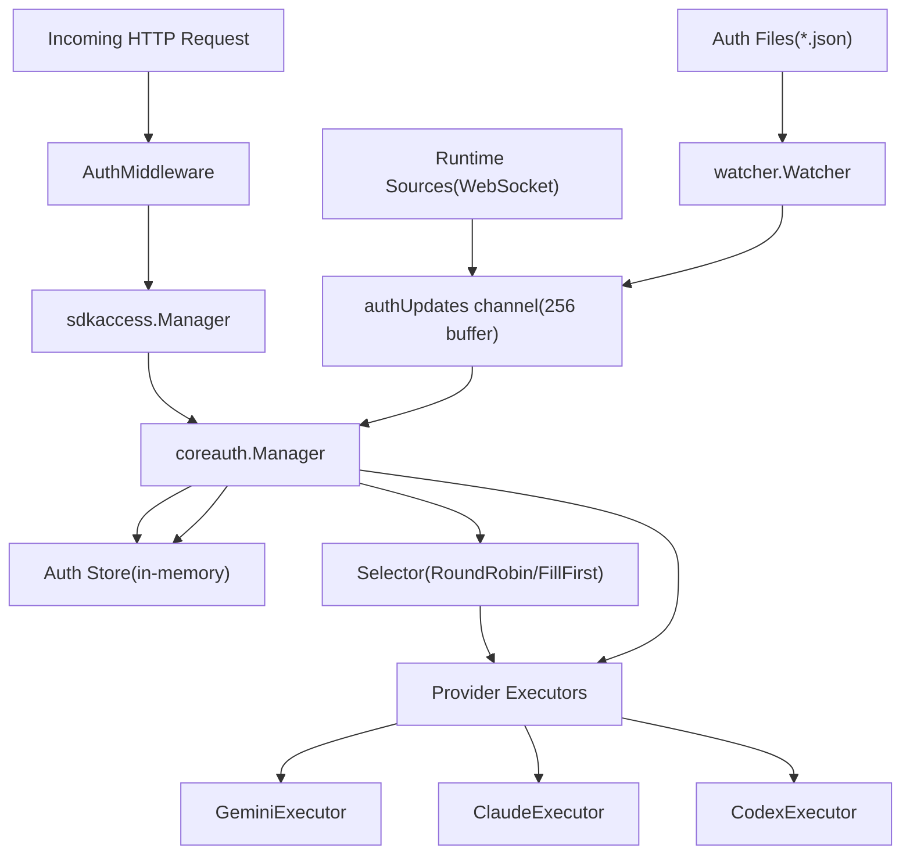
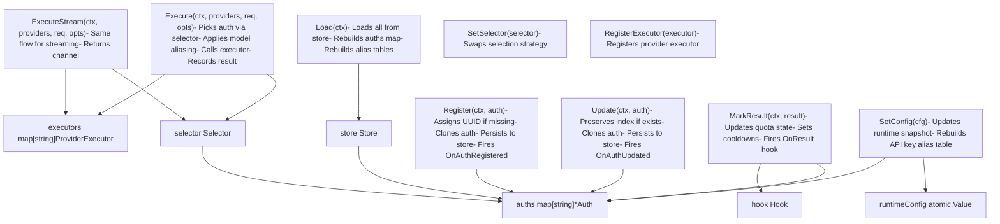
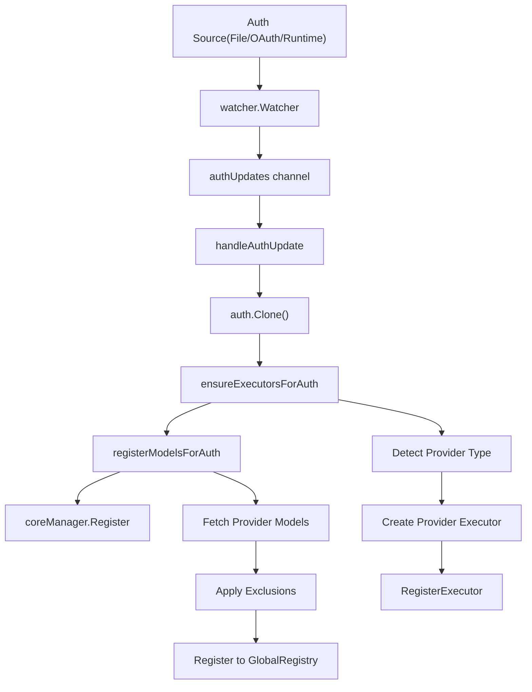
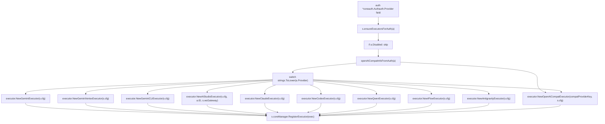
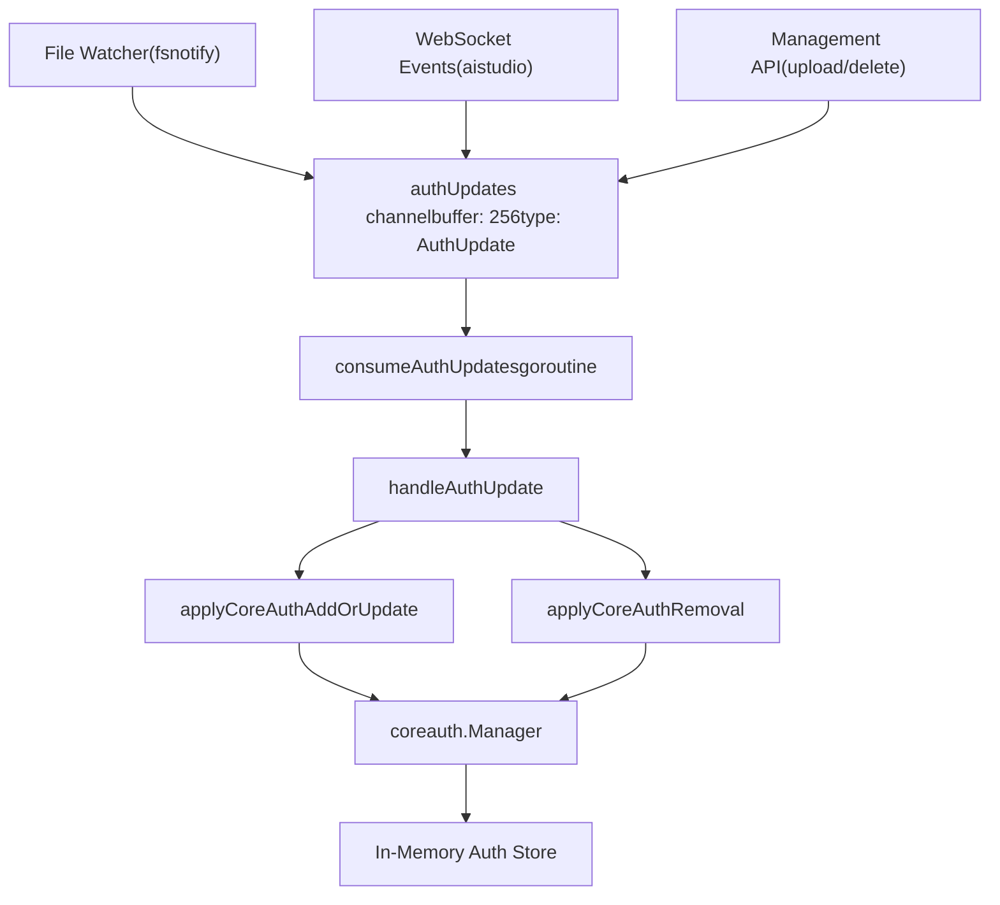
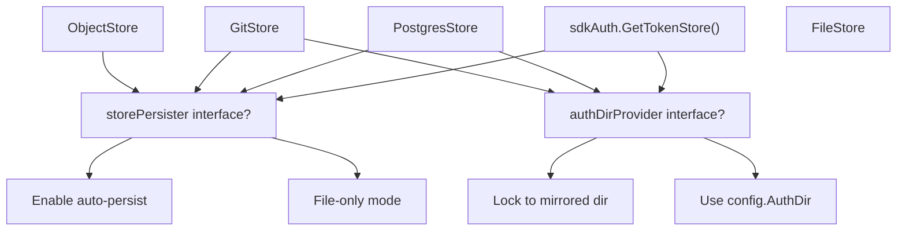

# Authentication and Credential Management

Relevant source files

-   [internal/api/handlers/management/handler.go](https://github.com/router-for-me/CLIProxyAPI/blob/c66cb0af/internal/api/handlers/management/handler.go)
-   [internal/auth/antigravity/auth.go](https://github.com/router-for-me/CLIProxyAPI/blob/c66cb0af/internal/auth/antigravity/auth.go)
-   [internal/auth/claude/token.go](https://github.com/router-for-me/CLIProxyAPI/blob/c66cb0af/internal/auth/claude/token.go)
-   [internal/auth/codex/token.go](https://github.com/router-for-me/CLIProxyAPI/blob/c66cb0af/internal/auth/codex/token.go)
-   [internal/auth/gemini/gemini\_token.go](https://github.com/router-for-me/CLIProxyAPI/blob/c66cb0af/internal/auth/gemini/gemini_token.go)
-   [internal/auth/iflow/iflow\_token.go](https://github.com/router-for-me/CLIProxyAPI/blob/c66cb0af/internal/auth/iflow/iflow_token.go)
-   [internal/auth/kimi/token.go](https://github.com/router-for-me/CLIProxyAPI/blob/c66cb0af/internal/auth/kimi/token.go)
-   [internal/auth/qwen/qwen\_token.go](https://github.com/router-for-me/CLIProxyAPI/blob/c66cb0af/internal/auth/qwen/qwen_token.go)
-   [internal/cmd/anthropic\_login.go](https://github.com/router-for-me/CLIProxyAPI/blob/c66cb0af/internal/cmd/anthropic_login.go)
-   [internal/cmd/iflow\_login.go](https://github.com/router-for-me/CLIProxyAPI/blob/c66cb0af/internal/cmd/iflow_login.go)
-   [internal/cmd/openai\_login.go](https://github.com/router-for-me/CLIProxyAPI/blob/c66cb0af/internal/cmd/openai_login.go)
-   [internal/cmd/qwen\_login.go](https://github.com/router-for-me/CLIProxyAPI/blob/c66cb0af/internal/cmd/qwen_login.go)
-   [internal/misc/credentials.go](https://github.com/router-for-me/CLIProxyAPI/blob/c66cb0af/internal/misc/credentials.go)
-   [internal/watcher/config\_reload.go](https://github.com/router-for-me/CLIProxyAPI/blob/c66cb0af/internal/watcher/config_reload.go)
-   [sdk/auth/antigravity.go](https://github.com/router-for-me/CLIProxyAPI/blob/c66cb0af/sdk/auth/antigravity.go)
-   [sdk/auth/claude.go](https://github.com/router-for-me/CLIProxyAPI/blob/c66cb0af/sdk/auth/claude.go)
-   [sdk/auth/codex.go](https://github.com/router-for-me/CLIProxyAPI/blob/c66cb0af/sdk/auth/codex.go)
-   [sdk/auth/filestore.go](https://github.com/router-for-me/CLIProxyAPI/blob/c66cb0af/sdk/auth/filestore.go)
-   [sdk/auth/iflow.go](https://github.com/router-for-me/CLIProxyAPI/blob/c66cb0af/sdk/auth/iflow.go)
-   [sdk/auth/qwen.go](https://github.com/router-for-me/CLIProxyAPI/blob/c66cb0af/sdk/auth/qwen.go)
-   [sdk/cliproxy/auth/conductor.go](https://github.com/router-for-me/CLIProxyAPI/blob/c66cb0af/sdk/cliproxy/auth/conductor.go)
-   [sdk/cliproxy/auth/selector.go](https://github.com/router-for-me/CLIProxyAPI/blob/c66cb0af/sdk/cliproxy/auth/selector.go)
-   [sdk/cliproxy/auth/selector\_test.go](https://github.com/router-for-me/CLIProxyAPI/blob/c66cb0af/sdk/cliproxy/auth/selector_test.go)
-   [sdk/cliproxy/auth/types.go](https://github.com/router-for-me/CLIProxyAPI/blob/c66cb0af/sdk/cliproxy/auth/types.go)
-   [sdk/cliproxy/auth/types\_test.go](https://github.com/router-for-me/CLIProxyAPI/blob/c66cb0af/sdk/cliproxy/auth/types_test.go)

## Purpose and Scope

This page explains the authentication and credential management architecture in CLIProxyAPI, focusing on the `coreauth.Manager` component, credential routing strategies, and how authentication integrates with provider executors. This covers the runtime system architecture rather than user-facing setup.

For information about setting up OAuth flows and API keys, see [Authentication Setup](/router-for-me/CLIProxyAPI/2.3-authentication-setup). For details on OAuth flow implementation, see [Authentication Flows](/router-for-me/CLIProxyAPI/7-authentication-flows). For token refresh mechanisms, see [Token Refresh and Lifecycle](/router-for-me/CLIProxyAPI/7.4-token-refresh-and-lifecycle).

---

## Authentication Architecture Overview

The authentication system consists of three primary layers that work together to authenticate requests and manage provider credentials:

**Diagram: Authentication System Layers**


**Sources:** [internal/api/server.go113-172](https://github.com/router-for-me/CLIProxyAPI/blob/c66cb0af/internal/api/server.go#L113-L172) [sdk/cliproxy/service.go32-89](https://github.com/router-for-me/CLIProxyAPI/blob/c66cb0af/sdk/cliproxy/service.go#L32-L89) [internal/watcher/watcher.go30-54](https://github.com/router-for-me/CLIProxyAPI/blob/c66cb0af/internal/watcher/watcher.go#L30-L54)

---

## Core Components

### coreauth.Manager

The `coreauth.Manager` (defined in `sdk/cliproxy/auth/conductor.go`) is the central component responsible for managing provider credentials, selecting credentials for requests, and coordinating with executors. It maintains an in-memory store of authentication entries and provides thread-safe access.

**Key Responsibilities:**

| Responsibility | Description |
| --- | --- |
| Credential Storage | Maintains in-memory collection of `Auth` entries in `auths map[string]*Auth` |
| Credential Selection | Routes requests to appropriate credentials using pluggable `Selector` strategies |
| Executor Binding | Ensures provider executors are registered via `RegisterExecutor()` |
| Model Registration | Works with global registry to track model availability per credential |
| Auto-Refresh | Periodically refreshes expiring credentials via background worker |
| Status Management | Tracks credential status, quota violations, and cooldown periods |
| Result Recording | Updates credential state based on execution outcomes via `MarkResult()` |
| Model Aliasing | Supports OAuth and API key model name aliasing |

**Manager Structure (sdk/cliproxy/auth/conductor.go):**

```
type Manager struct {    store     Store                           // Persistence backend    executors map[string]ProviderExecutor     // provider -> executor    selector  Selector                        // Selection strategy    hook      Hook                            // Lifecycle callbacks    mu        sync.RWMutex                    // Protects auths map    auths     map[string]*Auth                // authID -> Auth entry        // Model alias caching    oauthModelAlias  atomic.Value              // Global OAuth aliases    apiKeyModelAlias atomic.Value              // Per-auth API key aliases        // Runtime config snapshot    runtimeConfig atomic.Value                 // *internalconfig.Config        // Retry configuration    requestRetry     atomic.Int32              // Max retry attempts    maxRetryInterval atomic.Int64              // Max wait between retries        // Optional RoundTripper provider    rtProvider RoundTripperProvider        // Auto-refresh control    refreshCancel context.CancelFunc}
```
**Diagram: coreauth.Manager Structure and Key Methods**


**Sources:** [sdk/cliproxy/auth/conductor.go116-147](https://github.com/router-for-me/CLIProxyAPI/blob/c66cb0af/sdk/cliproxy/auth/conductor.go#L116-L147) [sdk/cliproxy/auth/conductor.go149-169](https://github.com/router-for-me/CLIProxyAPI/blob/c66cb0af/sdk/cliproxy/auth/conductor.go#L149-L169) [sdk/cliproxy/auth/conductor.go408-424](https://github.com/router-for-me/CLIProxyAPI/blob/c66cb0af/sdk/cliproxy/auth/conductor.go#L408-L424) [sdk/cliproxy/auth/conductor.go426-443](https://github.com/router-for-me/CLIProxyAPI/blob/c66cb0af/sdk/cliproxy/auth/conductor.go#L426-L443) [sdk/cliproxy/auth/conductor.go472-501](https://github.com/router-for-me/CLIProxyAPI/blob/c66cb0af/sdk/cliproxy/auth/conductor.go#L472-L501)

### sdkaccess.Manager

The `sdkaccess.Manager` handles request authentication by validating API keys and Authorization headers. It sits at the HTTP middleware layer and determines whether a request is authorized to access the proxy.

**Diagram: Request Authentication Flow**

> **[Mermaid sequence]**
> *(图表结构无法解析)*

**Sources:** [internal/api/server.go115-149](https://github.com/router-for-me/CLIProxyAPI/blob/c66cb0af/internal/api/server.go#L115-L149) [internal/api/server.go841-848](https://github.com/router-for-me/CLIProxyAPI/blob/c66cb0af/internal/api/server.go#L841-L848)

### Auth Structure

The `coreauth.Auth` structure represents a single credential entry with its metadata, status, and runtime information:

**Auth Fields:**

| Field | Type | Purpose |
| --- | --- | --- |
| `ID` | string | Unique identifier (filename or channel ID) |
| `Index` | string | Stable runtime identifier derived from auth metadata |
| `Provider` | string | Provider type (gemini, claude, codex, antigravity, etc.) |
| `Prefix` | string | Optional namespace for model routing (strips `prefix/` from model names) |
| `Label` | string | Display name for UI |
| `Status` | Status | Current status (Active, Disabled, Cooling, Error) |
| `StatusMessage` | string | Human-readable status description |
| `Disabled` | bool | Whether credential is disabled |
| `Unavailable` | bool | Whether credential is temporarily unavailable |
| `FileName` | string | Source file path (if file-backed) |
| `Storage` | baseauth.TokenStorage | Token persistence implementation |
| `ProxyURL` | string | Per-credential proxy override |
| `Attributes` | map\[string\]string | Provider-specific immutable configuration |
| `Metadata` | map\[string\]any | Provider-specific mutable state (tokens, cookies, email) |
| `Quota` | QuotaState | Recent quota/rate limit information with backoff tracking |
| `LastError` | \*Error | Last failure encountered |
| `CreatedAt` | time.Time | Creation timestamp |
| `UpdatedAt` | time.Time | Last update timestamp |
| `LastRefreshedAt` | time.Time | Last token refresh timestamp |
| `NextRefreshAfter` | time.Time | Next scheduled refresh time |
| `NextRetryAfter` | time.Time | Earliest time for retry after failure |
| `ModelStates` | map\[string\]\*ModelState | Per-model runtime availability tracking |
| `Runtime` | any | Provider-specific runtime data (non-serializable) |

**Sources:** [sdk/cliproxy/auth/types.go15-66](https://github.com/router-for-me/CLIProxyAPI/blob/c66cb0af/sdk/cliproxy/auth/types.go#L15-L66)

### Quota State and Cooldowns

The `QuotaState` structure tracks quota violations and cooldown timing for rate-limited credentials:

**QuotaState Structure:**

```
type QuotaState struct {    // Exceeded indicates the credential recently hit a quota error    Exceeded bool `json:"exceeded"`        // Reason provides an optional provider-specific human readable description    Reason string `json:"reason,omitempty"`        // NextRecoverAt is when the credential may become available again    NextRecoverAt time.Time `json:"next_recover_at"`        // BackoffLevel stores the progressive cooldown exponent used for rate limits    BackoffLevel int `json:"backoff_level,omitempty"`}
```
**Exponential Backoff Algorithm:**

When a credential encounters a quota error (HTTP 429 or quota-exceeded response), the Manager applies exponential backoff using the `BackoffLevel` field:

```
Backoff duration = min(2^BackoffLevel * 1 second, 30 minutes)

Initial backoff (level 0): 1 second
After 1st error (level 1): 2 seconds
After 2nd error (level 2): 4 seconds
After 3rd error (level 3): 8 seconds
...
Max backoff: 30 minutes
```
The `BackoffLevel` resets to zero when the credential successfully completes a request.

**Cooldown Constants:**

```
const (    quotaBackoffBase = time.Second       // Base backoff duration    quotaBackoffMax  = 30 * time.Minute  // Maximum backoff duration)
```
**Sources:** [sdk/cliproxy/auth/types.go68-78](https://github.com/router-for-me/CLIProxyAPI/blob/c66cb0af/sdk/cliproxy/auth/types.go#L68-L78) [sdk/cliproxy/auth/conductor.go49-55](https://github.com/router-for-me/CLIProxyAPI/blob/c66cb0af/sdk/cliproxy/auth/conductor.go#L49-L55)

### Model State Tracking

Each `Auth` maintains a `ModelStates` map that tracks per-model availability and cooldowns. This allows fine-grained control when a credential works for some models but not others.

**ModelState Structure:**

```
type ModelState struct {    // Status reflects the lifecycle status for this model    Status Status `json:"status"`        // StatusMessage provides an optional short description of the status    StatusMessage string `json:"status_message,omitempty"`        // Unavailable mirrors whether the model is temporarily blocked for retries    Unavailable bool `json:"unavailable"`        // NextRetryAfter defines the per-model retry time    NextRetryAfter time.Time `json:"next_retry_after"`        // LastError records the latest error observed for this model    LastError *Error `json:"last_error,omitempty"`        // Quota retains quota information if this model hit rate limits    Quota QuotaState `json:"quota"`        // UpdatedAt tracks the last update timestamp for this model state    UpdatedAt time.Time `json:"updated_at"`}
```
**Per-Model Cooldown Behavior:**

When a credential fails for a specific model, the `ModelState` is updated with:

-   `Unavailable=true` to mark it as temporarily blocked
-   `NextRetryAfter` timestamp indicating when to retry
-   `LastError` capturing the failure details (HTTP status, message)
-   `Quota` state if the failure was quota-related

The selector implementations (`RoundRobinSelector` and `FillFirstSelector`) check both global auth availability and per-model `ModelStates` when choosing credentials. An auth is blocked for a model if `ModelStates[model].Unavailable == true && ModelStates[model].NextRetryAfter > now`.

**Sources:** [sdk/cliproxy/auth/types.go80-96](https://github.com/router-for-me/CLIProxyAPI/blob/c66cb0af/sdk/cliproxy/auth/types.go#L80-L96) [sdk/cliproxy/auth/selector.go239-296](https://github.com/router-for-me/CLIProxyAPI/blob/c66cb0af/sdk/cliproxy/auth/selector.go#L239-L296)

---

## Credential Lifecycle

### Registration and Initial Binding

When a new credential is added to the system (via file creation, OAuth flow, or runtime source), it flows through the registration pipeline:

**Diagram: Credential Registration Flow**


**Sources:** [sdk/cliproxy/service.go170-198](https://github.com/router-for-me/CLIProxyAPI/blob/c66cb0af/sdk/cliproxy/service.go#L170-L198) [sdk/cliproxy/service.go271-293](https://github.com/router-for-me/CLIProxyAPI/blob/c66cb0af/sdk/cliproxy/service.go#L271-L293) [sdk/cliproxy/service.go340-389](https://github.com/router-for-me/CLIProxyAPI/blob/c66cb0af/sdk/cliproxy/service.go#L340-L389) [sdk/cliproxy/service.go677-793](https://github.com/router-for-me/CLIProxyAPI/blob/c66cb0af/sdk/cliproxy/service.go#L677-L793)

**Code Flow:**

1.  **Auth Update Event**: Watcher detects file change or runtime event
2.  **Queue Processing**: `consumeAuthUpdates` goroutine receives event from 256-buffer channel [sdk/cliproxy/service.go126-147](https://github.com/router-for-me/CLIProxyAPI/blob/c66cb0af/sdk/cliproxy/service.go#L126-L147)
3.  **Clone**: Auth is cloned to prevent reference issues [sdk/cliproxy/service.go278](https://github.com/router-for-me/CLIProxyAPI/blob/c66cb0af/sdk/cliproxy/service.go#L278-L278)
4.  **Executor Binding**: `ensureExecutorsForAuth` creates appropriate executor based on `auth.Provider` [sdk/cliproxy/service.go340-389](https://github.com/router-for-me/CLIProxyAPI/blob/c66cb0af/sdk/cliproxy/service.go#L340-L389)
5.  **Model Registration**: `registerModelsForAuth` fetches models and registers them globally [sdk/cliproxy/service.go677-793](https://github.com/router-for-me/CLIProxyAPI/blob/c66cb0af/sdk/cliproxy/service.go#L677-L793)
6.  **Core Registration**: Finally registered or updated in `coreManager` [sdk/cliproxy/service.go282-292](https://github.com/router-for-me/CLIProxyAPI/blob/c66cb0af/sdk/cliproxy/service.go#L282-L292)

### Updates and Hot-Reload

The system supports hot-reload of credentials without service restart. Changes to auth files trigger an update cascade:

**Diagram: Hot-Reload Update Cascade**

> **[Mermaid sequence]**
> *(图表结构无法解析)*

**Sources:** [internal/watcher/watcher.go72-78](https://github.com/router-for-me/CLIProxyAPI/blob/c66cb0af/internal/watcher/watcher.go#L72-L78) [sdk/cliproxy/service.go126-147](https://github.com/router-for-me/CLIProxyAPI/blob/c66cb0af/sdk/cliproxy/service.go#L126-L147) [sdk/cliproxy/service.go271-293](https://github.com/router-for-me/CLIProxyAPI/blob/c66cb0af/sdk/cliproxy/service.go#L271-L293)

**Key Features:**

-   **Debouncing**: Watcher waits 150ms to coalesce rapid file changes [internal/watcher/watcher.go76](https://github.com/router-for-me/CLIProxyAPI/blob/c66cb0af/internal/watcher/watcher.go#L76-L76)
-   **Hash-Based Detection**: Only reloads if file content hash changes
-   **Atomic Operations**: Updates preserve `CreatedAt`, `LastRefreshedAt`, and `NextRefreshAfter` timestamps [sdk/cliproxy/service.go282-285](https://github.com/router-for-me/CLIProxyAPI/blob/c66cb0af/sdk/cliproxy/service.go#L282-L285)
-   **Buffered Queue**: 256-element channel prevents blocking [sdk/cliproxy/service.go116](https://github.com/router-for-me/CLIProxyAPI/blob/c66cb0af/sdk/cliproxy/service.go#L116-L116)

### Removal

When credentials are removed, the system performs cleanup:

**Cleanup Steps:**

| Step | Action | Code Location |
| --- | --- | --- |
| 1\. Unregister Models | Remove models from global registry | [sdk/cliproxy/service.go302](https://github.com/router-for-me/CLIProxyAPI/blob/c66cb0af/sdk/cliproxy/service.go#L302-L302) |
| 2\. Mark Disabled | Set `Disabled=true`, `Status=StatusDisabled` | [sdk/cliproxy/service.go304-305](https://github.com/router-for-me/CLIProxyAPI/blob/c66cb0af/sdk/cliproxy/service.go#L304-L305) |
| 3\. Update Core | Update auth in coreManager (not delete) | [sdk/cliproxy/service.go306-308](https://github.com/router-for-me/CLIProxyAPI/blob/c66cb0af/sdk/cliproxy/service.go#L306-L308) |

Note: Auths are marked disabled rather than deleted to maintain audit trails and prevent race conditions.

**Sources:** [sdk/cliproxy/service.go295-310](https://github.com/router-for-me/CLIProxyAPI/blob/c66cb0af/sdk/cliproxy/service.go#L295-L310)

---

## Result Recording and State Updates

After each request execution, the Manager records the outcome via `MarkResult()`, which updates credential state based on success or failure.

### Result Structure

```
type Result struct {    AuthID     string          // Auth that handled the request    Provider   string          // Provider type    Model      string          // Upstream model identifier    Success    bool            // Whether execution succeeded    RetryAfter *time.Duration  // Provider-supplied retry hint    Error      *Error          // Failure details}
```
**Sources:** [sdk/cliproxy/auth/conductor.go73-87](https://github.com/router-for-me/CLIProxyAPI/blob/c66cb0af/sdk/cliproxy/auth/conductor.go#L73-L87)

### MarkResult Flow

**Diagram: Result Recording and State Update**

> **[Mermaid sequence]**
> *(图表结构无法解析)*

**Sources:** [sdk/cliproxy/auth/conductor.go595-617](https://github.com/router-for-me/CLIProxyAPI/blob/c66cb0af/sdk/cliproxy/auth/conductor.go#L595-L617) [sdk/cliproxy/auth/types.go68-96](https://github.com/router-for-me/CLIProxyAPI/blob/c66cb0af/sdk/cliproxy/auth/types.go#L68-L96)

---

## Credential Selection Strategies

The `coreauth.Manager` uses pluggable selection strategies to choose which credential to use for each request. The strategy can be changed at runtime via configuration hot-reload.

### Selector Interface

```
type Selector interface {    Pick(ctx context.Context, provider, model string, opts Options, auths []*Auth) (*Auth, error)}
```
Both selector implementations filter credentials before selection using `getAvailableAuths()`, which:

1.  Collects available auths by priority level using `collectAvailableByPriority()`
2.  Filters out disabled auths (`auth.Disabled == true` or `auth.Status == StatusDisabled`)
3.  Filters out auths in cooldown by checking `isAuthBlockedForModel(auth, model, now)`
4.  Groups available auths by priority level (from `auth.Attributes["priority"]`)
5.  Returns `modelCooldownError` if all auths are cooling down (triggers 429 response with `Retry-After` header)
6.  Selects highest priority group and sorts by `auth.ID` for stable ordering

**Auth Blocking Logic:**

An auth is blocked for a model if:

-   `auth.Disabled == true` or `auth.Status == StatusDisabled` (permanent block)
-   Per-model state exists with `ModelStates[model].Unavailable == true && ModelStates[model].NextRetryAfter > now`
-   Global state has `auth.Unavailable == true && auth.NextRetryAfter > now`

The function also tracks quota-based cooldowns separately to provide accurate `Retry-After` timing in error responses.

**Sources:** [sdk/cliproxy/auth/selector.go136-191](https://github.com/router-for-me/CLIProxyAPI/blob/c66cb0af/sdk/cliproxy/auth/selector.go#L136-L191) [sdk/cliproxy/auth/selector.go239-296](https://github.com/router-for-me/CLIProxyAPI/blob/c66cb0af/sdk/cliproxy/auth/selector.go#L239-L296)

### Round-Robin Strategy

The default strategy (`RoundRobinSelector`) distributes requests evenly across all available credentials for a provider using per-model cursors.

**Algorithm (RoundRobinSelector.Pick):**

```
func (s *RoundRobinSelector) Pick(ctx, provider, model, opts, auths):
  1. available := getAvailableAuths(auths, provider, model, now)
  2. if len(available) == 0:
       return nil, modelCooldownError or auth_unavailable
  3. key := provider + ":" + canonicalModelKey(model)
  4. s.mu.Lock()
  5. cursor := s.cursors[key]
  6. if cursor >= 2_147_483_640:
       cursor = 0  // Prevent overflow
  7. s.cursors[key] = cursor + 1
  8. s.mu.Unlock()
  9. return available[cursor % len(available)]
```
**Internal State:**

```
type RoundRobinSelector struct {    mu      sync.Mutex    cursors map[string]int  // Key: "provider:canonicalModel", Value: next index    maxKeys int             // Limit cursor map size (default 4096)}
```
The selector uses `canonicalModelKey()` to strip thinking suffixes (e.g., `"model(high)"` → `"model"`), ensuring that requests for different thinking levels of the same model share rotation state.

**Configuration:**

```
routing:  strategy: "round-robin"  # or "rr" or "roundrobin"
```
**Sources:** [sdk/cliproxy/auth/selector.go19-24](https://github.com/router-for-me/CLIProxyAPI/blob/c66cb0af/sdk/cliproxy/auth/selector.go#L19-L24) [sdk/cliproxy/auth/selector.go195-224](https://github.com/router-for-me/CLIProxyAPI/blob/c66cb0af/sdk/cliproxy/auth/selector.go#L195-L224) [sdk/cliproxy/auth/selector.go124-135](https://github.com/router-for-me/CLIProxyAPI/blob/c66cb0af/sdk/cliproxy/auth/selector.go#L124-L135)

### Fill-First Strategy

Alternative strategy (`FillFirstSelector`) that exhausts one credential before moving to the next. Useful for prioritizing certain accounts or maximizing usage of free-tier quotas.

**Algorithm (FillFirstSelector.Pick):**

```
func (s *FillFirstSelector) Pick(ctx, provider, model, opts, auths):
  1. available := getAvailableAuths(auths, provider, model, now)
  2. if len(available) == 0:
       return nil, modelCooldownError or auth_unavailable
  3. return available[0]  // Always first available (sorted by ID)
```
**Internal State:**

```
type FillFirstSelector struct{}  // Stateless
```
**Configuration:**

```
routing:  strategy: "fill-first"  # or "ff" or "fillfirst"
```
**Strategy Selection at Runtime:**

The service updates the selector via hot-reload when `config.Routing.Strategy` changes:

```
// sdk/cliproxy/service.go:536-545switch nextStrategy {case "fill-first":    selector = &coreauth.FillFirstSelector{}default:    selector = &coreauth.RoundRobinSelector{}}s.coreManager.SetSelector(selector)
```
**Sources:** [sdk/cliproxy/auth/selector.go26-29](https://github.com/router-for-me/CLIProxyAPI/blob/c66cb0af/sdk/cliproxy/auth/selector.go#L26-L29) [sdk/cliproxy/auth/selector.go228-237](https://github.com/router-for-me/CLIProxyAPI/blob/c66cb0af/sdk/cliproxy/auth/selector.go#L228-L237)

---

## Integration with Executors

Each credential must be bound to appropriate provider executors to enable request execution. This binding happens during registration and update operations.

### Executor Binding Process

**Diagram: Auth-to-Executor Binding (s.ensureExecutorsForAuth)**


**Sources:** [sdk/cliproxy/service.go340-389](https://github.com/router-for-me/CLIProxyAPI/blob/c66cb0af/sdk/cliproxy/service.go#L340-L389) [sdk/cliproxy/service.go320-338](https://github.com/router-for-me/CLIProxyAPI/blob/c66cb0af/sdk/cliproxy/service.go#L320-L338)

### Provider-Specific Executor Mapping

| Provider String | Executor Constructor | Code Location | Special Requirements |
| --- | --- | --- | --- |
| `"gemini"` | `executor.NewGeminiExecutor(s.cfg)` | Line 362 | Standard Gemini API |
| `"vertex"` | `executor.NewGeminiVertexExecutor(s.cfg)` | Line 364 | Vertex AI paths |
| `"gemini-cli"` | `executor.NewGeminiCLIExecutor(s.cfg)` | Line 366 | CLI-specific endpoints |
| `"aistudio"` | `executor.NewAIStudioExecutor(s.cfg, a.ID, s.wsGateway)` | Line 368-370 | Requires `s.wsGateway != nil` |
| `"antigravity"` | `executor.NewAntigravityExecutor(s.cfg)` | Line 373 | Supports fallback URLs |
| `"claude"` | `executor.NewClaudeExecutor(s.cfg)` | Line 375 | Thinking signature validation |
| `"codex"` | `executor.NewCodexExecutor(s.cfg)` | Line 377 | ID token parsing |
| `"qwen"` | `executor.NewQwenExecutor(s.cfg)` | Line 379 | Device-based auth |
| `"iflow"` | `executor.NewIFlowExecutor(s.cfg)` | Line 381 | Cookie-based sessions |
| OpenAI-compat | `executor.NewOpenAICompatExecutor(compatProviderKey, s.cfg)` | Line 357, 383-388 | Generic OpenAI-compatible |

**Sources:** [sdk/cliproxy/service.go360-388](https://github.com/router-for-me/CLIProxyAPI/blob/c66cb0af/sdk/cliproxy/service.go#L360-L388)

### Executor Re-binding on Configuration Changes

When configuration changes (e.g., proxy URL, retry settings), all executors are re-bound to pick up the new settings:

> **[Mermaid sequence]**
> *(图表结构无法解析)*

**Sources:** [sdk/cliproxy/service.go392-400](https://github.com/router-for-me/CLIProxyAPI/blob/c66cb0af/sdk/cliproxy/service.go#L392-L400) [sdk/cliproxy/service.go547-559](https://github.com/router-for-me/CLIProxyAPI/blob/c66cb0af/sdk/cliproxy/service.go#L547-L559)

---

## Request Authentication Flow

This section details how incoming HTTP requests are authenticated and routed to credentials.

**Diagram: Complete Request Authentication and Execution Flow**

> **[Mermaid sequence]**
> *(图表结构无法解析)*

**Sources:** [internal/api/server.go203-225](https://github.com/router-for-me/CLIProxyAPI/blob/c66cb0af/internal/api/server.go#L203-L225) [internal/api/server.go1029-1047](https://github.com/router-for-me/CLIProxyAPI/blob/c66cb0af/internal/api/server.go#L1029-L1047) [sdk/cliproxy/auth/selector.go149-172](https://github.com/router-for-me/CLIProxyAPI/blob/c66cb0af/sdk/cliproxy/auth/selector.go#L149-L172) [sdk/cliproxy/auth/selector.go42-104](https://github.com/router-for-me/CLIProxyAPI/blob/c66cb0af/sdk/cliproxy/auth/selector.go#L42-L104)

### AuthMiddleware Implementation

The `AuthMiddleware` function in [internal/api/server.go1029-1047](https://github.com/router-for-me/CLIProxyAPI/blob/c66cb0af/internal/api/server.go#L1029-L1047) returns a `gin.HandlerFunc` that validates incoming requests using the `sdkaccess.Manager`:

```
func AuthMiddleware(manager *sdkaccess.Manager) gin.HandlerFunc {    return func(c *gin.Context) {        if manager == nil {            c.Next()            return        }                result, err := manager.Authenticate(c.Request.Context(), c.Request)        if err == nil {            if result != nil {                c.Set("apiKey", result.Principal)                c.Set("accessProvider", result.Provider)                // ... additional context values            }            c.Next()            return        }                c.AbortWithStatusJSON(http.StatusUnauthorized, ...)    }}
```
The `manager.Authenticate()` method extracts and validates API keys from multiple sources:

**API Key Sources (Priority Order):**

1.  **Authorization Header**: `Authorization: Bearer sk-...`
2.  **X-API-Key Header**: `X-API-Key: sk-...`
3.  **Query Parameter**: `?api-key=sk-...`

**Sources:** [internal/api/server.go1029-1047](https://github.com/router-for-me/CLIProxyAPI/blob/c66cb0af/internal/api/server.go#L1029-L1047)

### Context Propagation

After successful authentication, the middleware stores the validated API key in the Gin context:

```
c.Set("apiKey", validatedKey)
c.Set("provider", detectedProvider)  // if route-specific
```
Route handlers retrieve these values to select appropriate credentials:

```
apiKey := c.GetString("apiKey")
provider := c.GetString("provider")
```
**Sources:** [internal/api/server.go321-329](https://github.com/router-for-me/CLIProxyAPI/blob/c66cb0af/internal/api/server.go#L321-L329)

---

## Auth Update Queue Architecture

The auth update queue provides decoupled, asynchronous processing of credential changes to prevent blocking the watcher or HTTP handlers.

**Diagram: Auth Update Queue Flow**


**Sources:** [sdk/cliproxy/service.go111-124](https://github.com/router-for-me/CLIProxyAPI/blob/c66cb0af/sdk/cliproxy/service.go#L111-L124) [sdk/cliproxy/service.go126-147](https://github.com/router-for-me/CLIProxyAPI/blob/c66cb0af/sdk/cliproxy/service.go#L126-L147) [sdk/cliproxy/service.go170-198](https://github.com/router-for-me/CLIProxyAPI/blob/c66cb0af/sdk/cliproxy/service.go#L170-L198)

### AuthUpdate Structure

```
type AuthUpdate struct {    Action AuthUpdateAction  // "add", "modify", "delete"    ID     string            // Unique auth identifier    Auth   *coreauth.Auth    // Auth entry (nil for delete)}
```
**Sources:** [internal/watcher/watcher.go56-71](https://github.com/router-for-me/CLIProxyAPI/blob/c66cb0af/internal/watcher/watcher.go#L56-L71)

### Queue Saturation Handling

If the 256-element buffer fills (e.g., during bulk operations), updates are applied inline:

```
select {
case authUpdates <- update:
    // Successfully queued
default:
    log.Debug("auth update queue saturated, applying inline")
    handleAuthUpdate(ctx, update)
}
```
**Sources:** [sdk/cliproxy/service.go149-168](https://github.com/router-for-me/CLIProxyAPI/blob/c66cb0af/sdk/cliproxy/service.go#L149-L168)

---

## Auto-Refresh Mechanism

The Manager automatically refreshes expiring credentials via a background worker to prevent authentication failures.

### Refresh Worker

**Diagram: Auto-Refresh Worker Flow**

> **[Mermaid sequence]**
> *(图表结构无法解析)*

**Refresh Decision Logic:**

An auth is refreshed if:

1.  It has a `NextRefreshAfter` timestamp that has passed
2.  OR it's an OAuth credential expiring within the provider's refresh lead time (typically 5 minutes)
3.  AND it's not already in a "refreshing" state (prevents concurrent refreshes)

**Refresh Lead Times by Provider:**

| Provider | Refresh Lead | Configuration |
| --- | --- | --- |
| Gemini | 5 minutes | Refresh when `expires_at - now < 5min` |
| Claude | 5 minutes | Same |
| Codex | 5 minutes | Same |
| Antigravity | 5 minutes | Same |
| Qwen | 5 minutes | Same |
| iFlow | 5 minutes | Same |

**Sources:** [sdk/cliproxy/auth/refresh.go](https://github.com/router-for-me/CLIProxyAPI/blob/c66cb0af/sdk/cliproxy/auth/refresh.go) [sdk/auth/gemini.go](https://github.com/router-for-me/CLIProxyAPI/blob/c66cb0af/sdk/auth/gemini.go) [sdk/auth/claude.go](https://github.com/router-for-me/CLIProxyAPI/blob/c66cb0af/sdk/auth/claude.go) [sdk/auth/antigravity.go29-33](https://github.com/router-for-me/CLIProxyAPI/blob/c66cb0af/sdk/auth/antigravity.go#L29-L33)

### Manual Refresh

Individual credentials can also be refreshed on-demand via the Management API:

```
POST /v0/management/auth-files/refresh?name=<filename>
```
This triggers an immediate refresh attempt regardless of expiry status.

**Sources:** [internal/api/handlers/management/auth\_files.go](https://github.com/router-for-me/CLIProxyAPI/blob/c66cb0af/internal/api/handlers/management/auth_files.go)

---

## Management API Integration

The Management API provides HTTP endpoints for programmatic credential management, all routed through the same auth update queue.

### Key Endpoints

| Endpoint | Method | Handler Function | Purpose |
| --- | --- | --- | --- |
| `/v0/management/auth-files` | GET | `ListAuthFiles` | List all credentials with status and metadata |
| `/v0/management/auth-files` | POST | `UploadAuthFile` | Upload new credential file (multipart or JSON body) |
| `/v0/management/auth-files` | DELETE | `DeleteAuthFile` | Remove credential (single or all with `?all=true`) |
| `/v0/management/auth-files` | PATCH | `PatchAuthFileStatus` | Enable/disable credential via `{"disabled": true/false}` |
| `/v0/management/auth-files/models` | GET | `GetAuthFileModels` | Get available models for specific credential |
| `/v0/management/auth-files/download` | GET | `DownloadAuthFile` | Download credential file contents |
| `/v0/management/request/anthropic/token` | GET | `RequestAnthropicToken` | Start Claude OAuth flow, returns auth URL |
| `/v0/management/request/codex/token` | GET | `RequestCodexToken` | Start Codex OAuth flow |
| `/v0/management/request/gemini-cli/token` | GET | `RequestGeminiCLIToken` | Start Gemini CLI OAuth flow |
| `/v0/management/request/antigravity/token` | GET | `RequestAntigravityToken` | Start Antigravity OAuth flow |
| `/v0/management/request/qwen/token` | GET | `RequestQwenToken` | Start Qwen device flow |
| `/v0/management/request/iflow/token` | GET | `RequestIFlowToken` | Start iFlow OAuth flow |
| `/anthropic/callback`, `/google/callback`, etc. | GET | OAuth callbacks | Handle provider OAuth redirects |
| `/v0/management/get-auth-status` | GET | `GetAuthStatus` | Poll OAuth flow completion status |
| `/v0/management/vertex/import` | POST | `ImportVertexCredential` | Import Vertex service account JSON |

**Sources:** [internal/api/server.go609-625](https://github.com/router-for-me/CLIProxyAPI/blob/c66cb0af/internal/api/server.go#L609-L625) [internal/api/handlers/management/auth\_files.go249-271](https://github.com/router-for-me/CLIProxyAPI/blob/c66cb0af/internal/api/handlers/management/auth_files.go#L249-L271) [internal/api/handlers/management/auth\_files.go530-593](https://github.com/router-for-me/CLIProxyAPI/blob/c66cb0af/internal/api/handlers/management/auth_files.go#L530-L593) [internal/api/handlers/management/auth\_files.go596-660](https://github.com/router-for-me/CLIProxyAPI/blob/c66cb0af/internal/api/handlers/management/auth_files.go#L596-L660) [internal/api/handlers/management/auth\_files.go744-808](https://github.com/router-for-me/CLIProxyAPI/blob/c66cb0af/internal/api/handlers/management/auth_files.go#L744-L808)

### Auth File Upload Flow

**Diagram: Management API Auth Upload**

> **[Mermaid sequence]**
> *(图表结构无法解析)*

**File Upload Formats:**

1.  **Multipart upload**: `Content-Type: multipart/form-data` with `file` field
2.  **Raw JSON**: `Content-Type: application/json` with `?name=filename.json` query parameter

**Validation Rules:**

-   Filename must end with `.json`
-   Filename must not contain path separators (`/` or `\`)
-   File content must be valid JSON with `type` field indicating provider

**Sources:** [internal/api/handlers/management/auth\_files.go530-593](https://github.com/router-for-me/CLIProxyAPI/blob/c66cb0af/internal/api/handlers/management/auth_files.go#L530-L593) [internal/api/handlers/management/auth\_files.go680-742](https://github.com/router-for-me/CLIProxyAPI/blob/c66cb0af/internal/api/handlers/management/auth_files.go#L680-L742)

### OAuth Flow Endpoints

The Management API provides unified OAuth flow initiation for all supported providers. Each flow follows a similar pattern:

**Diagram: OAuth Flow via Management API**

> **[Mermaid sequence]**
> *(图表结构无法解析)*

**OAuth State Management:**

Each OAuth flow creates a session tracked by the `state` parameter:

```
// Session states: "pending", "complete", "error"RegisterOAuthSession(state, provider)  // InitialCompleteOAuthSession(state)            // SuccessSetOAuthSessionError(state, message)   // Failure
```
Clients poll `/v0/management/get-auth-status?state=<state>` to check completion.

**Callback Forwarder for WebUI Mode:**

When `?is_webui=true`, the handler starts a temporary callback forwarder:

1.  Listens on provider's callback port (e.g., 54545 for Claude, 8085 for Gemini)
2.  Redirects all requests to management API's callback handler
3.  Shuts down after OAuth flow completes
4.  Allows WebUI to initiate OAuth without CLI browser access

**Sources:** [internal/api/handlers/management/auth\_files.go869-1011](https://github.com/router-for-me/CLIProxyAPI/blob/c66cb0af/internal/api/handlers/management/auth_files.go#L869-L1011) (Claude example), [internal/api/handlers/management/auth\_files.go1013-1241](https://github.com/router-for-me/CLIProxyAPI/blob/c66cb0af/internal/api/handlers/management/auth_files.go#L1013-L1241) (Gemini CLI example), [internal/api/handlers/management/auth\_files.go131-189](https://github.com/router-for-me/CLIProxyAPI/blob/c66cb0af/internal/api/handlers/management/auth_files.go#L131-L189) (Callback forwarder)

### Runtime-Only Credentials

Some credentials exist only in memory (e.g., WebSocket-connected AI Studio channels) and are marked with `runtime_only=true` attribute. These are excluded from file-based persistence but participate in all other credential management operations.

**Detection:**

```
if auth.Attributes["runtime_only"] == "true" {
    // Skip file persistence
    // Include in credential selection
}
```
**Sources:** [sdk/cliproxy/service.go236-242](https://github.com/router-for-me/CLIProxyAPI/blob/c66cb0af/sdk/cliproxy/service.go#L236-L242) [internal/api/handlers/management/auth\_files.go497-502](https://github.com/router-for-me/CLIProxyAPI/blob/c66cb0af/internal/api/handlers/management/auth_files.go#L497-L502)

---

## Token Store Integration

The system integrates with pluggable token storage backends that implement persistence-capable interfaces. The watcher can detect which storage backend is configured and propagate changes accordingly.

**Storage Backend Detection:**


**Sources:** [internal/watcher/watcher.go20-28](https://github.com/router-for-me/CLIProxyAPI/blob/c66cb0af/internal/watcher/watcher.go#L20-L28) [internal/watcher/watcher.go94-105](https://github.com/router-for-me/CLIProxyAPI/blob/c66cb0af/internal/watcher/watcher.go#L94-L105)

When a persistence-capable store is detected, the watcher can trigger background sync operations after credential updates to propagate changes to remote storage (PostgreSQL, Git repository, S3-compatible storage).

**Sources:** [internal/watcher/watcher.go94-98](https://github.com/router-for-me/CLIProxyAPI/blob/c66cb0af/internal/watcher/watcher.go#L94-L98)
