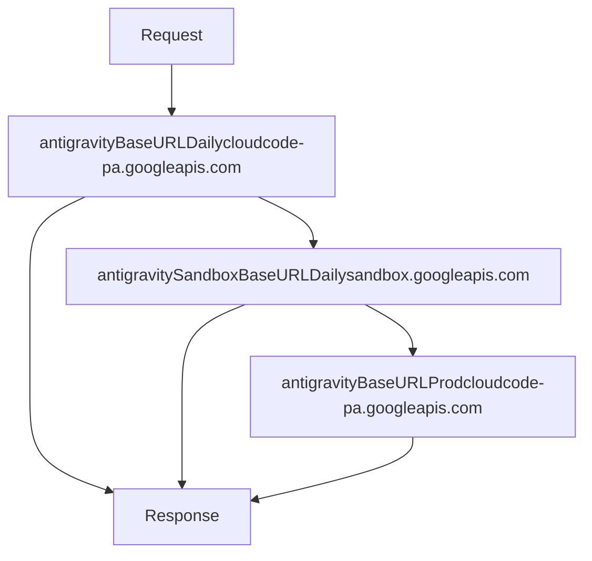

# Provider Executor System

Relevant source files

-   [internal/runtime/executor/aistudio\_executor.go](https://github.com/router-for-me/CLIProxyAPI/blob/c66cb0af/internal/runtime/executor/aistudio_executor.go)
-   [internal/runtime/executor/antigravity\_executor.go](https://github.com/router-for-me/CLIProxyAPI/blob/c66cb0af/internal/runtime/executor/antigravity_executor.go)
-   [internal/runtime/executor/claude\_executor.go](https://github.com/router-for-me/CLIProxyAPI/blob/c66cb0af/internal/runtime/executor/claude_executor.go)
-   [internal/runtime/executor/codex\_executor.go](https://github.com/router-for-me/CLIProxyAPI/blob/c66cb0af/internal/runtime/executor/codex_executor.go)
-   [internal/runtime/executor/gemini\_cli\_executor.go](https://github.com/router-for-me/CLIProxyAPI/blob/c66cb0af/internal/runtime/executor/gemini_cli_executor.go)
-   [internal/runtime/executor/gemini\_executor.go](https://github.com/router-for-me/CLIProxyAPI/blob/c66cb0af/internal/runtime/executor/gemini_executor.go)
-   [internal/runtime/executor/gemini\_vertex\_executor.go](https://github.com/router-for-me/CLIProxyAPI/blob/c66cb0af/internal/runtime/executor/gemini_vertex_executor.go)
-   [internal/runtime/executor/iflow\_executor.go](https://github.com/router-for-me/CLIProxyAPI/blob/c66cb0af/internal/runtime/executor/iflow_executor.go)
-   [internal/runtime/executor/openai\_compat\_executor.go](https://github.com/router-for-me/CLIProxyAPI/blob/c66cb0af/internal/runtime/executor/openai_compat_executor.go)
-   [internal/runtime/executor/qwen\_executor.go](https://github.com/router-for-me/CLIProxyAPI/blob/c66cb0af/internal/runtime/executor/qwen_executor.go)
-   [internal/watcher/config\_reload.go](https://github.com/router-for-me/CLIProxyAPI/blob/c66cb0af/internal/watcher/config_reload.go)
-   [sdk/cliproxy/auth/conductor.go](https://github.com/router-for-me/CLIProxyAPI/blob/c66cb0af/sdk/cliproxy/auth/conductor.go)
-   [sdk/cliproxy/auth/selector.go](https://github.com/router-for-me/CLIProxyAPI/blob/c66cb0af/sdk/cliproxy/auth/selector.go)
-   [sdk/cliproxy/auth/selector\_test.go](https://github.com/router-for-me/CLIProxyAPI/blob/c66cb0af/sdk/cliproxy/auth/selector_test.go)
-   [sdk/cliproxy/auth/types.go](https://github.com/router-for-me/CLIProxyAPI/blob/c66cb0af/sdk/cliproxy/auth/types.go)
-   [sdk/cliproxy/auth/types\_test.go](https://github.com/router-for-me/CLIProxyAPI/blob/c66cb0af/sdk/cliproxy/auth/types_test.go)

## Purpose and Scope

The Provider Executor System implements the abstraction layer that enables CLIProxyAPI to communicate with multiple AI service providers through a unified interface. Each provider executor handles provider-specific authentication, request translation, HTTP transport, streaming, token counting, and credential refresh. This system sits between the authentication manager ([3.3](/router-for-me/CLIProxyAPI/3.3-authentication-and-credential-management)) and the request translation system ([3.5](/router-for-me/CLIProxyAPI/3.5-request-translation-system)), orchestrating the actual API calls to upstream providers.

For information about how executors are selected and rotated during request processing, see Model Registry and Selection ([3.6](/router-for-me/CLIProxyAPI/3.6-model-registry-and-selection)). For authentication credential management, see Authentication and Credential Management ([3.3](/router-for-me/CLIProxyAPI/3.3-authentication-and-credential-management)).

---

## ProviderExecutor Interface

All provider executors implement the `cliproxyexecutor.ProviderExecutor` interface defined in the SDK package. This interface standardizes how the authentication manager and request handlers interact with different AI service providers:

```
type ProviderExecutor interface {    Identifier() string    PrepareRequest(*http.Request, *cliproxyauth.Auth) error    Execute(context.Context, *cliproxyauth.Auth, Request, Options) (Response, error)    ExecuteStream(context.Context, *cliproxyauth.Auth, Request, Options) (<-chan StreamChunk, error)    CountTokens(context.Context, *cliproxyauth.Auth, Request, Options) (Response, error)    Refresh(context.Context, *cliproxyauth.Auth) (*cliproxyauth.Auth, error)}
```
**Method Responsibilities:**

| Method | Purpose | Return Value |
| --- | --- | --- |
| `Identifier()` | Returns provider key for routing (e.g., "gemini", "claude", "codex") | Provider string identifier |
| `PrepareRequest()` | Pre-execution request preparation (mostly no-op in current implementations) | Error if preparation fails |
| `Execute()` | Performs non-streaming requests | `cliproxyexecutor.Response` or error |
| `ExecuteStream()` | Performs streaming requests via Server-Sent Events or WebSocket | Channel of `cliproxyexecutor.StreamChunk` or error |
| `CountTokens()` | Counts tokens in request payload | `cliproxyexecutor.Response` with token count or error |
| `Refresh()` | Refreshes OAuth tokens or service account credentials | Updated `*cliproxyauth.Auth` object or error |

**Key Types:**

-   `cliproxyexecutor.Request` - Contains `Model` string, `Payload` bytes, and `Metadata` map
-   `cliproxyexecutor.Options` - Contains `SourceFormat`, `OriginalRequest`, `Stream`, and `Alt` fields
-   `cliproxyexecutor.Response` - Contains `Payload` bytes
-   `cliproxyexecutor.StreamChunk` - Contains `Payload` bytes and optional `Err` field

**Sources:** [internal/runtime/executor/gemini\_executor.go39-54](https://github.com/router-for-me/CLIProxyAPI/blob/c66cb0af/internal/runtime/executor/gemini_executor.go#L39-L54) [internal/runtime/executor/claude\_executor.go34-40](https://github.com/router-for-me/CLIProxyAPI/blob/c66cb0af/internal/runtime/executor/claude_executor.go#L34-L40) [internal/runtime/executor/codex\_executor.go33-41](https://github.com/router-for-me/CLIProxyAPI/blob/c66cb0af/internal/runtime/executor/codex_executor.go#L33-L41)

---

## Executor Implementations

### Overview Diagram

```mermaid
flowchart TD
    GeminiExec["executor.GeminiExecutorIdentifier(): 'gemini'"]
    GeminiCLIExec["executor.GeminiCLIExecutorIdentifier(): 'gemini-cli'"]
    ClaudeExec["executor.ClaudeExecutorIdentifier(): 'claude'"]
    CodexExec["executor.CodexExecutorIdentifier(): 'codex'"]
    AntigravityExec["executor.AntigravityExecutorIdentifier(): 'antigravity'"]
    VertexExec["executor.GeminiVertexExecutorIdentifier(): 'vertex'"]
    QwenExec["executor.QwenExecutorIdentifier(): 'qwen'"]
    IFlowExec["executor.IFlowExecutorIdentifier(): 'iflow'"]
    AIStudioExec["executor.AIStudioExecutorIdentifier(): 'aistudio'"]
    OpenAICompatExec["executor.OpenAICompatExecutorIdentifier(): provider-specific"]
    APIKey["API Key AuthHeader: x-goog-api-keyHeader: Authorization Bearer"]
    OAuth["OAuth 2.0oauth2.TokenSourcecliproxyauth.Auth.Metadata"]
    ServiceAccount["Service Accountgoogle.JWTConfigFromJSONoauth2.JWTAccessTokenSource"]
    Cookie["Cookie Authauth.Attributes['cookie']"]
    HTTP["http.ClientnewProxyAwareHTTPClient()"]
    SSE["SSE Streamingbufio.Scannertext/event-stream"]
    WS["WebSocketwsrelay.Managerwsrelay.HTTPRequest"]

    GeminiExec --> APIKey
    GeminiExec --> OAuth
    GeminiExec --> HTTP
    GeminiExec --> SSE
    GeminiCLIExec --> OAuth
    GeminiCLIExec --> HTTP
    GeminiCLIExec --> SSE
    ClaudeExec --> APIKey
    ClaudeExec --> OAuth
    ClaudeExec --> HTTP
    ClaudeExec --> SSE
    CodexExec --> APIKey
    CodexExec --> OAuth
    CodexExec --> HTTP
    CodexExec --> SSE
    AntigravityExec --> OAuth
    AntigravityExec --> HTTP
    AntigravityExec --> SSE
    VertexExec --> APIKey
    VertexExec --> ServiceAccount
    VertexExec --> HTTP
    VertexExec --> SSE
    QwenExec --> OAuth
    QwenExec --> HTTP
    QwenExec --> SSE
    IFlowExec --> OAuth
    IFlowExec --> Cookie
    IFlowExec --> HTTP
    IFlowExec --> SSE
    AIStudioExec --> OAuth
    AIStudioExec --> WS
    OpenAICompatExec --> APIKey
    OpenAICompatExec --> HTTP
    OpenAICompatExec --> SSE
```


**Sources:** [internal/runtime/executor/gemini\_executor.go39-56](https://github.com/router-for-me/CLIProxyAPI/blob/c66cb0af/internal/runtime/executor/gemini_executor.go#L39-L56) [internal/runtime/executor/gemini\_cli\_executor.go47-64](https://github.com/router-for-me/CLIProxyAPI/blob/c66cb0af/internal/runtime/executor/gemini_cli_executor.go#L47-L64) [internal/runtime/executor/claude\_executor.go32-40](https://github.com/router-for-me/CLIProxyAPI/blob/c66cb0af/internal/runtime/executor/claude_executor.go#L32-L40) [internal/runtime/executor/codex\_executor.go31-39](https://github.com/router-for-me/CLIProxyAPI/blob/c66cb0af/internal/runtime/executor/codex_executor.go#L31-L39) [internal/runtime/executor/antigravity\_executor.go56-73](https://github.com/router-for-me/CLIProxyAPI/blob/c66cb0af/internal/runtime/executor/antigravity_executor.go#L56-L73) [internal/runtime/executor/qwen\_executor.go29-39](https://github.com/router-for-me/CLIProxyAPI/blob/c66cb0af/internal/runtime/executor/qwen_executor.go#L29-L39) [internal/runtime/executor/iflow\_executor.go30-41](https://github.com/router-for-me/CLIProxyAPI/blob/c66cb0af/internal/runtime/executor/iflow_executor.go#L30-L41) [internal/runtime/executor/aistudio\_executor.go25-46](https://github.com/router-for-me/CLIProxyAPI/blob/c66cb0af/internal/runtime/executor/aistudio_executor.go#L25-L46) [internal/runtime/executor/openai\_compat\_executor.go22-36](https://github.com/router-for-me/CLIProxyAPI/blob/c66cb0af/internal/runtime/executor/openai_compat_executor.go#L22-L36) [internal/runtime/executor/gemini\_vertex\_executor.go34-51](https://github.com/router-for-me/CLIProxyAPI/blob/c66cb0af/internal/runtime/executor/gemini_vertex_executor.go#L34-L51)

### Executor Registry

| Executor | Identifier | Base URL Constant | Authentication | API Format |
| --- | --- | --- | --- | --- |
| `executor.GeminiExecutor` | `"gemini"` | `glEndpoint` = `"https://generativelanguage.googleapis.com"` | `geminiCreds(auth)` - API key or OAuth | Gemini API `glAPIVersion` = `"v1beta"` |
| `executor.GeminiCLIExecutor` | `"gemini-cli"` | `codeAssistEndpoint` = `"https://cloudcode-pa.googleapis.com"` | `prepareGeminiCLITokenSource()` - OAuth | Gemini CLI `codeAssistVersion` = `"v1internal"` |
| `executor.ClaudeExecutor` | `"claude"` | `"https://api.anthropic.com"` | `claudeCreds(auth)` - API key or OAuth | Claude Messages API v1 |
| `executor.CodexExecutor` | `"codex"` | `"https://chatgpt.com/backend-api/codex"` | `codexCreds(auth)` - API key or OAuth | OpenAI Responses API |
| `executor.AntigravityExecutor` | `"antigravity"` | `antigravityBaseURLDaily`, `antigravitySandboxBaseURLDaily`, `antigravityBaseURLProd` | `ensureAccessToken()` - OAuth | Antigravity v1internal |
| `executor.GeminiVertexExecutor` | `"vertex"` | `vertexBaseURL(location)` | `vertexCreds()` or `vertexAPICreds()` | Vertex AI `vertexAPIVersion` = `"v1"` |
| `executor.QwenExecutor` | `"qwen"` | `"https://portal.qwen.ai/v1"` | `qwenCreds(auth)` - OAuth | OpenAI-compatible |
| `executor.IFlowExecutor` | `"iflow"` | `iflowauth.DefaultAPIBaseURL` | `iflowCreds(auth)` - OAuth or cookie | OpenAI-compatible |
| `executor.AIStudioExecutor` | `"aistudio"` | WebSocket relay | `wsrelay.Manager` - OAuth | Gemini API v1beta |
| `executor.OpenAICompatExecutor` | Provider-specific | `resolveCredentials(auth)` | API key from `auth.Attributes` | OpenAI-compatible |

**Sources:** [internal/runtime/executor/gemini\_executor.go25-33](https://github.com/router-for-me/CLIProxyAPI/blob/c66cb0af/internal/runtime/executor/gemini_executor.go#L25-L33) [internal/runtime/executor/gemini\_cli\_executor.go34-39](https://github.com/router-for-me/CLIProxyAPI/blob/c66cb0af/internal/runtime/executor/gemini_cli_executor.go#L34-L39) [internal/runtime/executor/claude\_executor.go32-40](https://github.com/router-for-me/CLIProxyAPI/blob/c66cb0af/internal/runtime/executor/claude_executor.go#L32-L40) [internal/runtime/executor/codex\_executor.go31-39](https://github.com/router-for-me/CLIProxyAPI/blob/c66cb0af/internal/runtime/executor/codex_executor.go#L31-L39) [internal/runtime/executor/antigravity\_executor.go35-48](https://github.com/router-for-me/CLIProxyAPI/blob/c66cb0af/internal/runtime/executor/antigravity_executor.go#L35-L48) [internal/runtime/executor/qwen\_executor.go23-37](https://github.com/router-for-me/CLIProxyAPI/blob/c66cb0af/internal/runtime/executor/qwen_executor.go#L23-L37) [internal/runtime/executor/iflow\_executor.go24-38](https://github.com/router-for-me/CLIProxyAPI/blob/c66cb0af/internal/runtime/executor/iflow_executor.go#L24-L38) [internal/runtime/executor/aistudio\_executor.go25-46](https://github.com/router-for-me/CLIProxyAPI/blob/c66cb0af/internal/runtime/executor/aistudio_executor.go#L25-L46) [internal/runtime/executor/openai\_compat\_executor.go22-36](https://github.com/router-for-me/CLIProxyAPI/blob/c66cb0af/internal/runtime/executor/openai_compat_executor.go#L22-L36) [internal/runtime/executor/gemini\_vertex\_executor.go29-51](https://github.com/router-for-me/CLIProxyAPI/blob/c66cb0af/internal/runtime/executor/gemini_vertex_executor.go#L29-L51)

---

## Execution Flow

### Non-Streaming Request Flow

> **[Mermaid sequence]**
> *(图表结构无法解析)*

**Sources:** [internal/runtime/executor/gemini\_executor.go72-165](https://github.com/router-for-me/CLIProxyAPI/blob/c66cb0af/internal/runtime/executor/gemini_executor.go#L72-L165) [internal/runtime/executor/claude\_executor.go44-158](https://github.com/router-for-me/CLIProxyAPI/blob/c66cb0af/internal/runtime/executor/claude_executor.go#L44-L158) [internal/runtime/executor/codex\_executor.go43-134](https://github.com/router-for-me/CLIProxyAPI/blob/c66cb0af/internal/runtime/executor/codex_executor.go#L43-L134)

### Streaming Request Flow

Streaming requests follow a similar pattern but return a channel that asynchronously produces stream chunks:

1.  **Setup Phase:** Request translation, payload configuration, authentication header application
2.  **HTTP Request:** Send request with `Accept: text/event-stream` header
3.  **Stream Processing:** Spawn goroutine to read SSE lines via `bufio.Scanner`
4.  **Chunk Translation:** Each SSE line is translated via `sdktranslator.TranslateStream()`
5.  **Usage Tracking:** Parse usage metadata from stream events (e.g., `response.completed` for Codex)
6.  **Error Handling:** Scanner errors propagated as `StreamChunk{Err: ...}` and channel closed

**Sources:** [internal/runtime/executor/gemini\_executor.go167-281](https://github.com/router-for-me/CLIProxyAPI/blob/c66cb0af/internal/runtime/executor/gemini_executor.go#L167-L281) [internal/runtime/executor/claude\_executor.go160-300](https://github.com/router-for-me/CLIProxyAPI/blob/c66cb0af/internal/runtime/executor/claude_executor.go#L160-L300) [internal/runtime/executor/codex\_executor.go136-238](https://github.com/router-for-me/CLIProxyAPI/blob/c66cb0af/internal/runtime/executor/codex_executor.go#L136-L238)

---

## Common Patterns and Utilities

### Credential Resolution

Each executor implements a credential resolution function that extracts authentication data from `cliproxyauth.Auth`:

```
Pattern:
func {provider}Creds(auth *cliproxyauth.Auth) (apiKey, baseURL string) {
    // 1. Check auth.Attributes for api_key and base_url
    // 2. Fallback to auth.Metadata for access_token or nested token maps
    // 3. Return extracted credentials
}
```
**Examples:**

-   [internal/runtime/executor/gemini\_executor.go459-480](https://github.com/router-for-me/CLIProxyAPI/blob/c66cb0af/internal/runtime/executor/gemini_executor.go#L459-L480) - `geminiCreds()`
-   [internal/runtime/executor/claude\_executor.go768-782](https://github.com/router-for-me/CLIProxyAPI/blob/c66cb0af/internal/runtime/executor/claude_executor.go#L768-L782) - `claudeCreds()`
-   [internal/runtime/executor/codex\_executor.go500-514](https://github.com/router-for-me/CLIProxyAPI/blob/c66cb0af/internal/runtime/executor/codex_executor.go#L500-L514) - `codexCreds()`
-   [internal/runtime/executor/qwen\_executor.go297-318](https://github.com/router-for-me/CLIProxyAPI/blob/c66cb0af/internal/runtime/executor/qwen_executor.go#L297-L318) - `qwenCreds()`

### HTTP Client Creation

All executors use `newProxyAwareHTTPClient()` to create HTTP clients that respect proxy configuration from `auth.Attributes`:

```
httpClient := newProxyAwareHTTPClient(ctx, e.cfg, auth, timeout)httpResp, err := httpClient.Do(httpReq)
```
**Sources:** [internal/runtime/executor/gemini\_cli\_executor.go620-622](https://github.com/router-for-me/CLIProxyAPI/blob/c66cb0af/internal/runtime/executor/gemini_cli_executor.go#L620-L622)

### Usage Reporting

Each executor instantiates a `usageReporter` (defined in `internal/runtime/executor/usage.go`) to track token consumption:

```
reporter := newUsageReporter(ctx, e.Identifier(), req.Model, auth)defer reporter.trackFailure(ctx, &err)// ... execute request ...reporter.publish(ctx, parseGeminiUsage(data))reporter.ensurePublished(ctx) // Ensure usage is recorded even if upstream omits it
```
**usageReporter methods:**

| Method | Purpose |
| --- | --- |
| `newUsageReporter(ctx, provider, model, auth)` | Creates reporter instance with request context |
| `publish(ctx, usageDetail)` | Publishes usage data to context (input/output/reasoning tokens) |
| `publishFailure(ctx)` | Marks request as failed |
| `trackFailure(ctx, *error)` | Deferred call to publish failure if error is set |
| `ensurePublished(ctx)` | Publishes minimal usage record if no usage data was received |

**Provider-specific usage parsers:**

-   `parseGeminiUsage(data []byte)` - Parses `usageMetadata` from Gemini responses
-   `parseGeminiStreamUsage(data []byte)` - Parses SSE chunk usage
-   `parseClaudeUsage(data []byte)` - Parses `usage` from Claude responses
-   `parseClaudeStreamUsage(line []byte)` - Parses Claude SSE event usage
-   `parseCodexUsage(data []byte)` - Parses `response.usage` from Codex
-   `parseOpenAIUsage(data []byte)` - Parses OpenAI-compatible usage
-   `parseOpenAIStreamUsage(line []byte)` - Parses OpenAI SSE usage
-   `parseAntigravityUsage(data []byte)` - Parses Antigravity response usage
-   `parseAntigravityStreamUsage(data []byte)` - Parses Antigravity SSE usage

**Sources:** [internal/runtime/executor/gemini\_executor.go77-78](https://github.com/router-for-me/CLIProxyAPI/blob/c66cb0af/internal/runtime/executor/gemini_executor.go#L77-L78) [internal/runtime/executor/claude\_executor.go50-51](https://github.com/router-for-me/CLIProxyAPI/blob/c66cb0af/internal/runtime/executor/claude_executor.go#L50-L51) [internal/runtime/executor/codex\_executor.go49-50](https://github.com/router-for-me/CLIProxyAPI/blob/c66cb0af/internal/runtime/executor/codex_executor.go#L49-L50) [internal/runtime/executor/iflow\_executor.go54-55](https://github.com/router-for-me/CLIProxyAPI/blob/c66cb0af/internal/runtime/executor/iflow_executor.go#L54-L55)

### Request Logging

All executors record API requests and responses using helper functions defined in `internal/runtime/executor/logging.go`:

```
// Log outgoing requestrecordAPIRequest(ctx, e.cfg, upstreamRequestLog{    URL: url, Method: http.MethodPost, Headers: httpReq.Header.Clone(),    Body: body, Provider: e.Identifier(),    AuthID: authID, AuthLabel: authLabel, AuthType: authType, AuthValue: authValue,}) // Log response metadatarecordAPIResponseMetadata(ctx, e.cfg, httpResp.StatusCode, httpResp.Header.Clone()) // Log response body chunks (streaming or non-streaming)appendAPIResponseChunk(ctx, e.cfg, data) // Log errorsrecordAPIResponseError(ctx, e.cfg, err)
```
**upstreamRequestLog struct fields:**

-   `URL` - Full endpoint URL
-   `Method` - HTTP method
-   `Headers` - Request headers (cloned for safety)
-   `Body` - Request payload bytes
-   `Provider` - Executor identifier
-   `AuthID`, `AuthLabel`, `AuthType`, `AuthValue` - Authentication metadata

These functions store logging data in context keys that can be retrieved by request logging middleware and written to log files when enabled via `config.RequestLogger`.

**Sources:** [internal/runtime/executor/gemini\_executor.go133-143](https://github.com/router-for-me/CLIProxyAPI/blob/c66cb0af/internal/runtime/executor/gemini_executor.go#L133-L143) [internal/runtime/executor/claude\_executor.go97-107](https://github.com/router-for-me/CLIProxyAPI/blob/c66cb0af/internal/runtime/executor/claude_executor.go#L97-L107) [internal/runtime/executor/codex\_executor.go87-97](https://github.com/router-for-me/CLIProxyAPI/blob/c66cb0af/internal/runtime/executor/codex_executor.go#L87-L97)

### Payload Configuration

The `applyPayloadConfig()` and `applyPayloadConfigWithRoot()` functions (defined in `internal/runtime/executor/payload_helpers.go`) apply configuration rules from `config.yaml` to request payloads:

**Payload Configuration Flow:**

1.  Match model name against `config.PayloadConfig` entries using `matchModelPattern()`
2.  For each matching entry, extract `defaults` and `overrides` maps
3.  Apply defaults first (only set fields that don't exist)
4.  Apply overrides second (always overwrite existing values)
5.  Support nested root paths for provider-specific formats

**Function Signatures:**

```
// Standard payload config (no root path)func applyPayloadConfig(cfg *config.Config, model string, body []byte) []byte // Payload config with root path and provider typefunc applyPayloadConfigWithRoot(cfg *config.Config, model, providerType, root string,     body, originalBody []byte) []byte
```
**Example Usage:**

```
// Apply config for Gemini standard APIbody = applyPayloadConfig(e.cfg, req.Model, body) // Apply config for Gemini CLI with "request" root pathbody = applyPayloadConfigWithRoot(e.cfg, req.Model, "gemini", "request", body, originalTranslated) // Apply config for Antigravity with provider-specific handlingbody = applyPayloadConfigWithRoot(e.cfg, req.Model, "antigravity", "request", body, originalTranslated)
```
**Model Pattern Matching:**

-   Exact match: `"gemini-2.5-pro"` matches only `gemini-2.5-pro`
-   Wildcard match: `"gemini-*"` matches any model starting with `gemini-`
-   Multiple patterns: `["gemini-*", "claude-*"]` matches any Gemini or Claude model

**Sources:** [internal/runtime/executor/payload\_helpers.go86-149](https://github.com/router-for-me/CLIProxyAPI/blob/c66cb0af/internal/runtime/executor/payload_helpers.go#L86-L149) [internal/runtime/executor/gemini\_executor.go99](https://github.com/router-for-me/CLIProxyAPI/blob/c66cb0af/internal/runtime/executor/gemini_executor.go#L99-L99) [internal/runtime/executor/gemini\_cli\_executor.go92](https://github.com/router-for-me/CLIProxyAPI/blob/c66cb0af/internal/runtime/executor/gemini_cli_executor.go#L92-L92) [internal/runtime/executor/antigravity\_executor.go109](https://github.com/router-for-me/CLIProxyAPI/blob/c66cb0af/internal/runtime/executor/antigravity_executor.go#L109-L109)

---

## Provider-Specific Features

### Gemini: Thinking Configuration

Gemini executors handle thinking configuration for models that support extended reasoning:

| Function | Purpose | JSON Path |
| --- | --- | --- |
| `applyThinkingMetadata()` | Apply thinking config from model suffix (e.g., `-thinking-medium`) | `generationConfig.thinkingConfig` |
| `util.ApplyDefaultThinkingIfNeeded()` | Inject default thinking for models like `gemini-3-pro-preview` | `generationConfig.thinkingConfig.thinkingBudget` |
| `util.NormalizeGeminiThinkingBudget()` | Normalize budget values to valid ranges | `generationConfig.thinkingConfig.thinkingBudget` |
| `util.StripThinkingConfigIfUnsupported()` | Remove thinking config for non-thinking models | Removes entire `thinkingConfig` object |
| `fixGeminiImageAspectRatio()` | Handle image generation aspect ratio for `gemini-2.5-flash-image-preview` | `generationConfig.imageConfig.aspectRatio` |

**Sources:** [internal/runtime/executor/payload\_helpers.go12-44](https://github.com/router-for-me/CLIProxyAPI/blob/c66cb0af/internal/runtime/executor/payload_helpers.go#L12-L44) [internal/util/gemini\_thinking.go74-187](https://github.com/router-for-me/CLIProxyAPI/blob/c66cb0af/internal/util/gemini_thinking.go#L74-L187) [internal/runtime/executor/gemini\_executor.go84-89](https://github.com/router-for-me/CLIProxyAPI/blob/c66cb0af/internal/runtime/executor/gemini_executor.go#L84-L89) [internal/runtime/executor/gemini\_executor.go503-543](https://github.com/router-for-me/CLIProxyAPI/blob/c66cb0af/internal/runtime/executor/gemini_executor.go#L503-L543)

### Claude: Thinking Configuration and Beta Features

Claude executor manages thinking configuration via the Claude Messages API:

```
// Inject thinking config from metadata or model suffixbody = e.injectThinkingConfig(req.Model, req.Metadata, body) // Ensure max_tokens > thinking.budget_tokens when thinking is enabledbody = ensureMaxTokensForThinking(req.Model, body) // Extract betas from request body and move to headervar extraBetas []stringextraBetas, body = extractAndRemoveBetas(body)applyClaudeHeaders(httpReq, auth, apiKey, stream, extraBetas)
```
The executor:

-   Resolves thinking budget from model suffixes like `-thinking-low`, `-thinking-medium`, `-thinking-high`
-   Enforces Anthropic's constraint that `max_tokens > thinking.budget_tokens`
-   Supports custom beta features via `betas` array in request body
-   Adds system instruction prefix for Claude Code identity

**Sources:** [internal/runtime/executor/claude\_executor.go454-506](https://github.com/router-for-me/CLIProxyAPI/blob/c66cb0af/internal/runtime/executor/claude_executor.go#L454-L506) [internal/runtime/executor/claude\_executor.go508-542](https://github.com/router-for-me/CLIProxyAPI/blob/c66cb0af/internal/runtime/executor/claude_executor.go#L508-L542) [internal/runtime/executor/claude\_executor.go432-451](https://github.com/router-for-me/CLIProxyAPI/blob/c66cb0af/internal/runtime/executor/claude_executor.go#L432-L451) [internal/runtime/executor/claude\_executor.go784-801](https://github.com/router-for-me/CLIProxyAPI/blob/c66cb0af/internal/runtime/executor/claude_executor.go#L784-L801)

### Codex: Prompt Caching

Codex executor implements prompt caching using conversation and session IDs:

```
func (e *CodexExecutor) cacheHelper(ctx context.Context, from sdktranslator.Format,     url string, req cliproxyexecutor.Request, rawJSON []byte) (*http.Request, error) {        var cache codexCache    if from == "claude" {        // Use user_id from Claude metadata to build cache key        userIDResult := gjson.GetBytes(req.Payload, "metadata.user_id")        if userIDResult.Exists() {            key := fmt.Sprintf("%s-%s", req.Model, userIDResult.String())            cache = codexCacheMap[key] // Check existing cache        }    } else if from == "openai-response" {        cache.ID = gjson.GetBytes(req.Payload, "prompt_cache_key").String()    }        rawJSON, _ = sjson.SetBytes(rawJSON, "prompt_cache_key", cache.ID)    httpReq.Header.Set("Conversation_id", cache.ID)    httpReq.Header.Set("Session_id", cache.ID)    return httpReq, nil}
```
**Sources:** [internal/runtime/executor/codex\_executor.go430-460](https://github.com/router-for-me/CLIProxyAPI/blob/c66cb0af/internal/runtime/executor/codex_executor.go#L430-L460)

### Codex: Local Token Counting

Codex uses `tiktoken-go` for local token counting without API calls:

```
func tokenizerForCodexModel(model string) (tokenizer.Codec, error) {    sanitized := strings.ToLower(strings.TrimSpace(model))    switch {    case strings.HasPrefix(sanitized, "gpt-5"):        return tokenizer.ForModel(tokenizer.GPT5)    case strings.HasPrefix(sanitized, "gpt-4o"):        return tokenizer.ForModel(tokenizer.GPT4o)    case strings.HasPrefix(sanitized, "gpt-4"):        return tokenizer.ForModel(tokenizer.GPT4)    default:        return tokenizer.Get(tokenizer.Cl100kBase)    }} count, err := countCodexInputTokens(enc, body)
```
**Sources:** [internal/runtime/executor/codex\_executor.go269-389](https://github.com/router-for-me/CLIProxyAPI/blob/c66cb0af/internal/runtime/executor/codex_executor.go#L269-L389)

### Vertex: Dual Authentication

Vertex executor supports both service account JWT and API key authentication:

```
// Try API key firstapiKey, baseURL := vertexAPICreds(auth)if apiKey == "" {    // Fallback to service account    projectID, location, saJSON, err := vertexCreds(auth)    return e.executeWithServiceAccount(ctx, auth, req, opts, projectID, location, saJSON)}return e.executeWithAPIKey(ctx, auth, req, opts, apiKey, baseURL)
```
Service account authentication uses `oauth2.JWTAccessTokenSource` to mint access tokens:

```
func vertexAccessToken(ctx context.Context, cfg *config.Config,     auth *cliproxyauth.Auth, saJSON []byte) (string, error) {        jwtCfg, err := google.JWTConfigFromJSON(saJSON, vertexauth.VertexScope)    src := jwtCfg.TokenSource(ctx)    tok, err := src.Token()    return tok.AccessToken, err}
```
**Sources:** [internal/runtime/executor/gemini\_vertex\_executor.go53-68](https://github.com/router-for-me/CLIProxyAPI/blob/c66cb0af/internal/runtime/executor/gemini_vertex_executor.go#L53-L68) [internal/runtime/executor/gemini\_vertex\_executor.go289-388](https://github.com/router-for-me/CLIProxyAPI/blob/c66cb0af/internal/runtime/executor/gemini_vertex_executor.go#L289-L388)

### AIStudio: WebSocket Transport

AIStudio executor uses a WebSocket relay manager for browser-based authentication:

```
func (e *AIStudioExecutor) Execute(ctx context.Context, auth *cliproxyauth.Auth,     req cliproxyexecutor.Request, opts cliproxyexecutor.Options) (resp cliproxyexecutor.Response, err error) {        wsReq := &wsrelay.HTTPRequest{        Method:  http.MethodPost,        URL:     endpoint,        Headers: http.Header{"Content-Type": []string{"application/json"}},        Body:    body.payload,    }        wsResp, err := e.relay.NonStream(ctx, authID, wsReq)    // ... process websocket response ...}
```
Stream handling processes WebSocket events:

-   `MessageTypeStreamStart` - Initial metadata
-   `MessageTypeStreamChunk` - Data chunks
-   `MessageTypeStreamEnd` - Stream completion
-   `MessageTypeError` - Error events

**Sources:** [internal/runtime/executor/aistudio\_executor.go42-93](https://github.com/router-for-me/CLIProxyAPI/blob/c66cb0af/internal/runtime/executor/aistudio_executor.go#L42-L93) [internal/runtime/executor/aistudio\_executor.go95-240](https://github.com/router-for-me/CLIProxyAPI/blob/c66cb0af/internal/runtime/executor/aistudio_executor.go#L95-L240)

### IFlow: Dual Authentication (OAuth + Cookie)

IFlow executor supports both OAuth and cookie-based authentication:

```
func (e *IFlowExecutor) Refresh(ctx context.Context, auth *cliproxyauth.Auth) (*cliproxyauth.Auth, error) {    var cookie string    var email string    if auth.Metadata != nil {        cookie = strings.TrimSpace(auth.Metadata["cookie"].(string))        email = strings.TrimSpace(auth.Metadata["email"].(string))    }        if cookie != "" && email != "" {        return e.refreshCookieBased(ctx, auth, cookie, email)    }        return e.refreshOAuthBased(ctx, auth)}
```
Cookie-based refresh checks expiry before refreshing:

```
func (e *IFlowExecutor) refreshCookieBased(ctx context.Context, auth *cliproxyauth.Auth,     cookie, email string) (*cliproxyauth.Auth, error) {        needsRefresh, _, err := iflowauth.ShouldRefreshAPIKey(currentExpire)    if !needsRefresh {        return auth, nil // No refresh needed    }        keyData, err := svc.RefreshAPIKey(ctx, cookie, email)    auth.Metadata["api_key"] = keyData.APIKey    auth.Metadata["expired"] = keyData.ExpireTime    return auth, nil}
```
**Sources:** [internal/runtime/executor/iflow\_executor.go258-334](https://github.com/router-for-me/CLIProxyAPI/blob/c66cb0af/internal/runtime/executor/iflow_executor.go#L258-L334) [internal/runtime/executor/iflow\_executor.go286-334](https://github.com/router-for-me/CLIProxyAPI/blob/c66cb0af/internal/runtime/executor/iflow_executor.go#L286-L334)

### Antigravity: Multi-URL Fallback and Thinking Normalization

Antigravity executor implements resilient multi-URL fallback for high availability:


The executor provides automatic fallback ordering via `antigravityBaseURLFallbackOrder()`:

```
1. Daily production URL (cloudcode-pa.googleapis.com)
2. Daily sandbox URL (sandbox.googleapis.com)
3. Production URL fallback
```
**Thinking Configuration Normalization:**

Antigravity uses unified thinking normalization via `normalizeAntigravityThinking()` which:

-   Converts numeric thinking budgets to standardized format
-   Supports both Gemini-style and Claude-style thinking configurations
-   Maps thinking levels to provider-specific formats
-   Validates thinking signatures for extended thinking mode

**Model Alias Conversion:**

The executor uses `modelName2Alias()` to convert Google model names to standardized aliases:

-   `models/gemini-2.5-flash` → `gemini-2.5-flash`
-   `models/claude-3-5-sonnet-v2@20241022` → `claude-3-5-sonnet-20241022`

**Sources:** [internal/runtime/executor/antigravity\_executor.go35-48](https://github.com/router-for-me/CLIProxyAPI/blob/c66cb0af/internal/runtime/executor/antigravity_executor.go#L35-L48) [internal/runtime/executor/antigravity\_executor.go886-945](https://github.com/router-for-me/CLIProxyAPI/blob/c66cb0af/internal/runtime/executor/antigravity_executor.go#L886-L945) [internal/runtime/executor/antigravity\_executor.go1011-1052](https://github.com/router-for-me/CLIProxyAPI/blob/c66cb0af/internal/runtime/executor/antigravity_executor.go#L1011-L1052) [internal/runtime/executor/antigravity\_executor.go78-173](https://github.com/router-for-me/CLIProxyAPI/blob/c66cb0af/internal/runtime/executor/antigravity_executor.go#L78-L173)

### OpenAI-Compatible: Model Aliasing

OpenAI-compatible executor resolves model aliases from configuration:

```
func (e *OpenAICompatExecutor) resolveUpstreamModel(alias string, auth *cliproxyauth.Auth) string {    compat := e.resolveCompatConfig(auth) // Find matching config entry        for i := range compat.Models {        model := compat.Models[i]        if model.Alias != "" && strings.EqualFold(model.Alias, alias) {            return model.Name // Return real model name        }    }    return ""}
```
This enables transparent model substitution (e.g., `claude-opus` → `claude-3-5-sonnet-20241022`).

**Sources:** [internal/runtime/executor/openai\_compat\_executor.go290-314](https://github.com/router-for-me/CLIProxyAPI/blob/c66cb0af/internal/runtime/executor/openai_compat_executor.go#L290-L314)

---

## Error Handling

### Status Error Type

Executors return a `statusErr` struct that implements error interface with additional metadata:

```
type statusErr struct {    code       int    msg        string    retryAfter *time.Duration} func (e statusErr) Error() string          { return e.msg }func (e statusErr) StatusCode() int        { return e.code }func (e statusErr) RetryAfter() *time.Duration { return e.retryAfter }
```
**Sources:** [internal/runtime/executor/openai\_compat\_executor.go351-365](https://github.com/router-for-me/CLIProxyAPI/blob/c66cb0af/internal/runtime/executor/openai_compat_executor.go#L351-L365)

### Retry-After Parsing

Gemini CLI executor parses `retryDelay` from Google API 429 responses:

```
func parseRetryDelay(errorBody []byte) (*time.Duration, error) {    details := gjson.GetBytes(errorBody, "error.details")    for _, detail := range details.Array() {        if detail.Get("@type").String() == "type.googleapis.com/google.rpc.RetryInfo" {            retryDelay := detail.Get("retryDelay").String()            duration, err := time.ParseDuration(retryDelay) // e.g., "0.847655010s"            return &duration, nil        }    }    return nil, fmt.Errorf("no RetryInfo found")}
```
**Sources:** [internal/runtime/executor/gemini\_cli\_executor.go766-793](https://github.com/router-for-me/CLIProxyAPI/blob/c66cb0af/internal/runtime/executor/gemini_cli_executor.go#L766-L793)

### Response Body Decoding

Claude executor handles multiple compression formats transparently:

```
func decodeResponseBody(body io.ReadCloser, contentEncoding string) (io.ReadCloser, error) {    encodings := strings.Split(contentEncoding, ",")    for _, encoding := range encodings {        switch encoding {        case "gzip":            return gzip.NewReader(body)        case "deflate":            return flate.NewReader(body)        case "br":            return brotli.NewReader(body)        case "zstd":            return zstd.NewReader(body)        }    }    return body, nil}
```
**Sources:** [internal/runtime/executor/claude\_executor.go646-706](https://github.com/router-for-me/CLIProxyAPI/blob/c66cb0af/internal/runtime/executor/claude_executor.go#L646-L706)

---

## Token Counting

### Provider-Specific Implementations

| Provider | Method | Implementation |
| --- | --- | --- |
| Gemini | API endpoint | POST to `/models/{model}:countTokens` |
| Claude | API endpoint | POST to `/v1/messages/count_tokens` |
| Codex | Local tiktoken | `tiktoken-go` library with model-specific encodings |
| Qwen | Local tiktoken | `tiktoken-go` library with fallback to `Cl100kBase` |
| IFlow | Local tiktoken | `tiktoken-go` library |
| OpenAI-Compat | Local tiktoken | `tiktoken-go` library |
| Vertex | API endpoint | POST to `/models/{model}:countTokens` |
| AIStudio | API endpoint via WebSocket | POST to `/models/{model}:countTokens` through relay |

### Local Token Counting Flow

> **[Mermaid sequence]**
> *(图表结构无法解析)*

**Sources:** [internal/runtime/executor/codex\_executor.go240-267](https://github.com/router-for-me/CLIProxyAPI/blob/c66cb0af/internal/runtime/executor/codex_executor.go#L240-L267) [internal/runtime/executor/codex\_executor.go289-389](https://github.com/router-for-me/CLIProxyAPI/blob/c66cb0af/internal/runtime/executor/codex_executor.go#L289-L389) [internal/runtime/executor/qwen\_executor.go219-242](https://github.com/router-for-me/CLIProxyAPI/blob/c66cb0af/internal/runtime/executor/qwen_executor.go#L219-L242)

---

## Credential Refresh

### OAuth Token Refresh

Standard OAuth refresh pattern used by multiple executors:

```
func (e *ExecutorType) Refresh(ctx context.Context, auth *cliproxyauth.Auth) (*cliproxyauth.Auth, error) {    var refreshToken string    if auth.Metadata != nil {        refreshToken = auth.Metadata["refresh_token"].(string)    }    if refreshToken == "" {        return auth, nil // Nothing to refresh    }        svc := providerauth.NewAuth(e.cfg)    tokenData, err := svc.RefreshTokens(ctx, refreshToken)    if err != nil {        return nil, err    }        auth.Metadata["access_token"] = tokenData.AccessToken    auth.Metadata["refresh_token"] = tokenData.RefreshToken    auth.Metadata["expired"] = tokenData.Expire    auth.Metadata["last_refresh"] = time.Now().Format(time.RFC3339)    return auth, nil}
```
**Implementations:**

-   Claude: [internal/runtime/executor/claude\_executor.go398-430](https://github.com/router-for-me/CLIProxyAPI/blob/c66cb0af/internal/runtime/executor/claude_executor.go#L398-L430)
-   Codex: [internal/runtime/executor/codex\_executor.go391-428](https://github.com/router-for-me/CLIProxyAPI/blob/c66cb0af/internal/runtime/executor/codex_executor.go#L391-L428)
-   Qwen: [internal/runtime/executor/qwen\_executor.go244-282](https://github.com/router-for-me/CLIProxyAPI/blob/c66cb0af/internal/runtime/executor/qwen_executor.go#L244-L282)
-   IFlow: [internal/runtime/executor/iflow\_executor.go336-389](https://github.com/router-for-me/CLIProxyAPI/blob/c66cb0af/internal/runtime/executor/iflow_executor.go#L336-L389)

### Gemini OAuth Refresh with Shared Credentials

Gemini CLI executor handles shared credentials across virtual accounts:

```
func updateGeminiCLITokenMetadata(auth *cliproxyauth.Auth, base map[string]any, tok *oauth2.Token) {    merged := buildGeminiTokenMap(base, tok)    fields := buildGeminiTokenFields(tok, merged)        shared := geminicli.ResolveSharedCredential(auth.Runtime)    if shared != nil {        snapshot := shared.MergeMetadata(fields)        if !geminicli.IsVirtual(auth.Runtime) {            auth.Metadata = snapshot        }        return    }        // Standard metadata update for non-shared credentials    for k, v := range fields {        auth.Metadata[k] = v    }}
```
**Sources:** [internal/runtime/executor/gemini\_cli\_executor.go538-558](https://github.com/router-for-me/CLIProxyAPI/blob/c66cb0af/internal/runtime/executor/gemini_cli_executor.go#L538-L558)

---

## Integration with Other Systems

### Authentication Manager Integration

Executors are instantiated and registered with the auth manager during service startup:

```
// In auth.Manager initializationexecutors := map[string]cliproxyexecutor.ProviderExecutor{    "gemini":     executor.NewGeminiExecutor(cfg),    "gemini-cli": executor.NewGeminiCLIExecutor(cfg),    "claude":     executor.NewClaudeExecutor(cfg),    "codex":      executor.NewCodexExecutor(cfg),    "vertex":     executor.NewGeminiVertexExecutor(cfg),    // ... etc}
```
The manager calls executors during request processing via the Execute pattern described in [3.6](/router-for-me/CLIProxyAPI/3.6-model-registry-and-selection).

### Request Translation Integration

All executors use `sdktranslator` for format conversion:

```
from := opts.SourceFormat  // e.g., "openai"to := sdktranslator.FromString("gemini")body := sdktranslator.TranslateRequest(from, to, model, payload, stream) // After executionoutput := sdktranslator.TranslateNonStream(ctx, to, from, model, originalRequest, body, response, &param)
```
**Sources:** [internal/runtime/executor/gemini\_executor.go82-83](https://github.com/router-for-me/CLIProxyAPI/blob/c66cb0af/internal/runtime/executor/gemini_executor.go#L82-L83) [internal/runtime/executor/gemini\_executor.go162](https://github.com/router-for-me/CLIProxyAPI/blob/c66cb0af/internal/runtime/executor/gemini_executor.go#L162-L162)

### Configuration System Integration

Executors access configuration for:

-   Proxy settings via `util.SetProxy(&e.cfg.SDKConfig, httpClient)`
-   Payload rules via `applyPayloadConfig(e.cfg, req.Model, body)`
-   Provider-specific settings (base URLs, model mappings, thinking defaults)

**Sources:** [internal/runtime/executor/payload\_helpers.go86-149](https://github.com/router-for-me/CLIProxyAPI/blob/c66cb0af/internal/runtime/executor/payload_helpers.go#L86-L149)
