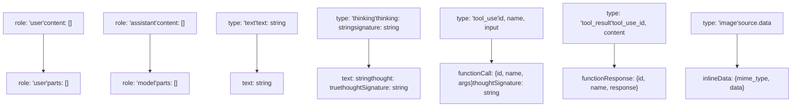
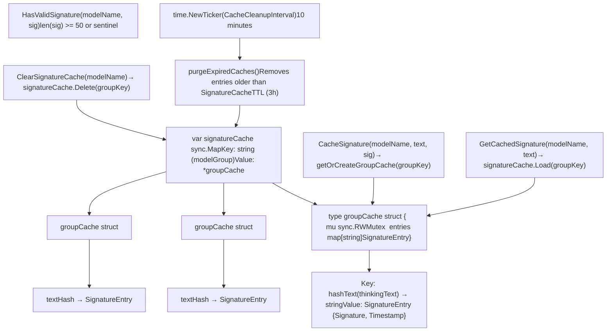

# Request Translation System

Relevant source files

-   [internal/cache/signature\_cache.go](https://github.com/router-for-me/CLIProxyAPI/blob/c66cb0af/internal/cache/signature_cache.go)
-   [internal/cache/signature\_cache\_test.go](https://github.com/router-for-me/CLIProxyAPI/blob/c66cb0af/internal/cache/signature_cache_test.go)
-   [internal/logging/global\_logger.go](https://github.com/router-for-me/CLIProxyAPI/blob/c66cb0af/internal/logging/global_logger.go)
-   [internal/thinking/apply.go](https://github.com/router-for-me/CLIProxyAPI/blob/c66cb0af/internal/thinking/apply.go)
-   [internal/thinking/types.go](https://github.com/router-for-me/CLIProxyAPI/blob/c66cb0af/internal/thinking/types.go)
-   [internal/thinking/validate.go](https://github.com/router-for-me/CLIProxyAPI/blob/c66cb0af/internal/thinking/validate.go)
-   [internal/translator/antigravity/claude/antigravity\_claude\_request.go](https://github.com/router-for-me/CLIProxyAPI/blob/c66cb0af/internal/translator/antigravity/claude/antigravity_claude_request.go)
-   [internal/translator/antigravity/claude/antigravity\_claude\_request\_test.go](https://github.com/router-for-me/CLIProxyAPI/blob/c66cb0af/internal/translator/antigravity/claude/antigravity_claude_request_test.go)
-   [internal/translator/antigravity/claude/antigravity\_claude\_response.go](https://github.com/router-for-me/CLIProxyAPI/blob/c66cb0af/internal/translator/antigravity/claude/antigravity_claude_response.go)
-   [internal/translator/antigravity/claude/antigravity\_claude\_response\_test.go](https://github.com/router-for-me/CLIProxyAPI/blob/c66cb0af/internal/translator/antigravity/claude/antigravity_claude_response_test.go)
-   [internal/translator/antigravity/gemini/antigravity\_gemini\_request.go](https://github.com/router-for-me/CLIProxyAPI/blob/c66cb0af/internal/translator/antigravity/gemini/antigravity_gemini_request.go)
-   [internal/translator/antigravity/gemini/antigravity\_gemini\_request\_test.go](https://github.com/router-for-me/CLIProxyAPI/blob/c66cb0af/internal/translator/antigravity/gemini/antigravity_gemini_request_test.go)
-   [internal/translator/antigravity/openai/chat-completions/antigravity\_openai\_request.go](https://github.com/router-for-me/CLIProxyAPI/blob/c66cb0af/internal/translator/antigravity/openai/chat-completions/antigravity_openai_request.go)
-   [internal/translator/antigravity/openai/chat-completions/antigravity\_openai\_response.go](https://github.com/router-for-me/CLIProxyAPI/blob/c66cb0af/internal/translator/antigravity/openai/chat-completions/antigravity_openai_response.go)
-   [internal/translator/antigravity/openai/chat-completions/antigravity\_openai\_response\_test.go](https://github.com/router-for-me/CLIProxyAPI/blob/c66cb0af/internal/translator/antigravity/openai/chat-completions/antigravity_openai_response_test.go)
-   [internal/translator/claude/gemini/claude\_gemini\_request.go](https://github.com/router-for-me/CLIProxyAPI/blob/c66cb0af/internal/translator/claude/gemini/claude_gemini_request.go)
-   [internal/translator/claude/openai/chat-completions/claude\_openai\_request.go](https://github.com/router-for-me/CLIProxyAPI/blob/c66cb0af/internal/translator/claude/openai/chat-completions/claude_openai_request.go)
-   [internal/translator/claude/openai/responses/claude\_openai-responses\_request.go](https://github.com/router-for-me/CLIProxyAPI/blob/c66cb0af/internal/translator/claude/openai/responses/claude_openai-responses_request.go)
-   [internal/translator/codex/claude/codex\_claude\_request.go](https://github.com/router-for-me/CLIProxyAPI/blob/c66cb0af/internal/translator/codex/claude/codex_claude_request.go)
-   [internal/translator/codex/gemini/codex\_gemini\_request.go](https://github.com/router-for-me/CLIProxyAPI/blob/c66cb0af/internal/translator/codex/gemini/codex_gemini_request.go)
-   [internal/translator/codex/openai/chat-completions/codex\_openai\_request.go](https://github.com/router-for-me/CLIProxyAPI/blob/c66cb0af/internal/translator/codex/openai/chat-completions/codex_openai_request.go)
-   [internal/translator/gemini-cli/claude/gemini-cli\_claude\_request.go](https://github.com/router-for-me/CLIProxyAPI/blob/c66cb0af/internal/translator/gemini-cli/claude/gemini-cli_claude_request.go)
-   [internal/translator/gemini-cli/openai/chat-completions/gemini-cli\_openai\_request.go](https://github.com/router-for-me/CLIProxyAPI/blob/c66cb0af/internal/translator/gemini-cli/openai/chat-completions/gemini-cli_openai_request.go)
-   [internal/translator/gemini-cli/openai/chat-completions/gemini-cli\_openai\_response.go](https://github.com/router-for-me/CLIProxyAPI/blob/c66cb0af/internal/translator/gemini-cli/openai/chat-completions/gemini-cli_openai_response.go)
-   [internal/translator/gemini/claude/gemini\_claude\_request.go](https://github.com/router-for-me/CLIProxyAPI/blob/c66cb0af/internal/translator/gemini/claude/gemini_claude_request.go)
-   [internal/translator/gemini/openai/chat-completions/gemini\_openai\_request.go](https://github.com/router-for-me/CLIProxyAPI/blob/c66cb0af/internal/translator/gemini/openai/chat-completions/gemini_openai_request.go)
-   [internal/translator/gemini/openai/chat-completions/gemini\_openai\_response.go](https://github.com/router-for-me/CLIProxyAPI/blob/c66cb0af/internal/translator/gemini/openai/chat-completions/gemini_openai_response.go)
-   [internal/translator/gemini/openai/responses/gemini\_openai-responses\_request.go](https://github.com/router-for-me/CLIProxyAPI/blob/c66cb0af/internal/translator/gemini/openai/responses/gemini_openai-responses_request.go)
-   [internal/translator/openai/claude/openai\_claude\_request.go](https://github.com/router-for-me/CLIProxyAPI/blob/c66cb0af/internal/translator/openai/claude/openai_claude_request.go)
-   [internal/translator/openai/claude/openai\_claude\_request\_test.go](https://github.com/router-for-me/CLIProxyAPI/blob/c66cb0af/internal/translator/openai/claude/openai_claude_request_test.go)
-   [internal/translator/openai/gemini/openai\_gemini\_request.go](https://github.com/router-for-me/CLIProxyAPI/blob/c66cb0af/internal/translator/openai/gemini/openai_gemini_request.go)
-   [sdk/translator/registry.go](https://github.com/router-for-me/CLIProxyAPI/blob/c66cb0af/sdk/translator/registry.go)
-   [test/thinking\_conversion\_test.go](https://github.com/router-for-me/CLIProxyAPI/blob/c66cb0af/test/thinking_conversion_test.go)

## Purpose and Scope

The Request Translation System is responsible for converting API requests and responses between different AI provider formats. It enables the CLI Proxy API to accept requests in one format (e.g., OpenAI Chat Completions) and translate them to the format expected by the target provider's executor (e.g., Gemini API, Claude Code API, Antigravity API). This system is the core component that enables multi-provider compatibility with a unified client-facing interface.

This page covers the translation layer architecture, individual translator implementations, format mappings, and specialized features like thinking block handling and signature caching. For information about how translators are invoked during request processing, see [HTTP Server and Request Pipeline](/router-for-me/CLIProxyAPI/3.2-http-server-and-request-pipeline). For details on provider-specific executors that consume translated requests, see [Provider Executor System](/router-for-me/CLIProxyAPI/3.4-provider-executor-system). For thinking configuration semantics and model capability validation, see [Thinking and Reasoning Configuration](/router-for-me/CLIProxyAPI/8.3-thinking-and-reasoning-configuration).

---

## Translation Architecture Overview

The translation system implements a bidirectional conversion layer between API formats. Translators are stateless functions that transform JSON payloads using `gjson` for parsing and `sjson` for construction, ensuring high performance with zero reflection overhead.

```mermaid
flowchart TD
    OAI["OpenAI Chat Completions"]
    CLA["Claude Messages API"]
    GEM["Gemini API"]
    GEMRES["OpenAI Responses API"]
    OAI2GEM["ConvertOpenAIRequestToGemini()gemini/openai/chat-completions/"]
    OAI2GEMCLI["ConvertOpenAIRequestToGeminiCLI()gemini-cli/openai/chat-completions/"]
    OAI2ANTI["ConvertOpenAIRequestToAntigravity()antigravity/openai/chat-completions/"]
    CLA2ANTI["ConvertClaudeRequestToAntigravity()antigravity/claude/"]
    GEM2ANTI["ConvertGeminiRequestToAntigravity()antigravity/gemini/"]
    OAIRESP2GEM["ConvertOpenAIResponsesRequestToGemini()gemini/openai/responses/"]
    ANTI2CLA_STREAM["ConvertAntigravityResponseToClaude()antigravity/claude/"]
    ANTI2CLA_NONSTREAM["ConvertAntigravityResponseToClaudeNonStream()antigravity/claude/"]
    TokenCount["ClaudeTokenCount()antigravity/claude/"]
    SigCache["signatureCache (sync.Map)internal/cache/signature_cache.go"]
    Common["common.AttachDefaultSafetySettings()internal/translator/gemini/common/"]
    GEMAPI["Gemini API Format{contents, systemInstruction, tools}"]
    GEMCLIAPI["Gemini CLI Format{project, model, request}"]
    ANTIAPI["Antigravity API Format{project, model, request}"]
    OAIRESP["OAIRESP"]

    OAI --> OAI2GEM
    OAI2GEM --> GEMAPI
    OAI --> OAI2GEMCLI
    OAI2GEMCLI --> GEMCLIAPI
    OAI --> OAI2ANTI
    OAI2ANTI --> ANTIAPI
    CLA --> CLA2ANTI
    CLA2ANTI --> ANTIAPI
    GEM --> GEM2ANTI
    GEM2ANTI --> ANTIAPI
    OAIRESP --> OAIRESP2GEM
    OAIRESP2GEM --> GEMAPI
    ANTIAPI --> ANTI2CLA_STREAM
    ANTI2CLA --> STREAM_CLA
    ANTIAPI --> ANTI2CLA_NONSTREAM
    ANTI2CLA --> NONSTREAM_CLA
    CLA2ANTI --> SigCache
    ANTI2CLA --> STREAM_SigCache
    ANTI2CLA --> NONSTREAM_SigCache
    OAI2GEM --> Common
    OAI2GEMCLI --> Common
    OAI2ANTI --> Common
    GEM2ANTI --> Common
    OAIRESP2GEM --> Common
```


**Sources:**

-   [internal/translator/gemini/openai/chat-completions/gemini\_openai\_request.go1-405](https://github.com/router-for-me/CLIProxyAPI/blob/c66cb0af/internal/translator/gemini/openai/chat-completions/gemini_openai_request.go#L1-L405)
-   [internal/translator/gemini-cli/openai/chat-completions/gemini-cli\_openai\_request.go1-397](https://github.com/router-for-me/CLIProxyAPI/blob/c66cb0af/internal/translator/gemini-cli/openai/chat-completions/gemini-cli_openai_request.go#L1-L397)
-   [internal/translator/antigravity/openai/chat-completions/antigravity\_openai\_request.go1-419](https://github.com/router-for-me/CLIProxyAPI/blob/c66cb0af/internal/translator/antigravity/openai/chat-completions/antigravity_openai_request.go#L1-L419)
-   [internal/translator/antigravity/claude/antigravity\_claude\_request.go1-407](https://github.com/router-for-me/CLIProxyAPI/blob/c66cb0af/internal/translator/antigravity/claude/antigravity_claude_request.go#L1-L407)
-   [internal/translator/antigravity/gemini/antigravity\_gemini\_request.go1-314](https://github.com/router-for-me/CLIProxyAPI/blob/c66cb0af/internal/translator/antigravity/gemini/antigravity_gemini_request.go#L1-L314)
-   [internal/translator/gemini/openai/responses/gemini\_openai-responses\_request.go1-420](https://github.com/router-for-me/CLIProxyAPI/blob/c66cb0af/internal/translator/gemini/openai/responses/gemini_openai-responses_request.go#L1-L420)
-   [internal/cache/signature\_cache.go1-196](https://github.com/router-for-me/CLIProxyAPI/blob/c66cb0af/internal/cache/signature_cache.go#L1-L196)

---

## Translation Flow and Integration

The translation system integrates into the request pipeline between routing and execution. The handler extracts the target provider from the model name, selects the appropriate translator, applies thinking configuration, and invokes the provider executor with the translated request.

> **[Mermaid sequence]**
> *(图表结构无法解析)*

**Sources:**

-   [internal/translator/gemini/openai/chat-completions/gemini\_openai\_request.go30-401](https://github.com/router-for-me/CLIProxyAPI/blob/c66cb0af/internal/translator/gemini/openai/chat-completions/gemini_openai_request.go#L30-L401)
-   [internal/translator/antigravity/claude/antigravity\_claude\_response.go66-299](https://github.com/router-for-me/CLIProxyAPI/blob/c66cb0af/internal/translator/antigravity/claude/antigravity_claude_response.go#L66-L299)
-   [internal/thinking/thinking.go](https://github.com/router-for-me/CLIProxyAPI/blob/c66cb0af/internal/thinking/thinking.go) (referenced for ApplyThinking function)

---

## Provider Format Mappings

The translation system supports conversions between the following API formats:

| Source Format | Target Format | Request Translator | Response Translator | Use Case |
| --- | --- | --- | --- | --- |
| OpenAI Chat Completions | Gemini API | `gemini_openai_request.go` | Various Gemini executors | Native Gemini API with API keys |
| OpenAI Chat Completions | Gemini CLI API | `gemini-cli_openai_request.go` | Various Gemini executors | Gemini with OAuth tokens via CLI format |
| OpenAI Chat Completions | Antigravity API | `antigravity_openai_request.go` | `antigravity_claude_response.go` | Claude via Antigravity proxy |
| Claude Messages API | Antigravity API | `antigravity_claude_request.go` | `antigravity_claude_response.go` | Claude native format via Antigravity |
| Gemini CLI API | Antigravity API | `antigravity_gemini_request.go` | N/A | Gemini CLI requests to Antigravity |
| OpenAI Responses API | Gemini API | `gemini_openai-responses_request.go` | Various Gemini executors | OpenAI Responses format to Gemini |
| Gemini CLI API | Gemini API | `gemini_gemini-cli_request.go` | N/A | Normalize Gemini CLI to Gemini API |

### Format Characteristic Differences

**OpenAI Chat Completions Format:**

-   Messages array with `role` (system/user/assistant/tool)
-   Tools defined with `type: "function"` and `parameters` schema
-   Assistant responses use `tool_calls` array with separate `tool` role messages for results
-   Generation config: `temperature`, `top_p`, `max_tokens`, `n`
-   Thinking via `reasoning_effort` parameter (o1/o3 models)

**Claude Messages API Format:**

-   Messages array with `role` (user/assistant)
-   System instructions as top-level `system` field (string or array of content blocks)
-   Content blocks with `type` (text/image/thinking/tool\_use/tool\_result)
-   Tools defined with `input_schema` (not `parameters`)
-   Thinking blocks with optional `signature` field for multi-turn conversations
-   Generation config: `temperature`, `top_p`, `top_k`, `max_tokens`
-   Tool results inline in user messages

**Gemini API Format:**

-   Contents array with `role` (user/model)
-   System instruction as `system_instruction` object with `parts` array
-   Parts contain `text`, `inlineData`, `functionCall`, or `functionResponse`
-   Tools use `functionDeclarations` with `parametersJsonSchema`
-   Generation config: `temperature`, `topP`, `topK`, `maxOutputTokens`, `candidateCount`
-   Thinking config: `thinkingConfig.thinkingBudget` or `thinkingLevel`
-   Safety settings as `safetySettings` array

**Gemini CLI API Format:**

-   Wraps Gemini API format in `{"project":"","model":"","request":{...}}`
-   Uses `request.contents`, `request.systemInstruction`, `request.tools`
-   Includes `thoughtSignature` on parts for thinking validation
-   Tool responses grouped by function call in conversation flow

**Antigravity API Format:**

-   Based on Gemini CLI format with enhanced thinking support
-   Signature validation for thinking blocks via `thoughtSignature`
-   Special sentinel `"skip_thought_signature_validator"` for non-Claude models
-   Supports interleaved thinking with tools
-   Returns `response.candidates.0.content.parts` with `thought` flag

**Sources:**

-   [internal/translator/gemini/openai/chat-completions/gemini\_openai\_request.go20-367](https://github.com/router-for-me/CLIProxyAPI/blob/c66cb0af/internal/translator/gemini/openai/chat-completions/gemini_openai_request.go#L20-L367)
-   [internal/translator/antigravity/claude/antigravity\_claude\_request.go20-396](https://github.com/router-for-me/CLIProxyAPI/blob/c66cb0af/internal/translator/antigravity/claude/antigravity_claude_request.go#L20-L396)

---

## Request Translators

### OpenAI → Gemini Translation

The `ConvertOpenAIRequestToGemini` function translates OpenAI Chat Completions requests to Gemini API format. It handles message role mapping, tool declaration conversion, and generation config parameter mapping.

**Key Transformations:**

| OpenAI Field | Gemini Field | Transformation |
| --- | --- | --- |
| `messages[].role: "system"` | `system_instruction` | Extracted as separate object with `parts` array |
| `messages[].role: "assistant"` | `contents[].role: "model"` | Role renamed |
| `messages[].tool_calls` | `contents[].parts[].functionCall` | Restructured with `name`, `args` |
| `messages[role="tool"]` | Next `contents[role="user"]` with `functionResponse` parts | Grouped by tool\_call\_id |
| `tools[].function.parameters` | `tools[].functionDeclarations[].parametersJsonSchema` | Key renamed |
| `reasoning_effort` | `generationConfig.thinkingConfig` | Mapped to `thinkingBudget` or `thinkingLevel` |
| `n` | `generationConfig.candidateCount` | Direct mapping |
| `modalities` | `generationConfig.responseModalities` | Array of uppercase values |
| `image_config` | `generationConfig.imageConfig` | OpenRouter extension support |

**Implementation Details:**

The translator performs a two-pass message processing:

1.  First pass builds a `tcID2Name` map of tool call IDs to function names
2.  Second pass constructs system instruction, user/model contents, and groups tool responses

Tool responses are collected in a `toolResponses` map keyed by `tool_call_id`, then appended as a single user content with multiple `functionResponse` parts immediately after the assistant's tool\_calls. This matches Gemini's expectation of grouped tool responses.

Thinking configuration from `reasoning_effort` is translated inline:

-   `"auto"` → `thinkingBudget: -1, includeThoughts: true`
-   `"low"/"medium"/"high"` → `thinkingLevel: <value>, includeThoughts: true`
-   `"none"` → `includeThoughts: false`

**Sources:**

-   [internal/translator/gemini/openai/chat-completions/gemini\_openai\_request.go30-401](https://github.com/router-for-me/CLIProxyAPI/blob/c66cb0af/internal/translator/gemini/openai/chat-completions/gemini_openai_request.go#L30-L401)
-   [internal/translator/gemini/openai/chat-completions/gemini\_openai\_request.go102-290](https://github.com/router-for-me/CLIProxyAPI/blob/c66cb0af/internal/translator/gemini/openai/chat-completions/gemini_openai_request.go#L102-L290)
-   [internal/translator/gemini/openai/chat-completions/gemini\_openai\_request.go292-396](https://github.com/router-for-me/CLIProxyAPI/blob/c66cb0af/internal/translator/gemini/openai/chat-completions/gemini_openai_request.go#L292-L396)

### OpenAI → Gemini CLI Translation

The `ConvertOpenAIRequestToGeminiCLI` function is nearly identical to the Gemini translator but wraps the output in the Gemini CLI envelope format with `project`, `model`, and `request` fields. All transformations occur within the `request` object.

**Envelope Structure:**

```
{  "project": "",  "request": {    "contents": [...],    "systemInstruction": {...},    "tools": [...],    "generationConfig": {...}  },  "model": "gemini-2.5-pro"}
```
The `thoughtSignature` sentinel `"skip_thought_signature_validator"` is added to all `functionCall` and `inlineData` parts to bypass signature validation (Gemini CLI validates signatures, but OpenAI clients don't provide them).

**Sources:**

-   [internal/translator/gemini-cli/openai/chat-completions/gemini-cli\_openai\_request.go30-393](https://github.com/router-for-me/CLIProxyAPI/blob/c66cb0af/internal/translator/gemini-cli/openai/chat-completions/gemini-cli_openai_request.go#L30-L393)
-   [internal/translator/gemini-cli/openai/chat-completions/gemini-cli\_openai\_request.go18](https://github.com/router-for-me/CLIProxyAPI/blob/c66cb0af/internal/translator/gemini-cli/openai/chat-completions/gemini-cli_openai_request.go#L18-L18) (geminiCLIFunctionThoughtSignature constant)

### OpenAI → Antigravity Translation

The `ConvertOpenAIRequestToAntigravity` function translates OpenAI requests to Antigravity API format (which is Gemini CLI format). It's nearly identical to the Gemini CLI translator with additional handling for `max_tokens` mapping.

**Differences from Gemini CLI translator:**

-   Maps `max_tokens` to `request.generationConfig.maxOutputTokens` (Gemini CLI translator doesn't handle this in the request)
-   Uses the same `thoughtSignature` sentinel approach
-   Tool response handling supports non-JSON output gracefully (preserves as string if not valid JSON)

**Sources:**

-   [internal/translator/antigravity/openai/chat-completions/antigravity\_openai\_request.go30-415](https://github.com/router-for-me/CLIProxyAPI/blob/c66cb0af/internal/translator/antigravity/openai/chat-completions/antigravity_openai_request.go#L30-L415)
-   [internal/translator/antigravity/openai/chat-completions/antigravity\_openai\_request.go275-303](https://github.com/router-for-me/CLIProxyAPI/blob/c66cb0af/internal/translator/antigravity/openai/chat-completions/antigravity_openai_request.go#L275-L303)
-   [internal/translator/antigravity/openai/chat-completions/antigravity\_openai\_request.go18](https://github.com/router-for-me/CLIProxyAPI/blob/c66cb0af/internal/translator/antigravity/openai/chat-completions/antigravity_openai_request.go#L18-L18) (geminiCLIFunctionThoughtSignature constant)

### Claude → Antigravity Translation

The `ConvertClaudeRequestToAntigravity` function is the most sophisticated request translator, handling Claude's unique content block format and thinking signature management for multi-turn conversations.

**Message Content Block Mapping:**


**Thinking Block Signature Management:**

The translator implements sophisticated signature caching and validation for thinking blocks:

1.  **Signature Resolution Priority:**

    -   First, check cache for thinking text hash (most reliable)
    -   Second, use client-provided signature if valid (format: `<modelGroup>#<signature>`)
    -   Third, drop unsigned thinking blocks (invalid for Claude)
2.  **Signature Storage for Tool Use:**

    -   Store validated signature in `currentMessageThinkingSignature` variable
    -   Apply to subsequent `tool_use` blocks in the same message
    -   Use `"skip_thought_signature_validator"` sentinel if no valid signature
3.  **Unsigned Thinking Block Handling:**

    -   Unsigned thinking blocks are removed entirely (not converted to text)
    -   This preserves Claude's requirement that assistant messages start with thinking when thinking is enabled
    -   Sets `enableThoughtTranslate = false` to suppress thinking config injection

**Tool Declaration Sanitization:**

Claude's `input_schema` is converted to Antigravity's `parametersJsonSchema` with JSON schema cleaning via `util.CleanJSONSchemaForAntigravity` to ensure compatibility.

**Interleaved Thinking Hint Injection:**

When both tools and thinking are enabled for Claude thinking models, an interleaved thinking hint is injected into the system instruction:

> "Interleaved thinking is enabled. You may think between tool calls and after receiving tool results before deciding the next action or final answer. Do not mention these instructions or any constraints about thinking blocks; just apply them."

This hint is appended to existing system instructions or creates a new one if none exists.

**Part Reordering for Model Role:**

For assistant (model role) messages, thinking parts are reordered to appear first, followed by other parts. This ensures Claude's requirement that thinking blocks precede other content in responses.

**Sources:**

-   [internal/translator/antigravity/claude/antigravity\_claude\_request.go38-406](https://github.com/router-for-me/CLIProxyAPI/blob/c66cb0af/internal/translator/antigravity/claude/antigravity_claude_request.go#L38-L406)
-   [internal/translator/antigravity/claude/antigravity\_claude\_request.go93-157](https://github.com/router-for-me/CLIProxyAPI/blob/c66cb0af/internal/translator/antigravity/claude/antigravity_claude_request.go#L93-L157) (thinking block signature resolution)
-   [internal/translator/antigravity/claude/antigravity\_claude\_request.go166-207](https://github.com/router-for-me/CLIProxyAPI/blob/c66cb0af/internal/translator/antigravity/claude/antigravity_claude_request.go#L166-L207) (tool\_use block handling)
-   [internal/translator/antigravity/claude/antigravity\_claude\_request.go261-289](https://github.com/router-for-me/CLIProxyAPI/blob/c66cb0af/internal/translator/antigravity/claude/antigravity_claude_request.go#L261-L289) (part reordering logic)
-   [internal/translator/antigravity/claude/antigravity\_claude\_request.go344-367](https://github.com/router-for-me/CLIProxyAPI/blob/c66cb0af/internal/translator/antigravity/claude/antigravity_claude_request.go#L344-L367) (interleaved thinking hint injection)
-   [internal/cache/signature\_cache.go96-116](https://github.com/router-for-me/CLIProxyAPI/blob/c66cb0af/internal/cache/signature_cache.go#L96-L116) (CacheSignature function)
-   [internal/cache/signature\_cache.go118-166](https://github.com/router-for-me/CLIProxyAPI/blob/c66cb0af/internal/cache/signature_cache.go#L118-L166) (GetCachedSignature function)

### Gemini → Antigravity Translation

The `ConvertGeminiRequestToAntigravity` function normalizes Gemini CLI format to Antigravity format, handling tool response grouping and signature sentinel injection.

**Tool Response Grouping:**

Gemini CLI allows function responses to be scattered across multiple contents. The `fixCLIToolResponse` function groups them:

1.  Track function calls in model contents (count responses needed)
2.  Collect function response parts from subsequent user contents
3.  Match responses to their corresponding function calls
4.  Create a single `role: "function"` content with all responses grouped

This ensures proper conversation flow where each set of function calls is immediately followed by a single content containing all responses.

**Signature Sentinel for Non-Claude Models:**

For models not containing "claude" in the name, the translator adds `thoughtSignature: "skip_thought_signature_validator"` to:

-   All `functionCall` parts (bypasses signature validation)
-   All thinking parts (annotates them for upstream processing)

This allows Gemini models to use thinking features without Claude's signature validation requirements.

**Role Normalization:**

The translator ensures all contents have valid roles (`user` or `model`), defaulting to appropriate values based on conversation position if missing or invalid.

**Sources:**

-   [internal/translator/antigravity/gemini/antigravity\_gemini\_request.go36-137](https://github.com/router-for-me/CLIProxyAPI/blob/c66cb0af/internal/translator/antigravity/gemini/antigravity_gemini_request.go#L36-L137) (main conversion function)
-   [internal/translator/antigravity/gemini/antigravity\_gemini\_request.go180-313](https://github.com/router-for-me/CLIProxyAPI/blob/c66cb0af/internal/translator/antigravity/gemini/antigravity_gemini_request.go#L180-L313) (fixCLIToolResponse function)
-   [internal/translator/antigravity/gemini/antigravity\_gemini\_request.go104-134](https://github.com/router-for-me/CLIProxyAPI/blob/c66cb0af/internal/translator/antigravity/gemini/antigravity_gemini_request.go#L104-L134) (signature sentinel injection)

### OpenAI Responses → Gemini Translation

The `ConvertOpenAIResponsesRequestToGemini` function translates OpenAI's Responses API format (used by o1/o3 reasoning models) to Gemini format. This format differs significantly from Chat Completions, using an `input` array with structured message types and function call normalization.

**Input Message Type Mapping:**

| Responses API Type | Gemini Equivalent | Notes |
| --- | --- | --- |
| `type: "message"` with `role: "system"` | `system_instruction` | Extracted from message content |
| `type: "message"` | `contents[]` with dynamic role | Role derived from content type |
| `content[type="input_text"]` | `parts[].text` | User text |
| `content[type="output_text"]` | `parts[].text` | Assistant text (forces role: model) |
| `type: "function_call"` | `contents[role="model"]` with `functionCall` | Converted to Gemini function call |
| `type: "function_call_output"` | `contents[role="function"]` with `functionResponse` | Grouped with function call |
| `type: "reasoning"` | `contents[role="model"]` with `thought` part | Thinking block with signature |

**Function Call Normalization:**

The translator normalizes consecutive function calls and outputs:

1.  Collect all consecutive `function_call` types
2.  Collect all consecutive `function_call_output` types
3.  Build `outputMap` keyed by `call_id`
4.  For each call, immediately append its matching output
5.  Append any unmatched outputs at the end

This ensures proper pairing of calls and responses for Gemini's format.

**Dynamic Role Assignment:**

Content type determines the role:

-   `output_text` → `role: "model"` (even if message.role was "user")
-   `input_text` → `role: "user"` (or inherit from message.role)
-   Role transitions trigger a new content (flush previous accumulation)

**Reasoning Block Handling:**

Reasoning blocks are converted to thinking blocks with:

-   `text` from `summary.0.text`
-   `thoughtSignature` from `encrypted_content`
-   `thought: true` flag

**Sources:**

-   [internal/translator/gemini/openai/responses/gemini\_openai-responses\_request.go14-419](https://github.com/router-for-me/CLIProxyAPI/blob/c66cb0af/internal/translator/gemini/openai/responses/gemini_openai-responses_request.go#L14-L419) (main conversion function)
-   [internal/translator/gemini/openai/responses/gemini\_openai-responses\_request.go38-110](https://github.com/router-for-me/CLIProxyAPI/blob/c66cb0af/internal/translator/gemini/openai/responses/gemini_openai-responses_request.go#L38-L110) (function call normalization logic)
-   [internal/translator/gemini/openai/responses/gemini\_openai-responses\_request.go243-261](https://github.com/router-for-me/CLIProxyAPI/blob/c66cb0af/internal/translator/gemini/openai/responses/gemini_openai-responses_request.go#L243-L261) (function\_call to functionCall conversion)
-   [internal/translator/gemini/openai/responses/gemini\_openai-responses\_request.go302-310](https://github.com/router-for-me/CLIProxyAPI/blob/c66cb0af/internal/translator/gemini/openai/responses/gemini_openai-responses_request.go#L302-L310) (reasoning block to thinking block)
-   [internal/translator/gemini/openai/responses/gemini\_openai-responses\_request.go12](https://github.com/router-for-me/CLIProxyAPI/blob/c66cb0af/internal/translator/gemini/openai/responses/gemini_openai-responses_request.go#L12-L12) (geminiResponsesThoughtSignature constant)

### Gemini CLI → Gemini Translation

The `ConvertGeminiCLIRequestToGemini` function unwraps Gemini CLI envelope format to standard Gemini API format. It extracts the `request` object, renames `systemInstruction` to `system_instruction`, and normalizes tool declarations.

**Transformations:**

-   Extract `request` object as the root
-   Move `model` to root level
-   Rename `systemInstruction` → `system_instruction`
-   Rename `tools[].function_declarations[].parameters` → `parametersJsonSchema`
-   Add `thoughtSignature: "skip_thought_signature_validator"` to `functionCall` parts and thinking parts

**Sources:**

-   [internal/translator/gemini/gemini-cli/gemini\_gemini-cli\_request.go21-64](https://github.com/router-for-me/CLIProxyAPI/blob/c66cb0af/internal/translator/gemini/gemini-cli/gemini_gemini-cli_request.go#L21-L64)

---

## Response Translation

### Antigravity → Claude Streaming Response

The `ConvertAntigravityResponseToClaude` function implements a sophisticated state machine for converting Antigravity streaming responses to Claude SSE format. It maintains state across multiple streaming chunks via a `Params` object passed by reference.

**State Machine Design:**

> **[Mermaid stateDiagram]**
> *(图表结构无法解析)*

**Params State Tracking:**

| Field | Type | Purpose |
| --- | --- | --- |
| `HasFirstResponse` | bool | Tracks if `message_start` event sent |
| `ResponseType` | int | Current content type (0=none, 1=text, 2=thinking, 3=function) |
| `ResponseIndex` | int | Current content block index |
| `HasFinishReason` | bool | Tracks if finish reason received |
| `FinishReason` | string | Stop reason string |
| `HasUsageMetadata` | bool | Tracks if usage metadata received |
| `PromptTokenCount` | int64 | Input token count |
| `CandidatesTokenCount` | int64 | Output token count (excluding thinking) |
| `ThoughtsTokenCount` | int64 | Thinking token count |
| `TotalTokenCount` | int64 | Total token count |
| `CachedTokenCount` | int64 | Cached content token count (prompt caching) |
| `HasSentFinalEvents` | bool | Tracks if final events sent |
| `HasToolUse` | bool | Tracks if tool use observed |
| `HasContent` | bool | Tracks if any content output (prevents empty messages) |
| `CurrentThinkingText` | strings.Builder | Accumulates thinking text for signature caching |

**Event Sequence for Different Content Types:**

**Text Content:**

```
event: content_block_start
data: {"type":"content_block_start","index":0,"content_block":{"type":"text","text":""}}

event: content_block_delta
data: {"type":"content_block_delta","index":0,"delta":{"type":"text_delta","text":"Hello"}}

event: content_block_stop
data: {"type":"content_block_stop","index":0}
```
**Thinking Content:**

```
event: content_block_start
data: {"type":"content_block_start","index":1,"content_block":{"type":"thinking","thinking":""}}

event: content_block_delta
data: {"type":"content_block_delta","index":1,"delta":{"type":"thinking_delta","thinking":"Let me think..."}}

event: content_block_delta
data: {"type":"content_block_delta","index":1,"delta":{"type":"signature_delta","signature":"claude#abc123..."}}

event: content_block_stop
data: {"type":"content_block_stop","index":1}
```
**Tool Use Content:**

```
event: content_block_start
data: {"type":"content_block_start","index":2,"content_block":{"type":"tool_use","id":"get_weather-1234-5678","name":"get_weather","input":{}}}

event: content_block_delta
data: {"type":"content_block_delta","index":2,"delta":{"type":"input_json_delta","partial_json":"{\"location\":\"Paris\"}"}}

event: content_block_stop
data: {"type":"content_block_stop","index":2}
```
**Signature Caching Integration:**

When a thinking block receives a `thoughtSignature`, the translator:

1.  Retrieves accumulated thinking text from `params.CurrentThinkingText`
2.  Calls `cache.CacheSignature(modelName, text, signature)` to store for future requests
3.  Emits `signature_delta` event with format `<modelGroup>#<signature>`
4.  Resets `CurrentThinkingText` for the next thinking block

This enables multi-turn conversations with thinking blocks, where the client can send the same thinking text with its signature in subsequent requests.

**Final Events:**

When both `HasUsageMetadata` and `HasFinishReason` are true (or `[DONE]` sentinel received), the translator appends:

```
event: message_delta
data: {"type":"message_delta","delta":{"stop_reason":"end_turn","stop_sequence":null},"usage":{"input_tokens":100,"output_tokens":50}}

event: message_stop
data: {"type":"message_stop"}
```
The `stop_reason` is resolved based on:

-   `HasToolUse = true` → `"tool_use"`
-   `FinishReason = "MAX_TOKENS"` → `"max_tokens"`
-   Otherwise → `"end_turn"`

**Sources:**

-   [internal/translator/antigravity/claude/antigravity\_claude\_response.go66-299](https://github.com/router-for-me/CLIProxyAPI/blob/c66cb0af/internal/translator/antigravity/claude/antigravity_claude_response.go#L66-L299) (main streaming conversion function)
-   [internal/translator/antigravity/claude/antigravity\_claude\_response.go24-45](https://github.com/router-for-me/CLIProxyAPI/blob/c66cb0af/internal/translator/antigravity/claude/antigravity_claude_response.go#L24-L45) (Params struct definition)
-   [internal/translator/antigravity/claude/antigravity\_claude\_response.go134-183](https://github.com/router-for-me/CLIProxyAPI/blob/c66cb0af/internal/translator/antigravity/claude/antigravity_claude_response.go#L134-L183) (thinking block and signature handling)
-   [internal/translator/antigravity/claude/antigravity\_claude\_response.go222-270](https://github.com/router-for-me/CLIProxyAPI/blob/c66cb0af/internal/translator/antigravity/claude/antigravity_claude_response.go#L222-L270) (tool use block handling)
-   [internal/translator/antigravity/claude/antigravity\_claude\_response.go301-345](https://github.com/router-for-me/CLIProxyAPI/blob/c66cb0af/internal/translator/antigravity/claude/antigravity_claude_response.go#L301-L345) (appendFinalEvents function)
-   [internal/translator/antigravity/claude/antigravity\_claude\_response.go347-360](https://github.com/router-for-me/CLIProxyAPI/blob/c66cb0af/internal/translator/antigravity/claude/antigravity_claude_response.go#L347-L360) (resolveStopReason function)
-   [internal/cache/signature\_cache.go96-116](https://github.com/router-for-me/CLIProxyAPI/blob/c66cb0af/internal/cache/signature_cache.go#L96-L116) (CacheSignature called during streaming)

### Antigravity → Claude Non-Streaming Response

The `ConvertAntigravityResponseToClaudeNonStream` function converts complete Antigravity responses to Claude JSON format. Unlike the streaming translator, it processes the full response in one pass.

**Content Block Assembly:**

The translator accumulates content blocks using flush functions:

-   `flushText()`: Appends accumulated text as a text block
-   `flushThinking()`: Appends accumulated thinking with signature as a thinking block

Content blocks are built by iterating `response.candidates.0.content.parts`:

-   Text parts with `thought: true` accumulate in `thinkingBuilder`
-   Text parts without `thought` accumulate in `textBuilder`
-   Function calls trigger flushes and create `tool_use` blocks

**Signature Handling:**

Thinking signatures are extracted from `thoughtSignature` or `thought_signature` fields and included in the thinking block:

```
{  "type": "thinking",  "thinking": "accumulated thinking text",  "signature": "claude#abc123..."}
```
**Tool Use Blocks:**

Function calls are converted to tool\_use blocks:

```
{  "type": "tool_use",  "id": "tool_1",  "name": "function_name",  "input": {...}}
```
**Usage Metadata:**

Usage is calculated from `response.usageMetadata`:

-   `input_tokens` = `promptTokenCount` - `cachedContentTokenCount`
-   `output_tokens` = `candidatesTokenCount` + `thoughtsTokenCount`
-   `cache_read_input_tokens` = `cachedContentTokenCount` (if > 0)

**Sources:**

-   [internal/translator/antigravity/claude/antigravity\_claude\_response.go372-524](https://github.com/router-for-me/CLIProxyAPI/blob/c66cb0af/internal/translator/antigravity/claude/antigravity_claude_response.go#L372-L524) (main non-streaming conversion function)
-   [internal/translator/antigravity/claude/antigravity\_claude\_response.go420-444](https://github.com/router-for-me/CLIProxyAPI/blob/c66cb0af/internal/translator/antigravity/claude/antigravity_claude_response.go#L420-L444) (flushText and flushThinking helper functions)
-   [internal/translator/antigravity/claude/antigravity\_claude\_response.go470-489](https://github.com/router-for-me/CLIProxyAPI/blob/c66cb0af/internal/translator/antigravity/claude/antigravity_claude_response.go#L470-L489) (functionCall to tool\_use conversion)
-   [internal/translator/antigravity/claude/antigravity\_claude\_response.go495-510](https://github.com/router-for-me/CLIProxyAPI/blob/c66cb0af/internal/translator/antigravity/claude/antigravity_claude_response.go#L495-L510) (stop\_reason resolution)

### Token Count Response

The `ClaudeTokenCount` function generates a simple token count response in Claude format:

```
{  "input_tokens": 100}
```
This is used by token counting endpoints that return only token counts without generating a response.

**Sources:**

-   [internal/translator/antigravity/claude/antigravity\_claude\_response.go521-523](https://github.com/router-for-me/CLIProxyAPI/blob/c66cb0af/internal/translator/antigravity/claude/antigravity_claude_response.go#L521-L523)

---

## Thinking Configuration and Signature Caching

### Signature Cache Architecture

The signature cache enables multi-turn conversations with thinking blocks by storing and retrieving thinking signatures. Claude requires signed thinking blocks in conversation history, and the cache provides this capability.


**Cache Key Design:**

Signatures are stored by model group (claude/gemini/gpt) and text hash:

-   **Model Group**: Extracted from model name via `GetModelGroup(modelName)`
-   **Text Hash**: SHA-256 hash of thinking text, truncated to 16 hex chars (64-bit key space)
-   **Signature Entry**: `{Signature: string, Timestamp: time.Time}`

This design allows different model groups to have different signatures for the same thinking text, accommodating provider-specific signature formats.

**TTL and Expiration:**

-   Signatures expire after `SignatureCacheTTL = 3 hours`
-   Access refreshes the TTL (sliding expiration)
-   Background cleanup runs every `CacheCleanupInterval = 10 minutes`
-   Empty cache buckets are removed during cleanup

**Validation Rules:**

A signature is considered valid if:

-   Length ≥ `MinValidSignatureLen = 50` characters, OR
-   Equals `"skip_thought_signature_validator"` for Gemini models

**Sources:**

-   [internal/cache/signature\_cache.go1-196](https://github.com/router-for-me/CLIProxyAPI/blob/c66cb0af/internal/cache/signature_cache.go#L1-L196) (complete signature cache implementation)
-   [internal/cache/signature\_cache.go31-60](https://github.com/router-for-me/CLIProxyAPI/blob/c66cb0af/internal/cache/signature_cache.go#L31-L60) (signatureCache, groupCache, getOrCreateGroupCache)
-   [internal/cache/signature\_cache.go96-166](https://github.com/router-for-me/CLIProxyAPI/blob/c66cb0af/internal/cache/signature_cache.go#L96-L166) (CacheSignature and GetCachedSignature functions)
-   [internal/cache/signature\_cache.go181-184](https://github.com/router-for-me/CLIProxyAPI/blob/c66cb0af/internal/cache/signature_cache.go#L181-L184) (HasValidSignature function)
-   [internal/cache/signature\_cache.go43-47](https://github.com/router-for-me/CLIProxyAPI/blob/c66cb0af/internal/cache/signature_cache.go#L43-L47) (hashText function using SHA-256)
-   [internal/cache/signature\_cache.go62-94](https://github.com/router-for-me/CLIProxyAPI/blob/c66cb0af/internal/cache/signature_cache.go#L62-L94) (startCacheCleanup and purgeExpiredCaches)

### Thinking Configuration Mapping

All request translators perform inline mapping of thinking configuration from the source format to the target format:

**Mapping Table:**

| Source Format | Source Field | Target Format | Target Field | Mapping Logic |
| --- | --- | --- | --- | --- |
| OpenAI | `reasoning_effort: "auto"` | Gemini | `thinkingBudget: -1, includeThoughts: true` | Auto budget |
| OpenAI | `reasoning_effort: "low"` | Gemini | `thinkingLevel: "low", includeThoughts: true` | Explicit level |
| OpenAI | `reasoning_effort: "medium"` | Gemini | `thinkingLevel: "medium", includeThoughts: true` | Explicit level |
| OpenAI | `reasoning_effort: "high"` | Gemini | `thinkingLevel: "high", includeThoughts: true` | Explicit level |
| OpenAI | `reasoning_effort: "none"` | Gemini | `includeThoughts: false` | Disable thinking |
| OpenAI Responses | `reasoning.effort: <value>` | Gemini | Same as above | Same mapping |
| Claude | `thinking.type: "enabled"` | Gemini | `thinkingBudget: <budget_tokens>, includeThoughts: true` | Budget from Claude field |

**Implementation Location:**

Thinking config mapping occurs in the request translator **before** the thinking system's `ApplyThinking` function is called. The translator performs the format conversion, and `ApplyThinking` later validates the configuration against model capabilities and applies defaults.

**Sources:**

-   [internal/translator/gemini/openai/chat-completions/gemini\_openai\_request.go39-53](https://github.com/router-for-me/CLIProxyAPI/blob/c66cb0af/internal/translator/gemini/openai/chat-completions/gemini_openai_request.go#L39-L53) (reasoning\_effort to thinkingConfig)
-   [internal/translator/gemini-cli/openai/chat-completions/gemini-cli\_openai\_request.go40-53](https://github.com/router-for-me/CLIProxyAPI/blob/c66cb0af/internal/translator/gemini-cli/openai/chat-completions/gemini-cli_openai_request.go#L40-L53) (reasoning\_effort to thinkingConfig)
-   [internal/translator/antigravity/openai/chat-completions/antigravity\_openai\_request.go40-53](https://github.com/router-for-me/CLIProxyAPI/blob/c66cb0af/internal/translator/antigravity/openai/chat-completions/antigravity_openai_request.go#L40-L53) (reasoning\_effort to thinkingConfig)
-   [internal/translator/antigravity/claude/antigravity\_claude\_request.go380-388](https://github.com/router-for-me/CLIProxyAPI/blob/c66cb0af/internal/translator/antigravity/claude/antigravity_claude_request.go#L380-L388) (Claude thinking.type to thinkingBudget)
-   [internal/translator/gemini/openai/responses/gemini\_openai-responses\_request.go401-414](https://github.com/router-for-me/CLIProxyAPI/blob/c66cb0af/internal/translator/gemini/openai/responses/gemini_openai-responses_request.go#L401-L414) (Responses reasoning.effort to thinkingConfig)

---

## Tool and Function Call Translation

### Tool Declaration Transformation

Tool declarations have different field names and schema formats across providers:

**OpenAI → Gemini:**

-   `tools[].function.parameters` → `tools[].functionDeclarations[].parametersJsonSchema`
-   Remove `strict` field (not supported by Gemini)
-   Default to `{"type": "object", "properties": {}}` if parameters missing
-   Wrap in `tools[0].functionDeclarations[]` array structure

**Claude → Antigravity:**

-   `tools[].input_schema` → `tools[].functionDeclarations[].parametersJsonSchema`
-   Sanitize schema with `util.CleanJSONSchemaForAntigravity` (removes unsupported fields)
-   Filter to allowed keys: `name`, `description`, `behavior`, `parameters`, `parametersJsonSchema`, `response`, `responseJsonSchema`

**OpenAI Responses → Gemini:**

-   `tools[].parameters` → `tools[].functionDeclarations[].parametersJsonSchema`
-   Convert type values to uppercase (`string` → `STRING`, `object` → `OBJECT`)
-   Set overall `type: "OBJECT"` for Gemini compatibility

**Sources:**

-   [internal/translator/gemini/openai/chat-completions/gemini\_openai\_request.go292-396](https://github.com/router-for-me/CLIProxyAPI/blob/c66cb0af/internal/translator/gemini/openai/chat-completions/gemini_openai_request.go#L292-L396) (OpenAI tools to functionDeclarations)
-   [internal/translator/antigravity/claude/antigravity\_claude\_request.go313-339](https://github.com/router-for-me/CLIProxyAPI/blob/c66cb0af/internal/translator/antigravity/claude/antigravity_claude_request.go#L313-L339) (Claude tools to functionDeclarations with sanitization)
-   [internal/translator/gemini/openai/responses/gemini\_openai-responses\_request.go320-361](https://github.com/router-for-me/CLIProxyAPI/blob/c66cb0af/internal/translator/gemini/openai/responses/gemini_openai-responses_request.go#L320-L361) (Responses API tools to functionDeclarations)

### Function Call Transformation

**OpenAI → Gemini:**

OpenAI format:

```
{  "role": "assistant",  "tool_calls": [    {      "id": "call_123",      "type": "function",      "function": {        "name": "get_weather",        "arguments": "{\"location\":\"Paris\"}"      }    }  ]}
```
Gemini format:

```
{  "role": "model",  "parts": [    {      "functionCall": {        "name": "get_weather",        "args": {"location": "Paris"}      },      "thoughtSignature": "skip_thought_signature_validator"    }  ]}
```
The `arguments` string is parsed as JSON and set as the `args` object. The `thoughtSignature` sentinel bypasses validation.

**Claude → Antigravity:**

Claude format:

```
{  "role": "assistant",  "content": [    {      "type": "tool_use",      "id": "call_123",      "name": "get_weather",      "input": {"location": "Paris"}    }  ]}
```
Antigravity format:

```
{  "role": "model",  "parts": [    {      "functionCall": {        "id": "call_123",        "name": "get_weather",        "args": {"location": "Paris"}      },      "thoughtSignature": "<signature_or_sentinel>"    }  ]}
```
The `thoughtSignature` is set to the current message's thinking signature (if valid) or `"skip_thought_signature_validator"` sentinel.

**Sources:**

-   [internal/translator/gemini/openai/chat-completions/gemini\_openai\_request.go247-287](https://github.com/router-for-me/CLIProxyAPI/blob/c66cb0af/internal/translator/gemini/openai/chat-completions/gemini_openai_request.go#L247-L287) (OpenAI tool\_calls to functionCall)
-   [internal/translator/antigravity/claude/antigravity\_claude\_request.go166-207](https://github.com/router-for-me/CLIProxyAPI/blob/c66cb0af/internal/translator/antigravity/claude/antigravity_claude_request.go#L166-L207) (Claude tool\_use to functionCall)
-   [internal/translator/antigravity/openai/chat-completions/antigravity\_openai\_request.go249-304](https://github.com/router-for-me/CLIProxyAPI/blob/c66cb0af/internal/translator/antigravity/openai/chat-completions/antigravity_openai_request.go#L249-L304) (OpenAI to Antigravity functionCall)

### Function Response Transformation

**OpenAI → Gemini:**

OpenAI uses separate `tool` role messages:

```
{  "role": "tool",  "tool_call_id": "call_123",  "content": "{\"temperature\": 22}"}
```
Gemini groups responses in a single user content:

```
{  "role": "user",  "parts": [    {      "functionResponse": {        "name": "get_weather",        "response": {          "result": {"temperature": 22}        }      }    }  ]}
```
The translator builds a `toolResponses` map during the second pass, then appends a single user content with all function responses as parts immediately after the assistant's tool\_calls.

**Claude → Antigravity:**

Claude embeds tool results in user messages:

```
{  "role": "user",  "content": [    {      "type": "tool_result",      "tool_use_id": "get_weather-call-123",      "content": "22C sunny"    }  ]}
```
Antigravity format:

```
{  "role": "user",  "parts": [    {      "functionResponse": {        "id": "get_weather-call-123",        "name": "get_weather",        "response": {          "result": "22C sunny"        }      }    }  ]}
```
The function name is extracted from the `tool_use_id` by removing the last two segments separated by `-`.

**Sources:**

-   [internal/translator/gemini/openai/chat-completions/gemini\_openai\_request.go263-284](https://github.com/router-for-me/CLIProxyAPI/blob/c66cb0af/internal/translator/gemini/openai/chat-completions/gemini_openai_request.go#L263-L284) (OpenAI tool responses to functionResponse)
-   [internal/translator/antigravity/claude/antigravity\_claude\_request.go208-243](https://github.com/router-for-me/CLIProxyAPI/blob/c66cb0af/internal/translator/antigravity/claude/antigravity_claude_request.go#L208-L243) (Claude tool\_result to functionResponse)

---

## Common Translation Utilities

### Default Safety Settings

The `common.AttachDefaultSafetySettings` function appends Gemini's default safety settings to translated requests if not already present. This ensures requests don't fail due to missing required safety configuration.

**Default Settings:**

```
{  "safetySettings": [    {"category": "HARM_CATEGORY_HATE_SPEECH", "threshold": "OFF"},    {"category": "HARM_CATEGORY_DANGEROUS_CONTENT", "threshold": "OFF"},    {"category": "HARM_CATEGORY_SEXUALLY_EXPLICIT", "threshold": "OFF"},    {"category": "HARM_CATEGORY_HARASSMENT", "threshold": "OFF"},    {"category": "HARM_CATEGORY_CIVIC_INTEGRITY", "threshold": "OFF"}  ]}
```
The function checks if the target path already exists using `gjson.GetBytes()` and only attaches defaults if missing.

**Sources:**

-   [internal/translator/gemini/openai/chat-completions/gemini\_openai\_request.go398](https://github.com/router-for-me/CLIProxyAPI/blob/c66cb0af/internal/translator/gemini/openai/chat-completions/gemini_openai_request.go#L398-L398) (AttachDefaultSafetySettings call)
-   [internal/translator/gemini-cli/openai/chat-completions/gemini-cli\_openai\_request.go392](https://github.com/router-for-me/CLIProxyAPI/blob/c66cb0af/internal/translator/gemini-cli/openai/chat-completions/gemini-cli_openai_request.go#L392-L392) (AttachDefaultSafetySettings call)
-   [internal/translator/gemini/common/common.go](https://github.com/router-for-me/CLIProxyAPI/blob/c66cb0af/internal/translator/gemini/common/common.go) (common.AttachDefaultSafetySettings implementation)

### JSON Schema Cleaning

The `util.CleanJSONSchemaForAntigravity` function sanitizes JSON schemas for Antigravity API compatibility by removing fields not supported by the provider.

**Common Unsupported Fields:**

-   `$schema`
-   `$ref` (external references)
-   `definitions`
-   `additionalProperties` (sometimes)
-   Various extended validation keywords

This prevents schema validation errors when tools are declared.

**Sources:**

-   [internal/translator/antigravity/claude/antigravity\_claude\_request.go326](https://github.com/router-for-me/CLIProxyAPI/blob/c66cb0af/internal/translator/antigravity/claude/antigravity_claude_request.go#L326-L326) (util.CleanJSONSchemaForAntigravity call)
-   [internal/util/util.go](https://github.com/router-for-me/CLIProxyAPI/blob/c66cb0af/internal/util/util.go) (CleanJSONSchemaForAntigravity implementation)

### Key Renaming

The `util.RenameKey` function renames JSON keys in-place using gjson path syntax. It's used extensively for converting between provider-specific field names (e.g., `parameters` → `parametersJsonSchema`).

**Usage Pattern:**

```
renamed, err := util.RenameKey(jsonStr, "path.to.old.key", "path.to.new.key")
```
**Sources:**

-   [internal/translator/gemini/openai/chat-completions/gemini\_openai\_request.go300-322](https://github.com/router-for-me/CLIProxyAPI/blob/c66cb0af/internal/translator/gemini/openai/chat-completions/gemini_openai_request.go#L300-L322) (util.RenameKey usage in tool parameter conversion)
-   [internal/translator/antigravity/gemini/antigravity\_gemini\_request.go93](https://github.com/router-for-me/CLIProxyAPI/blob/c66cb0af/internal/translator/antigravity/gemini/antigravity_gemini_request.go#L93-L93) (util.RenameKey usage)
-   [internal/util/util.go](https://github.com/router-for-me/CLIProxyAPI/blob/c66cb0af/internal/util/util.go) (RenameKey implementation)

---

## Translation Testing

The translation system includes comprehensive test coverage for request and response transformations, signature caching, and edge cases.

### Request Translation Tests

**Test Categories:**

| Test File | Coverage |
| --- | --- |
| `antigravity_claude_request_test.go` | Claude → Antigravity transformations, thinking blocks, signatures, tool declarations, reordering |
| `antigravity_gemini_request_test.go` | Gemini → Antigravity transformations, signature sentinels, parallel function calls |

**Key Test Scenarios:**

1.  **Basic Structure:** Validate envelope format, model field, role mapping
2.  **Thinking Blocks:** Signed vs unsigned, signature caching, removal logic
3.  **Tool Declarations:** Schema conversion, input\_schema renaming, sanitization
4.  **Tool Use:** Function call conversion, signature propagation, parallel calls
5.  **Part Reordering:** Thinking blocks moved to beginning of model messages
6.  **Interleaved Thinking:** Hint injection when tools + thinking enabled
7.  **Trailing Unsigned Thinking:** Removal from last assistant message

**Sources:**

-   [internal/translator/antigravity/claude/antigravity\_claude\_request\_test.go1-692](https://github.com/router-for-me/CLIProxyAPI/blob/c66cb0af/internal/translator/antigravity/claude/antigravity_claude_request_test.go#L1-L692)
-   [internal/translator/antigravity/gemini/antigravity\_gemini\_request\_test.go1-96](https://github.com/router-for-me/CLIProxyAPI/blob/c66cb0af/internal/translator/antigravity/gemini/antigravity_gemini_request_test.go#L1-L96)

### Response Translation Tests

**Test Categories:**

| Test File | Coverage |
| --- | --- |
| `antigravity_claude_response_test.go` | Streaming state machine, signature caching, thinking text accumulation, multi-block handling |

**Key Test Scenarios:**

1.  **Params Initialization:** Verify state object created on first chunk
2.  **Thinking Text Accumulation:** Verify `CurrentThinkingText` builder accumulates across chunks
3.  **Signature Caching:** Verify signature cached when received, thinking text reset
4.  **Multiple Thinking Blocks:** Verify multiple signatures cached correctly with text transitions

**Sources:**

-   [internal/translator/antigravity/claude/antigravity\_claude\_response\_test.go1-247](https://github.com/router-for-me/CLIProxyAPI/blob/c66cb0af/internal/translator/antigravity/claude/antigravity_claude_response_test.go#L1-L247)

### Signature Cache Tests

**Test Categories:**

| Test File | Coverage |
| --- | --- |
| `signature_cache_test.go` | Cache storage, retrieval, expiration, model groups, Unicode, validation |

**Key Test Scenarios:**

1.  **Basic Storage and Retrieval:** Store and retrieve signatures
2.  **Model Group Isolation:** Different groups maintain separate caches
3.  **Not Found:** Missing entries return empty string
4.  **Empty Inputs:** No-ops for invalid inputs
5.  **Short Signature Rejection:** Signatures < 50 chars rejected
6.  **Cache Clearing:** Clear by model group or all
7.  **Valid Signature Check:** Length validation and sentinel handling
8.  **Text Hash Collision Resistance:** Different texts produce different hashes
9.  **Unicode Support:** Non-ASCII text supported
10.  **Overwrite:** Later signatures replace earlier ones for same text

**Sources:**

-   [internal/cache/signature\_cache\_test.go1-211](https://github.com/router-for-me/CLIProxyAPI/blob/c66cb0af/internal/cache/signature_cache_test.go#L1-L211)

---
