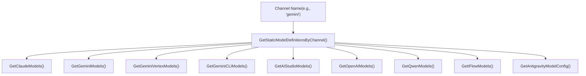
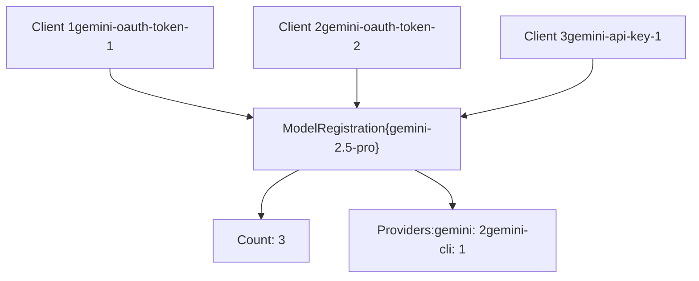
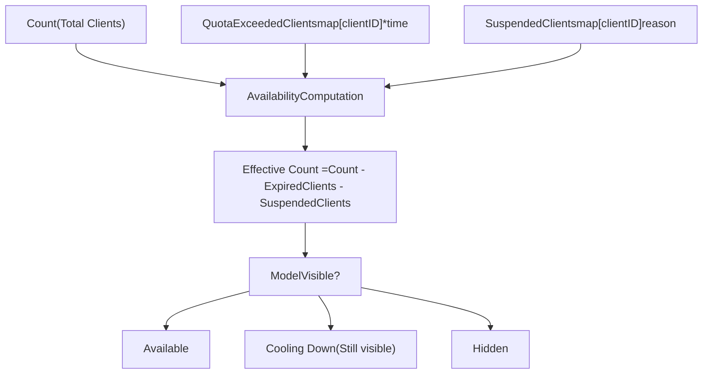
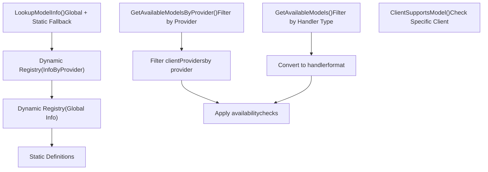

# Model Registry and Selection

Relevant source files

-   [internal/api/handlers/management/model\_definitions.go](https://github.com/router-for-me/CLIProxyAPI/blob/c66cb0af/internal/api/handlers/management/model_definitions.go)
-   [internal/config/oauth\_model\_alias\_migration.go](https://github.com/router-for-me/CLIProxyAPI/blob/c66cb0af/internal/config/oauth_model_alias_migration.go)
-   [internal/config/oauth\_model\_alias\_migration\_test.go](https://github.com/router-for-me/CLIProxyAPI/blob/c66cb0af/internal/config/oauth_model_alias_migration_test.go)
-   [internal/config/oauth\_model\_alias\_test.go](https://github.com/router-for-me/CLIProxyAPI/blob/c66cb0af/internal/config/oauth_model_alias_test.go)
-   [internal/registry/model\_definitions.go](https://github.com/router-for-me/CLIProxyAPI/blob/c66cb0af/internal/registry/model_definitions.go)
-   [internal/registry/model\_definitions\_static\_data.go](https://github.com/router-for-me/CLIProxyAPI/blob/c66cb0af/internal/registry/model_definitions_static_data.go)
-   [internal/registry/model\_registry.go](https://github.com/router-for-me/CLIProxyAPI/blob/c66cb0af/internal/registry/model_registry.go)
-   [internal/registry/model\_registry\_hook\_test.go](https://github.com/router-for-me/CLIProxyAPI/blob/c66cb0af/internal/registry/model_registry_hook_test.go)
-   [internal/thinking/provider/iflow/apply.go](https://github.com/router-for-me/CLIProxyAPI/blob/c66cb0af/internal/thinking/provider/iflow/apply.go)
-   [internal/util/claude\_model.go](https://github.com/router-for-me/CLIProxyAPI/blob/c66cb0af/internal/util/claude_model.go)
-   [internal/util/claude\_model\_test.go](https://github.com/router-for-me/CLIProxyAPI/blob/c66cb0af/internal/util/claude_model_test.go)
-   [internal/watcher/diff/oauth\_model\_alias.go](https://github.com/router-for-me/CLIProxyAPI/blob/c66cb0af/internal/watcher/diff/oauth_model_alias.go)
-   [sdk/cliproxy/model\_registry.go](https://github.com/router-for-me/CLIProxyAPI/blob/c66cb0af/sdk/cliproxy/model_registry.go)

## Purpose and Scope

This document explains the Model Registry system, which provides centralized management of available AI models across all provider integrations. The registry implements a dynamic availability tracking system with reference counting, quota management, and suspension mechanisms to ensure accurate model visibility to clients.

For information about configuring model aliases and mappings, see [Model Mapping and Exclusion](/router-for-me/CLIProxyAPI/8.2-model-mapping-and-exclusion). For authentication credential management that feeds the registry, see [Authentication and Credential Management](/router-for-me/CLIProxyAPI/3.3-authentication-and-credential-management).

---

## Overview

The Model Registry is implemented in [\`internal/registry/model\_registry.go\`](https://github.com/router-for-me/CLIProxyAPI/blob/c66cb0af/`internal/registry/model_registry.go`)() and serves as the central source of truth for model availability. It combines static model definitions with dynamic runtime registration to track which models are accessible through which providers and credentials.

### Key Responsibilities

| Responsibility | Description |
| --- | --- |
| **Static Definitions** | Maintains hardcoded model metadata for known provider models |
| **Dynamic Registration** | Tracks models registered by active authentication clients |
| **Availability Tracking** | Reference counts clients per model, accounts for quota/suspension |
| **Provider Grouping** | Associates models with provider identifiers for routing |
| **Change Notification** | Triggers hooks when model availability changes |

### Core Data Structures

**ModelInfo** [\`internal/registry/model\_registry.go18-59](https://github.com/router-for-me/CLIProxyAPI/blob/c66cb0af/`internal/registry/model_registry.go#L18-L59)() represents model metadata:

```
type ModelInfo struct {    ID                  string            // Model identifier    Type                string            // Provider type    DisplayName         string            // Human-readable name    ContextLength       int               // Context window size    MaxCompletionTokens int               // Max output tokens    Thinking            *ThinkingSupport  // Reasoning budget capabilities    UserDefined         bool              // Config-defined model flag    // ... additional fields}
```
**ModelRegistration** [\`internal/registry/model\_registry.go77-93](https://github.com/router-for-me/CLIProxyAPI/blob/c66cb0af/`internal/registry/model_registry.go#L77-L93)() tracks availability:

```
type ModelRegistration struct {    Info                 *ModelInfo              // Base model metadata    InfoByProvider       map[string]*ModelInfo   // Provider-specific metadata    Count                int                     // Active client count    Providers            map[string]int          // Clients per provider    QuotaExceededClients map[string]*time.Time   // Quota-exceeded tracking    SuspendedClients     map[string]string       // Suspended clients    LastUpdated          time.Time               // Last modification}
```
**Sources:** [\`internal/registry/model\_registry.go1-135](https://github.com/router-for-me/CLIProxyAPI/blob/c66cb0af/`internal/registry/model_registry.go#L1-L135)()

---

## Static Model Definitions

Static model definitions provide hardcoded metadata for known AI models from various providers. These definitions are maintained in [\`internal/registry/model\_definitions\_static\_data.go\`](https://github.com/router-for-me/CLIProxyAPI/blob/c66cb0af/`internal/registry/model_definitions_static_data.go`)().

### Provider Model Catalogs

Each provider has a dedicated function returning its model catalog:

| Function | Provider | File Location |
| --- | --- | --- |
| `GetClaudeModels()` | Anthropic Claude | [\`model\_definitions\_static\_data.go6-111](https://github.com/router-for-me/CLIProxyAPI/blob/c66cb0af/`model_definitions_static_data.go#L6-L111)() |
| `GetGeminiModels()` | Google Gemini (AI Studio) | [\`model\_definitions\_static\_data.go113-207](https://github.com/router-for-me/CLIProxyAPI/blob/c66cb0af/`model_definitions_static_data.go#L113-L207)() |
| `GetGeminiVertexModels()` | Google Vertex AI | [\`model\_definitions\_static\_data.go209-363](https://github.com/router-for-me/CLIProxyAPI/blob/c66cb0af/`model_definitions_static_data.go#L209-L363)() |
| `GetGeminiCLIModels()` | Gemini CLI | [\`model\_definitions\_static\_data.go365-444](https://github.com/router-for-me/CLIProxyAPI/blob/c66cb0af/`model_definitions_static_data.go#L365-L444)() |
| `GetAIStudioModels()` | AI Studio WebSocket | [\`model\_definitions\_static\_data.go446-600](https://github.com/router-for-me/CLIProxyAPI/blob/c66cb0af/`model_definitions_static_data.go#L446-L600)() |
| `GetOpenAIModels()` | OpenAI Codex | [\`model\_definitions\_static\_data.go602-760](https://github.com/router-for-me/CLIProxyAPI/blob/c66cb0af/`model_definitions_static_data.go#L602-L760)() |
| `GetQwenModels()` | Qwen | [\`model\_definitions\_static\_data.go762-805](https://github.com/router-for-me/CLIProxyAPI/blob/c66cb0af/`model_definitions_static_data.go#L762-L805)() |
| `GetIFlowModels()` | iFlow | [\`model\_definitions\_static\_data.go807-850](https://github.com/router-for-me/CLIProxyAPI/blob/c66cb0af/`model_definitions_static_data.go#L807-L850)() |

### Channel-Based Lookup

`GetStaticModelDefinitionsByChannel()` [\`internal/registry/model\_definitions.go23-68](https://github.com/router-for-me/CLIProxyAPI/blob/c66cb0af/`internal/registry/model_definitions.go#L23-L68)() provides channel-based static model lookup:


### Thinking Support Configuration

Static definitions include `ThinkingSupport` [\`internal/registry/model\_registry.go61-75](https://github.com/router-for-me/CLIProxyAPI/blob/c66cb0af/`internal/registry/model_registry.go#L61-L75)() metadata for reasoning capabilities:

```
type ThinkingSupport struct {    Min            int      // Minimum thinking budget (tokens)    Max            int      // Maximum thinking budget (tokens)    ZeroAllowed    bool     // Whether 0 disables thinking    DynamicAllowed bool     // Whether -1 enables dynamic budget    Levels         []string // Discrete effort levels}
```
Example from Claude definitions [\`model\_definitions\_static\_data.go18](https://github.com/router-for-me/CLIProxyAPI/blob/c66cb0af/`model_definitions_static_data.go#L18-L18)():

```
Thinking: &ThinkingSupport{    Min: 1024, Max: 128000,     ZeroAllowed: true, DynamicAllowed: false}
```
**Sources:** [\`internal/registry/model\_definitions.go\`](https://github.com/router-for-me/CLIProxyAPI/blob/c66cb0af/`internal/registry/model_definitions.go`)(), [\`internal/registry/model\_definitions\_static\_data.go\`](https://github.com/router-for-me/CLIProxyAPI/blob/c66cb0af/`internal/registry/model_definitions_static_data.go`)()

---

## Dynamic Model Registration

The registry tracks models dynamically as authentication clients register and unregister. Each client can provide multiple models, and the registry maintains reference counts to determine model availability.

### Registration Flow

> **[Mermaid sequence]**
> *(图表结构无法解析)*

### RegisterClient Implementation

The `RegisterClient()` method [\`internal/registry/model\_registry.go202-413](https://github.com/router-for-me/CLIProxyAPI/blob/c66cb0af/`internal/registry/model_registry.go#L202-L413)() handles both initial registration and updates:

**New Client Registration:**

1.  Validates model list contains valid `ModelInfo` entries
2.  Increments `Count` for each model via `addModelRegistration()`
3.  Updates `Providers` map to track provider-specific counts
4.  Stores original `ModelInfo` per client in `clientModelInfos`
5.  Triggers `OnModelsRegistered` hook asynchronously

**Existing Client Update:**

1.  Computes added and removed models by comparing old vs new
2.  Handles provider changes (decrements old provider, increments new)
3.  Applies removals first to maintain accurate counts
4.  Applies additions with updated metadata
5.  Clears quota/suspension state for re-registered models

### Reference Counting

Models use reference counting to track availability:


When `Count` reaches zero, the model is removed from the registry.

**Sources:** [\`internal/registry/model\_registry.go202-489](https://github.com/router-for-me/CLIProxyAPI/blob/c66cb0af/`internal/registry/model_registry.go#L202-L489)()

---

## Availability Tracking

The registry tracks multiple availability states beyond simple reference counts to accurately reflect which models can handle requests.

### Availability States


### Quota Exceeded Tracking

When a client exhausts its quota, the registry marks it via `SetModelQuotaExceeded()` [\`internal/registry/model\_registry.go590-603](https://github.com/router-for-me/CLIProxyAPI/blob/c66cb0af/`internal/registry/model_registry.go#L590-L603)(). The timestamp is stored in `QuotaExceededClients` map.

**Cooldown Period:** Models with quota-exceeded clients remain visible for 5 minutes [\`internal/registry/model\_registry.go709](https://github.com/router-for-me/CLIProxyAPI/blob/c66cb0af/`internal/registry/model_registry.go#L709-L709)() to avoid rapid visibility changes:

```
quotaExpiredDuration := 5 * time.Minutefor _, quotaTime := range registration.QuotaExceededClients {    if quotaTime != nil && now.Sub(*quotaTime) < quotaExpiredDuration {        expiredClients++    }}
```
### Suspension Mechanism

Clients can be temporarily suspended via `SuspendClientModel()` [\`internal/registry/model\_registry.go624-648](https://github.com/router-for-me/CLIProxyAPI/blob/c66cb0af/`internal/registry/model_registry.go#L624-L648)() with an optional reason string:

| Reason | Effect |
| --- | --- |
| `"quota"` | Treated as cooldown suspension, model remains visible if other clients in cooldown |
| Other reasons | Model becomes unavailable immediately |

**Resume:** `ResumeClientModel()` [\`internal/registry/model\_registry.go654-671](https://github.com/router-for-me/CLIProxyAPI/blob/c66cb0af/`internal/registry/model_registry.go#L654-L671)() clears suspension.

### GetAvailableModels Logic

`GetAvailableModels()` [\`internal/registry/model\_registry.go704-751](https://github.com/router-for-me/CLIProxyAPI/blob/c66cb0af/`internal/registry/model_registry.go#L704-L751)() computes visibility:

```
availableClients := registration.CountexpiredClients := 0  // Quota exceeded, within 5 min windowcooldownSuspended := 0  // Suspended with reason="quota"otherSuspended := 0  // Suspended with other reasons effectiveClients := availableClients - expiredClients - otherSuspended // Include if:// 1. effectiveClients > 0, OR// 2. All clients are either expired or in quota cooldown (no "other" suspensions)if effectiveClients > 0 ||    (availableClients > 0 && (expiredClients > 0 || cooldownSuspended > 0) && otherSuspended == 0) {    models = append(models, model)}
```
**Sources:** [\`internal/registry/model\_registry.go590-751](https://github.com/router-for-me/CLIProxyAPI/blob/c66cb0af/`internal/registry/model_registry.go#L590-L751)()

---

## Model Lookup and Selection

The registry provides multiple lookup methods optimized for different use cases.

### Lookup Methods


### LookupModelInfo

`LookupModelInfo()` [\`internal/registry/model\_registry.go138-153](https://github.com/router-for-me/CLIProxyAPI/blob/c66cb0af/`internal/registry/model_registry.go#L138-L153)() performs hierarchical lookup:

1.  Check dynamic registry for provider-specific info via `GetModelInfo(modelID, provider)`
2.  If not found, check dynamic registry for global info
3.  Fallback to `LookupStaticModelInfo()` [\`internal/registry/model\_definitions.go70-105](https://github.com/router-for-me/CLIProxyAPI/blob/c66cb0af/`internal/registry/model_definitions.go#L70-L105)()

**Provider-Specific Info:** The `InfoByProvider` map [\`internal/registry/model\_registry.go82](https://github.com/router-for-me/CLIProxyAPI/blob/c66cb0af/`internal/registry/model_registry.go#L82-L82)() allows different metadata per provider. For example, a model might have different token limits when accessed through different providers.

### GetAvailableModelsByProvider

`GetAvailableModelsByProvider()` [\`internal/registry/model\_registry.go759-876](https://github.com/router-for-me/CLIProxyAPI/blob/c66cb0af/`internal/registry/model_registry.go#L759-L876)() returns models for a specific provider:

1.  Iterate through `clientProviders` map to find matching provider
2.  Collect models from matching clients via `clientModels` map
3.  Apply quota/suspension filtering per provider
4.  Return provider-specific `ModelInfo` from `clientModelInfos` if available

**Use Case:** AMP module uses this to list models available through a specific provider route [\`/api/provider/](https://github.com/router-for-me/CLIProxyAPI/blob/c66cb0af/`/api/provider/#LNaN-LNaN) See [Amp CLI Integration](/router-for-me/CLIProxyAPI/4.5-amp-cli-integration).

### GetModelProviders

`GetModelProviders()` [\`internal/registry/model\_registry.go912-971](https://github.com/router-for-me/CLIProxyAPI/blob/c66cb0af/`internal/registry/model_registry.go#L912-L971)() returns which providers supply a given model, sorted by availability count descending.

**Sources:** [\`internal/registry/model\_registry.go138-971](https://github.com/router-for-me/CLIProxyAPI/blob/c66cb0af/`internal/registry/model_registry.go#L138-L971)(), [\`internal/registry/model\_definitions.go70-105](https://github.com/router-for-me/CLIProxyAPI/blob/c66cb0af/`internal/registry/model_definitions.go#L70-L105)()

---

## Registry Hooks

The registry supports external observers via the `ModelRegistryHook` interface [\`internal/registry/model\_registry.go95-100](https://github.com/router-for-me/CLIProxyAPI/blob/c66cb0af/`internal/registry/model_registry.go#L95-L100)().

### Hook Interface

```
type ModelRegistryHook interface {    OnModelsRegistered(ctx context.Context, provider, clientID string, models []*ModelInfo)    OnModelsUnregistered(ctx context.Context, provider, clientID string)}
```
### Hook Execution Semantics

> **[Mermaid sequence]**
> *(图表结构无法解析)*

**Key Properties:**

| Property | Behavior |
| --- | --- |
| **Execution** | Asynchronous, non-blocking [\`internal/registry/model\_registry.go173-182](https://github.com/router-for-me/CLIProxyAPI/blob/c66cb0af/`internal/registry/model_registry.go#L173-L182)() |
| **Timeout** | 5 seconds per hook call [\`internal/registry/model\_registry.go165](https://github.com/router-for-me/CLIProxyAPI/blob/c66cb0af/`internal/registry/model_registry.go#L165-L165)() |
| **Panic Safety** | Recovered, logged, doesn't affect registry [\`internal/registry/model\_registry.go175-177](https://github.com/router-for-me/CLIProxyAPI/blob/c66cb0af/`internal/registry/model_registry.go#L175-L177)() |
| **Model List** | Unique copy created via `cloneModelInfosUnique()` [\`internal/registry/model\_registry.go172](https://github.com/router-for-me/CLIProxyAPI/blob/c66cb0af/`internal/registry/model_registry.go#L172-L172)() |

### Setting Hooks

```
hook := &MyHook{}registry.GetGlobalRegistry().SetHook(hook) // Or via SDK:cliproxy.SetGlobalModelRegistryHook(hook)
```
**Use Case:** External systems can observe model availability changes for synchronization or notification purposes.

**Sources:** [\`internal/registry/model\_registry.go95-200](https://github.com/router-for-me/CLIProxyAPI/blob/c66cb0af/`internal/registry/model_registry.go#L95-L200)(), [\`internal/registry/model\_registry\_hook\_test.go\`](https://github.com/router-for-me/CLIProxyAPI/blob/c66cb0af/`internal/registry/model_registry_hook_test.go`)(), [\`sdk/cliproxy/model\_registry.go\`](https://github.com/router-for-me/CLIProxyAPI/blob/c66cb0af/`sdk/cliproxy/model_registry.go`)()

---

## Integration with Configuration

### User-Defined Models

Models can be defined in configuration files via provider-specific `models[]` arrays. These models have special handling:

```
type ModelInfo struct {    // ...    UserDefined bool `json:"-"`  // Set for config-defined models}
```
**User-Defined Flag:** [\`internal/registry/model\_registry.go58](https://github.com/router-for-me/CLIProxyAPI/blob/c66cb0af/`internal/registry/model_registry.go#L58-L58)() indicates the model was defined through configuration rather than static definitions. Thinking configuration passes through without validation for user-defined models [\`internal/thinking/provider/iflow/apply.go58-60](https://github.com/router-for-me/CLIProxyAPI/blob/c66cb0af/`internal/thinking/provider/iflow/apply.go#L58-L60)().

### OAuth Model Alias Migration

The registry supports migration from old `oauth-model-mappings` to `oauth-model-alias` configuration via `MigrateOAuthModelAlias()` [\`internal/config/oauth\_model\_alias\_migration.go38-86](https://github.com/router-for-me/CLIProxyAPI/blob/c66cb0af/`internal/config/oauth_model_alias_migration.go#L38-L86)().

**Antigravity Model Conversion:** [\`internal/config/oauth\_model\_alias\_migration.go12-21](https://github.com/router-for-me/CLIProxyAPI/blob/c66cb0af/`internal/config/oauth_model_alias_migration.go#L12-L21)() defines conversions for built-in alias names:

```
antigravityModelConversionTable = map[string]string{    "gemini-2.5-computer-use-preview-10-2025": "rev19-uic3-1p",    "gemini-3-pro-preview": "gemini-3-pro-high",    // ...}
```
For details on model aliasing and mapping, see [Model Mapping and Exclusion](/router-for-me/CLIProxyAPI/8.2-model-mapping-and-exclusion).

**Sources:** [\`internal/config/oauth\_model\_alias\_migration.go\`](https://github.com/router-for-me/CLIProxyAPI/blob/c66cb0af/`internal/config/oauth_model_alias_migration.go`)(), [\`internal/config/oauth\_model\_alias\_test.go\`](https://github.com/router-for-me/CLIProxyAPI/blob/c66cb0af/`internal/config/oauth_model_alias_test.go`)()

---

## SDK Access

The registry is exposed via the SDK in [\`sdk/cliproxy/model\_registry.go\`](https://github.com/router-for-me/CLIProxyAPI/blob/c66cb0af/`sdk/cliproxy/model_registry.go`)():

```
// Get global registryregistry := cliproxy.GlobalModelRegistry() // Register modelsregistry.RegisterClient("my-client", "openai", models) // Set hookcliproxy.SetGlobalModelRegistryHook(myHook) // Query availabilityavailable := registry.GetAvailableModels("openai")
```
The SDK provides a clean interface for external applications to integrate with the model registry system.

**Sources:** [\`sdk/cliproxy/model\_registry.go\`](https://github.com/router-for-me/CLIProxyAPI/blob/c66cb0af/`sdk/cliproxy/model_registry.go`)()

---

## Management API

The registry exposes static model definitions via the Management API in [\`internal/api/handlers/management/model\_definitions.go\`](https://github.com/router-for-me/CLIProxyAPI/blob/c66cb0af/`internal/api/handlers/management/model_definitions.go`)():

**Endpoint:** `GET /v0/management/models/static/:channel` or `GET /v0/management/models/static?channel=...`

**Response:**

```
{  "channel": "gemini",  "models": [    {      "id": "gemini-2.5-pro",      "display_name": "Gemini 2.5 Pro",      "thinking": {        "min": 128,        "max": 32768,        "dynamic_allowed": true      }    }  ]}
```
This endpoint allows external tools to query static model capabilities without requiring active credentials.

**Sources:** [\`internal/api/handlers/management/model\_definitions.go\`](https://github.com/router-for-me/CLIProxyAPI/blob/c66cb0af/`internal/api/handlers/management/model_definitions.go`)()
