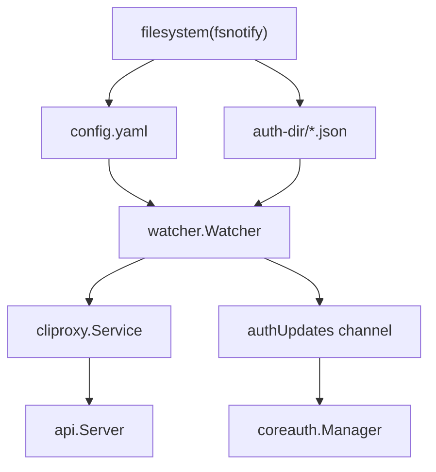
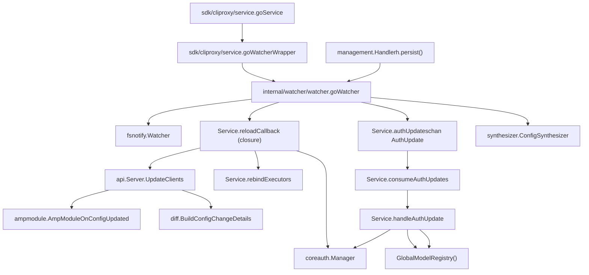

# Hot Reload and Configuration Updates

Relevant source files

-   [config.example.yaml](https://github.com/router-for-me/CLIProxyAPI/blob/c66cb0af/config.example.yaml)
-   [internal/api/handlers/management/config\_basic.go](https://github.com/router-for-me/CLIProxyAPI/blob/c66cb0af/internal/api/handlers/management/config_basic.go)
-   [internal/api/handlers/management/config\_lists.go](https://github.com/router-for-me/CLIProxyAPI/blob/c66cb0af/internal/api/handlers/management/config_lists.go)
-   [internal/api/handlers/management/model\_definitions.go](https://github.com/router-for-me/CLIProxyAPI/blob/c66cb0af/internal/api/handlers/management/model_definitions.go)
-   [internal/api/server.go](https://github.com/router-for-me/CLIProxyAPI/blob/c66cb0af/internal/api/server.go)
-   [internal/config/config.go](https://github.com/router-for-me/CLIProxyAPI/blob/c66cb0af/internal/config/config.go)
-   [internal/config/oauth\_model\_alias\_migration.go](https://github.com/router-for-me/CLIProxyAPI/blob/c66cb0af/internal/config/oauth_model_alias_migration.go)
-   [internal/config/oauth\_model\_alias\_migration\_test.go](https://github.com/router-for-me/CLIProxyAPI/blob/c66cb0af/internal/config/oauth_model_alias_migration_test.go)
-   [internal/config/oauth\_model\_alias\_test.go](https://github.com/router-for-me/CLIProxyAPI/blob/c66cb0af/internal/config/oauth_model_alias_test.go)
-   [internal/config/vertex\_compat.go](https://github.com/router-for-me/CLIProxyAPI/blob/c66cb0af/internal/config/vertex_compat.go)
-   [internal/registry/model\_definitions\_static\_data.go](https://github.com/router-for-me/CLIProxyAPI/blob/c66cb0af/internal/registry/model_definitions_static_data.go)
-   [internal/thinking/provider/iflow/apply.go](https://github.com/router-for-me/CLIProxyAPI/blob/c66cb0af/internal/thinking/provider/iflow/apply.go)
-   [internal/util/claude\_model.go](https://github.com/router-for-me/CLIProxyAPI/blob/c66cb0af/internal/util/claude_model.go)
-   [internal/util/claude\_model\_test.go](https://github.com/router-for-me/CLIProxyAPI/blob/c66cb0af/internal/util/claude_model_test.go)
-   [internal/watcher/diff/config\_diff.go](https://github.com/router-for-me/CLIProxyAPI/blob/c66cb0af/internal/watcher/diff/config_diff.go)
-   [internal/watcher/diff/config\_diff\_test.go](https://github.com/router-for-me/CLIProxyAPI/blob/c66cb0af/internal/watcher/diff/config_diff_test.go)
-   [internal/watcher/diff/model\_hash.go](https://github.com/router-for-me/CLIProxyAPI/blob/c66cb0af/internal/watcher/diff/model_hash.go)
-   [internal/watcher/diff/model\_hash\_test.go](https://github.com/router-for-me/CLIProxyAPI/blob/c66cb0af/internal/watcher/diff/model_hash_test.go)
-   [internal/watcher/diff/models\_summary.go](https://github.com/router-for-me/CLIProxyAPI/blob/c66cb0af/internal/watcher/diff/models_summary.go)
-   [internal/watcher/diff/oauth\_excluded.go](https://github.com/router-for-me/CLIProxyAPI/blob/c66cb0af/internal/watcher/diff/oauth_excluded.go)
-   [internal/watcher/diff/oauth\_excluded\_test.go](https://github.com/router-for-me/CLIProxyAPI/blob/c66cb0af/internal/watcher/diff/oauth_excluded_test.go)
-   [internal/watcher/diff/oauth\_model\_alias.go](https://github.com/router-for-me/CLIProxyAPI/blob/c66cb0af/internal/watcher/diff/oauth_model_alias.go)
-   [internal/watcher/diff/openai\_compat.go](https://github.com/router-for-me/CLIProxyAPI/blob/c66cb0af/internal/watcher/diff/openai_compat.go)
-   [internal/watcher/diff/openai\_compat\_test.go](https://github.com/router-for-me/CLIProxyAPI/blob/c66cb0af/internal/watcher/diff/openai_compat_test.go)
-   [internal/watcher/synthesizer/config.go](https://github.com/router-for-me/CLIProxyAPI/blob/c66cb0af/internal/watcher/synthesizer/config.go)
-   [internal/watcher/watcher.go](https://github.com/router-for-me/CLIProxyAPI/blob/c66cb0af/internal/watcher/watcher.go)
-   [internal/watcher/watcher\_test.go](https://github.com/router-for-me/CLIProxyAPI/blob/c66cb0af/internal/watcher/watcher_test.go)
-   [sdk/cliproxy/service.go](https://github.com/router-for-me/CLIProxyAPI/blob/c66cb0af/sdk/cliproxy/service.go)
-   [test/amp\_management\_test.go](https://github.com/router-for-me/CLIProxyAPI/blob/c66cb0af/test/amp_management_test.go)

This page explains how CLIProxyAPI detects changes to `config.yaml` and auth credential files, propagates those changes to the running server, and updates live state without requiring a restart.

For information about the auth credential lifecycle and token storage, see [3.3](/router-for-me/CLIProxyAPI/3.3-authentication-and-credential-management). For management API endpoints that write config changes, see [4.4](/router-for-me/CLIProxyAPI/4.4-management-api). For the service startup sequence that initializes the watcher, see [3.1](/router-for-me/CLIProxyAPI/3.1-service-lifecycle-and-initialization).

---

## Overview

CLIProxyAPI uses two complementary hot-reload paths:

1.  **Config file watch**: `watcher.Watcher` monitors `config.yaml` with `fsnotify`. On change, a debounced reload re-parses the file and calls a callback that propagates the new config to all running components.
2.  **Auth directory watch**: The same `watcher.Watcher` also monitors the auth directory (`auth-dir`). New, modified, or deleted auth files are turned into `AuthUpdate` events and processed through a buffered channel.

Neither path requires a server restart. The HTTP server continues serving requests throughout.

**Diagram: High-level hot reload triggers**


Sources: [internal/watcher/watcher.go31-55](https://github.com/router-for-me/CLIProxyAPI/blob/c66cb0af/internal/watcher/watcher.go#L31-L55) [sdk/cliproxy/service.go56-92](https://github.com/router-for-me/CLIProxyAPI/blob/c66cb0af/sdk/cliproxy/service.go#L56-L92) [sdk/cliproxy/service.go555-627](https://github.com/router-for-me/CLIProxyAPI/blob/c66cb0af/sdk/cliproxy/service.go#L555-L627)

---

## The `watcher.Watcher`

`watcher.Watcher` in [internal/watcher/watcher.go](https://github.com/router-for-me/CLIProxyAPI/blob/c66cb0af/internal/watcher/watcher.go) is the core file-monitoring struct. It is created by `cliproxy.Service` during `Run`.

### Key fields

| Field | Type | Purpose |
| --- | --- | --- |
| `configPath` | `string` | Absolute path to `config.yaml` |
| `authDir` | `string` | Absolute path to the auth directory |
| `reloadCallback` | `func(*config.Config)` | Called when config changes are detected |
| `watcher` | `*fsnotify.Watcher` | Underlying OS-level file watcher |
| `lastAuthHashes` | `map[string]string` | SHA-256 hashes of known auth files |
| `lastAuthContents` | `map[string]*coreauth.Auth` | Parsed auth entries from last scan |
| `configReloadTimer` | `*time.Timer` | Debounce timer for config changes |
| `lastConfigHash` | `string` | Hash of last seen config bytes |
| `authQueue` | `chan<- AuthUpdate` | Write side of the auth update channel |
| `pendingUpdates` | `map[string]AuthUpdate` | Coalesces rapid auth changes |
| `storePersister` | `storePersister` | Optional: propagates changes to an external store |
| `oldConfigYaml` | `[]byte` | YAML snapshot for change detection |

Sources: [internal/watcher/watcher.go31-55](https://github.com/router-for-me/CLIProxyAPI/blob/c66cb0af/internal/watcher/watcher.go#L31-L55)

### Timing constants

```
replaceCheckDelay        = 50ms   // wait before treating Remove as a real deletion
configReloadDebounce     = 150ms  // debounce window for config file writes
authRemoveDebounceWindow = 1s     // debounce window before emitting auth deletion
```
Sources: [internal/watcher/watcher.go73-79](https://github.com/router-for-me/CLIProxyAPI/blob/c66cb0af/internal/watcher/watcher.go#L73-L79)

### Public API

| Method | Purpose |
| --- | --- |
| `NewWatcher(configPath, authDir, reloadCallback)` | Constructs the watcher; detects a persistence-capable token store |
| `Start(ctx)` | Begins watching files; starts the dispatch goroutine |
| `Stop()` | Cancels the dispatch goroutine and closes the `fsnotify` watcher |
| `SetConfig(cfg)` | Updates the internal config reference after each reload |
| `SetAuthUpdateQueue(queue)` | Sets the channel the watcher writes `AuthUpdate` events to |
| `DispatchRuntimeAuthUpdate(update)` | Injects a synthetic auth event (e.g., from WebSocket providers) |
| `SnapshotCoreAuths()` | Returns all current auth entries as `[]*coreauth.Auth` |

Sources: [internal/watcher/watcher.go82-148](https://github.com/router-for-me/CLIProxyAPI/blob/c66cb0af/internal/watcher/watcher.go#L82-L148)

---

## Config Change Detection and Debouncing

When `fsnotify` emits `Write` or `Create` events for `config.yaml`, the watcher starts (or resets) a 150ms debounce timer. After the timer fires, it:

1.  Reads the file and computes its SHA-256 hash.
2.  Compares the hash against `lastConfigHash`. If unchanged, the reload is skipped.
3.  Calls `config.LoadConfig(configPath)` to parse the new `Config`.
4.  If parsing succeeds, calls `reloadCallback(newCfg)`.

The hash comparison prevents spurious reloads from tools that write config files in multiple small writes.

**Diagram: Config reload sequence**

> **[Mermaid sequence]**
> *(图表结构无法解析)*

Sources: [internal/watcher/watcher.go73-79](https://github.com/router-for-me/CLIProxyAPI/blob/c66cb0af/internal/watcher/watcher.go#L73-L79)

---

## Auth Directory Watching

The watcher tracks every JSON file in the auth directory. On each `Write`, `Create`, or `Remove` event, it:

1.  Hashes the file content and compares it to `lastAuthHashes`.
2.  Parses the file into a `*coreauth.Auth` struct.
3.  If the parsed content differs from `lastAuthContents`, emits an `AuthUpdate`.

### `AuthUpdate`

```
type AuthUpdate struct {    Action AuthUpdateAction   // "add" | "modify" | "delete"    ID     string    Auth   *coreauth.Auth}
```
Remove events are held in `lastRemoveTimes` for up to `authRemoveDebounceWindow` (1 second) before being emitted as deletions. This handles atomic file replacements, where a tool writes a new file by first removing the old one.

Sources: [internal/watcher/watcher.go57-71](https://github.com/router-for-me/CLIProxyAPI/blob/c66cb0af/internal/watcher/watcher.go#L57-L71) [internal/watcher/watcher.go73-79](https://github.com/router-for-me/CLIProxyAPI/blob/c66cb0af/internal/watcher/watcher.go#L73-L79)

### Auth update dispatch

The watcher serializes all pending `AuthUpdate` events through `dispatchMu`/`dispatchCond` and writes them to the `authQueue` channel. On the reading side, `cliproxy.Service.consumeAuthUpdates` drains the channel and calls `handleAuthUpdate`.

**Diagram: Auth update flow**

> **[Mermaid sequence]**
> *(图表结构无法解析)*

Sources: [sdk/cliproxy/service.go114-202](https://github.com/router-for-me/CLIProxyAPI/blob/c66cb0af/sdk/cliproxy/service.go#L114-L202) [sdk/cliproxy/service.go275-332](https://github.com/router-for-me/CLIProxyAPI/blob/c66cb0af/sdk/cliproxy/service.go#L275-L332)

---

## The `reloadCallback` in `cliproxy.Service`

`cliproxy.Service.Run` sets up the reload callback closure at [sdk/cliproxy/service.go556-608](https://github.com/router-for-me/CLIProxyAPI/blob/c66cb0af/sdk/cliproxy/service.go#L556-L608) This callback fires on every config reload and performs these steps in order:

| Step | Code construct | What it does |
| --- | --- | --- |
| 1 | `s.coreManager.SetSelector` | Changes credential selection strategy if `routing.strategy` changed |
| 2 | `s.applyRetryConfig(newCfg)` | Pushes new `RequestRetry` and `MaxRetryInterval` into `coreauth.Manager` |
| 3 | `s.applyPprofConfig(newCfg)` | Starts or stops the pprof server if `pprof.enable` changed |
| 4 | `s.server.UpdateClients(newCfg)` | Applies the full config diff to the HTTP server (see below) |
| 5 | `s.cfg = newCfg` | Replaces the service's live config reference |
| 6 | `s.coreManager.SetConfig(newCfg)` | Gives the core auth manager the new config |
| 7 | `s.coreManager.SetOAuthModelAlias(newCfg.OAuthModelAlias)` | Updates model alias table |
| 8 | `s.rebindExecutors()` | Recreates provider executors so they read from the new config |

Sources: [sdk/cliproxy/service.go556-608](https://github.com/router-for-me/CLIProxyAPI/blob/c66cb0af/sdk/cliproxy/service.go#L556-L608)

---

## `Server.UpdateClients`

`api.Server.UpdateClients` in [internal/api/server.go879-1016](https://github.com/router-for-me/CLIProxyAPI/blob/c66cb0af/internal/api/server.go#L879-L1016) is the central function that applies a new `*config.Config` to the running HTTP server. It uses a YAML-serialized snapshot (`oldConfigYaml`) to build an accurate before-image for field-level comparisons, because management API handlers can mutate `h.cfg` in memory before writing to disk.

**Diagram: `Server.UpdateClients` — components updated**

```mermaid
flowchart TD
    UC["Server.UpdateClients(cfg)"]
    YS["Reconstruct oldCfgfrom oldConfigYaml(yaml.Unmarshal)"]
    RL["RequestLog changed?loggerToggle(bool)"]
    LO["LoggingToFile or LogsMaxTotalSizeMB changed?logging.ConfigureLogOutput"]
    US["UsageStatisticsEnabled changed?usage.SetStatisticsEnabled"]
    EL["ErrorLogsMaxFiles changed?requestLogger.SetErrorLogsMaxFiles"]
    DC["DisableCooling changed?auth.SetQuotaCooldownDisabled"]
    RC["RequestRetry/MaxRetryInterval changed?authManager.SetRetryConfig"]
    DBG["Debug changed?util.SetLogLevel"]
    MR["SecretKey added/removed?registerManagementRoutes or disable"]
    AC["applyAccessConfig(oldCfg, cfg)"]
    WA["WebsocketAuth changed?wsAuthEnabled.Store + wsAuthChanged callback"]
    MS["managementasset.SetCurrentConfig"]
    HC["handlers.UpdateClients(&cfg.SDKConfig)"]
    MH["mgmt.SetConfig + SetAuthManager"]
    AMP["AmpCode changed?ampModule.OnConfigUpdated"]
    TS["tokenStore.SetBaseDir(cfg.AuthDir)"]
    SNAP["Save new oldConfigYaml snapshot(yaml.Marshal)"]

    UC --> YS
    YS --> RL
    YS --> LO
    YS --> US
    YS --> EL
    YS --> DC
    YS --> RC
    YS --> DBG
    YS --> MR
    YS --> AC
    YS --> WA
    YS --> MS
    YS --> HC
    YS --> MH
    YS --> AMP
    YS --> TS
    YS --> SNAP
```


Sources: [internal/api/server.go879-1016](https://github.com/router-for-me/CLIProxyAPI/blob/c66cb0af/internal/api/server.go#L879-L1016)

### The YAML snapshot for change detection

`Server` holds `oldConfigYaml []byte` — a YAML-marshaled copy of the config as it existed after the previous `UpdateClients` call. Each invocation begins by unmarshaling this snapshot into a fresh `oldCfg` struct for field-level diffing. After all changes are applied, the new snapshot is saved.

This design avoids stale comparisons when management API handlers mutate the config struct in-place before the file watcher fires.

Sources: [internal/api/server.go137-139](https://github.com/router-for-me/CLIProxyAPI/blob/c66cb0af/internal/api/server.go#L137-L139) [internal/api/server.go882-884](https://github.com/router-for-me/CLIProxyAPI/blob/c66cb0af/internal/api/server.go#L882-L884) [internal/api/server.go968](https://github.com/router-for-me/CLIProxyAPI/blob/c66cb0af/internal/api/server.go#L968-L968)

---

## Config Diff Utilities

The `internal/watcher/diff` package provides utilities to compute redacted, human-readable change summaries. The primary entry point is `BuildConfigChangeDetails`:

```
// internal/watcher/diff/config_diff.gofunc BuildConfigChangeDetails(oldCfg, newCfg *config.Config) []string
```
It compares:

-   Scalar fields (`port`, `debug`, `proxy-url`, `routing.strategy`, etc.)
-   API key counts (redacted — key material is never logged)
-   Per-provider key configurations (base-url, prefix, model lists, excluded models)
-   `oauth-excluded-models` per provider
-   `oauth-model-alias` per channel
-   `ampcode` fields (upstream URL, model mappings, flags)
-   `remote-management` fields (secret presence, not value)

Helper utilities in the same package:

| Function | File | Purpose |
| --- | --- | --- |
| `SummarizeExcludedModels` | `oauth_excluded.go` | Hash + count for an `excluded-models` list |
| `DiffOAuthExcludedModelChanges` | `oauth_excluded.go` | Per-provider exclusion diff |
| `SummarizeAmpModelMappings` | `oauth_excluded.go` | Hash Amp model mappings for change detection |
| `ComputeOpenAICompatModelsHash` | `model_hash.go` | Stable hash for OpenAI-compat model lists |
| `DiffOpenAICompatibility` | `openai_compat.go` | Per-provider OpenAI-compat diff |
| `SummarizeGeminiModels` / `SummarizeClaudeModels` | `models_summary.go` | Hash model alias lists |

Sources: [internal/watcher/diff/config\_diff.go1-50](https://github.com/router-for-me/CLIProxyAPI/blob/c66cb0af/internal/watcher/diff/config_diff.go#L1-L50) [internal/watcher/diff/oauth\_excluded.go](https://github.com/router-for-me/CLIProxyAPI/blob/c66cb0af/internal/watcher/diff/oauth_excluded.go) [internal/watcher/diff/model\_hash.go](https://github.com/router-for-me/CLIProxyAPI/blob/c66cb0af/internal/watcher/diff/model_hash.go) [internal/watcher/diff/openai\_compat.go](https://github.com/router-for-me/CLIProxyAPI/blob/c66cb0af/internal/watcher/diff/openai_compat.go)

---

## Management API as a Config Update Trigger

Management API handlers (in `internal/api/handlers/management/`) provide a second path that leads to the same hot-reload flow:

1.  A PUT/PATCH request arrives at a management endpoint (e.g., `PUT /v0/management/proxy-url`).
2.  The handler mutates `h.cfg` in memory.
3.  The handler calls `h.persist(c)`, which serializes `h.cfg` and writes it to `configFilePath`.
4.  The file watcher detects the write and fires the debounced reload.
5.  `config.LoadConfig` re-parses the file.
6.  `reloadCallback` propagates the change to all components.

The `PutConfigYAML` handler (`PUT /v0/management/config.yaml`) does a full config replacement:

-   Validates the incoming YAML against `config.LoadConfigOptional`
-   Writes it atomically via `WriteConfig`
-   Updates `h.cfg` immediately for the management handler's own subsequent requests
-   The file watcher then drives the full system update

Sources: [internal/api/handlers/management/config\_basic.go111-163](https://github.com/router-for-me/CLIProxyAPI/blob/c66cb0af/internal/api/handlers/management/config_basic.go#L111-L163) [internal/api/server.go879-1016](https://github.com/router-for-me/CLIProxyAPI/blob/c66cb0af/internal/api/server.go#L879-L1016)

---

## `DispatchRuntimeAuthUpdate`

For auth changes that don't originate from the filesystem (e.g., WebSocket provider connect/disconnect), `watcher.Watcher.DispatchRuntimeAuthUpdate` provides a way to inject a synthetic `AuthUpdate` into the same pipeline:

```
func (w *Watcher) DispatchRuntimeAuthUpdate(update AuthUpdate) bool
```
`cliproxy.Service` calls this indirectly via `emitAuthUpdate`, which first tries `watcher.DispatchRuntimeAuthUpdate`. If that fails (no queue configured), it falls back to writing directly to the `authUpdates` channel or calling `handleAuthUpdate` inline.

The WebSocket gateway (`wsrelay.Manager`) uses this when an AI Studio WebSocket connection is established or terminated:

-   `wsOnConnected(channelID)` → `emitAuthUpdate` with `AuthUpdateActionAdd`
-   `wsOnDisconnected(channelID, reason)` → `emitAuthUpdate` with `AuthUpdateActionDelete`

Sources: [internal/watcher/watcher.go135-140](https://github.com/router-for-me/CLIProxyAPI/blob/c66cb0af/internal/watcher/watcher.go#L135-L140) [sdk/cliproxy/service.go153-172](https://github.com/router-for-me/CLIProxyAPI/blob/c66cb0af/sdk/cliproxy/service.go#L153-L172) [sdk/cliproxy/service.go222-273](https://github.com/router-for-me/CLIProxyAPI/blob/c66cb0af/sdk/cliproxy/service.go#L222-L273)

---

## `ConfigSynthesizer`

When auth files change or the config reloads, the watcher and service use `synthesizer.ConfigSynthesizer` to turn API key entries from `config.yaml` into `*coreauth.Auth` objects that the `coreauth.Manager` can manage like any other credential.

`ConfigSynthesizer.Synthesize` handles:

-   `gemini-api-key` entries → provider `"gemini"`
-   `claude-api-key` entries → provider `"claude"`
-   `codex-api-key` entries → provider `"codex"`
-   `openai-compatibility` entries → provider `"openai-compatibility"`
-   `vertex-api-key` entries → provider `"vertex"`

Each synthesized `Auth` has its `Attributes` populated with metadata such as `auth_kind`, `excluded_models_hash`, and provider-specific fields by `synthesizer.ApplyAuthExcludedModelsMeta`.

Sources: [internal/watcher/synthesizer/config.go1-40](https://github.com/router-for-me/CLIProxyAPI/blob/c66cb0af/internal/watcher/synthesizer/config.go#L1-L40)

---

## Component Relationship Summary

**Diagram: Code entities involved in hot reload**


Sources: [sdk/cliproxy/service.go32-92](https://github.com/router-for-me/CLIProxyAPI/blob/c66cb0af/sdk/cliproxy/service.go#L32-L92) [internal/watcher/watcher.go31-55](https://github.com/router-for-me/CLIProxyAPI/blob/c66cb0af/internal/watcher/watcher.go#L31-L55) [internal/api/server.go122-181](https://github.com/router-for-me/CLIProxyAPI/blob/c66cb0af/internal/api/server.go#L122-L181)
