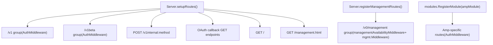
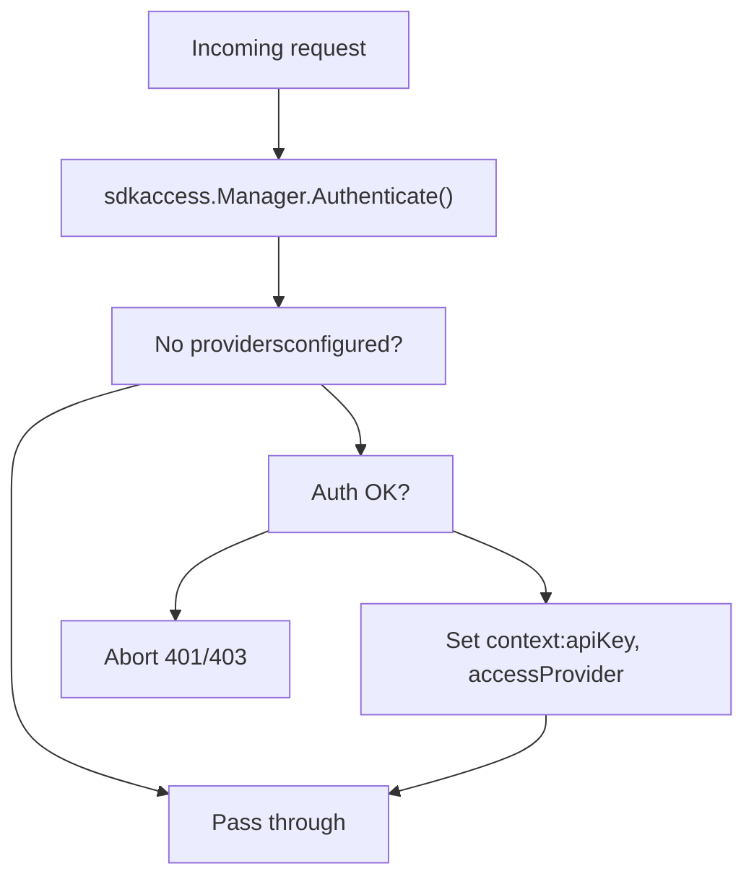
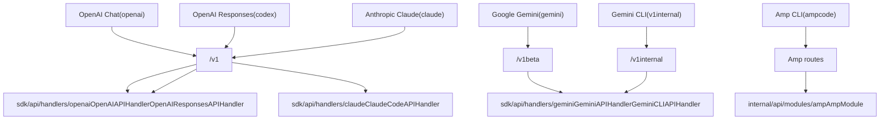

# API Reference

Relevant source files

-   [config.example.yaml](https://github.com/router-for-me/CLIProxyAPI/blob/c66cb0af/config.example.yaml)
-   [internal/api/handlers/management/config\_basic.go](https://github.com/router-for-me/CLIProxyAPI/blob/c66cb0af/internal/api/handlers/management/config_basic.go)
-   [internal/api/handlers/management/config\_lists.go](https://github.com/router-for-me/CLIProxyAPI/blob/c66cb0af/internal/api/handlers/management/config_lists.go)
-   [internal/api/server.go](https://github.com/router-for-me/CLIProxyAPI/blob/c66cb0af/internal/api/server.go)
-   [internal/config/config.go](https://github.com/router-for-me/CLIProxyAPI/blob/c66cb0af/internal/config/config.go)
-   [internal/watcher/watcher.go](https://github.com/router-for-me/CLIProxyAPI/blob/c66cb0af/internal/watcher/watcher.go)
-   [sdk/cliproxy/service.go](https://github.com/router-for-me/CLIProxyAPI/blob/c66cb0af/sdk/cliproxy/service.go)
-   [test/amp\_management\_test.go](https://github.com/router-for-me/CLIProxyAPI/blob/c66cb0af/test/amp_management_test.go)

This page is a complete reference index for all HTTP endpoints exposed by CLIProxyAPI. It covers the routing structure, authentication requirements, and shared conventions that apply across all endpoint families. Detailed documentation for each family is in the child pages:

-   OpenAI-compatible endpoints → [OpenAI Compatible Endpoints](/router-for-me/CLIProxyAPI/4.1-openai-compatible-endpoints)
-   Gemini and Vertex endpoints → [Gemini and Vertex Endpoints](/router-for-me/CLIProxyAPI/4.2-gemini-and-vertex-endpoints)
-   Claude API endpoints → [Claude API Endpoints](/router-for-me/CLIProxyAPI/4.3-claude-api-endpoints)
-   Management API → [Management API](/router-for-me/CLIProxyAPI/4.4-management-api)
-   Amp CLI integration routes → [Amp CLI Integration](/router-for-me/CLIProxyAPI/4.5-amp-cli-integration)

For information about how requests are processed internally (translation, auth injection, executor dispatch), see [Core Architecture](/router-for-me/CLIProxyAPI/3-core-architecture).

---

## Endpoint Families Overview

All routes are registered inside `internal/api/server.go`. The `setupRoutes()` function registers the inference and callback routes; `registerManagementRoutes()` registers the `v0/management` tree lazily when a secret key is configured.

**Route registration diagram:**

Sources: [internal/api/server.go321-438](https://github.com/router-for-me/CLIProxyAPI/blob/c66cb0af/internal/api/server.go#L321-L438) [internal/api/server.go478-646](https://github.com/router-for-me/CLIProxyAPI/blob/c66cb0af/internal/api/server.go#L478-L646)

---

## Endpoint Index

### Inference Endpoints

These routes require an `Authorization: Bearer <api-key>` header when `api-keys` is configured (see [Authentication Setup](/router-for-me/CLIProxyAPI/2.3-authentication-setup)). All are registered under the Gin `AuthMiddleware`.

| Method | Path | Handler | Protocol Family |
| --- | --- | --- | --- |
| `GET` | `/v1/models` | `unifiedModelsHandler` | OpenAI / Claude |
| `POST` | `/v1/chat/completions` | `OpenAIAPIHandler.ChatCompletions` | OpenAI |
| `POST` | `/v1/completions` | `OpenAIAPIHandler.Completions` | OpenAI |
| `POST` | `/v1/messages` | `ClaudeCodeAPIHandler.ClaudeMessages` | Claude |
| `POST` | `/v1/messages/count_tokens` | `ClaudeCodeAPIHandler.ClaudeCountTokens` | Claude |
| `POST` | `/v1/responses` | `OpenAIResponsesAPIHandler.Responses` | Codex/OpenAI |
| `POST` | `/v1/responses/compact` | `OpenAIResponsesAPIHandler.Compact` | Codex/OpenAI |
| `GET` | `/v1/responses` | `OpenAIResponsesAPIHandler.ResponsesWebsocket` | Codex/OpenAI WS |
| `GET` | `/v1beta/models` | `GeminiAPIHandler.GeminiModels` | Gemini |
| `POST` | `/v1beta/models/*action` | `GeminiAPIHandler.GeminiHandler` | Gemini |
| `GET` | `/v1beta/models/*action` | `GeminiAPIHandler.GeminiGetHandler` | Gemini |
| `POST` | `/v1internal:method` | `GeminiCLIAPIHandler.CLIHandler` | Gemini CLI |
| `GET` | `/v1/ws` | `wsrelay.Manager.Handler()` | WebSocket relay |

Sources: [internal/api/server.go329-363](https://github.com/router-for-me/CLIProxyAPI/blob/c66cb0af/internal/api/server.go#L329-L363)

### Management Endpoints

All `/v0/management/*` routes are guarded by `managementAvailabilityMiddleware` and `mgmt.Middleware()`. They are only registered when a `remote-management.secret-key` is set in `config.yaml`, when the `MANAGEMENT_PASSWORD` environment variable is set, or when a local management password is provided programmatically.

| Method | Path | Description |
| --- | --- | --- |
| `GET` | `/v0/management/config` | Current config as JSON |
| `GET` | `/v0/management/config.yaml` | Raw config file bytes |
| `PUT` | `/v0/management/config.yaml` | Replace config file |
| `GET` | `/v0/management/usage` | Usage statistics |
| `GET` | `/v0/management/usage/export` | Export statistics |
| `POST` | `/v0/management/usage/import` | Import statistics |
| `GET` | `/v0/management/logs` | Application logs |
| `DELETE` | `/v0/management/logs` | Delete application logs |
| `GET` | `/v0/management/auth-files` | List auth files |
| `POST` | `/v0/management/auth-files` | Upload auth file |
| `DELETE` | `/v0/management/auth-files` | Delete auth file |
| `GET` | `/v0/management/gemini-api-key` | Gemini API keys |
| `GET` | `/v0/management/claude-api-key` | Claude API keys |
| `GET` | `/v0/management/codex-api-key` | Codex API keys |
| `GET` | `/v0/management/openai-compatibility` | OpenAI-compat providers |
| `GET` | `/v0/management/anthropic-auth-url` | Initiate Anthropic OAuth |
| `GET` | `/v0/management/gemini-cli-auth-url` | Initiate Gemini CLI OAuth |
| `GET` | `/v0/management/codex-auth-url` | Initiate Codex OAuth |
| `GET` | `/v0/management/ampcode/*` | Amp integration config |

(Full management endpoint table is in [Management API](/router-for-me/CLIProxyAPI/4.4-management-api).)

Sources: [internal/api/server.go488-645](https://github.com/router-for-me/CLIProxyAPI/blob/c66cb0af/internal/api/server.go#L488-L645)

### OAuth Callback Endpoints

These receive redirects from provider authorization servers. They persist the authorization code for the goroutine waiting in the management OAuth flow. They are unauthenticated.

| Method | Path | Provider |
| --- | --- | --- |
| `GET` | `/anthropic/callback` | Anthropic / Claude |
| `GET` | `/codex/callback` | OpenAI Codex |
| `GET` | `/google/callback` | Google Gemini CLI |
| `GET` | `/iflow/callback` | iFlow |
| `GET` | `/antigravity/callback` | Antigravity |

Sources: [internal/api/server.go367-437](https://github.com/router-for-me/CLIProxyAPI/blob/c66cb0af/internal/api/server.go#L367-L437)

### Utility Endpoints

| Method | Path | Description |
| --- | --- | --- |
| `GET` | `/` | Server info + endpoint list |
| `GET` | `/management.html` | Management control panel HTML (if enabled) |
| `GET` | `/keep-alive` | Keep-alive signal (optional, SDK-only feature) |

Sources: [internal/api/server.go353-362](https://github.com/router-for-me/CLIProxyAPI/blob/c66cb0af/internal/api/server.go#L353-L362) [internal/api/server.go688-702](https://github.com/router-for-me/CLIProxyAPI/blob/c66cb0af/internal/api/server.go#L688-L702)

---

## Request Authentication

The `AuthMiddleware` function (defined in `internal/api/server.go`) wraps all inference endpoint groups. It delegates to `sdkaccess.Manager.Authenticate()`.

**Authentication behavior:**

When `api-keys` is configured in `config.yaml`, the server accepts `Authorization: Bearer <key>` or `X-API-Key: <key>` headers. When no `api-keys` is set, all requests to inference endpoints are allowed without a token. See [Authentication Flows](/router-for-me/CLIProxyAPI/7-authentication-flows) for the full auth model.

Sources: [internal/api/server.go1030-1056](https://github.com/router-for-me/CLIProxyAPI/blob/c66cb0af/internal/api/server.go#L1030-L1056) [config.example.yaml35-38](https://github.com/router-for-me/CLIProxyAPI/blob/c66cb0af/config.example.yaml#L35-L38)

### Management API Authentication

Management routes use a separate middleware (`mgmt.Middleware()`) that validates against `remote-management.secret-key` from `config.yaml` or the `MANAGEMENT_PASSWORD` environment variable. Localhost requests may additionally be authenticated using a local-only password provided at startup.

Routes are entirely absent (return 404) until a secret key is configured; the `managementAvailabilityMiddleware` enforces this.

Sources: [internal/api/server.go298-304](https://github.com/router-for-me/CLIProxyAPI/blob/c66cb0af/internal/api/server.go#L298-L304) [internal/api/server.go648-656](https://github.com/router-for-me/CLIProxyAPI/blob/c66cb0af/internal/api/server.go#L648-L656)

---

## CORS

A global CORS middleware is applied to every response:

-   `Access-Control-Allow-Origin: *`
-   `Access-Control-Allow-Methods: GET, POST, PUT, PATCH, DELETE, OPTIONS`
-   `Access-Control-Allow-Headers: *`

`OPTIONS` preflight requests return `204 No Content` immediately.

Sources: [internal/api/server.go849-862](https://github.com/router-for-me/CLIProxyAPI/blob/c66cb0af/internal/api/server.go#L849-L862)

---

## Streaming

Endpoints that support streaming (`/v1/chat/completions`, `/v1/messages`, `/v1beta/models/*action`, etc.) return Server-Sent Events (SSE) when the request body includes `"stream": true`. The `Content-Type` is `text/event-stream`. Non-streaming responses use `application/json`.

See [Streaming and Keep-Alive](/router-for-me/CLIProxyAPI/8.6-streaming-and-keep-alive) for details on bootstrap retries and SSE keep-alive intervals.

---

## Handler Hierarchy

The handler objects that serve the inference routes share a common `BaseAPIHandler` base, which holds the auth manager and config.

The `unifiedModelsHandler` on `GET /v1/models` dispatches to either `OpenAIAPIHandler.OpenAIModels` or `ClaudeCodeAPIHandler.ClaudeModels` based on the `User-Agent` header prefix (`claude-cli` routes to the Claude handler).

Sources: [internal/api/server.go323-341](https://github.com/router-for-me/CLIProxyAPI/blob/c66cb0af/internal/api/server.go#L323-L341) [internal/api/server.go770-783](https://github.com/router-for-me/CLIProxyAPI/blob/c66cb0af/internal/api/server.go#L770-L783)

---

## Protocol Family Map

The following diagram maps each client protocol family to the route prefix and the handler/package that serves it.

Sources: [internal/api/server.go321-363](https://github.com/router-for-me/CLIProxyAPI/blob/c66cb0af/internal/api/server.go#L321-L363) [internal/api/server.go282-291](https://github.com/router-for-me/CLIProxyAPI/blob/c66cb0af/internal/api/server.go#L282-L291)
