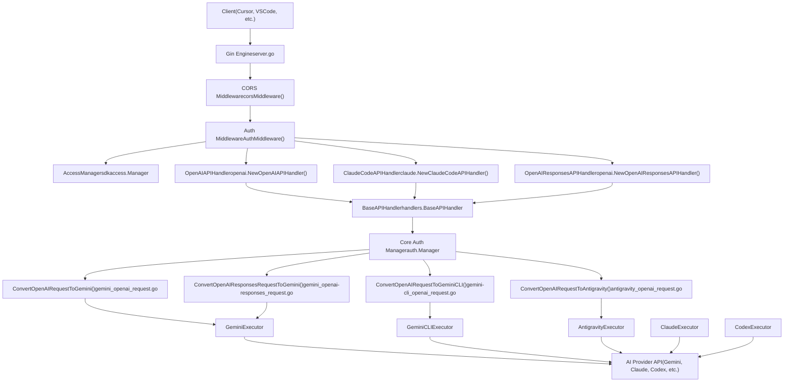
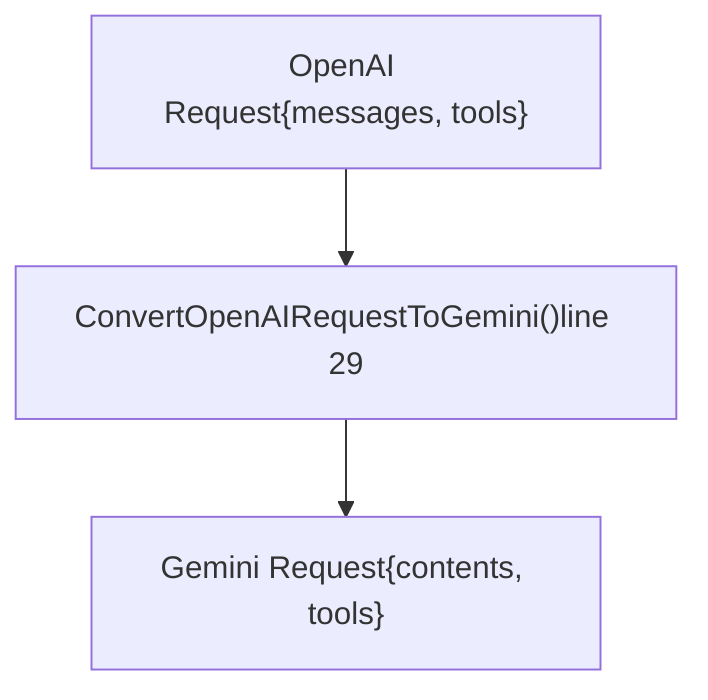
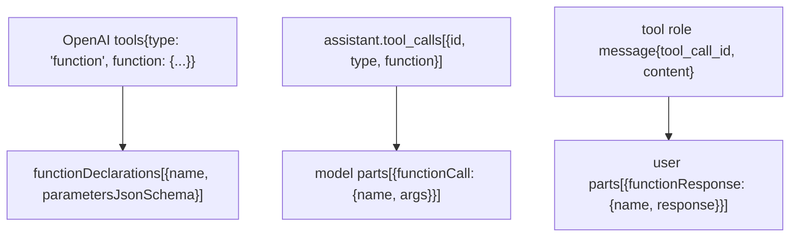
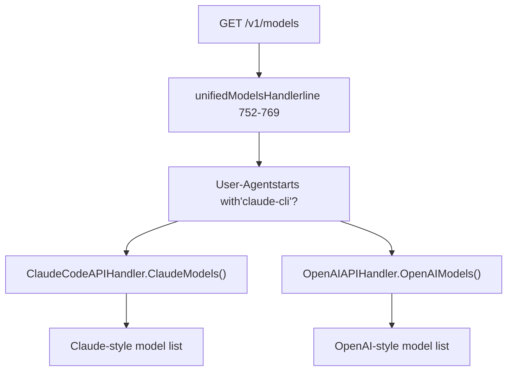
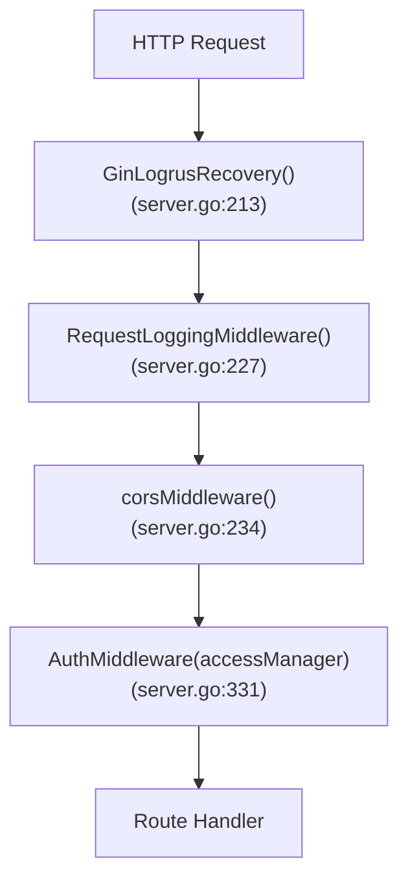

# OpenAI Compatible Endpoints

Relevant source files

-   [config.example.yaml](https://github.com/router-for-me/CLIProxyAPI/blob/c66cb0af/config.example.yaml)
-   [internal/api/handlers/management/config\_basic.go](https://github.com/router-for-me/CLIProxyAPI/blob/c66cb0af/internal/api/handlers/management/config_basic.go)
-   [internal/api/handlers/management/config\_lists.go](https://github.com/router-for-me/CLIProxyAPI/blob/c66cb0af/internal/api/handlers/management/config_lists.go)
-   [internal/api/middleware/request\_logging\_test.go](https://github.com/router-for-me/CLIProxyAPI/blob/c66cb0af/internal/api/middleware/request_logging_test.go)
-   [internal/api/middleware/response\_writer\_test.go](https://github.com/router-for-me/CLIProxyAPI/blob/c66cb0af/internal/api/middleware/response_writer_test.go)
-   [internal/api/server.go](https://github.com/router-for-me/CLIProxyAPI/blob/c66cb0af/internal/api/server.go)
-   [internal/config/config.go](https://github.com/router-for-me/CLIProxyAPI/blob/c66cb0af/internal/config/config.go)
-   [internal/config/sdk\_config.go](https://github.com/router-for-me/CLIProxyAPI/blob/c66cb0af/internal/config/sdk_config.go)
-   [internal/runtime/executor/codex\_websockets\_executor.go](https://github.com/router-for-me/CLIProxyAPI/blob/c66cb0af/internal/runtime/executor/codex_websockets_executor.go)
-   [internal/watcher/watcher.go](https://github.com/router-for-me/CLIProxyAPI/blob/c66cb0af/internal/watcher/watcher.go)
-   [sdk/api/handlers/handlers.go](https://github.com/router-for-me/CLIProxyAPI/blob/c66cb0af/sdk/api/handlers/handlers.go)
-   [sdk/api/handlers/handlers\_stream\_bootstrap\_test.go](https://github.com/router-for-me/CLIProxyAPI/blob/c66cb0af/sdk/api/handlers/handlers_stream_bootstrap_test.go)
-   [sdk/api/handlers/header\_filter.go](https://github.com/router-for-me/CLIProxyAPI/blob/c66cb0af/sdk/api/handlers/header_filter.go)
-   [sdk/api/handlers/header\_filter\_test.go](https://github.com/router-for-me/CLIProxyAPI/blob/c66cb0af/sdk/api/handlers/header_filter_test.go)
-   [sdk/api/handlers/openai/openai\_responses\_websocket.go](https://github.com/router-for-me/CLIProxyAPI/blob/c66cb0af/sdk/api/handlers/openai/openai_responses_websocket.go)
-   [sdk/cliproxy/auth/conductor\_executor\_replace\_test.go](https://github.com/router-for-me/CLIProxyAPI/blob/c66cb0af/sdk/cliproxy/auth/conductor_executor_replace_test.go)
-   [sdk/cliproxy/service.go](https://github.com/router-for-me/CLIProxyAPI/blob/c66cb0af/sdk/cliproxy/service.go)
-   [test/amp\_management\_test.go](https://github.com/router-for-me/CLIProxyAPI/blob/c66cb0af/test/amp_management_test.go)

## Purpose and Scope

This document describes the OpenAI-compatible HTTP endpoints exposed by CLIProxyAPI. These endpoints implement the OpenAI API specification, allowing clients designed for OpenAI (such as Cursor, VSCode extensions, and other AI-powered tools) to seamlessly interact with multiple AI providers (Gemini, Claude, Codex, etc.) through a unified interface.

For provider-specific endpoints, see [Gemini and Vertex Endpoints](/router-for-me/CLIProxyAPI/4.2-gemini-and-vertex-endpoints), [Claude API Endpoints](/router-for-me/CLIProxyAPI/4.3-claude-api-endpoints). For administrative operations, see [Management API](/router-for-me/CLIProxyAPI/4.4-management-api). For Amp CLI integration routes, see [Amp CLI Integration](/router-for-me/CLIProxyAPI/4.5-amp-cli-integration).

## Endpoint Overview

CLIProxyAPI exposes the following OpenAI-compatible endpoints under the `/v1` path prefix:

| Endpoint | Method | Purpose | Handler |
| --- | --- | --- | --- |
| `/v1/chat/completions` | POST | OpenAI Chat Completions API | `OpenAIAPIHandler.ChatCompletions` |
| `/v1/completions` | POST | OpenAI Legacy Completions API | `OpenAIAPIHandler.Completions` |
| `/v1/models` | GET | List available models | `unifiedModelsHandler` |
| `/v1/messages` | POST | Claude Messages API compatibility | `ClaudeCodeAPIHandler.ClaudeMessages` |
| `/v1/messages/count_tokens` | POST | Claude token counting | `ClaudeCodeAPIHandler.ClaudeCountTokens` |
| `/v1/responses` | GET | OpenAI Responses API — WebSocket upgrade | `OpenAIResponsesAPIHandler.ResponsesWebsocket` |
| `/v1/responses` | POST | OpenAI Responses API — HTTP (non-streaming + streaming) | `OpenAIResponsesAPIHandler.Responses` |
| `/v1/responses/compact` | POST | OpenAI Responses API (compact variant) | `OpenAIResponsesAPIHandler.Compact` |

> **Note:** `/v1/messages` and `/v1/messages/count_tokens` use the Claude API request/response format, not the OpenAI format. They are co-located under `/v1` for compatibility. Detailed documentation for those endpoints is in page 4.3 (Claude API Endpoints).

**Sources:** [internal/api/server.go329-341](https://github.com/router-for-me/CLIProxyAPI/blob/c66cb0af/internal/api/server.go#L329-L341)

## Request Flow Architecture


**Sources:** [internal/api/server.go193-317](https://github.com/router-for-me/CLIProxyAPI/blob/c66cb0af/internal/api/server.go#L193-L317) [internal/api/server.go321-341](https://github.com/router-for-me/CLIProxyAPI/blob/c66cb0af/internal/api/server.go#L321-L341)

## Route Registration

Routes are registered during server initialization in the `setupRoutes()` method:

Route setup diagram (`setupRoutes`):

> **[Mermaid sequence]**
> *(图表结构无法解析)*

**Sources:** [internal/api/server.go321-341](https://github.com/router-for-me/CLIProxyAPI/blob/c66cb0af/internal/api/server.go#L321-L341)

## Authentication Flow

All OpenAI-compatible endpoints are protected by the authentication middleware:

Authentication flow for all `/v1` routes:

The `AuthMiddleware` function (declared in `server.go`) performs the following:

1.  If no `AccessManager` is configured (`manager == nil`), all requests are allowed (legacy mode).
2.  Calls `manager.Authenticate(c.Request.Context(), c.Request)` via `sdkaccess.Manager`.
3.  On success, sets Gin context values:
    -   `"apiKey"`: The authenticated principal identifier
    -   `"accessProvider"`: The provider that authenticated the request
    -   `"accessMetadata"`: Additional metadata from the authentication result
4.  On failure, aborts with the appropriate HTTP status code.

**Sources:** [internal/api/server.go1029-1043](https://github.com/router-for-me/CLIProxyAPI/blob/c66cb0af/internal/api/server.go#L1029-L1043)

## Chat Completions Endpoint

### Endpoint Details

-   **Path:** `POST /v1/chat/completions`
-   **Handler:** `OpenAIAPIHandler.ChatCompletions`
-   **Purpose:** OpenAI Chat Completions API implementation with multi-provider routing

### Request Format

The endpoint accepts standard OpenAI Chat Completions request format:

| Parameter | Type | Description |
| --- | --- | --- |
| `model` | string | Model identifier (may include provider prefix) |
| `messages` | array | Conversation history with role and content |
| `temperature` | number | Sampling temperature (0-2) |
| `top_p` | number | Nucleus sampling threshold |
| `top_k` | number | Top-K sampling parameter (provider-specific) |
| `max_tokens` | number | Maximum tokens in response |
| `stream` | boolean | Enable streaming response |
| `tools` | array | Function calling tool declarations |
| `tool_choice` | string/object | Tool selection mode |
| `reasoning_effort` | string | Thinking/reasoning configuration |
| `n` | number | Number of completions to generate |
| `modalities` | array | Response modalities (e.g., `["text", "image"]`) |
| `image_config` | object | Image generation configuration |

### Translation Examples

The request translation system converts OpenAI format to provider-specific formats:

#### Gemini Translation


Key transformations in `ConvertOpenAIRequestToGemini`:

-   `messages[].role="system"` → `system_instruction` (lines 144-163)
-   `messages[].role="user"` → `contents[]{role:"user", parts:[]}` (lines 164-210)
-   `messages[].role="assistant"` → `contents[]{role:"model", parts:[]}` (lines 211-286)
-   `messages[].role="tool"` → `parts[].functionResponse` (lines 129-136, 266-283)
-   `tools[].type="function"` → `tools[].functionDeclarations[]` (lines 291-395)
-   `reasoning_effort` → `generationConfig.thinkingConfig` (lines 39-52)

**Sources:** [internal/translator/gemini/openai/chat-completions/gemini\_openai\_request.go29-400](https://github.com/router-for-me/CLIProxyAPI/blob/c66cb0af/internal/translator/gemini/openai/chat-completions/gemini_openai_request.go#L29-L400)

#### Gemini CLI Translation

Similar to Gemini translation but wraps request in CLI-specific envelope:

```
{  "project": "",  "request": {    "contents": [...],    "generationConfig": {...},    "tools": [...]  },  "model": "gemini-2.5-pro"}
```
**Sources:** [internal/translator/gemini-cli/openai/chat-completions/gemini-cli\_openai\_request.go29-392](https://github.com/router-for-me/CLIProxyAPI/blob/c66cb0af/internal/translator/gemini-cli/openai/chat-completions/gemini-cli_openai_request.go#L29-L392)

#### Antigravity Translation

Uses Gemini CLI format with additional Antigravity-specific features:

```
{  "project": "",  "request": {    "contents": [...],    "generationConfig": {      "maxOutputTokens": 8192,      "thinkingConfig": {...}    }  },  "model": "gemini-3-pro-preview"}
```
**Sources:** [internal/translator/antigravity/openai/chat-completions/antigravity\_openai\_request.go29-414](https://github.com/router-for-me/CLIProxyAPI/blob/c66cb0af/internal/translator/antigravity/openai/chat-completions/antigravity_openai_request.go#L29-L414)

### Tool/Function Calling

Function calls are translated bidirectionally:


The translation handles:

1.  Schema conversion: `parameters` → `parametersJsonSchema` (lines 298-335)
2.  Function call marshaling with `thoughtSignature` marker (lines 246-264)
3.  Tool response aggregation by call ID (lines 104-122, 266-283)

**Sources:** [internal/translator/gemini/openai/chat-completions/gemini\_openai\_request.go291-395](https://github.com/router-for-me/CLIProxyAPI/blob/c66cb0af/internal/translator/gemini/openai/chat-completions/gemini_openai_request.go#L291-L395)

### Thinking/Reasoning Support

The `reasoning_effort` parameter is translated to provider-specific thinking configuration:

| OpenAI Value | Gemini Translation |
| --- | --- |
| `"auto"` | `thinkingConfig: {thinkingBudget: -1, includeThoughts: true}` |
| `"low"` | `thinkingConfig: {thinkingLevel: "low", includeThoughts: true}` |
| `"medium"` | `thinkingConfig: {thinkingLevel: "medium", includeThoughts: true}` |
| `"high"` | `thinkingConfig: {thinkingLevel: "high", includeThoughts: true}` |
| `"none"` | `thinkingConfig: {thinkingLevel: "none", includeThoughts: false}` |

**Sources:** [internal/translator/gemini/openai/chat-completions/gemini\_openai\_request.go39-52](https://github.com/router-for-me/CLIProxyAPI/blob/c66cb0af/internal/translator/gemini/openai/chat-completions/gemini_openai_request.go#L39-L52)

## Completions Endpoint

### Endpoint Details

-   **Path:** `POST /v1/completions`
-   **Handler:** `OpenAIAPIHandler.Completions`
-   **Purpose:** Legacy OpenAI Completions API (text completion without chat structure)

This endpoint supports legacy completion requests with simple prompt strings rather than chat message arrays. The handler internally converts these to chat format for provider compatibility.

**Sources:** [internal/api/server.go323](https://github.com/router-for-me/CLIProxyAPI/blob/c66cb0af/internal/api/server.go#L323-L323)

## Models Endpoint

### Endpoint Details

-   **Path:** `GET /v1/models`
-   **Handler:** `unifiedModelsHandler`
-   **Purpose:** List available models across all configured providers

### Unified Handler Routing

The models endpoint uses a special unified handler that routes based on User-Agent:


**Sources:** [internal/api/server.go766-783](https://github.com/router-for-me/CLIProxyAPI/blob/c66cb0af/internal/api/server.go#L766-L783)

### Model Registry Integration

The models endpoint aggregates models from the global model registry, which tracks:

1.  **Static model definitions** - Provider-specific model catalogs
2.  **OAuth-authenticated models** - Models available via OAuth credentials
3.  **API key models** - Models from configured API keys with aliases
4.  **Dynamic models** - Runtime-registered models (e.g., Antigravity)

Model availability is filtered by:

-   Provider availability (active credentials)
-   Quota status (non-suspended)
-   Exclusion patterns (per-credential or global)
-   Model aliases (per-credential or global OAuth mappings)

For detailed model registry behavior, see [Model Registry and Selection](/router-for-me/CLIProxyAPI/3.6-model-registry-and-selection).

**Sources:** [internal/api/server.go333](https://github.com/router-for-me/CLIProxyAPI/blob/c66cb0af/internal/api/server.go#L333-L333)

## Claude Messages Compatibility

### Endpoint Details

-   **Path:** `POST /v1/messages`
-   **Handler:** `ClaudeCodeAPIHandler.ClaudeMessages`
-   **Purpose:** Claude Messages API compatibility under `/v1` path

This endpoint exposes the Claude Messages API format under the standard `/v1` prefix, allowing clients to use either OpenAI or Claude request formats interchangeably.

### Token Counting

-   **Path:** `POST /v1/messages/count_tokens`
-   **Handler:** `ClaudeCodeAPIHandler.ClaudeCountTokens`
-   **Purpose:** Count tokens for Claude messages without making a request

**Sources:** [internal/api/server.go336-337](https://github.com/router-for-me/CLIProxyAPI/blob/c66cb0af/internal/api/server.go#L336-L337)

## OpenAI Responses API

### Endpoint Details

| Path | Method | Handler | Purpose |
| --- | --- | --- | --- |
| `/v1/responses` | GET | `ResponsesWebsocket` | WebSocket upgrade; accepts `response.create` and `response.append` messages |
| `/v1/responses` | POST | `Responses` | HTTP request/response for non-streaming and streaming completions |
| `/v1/responses/compact` | POST | `Compact` | Compact response format variant |

When an HTTP client sends a WebSocket upgrade request to `GET /v1/responses`, `ResponsesWebsocket` (in `sdk/api/handlers/openai/openai_responses_websocket.go`) handles the upgrade. The connection accepts JSON text messages of type `response.create` or `response.append` and streams response events back as JSON WebSocket text messages. Each session is tracked by a UUID (`passthroughSessionID`) and closed when the client disconnects. See page 8.7 for full WebSocket session documentation.

### Request Format

The Responses API uses a different message structure than Chat Completions:

| Field | Type | Description |
| --- | --- | --- |
| `input` | array | Input items with types: `message`, `function_call`, `function_call_output`, `reasoning` |
| `instructions` | string | System instructions (maps to `system_instruction`) |
| `tools` | array | Function tool declarations |
| `max_output_tokens` | number | Maximum output tokens |
| `temperature` | number | Sampling temperature |
| `reasoning.effort` | string | Thinking/reasoning effort level |

### Translation Flow

Key transformations:

1.  Normalize consecutive function calls/outputs (lines 37-108)
2.  `input[type="message"]` → `contents[]` with role-based splitting (lines 117-264)
3.  `input[type="function_call"]` → model message with `functionCall` parts (lines 265-283)
4.  `input[type="function_call_output"]` → function message with `functionResponse` (lines 285-323)
5.  `input[type="reasoning"]` → model message with `thought=true` flag (lines 325-333)
6.  `instructions` → `system_instruction` (lines 26-30)
7.  `reasoning.effort` → `generationConfig.thinkingConfig` (lines 424-437)

**Sources:** [internal/translator/gemini/openai/responses/gemini\_openai-responses\_request.go13-442](https://github.com/router-for-me/CLIProxyAPI/blob/c66cb0af/internal/translator/gemini/openai/responses/gemini_openai-responses_request.go#L13-L442)

### Compact Endpoint

-   **Path:** `POST /v1/responses/compact`
-   **Handler:** `OpenAIResponsesAPIHandler.Compact`
-   **Purpose:** Compact response format variant (also used internally by `CodexWebsocketsExecutor` via the `alt == "responses/compact"` path)

**Sources:** [internal/api/server.go338-340](https://github.com/router-for-me/CLIProxyAPI/blob/c66cb0af/internal/api/server.go#L338-L340) [internal/runtime/executor/codex\_websockets\_executor.go148-153](https://github.com/router-for-me/CLIProxyAPI/blob/c66cb0af/internal/runtime/executor/codex_websockets_executor.go#L148-L153)

## Middleware Stack

All OpenAI-compatible endpoints pass through the following middleware chain:

Middleware chain applied to every request on all `/v1` routes:


Middleware responsibilities:

| Middleware | Registration Line | Behavior |
| --- | --- | --- |
| `GinLogrusRecovery()` | `server.go:213` | Panic recovery with structured logging |
| `RequestLoggingMiddleware()` | `server.go:227` | Log requests/responses when `request-log: true` in config; skipped when `CommercialMode` is enabled |
| `corsMiddleware()` | `server.go:234` | Sets `Access-Control-Allow-Origin: *`; handles `OPTIONS` preflight with `204` |
| `AuthMiddleware(accessManager)` | `server.go:331` (per group) | Validates client credentials via `sdkaccess.Manager` |

**Sources:** [internal/api/server.go204-234](https://github.com/router-for-me/CLIProxyAPI/blob/c66cb0af/internal/api/server.go#L204-L234) [internal/api/server.go329-332](https://github.com/router-for-me/CLIProxyAPI/blob/c66cb0af/internal/api/server.go#L329-L332) [internal/api/server.go849-862](https://github.com/router-for-me/CLIProxyAPI/blob/c66cb0af/internal/api/server.go#L849-L862) [internal/api/server.go1029-1043](https://github.com/router-for-me/CLIProxyAPI/blob/c66cb0af/internal/api/server.go#L1029-L1043)

## CORS Configuration

The CORS middleware (`corsMiddleware`) enables cross-origin requests with permissive settings:

| Header | Value |
| --- | --- |
| `Access-Control-Allow-Origin` | `*` |
| `Access-Control-Allow-Methods` | `GET, POST, PUT, PATCH, DELETE, OPTIONS` |
| `Access-Control-Allow-Headers` | `*` |

`OPTIONS` preflight requests receive `204 No Content` immediately, without passing through the auth middleware.

**Sources:** [internal/api/server.go849-862](https://github.com/router-for-me/CLIProxyAPI/blob/c66cb0af/internal/api/server.go#L849-L862)

## Error Handling

Authentication failures return standardized error responses:

```
{  "error": "error message text"}
```
HTTP status codes follow authentication error semantics:

-   `401 Unauthorized` - Missing or invalid credentials
-   `403 Forbidden` - Valid credentials but insufficient permissions
-   `500 Internal Server Error` - Authentication system error

**Sources:** [internal/api/server.go1036-1040](https://github.com/router-for-me/CLIProxyAPI/blob/c66cb0af/internal/api/server.go#L1036-L1040)
