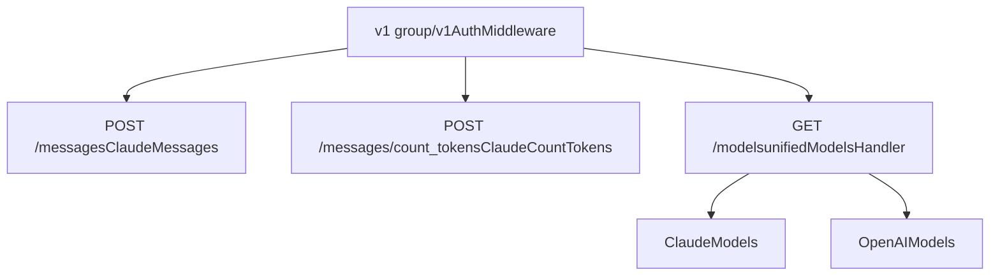
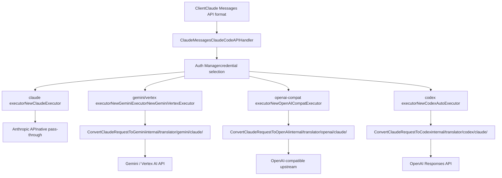
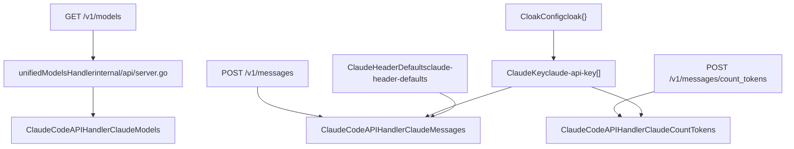

# Claude API Endpoints

Relevant source files

-   [config.example.yaml](https://github.com/router-for-me/CLIProxyAPI/blob/c66cb0af/config.example.yaml)
-   [internal/api/handlers/management/config\_basic.go](https://github.com/router-for-me/CLIProxyAPI/blob/c66cb0af/internal/api/handlers/management/config_basic.go)
-   [internal/api/handlers/management/config\_lists.go](https://github.com/router-for-me/CLIProxyAPI/blob/c66cb0af/internal/api/handlers/management/config_lists.go)
-   [internal/api/server.go](https://github.com/router-for-me/CLIProxyAPI/blob/c66cb0af/internal/api/server.go)
-   [internal/config/config.go](https://github.com/router-for-me/CLIProxyAPI/blob/c66cb0af/internal/config/config.go)
-   [internal/translator/claude/gemini/claude\_gemini\_request.go](https://github.com/router-for-me/CLIProxyAPI/blob/c66cb0af/internal/translator/claude/gemini/claude_gemini_request.go)
-   [internal/translator/claude/openai/chat-completions/claude\_openai\_request.go](https://github.com/router-for-me/CLIProxyAPI/blob/c66cb0af/internal/translator/claude/openai/chat-completions/claude_openai_request.go)
-   [internal/translator/claude/openai/responses/claude\_openai-responses\_request.go](https://github.com/router-for-me/CLIProxyAPI/blob/c66cb0af/internal/translator/claude/openai/responses/claude_openai-responses_request.go)
-   [internal/translator/codex/claude/codex\_claude\_request.go](https://github.com/router-for-me/CLIProxyAPI/blob/c66cb0af/internal/translator/codex/claude/codex_claude_request.go)
-   [internal/translator/codex/gemini/codex\_gemini\_request.go](https://github.com/router-for-me/CLIProxyAPI/blob/c66cb0af/internal/translator/codex/gemini/codex_gemini_request.go)
-   [internal/translator/codex/openai/chat-completions/codex\_openai\_request.go](https://github.com/router-for-me/CLIProxyAPI/blob/c66cb0af/internal/translator/codex/openai/chat-completions/codex_openai_request.go)
-   [internal/translator/openai/claude/openai\_claude\_request.go](https://github.com/router-for-me/CLIProxyAPI/blob/c66cb0af/internal/translator/openai/claude/openai_claude_request.go)
-   [internal/translator/openai/claude/openai\_claude\_request\_test.go](https://github.com/router-for-me/CLIProxyAPI/blob/c66cb0af/internal/translator/openai/claude/openai_claude_request_test.go)
-   [internal/translator/openai/gemini/openai\_gemini\_request.go](https://github.com/router-for-me/CLIProxyAPI/blob/c66cb0af/internal/translator/openai/gemini/openai_gemini_request.go)
-   [internal/watcher/watcher.go](https://github.com/router-for-me/CLIProxyAPI/blob/c66cb0af/internal/watcher/watcher.go)
-   [sdk/api/handlers/claude/code\_handlers.go](https://github.com/router-for-me/CLIProxyAPI/blob/c66cb0af/sdk/api/handlers/claude/code_handlers.go)
-   [sdk/api/handlers/gemini/gemini\_handlers.go](https://github.com/router-for-me/CLIProxyAPI/blob/c66cb0af/sdk/api/handlers/gemini/gemini_handlers.go)
-   [sdk/api/handlers/openai/openai\_handlers.go](https://github.com/router-for-me/CLIProxyAPI/blob/c66cb0af/sdk/api/handlers/openai/openai_handlers.go)
-   [sdk/api/handlers/openai/openai\_responses\_handlers.go](https://github.com/router-for-me/CLIProxyAPI/blob/c66cb0af/sdk/api/handlers/openai/openai_responses_handlers.go)
-   [sdk/api/handlers/openai/openai\_responses\_handlers\_stream\_error\_test.go](https://github.com/router-for-me/CLIProxyAPI/blob/c66cb0af/sdk/api/handlers/openai/openai_responses_handlers_stream_error_test.go)
-   [sdk/api/handlers/openai\_responses\_stream\_error.go](https://github.com/router-for-me/CLIProxyAPI/blob/c66cb0af/sdk/api/handlers/openai_responses_stream_error.go)
-   [sdk/api/handlers/openai\_responses\_stream\_error\_test.go](https://github.com/router-for-me/CLIProxyAPI/blob/c66cb0af/sdk/api/handlers/openai_responses_stream_error_test.go)
-   [sdk/cliproxy/service.go](https://github.com/router-for-me/CLIProxyAPI/blob/c66cb0af/sdk/cliproxy/service.go)
-   [test/amp\_management\_test.go](https://github.com/router-for-me/CLIProxyAPI/blob/c66cb0af/test/amp_management_test.go)

This page documents the Claude-compatible HTTP endpoints exposed by CLIProxyAPI: `POST /v1/messages`, `POST /v1/messages/count_tokens`, and the conditional Claude model listing on `GET /v1/models`. It covers request and response formats, how each endpoint is implemented, and how incoming Claude API requests are routed to underlying providers.

For general request pipeline architecture see [3.2](https://github.com/router-for-me/CLIProxyAPI/blob/c66cb0af/3.2) For the Claude provider executor and OAuth authentication see [6.2](https://github.com/router-for-me/CLIProxyAPI/blob/c66cb0af/6.2) For OpenAI-compatible endpoints on the same `/v1` prefix see [4.1](https://github.com/router-for-me/CLIProxyAPI/blob/c66cb0af/4.1)

---

## Endpoint Overview

All three endpoints share the `/v1` route group, which applies `AuthMiddleware` before any handler runs.

| Method | Path | Handler method | Description |
| --- | --- | --- | --- |
| `POST` | `/v1/messages` | `ClaudeCodeAPIHandler.ClaudeMessages` | Claude Messages API – streaming and non-streaming |
| `POST` | `/v1/messages/count_tokens` | `ClaudeCodeAPIHandler.ClaudeCountTokens` | Count input tokens without generating a response |
| `GET` | `/v1/models` | `ClaudeCodeAPIHandler.ClaudeModels` (conditional) | Claude model listing; routed only when `User-Agent` starts with `claude-cli` |

**Sources:** [internal/api/server.go330-341](https://github.com/router-for-me/CLIProxyAPI/blob/c66cb0af/internal/api/server.go#L330-L341)

---

## Route Registration

Routes are registered in `Server.setupRoutes()`. `ClaudeCodeAPIHandler` is instantiated from `BaseAPIHandler` and its methods are attached directly to the Gin engine.

**Route group / handler wiring diagram:**


The `unifiedModelsHandler` function in `Server` checks the `User-Agent` header and dispatches to either `ClaudeCodeAPIHandler.ClaudeModels` or `OpenAIAPIHandler.OpenAIModels` accordingly.

**Sources:** [internal/api/server.go323-341](https://github.com/router-for-me/CLIProxyAPI/blob/c66cb0af/internal/api/server.go#L323-L341) [internal/api/server.go770-783](https://github.com/router-for-me/CLIProxyAPI/blob/c66cb0af/internal/api/server.go#L770-L783)

---

## `POST /v1/messages`

### Handler

`ClaudeCodeAPIHandler.ClaudeMessages` in `sdk/api/handlers/claude/code_handlers.go`.

The handler:

1.  Reads the raw JSON body via `c.GetRawData()`.
2.  Parses the `model` field to select a credential from the registry.
3.  Delegates to `BaseAPIHandler`, which uses the auth manager to pick a credential and its associated provider executor.
4.  The executor translates the Claude-format request to the upstream provider's format, executes it, and streams the response back.

**Sources:** [sdk/api/handlers/claude/code\_handlers.go59-100](https://github.com/router-for-me/CLIProxyAPI/blob/c66cb0af/sdk/api/handlers/claude/code_handlers.go#L59-L100)

### Request Format

Follows the Anthropic Messages API.

```
{  "model": "claude-sonnet-4-5-20250929",  "max_tokens": 8096,  "stream": true,  "system": [    {"type": "text", "text": "You are a helpful assistant."}  ],  "messages": [    {"role": "user", "content": [{"type": "text", "text": "Hello"}]}  ],  "thinking": {    "type": "enabled",    "budget_tokens": 10000  },  "temperature": 1.0,  "stop_sequences": ["Human:"]}
```
Key fields:

| Field | Type | Notes |
| --- | --- | --- |
| `model` | string | Required. Matched against registered models in the registry. |
| `max_tokens` | integer | Required by Anthropic spec; defaults applied by provider if absent. |
| `messages` | array | Alternating `user`/`assistant` turns. Content may be a string or content-block array. |
| `system` | string or array | System prompt. Can be a plain string or an array of content blocks. |
| `stream` | boolean | When `true`, response is Server-Sent Events. |
| `thinking` | object | `{"type": "enabled"/"disabled"/"adaptive", "budget_tokens": N}`. See [8.3](https://github.com/router-for-me/CLIProxyAPI/blob/c66cb0af/8.3) |
| `temperature` | float | Sampling temperature. |
| `top_p` | float | Nucleus sampling. Used when `temperature` is absent. |
| `stop_sequences` | array | Up to 4 stop strings. |

### Response Format (non-streaming)

```
{  "id": "msg_01XFDUDYJgAACzvnptvVoYEL",  "type": "message",  "role": "assistant",  "content": [{"type": "text", "text": "Hello! How can I help?"}],  "model": "claude-sonnet-4-5-20250929",  "stop_reason": "end_turn",  "stop_sequence": null,  "usage": {    "input_tokens": 12,    "output_tokens": 8  }}
```
### Streaming Response (SSE)

When `"stream": true`, the response is `Content-Type: text/event-stream`. Events follow the Anthropic streaming format:

| Event type | Description |
| --- | --- |
| `message_start` | Contains `message` object with `id`, `model`, `usage.input_tokens` |
| `content_block_start` | Opens a content block with `index` and `content_block.type` |
| `content_block_delta` | Incremental content: `{"type": "text_delta", "text": "..."}` or `{"type": "thinking_delta", ...}` |
| `content_block_stop` | Closes a content block |
| `message_delta` | Final `stop_reason`, `stop_sequence`, `usage.output_tokens` |
| `message_stop` | Terminates the stream |

**Sources:** [sdk/api/handlers/claude/code\_handlers.go59-200](https://github.com/router-for-me/CLIProxyAPI/blob/c66cb0af/sdk/api/handlers/claude/code_handlers.go#L59-L200)

---

## `POST /v1/messages/count_tokens`

### Handler

`ClaudeCodeAPIHandler.ClaudeCountTokens`.

Sends the request payload to the upstream provider's token-counting API (if supported) without generating a completion.

### Request Format

Same structure as `/v1/messages` but `stream` and `max_tokens` are ignored.

```
{  "model": "claude-sonnet-4-5-20250929",  "system": "You are a helpful assistant.",  "messages": [    {"role": "user", "content": "How many tokens is this?"}  ]}
```
### Response Format

```
{  "input_tokens": 42}
```
**Sources:** [internal/api/server.go337](https://github.com/router-for-me/CLIProxyAPI/blob/c66cb0af/internal/api/server.go#L337-L337) [sdk/api/handlers/claude/code\_handlers.go1-50](https://github.com/router-for-me/CLIProxyAPI/blob/c66cb0af/sdk/api/handlers/claude/code_handlers.go#L1-L50)

---

## `GET /v1/models` (Claude variant)

### Routing

The `/v1/models` route uses `unifiedModelsHandler`, which routes to `ClaudeCodeAPIHandler.ClaudeModels` only when the `User-Agent` header starts with `"claude-cli"`. All other clients receive the OpenAI-format model list from `OpenAIAPIHandler.OpenAIModels`.

### Response Format

```
{  "data": [    {      "type": "model",      "id": "claude-sonnet-4-5-20250929",      "display_name": "Claude Sonnet 4.5",      "created_at": "2025-09-29T00:00:00Z"    }  ]}
```
`ClaudeModels` queries `registry.GetGlobalRegistry().GetAvailableModels("claude")`, which returns all models registered under the `"claude"` channel by active credentials.

**Sources:** [sdk/api/handlers/claude/code\_handlers.go52-57](https://github.com/router-for-me/CLIProxyAPI/blob/c66cb0af/sdk/api/handlers/claude/code_handlers.go#L52-L57) [internal/api/server.go333](https://github.com/router-for-me/CLIProxyAPI/blob/c66cb0af/internal/api/server.go#L333-L333) [internal/api/server.go770-783](https://github.com/router-for-me/CLIProxyAPI/blob/c66cb0af/internal/api/server.go#L770-L783)

---

## Provider Routing and Translation

Claude endpoint requests are in Anthropic Messages API format. Depending on which provider credential is selected, the request may need to be translated before being forwarded upstream.

**Request translation paths from `/v1/messages`:**


**Sources:** [sdk/cliproxy/service.go399-428](https://github.com/router-for-me/CLIProxyAPI/blob/c66cb0af/sdk/cliproxy/service.go#L399-L428) [internal/translator/openai/claude/openai\_claude\_request.go16-40](https://github.com/router-for-me/CLIProxyAPI/blob/c66cb0af/internal/translator/openai/claude/openai_claude_request.go#L16-L40) [internal/translator/codex/claude/codex\_claude\_request.go36-242](https://github.com/router-for-me/CLIProxyAPI/blob/c66cb0af/internal/translator/codex/claude/codex_claude_request.go#L36-L242)

The reverse path also exists: requests arriving at Gemini endpoints (`/v1beta/...`) that route to a Claude provider executor use `ConvertGeminiRequestToClaude` from `internal/translator/claude/gemini/claude_gemini_request.go`, and requests from OpenAI endpoints use `ConvertOpenAIRequestToClaude` from `internal/translator/claude/openai/chat-completions/claude_openai_request.go`.

---

## Thinking / Extended Reasoning

The `thinking` field in the request body maps to provider-specific reasoning controls. Translation between Claude `thinking.budget_tokens` and provider-specific formats:

| Claude field | OpenAI (codex/compat) | Codex Responses |
| --- | --- | --- |
| `{"type":"enabled","budget_tokens":N}` | `reasoning_effort` level from budget | `reasoning.effort` |
| `{"type":"disabled"}` | `reasoning_effort: "none"` or `"low"` | `reasoning.effort: "none"` |
| `{"type":"adaptive"}` | Max effort level | Max `reasoning.effort` |

Conversion uses `thinking.ConvertBudgetToLevel` and `thinking.ConvertLevelToBudget`.

For full thinking configuration details see [8.3](https://github.com/router-for-me/CLIProxyAPI/blob/c66cb0af/8.3)

**Sources:** [internal/translator/openai/claude/openai\_claude\_request.go63-88](https://github.com/router-for-me/CLIProxyAPI/blob/c66cb0af/internal/translator/openai/claude/openai_claude_request.go#L63-L88) [internal/translator/codex/claude/codex\_claude\_request.go215-241](https://github.com/router-for-me/CLIProxyAPI/blob/c66cb0af/internal/translator/codex/claude/codex_claude_request.go#L215-L241)

---

## Configuration

### `claude-api-key` Entries

Each entry in `config.yaml` under `claude-api-key` defines a credential for the native Anthropic API. The `ClaudeKey` struct in `internal/config/config.go` controls this.

| Field | Type | Description |
| --- | --- | --- |
| `api-key` | string | Anthropic API key (`sk-ant-...`). |
| `base-url` | string | Override the Anthropic API base URL. Defaults to `https://api.anthropic.com`. |
| `prefix` | string | Optional namespace. Clients must address as `{prefix}/{model}`. |
| `priority` | int | Higher value means this credential is preferred. |
| `proxy-url` | string | Per-key proxy override. |
| `models` | `[]ClaudeModel` | `{name, alias}` pairs — map upstream model IDs to client-visible aliases. |
| `headers` | `map[string]string` | Extra HTTP headers injected into every request with this key. |
| `excluded-models` | `[]string` | Models hidden from this credential. Supports wildcards (`*`, `*-thinking`). |
| `cloak` | `*CloakConfig` | Request cloaking options (see below). |

**Sources:** [internal/config/config.go312-341](https://github.com/router-for-me/CLIProxyAPI/blob/c66cb0af/internal/config/config.go#L312-L341)

#### `CloakConfig`

When set on a `ClaudeKey`, cloaking disguises requests to appear as coming from the official Claude Code CLI.

| Field | Values | Description |
| --- | --- | --- |
| `mode` | `"auto"` (default), `"always"`, `"never"` | Controls when cloaking is applied. `"auto"` only cloaks when `User-Agent` is not `claude-cli`. |
| `strict-mode` | bool | When `true`, strips all user-provided system messages and keeps only the injected Claude Code system prompt. |
| `sensitive-words` | `[]string` | Words to obfuscate with zero-width characters. |
| `cache-user-id` | bool | When `true`, reuses a cached `user_id` per API key. Default generates a fresh random UUID per request. |

**Sources:** [internal/config/config.go287-308](https://github.com/router-for-me/CLIProxyAPI/blob/c66cb0af/internal/config/config.go#L287-L308) [config.example.yaml137-163](https://github.com/router-for-me/CLIProxyAPI/blob/c66cb0af/config.example.yaml#L137-L163)

### `claude-header-defaults`

Fallback header values injected into Claude API requests when the client does not send them. Used to present requests as originating from a specific version of Claude Code.

```
claude-header-defaults:  user-agent: "claude-cli/2.1.44 (external, sdk-cli)"  package-version: "0.74.0"  runtime-version: "v24.3.0"  timeout: "600"
```
Defined by `ClaudeHeaderDefaults` in `internal/config/config.go`.

**Sources:** [internal/config/config.go124-131](https://github.com/router-for-me/CLIProxyAPI/blob/c66cb0af/internal/config/config.go#L124-L131) [config.example.yaml164-171](https://github.com/router-for-me/CLIProxyAPI/blob/c66cb0af/config.example.yaml#L164-L171)

---

## Model Listing and Exclusions

`ClaudeModels` queries the global model registry for all models registered under the `"claude"` channel. Each active `claude` credential registers models via `registry.GetClaudeModels()`, with per-credential `excluded-models` and global `oauth-excluded-models.claude` applied as filters.

Global OAuth model aliases under `oauth-model-alias.claude` in `config.yaml` rename models at the registry level, affecting both what clients see and which model name is forwarded upstream.

For full model registry and exclusion details see [3.6](https://github.com/router-for-me/CLIProxyAPI/blob/c66cb0af/3.6) and [8.2](https://github.com/router-for-me/CLIProxyAPI/blob/c66cb0af/8.2)

**Sources:** [sdk/api/handlers/claude/code\_handlers.go52-57](https://github.com/router-for-me/CLIProxyAPI/blob/c66cb0af/sdk/api/handlers/claude/code_handlers.go#L52-L57) [internal/config/config.go91-116](https://github.com/router-for-me/CLIProxyAPI/blob/c66cb0af/internal/config/config.go#L91-L116) [config.example.yaml284-292](https://github.com/router-for-me/CLIProxyAPI/blob/c66cb0af/config.example.yaml#L284-L292)

---

## Handler and Config Entity Map


**Sources:** [internal/api/server.go323-341](https://github.com/router-for-me/CLIProxyAPI/blob/c66cb0af/internal/api/server.go#L323-L341) [sdk/api/handlers/claude/code\_handlers.go27-57](https://github.com/router-for-me/CLIProxyAPI/blob/c66cb0af/sdk/api/handlers/claude/code_handlers.go#L27-L57) [internal/config/config.go124-341](https://github.com/router-for-me/CLIProxyAPI/blob/c66cb0af/internal/config/config.go#L124-L341)
