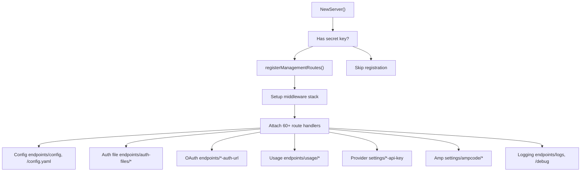
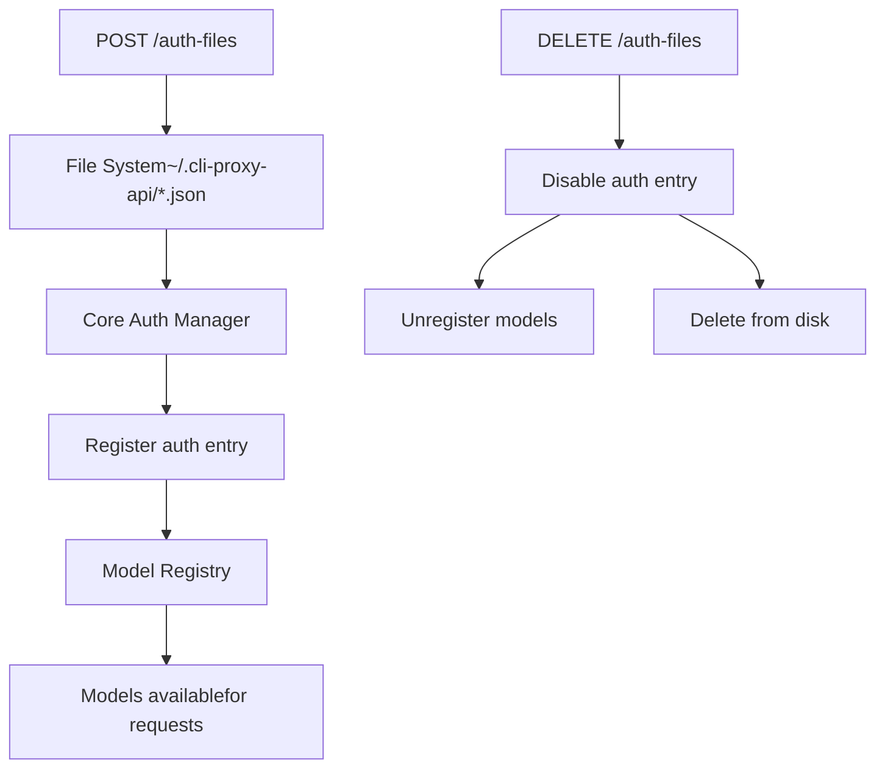
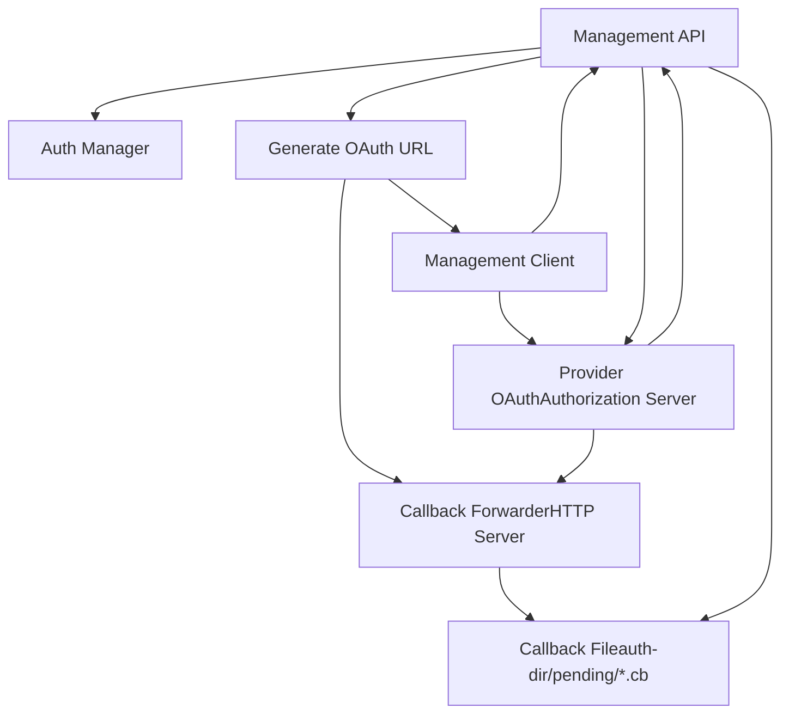
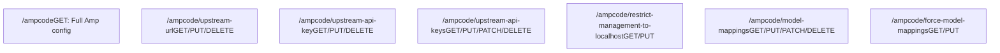

# Management API

Relevant source files

-   [README.md](https://github.com/router-for-me/CLIProxyAPI/blob/c66cb0af/README.md)
-   [README\_CN.md](https://github.com/router-for-me/CLIProxyAPI/blob/c66cb0af/README_CN.md)
-   [cmd/server/main.go](https://github.com/router-for-me/CLIProxyAPI/blob/c66cb0af/cmd/server/main.go)
-   [config.example.yaml](https://github.com/router-for-me/CLIProxyAPI/blob/c66cb0af/config.example.yaml)
-   [go.mod](https://github.com/router-for-me/CLIProxyAPI/blob/c66cb0af/go.mod)
-   [go.sum](https://github.com/router-for-me/CLIProxyAPI/blob/c66cb0af/go.sum)
-   [internal/api/handlers/management/auth\_files.go](https://github.com/router-for-me/CLIProxyAPI/blob/c66cb0af/internal/api/handlers/management/auth_files.go)
-   [internal/api/handlers/management/config\_basic.go](https://github.com/router-for-me/CLIProxyAPI/blob/c66cb0af/internal/api/handlers/management/config_basic.go)
-   [internal/api/handlers/management/config\_lists.go](https://github.com/router-for-me/CLIProxyAPI/blob/c66cb0af/internal/api/handlers/management/config_lists.go)
-   [internal/api/handlers/management/logs.go](https://github.com/router-for-me/CLIProxyAPI/blob/c66cb0af/internal/api/handlers/management/logs.go)
-   [internal/api/handlers/management/usage.go](https://github.com/router-for-me/CLIProxyAPI/blob/c66cb0af/internal/api/handlers/management/usage.go)
-   [internal/api/server.go](https://github.com/router-for-me/CLIProxyAPI/blob/c66cb0af/internal/api/server.go)
-   [internal/config/config.go](https://github.com/router-for-me/CLIProxyAPI/blob/c66cb0af/internal/config/config.go)
-   [internal/managementasset/updater.go](https://github.com/router-for-me/CLIProxyAPI/blob/c66cb0af/internal/managementasset/updater.go)
-   [internal/runtime/executor/usage\_helpers.go](https://github.com/router-for-me/CLIProxyAPI/blob/c66cb0af/internal/runtime/executor/usage_helpers.go)
-   [internal/store/gitstore.go](https://github.com/router-for-me/CLIProxyAPI/blob/c66cb0af/internal/store/gitstore.go)
-   [internal/store/postgresstore.go](https://github.com/router-for-me/CLIProxyAPI/blob/c66cb0af/internal/store/postgresstore.go)
-   [internal/usage/logger\_plugin.go](https://github.com/router-for-me/CLIProxyAPI/blob/c66cb0af/internal/usage/logger_plugin.go)
-   [internal/watcher/watcher.go](https://github.com/router-for-me/CLIProxyAPI/blob/c66cb0af/internal/watcher/watcher.go)
-   [sdk/cliproxy/service.go](https://github.com/router-for-me/CLIProxyAPI/blob/c66cb0af/sdk/cliproxy/service.go)
-   [sdk/cliproxy/usage/manager.go](https://github.com/router-for-me/CLIProxyAPI/blob/c66cb0af/sdk/cliproxy/usage/manager.go)
-   [test/amp\_management\_test.go](https://github.com/router-for-me/CLIProxyAPI/blob/c66cb0af/test/amp_management_test.go)

## Overview

The Management API provides HTTP endpoints for dynamically configuring and managing the CLIProxyAPI server without requiring restarts. It exposes functionality for configuration updates, authentication management, OAuth flows, usage statistics, and operational controls.

This document covers the `/v0/management` endpoints and their implementation. For information about AI provider APIs (OpenAI, Claude, Gemini), see pages [4.1](/router-for-me/CLIProxyAPI/4.1-openai-compatible-endpoints), [4.2](/router-for-me/CLIProxyAPI/4.2-gemini-and-vertex-endpoints), and [4.3](/router-for-me/CLIProxyAPI/4.3-claude-api-endpoints). For Amp CLI-specific routes, see [4.5](/router-for-me/CLIProxyAPI/4.5-amp-cli-integration).

**Key Features:**

-   Hot-reload configuration updates via YAML manipulation
-   OAuth flow orchestration for multiple providers
-   Authentication credential upload, download, and deletion
-   Usage statistics export and import
-   Real-time logging configuration
-   Provider-specific settings management

**Security Model:**

-   All management endpoints require authentication via secret key
-   Optional localhost-only restriction for sensitive operations
-   Secret keys are bcrypt-hashed on first use
-   Management routes are disabled (404) when no secret key is configured

---

## Authentication and Authorization

### Secret Key Configuration

Management API authentication is controlled by the `remote-management.secret-key` configuration field or the `MANAGEMENT_PASSWORD` environment variable [internal/api/server.go240-242](https://github.com/router-for-me/CLIProxyAPI/blob/c66cb0af/internal/api/server.go#L240-L242) When neither is present, all management routes return HTTP 404 [internal/api/server.go648-656](https://github.com/router-for-me/CLIProxyAPI/blob/c66cb0af/internal/api/server.go#L648-L656)

```
remote-management:  secret-key: "your-secret-here"  # Hashed automatically on startup  allow-remote: false              # Restrict to localhost when false
```
**Authentication Flow:**

> **[Mermaid sequence]**
> *(图表结构无法解析)*

Sources: [internal/api/server.go465-632](https://github.com/router-for-me/CLIProxyAPI/blob/c66cb0af/internal/api/server.go#L465-L632) [internal/api/server.go634-642](https://github.com/router-for-me/CLIProxyAPI/blob/c66cb0af/internal/api/server.go#L634-L642)

### Middleware Stack

The management route group applies two middleware layers in order [server.go476](https://github.com/router-for-me/CLIProxyAPI/blob/c66cb0af/server.go#L476-L476):

1.  **`managementAvailabilityMiddleware()`** - Returns 404 when `managementRoutesEnabled` is false
2.  **`Handler.Middleware()`** - Validates secret key and enforces localhost restrictions

The `managementRoutesEnabled` atomic boolean is set based on configuration [server.go288-292](https://github.com/router-for-me/CLIProxyAPI/blob/c66cb0af/server.go#L288-L292) [server.go919-944](https://github.com/router-for-me/CLIProxyAPI/blob/c66cb0af/server.go#L919-L944):

| Condition | Routes Enabled |
| --- | --- |
| `MANAGEMENT_PASSWORD` env var set | Yes |
| `remote-management.secret-key` non-empty | Yes |
| Both empty | No (404) |

Sources: [internal/api/server.go232-249](https://github.com/router-for-me/CLIProxyAPI/blob/c66cb0af/internal/api/server.go#L232-L249) [internal/api/server.go465-476](https://github.com/router-for-me/CLIProxyAPI/blob/c66cb0af/internal/api/server.go#L465-L476) [internal/api/server.go634-642](https://github.com/router-for-me/CLIProxyAPI/blob/c66cb0af/internal/api/server.go#L634-L642)

---

## Route Registration Architecture

### Registration Process

Management routes are registered lazily when a secret key becomes available [server.go465-471](https://github.com/router-for-me/CLIProxyAPI/blob/c66cb0af/server.go#L465-L471):


Sources: [internal/api/server.go465-632](https://github.com/router-for-me/CLIProxyAPI/blob/c66cb0af/internal/api/server.go#L465-L632) [internal/api/server.go288-292](https://github.com/router-for-me/CLIProxyAPI/blob/c66cb0af/internal/api/server.go#L288-L292)

### Handler Structure

The `Handler` type from the management package encapsulates all endpoint implementations:

```
type Handler struct {    cfg            *config.Config      // Current configuration    authManager    *auth.Manager       // Core auth manager    configFilePath string              // Absolute path to config.yaml    localPassword  string              // Runtime localhost password    logDirectory   string              // Resolved log directory path    mu             sync.Mutex          // Protects config mutations}
```
**Key Responsibilities:**

-   Configuration YAML marshaling and persistence [config\_basic.go95-110](https://github.com/router-for-me/CLIProxyAPI/blob/c66cb0af/config_basic.go#L95-L110)
-   OAuth callback forwarding and state management [auth\_files.go132-234](https://github.com/router-for-me/CLIProxyAPI/blob/c66cb0af/auth_files.go#L132-L234)
-   Auth file upload/download/deletion [auth\_files.go506-627](https://github.com/router-for-me/CLIProxyAPI/blob/c66cb0af/auth_files.go#L506-L627)
-   Usage statistics aggregation and export [usage.go](https://github.com/router-for-me/CLIProxyAPI/blob/c66cb0af/usage.go)
-   Provider-specific settings management [config\_lists.go](https://github.com/router-for-me/CLIProxyAPI/blob/c66cb0af/config_lists.go)

Sources: [internal/api/handlers/management/handler.go](https://github.com/router-for-me/CLIProxyAPI/blob/c66cb0af/internal/api/handlers/management/handler.go) [internal/api/handlers/management/config\_basic.go95-110](https://github.com/router-for-me/CLIProxyAPI/blob/c66cb0af/internal/api/handlers/management/config_basic.go#L95-L110)

---

## Configuration Management Endpoints

### GET /v0/management/config

Returns the complete server configuration as JSON, excluding sensitive fields marked with `json:"-"` tags.

**Response Structure:**

```
{  "debug": true,  "request-retry": 3,  "max-retry-interval": 30,  "gemini-api-key": [...],  "claude-api-key": [...],  "routing": {    "strategy": "round-robin"  }}
```
Sources: [internal/api/handlers/management/config\_basic.go26-33](https://github.com/router-for-me/CLIProxyAPI/blob/c66cb0af/internal/api/handlers/management/config_basic.go#L26-L33)

### GET /v0/management/config.yaml

Returns the raw `config.yaml` file contents with preserved formatting, comments, and whitespace [config\_basic.go168-183](https://github.com/router-for-me/CLIProxyAPI/blob/c66cb0af/config_basic.go#L168-L183)

**Headers:**

-   `Content-Type: application/yaml; charset=utf-8`
-   `Cache-Control: no-store`

### PUT /v0/management/config.yaml

Replaces the entire configuration file after validation. The request body must be valid YAML that successfully parses into a `Config` struct [config\_basic.go112-164](https://github.com/router-for-me/CLIProxyAPI/blob/c66cb0af/config_basic.go#L112-L164)

**Validation Process:**

1.  Unmarshal request body into temporary config struct
2.  Write to temporary file in same directory
3.  Call `config.LoadConfigOptional()` with `optional=false` to enforce parsing
4.  If valid, atomically replace original config file
5.  Reload configuration into handler

**Error Responses:**

-   `400 Bad Request` - Invalid YAML syntax
-   `422 Unprocessable Entity` - Valid YAML but invalid configuration structure
-   `500 Internal Server Error` - File write failure

Sources: [internal/api/handlers/management/config\_basic.go112-164](https://github.com/router-for-me/CLIProxyAPI/blob/c66cb0af/internal/api/handlers/management/config_basic.go#L112-L164)

### Configuration Persistence Flow

> **[Mermaid sequence]**
> *(图表结构无法解析)*

Sources: [internal/api/handlers/management/config\_basic.go95-110](https://github.com/router-for-me/CLIProxyAPI/blob/c66cb0af/internal/api/handlers/management/config_basic.go#L95-L110) [internal/watcher/watcher.go73-79](https://github.com/router-for-me/CLIProxyAPI/blob/c66cb0af/internal/watcher/watcher.go#L73-L79) [internal/api/server.go859-1002](https://github.com/router-for-me/CLIProxyAPI/blob/c66cb0af/internal/api/server.go#L859-L1002)

---

## Configuration Field Endpoints

### Boolean Field Endpoints

All boolean configuration fields follow a consistent pattern:

| Endpoint | Config Field | Default |
| --- | --- | --- |
| `/debug` | `debug` | `false` |
| `/usage-statistics-enabled` | `usage_statistics_enabled` | `false` |
| `/logging-to-file` | `logging_to_file` | `false` |
| `/request-log` | `request_log` | `false` |
| `/ws-auth` | `websocket_auth` | `false` |
| `/force-model-prefix` | `force_model_prefix` | `false` |
| `/quota-exceeded/switch-project` | `quota_exceeded.switch_project` | `true` |
| `/quota-exceeded/switch-preview-model` | `quota_exceeded.switch_preview_model` | `true` |

**Operations:**

-   `GET` - Returns `{"field-name": value}`
-   `PUT` / `PATCH` - Accepts `{"value": true/false}`

Sources: [internal/api/handlers/management/config\_basic.go186-281](https://github.com/router-for-me/CLIProxyAPI/blob/c66cb0af/internal/api/handlers/management/config_basic.go#L186-L281)

### Integer Field Endpoints

| Endpoint | Config Field | Range |
| --- | --- | --- |
| `/logs-max-total-size-mb` | `logs_max_total_size_mb` | `>= 0` |
| `/error-logs-max-files` | `error_logs_max_files` | `>= 0` (default 10) |
| `/request-retry` | `request_retry` | `>= 0` |
| `/max-retry-interval` | `max_retry_interval` | `>= 0` (seconds) |

Negative values are clamped to minimum bounds during persistence.

Sources: [internal/api/handlers/management/config\_basic.go206-273](https://github.com/router-for-me/CLIProxyAPI/blob/c66cb0af/internal/api/handlers/management/config_basic.go#L206-L273)

### String Field Endpoints

| Endpoint | Config Field | Validation |
| --- | --- | --- |
| `/proxy-url` | `proxy_url` | Supports `socks5://`, `http://`, `https://` |
| `/routing/strategy` | `routing.strategy` | `"round-robin"` or `"fill-first"` |

**DELETE /v0/management/proxy-url** - Clears the proxy setting [config\_basic.go326-329](https://github.com/router-for-me/CLIProxyAPI/blob/c66cb0af/config_basic.go#L326-L329)

Sources: [internal/api/handlers/management/config\_basic.go322-329](https://github.com/router-for-me/CLIProxyAPI/blob/c66cb0af/internal/api/handlers/management/config_basic.go#L322-L329) [internal/api/handlers/management/config\_basic.go283-319](https://github.com/router-for-me/CLIProxyAPI/blob/c66cb0af/internal/api/handlers/management/config_basic.go#L283-L319)

---

## Authentication File Management

### Authentication File Lifecycle


Sources: [internal/api/handlers/management/auth\_files.go531-594](https://github.com/router-for-me/CLIProxyAPI/blob/c66cb0af/internal/api/handlers/management/auth_files.go#L531-L594) [internal/api/handlers/management/auth\_files.go597-662](https://github.com/router-for-me/CLIProxyAPI/blob/c66cb0af/internal/api/handlers/management/auth_files.go#L597-L662)

### GET /v0/management/auth-files

Lists all authentication files with metadata extracted from the core auth manager.

**Response Structure:**

```
{  "files": [    {      "id": "gemini-cli-user@example.com.json",      "auth_index": 42,      "name": "gemini-cli-user@example.com.json",      "type": "gemini-cli",      "provider": "gemini-cli",      "label": "user@example.com",      "email": "user@example.com",      "status": "active",      "status_message": "",      "disabled": false,      "unavailable": false,      "runtime_only": false,      "source": "file",      "size": 2048,      "created_at": "2024-01-15T10:30:00Z",      "updated_at": "2024-01-20T15:45:00Z",      "last_refresh": "2024-01-20T15:45:00Z",      "path": "/home/user/.cli-proxy-api/gemini-cli-user@example.com.json"    }  ]}
```
**Runtime-Only Auth Entries:**
Credentials created via WebSocket connections or temporary OAuth flows have `"runtime_only": true` and `"source": "memory"`. These are hidden from listings when disabled [auth\_files.go361-363](https://github.com/router-for-me/CLIProxyAPI/blob/c66cb0af/auth_files.go#L361-L363)

Sources: [internal/api/handlers/management/auth\_files.go250-272](https://github.com/router-for-me/CLIProxyAPI/blob/c66cb0af/internal/api/handlers/management/auth_files.go#L250-L272) [internal/api/handlers/management/auth\_files.go356-428](https://github.com/router-for-me/CLIProxyAPI/blob/c66cb0af/internal/api/handlers/management/auth_files.go#L356-L428)

### GET /v0/management/auth-files/models

Returns models supported by a specific auth file, queried by `?name=` parameter.

**Example:**

```
GET /v0/management/auth-files/models?name=claude-user@example.com.json
```
**Response:**

```
{  "models": [    {      "id": "claude-sonnet-4",      "display_name": "Claude Sonnet 4",      "type": "chat",      "owned_by": "anthropic"    }  ]}
```
Models are retrieved from the global registry using the auth ID as the client identifier [auth\_files.go283-320](https://github.com/router-for-me/CLIProxyAPI/blob/c66cb0af/auth_files.go#L283-L320)

Sources: [internal/api/handlers/management/auth\_files.go274-320](https://github.com/router-for-me/CLIProxyAPI/blob/c66cb0af/internal/api/handlers/management/auth_files.go#L274-L320)

### POST /v0/management/auth-files

Uploads authentication credential files via multipart form or raw JSON body.

**Multipart Upload:**

```
POST /v0/management/auth-filesContent-Type: multipart/form-data --boundaryContent-Disposition: form-data; name="file"; filename="gemini-cli-account.json"Content-Type: application/json {...credential JSON...}
```
**Raw JSON Upload:**

```
POST /v0/management/auth-files?name=gemini-cli-account.jsonContent-Type: application/json {...credential JSON...}
```
**Upload Process:**

1.  Save file to `auth-dir` with 0600 permissions [auth\_files.go585-587](https://github.com/router-for-me/CLIProxyAPI/blob/c66cb0af/auth_files.go#L585-L587)
2.  Read file contents and parse JSON
3.  Call `registerAuthFromFile()` to register with auth manager [auth\_files.go589-591](https://github.com/router-for-me/CLIProxyAPI/blob/c66cb0af/auth_files.go#L589-L591)
4.  Models automatically registered via provider executors

**Error Handling:**

-   Non-`.json` files rejected with 400
-   Invalid JSON returns 500 with parse error
-   Path traversal attempts blocked via `filepath.Base()` sanitization

Sources: [internal/api/handlers/management/auth\_files.go531-594](https://github.com/router-for-me/CLIProxyAPI/blob/c66cb0af/internal/api/handlers/management/auth_files.go#L531-L594)

### GET /v0/management/auth-files/download

Downloads a single authentication file by name.

**Example:**

```
GET /v0/management/auth-files/download?name=codex-account.json
```
**Response:**

-   `Content-Disposition: attachment; filename="codex-account.json"`
-   `Content-Type: application/json`
-   Raw file contents with original formatting

Returns 404 if file doesn't exist, 500 on read errors.

Sources: [internal/api/handlers/management/auth\_files.go506-528](https://github.com/router-for-me/CLIProxyAPI/blob/c66cb0af/internal/api/handlers/management/auth_files.go#L506-L528)

### DELETE /v0/management/auth-files

Deletes authentication files individually or in bulk.

**Single File:**

```
DELETE /v0/management/auth-files?name=gemini-cli-old-account.json
```
**All Files:**

```
DELETE /v0/management/auth-files?all=true
```
**Deletion Process:**

1.  Find auth entry in core auth manager by filename
2.  Mark as disabled and set status to `StatusDisabled` [auth\_files.go629-636](https://github.com/router-for-me/CLIProxyAPI/blob/c66cb0af/auth_files.go#L629-L636)
3.  Unregister models from registry
4.  Optionally delete file from disk (not implemented in snippet)

The auth entry remains in memory as disabled to prevent immediate re-registration if the file watcher detects removal events.

Sources: [internal/api/handlers/management/auth\_files.go597-662](https://github.com/router-for-me/CLIProxyAPI/blob/c66cb0af/internal/api/handlers/management/auth_files.go#L597-L662)

---

## OAuth Flow Management

### OAuth Provider Architecture


Sources: [internal/api/handlers/management/auth\_files.go132-234](https://github.com/router-for-me/CLIProxyAPI/blob/c66cb0af/internal/api/handlers/management/auth_files.go#L132-L234) [internal/api/handlers/management/oauth.go](https://github.com/router-for-me/CLIProxyAPI/blob/c66cb0af/internal/api/handlers/management/oauth.go)

### Callback Forwarder System

Callback forwarders are temporary HTTP servers that run on provider-specific ports to receive OAuth redirects and forward them to the main server [auth\_files.go132-190](https://github.com/router-for-me/CLIProxyAPI/blob/c66cb0af/auth_files.go#L132-L190)

**Provider Ports:**

| Provider | Port | Forwarder Lifetime |
| --- | --- | --- |
| Anthropic | 54545 | Duration of OAuth flow |
| Codex | 1455 | Duration of OAuth flow |
| Gemini CLI | 8085 | Duration of OAuth flow |
| Antigravity | Dynamic | Duration of OAuth flow |
| iFlow | Dynamic | Duration of OAuth flow |
| Qwen | Dynamic | Duration of OAuth flow |

**Forwarder Lifecycle:**

1.  Started when management API returns OAuth URL [auth\_files.go132-190](https://github.com/router-for-me/CLIProxyAPI/blob/c66cb0af/auth_files.go#L132-L190)
2.  Listens on provider-specific port with 5-second timeouts
3.  Redirects all requests to main server callback endpoint
4.  Stopped after callback is processed or session times out

**Callback File Format:**

```
{  "code": "authorization_code_here",  "state": "random_state_string",  "error": "",  "timestamp": 1705843200}
```
Files are written to `{auth-dir}/pending/{provider}-{state}.cb` for polling.

Sources: [internal/api/handlers/management/auth\_files.go132-234](https://github.com/router-for-me/CLIProxyAPI/blob/c66cb0af/internal/api/handlers/management/auth_files.go#L132-L234) [internal/api/handlers/management/oauth\_callback.go](https://github.com/router-for-me/CLIProxyAPI/blob/c66cb0af/internal/api/handlers/management/oauth_callback.go)

### OAuth URL Endpoints

All OAuth URL endpoints follow the same pattern: generate authorization URL, start callback forwarder, return URL to client.

**Endpoints:**

| Endpoint | Provider | Authenticator |
| --- | --- | --- |
| `GET /anthropic-auth-url` | Claude OAuth | `sdkAuth.NewClaudeAuthenticator()` |
| `GET /codex-auth-url` | OpenAI Codex | `sdkAuth.NewCodexAuthenticator()` |
| `GET /gemini-cli-auth-url` | Gemini CLI | `sdkAuth.NewGeminiAuthenticator()` |
| `GET /antigravity-auth-url` | Antigravity | `sdkAuth.NewAntigravityAuthenticator()` |
| `GET /qwen-auth-url` | Qwen | `sdkAuth.NewQwenAuthenticator()` |
| `GET /kimi-auth-url` | Kimi | `sdkAuth.NewKimiAuthenticator()` |
| `GET /iflow-auth-url` | iFlow | `sdkAuth.NewIFlowAuthenticator()` |

**Query Parameters:**

-   `is_webui=true` - Enables web UI mode with callback polling

Sources: [internal/api/handlers/management/oauth.go](https://github.com/router-for-me/CLIProxyAPI/blob/c66cb0af/internal/api/handlers/management/oauth.go) [sdk/auth/](https://github.com/router-for-me/CLIProxyAPI/blob/c66cb0af/sdk/auth/)

### POST /v0/management/oauth-callback

Completes OAuth flow by exchanging authorization code for tokens and persisting credentials.

**Request Body:**

```
{  "provider": "gemini-cli",  "state": "random_state_string",  "callback_port": 8085}
```
**Flow:**

1.  Read callback file from `{auth-dir}/pending/{provider}-{state}.cb`
2.  Validate state matches request
3.  Extract authorization code from callback file
4.  Call provider authenticator's token exchange method
5.  Persist credential file to auth directory
6.  Register auth entry with core auth manager
7.  Clean up callback file and stop forwarder

Sources: [internal/api/handlers/management/oauth\_callback.go](https://github.com/router-for-me/CLIProxyAPI/blob/c66cb0af/internal/api/handlers/management/oauth_callback.go)

### GET /v0/management/get-auth-status

Polls for OAuth callback completion during web UI flows.

**Query Parameters:**

-   `provider` - Provider identifier
-   `state` - OAuth state parameter

**Response (pending):**

```
{  "status": "pending",  "message": "Waiting for authentication..."}
```
**Response (completed):**

```
{  "status": "success",  "auth_file": "gemini-cli-user@example.com.json",  "email": "user@example.com"}
```
**Response (error):**

```
{  "status": "error",  "message": "Authentication failed: user_denied"}
```
Sources: [internal/api/handlers/management/oauth\_callback.go](https://github.com/router-for-me/CLIProxyAPI/blob/c66cb0af/internal/api/handlers/management/oauth_callback.go)

---

## Provider-Specific Settings

### API Key List Endpoints

All provider API key endpoints follow CRUD patterns with list, entry, and alias management.

**Common Operations:**

| HTTP Method | Operation | Body Format |
| --- | --- | --- |
| GET | List all entries | N/A |
| PUT | Replace entire list | `{"items": [...]}` or `[...]` |
| PATCH | Update single entry | `{"index": 0, "value": {...}}` |
| DELETE | Remove entry | `?index=0` or `?api-key=...` |

### GET /v0/management/gemini-api-key

Returns all Gemini API key configurations [config\_lists.go122-124](https://github.com/router-for-me/CLIProxyAPI/blob/c66cb0af/config_lists.go#L122-L124)

**Response Structure:**

```
{  "gemini-api-key": [    {      "api-key": "AIzaSy...01",      "priority": 0,      "prefix": "",      "base-url": "https://generativelanguage.googleapis.com",      "proxy-url": "",      "models": [        {"name": "gemini-2.5-flash", "alias": "flash"}      ],      "headers": {        "X-Custom-Header": "value"      },      "excluded-models": ["gemini-2.5-pro"]    }  ]}
```
Sources: [internal/api/handlers/management/config\_lists.go122-124](https://github.com/router-for-me/CLIProxyAPI/blob/c66cb0af/internal/api/handlers/management/config_lists.go#L122-L124)

### PATCH /v0/management/gemini-api-key

Updates a single Gemini API key entry by index or matching key value [config\_lists.go146-213](https://github.com/router-for-me/CLIProxyAPI/blob/c66cb0af/config_lists.go#L146-L213)

**Request Body:**

```
{  "index": 0,  "value": {    "api-key": "AIzaSy...01",    "prefix": "team-a",    "excluded-models": ["gemini-2.5-pro"]  }}
```
**Partial Updates:** Only specified fields are modified. If `api-key` is set to empty string, the entire entry is removed [config\_lists.go186-192](https://github.com/router-for-me/CLIProxyAPI/blob/c66cb0af/config_lists.go#L186-L192)

Sources: [internal/api/handlers/management/config\_lists.go146-213](https://github.com/router-for-me/CLIProxyAPI/blob/c66cb0af/internal/api/handlers/management/config_lists.go#L146-L213)

### Provider-Specific Endpoints

The same CRUD pattern applies to all provider key types:

| Endpoint Base | Config Field | Entry Type |
| --- | --- | --- |
| `/gemini-api-key` | `gemini_key` | `GeminiKey` |
| `/claude-api-key` | `claude_key` | `ClaudeKey` |
| `/codex-api-key` | `codex_key` | `CodexKey` |
| `/vertex-api-key` | `vertex_compat_api_key` | `VertexCompatKey` |
| `/openai-compatibility` | `openai_compatibility` | `OpenAICompatibility` |

Each entry type supports:

-   `api-key` or `api-key-entries` - Credential(s)
-   `prefix` - Model namespace (e.g., `"team-a/model-name"`)
-   `priority` - Selection preference (higher = preferred)
-   `base-url` - Custom API endpoint
-   `proxy-url` - Per-credential proxy override
-   `models` - Model name aliases
-   `headers` - Custom HTTP headers
-   `excluded-models` - Wildcard exclusion patterns

Sources: [internal/api/handlers/management/config\_lists.go](https://github.com/router-for-me/CLIProxyAPI/blob/c66cb0af/internal/api/handlers/management/config_lists.go)

---

## OAuth Model Configuration

### GET /v0/management/oauth-excluded-models

Returns per-provider model exclusion patterns applied to OAuth and file-backed credentials [config\_oauth.go](https://github.com/router-for-me/CLIProxyAPI/blob/c66cb0af/config_oauth.go)

**Response Structure:**

```
{  "oauth-excluded-models": {    "gemini-cli": ["gemini-2.5-pro", "*-preview"],    "claude": ["claude-3-5-haiku-*"],    "codex": ["gpt-5-*-mini"]  }}
```
**Wildcard Patterns:**

-   `gemini-2.5-*` - Prefix match
-   `*-preview` - Suffix match
-   `*flash*` - Substring match

Sources: [internal/api/handlers/management/config\_oauth.go](https://github.com/router-for-me/CLIProxyAPI/blob/c66cb0af/internal/api/handlers/management/config_oauth.go)

### GET /v0/management/oauth-model-alias

Returns global model name aliases for OAuth channels [config\_oauth.go](https://github.com/router-for-me/CLIProxyAPI/blob/c66cb0af/config_oauth.go)

**Response Structure:**

```
{  "oauth-model-alias": {    "gemini-cli": [      {        "name": "gemini-2.5-pro",        "alias": "g2.5p",        "fork": false      }    ],    "claude": [      {        "name": "claude-sonnet-4-5-20250929",        "alias": "cs4.5",        "fork": true      }    ]  }}
```
**Fork Behavior:**
When `fork: true`, both the original model name and alias are exposed. When `fork: false`, the alias replaces the original name [config/config.go168-176](https://github.com/router-for-me/CLIProxyAPI/blob/c66cb0af/config/config.go#L168-L176)

**Supported Channels:**
`gemini-cli`, `vertex`, `aistudio`, `antigravity`, `claude`, `codex`, `qwen`, `iflow`, `kimi`

Sources: [internal/api/handlers/management/config\_oauth.go](https://github.com/router-for-me/CLIProxyAPI/blob/c66cb0af/internal/api/handlers/management/config_oauth.go) [internal/config/config.go168-176](https://github.com/router-for-me/CLIProxyAPI/blob/c66cb0af/internal/config/config.go#L168-L176)

---

## Amp CLI Integration Settings

### GET /v0/management/ampcode

Returns complete Amp CLI configuration including upstream routing and model mappings.

**Response Structure:**

```
{  "ampcode": {    "upstream-url": "https://ampcode.com",    "upstream-api-key": "",    "upstream-api-keys": [      {        "upstream-api-key": "amp_key_team_a",        "api-keys": ["client-key-1", "client-key-2"]      }    ],    "restrict-management-to-localhost": false,    "model-mappings": [      {        "from": "claude-opus-4-5-20251101",        "to": "gemini-claude-opus-4-5-thinking",        "regex": false      }    ],    "force-model-mappings": false  }}
```
Sources: [internal/api/handlers/management/config\_amp.go](https://github.com/router-for-me/CLIProxyAPI/blob/c66cb0af/internal/api/handlers/management/config_amp.go)

### Amp Configuration Endpoints

| Endpoint | Config Field | Type |
| --- | --- | --- |
| `/ampcode/upstream-url` | `ampcode.upstream_url` | String |
| `/ampcode/upstream-api-key` | `ampcode.upstream_api_key` | String |
| `/ampcode/upstream-api-keys` | `ampcode.upstream_api_keys` | List |
| `/ampcode/restrict-management-to-localhost` | `ampcode.restrict_management_to_localhost` | Boolean |
| `/ampcode/model-mappings` | `ampcode.model_mappings` | List |
| `/ampcode/force-model-mappings` | `ampcode.force_model_mappings` | Boolean |

**Per-Client Upstream Keys:**
The `upstream-api-keys` field maps client API keys to specific Amp upstream keys, enabling multi-tenant routing [config/config.go197-207](https://github.com/router-for-me/CLIProxyAPI/blob/c66cb0af/config/config.go#L197-L207)

**Model Mappings:**
Allows routing unavailable Amp-requested models to alternative local models. When `force-model-mappings: true`, mappings take precedence over local API keys [config/config.go214-221](https://github.com/router-for-me/CLIProxyAPI/blob/c66cb0af/config/config.go#L214-L221)

Sources: [internal/api/handlers/management/config\_amp.go](https://github.com/router-for-me/CLIProxyAPI/blob/c66cb0af/internal/api/handlers/management/config_amp.go) [internal/config/config.go197-221](https://github.com/router-for-me/CLIProxyAPI/blob/c66cb0af/internal/config/config.go#L197-L221)

---

## Usage Statistics and Monitoring

### GET /v0/management/usage

Returns aggregated usage statistics for all models and providers.

**Response Structure:**

```
{  "statistics": {    "gemini-2.5-flash": {      "total_requests": 150,      "success_requests": 148,      "failed_requests": 2,      "total_prompt_tokens": 45000,      "total_completion_tokens": 12000,      "total_tokens": 57000,      "first_request_at": "2024-01-01T00:00:00Z",      "last_request_at": "2024-01-20T15:30:00Z"    }  }}
```
Statistics are aggregated in-memory when `usage-statistics-enabled: true` [config/config.go64-65](https://github.com/router-for-me/CLIProxyAPI/blob/c66cb0af/config/config.go#L64-L65)

Sources: [internal/api/handlers/management/usage.go](https://github.com/router-for-me/CLIProxyAPI/blob/c66cb0af/internal/api/handlers/management/usage.go)

### GET /v0/management/usage/export

Exports usage statistics as downloadable JSON file.

**Response Headers:**

-   `Content-Type: application/json`
-   `Content-Disposition: attachment; filename="usage-statistics-{timestamp}.json"`

**Use Case:** Backup before server restart or data analysis in external tools.

Sources: [internal/api/handlers/management/usage.go](https://github.com/router-for-me/CLIProxyAPI/blob/c66cb0af/internal/api/handlers/management/usage.go)

### POST /v0/management/usage/import

Imports previously exported usage statistics, merging with current data.

**Request Body:**
JSON file previously exported via `/usage/export` endpoint.

**Merge Behavior:**

-   Request counts are summed
-   Token counts are summed
-   Timestamp ranges are expanded to include both datasets

Sources: [internal/api/handlers/management/usage.go](https://github.com/router-for-me/CLIProxyAPI/blob/c66cb0af/internal/api/handlers/management/usage.go)

---

## Logging and Debugging

### Log File Endpoints

| Endpoint | Operation | Query Parameters |
| --- | --- | --- |
| `GET /logs` | List all log files | N/A |
| `DELETE /logs` | Delete all logs | N/A |
| `GET /request-error-logs` | List error logs | N/A |
| `GET /request-error-logs/:name` | Download error log | N/A |
| `GET /request-log-by-id/:id` | Get specific request | N/A |

**Log Directory Resolution:**
Log files are written to `{writable-base}/logs/` where writable base is determined by `util.WritablePath()` or falls back to relative `./logs` [server.go59-65](https://github.com/router-for-me/CLIProxyAPI/blob/c66cb0af/server.go#L59-L65)

Sources: [internal/api/server.go59-65](https://github.com/router-for-me/CLIProxyAPI/blob/c66cb0af/internal/api/server.go#L59-L65) [internal/api/handlers/management/logs.go](https://github.com/router-for-me/CLIProxyAPI/blob/c66cb0af/internal/api/handlers/management/logs.go)

### GET /v0/management/logs

Lists all log files with metadata.

**Response Structure:**

```
{  "logs": [    {      "name": "app-2024-01-20.log",      "size": 2048576,      "modified": "2024-01-20T15:45:00Z",      "type": "application"    },    {      "name": "error-2024-01-20.log",      "size": 8192,      "modified": "2024-01-20T14:30:00Z",      "type": "error"    }  ]}
```
Sources: [internal/api/handlers/management/logs.go](https://github.com/router-for-me/CLIProxyAPI/blob/c66cb0af/internal/api/handlers/management/logs.go)

### GET /v0/management/request-error-logs

Lists request error log files created when `request-log: false` but errors occur.

**Retention Policy:**
The number of retained error logs is controlled by `error-logs-max-files` configuration field (default: 10). Oldest files are deleted when limit is exceeded [config/config.go59-62](https://github.com/router-for-me/CLIProxyAPI/blob/c66cb0af/config/config.go#L59-L62)

Sources: [internal/api/handlers/management/logs.go](https://github.com/router-for-me/CLIProxyAPI/blob/c66cb0af/internal/api/handlers/management/logs.go) [internal/config/config.go59-62](https://github.com/router-for-me/CLIProxyAPI/blob/c66cb0af/internal/config/config.go#L59-L62)

### GET /v0/management/request-log-by-id/:id

Retrieves a specific request log entry by unique ID.

**Use Case:** Debugging failed requests or analyzing specific API call patterns.

Sources: [internal/api/handlers/management/logs.go](https://github.com/router-for-me/CLIProxyAPI/blob/c66cb0af/internal/api/handlers/management/logs.go)

---

## Miscellaneous Endpoints

### POST /v0/management/api-call

Executes a test API call through the proxy to verify provider connectivity.

**Request Body:**

```
{  "provider": "gemini",  "model": "gemini-2.5-flash",  "prompt": "Test message"}
```
**Response:**
Proxied API response from the provider or error details.

Sources: [internal/api/handlers/management/api\_call.go](https://github.com/router-for-me/CLIProxyAPI/blob/c66cb0af/internal/api/handlers/management/api_call.go)

### GET /v0/management/latest-version

Queries GitHub API for the latest CLIProxyAPI release version without downloading assets [config\_basic.go41-93](https://github.com/router-for-me/CLIProxyAPI/blob/c66cb0af/config_basic.go#L41-L93)

**Response:**

```
{  "latest-version": "v6.2.0"}
```
**Error Responses:**

-   `502 Bad Gateway` - GitHub API request failed
-   `502 Bad Gateway` - Invalid response format

Respects `proxy-url` configuration when making GitHub requests.

Sources: [internal/api/handlers/management/config\_basic.go41-93](https://github.com/router-for-me/CLIProxyAPI/blob/c66cb0af/internal/api/handlers/management/config_basic.go#L41-L93)

### GET /v0/management/model-definitions/:channel

Returns static model definitions for a provider channel without requiring authentication.

**Supported Channels:**
`gemini`, `gemini-cli`, `vertex`, `aistudio`, `antigravity`, `claude`, `codex`, `qwen`, `iflow`, `kimi`, `openai`

**Response:**

```
{  "models": [    {      "id": "gemini-2.5-flash",      "display_name": "Gemini 2.5 Flash",      "type": "chat",      "owned_by": "google"    }  ]}
```
**Use Case:** Populating model selection dropdowns in management UIs before credentials are configured.

Sources: [internal/api/handlers/management/auth\_files.go](https://github.com/router-for-me/CLIProxyAPI/blob/c66cb0af/internal/api/handlers/management/auth_files.go)

### POST /v0/management/vertex/import

Imports Vertex AI service account credentials from JSON file upload.

**Request:** Multipart form with `file` field containing Google Cloud service account JSON.

**Process:**

1.  Parse service account JSON
2.  Extract project ID and client email
3.  Create auth entry for Vertex AI provider
4.  Register in auth manager with appropriate executor

Sources: [internal/api/handlers/management/vertex.go](https://github.com/router-for-me/CLIProxyAPI/blob/c66cb0af/internal/api/handlers/management/vertex.go)

---

## Complete Endpoint Reference

### Configuration Endpoints


Sources: [internal/api/server.go475-632](https://github.com/router-for-me/CLIProxyAPI/blob/c66cb0af/internal/api/server.go#L475-L632)

### Authentication Endpoints


Sources: [internal/api/server.go611-631](https://github.com/router-for-me/CLIProxyAPI/blob/c66cb0af/internal/api/server.go#L611-L631)

### Provider Configuration Endpoints

```mermaid
flowchart TD
    SwitchProject["/quota-exceeded/switch-projectGET/PUT"]
    SwitchPreview["/quota-exceeded/switch-preview-modelGET/PUT"]
    OAuthExcluded["/oauth-excluded-modelsGET/PUT/PATCH/DELETE"]
    OAuthAlias["/oauth-model-aliasGET/PUT/PATCH/DELETE"]
    APIKeys["/api-keysGET/PUT/PATCH/DELETE"]
    GeminiKeys["/gemini-api-keyGET/PUT/PATCH/DELETE"]
    ClaudeKeys["/claude-api-keyGET/PUT/PATCH/DELETE"]
    CodexKeys["/codex-api-keyGET/PUT/PATCH/DELETE"]
    VertexKeys["/vertex-api-keyGET/PUT/PATCH/DELETE"]
    OpenAICompat["/openai-compatibilityGET/PUT/PATCH/DELETE"]
```


Sources: [internal/api/server.go521-610](https://github.com/router-for-me/CLIProxyAPI/blob/c66cb0af/internal/api/server.go#L521-L610)

### Amp Integration Endpoints


Sources: [internal/api/server.go543-565](https://github.com/router-for-me/CLIProxyAPI/blob/c66cb0af/internal/api/server.go#L543-L565)

### Monitoring Endpoints

```mermaid
flowchart TD
    APICall["/api-callPOST: Test provider call"]
    ListLogs["/logsGET: List log files"]
    DeleteLogs["/logsDELETE: Clear logs"]
    ErrorLogs["/request-error-logsGET: List error logs"]
    DownloadError["/request-error-logs/:nameGET: Download error"]
    GetLogByID["/request-log-by-id/:idGET: Specific request"]
    GetUsage["/usageGET: Aggregated stats"]
    ExportUsage["/usage/exportGET: Download JSON"]
    ImportUsage["/usage/importPOST: Merge stats"]
```


Sources: [internal/api/server.go478-540](https://github.com/router-for-me/CLIProxyAPI/blob/c66cb0af/internal/api/server.go#L478-L540)
