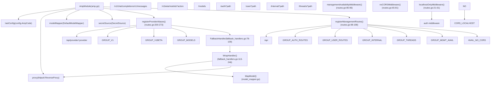
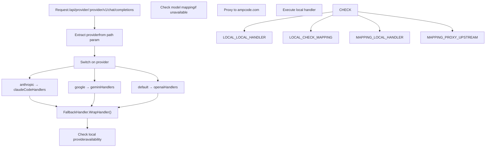
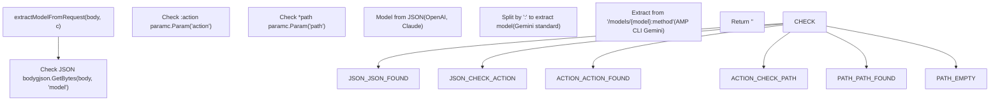
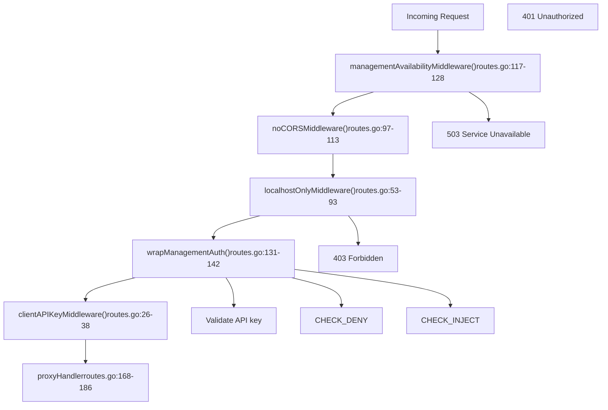
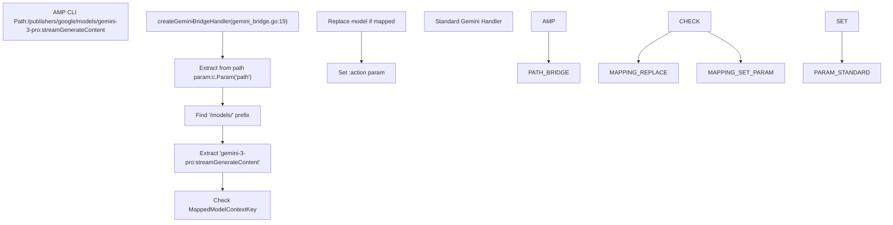

# Amp CLI Integration

Relevant source files

-   [internal/api/modules/amp/amp.go](https://github.com/router-for-me/CLIProxyAPI/blob/c66cb0af/internal/api/modules/amp/amp.go)
-   [internal/api/modules/amp/amp\_test.go](https://github.com/router-for-me/CLIProxyAPI/blob/c66cb0af/internal/api/modules/amp/amp_test.go)
-   [internal/api/modules/amp/fallback\_handlers.go](https://github.com/router-for-me/CLIProxyAPI/blob/c66cb0af/internal/api/modules/amp/fallback_handlers.go)
-   [internal/api/modules/amp/fallback\_handlers\_test.go](https://github.com/router-for-me/CLIProxyAPI/blob/c66cb0af/internal/api/modules/amp/fallback_handlers_test.go)
-   [internal/api/modules/amp/gemini\_bridge.go](https://github.com/router-for-me/CLIProxyAPI/blob/c66cb0af/internal/api/modules/amp/gemini_bridge.go)
-   [internal/api/modules/amp/gemini\_bridge\_test.go](https://github.com/router-for-me/CLIProxyAPI/blob/c66cb0af/internal/api/modules/amp/gemini_bridge_test.go)
-   [internal/api/modules/amp/model\_mapping.go](https://github.com/router-for-me/CLIProxyAPI/blob/c66cb0af/internal/api/modules/amp/model_mapping.go)
-   [internal/api/modules/amp/model\_mapping\_test.go](https://github.com/router-for-me/CLIProxyAPI/blob/c66cb0af/internal/api/modules/amp/model_mapping_test.go)
-   [internal/api/modules/amp/proxy.go](https://github.com/router-for-me/CLIProxyAPI/blob/c66cb0af/internal/api/modules/amp/proxy.go)
-   [internal/api/modules/amp/proxy\_test.go](https://github.com/router-for-me/CLIProxyAPI/blob/c66cb0af/internal/api/modules/amp/proxy_test.go)
-   [internal/api/modules/amp/response\_rewriter.go](https://github.com/router-for-me/CLIProxyAPI/blob/c66cb0af/internal/api/modules/amp/response_rewriter.go)
-   [internal/api/modules/amp/response\_rewriter\_test.go](https://github.com/router-for-me/CLIProxyAPI/blob/c66cb0af/internal/api/modules/amp/response_rewriter_test.go)
-   [internal/api/modules/amp/routes.go](https://github.com/router-for-me/CLIProxyAPI/blob/c66cb0af/internal/api/modules/amp/routes.go)
-   [internal/api/modules/amp/routes\_test.go](https://github.com/router-for-me/CLIProxyAPI/blob/c66cb0af/internal/api/modules/amp/routes_test.go)
-   [internal/api/modules/amp/secret.go](https://github.com/router-for-me/CLIProxyAPI/blob/c66cb0af/internal/api/modules/amp/secret.go)
-   [internal/api/modules/amp/secret\_test.go](https://github.com/router-for-me/CLIProxyAPI/blob/c66cb0af/internal/api/modules/amp/secret_test.go)

The `AmpModule` provides HTTP routing for Amp CLI integration through three subsystems: provider-specific alias routes (`/api/provider/{provider}/*`), management proxy routes (`/api/auth/*`, `/api/user/*`, etc.), and fallback logic that routes requests to ampcode.com when local providers are unavailable. The module includes model mapping capabilities to redirect unavailable model requests to alternative local models.

For general API endpoint documentation, see [API Reference](/router-for-me/CLIProxyAPI/4-api-reference). For configuration options, see [Configuration File Structure](/router-for-me/CLIProxyAPI/5.1-configuration-file-structure).

---

## Overview

The `AmpModule` implements the `RouteModuleV2` interface and registers three routing subsystems:

1.  **Provider Alias Routes** - Routes matching `/api/provider/{provider}/v1/*` forward to local handlers based on provider name
2.  **Management Routes** - Routes matching `/api/auth/*`, `/api/user/*`, `/api/internal/*`, etc. proxy to ampcode.com for OAuth flows
3.  **Fallback System** - `FallbackHandler` checks local provider availability, applies model mappings if configured, or proxies to ampcode.com

Hot-reload is supported for `upstream-url`, `upstream-api-key`, `upstream-api-keys`, `model-mappings`, `force-model-mappings`, and `restrict-management-to-localhost` configuration changes.

**Sources:** [internal/api/modules/amp/amp.go1-429](https://github.com/router-for-me/CLIProxyAPI/blob/c66cb0af/internal/api/modules/amp/amp.go#L1-L429) [internal/api/modules/amp/routes.go1-335](https://github.com/router-for-me/CLIProxyAPI/blob/c66cb0af/internal/api/modules/amp/routes.go#L1-L335)

---

## Module Architecture


**Sources:** [internal/api/modules/amp/amp.go27-44](https://github.com/router-for-me/CLIProxyAPI/blob/c66cb0af/internal/api/modules/amp/amp.go#L27-L44) [internal/api/modules/amp/routes.go98-273](https://github.com/router-for-me/CLIProxyAPI/blob/c66cb0af/internal/api/modules/amp/routes.go#L98-L273)

---

## Provider Alias Routes

Provider alias routes allow the Amp CLI to specify the target provider explicitly in the URL path. This enables provider-specific routing without requiring model name inspection.

### Route Structure

All routes are registered in `registerProviderAliases()` and wrapped with `FallbackHandler.WrapHandler()`.

| Route Pattern | Supported Providers | Handler |
| --- | --- | --- |
| `/api/provider/:provider/models` | `openai`, `anthropic`, `google`, `groq`, `cerebras` | `ampModelsHandler` |
| `/api/provider/:provider/chat/completions` | OpenAI-compatible | `openaiHandlers.ChatCompletions` |
| `/api/provider/:provider/v1/chat/completions` | OpenAI-compatible | `openaiHandlers.ChatCompletions` |
| `/api/provider/:provider/v1/messages` | `anthropic` | `claudeCodeHandlers.ClaudeMessages` |
| `/api/provider/:provider/v1/messages/count_tokens` | `anthropic` | `claudeCodeHandlers.ClaudeCountTokens` |
| `/api/provider/:provider/v1beta/models/*action` | `google` | `geminiHandlers.GeminiHandler` |
| `/api/provider/:provider/completions` | OpenAI-compatible | `openaiHandlers.Completions` |
| `/api/provider/:provider/responses` | OpenAI-compatible | `openaiResponsesHandlers.Responses` |

### Handler Selection


**Sources:** [internal/api/modules/amp/routes.go265-334](https://github.com/router-for-me/CLIProxyAPI/blob/c66cb0af/internal/api/modules/amp/routes.go#L265-L334) [internal/api/modules/amp/fallback\_handlers.go113-272](https://github.com/router-for-me/CLIProxyAPI/blob/c66cb0af/internal/api/modules/amp/fallback_handlers.go#L113-L272)

---

## Fallback Handler System

The `FallbackHandler` wraps request handlers to implement routing decisions based on provider availability and model mapping configuration. When a model's provider is unavailable locally, the handler either applies a configured model mapping to an available alternative, or forwards the request to ampcode.com. Response rewriting restores original model names when mappings are applied.

### Routing Decision Flow

> **[Mermaid sequence]**
> *(图表结构无法解析)*

### Route Type Logging

The system logs routing decisions with structured fields for observability:

| Route Type | Meaning | Cost | Log Level |
| --- | --- | --- | --- |
| `RouteTypeLocalProvider` | Request handled by local OAuth provider | Free | Debug |
| `RouteTypeModelMapping` | Request mapped to alternative local model | Free | Debug |
| `RouteTypeAmpCredits` | Request forwarded to ampcode.com | Uses Amp credits | Warn |
| `RouteTypeNoProvider` | No provider or fallback available | None | Warn |

**Sources:** [internal/api/modules/amp/fallback\_handlers.go18-76](https://github.com/router-for-me/CLIProxyAPI/blob/c66cb0af/internal/api/modules/amp/fallback_handlers.go#L18-L76) [internal/api/modules/amp/fallback\_handlers.go113-272](https://github.com/router-for-me/CLIProxyAPI/blob/c66cb0af/internal/api/modules/amp/fallback_handlers.go#L113-L272)

### Response Rewriting

When model mapping is applied, the `ResponseRewriter` transparently restores the original model name in responses to ensure client compatibility. It handles both streaming and non-streaming responses.

```mermaid
flowchart TD
    REWRITER["ResponseRewriter"]
    WRITE["Write(data)"]
    DETECT["Detect content type"]
    STREAM_CHECK["Is streaming?"]
    BUFFER["Buffer to body"]
    CHUNK_REWRITE["rewriteStreamChunk(data)"]
    FULL_REWRITE["rewriteModelInResponse(body)"]
    FLUSH["Flush()"]
    WRITE_UPSTREAM["Write to ResponseWriter"]
    FIELDS["modelFieldPaths:model, modelVersion,response.modelVersion,message.model"]
    REWRITE["sjson.SetBytes(data, path, originalModel)"]
    TOOL_CHECK["Check for tool_use block"]
    THINKING_CHECK["Filter thinking blocks"]
    SUPPRESS["content.#(type!='thinking')#"]

    REWRITER --> WRITE
    WRITE --> DETECT
    DETECT --> STREAM_CHECK
    STREAM --> CHECK_CHUNK_REWRITE
    STREAM --> CHECK_BUFFER
    CHUNK --> REWRITE_WRITE_UPSTREAM
    BUFFER --> FLUSH
    FLUSH --> FULL_REWRITE
    FULL --> REWRITE_WRITE_UPSTREAM
    FIELDS --> REWRITE
    TOOL --> CHECK_THINKING_CHECK
    THINKING --> CHECK_SUPPRESS
    FULL --> REWRITE_FIELDS
    FULL --> REWRITE_TOOL_CHECK
```


**Amp Compatibility Filter:** `rewriteModelInResponse()` checks for the presence of `content.#(type=="tool_use")` blocks. If found, it filters the `content` array to `content.#(type!="thinking")#` to remove thinking blocks, as the Amp client does not render tool calls correctly when both block types are present.

**Sources:** [internal/api/modules/amp/response\_rewriter.go14-128](https://github.com/router-for-me/CLIProxyAPI/blob/c66cb0af/internal/api/modules/amp/response_rewriter.go#L14-L128)

### Anthropic-Beta Header Filtering

`filterAntropicBetaHeader()` calls `filterBetaFeatures()` to remove subscription-only features from the `Anthropic-Beta` request header. Currently filters `context-1m-2025-08-07`. Applied only for local provider routes, not when proxying to ampcode.com.

**Sources:** [internal/api/modules/amp/fallback\_handlers.go276-284](https://github.com/router-for-me/CLIProxyAPI/blob/c66cb0af/internal/api/modules/amp/fallback_handlers.go#L276-L284) [internal/api/modules/amp/filter\_anthropic\_beta.go10-37](https://github.com/router-for-me/CLIProxyAPI/blob/c66cb0af/internal/api/modules/amp/filter_anthropic_beta.go#L10-L37)

---

## Model Mapping

Model mapping enables routing of unavailable models to alternative models that are locally available. This is particularly useful for Amp CLI users who want to use their local OAuth providers instead of Amp credits.

### Configuration Modes

The module supports two model mapping modes controlled by `ampcode.force-model-mappings`:

| Mode | Behavior | Use Case |
| --- | --- | --- |
| `false` (default) | Check local provider first, then apply mapping as fallback | Prefer local exact match |
| `true` | Check mapping first, then fall back to local provider | Prefer mapped model over original |

### Model Extraction

The `extractModelFromRequest()` function handles multiple request formats:


**Sources:** [internal/api/modules/amp/fallback\_handlers.go300-332](https://github.com/router-for-me/CLIProxyAPI/blob/c66cb0af/internal/api/modules/amp/fallback_handlers.go#L300-L332)

---

## Management Routes

Management routes proxy requests to the Amp control plane for OAuth flows, user management, and telemetry. These routes are secured with multiple layers of middleware.

### Security Middleware Stack

Middleware Stack Order for Management Routes:


### Localhost Restriction

`localhostOnlyMiddleware()` checks `m.IsRestrictedToLocalhost()` (hot-reloadable) and enforces the following when enabled:

-   Extracts IP from `c.Request.RemoteAddr` using `net.SplitHostPort()`
-   Parses IP with `net.ParseIP()` and validates using `IP.IsLoopback()`
-   Returns `403 Forbidden` for non-loopback IPs (IPv4 and IPv6)
-   Cannot be bypassed via `X-Forwarded-For` or other client headers

### Management Route Patterns

| Pattern | Purpose | Auth Required | Example Usage |
| --- | --- | --- | --- |
| `/api/auth/*path` | OAuth flows | Bypassed | `/api/auth/cli-login` |
| `/api/user/*path` | User account operations | Yes | `/api/user/profile` |
| `/api/internal/*path` | Internal operations | Yes | `/api/internal/health` |
| `/api/threads/*path` | Thread management | Bypassed | `/api/threads/123` |
| `/api/meta` | Metadata endpoints | Yes | `/api/meta` |
| `/api/telemetry/*path` | Telemetry data | Yes | `/api/telemetry/events` |
| `/api/otel/*path` | OpenTelemetry | Yes | `/api/otel/trace` |
| `/api/tab/*path` | Tab management | Yes | `/api/tab/active` |
| `/threads` | Root-level threads | Bypassed | `/threads` |
| `/auth/*path` | Root-level auth | Bypassed | `/auth/callback` |
| `/docs/*path` | Documentation | Bypassed | `/docs` |
| `/settings/*path` | Settings | Bypassed | `/settings` |

**Auth Bypass:** `wrapManagementAuth()` at [internal/api/modules/amp/routes.go131-142](https://github.com/router-for-me/CLIProxyAPI/blob/c66cb0af/internal/api/modules/amp/routes.go#L131-L142) bypasses authentication for paths matching `/threads`, `/auth`, `/docs`, or `/settings` prefixes. All other management routes require valid API key authentication.

**Sources:** [internal/api/modules/amp/routes.go53-93](https://github.com/router-for-me/CLIProxyAPI/blob/c66cb0af/internal/api/modules/amp/routes.go#L53-L93) [internal/api/modules/amp/routes.go117-128](https://github.com/router-for-me/CLIProxyAPI/blob/c66cb0af/internal/api/modules/amp/routes.go#L117-L128) [internal/api/modules/amp/routes.go144-257](https://github.com/router-for-me/CLIProxyAPI/blob/c66cb0af/internal/api/modules/amp/routes.go#L144-L257)

---

## Gemini Bridge

The Gemini bridge handles the Amp CLI's non-standard Gemini API path format by rewriting requests to match the standard Gemini handler's expected format.

### Path Transformation


The bridge supports model mapping integration:

1.  Checks for `MappedModelContextKey` in Gin context (set by `FallbackHandler`)
2.  If found, replaces the model name while preserving the method (`:streamGenerateContent`, `:generateContent`, etc.)
3.  Sets the modified value as the `:action` parameter for the standard handler

**Sources:** [internal/api/modules/amp/gemini\_bridge.go9-60](https://github.com/router-for-me/CLIProxyAPI/blob/c66cb0af/internal/api/modules/amp/gemini_bridge.go#L9-L60)

---

## Upstream Proxy Configuration

The upstream proxy forwards requests to ampcode.com when local providers are unavailable. It includes automatic gzip decompression and API key injection.

### Proxy Creation

```mermaid
flowchart TD
    CREATE["createReverseProxy(upstreamURL, secretSource)"]
    PARSE["url.Parse(upstreamURL)"]
    NEW_PROXY["httputil.NewSingleHostReverseProxy(parsed)"]
    DIRECTOR["Configure Director(modify outgoing requests)"]
    MODIFY_RESP["Configure ModifyResponse(handle gzip)"]
    ERROR_HANDLER["Configure ErrorHandler"]
    DEL_AUTH["Delete client Authorization header"]
    INJECT_KEY["secretSource.Get(ctx)"]
    SET_AUTH["Set X-Api-Key, Authorization headers"]
    SET_HOST["Set req.Host = parsed.Host"]
    CHECK_STATUS["Skip if status < 200 or >= 300"]
    CHECK_CE["Skip if Content-Encoding set"]
    CHECK_STREAM["Skip if SSE (text/event-stream)"]
    PEEK["Peek first 2 bytes"]
    CHECK_GZIP["Check for 0x1f 0x8b magic bytes"]
    DECOMPRESS["Decompress with gzip.Reader"]
    UPDATE_BODY["Replace resp.Body"]
    UPDATE_HEADERS["Update Content-Length, remove Content-Encoding"]

    CREATE --> PARSE
    PARSE --> NEW_PROXY
    NEW --> PROXY_DIRECTOR
    DIRECTOR --> DEL_AUTH
    DEL --> AUTH_INJECT_KEY
    INJECT --> KEY_SET_AUTH
    SET --> AUTH_SET_HOST
    NEW --> PROXY_MODIFY_RESP
    MODIFY --> RESP_CHECK_STATUS
    CHECK --> STATUS_CHECK_CE
    CHECK --> CE_CHECK_STREAM
    CHECK --> STREAM_PEEK
    PEEK --> CHECK_GZIP
    CHECK --> GZIP_DECOMPRESS
    DECOMPRESS --> UPDATE_BODY
    UPDATE --> BODY_UPDATE_HEADERS
```


### Gzip Handling

`ModifyResponse` function at [internal/api/modules/amp/proxy.go84-148](https://github.com/router-for-me/CLIProxyAPI/blob/c66cb0af/internal/api/modules/amp/proxy.go#L84-L148) handles misconfigured upstreams:

1.  Skips if `resp.Header.Get("Content-Encoding")` is non-empty
2.  Skips if `Content-Type` contains `text/event-stream`
3.  Skips if status code < 200 or >= 300
4.  Uses `peekableReadCloser` to check first 2 bytes for gzip magic (`0x1f`, `0x8b`)
5.  If gzip detected, wraps body with `gzip.NewReader()`, decompresses, updates `Content-Length`, removes `Content-Encoding`

### Error Recovery

`proxyHandler` at [internal/api/modules/amp/routes.go168-186](https://github.com/router-for-me/CLIProxyAPI/blob/c66cb0af/internal/api/modules/amp/routes.go#L168-L186) includes deferred panic recovery:

```
defer func() {    if rec := recover(); rec != nil {        if err, ok := rec.(error); ok && errors.Is(err, http.ErrAbortHandler) {            return // Silent recovery - expected when client disconnects        }        panic(rec) // Re-panic for other errors    }}()
```
This silences `http.ErrAbortHandler` panics that occur when `httputil.ReverseProxy.copyResponse()` writes a status before the client/stream ends.

**Sources:** [internal/api/modules/amp/proxy.go28-163](https://github.com/router-for-me/CLIProxyAPI/blob/c66cb0af/internal/api/modules/amp/proxy.go#L28-L163) [internal/api/modules/amp/routes.go168-186](https://github.com/router-for-me/CLIProxyAPI/blob/c66cb0af/internal/api/modules/amp/routes.go#L168-L186)

---

## Secret Management

The Amp module supports multiple API key sources with precedence-based lookup, caching, and per-client upstream routing for multi-tenancy scenarios.

### Architecture

The secret management system consists of two layers:

1.  **`MultiSourceSecret`** - Handles default API key resolution from config, environment, or file
2.  **`MappedSecretSource`** - Wraps `MultiSourceSecret` to provide per-client upstream routing

```mermaid
flowchart TD
    REQUEST["Request with client API key"]
    MIDDLEWARE["clientAPIKeyMiddleware(routes.go:24-38)"]
    INJECT["Inject client key intorequest context"]
    PROXY_DIRECTOR["Proxy Director Function"]
    GET_SECRET["MappedSecretSource.Get(ctx)"]
    EXTRACT_CLIENT["getClientAPIKeyFromContext(ctx)"]
    CHECK_MAPPING["Check upstream-api-keysfor client key match"]
    FALLBACK["MultiSourceSecret.Get(ctx)"]
    CHECK_EXPLICIT["Check explicitKey(config upstream-api-key)"]
    CHECK_ENV["Check AMP_API_KEY env"]
    CHECK_CACHE["Check file cache"]
    READ_FILE["Read ~/.local/share/amp/secrets.json"]
    RETURN["Return upstream API key"]

    REQUEST --> MIDDLEWARE
    MIDDLEWARE --> INJECT
    INJECT --> PROXY_DIRECTOR
    PROXY --> DIRECTOR_GET_SECRET
    GET --> SECRET_EXTRACT_CLIENT
    EXTRACT --> CLIENT_CHECK_MAPPING
    CHECK --> MAPPING_RETURN
    CHECK --> MAPPING_FALLBACK
    FALLBACK --> CHECK_EXPLICIT
    CHECK --> EXPLICIT_RETURN
    CHECK --> EXPLICIT_CHECK_ENV
    CHECK --> ENV_RETURN
    CHECK --> ENV_CHECK_CACHE
    CHECK --> CACHE_RETURN
    CHECK --> CACHE_READ_FILE
    READ --> FILE_RETURN
```


### Per-Client Upstream Routing

The `MappedSecretSource` enables multi-tenant deployments where different clients use different Amp upstream accounts:

| Component | File | Purpose |
| --- | --- | --- |
| `clientAPIKeyMiddleware` | [internal/api/modules/amp/routes.go24-38](https://github.com/router-for-me/CLIProxyAPI/blob/c66cb0af/internal/api/modules/amp/routes.go#L24-L38) | Extracts client API key from `gin.Context["apiKey"]` and injects into request context |
| `getClientAPIKeyFromContext` | [internal/api/modules/amp/routes.go42-49](https://github.com/router-for-me/CLIProxyAPI/blob/c66cb0af/internal/api/modules/amp/routes.go#L42-L49) | Retrieves client key from request context for lookup |
| `MappedSecretSource` | [internal/api/modules/amp/secret.go169-265](https://github.com/router-for-me/CLIProxyAPI/blob/c66cb0af/internal/api/modules/amp/secret.go#L169-L265) | Maps client keys to upstream keys using `upstream-api-keys` config |

### Default Secret Source Precedence

When no client-specific mapping exists, `MultiSourceSecret` resolves the default key:

| Level | Source | Cached | Hot-Reloadable |
| --- | --- | --- | --- |
| 1 (Highest) | `config.yaml`: `ampcode.upstream-api-key` | No | Yes |
| 2 | Environment: `AMP_API_KEY` | No | No |
| 3 (Lowest) | File: `~/.local/share/amp/secrets.json` | Yes (5 min TTL) | No |

### File Format

The secrets file at `~/.local/share/amp/secrets.json` should contain:

```
{  "apiKey@https://ampcode.com/": "sk-amp-..."}
```
**Sources:** [internal/api/modules/amp/secret.go14-265](https://github.com/router-for-me/CLIProxyAPI/blob/c66cb0af/internal/api/modules/amp/secret.go#L14-L265) [internal/api/modules/amp/routes.go22-49](https://github.com/router-for-me/CLIProxyAPI/blob/c66cb0af/internal/api/modules/amp/routes.go#L22-L49)

---

## Hot Reload Support

The Amp module supports hot-reload for multiple configuration settings without requiring service restart.

### Reloadable Configuration

```mermaid
flowchart TD
    ON_CONFIG["OnConfigUpdated(cfg)"]
    COMPARE["Compare with lastConfig"]
    LOCALHOST["RestrictManagementToLocalhost"]
    UPSTREAM_URL["UpstreamURL"]
    UPSTREAM_KEY["UpstreamAPIKey"]
    UPSTREAM_KEYS["UpstreamAPIKeys"]
    MODEL_MAP["ModelMappings"]
    FORCE_MAP["ForceModelMappings"]
    SET_RESTRICT["setRestrictToLocalhost()"]
    ENABLE_PROXY["enableUpstreamProxy()"]
    CREATE_PROXY["createReverseProxy()"]
    UPDATE_SECRET["secretSource.UpdateExplicitKey()"]
    UPDATE_MAPPINGS["secretSource.UpdateMappings()"]
    UPDATE_MAPPER["modelMapper.UpdateMappings()"]
    DISABLE["setProxy(nil)"]

    ON --> CONFIG_COMPARE
    COMPARE --> LOCALHOST
    COMPARE --> UPSTREAM_URL
    COMPARE --> UPSTREAM_KEY
    COMPARE --> UPSTREAM_KEYS
    COMPARE --> MODEL_MAP
    LOCALHOST --> SET_RESTRICT
    UPSTREAM --> URL_ENABLE_PROXY
    UPSTREAM --> URL_CREATE_PROXY
    UPSTREAM --> URL_DISABLE
    UPSTREAM --> KEY_UPDATE_SECRET
    UPSTREAM --> KEYS_UPDATE_MAPPINGS
    MODEL --> MAP_UPDATE_MAPPER
```


### Implementation Details

| Setting | Change Detection | Update Action | Thread-Safe |
| --- | --- | --- | --- |
| `upstream-url` | String comparison | Recreate proxy with `proxyMu` lock | Yes |
| `upstream-api-key` | String comparison | `UpdateDefaultExplicitKey()`, invalidate cache | Yes |
| `upstream-api-keys` | Deep comparison | `UpdateMappings()` on `MappedSecretSource` | Yes |
| `model-mappings` | Deep comparison | `modelMapper.UpdateMappings()` | Yes |
| `restrict-management-to-localhost` | Bool comparison | `setRestrictToLocalhost()` with `restrictMu` | Yes |
| `force-model-mappings` | Read via `forceModelMappings()` | N/A (read-only flag) | Yes |

**Sources:** [internal/api/modules/amp/amp.go181-259](https://github.com/router-for-me/CLIProxyAPI/blob/c66cb0af/internal/api/modules/amp/amp.go#L181-L259) [internal/api/modules/amp/amp.go294-395](https://github.com/router-for-me/CLIProxyAPI/blob/c66cb0af/internal/api/modules/amp/amp.go#L294-L395)

---

## Request Flow Examples

### Example 1: Local Provider Available

```
1. Request: POST /api/provider/openai/v1/chat/completions
   Body: {"model": "gpt-4", "messages": [...]}

2. FallbackHandler.WrapHandler()
   - Extract model: "gpt-4"
   - Normalize: "gpt-4" (no thinking suffix)
   - Check forceModelMappings(): false
   - GetProviderName("gpt-4"): ["openai"]
   - providers.length > 0 → LOCAL_PROVIDER

3. Execute openaiHandlers.ChatCompletions(c)
   - Uses local OAuth credentials
   - Returns response (FREE)

4. Log: "amp using local provider for model: gpt-4"
```
### Example 2: Model Mapping Applied

```
1. Request: POST /api/provider/anthropic/v1/messages
   Body: {"model": "claude-sonnet-4-20250514", "messages": [...]}

2. FallbackHandler.WrapHandler()
   - Extract model: "claude-sonnet-4-20250514"
   - Normalize: "claude-sonnet-4-20250514"
   - Check forceModelMappings(): false
   - GetProviderName("claude-sonnet-4-20250514"): []
   - No local provider available
   - modelMapper.MapModel("claude-sonnet-4-20250514"): "claude-3-5-sonnet-20241022"
   - GetProviderName("claude-3-5-sonnet-20241022"): ["anthropic"]
   - Rewrite request body: {"model": "claude-3-5-sonnet-20241022", ...}
   - providers.length > 0 → MODEL_MAPPING

3. Execute claudeCodeHandlers.ClaudeMessages(c)
   - Uses local Claude OAuth credentials
   - Returns response (FREE)

4. Log: "amp model mapping: request claude-sonnet-4-20250514 -> claude-3-5-sonnet-20241022"
```
### Example 3: Fallback to ampcode.com

```
1. Request: POST /api/provider/google/v1beta/models/gemini-exp-1206:generateContent

2. FallbackHandler.WrapHandler()
   - Extract model: "gemini-exp-1206"
   - Normalize: "gemini-exp-1206"
   - Check forceModelMappings(): false
   - GetProviderName("gemini-exp-1206"): []
   - modelMapper.MapModel("gemini-exp-1206"): ""
   - No mapping configured
   - proxy != nil → AMP_CREDITS

3. proxy.ServeHTTP(c.Writer, c.Request)
   - Forward to ampcode.com
   - Inject upstream-api-key
   - Returns response (USES AMP CREDITS)

4. Log: "forwarding to ampcode.com (uses amp credits) - model_id: gemini-exp-1206 |
         To use local provider, add to config:
         ampcode.model-mappings: [{from: "gemini-exp-1206", to: "<your-local-model>"}]"
```
**Sources:** [internal/api/modules/amp/fallback\_handlers.go113-272](https://github.com/router-for-me/CLIProxyAPI/blob/c66cb0af/internal/api/modules/amp/fallback_handlers.go#L113-L272)

---

## Configuration Reference

### YAML Configuration

```
ampcode:  # Upstream proxy URL (optional)  upstream-url: "https://ampcode.com"    # Default upstream API key (optional, see precedence table)  upstream-api-key: "sk-amp-..."    # Per-client upstream API key mappings (optional)  # Maps client API keys (from top-level api-keys) to different upstream keys  # Enables multi-tenant deployments with separate Amp accounts per client  upstream-api-keys:    - upstream-api-key: "sk-amp-team-a-..."      api-keys:        - "client-key-1"        - "client-key-2"    - upstream-api-key: "sk-amp-team-b-..."      api-keys:        - "client-key-3"    # Restrict management routes to localhost only (default: false)  restrict-management-to-localhost: false    # Model mappings for routing unavailable models (optional)  model-mappings:    - from: "gemini-exp-1206"      to: "gemini-2.0-flash-exp"    - from: "claude-sonnet-4-20250514"      to: "claude-3-5-sonnet-20241022"    # Force model mappings to take precedence over local API keys (default: false)  force-model-mappings: false
```
### Hot-Reload Behavior

All configuration changes apply immediately without restart:

-   Changing `upstream-url` recreates the reverse proxy
-   Changing `upstream-api-key` invalidates the secret cache
-   Changing `upstream-api-keys` updates the per-client routing mappings
-   Changing `model-mappings` updates the mapper's routing rules
-   Changing `restrict-management-to-localhost` updates middleware behavior

**Sources:** [internal/api/modules/amp/amp.go181-259](https://github.com/router-for-me/CLIProxyAPI/blob/c66cb0af/internal/api/modules/amp/amp.go#L181-L259)

---

## Error Handling

The Amp module provides graceful error handling with specific behaviors for different failure scenarios.

### Proxy Errors

When the upstream proxy encounters errors, the `ErrorHandler` returns:

```
{  "error": "amp_upstream_proxy_error",  "message": "Failed to reach Amp upstream"}
```
Status Code: `502 Bad Gateway`

### Unavailable Management Routes

When management routes are accessed but the upstream proxy is disabled:

```
{  "error": "amp upstream proxy not available"}
```
Status Code: `503 Service Unavailable`

### Localhost Restriction Violations

When non-localhost clients attempt to access management routes:

```
{  "error": "Access denied: management routes restricted to localhost"}
```
Status Code: `403 Forbidden`

**Sources:** [internal/api/modules/amp/proxy.go155-160](https://github.com/router-for-me/CLIProxyAPI/blob/c66cb0af/internal/api/modules/amp/proxy.go#L155-L160) [internal/api/modules/amp/routes.go85-96](https://github.com/router-for-me/CLIProxyAPI/blob/c66cb0af/internal/api/modules/amp/routes.go#L85-L96) [internal/api/modules/amp/routes.go44-58](https://github.com/router-for-me/CLIProxyAPI/blob/c66cb0af/internal/api/modules/amp/routes.go#L44-L58)
