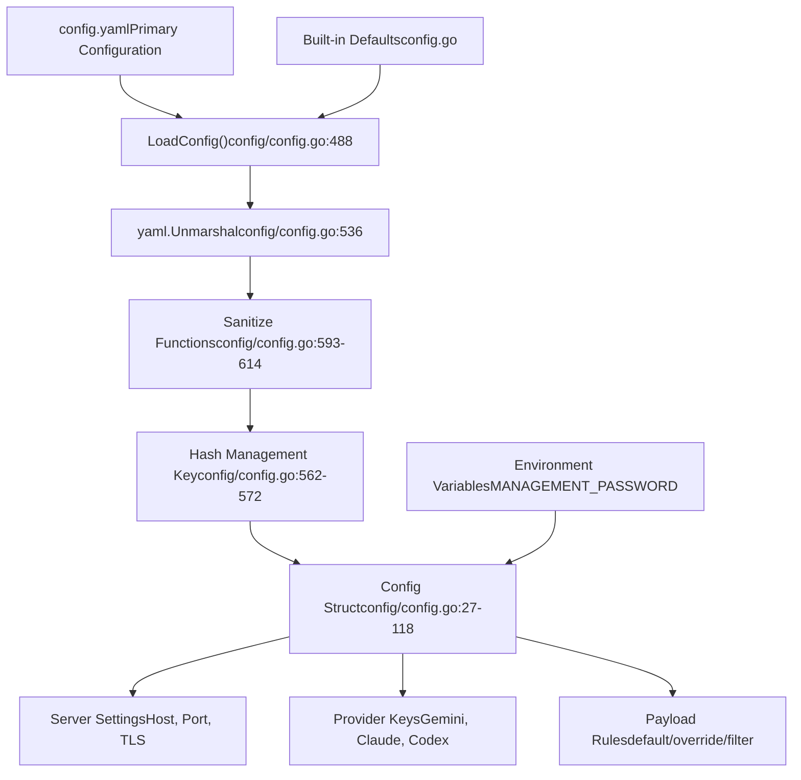
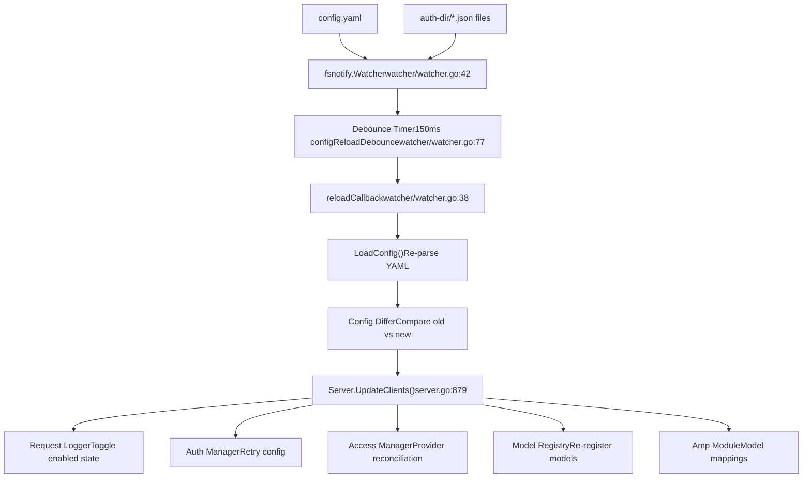
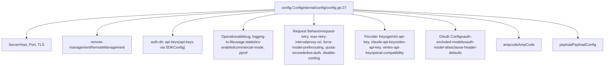

# Configuration Guide

Relevant source files

-   [config.example.yaml](https://github.com/router-for-me/CLIProxyAPI/blob/c66cb0af/config.example.yaml)
-   [internal/api/handlers/management/config\_basic.go](https://github.com/router-for-me/CLIProxyAPI/blob/c66cb0af/internal/api/handlers/management/config_basic.go)
-   [internal/api/handlers/management/config\_lists.go](https://github.com/router-for-me/CLIProxyAPI/blob/c66cb0af/internal/api/handlers/management/config_lists.go)
-   [internal/api/server.go](https://github.com/router-for-me/CLIProxyAPI/blob/c66cb0af/internal/api/server.go)
-   [internal/config/config.go](https://github.com/router-for-me/CLIProxyAPI/blob/c66cb0af/internal/config/config.go)
-   [internal/watcher/watcher.go](https://github.com/router-for-me/CLIProxyAPI/blob/c66cb0af/internal/watcher/watcher.go)
-   [sdk/cliproxy/service.go](https://github.com/router-for-me/CLIProxyAPI/blob/c66cb0af/sdk/cliproxy/service.go)
-   [test/amp\_management\_test.go](https://github.com/router-for-me/CLIProxyAPI/blob/c66cb0af/test/amp_management_test.go)

This guide covers all configuration options available in CLIProxyAPI and explains how configuration is loaded, validated, updated, and persisted. It describes the configuration file structure, hot reload mechanisms, storage backends, and environment variable overrides.

For detailed information on specific topics:

-   **Configuration file structure and all available fields**: See [Configuration File Structure](/router-for-me/CLIProxyAPI/5.1-configuration-file-structure)
-   **Storage backend options (PostgreSQL, Git, Object Store, File)**: See [Storage Backend Options](/router-for-me/CLIProxyAPI/5.2-storage-backend-options)
-   **Environment variables and command-line flags**: See [Environment Variables and Overrides](/router-for-me/CLIProxyAPI/5.3-environment-variables-and-overrides)
-   **Payload manipulation rules per model**: See [Payload Configuration Rules](/router-for-me/CLIProxyAPI/5.4-payload-configuration-rules)

---

## Configuration Overview

CLIProxyAPI uses a YAML-based configuration file (`config.yaml`) as the primary configuration source. The configuration system supports hot reloading, multiple storage backends, and runtime updates through the Management API.

### Configuration Sources and Precedence

Configuration values are loaded from multiple sources with the following precedence order (highest to lowest):

1.  **Management API runtime updates** - Changes made through `/v0/management` endpoints
2.  **Environment variables** - `MANAGEMENT_PASSWORD` overrides `remote-management.secret-key`
3.  **Configuration file** - `config.yaml` loaded at startup or via hot reload
4.  **Default values** - Built-in defaults defined in code


**Sources:** [internal/config/config.go488-633](https://github.com/router-for-me/CLIProxyAPI/blob/c66cb0af/internal/config/config.go#L488-L633)

### Configuration File Location

The configuration file path is specified when starting the service:

```
// Service initialization with config pathcfg, err := config.LoadConfig("./config.yaml")
```
The path can be:

-   **Absolute path**: `/etc/cliproxy/config.yaml`
-   **Relative path**: `./config.yaml` (resolved from working directory)
-   **Home directory**: `~/config.yaml` (tilde expansion supported in `auth-dir`)

**Sources:** [sdk/cliproxy/service.go432-617](https://github.com/router-for-me/CLIProxyAPI/blob/c66cb0af/sdk/cliproxy/service.go#L432-L617) [internal/config/config.go488-633](https://github.com/router-for-me/CLIProxyAPI/blob/c66cb0af/internal/config/config.go#L488-L633)

---

## Configuration Loading and Validation

### Loading Process

Configuration loading follows these steps:

> **[Mermaid sequence]**
> *(图表结构无法解析)*

**Sources:** [internal/config/config.go508-653](https://github.com/router-for-me/CLIProxyAPI/blob/c66cb0af/internal/config/config.go#L508-L653) [sdk/cliproxy/service.go457-641](https://github.com/router-for-me/CLIProxyAPI/blob/c66cb0af/sdk/cliproxy/service.go#L457-L641)

### Validation and Sanitization

The configuration loader applies multiple sanitization functions to ensure validity:

| Function | Called At | Purpose |
| --- | --- | --- |
| `SanitizeGeminiKeys()` | [config/config.go613](https://github.com/router-for-me/CLIProxyAPI/blob/c66cb0af/config/config.go#L613-L613) | Validates API keys, drops entries without keys |
| `SanitizeVertexCompatKeys()` | [config/config.go616](https://github.com/router-for-me/CLIProxyAPI/blob/c66cb0af/config/config.go#L616-L616) | Validates base URLs required for Vertex-compat |
| `SanitizeCodexKeys()` | [config/config.go619](https://github.com/router-for-me/CLIProxyAPI/blob/c66cb0af/config/config.go#L619-L619) | Validates base URLs, drops invalid entries |
| `SanitizeClaudeKeys()` | [config/config.go622](https://github.com/router-for-me/CLIProxyAPI/blob/c66cb0af/config/config.go#L622-L622) | Validates headers, normalizes entries |
| `SanitizeOpenAICompatibility()` | [config/config.go625](https://github.com/router-for-me/CLIProxyAPI/blob/c66cb0af/config/config.go#L625-L625) | Drops providers without `base-url` |
| `NormalizeOAuthExcludedModels()` | [config/config.go628](https://github.com/router-for-me/CLIProxyAPI/blob/c66cb0af/config/config.go#L628-L628) | Normalizes provider model exclusion map |
| `SanitizeOAuthModelAlias()` | [config/config.go631](https://github.com/router-for-me/CLIProxyAPI/blob/c66cb0af/config/config.go#L631-L631) | Normalizes and deduplicates aliases |
| `SanitizePayloadRules()` | [config/config.go634](https://github.com/router-for-me/CLIProxyAPI/blob/c66cb0af/config/config.go#L634-L634) | Validates JSON in raw payload rules |

**Sources:** [internal/config/config.go613-634](https://github.com/router-for-me/CLIProxyAPI/blob/c66cb0af/internal/config/config.go#L613-L634) [internal/config/config.go656-677](https://github.com/router-for-me/CLIProxyAPI/blob/c66cb0af/internal/config/config.go#L656-L677)

### Secret Hashing

Plaintext management secrets are automatically hashed using bcrypt on first load. A value is considered already hashed if it starts with `$2a$`, `$2b$`, or `$2y$`. If a plaintext value is detected, it is hashed and immediately persisted back to the config file so it will not be re-hashed on subsequent restarts.

**Sources:** [internal/config/config.go582-592](https://github.com/router-for-me/CLIProxyAPI/blob/c66cb0af/internal/config/config.go#L582-L592)

---

## Hot Reload Mechanism

CLIProxyAPI supports live configuration updates without server restarts through a file watcher and update propagation system.

### File Watching

The file watcher monitors the configuration file and auth directory for changes:


**Sources:** [internal/watcher/watcher.go1-149](https://github.com/router-for-me/CLIProxyAPI/blob/c66cb0af/internal/watcher/watcher.go#L1-L149) [internal/api/server.go865-1002](https://github.com/router-for-me/CLIProxyAPI/blob/c66cb0af/internal/api/server.go#L865-L1002)

### Debouncing Strategy

File system events are debounced to handle atomic writes and rapid successive changes:

```
// Debounce configuration reload to handle atomic writes (editor temp files)const configReloadDebounce = 150 * time.Millisecondconst replaceCheckDelay = 50 * time.Millisecond  // For rename operations
```
This prevents multiple reload triggers from a single save operation and partial file reads during atomic writes (temp file + rename pattern used by most editors).

**Sources:** [internal/watcher/watcher.go73-79](https://github.com/router-for-me/CLIProxyAPI/blob/c66cb0af/internal/watcher/watcher.go#L73-L79)

### Update Propagation

When configuration changes are detected, updates propagate through the system:

| Subsystem | Update Trigger | Configuration Change |
| --- | --- | --- |
| **Request Logger** | `RequestLog` field changes | Toggle logging enabled/disabled |
| **Usage Statistics** | `UsageStatisticsEnabled` changes | Enable/disable usage tracking |
| **Auth Manager** | `RequestRetry`, `MaxRetryInterval` | Update retry configuration |
| **Log Output** | `LoggingToFile`, `LogsMaxTotalSizeMB` | Reconfigure log destinations |
| **Debug Level** | `Debug` field changes | Update logrus log level |
| **Management Routes** | `RemoteManagement.SecretKey` | Enable/disable management endpoints |
| **Access Providers** | `APIKeys`, access config | Reconcile authentication providers |
| **Model Registry** | Provider keys, OAuth aliases | Re-register available models |
| **Amp Module** | `AmpCode` config | Update model mappings, upstream config |

**Sources:** [internal/api/server.go879-1016](https://github.com/router-for-me/CLIProxyAPI/blob/c66cb0af/internal/api/server.go#L879-L1016)

### Configuration Diffing

The server maintains a YAML snapshot (`oldConfigYaml []byte`) of the active config. On each call to `UpdateClients`, the snapshot is unmarshalled into a temporary `oldCfg` struct for field-level comparison. This avoids reference sharing issues caused by the Management API modifying the live `Config` struct in-place.

**Sources:** [internal/api/server.go129-140](https://github.com/router-for-me/CLIProxyAPI/blob/c66cb0af/internal/api/server.go#L129-L140) [internal/api/server.go879-884](https://github.com/router-for-me/CLIProxyAPI/blob/c66cb0af/internal/api/server.go#L879-L884)

---

## Configuration Persistence

Configuration changes can be persisted back to the YAML file while preserving comments and formatting.

### Management API Persistence

The Management API automatically persists changes when endpoints modify configuration. Each modifying handler calls `h.persist(c)` which writes the updated `Config` struct back to the config file while preserving YAML comments.

**Sources:** [internal/api/handlers/management/config\_lists.go34](https://github.com/router-for-me/CLIProxyAPI/blob/c66cb0af/internal/api/handlers/management/config_lists.go#L34-L34) [internal/api/handlers/management/config\_basic.go220](https://github.com/router-for-me/CLIProxyAPI/blob/c66cb0af/internal/api/handlers/management/config_basic.go#L220-L220)

### Comment Preservation

`SaveConfigPreserveComments` (in `internal/config/config.go`) writes the updated config back to disk using the `yaml.v3` node API to merge changed values into the original AST, preserving comments and formatting. For targeted single-field updates (e.g., writing the bcrypt hash of `remote-management.secret-key`), `SaveConfigPreserveCommentsUpdateNestedScalar` is used instead — it updates only the specified nested scalar and leaves everything else untouched.

**Sources:** [internal/config/config.go582-592](https://github.com/router-for-me/CLIProxyAPI/blob/c66cb0af/internal/config/config.go#L582-L592)

---

## Key Configuration Sections

### Server Configuration

Basic HTTP server settings:

| Field | Type | Default | Description |
| --- | --- | --- | --- |
| `host` | `string` | `""` | Bind interface (empty = all interfaces, IPv4 + IPv6) |
| `port` | `int` | Required | HTTP server port |
| `tls.enable` | `bool` | `false` | Enable HTTPS |
| `tls.cert` | `string` | `""` | TLS certificate path |
| `tls.key` | `string` | `""` | TLS private key path |

**Sources:** [internal/config/config.go29-36](https://github.com/router-for-me/CLIProxyAPI/blob/c66cb0af/internal/config/config.go#L29-L36) [internal/config/config.go133-141](https://github.com/router-for-me/CLIProxyAPI/blob/c66cb0af/internal/config/config.go#L133-L141)

### Authentication Configuration

| Field | Description | File Reference |
| --- | --- | --- |
| `auth-dir` | Directory for OAuth token JSON files | [internal/config/config.go41-43](https://github.com/router-for-me/CLIProxyAPI/blob/c66cb0af/internal/config/config.go#L41-L43) |
| `api-keys` | List of API keys for request auth (in `SDKConfig`) | [internal/config/config.go28](https://github.com/router-for-me/CLIProxyAPI/blob/c66cb0af/internal/config/config.go#L28-L28) |
| `gemini-api-key` | Gemini API key configurations (`[]GeminiKey`) | [internal/config/config.go85](https://github.com/router-for-me/CLIProxyAPI/blob/c66cb0af/internal/config/config.go#L85-L85) |
| `claude-api-key` | Claude API key configurations (`[]ClaudeKey`) | [internal/config/config.go91](https://github.com/router-for-me/CLIProxyAPI/blob/c66cb0af/internal/config/config.go#L91-L91) |
| `codex-api-key` | Codex API key configurations (`[]CodexKey`) | [internal/config/config.go88](https://github.com/router-for-me/CLIProxyAPI/blob/c66cb0af/internal/config/config.go#L88-L88) |
| `vertex-api-key` | Vertex-compatible API keys (`[]VertexCompatKey`) | [internal/config/config.go100-103](https://github.com/router-for-me/CLIProxyAPI/blob/c66cb0af/internal/config/config.go#L100-L103) |
| `openai-compatibility` | Generic OpenAI-compatible providers (`[]OpenAICompatibility`) | [internal/config/config.go97-99](https://github.com/router-for-me/CLIProxyAPI/blob/c66cb0af/internal/config/config.go#L97-L99) |

**Sources:** [internal/config/config.go27-122](https://github.com/router-for-me/CLIProxyAPI/blob/c66cb0af/internal/config/config.go#L27-L122)

### Management Configuration

Remote management settings (`RemoteManagement` struct):

```
remote-management:  allow-remote: false              # Allow non-localhost access  secret-key: "your-secret"        # Management password (auto-hashed to bcrypt)  disable-control-panel: false     # Disable bundled UI serving  panel-github-repository: "..."   # Custom panel asset repository
```
The `secret-key` is required to enable management endpoints. If empty (and `MANAGEMENT_PASSWORD` env var is unset), all `/v0/management` routes return 404. The `MANAGEMENT_PASSWORD` environment variable, if set, also enables management routes and takes precedence over an absent config key.

**Sources:** [internal/config/config.go151-162](https://github.com/router-for-me/CLIProxyAPI/blob/c66cb0af/internal/config/config.go#L151-L162) [internal/api/server.go240-244](https://github.com/router-for-me/CLIProxyAPI/blob/c66cb0af/internal/api/server.go#L240-L244) [internal/api/server.go298-305](https://github.com/router-for-me/CLIProxyAPI/blob/c66cb0af/internal/api/server.go#L298-L305)

### Operational Configuration

| Field | Type | Default | Purpose |
| --- | --- | --- | --- |
| `debug` | `bool` | `false` | Enable debug logging |
| `logging-to-file` | `bool` | `false` | Write application logs to rotating files instead of stdout |
| `logs-max-total-size-mb` | `int` | `0` | Max total size of log directory in MB (0 = disabled) |
| `error-logs-max-files` | `int` | `10` | Max error log files to retain (0 = no cleanup) |
| `usage-statistics-enabled` | `bool` | `false` | Enable in-memory usage aggregation |
| `request-log` | `bool` | `false` | Enable per-request HTTP logging |
| `commercial-mode` | `bool` | `false` | Disable high-overhead middleware to reduce memory per request |
| `pprof.enable` | `bool` | `false` | Enable pprof HTTP debug server |
| `pprof.addr` | `string` | `"127.0.0.1:8316"` | pprof server bind address |

**Sources:** [internal/config/config.go44-66](https://github.com/router-for-me/CLIProxyAPI/blob/c66cb0af/internal/config/config.go#L44-L66) [internal/config/config.go143-149](https://github.com/router-for-me/CLIProxyAPI/blob/c66cb0af/internal/config/config.go#L143-L149)

### Request Behavior

| Field | Type | Default | Description |
| --- | --- | --- | --- |
| `request-retry` | `int` | `3` | Retry count on HTTP 403/408/500/502/503/504 responses |
| `max-retry-interval` | `int` | `30` | Max seconds to wait for a cooled-down credential before retry |
| `proxy-url` | `string` | `""` | HTTP/SOCKS5 proxy URL for all upstream requests (in `SDKConfig`) |
| `force-model-prefix` | `bool` | `false` | When true, unprefixed requests only use credentials without a prefix (in `SDKConfig`) |
| `passthrough-headers` | `bool` | `false` | Forward filtered upstream response headers to downstream clients (in `SDKConfig`) |
| `ws-auth` | `bool` | `false` | Require authentication on the WebSocket endpoint `/v1/ws` |
| `disable-cooling` | `bool` | `false` | Disable quota cooldown scheduling for credentials |

**Sources:** [internal/config/config.go70-82](https://github.com/router-for-me/CLIProxyAPI/blob/c66cb0af/internal/config/config.go#L70-L82) [config.example.yaml67-92](https://github.com/router-for-me/CLIProxyAPI/blob/c66cb0af/config.example.yaml#L67-L92)

### Credential Routing

```
routing:  strategy: "round-robin"  # or "fill-first"
```
-   **`round-robin`**: Distribute requests evenly across credentials
-   **`fill-first`**: Use first credential until exhausted, then next

**Sources:** [internal/config/config.go161-166](https://github.com/router-for-me/CLIProxyAPI/blob/c66cb0af/internal/config/config.go#L161-L166)

### Quota Exceeded Behavior

```
quota-exceeded:  switch-project: true           # Auto-switch to different project  switch-preview-model: true     # Fallback to preview models
```
**Sources:** [internal/config/config.go151-159](https://github.com/router-for-me/CLIProxyAPI/blob/c66cb0af/internal/config/config.go#L151-L159)

---

## Configuration Updates via Management API

The Management API provides endpoints to update configuration at runtime:

### Common Update Patterns

```
GET  /v0/management/config                        # Get current full config (JSON)
GET  /v0/management/config.yaml                   # Get raw config.yaml (preserves comments)
PUT  /v0/management/config.yaml                   # Replace full config.yaml

PUT  /v0/management/debug          {"value": true}
PUT  /v0/management/proxy-url      {"value": "socks5://127.0.0.1:1080"}
DELETE /v0/management/proxy-url

PUT  /v0/management/api-keys       ["key1", "key2"]       # Full replacement
PATCH /v0/management/api-keys      {"index": 0, "value": "new-key"}
DELETE /v0/management/api-keys?index=0
DELETE /v0/management/api-keys?value=key-to-remove
```
**Sources:** [internal/api/handlers/management/config\_basic.go26-329](https://github.com/router-for-me/CLIProxyAPI/blob/c66cb0af/internal/api/handlers/management/config_basic.go#L26-L329) [internal/api/handlers/management/config\_lists.go107-119](https://github.com/router-for-me/CLIProxyAPI/blob/c66cb0af/internal/api/handlers/management/config_lists.go#L107-L119)

### Provider Configuration Updates

Provider-specific list endpoints support `GET`, `PUT` (full replace), `PATCH` (update single entry by `index` or matching field), and `DELETE` (by index or key value):

| Endpoint prefix | Struct type |
| --- | --- |
| `/v0/management/gemini-api-key` | `[]GeminiKey` |
| `/v0/management/claude-api-key` | `[]ClaudeKey` |
| `/v0/management/codex-api-key` | `[]CodexKey` |
| `/v0/management/vertex-api-key` | `[]VertexCompatKey` |
| `/v0/management/openai-compatibility` | `[]OpenAICompatibility` |
| `/v0/management/oauth-excluded-models` | `map[string][]string` |
| `/v0/management/oauth-model-alias` | `map[string][]OAuthModelAlias` |

For `PATCH`, supply `{"index": N, "value": {...}}` or `{"match": "api-key-value", "value": {...}}`.

**Sources:** [internal/api/handlers/management/config\_lists.go122-934](https://github.com/router-for-me/CLIProxyAPI/blob/c66cb0af/internal/api/handlers/management/config_lists.go#L122-L934)

### Update Propagation Flow

**Diagram: Management API config update flow**

> **[Mermaid sequence]**
> *(图表结构无法解析)*

**Sources:** [internal/api/handlers/management/config\_basic.go185-186](https://github.com/router-for-me/CLIProxyAPI/blob/c66cb0af/internal/api/handlers/management/config_basic.go#L185-L186) [internal/api/server.go879-1016](https://github.com/router-for-me/CLIProxyAPI/blob/c66cb0af/internal/api/server.go#L879-L1016) [internal/watcher/watcher.go73-79](https://github.com/router-for-me/CLIProxyAPI/blob/c66cb0af/internal/watcher/watcher.go#L73-L79)

---

## Configuration Structure Reference

The complete configuration structure is defined in the `Config` struct. It embeds `SDKConfig` inline — fields like `api-keys`, `proxy-url`, `force-model-prefix`, `passthrough-headers`, `request-log`, and streaming settings live there.

**Diagram: Config struct top-level field groupings**


**Sources:** [internal/config/config.go27-122](https://github.com/router-for-me/CLIProxyAPI/blob/c66cb0af/internal/config/config.go#L27-L122)

---

## Storage Backend Integration

While the primary configuration lives in `config.yaml`, the authentication system supports multiple storage backends for OAuth token persistence:

-   **File Store**: Default — stores tokens as JSON files in `auth-dir/`
-   **PostgreSQL**: Database-backed token storage for shared/cloud deployments
-   **Git Store**: Version-controlled token storage
-   **Object Store**: S3-compatible storage

For detailed information on storage backends, see page [5.2](https://github.com/router-for-me/CLIProxyAPI/blob/c66cb0af/5.2)

**Sources:** [sdk/cliproxy/service.go79-82](https://github.com/router-for-me/CLIProxyAPI/blob/c66cb0af/sdk/cliproxy/service.go#L79-L82)

---

## Environment Variable Support

Environment variables can override specific configuration values:

| Variable | Overrides | Behavior |
| --- | --- | --- |
| `MANAGEMENT_PASSWORD` | `remote-management.secret-key` | If set and non-empty, enables management routes regardless of config file secret |

When `MANAGEMENT_PASSWORD` is set, the server calls `registerManagementRoutes()` unconditionally and keeps them enabled even if the config file has no `secret-key`. This is the primary mechanism for headless/container deployments.

For complete environment variable and flag reference, see page [5.3](https://github.com/router-for-me/CLIProxyAPI/blob/c66cb0af/5.3)

**Sources:** [internal/api/server.go240-244](https://github.com/router-for-me/CLIProxyAPI/blob/c66cb0af/internal/api/server.go#L240-L244) [internal/api/server.go928-940](https://github.com/router-for-me/CLIProxyAPI/blob/c66cb0af/internal/api/server.go#L928-L940)

---

## Example Configuration

See the complete example configuration file with inline documentation:

**Sources:** [config.example.yaml1-314](https://github.com/router-for-me/CLIProxyAPI/blob/c66cb0af/config.example.yaml#L1-L314)

The example file includes:

-   Server and TLS settings
-   Management API configuration
-   All provider types (Gemini, Claude, Codex, OpenAI-compatible, Vertex-compatible)
-   Amp integration settings
-   OAuth model aliases and exclusions
-   Payload manipulation rules

For detailed field descriptions, see [Configuration File Structure](/router-for-me/CLIProxyAPI/5.1-configuration-file-structure).
