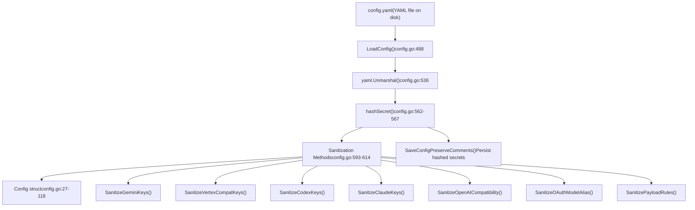
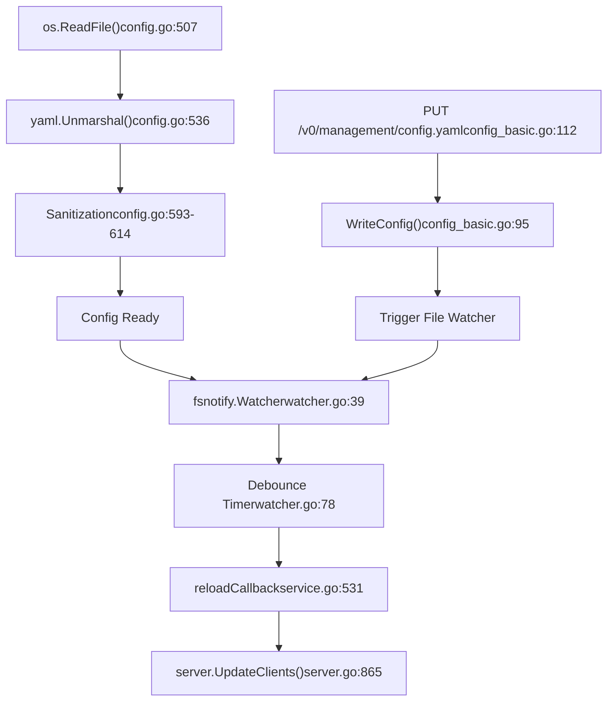

# Configuration File Structure

Relevant source files

-   [config.example.yaml](https://github.com/router-for-me/CLIProxyAPI/blob/c66cb0af/config.example.yaml)
-   [internal/api/handlers/management/config\_basic.go](https://github.com/router-for-me/CLIProxyAPI/blob/c66cb0af/internal/api/handlers/management/config_basic.go)
-   [internal/api/handlers/management/config\_lists.go](https://github.com/router-for-me/CLIProxyAPI/blob/c66cb0af/internal/api/handlers/management/config_lists.go)
-   [internal/api/handlers/management/model\_definitions.go](https://github.com/router-for-me/CLIProxyAPI/blob/c66cb0af/internal/api/handlers/management/model_definitions.go)
-   [internal/api/server.go](https://github.com/router-for-me/CLIProxyAPI/blob/c66cb0af/internal/api/server.go)
-   [internal/config/config.go](https://github.com/router-for-me/CLIProxyAPI/blob/c66cb0af/internal/config/config.go)
-   [internal/config/oauth\_model\_alias\_migration.go](https://github.com/router-for-me/CLIProxyAPI/blob/c66cb0af/internal/config/oauth_model_alias_migration.go)
-   [internal/config/oauth\_model\_alias\_migration\_test.go](https://github.com/router-for-me/CLIProxyAPI/blob/c66cb0af/internal/config/oauth_model_alias_migration_test.go)
-   [internal/config/oauth\_model\_alias\_test.go](https://github.com/router-for-me/CLIProxyAPI/blob/c66cb0af/internal/config/oauth_model_alias_test.go)
-   [internal/registry/model\_definitions\_static\_data.go](https://github.com/router-for-me/CLIProxyAPI/blob/c66cb0af/internal/registry/model_definitions_static_data.go)
-   [internal/thinking/provider/iflow/apply.go](https://github.com/router-for-me/CLIProxyAPI/blob/c66cb0af/internal/thinking/provider/iflow/apply.go)
-   [internal/util/claude\_model.go](https://github.com/router-for-me/CLIProxyAPI/blob/c66cb0af/internal/util/claude_model.go)
-   [internal/util/claude\_model\_test.go](https://github.com/router-for-me/CLIProxyAPI/blob/c66cb0af/internal/util/claude_model_test.go)
-   [internal/watcher/diff/oauth\_model\_alias.go](https://github.com/router-for-me/CLIProxyAPI/blob/c66cb0af/internal/watcher/diff/oauth_model_alias.go)
-   [internal/watcher/watcher.go](https://github.com/router-for-me/CLIProxyAPI/blob/c66cb0af/internal/watcher/watcher.go)
-   [sdk/cliproxy/service.go](https://github.com/router-for-me/CLIProxyAPI/blob/c66cb0af/sdk/cliproxy/service.go)
-   [test/amp\_management\_test.go](https://github.com/router-for-me/CLIProxyAPI/blob/c66cb0af/test/amp_management_test.go)

This document details the structure of `config.yaml`, the primary configuration file for CLIProxyAPI. It covers all available fields, their types, nested objects, default values, and validation rules. For information about storage backends (PostgreSQL, Git, Object Store), see [Storage Backend Options](/router-for-me/CLIProxyAPI/5.2-storage-backend-options). For environment variable overrides, see [Environment Variables and Overrides](/router-for-me/CLIProxyAPI/5.3-environment-variables-and-overrides). For payload manipulation rules, see [Payload Configuration Rules](/router-for-me/CLIProxyAPI/5.4-payload-configuration-rules).

## Configuration Loading Mechanism

The configuration system loads settings from `config.yaml` using a multi-stage process:


**Sources:** [internal/config/config.go488-633](https://github.com/router-for-me/CLIProxyAPI/blob/c66cb0af/internal/config/config.go#L488-L633)

The `LoadConfig` function [internal/config/config.go488-490](https://github.com/router-for-me/CLIProxyAPI/blob/c66cb0af/internal/config/config.go#L488-L490) wraps `LoadConfigOptional` [internal/config/config.go495-633](https://github.com/router-for-me/CLIProxyAPI/blob/c66cb0af/internal/config/config.go#L495-L633) which reads the YAML file, unmarshals it into the `Config` struct [internal/config/config.go27-118](https://github.com/router-for-me/CLIProxyAPI/blob/c66cb0af/internal/config/config.go#L27-L118) and applies validation and normalization through sanitization methods.

## Top-Level Configuration Structure

The `Config` struct [internal/config/config.go27-118](https://github.com/router-for-me/CLIProxyAPI/blob/c66cb0af/internal/config/config.go#L27-L118) embeds `SDKConfig` and defines all configuration fields:

| Field | Type | Default | Description |
| --- | --- | --- | --- |
| `host` | `string` | `""` | Network host/interface to bind (empty = all interfaces) |
| `port` | `int` | Required | Network port for HTTP server |
| `tls` | `TLSConfig` | \- | HTTPS server settings |
| `remote-management` | `RemoteManagement` | \- | Management API configuration |
| `auth-dir` | `string` | Required | Directory for authentication token files |
| `debug` | `bool` | `false` | Enable debug logging |
| `pprof` | `PprofConfig` | \- | pprof HTTP debug server settings |
| `commercial-mode` | `bool` | `false` | Disable high-overhead middleware |
| `logging-to-file` | `bool` | `false` | Write logs to rotating files vs stdout |
| `logs-max-total-size-mb` | `int` | `0` | Total log file size limit (0=unlimited) |
| `error-logs-max-files` | `int` | `10` | Max error log files to retain |
| `usage-statistics-enabled` | `bool` | `false` | Enable in-memory usage aggregation |
| `disable-cooling` | `bool` | `false` | Disable quota cooldown scheduling |
| `request-retry` | `int` | `0` | Number of retry attempts for failed requests |
| `max-retry-interval` | `int` | `0` | Max wait time (seconds) before retry |
| `quota-exceeded` | `QuotaExceeded` | \- | Behavior when quota limits are exceeded |
| `routing` | `RoutingConfig` | \- | Credential selection strategy |
| `ws-auth` | `bool` | `false` | Enable authentication for WebSocket API |

**Sources:** [internal/config/config.go27-118](https://github.com/router-for-me/CLIProxyAPI/blob/c66cb0af/internal/config/config.go#L27-L118) [config.example.yaml1-96](https://github.com/router-for-me/CLIProxyAPI/blob/c66cb0af/config.example.yaml#L1-L96)

## Server and Network Configuration

### Basic Server Settings

```
host: ""                # Empty string binds all interfaces (IPv4 + IPv6)port: 8317             # Required: HTTP server port
```
The `host` field [internal/config/config.go31](https://github.com/router-for-me/CLIProxyAPI/blob/c66cb0af/internal/config/config.go#L31-L31) controls which network interface the server binds to. An empty string (default) binds to all interfaces. Use `"127.0.0.1"` or `"localhost"` to restrict access to the local machine only.

### TLS Configuration

```
tls:  enable: false        # Toggle HTTPS mode  cert: ""            # Path to TLS certificate file  key: ""             # Path to TLS private key file
```
The `TLSConfig` struct [internal/config/config.go121-128](https://github.com/router-for-me/CLIProxyAPI/blob/c66cb0af/internal/config/config.go#L121-L128) defines HTTPS settings. When `enable` is `true`, both `cert` and `key` paths must be provided [internal/api/server.go782-791](https://github.com/router-for-me/CLIProxyAPI/blob/c66cb0af/internal/api/server.go#L782-L791)

**Sources:** [internal/config/config.go36](https://github.com/router-for-me/CLIProxyAPI/blob/c66cb0af/internal/config/config.go#L36-L36) [internal/config/config.go121-128](https://github.com/router-for-me/CLIProxyAPI/blob/c66cb0af/internal/config/config.go#L121-L128) [config.example.yaml8-12](https://github.com/router-for-me/CLIProxyAPI/blob/c66cb0af/config.example.yaml#L8-L12)

## Authentication and Authorization

### Authentication Directory

```
auth-dir: "~/.cli-proxy-api"  # Supports ~ for home directory expansion
```
The `auth-dir` field [internal/config/config.go42](https://github.com/router-for-me/CLIProxyAPI/blob/c66cb0af/internal/config/config.go#L42-L42) specifies where OAuth token files and service account credentials are stored. The directory is created automatically if it doesn't exist [sdk/cliproxy/service.go690-706](https://github.com/router-for-me/CLIProxyAPI/blob/c66cb0af/sdk/cliproxy/service.go#L690-L706)

### API Keys

```
api-keys:  - "your-api-key-1"  - "your-api-key-2"  - "your-api-key-3"
```
API keys are stored in the embedded `SDKConfig.APIKeys` field and provide request authentication through the `AuthMiddleware` [internal/api/server.go1016-1042](https://github.com/router-for-me/CLIProxyAPI/blob/c66cb0af/internal/api/server.go#L1016-L1042)

**Sources:** [internal/config/config.go42](https://github.com/router-for-me/CLIProxyAPI/blob/c66cb0af/internal/config/config.go#L42-L42) [config.example.yaml32-38](https://github.com/router-for-me/CLIProxyAPI/blob/c66cb0af/config.example.yaml#L32-L38) [sdk/cliproxy/service.go690-706](https://github.com/router-for-me/CLIProxyAPI/blob/c66cb0af/sdk/cliproxy/service.go#L690-L706)

## Management API Configuration

```
remote-management:  allow-remote: false                    # Allow non-localhost access  secret-key: ""                         # Management password (hashed automatically)  disable-control-panel: false           # Skip bundled management UI  panel-github-repository: "https://github.com/router-for-me/Cli-Proxy-API-Management-Center"
```
The `RemoteManagement` struct [internal/config/config.go138-149](https://github.com/router-for-me/CLIProxyAPI/blob/c66cb0af/internal/config/config.go#L138-L149) configures the management API:

-   **`allow-remote`**: When `false`, only localhost can access `/v0/management` endpoints [internal/api/handlers/management/handler.go92-114](https://github.com/router-for-me/CLIProxyAPI/blob/c66cb0af/internal/api/handlers/management/handler.go#L92-L114)
-   **`secret-key`**: Plaintext secrets are automatically bcrypt-hashed on startup [internal/config/config.go562-567](https://github.com/router-for-me/CLIProxyAPI/blob/c66cb0af/internal/config/config.go#L562-L567) and persisted back to the config file [internal/config/config.go571](https://github.com/router-for-me/CLIProxyAPI/blob/c66cb0af/internal/config/config.go#L571-L571)
-   **`disable-control-panel`**: When `true`, skips downloading and serving `management.html` [internal/api/server.go644-672](https://github.com/router-for-me/CLIProxyAPI/blob/c66cb0af/internal/api/server.go#L644-L672)
-   **`panel-github-repository`**: GitHub repository URL or API endpoint for control panel assets [internal/config/config.go147-149](https://github.com/router-for-me/CLIProxyAPI/blob/c66cb0af/internal/config/config.go#L147-L149)

Management routes are only registered when a `secret-key` is configured or the `MANAGEMENT_PASSWORD` environment variable is set [internal/api/server.go288-292](https://github.com/router-for-me/CLIProxyAPI/blob/c66cb0af/internal/api/server.go#L288-L292)

**Sources:** [internal/config/config.go39](https://github.com/router-for-me/CLIProxyAPI/blob/c66cb0af/internal/config/config.go#L39-L39) [internal/config/config.go138-149](https://github.com/router-for-me/CLIProxyAPI/blob/c66cb0af/internal/config/config.go#L138-L149) [config.example.yaml14-29](https://github.com/router-for-me/CLIProxyAPI/blob/c66cb0af/config.example.yaml#L14-L29)

## Provider-Specific Configuration

### Gemini API Keys

```
gemini-api-key:  - api-key: "AIzaSy...01"    priority: 0                         # Higher values preferred (default: 0)    prefix: "team-a"                    # Optional namespace    base-url: "https://generativelanguage.googleapis.com"    proxy-url: "socks5://proxy.example.com:1080"    headers:      X-Custom-Header: "custom-value"    models:      - name: "gemini-2.5-flash"        # Upstream model name        alias: "gemini-flash"           # Client-visible alias    excluded-models:      - "gemini-2.5-pro"                # Exact match      - "gemini-2.5-*"                  # Wildcard prefix      - "*-preview"                     # Wildcard suffix      - "*flash*"                       # Wildcard substring
```
The `GeminiKey` struct [internal/config/config.go388-413](https://github.com/router-for-me/CLIProxyAPI/blob/c66cb0af/internal/config/config.go#L388-L413) supports per-key configuration:

| Field | Type | Purpose |
| --- | --- | --- |
| `api-key` | `string` | Authentication key (required) |
| `priority` | `int` | Selection preference (higher = preferred) |
| `prefix` | `string` | Model namespace (e.g., `"teamA/gemini-3-pro-preview"`) |
| `base-url` | `string` | Custom API endpoint override |
| `proxy-url` | `string` | Per-key proxy override |
| `headers` | `map[string]string` | Additional HTTP headers |
| `models` | `[]GeminiModel` | Upstream model to alias mappings |
| `excluded-models` | `[]string` | Model exclusion patterns (exact, wildcard) |

**Sources:** [internal/config/config.go84-85](https://github.com/router-for-me/CLIProxyAPI/blob/c66cb0af/internal/config/config.go#L84-L85) [internal/config/config.go388-413](https://github.com/router-for-me/CLIProxyAPI/blob/c66cb0af/internal/config/config.go#L388-L413) [config.example.yaml98-113](https://github.com/router-for-me/CLIProxyAPI/blob/c66cb0af/config.example.yaml#L98-L113)

### Claude API Keys

```
claude-api-key:  - api-key: "sk-atSM..."    priority: 0    prefix: "team-a"    base-url: "https://api.anthropic.com"    proxy-url: ""    headers: {}    models:      - name: "claude-3-5-sonnet-20241022"        alias: "claude-sonnet-latest"    excluded-models:      - "claude-opus-4-5-20251101"    cloak:                               # Request cloaking configuration      mode: "auto"                       # "auto", "always", "never"      strict-mode: false                 # Strip user system messages      sensitive-words:                   # Words to obfuscate        - "API"        - "proxy"
```
The `ClaudeKey` struct [internal/config/config.go295-324](https://github.com/router-for-me/CLIProxyAPI/blob/c66cb0af/internal/config/config.go#L295-L324) includes cloaking configuration via `CloakConfig` [internal/config/config.go275-291](https://github.com/router-for-me/CLIProxyAPI/blob/c66cb0af/internal/config/config.go#L275-L291) for disguising non-Claude-Code clients.

**Sources:** [internal/config/config.go91](https://github.com/router-for-me/CLIProxyAPI/blob/c66cb0af/internal/config/config.go#L91-L91) [internal/config/config.go295-324](https://github.com/router-for-me/CLIProxyAPI/blob/c66cb0af/internal/config/config.go#L295-L324) [config.example.yaml133-157](https://github.com/router-for-me/CLIProxyAPI/blob/c66cb0af/config.example.yaml#L133-L157)

### Codex API Keys

```
codex-api-key:  - api-key: "sk-atSM..."    priority: 0    prefix: "team-a"    base-url: "https://www.example.com"    proxy-url: ""    headers: {}    models:      - name: "gpt-5-codex"        alias: "codex-latest"    excluded-models:      - "gpt-5.1"
```
The `CodexKey` struct [internal/config/config.go343-369](https://github.com/router-for-me/CLIProxyAPI/blob/c66cb0af/internal/config/config.go#L343-L369) follows the same pattern as other provider keys.

**Sources:** [internal/config/config.go88](https://github.com/router-for-me/CLIProxyAPI/blob/c66cb0af/internal/config/config.go#L88-L88) [internal/config/config.go343-369](https://github.com/router-for-me/CLIProxyAPI/blob/c66cb0af/internal/config/config.go#L343-L369) [config.example.yaml116-130](https://github.com/router-for-me/CLIProxyAPI/blob/c66cb0af/config.example.yaml#L116-L130)

### OpenAI-Compatible Providers

```
openai-compatibility:  - name: "openrouter"                   # Provider identifier    priority: 0    prefix: "team-a"    base-url: "https://openrouter.ai/api/v1"    headers:      X-Custom-Header: "custom-value"    api-key-entries:      - api-key: "sk-or-v1-...b780"        proxy-url: "socks5://proxy.example.com:1080"      - api-key: "sk-or-v1-...b781"    models:      - name: "moonshotai/kimi-k2:free"  # Actual model name        alias: "kimi-k2"                  # Client-visible alias
```
The `OpenAICompatibility` struct [internal/config/config.go432-454](https://github.com/router-for-me/CLIProxyAPI/blob/c66cb0af/internal/config/config.go#L432-L454) supports third-party OpenAI-compatible APIs with multiple API keys per provider.

**Sources:** [internal/config/config.go94](https://github.com/router-for-me/CLIProxyAPI/blob/c66cb0af/internal/config/config.go#L94-L94) [internal/config/config.go432-454](https://github.com/router-for-me/CLIProxyAPI/blob/c66cb0af/internal/config/config.go#L432-L454) [config.example.yaml160-172](https://github.com/router-for-me/CLIProxyAPI/blob/c66cb0af/config.example.yaml#L160-L172)

### Vertex-Compatible API Keys

```
vertex-api-key:  - api-key: "vk-123..."                 # Sent as x-goog-api-key header    priority: 0    prefix: "team-a"    base-url: "https://example.com/api"  # e.g., zenmux.ai/api    proxy-url: ""    headers: {}    models:      - name: "gemini-2.5-flash"        alias: "vertex-flash"
```
The `VertexCompatKey` struct supports Vertex AI-style endpoints that use API key authentication instead of OAuth.

**Sources:** [internal/config/config.go98](https://github.com/router-for-me/CLIProxyAPI/blob/c66cb0af/internal/config/config.go#L98-L98) [config.example.yaml175-186](https://github.com/router-for-me/CLIProxyAPI/blob/c66cb0af/config.example.yaml#L175-L186)

## Global OAuth Configuration

### OAuth Model Aliases

```
oauth-model-alias:  gemini-cli:    - name: "gemini-2.5-pro"             # Original model name      alias: "g2.5p"                     # Client-visible alias      fork: true                         # Keep original + add alias  vertex:    - name: "gemini-2.5-pro"      alias: "g2.5p"  claude:    - name: "claude-sonnet-4-5-20250929"      alias: "cs4.5"
```
The `OAuthModelAlias` map [internal/config/config.go112](https://github.com/router-for-me/CLIProxyAPI/blob/c66cb0af/internal/config/config.go#L112-L112) defines per-channel model name mappings. Supported channels: `gemini-cli`, `vertex`, `aistudio`, `antigravity`, `claude`, `codex`, `qwen`, `iflow`, `kimi`.

The `OAuthModelAlias` struct [internal/config/config.go172-176](https://github.com/router-for-me/CLIProxyAPI/blob/c66cb0af/internal/config/config.go#L172-L176) defines each mapping:

-   **`name`**: Upstream model identifier
-   **`alias`**: Client-visible model name
-   **`fork`**: When `true`, both original and alias are available; when `false`, only alias is exposed

**Note:** These aliases do NOT apply to `gemini-api-key`, `codex-api-key`, `claude-api-key`, `openai-compatibility`, `vertex-api-key`, or `ampcode` entries. Those use their own per-credential `models` configuration.

**Sources:** [internal/config/config.go107-112](https://github.com/router-for-me/CLIProxyAPI/blob/c66cb0af/internal/config/config.go#L107-L112) [internal/config/config.go172-176](https://github.com/router-for-me/CLIProxyAPI/blob/c66cb0af/internal/config/config.go#L172-L176) [config.example.yaml223-255](https://github.com/router-for-me/CLIProxyAPI/blob/c66cb0af/config.example.yaml#L223-L255)

### OAuth Excluded Models

```
oauth-excluded-models:  gemini-cli:    - "gemini-2.5-pro"                   # Exact match    - "gemini-2.5-*"                     # Wildcard prefix    - "*-preview"                        # Wildcard suffix    - "*flash*"                          # Wildcard substring  vertex:    - "gemini-3-pro-preview"
```
The `OAuthExcludedModels` map [internal/config/config.go104](https://github.com/router-for-me/CLIProxyAPI/blob/c66cb0af/internal/config/config.go#L104-L104) defines per-provider global model exclusions applied to OAuth/file-backed auth entries.

**Sources:** [internal/config/config.go104](https://github.com/router-for-me/CLIProxyAPI/blob/c66cb0af/internal/config/config.go#L104-L104) [config.example.yaml258-279](https://github.com/router-for-me/CLIProxyAPI/blob/c66cb0af/config.example.yaml#L258-L279)

## Routing and Retry Configuration

### Credential Selection Strategy

```
routing:  strategy: "round-robin"                # "round-robin" (default) or "fill-first"
```
The `RoutingConfig` struct [internal/config/config.go162-166](https://github.com/router-for-me/CLIProxyAPI/blob/c66cb0af/internal/config/config.go#L162-L166) controls how credentials are selected when multiple match a request:

-   **`round-robin`**: Distributes requests evenly across all available credentials
-   **`fill-first`**: Uses the first available credential until quota is exhausted, then moves to the next

The strategy is applied through the `Selector` interface [sdk/cliproxy/auth/selector.go](https://github.com/router-for-me/CLIProxyAPI/blob/c66cb0af/sdk/cliproxy/auth/selector.go) with implementations `RoundRobinSelector` and `FillFirstSelector` [sdk/cliproxy/service.go549-567](https://github.com/router-for-me/CLIProxyAPI/blob/c66cb0af/sdk/cliproxy/service.go#L549-L567)

### Request Retry Configuration

```
request-retry: 3                         # Number of retry attemptsmax-retry-interval: 30                   # Max wait time (seconds) before retry
```
The `request-retry` field [internal/config/config.go71](https://github.com/router-for-me/CLIProxyAPI/blob/c66cb0af/internal/config/config.go#L71-L71) defines how many times to retry requests with HTTP response codes 403, 408, 500, 502, 503, or 504. The `max-retry-interval` field [internal/config/config.go73](https://github.com/router-for-me/CLIProxyAPI/blob/c66cb0af/internal/config/config.go#L73-L73) caps the wait time before triggering a retry on cooled-down credentials [internal/api/server.go254-255](https://github.com/router-for-me/CLIProxyAPI/blob/c66cb0af/internal/api/server.go#L254-L255)

### Quota Exceeded Behavior

```
quota-exceeded:  switch-project: true                   # Auto-switch to another project  switch-preview-model: true             # Auto-switch to preview model
```
The `QuotaExceeded` struct [internal/config/config.go153-159](https://github.com/router-for-me/CLIProxyAPI/blob/c66cb0af/internal/config/config.go#L153-L159) configures automatic failover when quota limits are hit.

**Sources:** [internal/config/config.go79](https://github.com/router-for-me/CLIProxyAPI/blob/c66cb0af/internal/config/config.go#L79-L79) [internal/config/config.go162-166](https://github.com/router-for-me/CLIProxyAPI/blob/c66cb0af/internal/config/config.go#L162-L166) [config.example.yaml78-84](https://github.com/router-for-me/CLIProxyAPI/blob/c66cb0af/config.example.yaml#L78-L84)

## AMP CLI Integration

```
ampcode:  upstream-url: "https://ampcode.com"  upstream-api-key: ""                   # Default upstream key  upstream-api-keys:                     # Per-client upstream key mapping    - upstream-api-key: "amp_key_for_team_a"      api-keys:        - "your-api-key-1"        - "your-api-key-2"  restrict-management-to-localhost: false  force-model-mappings: false  model-mappings:    - from: "claude-opus-4-5-20251101"      to: "gemini-claude-opus-4-5-thinking"      regex: false                       # Exact match vs regex pattern
```
The `AmpCode` struct [internal/config/config.go197-222](https://github.com/router-for-me/CLIProxyAPI/blob/c66cb0af/internal/config/config.go#L197-L222) configures AMP CLI upstream routing:

| Field | Type | Description |
| --- | --- | --- |
| `upstream-url` | `string` | Upstream Amp control plane URL |
| `upstream-api-key` | `string` | Default API key for upstream requests |
| `upstream-api-keys` | `[]AmpUpstreamAPIKeyEntry` | Per-client upstream key mappings |
| `restrict-management-to-localhost` | `bool` | Restrict management routes to localhost |
| `force-model-mappings` | `bool` | Prioritize mappings over local API keys |
| `model-mappings` | `[]AmpModelMapping` | Model name transformations |

The `AmpModelMapping` struct [internal/config/config.go181-193](https://github.com/router-for-me/CLIProxyAPI/blob/c66cb0af/internal/config/config.go#L181-L193) supports both exact and regex-based model name matching.

**Sources:** [internal/config/config.go101](https://github.com/router-for-me/CLIProxyAPI/blob/c66cb0af/internal/config/config.go#L101-L101) [internal/config/config.go197-222](https://github.com/router-for-me/CLIProxyAPI/blob/c66cb0af/internal/config/config.go#L197-L222) [config.example.yaml189-220](https://github.com/router-for-me/CLIProxyAPI/blob/c66cb0af/config.example.yaml#L189-L220)

## Payload Configuration

```
payload:  default:                               # Set only if missing    - models:        - name: "gemini-2.5-pro"          protocol: "gemini"             # openai, gemini, claude, codex, antigravity      params:        "generationConfig.thinkingConfig.thinkingBudget": 32768    default-raw:                           # Set raw JSON only if missing    - models:        - name: "gemini-2.5-pro"          protocol: "gemini"      params:        "generationConfig.responseJsonSchema": "{\"type\":\"object\"}"    override:                              # Always set (overwrite)    - models:        - name: "gpt-*"          protocol: "codex"      params:        "reasoning.effort": "high"    override-raw:                          # Always set raw JSON    - models:        - name: "gpt-*"          protocol: "codex"      params:        "response_format": "{\"type\":\"json_schema\"}"    filter:                                # Remove parameters    - models:        - name: "gemini-2.5-pro"          protocol: "gemini"      params:        - "generationConfig.thinkingConfig.thinkingBudget"
```
The `PayloadConfig` struct [internal/config/config.go236-247](https://github.com/router-for-me/CLIProxyAPI/blob/c66cb0af/internal/config/config.go#L236-L247) defines rules for dynamically manipulating provider request payloads:

-   **`default`**: Sets parameters only when missing [internal/config/config.go238](https://github.com/router-for-me/CLIProxyAPI/blob/c66cb0af/internal/config/config.go#L238-L238)
-   **`default-raw`**: Sets raw JSON values only when missing [internal/config/config.go240](https://github.com/router-for-me/CLIProxyAPI/blob/c66cb0af/internal/config/config.go#L240-L240)
-   **`override`**: Always sets parameters, overwriting existing values [internal/config/config.go242](https://github.com/router-for-me/CLIProxyAPI/blob/c66cb0af/internal/config/config.go#L242-L242)
-   **`override-raw`**: Always sets raw JSON values [internal/config/config.go244](https://github.com/router-for-me/CLIProxyAPI/blob/c66cb0af/internal/config/config.go#L244-L244)
-   **`filter`**: Removes specified parameters [internal/config/config.go246](https://github.com/router-for-me/CLIProxyAPI/blob/c66cb0af/internal/config/config.go#L246-L246)

Each rule uses gjson/sjson path syntax for parameter addressing. Raw JSON values are validated on load [internal/config/config.go636-677](https://github.com/router-for-me/CLIProxyAPI/blob/c66cb0af/internal/config/config.go#L636-L677) For detailed usage, see [Payload Configuration Rules](/router-for-me/CLIProxyAPI/5.4-payload-configuration-rules).

**Sources:** [internal/config/config.go115](https://github.com/router-for-me/CLIProxyAPI/blob/c66cb0af/internal/config/config.go#L115-L115) [internal/config/config.go236-272](https://github.com/router-for-me/CLIProxyAPI/blob/c66cb0af/internal/config/config.go#L236-L272) [config.example.yaml282-313](https://github.com/router-for-me/CLIProxyAPI/blob/c66cb0af/config.example.yaml#L282-L313)

## Logging and Debugging

### Debug and Logging Configuration

```
debug: false                             # Enable debug-level logginglogging-to-file: false                   # Write logs to rotating fileslogs-max-total-size-mb: 0                # Total log file size limit (0=unlimited)error-logs-max-files: 10                 # Max error log files to retain
```
The `debug` flag [internal/config/config.go45](https://github.com/router-for-me/CLIProxyAPI/blob/c66cb0af/internal/config/config.go#L45-L45) controls log level through `util.SetLogLevel` [internal/api/server.go909-912](https://github.com/router-for-me/CLIProxyAPI/blob/c66cb0af/internal/api/server.go#L909-L912) When `logging-to-file` is enabled [internal/config/config.go54](https://github.com/router-for-me/CLIProxyAPI/blob/c66cb0af/internal/config/config.go#L54-L54) logs are written to rotating files instead of stdout [internal/logging/config.go](https://github.com/router-for-me/CLIProxyAPI/blob/c66cb0af/internal/logging/config.go)

### pprof Debug Server

```
pprof:  enable: false                          # Toggle pprof HTTP server  addr: "127.0.0.1:8316"                # Host:port for pprof server
```
The `PprofConfig` struct [internal/config/config.go131-136](https://github.com/router-for-me/CLIProxyAPI/blob/c66cb0af/internal/config/config.go#L131-L136) controls the optional pprof HTTP debug server [sdk/cliproxy/pprof.go](https://github.com/router-for-me/CLIProxyAPI/blob/c66cb0af/sdk/cliproxy/pprof.go)

### Usage Statistics

```
usage-statistics-enabled: false          # Enable in-memory usage aggregation
```
When enabled [internal/config/config.go65](https://github.com/router-for-me/CLIProxyAPI/blob/c66cb0af/internal/config/config.go#L65-L65) the system tracks token consumption in memory [internal/usage/manager.go](https://github.com/router-for-me/CLIProxyAPI/blob/c66cb0af/internal/usage/manager.go) Statistics are accessible via `/v0/management/usage` [internal/api/handlers/management/usage.go](https://github.com/router-for-me/CLIProxyAPI/blob/c66cb0af/internal/api/handlers/management/usage.go)

**Sources:** [internal/config/config.go45](https://github.com/router-for-me/CLIProxyAPI/blob/c66cb0af/internal/config/config.go#L45-L45) [internal/config/config.go54](https://github.com/router-for-me/CLIProxyAPI/blob/c66cb0af/internal/config/config.go#L54-L54) [config.example.yaml41-63](https://github.com/router-for-me/CLIProxyAPI/blob/c66cb0af/config.example.yaml#L41-L63)

## Configuration Lifecycle


**Sources:** [internal/config/config.go488-633](https://github.com/router-for-me/CLIProxyAPI/blob/c66cb0af/internal/config/config.go#L488-L633) [internal/watcher/watcher.go1-149](https://github.com/router-for-me/CLIProxyAPI/blob/c66cb0af/internal/watcher/watcher.go#L1-L149) [sdk/cliproxy/service.go531-583](https://github.com/router-for-me/CLIProxyAPI/blob/c66cb0af/sdk/cliproxy/service.go#L531-L583)

### Hot Reload Process

The configuration hot reload system uses fsnotify [internal/watcher/watcher.go39](https://github.com/router-for-me/CLIProxyAPI/blob/c66cb0af/internal/watcher/watcher.go#L39-L39) to detect file changes:

1.  **File Modified**: fsnotify emits `Write` or `Chmod` event
2.  **Debounce**: Wait 150ms [internal/watcher/watcher.go78](https://github.com/router-for-me/CLIProxyAPI/blob/c66cb0af/internal/watcher/watcher.go#L78-L78) to handle atomic writes
3.  **Reload**: Call `reloadCallback` [sdk/cliproxy/service.go531-583](https://github.com/router-for-me/CLIProxyAPI/blob/c66cb0af/sdk/cliproxy/service.go#L531-L583)
4.  **Update**: Propagate changes through `server.UpdateClients` [internal/api/server.go865-1002](https://github.com/router-for-me/CLIProxyAPI/blob/c66cb0af/internal/api/server.go#L865-L1002)
5.  **Rebind**: Re-register executors and model registry [sdk/cliproxy/service.go412-421](https://github.com/router-for-me/CLIProxyAPI/blob/c66cb0af/sdk/cliproxy/service.go#L412-L421)

Configuration changes are applied atomically without server restart. The old configuration YAML snapshot [internal/api/server.go129-131](https://github.com/router-for-me/CLIProxyAPI/blob/c66cb0af/internal/api/server.go#L129-L131) enables change detection for conditional updates.

**Sources:** [internal/watcher/watcher.go1-149](https://github.com/router-for-me/CLIProxyAPI/blob/c66cb0af/internal/watcher/watcher.go#L1-L149) [sdk/cliproxy/service.go531-583](https://github.com/router-for-me/CLIProxyAPI/blob/c66cb0af/sdk/cliproxy/service.go#L531-L583) [internal/api/server.go865-1002](https://github.com/router-for-me/CLIProxyAPI/blob/c66cb0af/internal/api/server.go#L865-L1002)

## Configuration Validation and Sanitization

### Sanitization Pipeline

```mermaid
flowchart TD
    Unmarshal["yaml.Unmarshal()"]
    SanitizeGemini["SanitizeGeminiKeys()config.go:593"]
    SanitizeVertex["SanitizeVertexCompatKeys()config.go:596"]
    SanitizeCodex["SanitizeCodexKeys()config.go:599"]
    SanitizeClaude["SanitizeClaudeKeys()config.go:602"]
    SanitizeOpenAI["SanitizeOpenAICompatibility()config.go:605"]
    NormalizeOAuth["NormalizeOAuthExcludedModels()config.go:608"]
    SanitizeAlias["SanitizeOAuthModelAlias()config.go:611"]
    SanitizePayload["SanitizePayloadRules()config.go:614"]
    Validated["Validated Config"]

    Unmarshal --> SanitizeGemini
    Unmarshal --> SanitizeVertex
    Unmarshal --> SanitizeCodex
    Unmarshal --> SanitizeClaude
    Unmarshal --> SanitizeOpenAI
    Unmarshal --> NormalizeOAuth
    Unmarshal --> SanitizeAlias
    Unmarshal --> SanitizePayload
    SanitizeGemini --> Validated
    SanitizeVertex --> Validated
    SanitizeCodex --> Validated
    SanitizeClaude --> Validated
    SanitizeOpenAI --> Validated
    NormalizeOAuth --> Validated
    SanitizeAlias --> Validated
    SanitizePayload --> Validated
```


**Sources:** [internal/config/config.go593-629](https://github.com/router-for-me/CLIProxyAPI/blob/c66cb0af/internal/config/config.go#L593-L629)

### Validation Rules by Section

| Configuration Section | Validation Method | Rules Applied |
| --- | --- | --- |
| Gemini API Keys | `SanitizeGeminiKeys()` [internal/config/config.go593](https://github.com/router-for-me/CLIProxyAPI/blob/c66cb0af/internal/config/config.go#L593-L593) | Drop entries without `api-key`, normalize headers, validate exclusion patterns |
| Vertex API Keys | `SanitizeVertexCompatKeys()` [internal/config/config.go596](https://github.com/router-for-me/CLIProxyAPI/blob/c66cb0af/internal/config/config.go#L596-L596) | Drop entries without both `api-key` AND `base-url` |
| Codex API Keys | `SanitizeCodexKeys()` [internal/config/config.go599](https://github.com/router-for-me/CLIProxyAPI/blob/c66cb0af/internal/config/config.go#L599-L599) | Drop entries without both `api-key` AND `base-url` |
| Claude API Keys | `SanitizeClaudeKeys()` [internal/config/config.go602](https://github.com/router-for-me/CLIProxyAPI/blob/c66cb0af/internal/config/config.go#L602-L602) | Normalize headers, validate cloaking configuration |
| OpenAI Compatibility | `SanitizeOpenAICompatibility()` [internal/config/config.go605](https://github.com/router-for-me/CLIProxyAPI/blob/c66cb0af/internal/config/config.go#L605-L605) | Drop entries without `base-url`, validate model schemas |
| OAuth Exclusions | `NormalizeOAuthExcludedModels()` [internal/config/config.go608](https://github.com/router-for-me/CLIProxyAPI/blob/c66cb0af/internal/config/config.go#L608-L608) | Normalize channel keys to lowercase, deduplicate patterns |
| OAuth Aliases | `SanitizeOAuthModelAlias()` [internal/config/config.go611](https://github.com/router-for-me/CLIProxyAPI/blob/c66cb0af/internal/config/config.go#L611-L611) | Trim whitespace, normalize channels, ensure unique aliases per channel |
| Payload Rules | `SanitizePayloadRules()` [internal/config/config.go614](https://github.com/router-for-me/CLIProxyAPI/blob/c66cb0af/internal/config/config.go#L614-L614) | Validate raw JSON in `*-raw` sections, drop invalid rules |

**Sources:** [internal/config/config.go593-677](https://github.com/router-for-me/CLIProxyAPI/blob/c66cb0af/internal/config/config.go#L593-L677)

### Priority and Prefix Handling

Model prefixes [internal/config/config.go304](https://github.com/router-for-me/CLIProxyAPI/blob/c66cb0af/internal/config/config.go#L304-L304) namespace credentials to prevent conflicts:

```
gemini-api-key:  - api-key: "AIzaSy...01"    prefix: "team-a"                     # Requires "team-a/gemini-3-pro-preview"    priority: 10                         # Higher priority selected first  - api-key: "AIzaSy...02"    prefix: ""                           # Matches unprefixed requests    priority: 5
```
When multiple credentials match, selection follows:

1.  **Priority**: Higher `priority` values are preferred [internal/config/config.go301](https://github.com/router-for-me/CLIProxyAPI/blob/c66cb0af/internal/config/config.go#L301-L301)
2.  **Prefix Match**: Exact prefix match required when set
3.  **Availability**: Quota and cooldown status checked
4.  **Strategy**: Round-robin or fill-first applied [internal/config/config.go162-166](https://github.com/router-for-me/CLIProxyAPI/blob/c66cb0af/internal/config/config.go#L162-L166)

**Sources:** [internal/config/config.go301-305](https://github.com/router-for-me/CLIProxyAPI/blob/c66cb0af/internal/config/config.go#L301-L305) [sdk/cliproxy/auth/conductor.go](https://github.com/router-for-me/CLIProxyAPI/blob/c66cb0af/sdk/cliproxy/auth/conductor.go)

## Environment Variable Overrides

While the primary configuration mechanism is `config.yaml`, certain settings can be overridden via environment variables:

| Environment Variable | Config Field | Notes |
| --- | --- | --- |
| `MANAGEMENT_PASSWORD` | `remote-management.secret-key` | Enables management routes even if config is empty [internal/api/server.go232-234](https://github.com/router-for-me/CLIProxyAPI/blob/c66cb0af/internal/api/server.go#L232-L234) |

For complete environment variable documentation, see [Environment Variables and Overrides](/router-for-me/CLIProxyAPI/5.3-environment-variables-and-overrides).

**Sources:** [internal/api/server.go232-234](https://github.com/router-for-me/CLIProxyAPI/blob/c66cb0af/internal/api/server.go#L232-L234) [internal/api/server.go916-944](https://github.com/router-for-me/CLIProxyAPI/blob/c66cb0af/internal/api/server.go#L916-L944)

## Configuration Persistence

### Save Configuration

```
// Save with preserved comments and formattingerr := config.SaveConfigPreserveComments(configFilePath, cfg) // Update specific nested scalar field onlyerr := config.SaveConfigPreserveCommentsUpdateNestedScalar(    configFilePath,    []string{"remote-management", "secret-key"},    hashedValue,)
```
The `SaveConfigPreserveComments` function [internal/config/yaml\_save.go](https://github.com/router-for-me/CLIProxyAPI/blob/c66cb0af/internal/config/yaml_save.go) preserves YAML comments and formatting while updating values. The `SaveConfigPreserveCommentsUpdateNestedScalar` function [internal/config/yaml\_save.go](https://github.com/router-for-me/CLIProxyAPI/blob/c66cb0af/internal/config/yaml_save.go) updates a single nested field without re-encoding the entire config, which preserves all original formatting and comments.

Management API endpoints use `WriteConfig` [internal/api/handlers/management/config\_basic.go95-110](https://github.com/router-for-me/CLIProxyAPI/blob/c66cb0af/internal/api/handlers/management/config_basic.go#L95-L110) to atomically write configuration with proper fsync.

**Sources:** [internal/config/yaml\_save.go](https://github.com/router-for-me/CLIProxyAPI/blob/c66cb0af/internal/config/yaml_save.go) [internal/api/handlers/management/config\_basic.go95-110](https://github.com/router-for-me/CLIProxyAPI/blob/c66cb0af/internal/api/handlers/management/config_basic.go#L95-L110)

## Configuration Schema Reference

```mermaid
flowchart TD
    classId_Config_6["Config"]
    classId_TLSConfig_7["TLSConfig"]
    classId_RemoteManagement_8["RemoteManagement"]
    classId_QuotaExceeded_9["QuotaExceeded"]
    classId_RoutingConfig_10["RoutingConfig"]
    classId_GeminiKey_11["GeminiKey"]
    classId_ClaudeKey_12["ClaudeKey"]
    classId_OpenAICompatibility_13["OpenAICompatibility"]
    classId_AmpCode_14["AmpCode"]
    classId_PayloadConfig_15["PayloadConfig"]
```


**Sources:** [internal/config/config.go27-118](https://github.com/router-for-me/CLIProxyAPI/blob/c66cb0af/internal/config/config.go#L27-L118) [internal/config/config.go121-272](https://github.com/router-for-me/CLIProxyAPI/blob/c66cb0af/internal/config/config.go#L121-L272)
