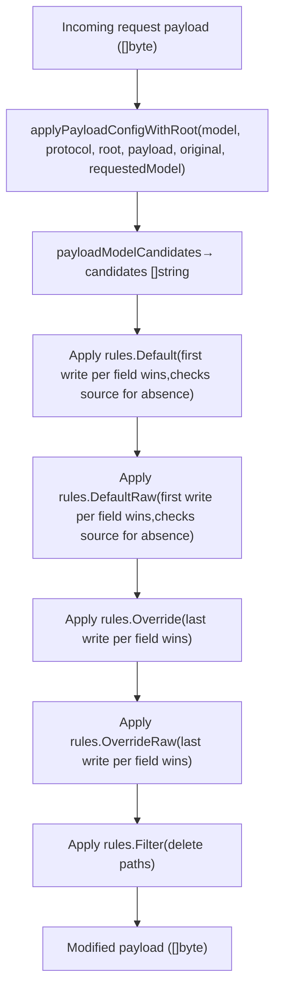
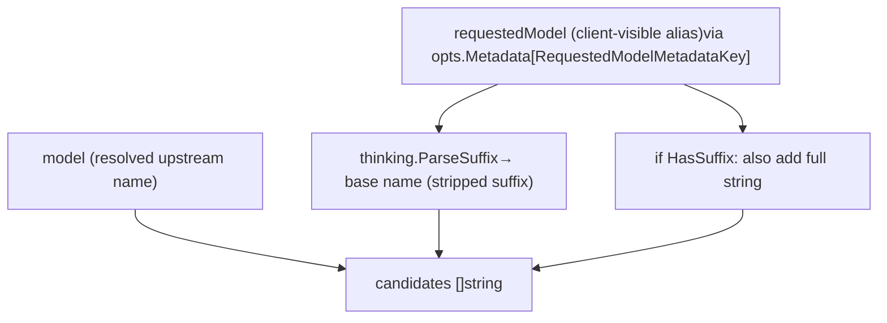
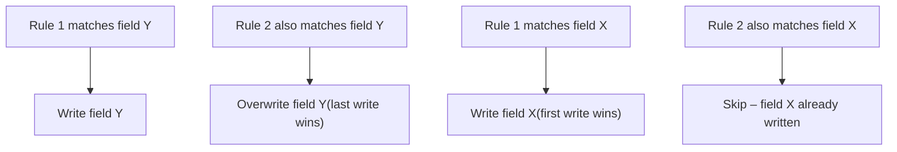
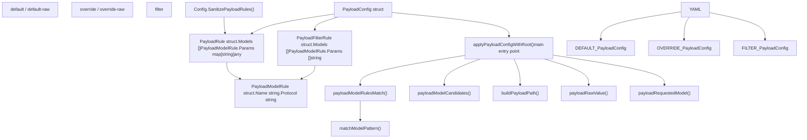

# Payload Configuration Rules

Relevant source files

-   [config.example.yaml](https://github.com/router-for-me/CLIProxyAPI/blob/c66cb0af/config.example.yaml)
-   [internal/api/handlers/management/config\_basic.go](https://github.com/router-for-me/CLIProxyAPI/blob/c66cb0af/internal/api/handlers/management/config_basic.go)
-   [internal/api/handlers/management/config\_lists.go](https://github.com/router-for-me/CLIProxyAPI/blob/c66cb0af/internal/api/handlers/management/config_lists.go)
-   [internal/api/server.go](https://github.com/router-for-me/CLIProxyAPI/blob/c66cb0af/internal/api/server.go)
-   [internal/config/config.go](https://github.com/router-for-me/CLIProxyAPI/blob/c66cb0af/internal/config/config.go)
-   [internal/runtime/executor/payload\_helpers.go](https://github.com/router-for-me/CLIProxyAPI/blob/c66cb0af/internal/runtime/executor/payload_helpers.go)
-   [internal/watcher/watcher.go](https://github.com/router-for-me/CLIProxyAPI/blob/c66cb0af/internal/watcher/watcher.go)
-   [sdk/cliproxy/service.go](https://github.com/router-for-me/CLIProxyAPI/blob/c66cb0af/sdk/cliproxy/service.go)
-   [test/amp\_management\_test.go](https://github.com/router-for-me/CLIProxyAPI/blob/c66cb0af/test/amp_management_test.go)

This page explains the `payload` subsystem in `config.yaml`, which allows you to inject, override, or delete fields in provider request bodies at runtime. It covers the configuration data structures, wildcard model matching, protocol filtering, the application order for each rule category, and the Go functions that implement the logic.

For the general structure of `config.yaml` and all top-level keys, see [5.1](/router-for-me/CLIProxyAPI/5.1-configuration-file-structure). For thinking/reasoning parameter configuration (a specific common use of payload rules), see [8.3](/router-for-me/CLIProxyAPI/8.3-thinking-and-reasoning-configuration).

---

## Purpose

The payload config system gives operators a way to modify the JSON body of any outgoing request to an AI provider without touching provider-specific code. Use cases include:

-   Setting a default `thinkingBudget` for Gemini models only when the client did not supply one.
-   Forcing `reasoning.effort` to `"high"` for all Codex requests regardless of client input.
-   Injecting a `response_format` JSON schema as a raw JSON fragment.
-   Stripping unsupported parameters from specific models to avoid upstream validation errors.

---

## Configuration Data Structures

All payload rules live under the top-level `payload` key in `config.yaml`. The corresponding Go types are defined in [internal/config/config.go248-285](https://github.com/router-for-me/CLIProxyAPI/blob/c66cb0af/internal/config/config.go#L248-L285)

### `PayloadConfig`

```
payload:
  default:       [list of PayloadRule]
  default-raw:   [list of PayloadRule]
  override:      [list of PayloadRule]
  override-raw:  [list of PayloadRule]
  filter:        [list of PayloadFilterRule]
```
| Field | Go Type | Behaviour |
| --- | --- | --- |
| `default` | `[]PayloadRule` | Sets a param only if it is **absent** in the incoming payload. First matching write per field wins. |
| `default-raw` | `[]PayloadRule` | Same as `default`, but the value is written as a **raw JSON fragment**. |
| `override` | `[]PayloadRule` | Sets a param **unconditionally**, overwriting any existing value. Last matching write per field wins. |
| `override-raw` | `[]PayloadRule` | Same as `override`, but the value is written as a **raw JSON fragment**. |
| `filter` | `[]PayloadFilterRule` | **Deletes** the listed JSON paths from the payload. |

Sources: [internal/config/config.go248-285](https://github.com/router-for-me/CLIProxyAPI/blob/c66cb0af/internal/config/config.go#L248-L285)

---

### `PayloadRule`

Used by `default`, `default-raw`, `override`, and `override-raw`.

```
- models:    - name: "gemini-2.5-pro"      protocol: "gemini"  params:    "generationConfig.thinkingConfig.thinkingBudget": 32768
```
| Field | Type | Description |
| --- | --- | --- |
| `models` | `[]PayloadModelRule` | One or more model/protocol matchers; **any** match activates the rule. |
| `params` | `map[string]any` | JSON paths (gjson/sjson dot syntax) mapped to values to write. |

For `default-raw` and `override-raw`, each `params` value must be a valid JSON string (e.g., `"{\"type\":\"object\"}"`) or a JSON-serialisable Go value. Invalid raw values are dropped at load time by `SanitizePayloadRules`.

---

### `PayloadFilterRule`

```
- models:    - name: "gemini-2.5-pro"      protocol: "gemini"  params:    - "generationConfig.thinkingConfig.thinkingBudget"    - "generationConfig.responseJsonSchema"
```
| Field | Type | Description |
| --- | --- | --- |
| `models` | `[]PayloadModelRule` | Same matching semantics as `PayloadRule`. |
| `params` | `[]string` | List of JSON paths to delete from the payload. |

Sources: [internal/config/config.go261-285](https://github.com/router-for-me/CLIProxyAPI/blob/c66cb0af/internal/config/config.go#L261-L285)

---

### `PayloadModelRule`

```
name: "gemini-*"protocol: "gemini"
```
| Field | Description |
| --- | --- |
| `name` | Model name or wildcard pattern. Supports `*` as a multi-character wildcard anywhere in the string. |
| `protocol` | Optional. If set, the rule only fires when the request's translator protocol matches (case-insensitive). Valid values: `openai`, `gemini`, `claude`, `codex`, `antigravity`. Leave empty to match all protocols. |

Sources: [internal/config/config.go279-285](https://github.com/router-for-me/CLIProxyAPI/blob/c66cb0af/internal/config/config.go#L279-L285)

---

## Wildcard Patterns

The `name` field uses a simple glob matching algorithm implemented in `matchModelPattern` in [internal/runtime/executor/payload\_helpers.go282-319](https://github.com/router-for-me/CLIProxyAPI/blob/c66cb0af/internal/runtime/executor/payload_helpers.go#L282-L319) The only metacharacter is `*`, which matches zero or more characters.

| Pattern | Matches | Does not match |
| --- | --- | --- |
| `gemini-2.5-pro` | `gemini-2.5-pro` | `gemini-2.5-pro-preview` |
| `gemini-*` | `gemini-2.5-pro`, `gemini-3-flash` | `claude-sonnet` |
| `*-pro` | `gemini-2.5-pro`, `vertex-pro` | `gemini-2.5-flash` |
| `gemini-*-pro` | `gemini-2.5-pro`, `gemini-3-pro` | `gemini-2.5-flash` |
| `*flash*` | `gemini-2.5-flash`, `gemini-2.5-flash-lite` | `gemini-2.5-pro` |
| `*` | everything | — |

---

## Rule Application Flow

**Rule application diagram: `applyPayloadConfigWithRoot`**


Sources: [internal/runtime/executor/payload\_helpers.go19-152](https://github.com/router-for-me/CLIProxyAPI/blob/c66cb0af/internal/runtime/executor/payload_helpers.go#L19-L152)

---

### Model Candidate Resolution

Before matching rules, `applyPayloadConfigWithRoot` resolves the model name into a candidate list via `payloadModelCandidates` [internal/runtime/executor/payload\_helpers.go175-209](https://github.com/router-for-me/CLIProxyAPI/blob/c66cb0af/internal/runtime/executor/payload_helpers.go#L175-L209) This ensures rules can target either the upstream model name or the client-visible alias.

**Model candidate diagram: `payloadModelCandidates`**


A rule's `name` pattern is checked against every candidate. A match on any candidate activates the rule.

Sources: [internal/runtime/executor/payload\_helpers.go175-209](https://github.com/router-for-me/CLIProxyAPI/blob/c66cb0af/internal/runtime/executor/payload_helpers.go#L175-L209)

---

### Protocol Matching

When a `PayloadModelRule` has a non-empty `Protocol` field, the rule is skipped if the current request's protocol string does not match (case-insensitive). When `Protocol` is empty, the rule applies regardless of protocol.

Protocol values map to the translator protocol names used by the request pipeline (see [3.5](/router-for-me/CLIProxyAPI/3.5-request-translation-system)):

| `protocol` value | When it matches |
| --- | --- |
| `openai` | OpenAI chat/completions requests |
| `gemini` | Gemini generateContent requests |
| `claude` | Claude messages requests |
| `codex` | OpenAI Responses/Codex requests |
| `antigravity` | Antigravity (Gemini CLI internal) requests |
| *(empty)* | All requests |

---

### Root Path Prefix

The `applyPayloadConfigWithRoot` function accepts a `root` parameter. When set (e.g., `"request"` for the Gemini CLI executor), all parameter paths in `params` are automatically prefixed with it, e.g., `"generationConfig.foo"` becomes `"request.generationConfig.foo"`. This is transparent to the config author; always write paths relative to the top-level request object.

The `buildPayloadPath` function handles this combination [internal/runtime/executor/payload\_helpers.go214-227](https://github.com/router-for-me/CLIProxyAPI/blob/c66cb0af/internal/runtime/executor/payload_helpers.go#L214-L227)

---

### Default vs. Override Precedence

**Precedence diagram for multiple matching rules**


For **default** rules, the source of truth for "is the field already set?" is the **original** payload (before any rule has been applied), not the accumulating `out` buffer. This prevents a default from an earlier rule from blocking a default from a later rule on a different field.

---

## Sanitization on Load

At startup, `SanitizePayloadRules` [internal/config/config.go656-662](https://github.com/router-for-me/CLIProxyAPI/blob/c66cb0af/internal/config/config.go#L656-L662) is called on the loaded config. It calls `sanitizePayloadRawRules` for `DefaultRaw` and `OverrideRaw` entries [internal/config/config.go664](https://github.com/router-for-me/CLIProxyAPI/blob/c66cb0af/internal/config/config.go#L664-LNaN) and drops any rule whose `params` contain values that cannot be converted to valid raw JSON. This prevents runtime errors from malformed config entries.

---

## Full Configuration Reference

The following YAML block (adapted from `config.example.yaml` [config.example.yaml294-326](https://github.com/router-for-me/CLIProxyAPI/blob/c66cb0af/config.example.yaml#L294-L326)) shows all five rule categories together:

```
payload:  default:    - models:        - name: "gemini-2.5-pro"          protocol: "gemini"      params:        "generationConfig.thinkingConfig.thinkingBudget": 32768   default-raw:    - models:        - name: "gemini-2.5-pro"          protocol: "gemini"      params:        "generationConfig.responseJsonSchema": >-          {"type":"object","properties":{"answer":{"type":"string"}}}   override:    - models:        - name: "gpt-*"          protocol: "codex"      params:        "reasoning.effort": "high"   override-raw:    - models:        - name: "gpt-*"          protocol: "codex"      params:        "response_format": >-          {"type":"json_schema","json_schema":{"name":"answer","schema":{"type":"object"}}}   filter:    - models:        - name: "gemini-2.5-pro"          protocol: "gemini"      params:        - "generationConfig.thinkingConfig.thinkingBudget"        - "generationConfig.responseJsonSchema"
```
---

## Code Entity Map

The following diagram maps configuration concepts to their Go counterparts:


Sources: [internal/config/config.go248-285](https://github.com/router-for-me/CLIProxyAPI/blob/c66cb0af/internal/config/config.go#L248-L285) [internal/runtime/executor/payload\_helpers.go19-319](https://github.com/router-for-me/CLIProxyAPI/blob/c66cb0af/internal/runtime/executor/payload_helpers.go#L19-L319)
