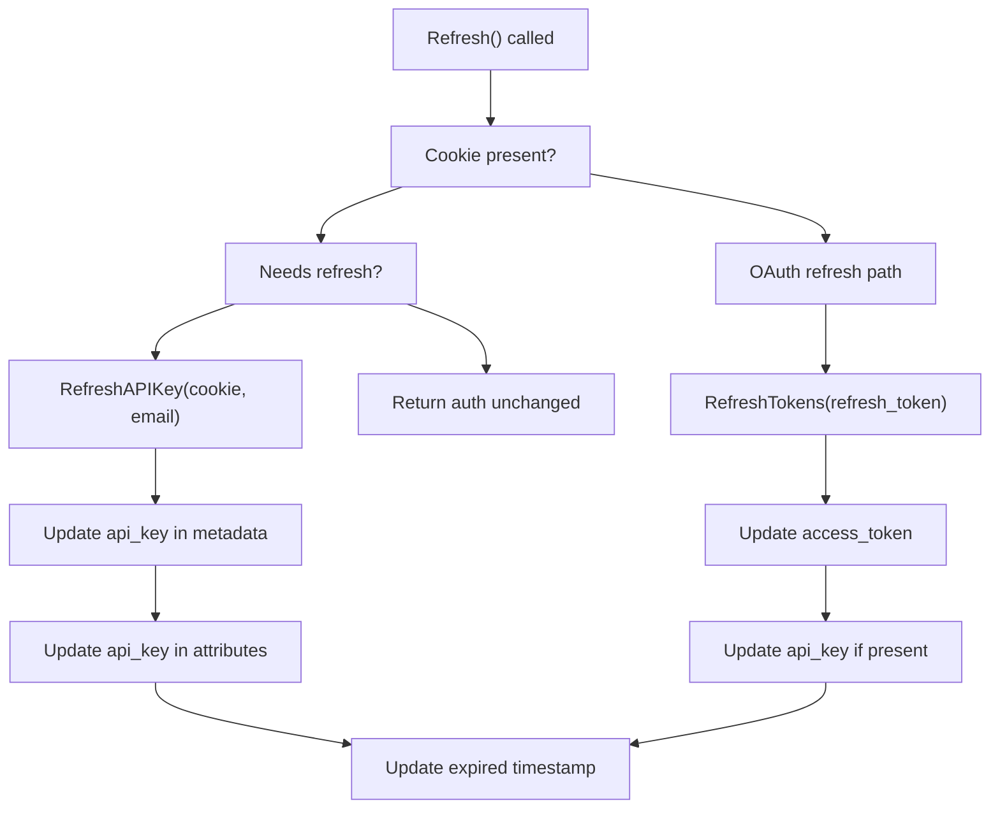
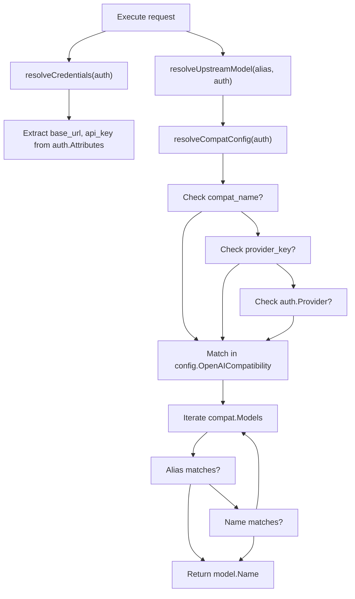
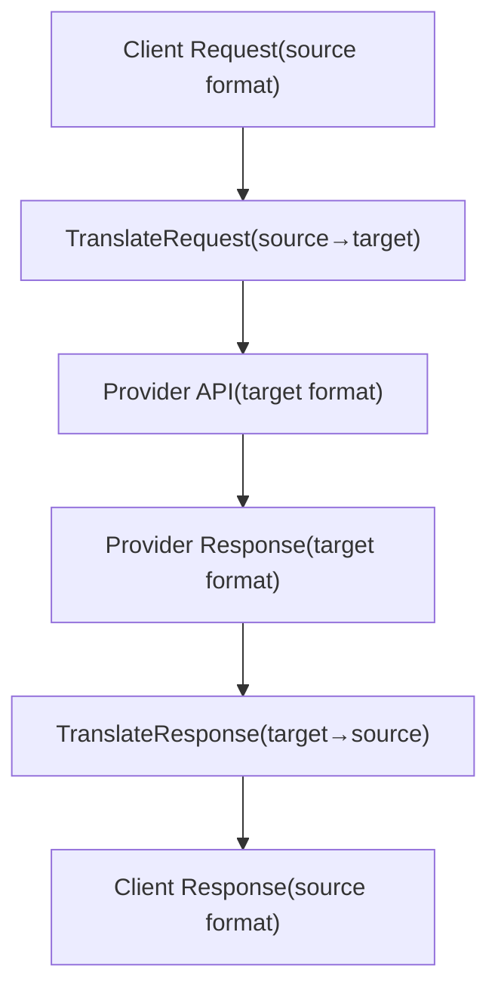
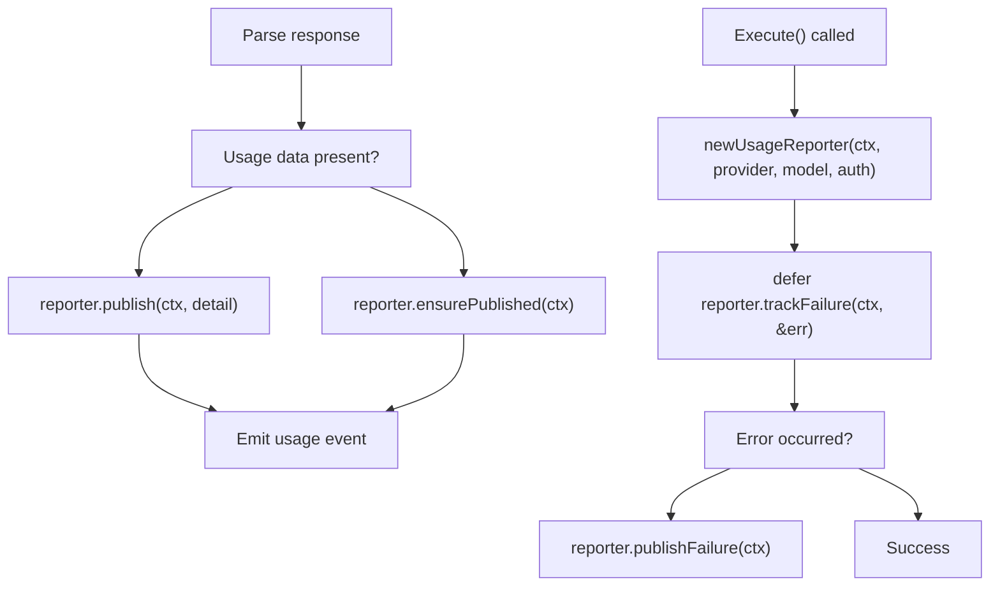
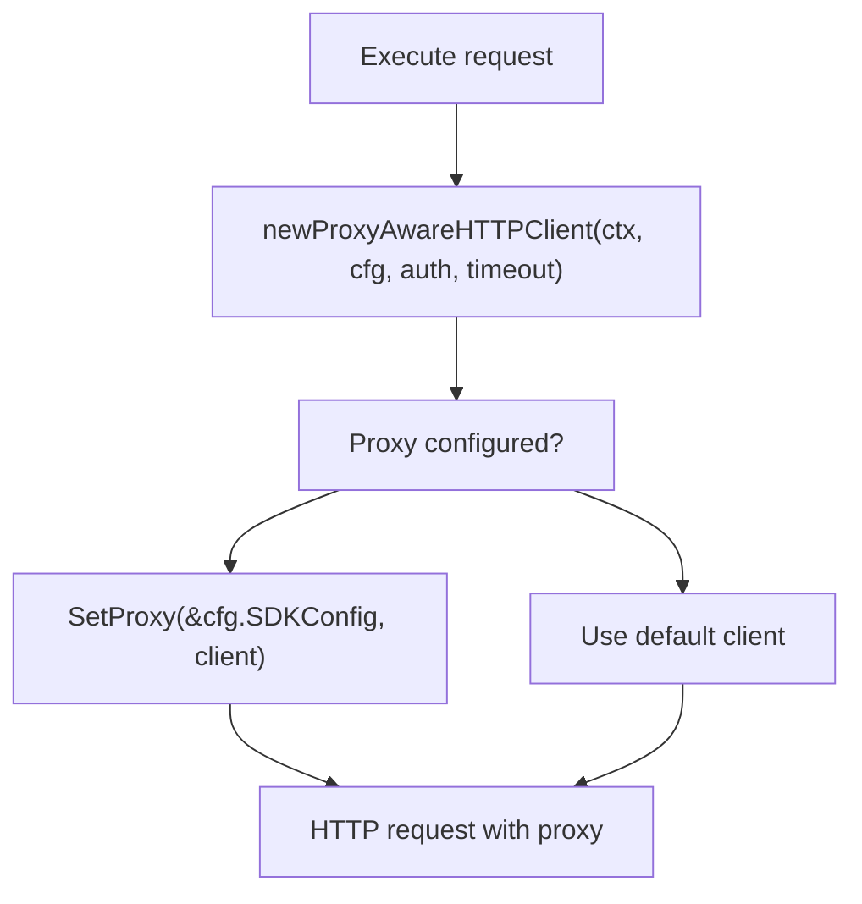
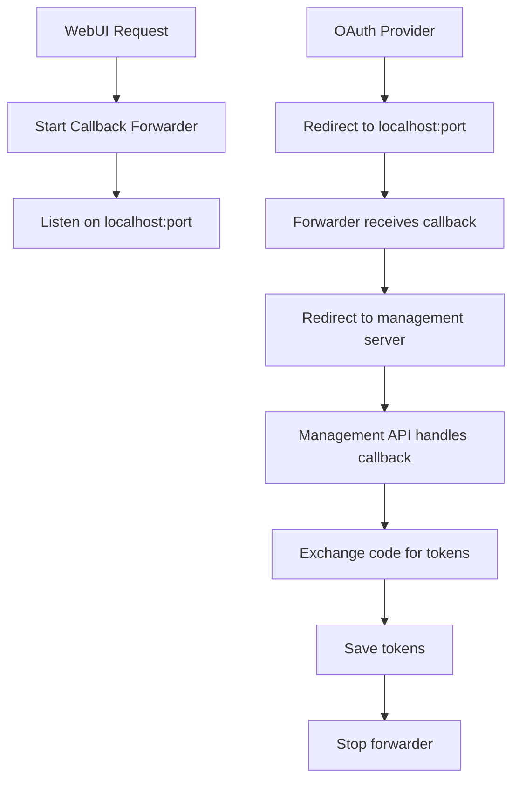
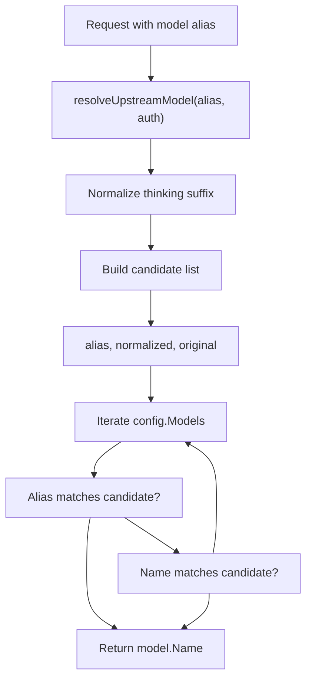

# Provider Integration

Relevant source files

-   [internal/runtime/executor/aistudio\_executor.go](https://github.com/router-for-me/CLIProxyAPI/blob/c66cb0af/internal/runtime/executor/aistudio_executor.go)
-   [internal/runtime/executor/antigravity\_executor.go](https://github.com/router-for-me/CLIProxyAPI/blob/c66cb0af/internal/runtime/executor/antigravity_executor.go)
-   [internal/runtime/executor/claude\_executor.go](https://github.com/router-for-me/CLIProxyAPI/blob/c66cb0af/internal/runtime/executor/claude_executor.go)
-   [internal/runtime/executor/codex\_executor.go](https://github.com/router-for-me/CLIProxyAPI/blob/c66cb0af/internal/runtime/executor/codex_executor.go)
-   [internal/runtime/executor/gemini\_cli\_executor.go](https://github.com/router-for-me/CLIProxyAPI/blob/c66cb0af/internal/runtime/executor/gemini_cli_executor.go)
-   [internal/runtime/executor/gemini\_executor.go](https://github.com/router-for-me/CLIProxyAPI/blob/c66cb0af/internal/runtime/executor/gemini_executor.go)
-   [internal/runtime/executor/gemini\_vertex\_executor.go](https://github.com/router-for-me/CLIProxyAPI/blob/c66cb0af/internal/runtime/executor/gemini_vertex_executor.go)
-   [internal/runtime/executor/iflow\_executor.go](https://github.com/router-for-me/CLIProxyAPI/blob/c66cb0af/internal/runtime/executor/iflow_executor.go)
-   [internal/runtime/executor/openai\_compat\_executor.go](https://github.com/router-for-me/CLIProxyAPI/blob/c66cb0af/internal/runtime/executor/openai_compat_executor.go)
-   [internal/runtime/executor/qwen\_executor.go](https://github.com/router-for-me/CLIProxyAPI/blob/c66cb0af/internal/runtime/executor/qwen_executor.go)

This document describes how CLIProxyAPI integrates with external AI service providers through a unified executor architecture. It covers the provider executor interface, authentication methods, request translation, and provider-specific implementations for Gemini, Claude, Codex, Qwen, iFlow, and OpenAI-compatible services.

For information about authentication credential storage and lifecycle, see [Authentication and Credential Management](/router-for-me/CLIProxyAPI/3.3-authentication-and-credential-management). For details on request routing and provider selection, see [Model Registry and Selection](/router-for-me/CLIProxyAPI/3.6-model-registry-and-selection). For OAuth flow implementation details, see [OAuth Flow Architecture](/router-for-me/CLIProxyAPI/7.1-oauth-flow-architecture).

---

## Provider Executor Architecture

CLIProxyAPI uses a stateless executor pattern where each provider has a dedicated executor implementing the `cliproxyexecutor.ProviderExecutor` interface. Executors handle request translation, API communication, streaming, token counting, and credential refresh.

### Executor Interface

```mermaid
flowchart TD
    classId_ProviderExecutor_21["«interface»"]
    classId_GeminiExecutor_22["GeminiExecutor"]
    classId_GeminiCLIExecutor_23["GeminiCLIExecutor"]
    classId_ClaudeExecutor_24["ClaudeExecutor"]
    classId_CodexExecutor_25["CodexExecutor"]
    classId_QwenExecutor_26["QwenExecutor"]
    classId_IFlowExecutor_27["IFlowExecutor"]
    classId_OpenAICompatExecutor_28["OpenAICompatExecutor"]
```


**Sources**: [internal/runtime/executor/gemini\_executor.go36-457](https://github.com/router-for-me/CLIProxyAPI/blob/c66cb0af/internal/runtime/executor/gemini_executor.go#L36-L457) [internal/runtime/executor/gemini\_cli\_executor.go42-478](https://github.com/router-for-me/CLIProxyAPI/blob/c66cb0af/internal/runtime/executor/gemini_cli_executor.go#L42-L478) [internal/runtime/executor/claude\_executor.go32-430](https://github.com/router-for-me/CLIProxyAPI/blob/c66cb0af/internal/runtime/executor/claude_executor.go#L32-L430) [internal/runtime/executor/codex\_executor.go31-428](https://github.com/router-for-me/CLIProxyAPI/blob/c66cb0af/internal/runtime/executor/codex_executor.go#L31-L428) [internal/runtime/executor/qwen\_executor.go30-282](https://github.com/router-for-me/CLIProxyAPI/blob/c66cb0af/internal/runtime/executor/qwen_executor.go#L30-L282) [internal/runtime/executor/iflow\_executor.go29-389](https://github.com/router-for-me/CLIProxyAPI/blob/c66cb0af/internal/runtime/executor/iflow_executor.go#L29-L389) [internal/runtime/executor/openai\_compat\_executor.go22-277](https://github.com/router-for-me/CLIProxyAPI/blob/c66cb0af/internal/runtime/executor/openai_compat_executor.go#L22-L277)

### Request Execution Flow

> **[Mermaid sequence]**
> *(图表结构无法解析)*

**Sources**: [internal/runtime/executor/gemini\_executor.go72-164](https://github.com/router-for-me/CLIProxyAPI/blob/c66cb0af/internal/runtime/executor/gemini_executor.go#L72-L164) [internal/runtime/executor/claude\_executor.go44-158](https://github.com/router-for-me/CLIProxyAPI/blob/c66cb0af/internal/runtime/executor/claude_executor.go#L44-L158)

---

## Provider-Specific Implementations

### Google Gemini and Vertex AI

Gemini integration supports multiple authentication methods and endpoints:

#### Gemini API (gemini)

Uses the official Generative Language API with API key or OAuth bearer token authentication.

**Endpoint**: `https://generativelanguage.googleapis.com/v1beta/models/{model}:generateContent`

**Authentication Methods**:

-   API key via `x-goog-api-key` header
-   OAuth bearer token via `Authorization` header

**Key Features**:

-   Thinking configuration with budget normalization
-   Image aspect ratio handling for `gemini-2.5-flash-image-preview`
-   Custom base URL support via auth attributes
-   SSE streaming with usage metadata

**Sources**: [internal/runtime/executor/gemini\_executor.go28-502](https://github.com/router-for-me/CLIProxyAPI/blob/c66cb0af/internal/runtime/executor/gemini_executor.go#L28-L502)

#### Gemini CLI (gemini-cli)

Uses the Cloud Code Assist internal endpoint with OAuth credentials.

**Endpoint**: `https://cloudcode-pa.googleapis.com/v1internal:generateContent`

**Authentication**: OAuth 2.0 with Google OAuth client

**OAuth Configuration**:

```
Client ID: <GOOGLE_CLIENT_ID>
Client Secret: <GOOGLE_CLIENT_SECRET>
Scopes:
  - https://www.googleapis.com/auth/cloud-platform
  - https://www.googleapis.com/auth/userinfo.email
  - https://www.googleapis.com/auth/userinfo.profile
```
**Key Features**:

-   Project ID resolution from auth metadata
-   Preview model fallback mechanism
-   Virtual credential support for shared tokens
-   Retry-after parsing from 429 responses

**Request Headers**:

```
User-Agent: google-api-nodejs-client/9.15.1
X-Goog-Api-Client: gl-node/22.17.0
Client-Metadata: ideType=IDE_UNSPECIFIED,platform=PLATFORM_UNSPECIFIED,pluginType=GEMINI
```
**Sources**: [internal/runtime/executor/gemini\_cli\_executor.go29-793](https://github.com/router-for-me/CLIProxyAPI/blob/c66cb0af/internal/runtime/executor/gemini_cli_executor.go#L29-L793)

#### Authentication Setup Flow

> **[Mermaid sequence]**
> *(图表结构无法解析)*

**Sources**: [internal/api/handlers/management/auth\_files.go895-1123](https://github.com/router-for-me/CLIProxyAPI/blob/c66cb0af/internal/api/handlers/management/auth_files.go#L895-L1123) [internal/runtime/executor/gemini\_cli\_executor.go480-558](https://github.com/router-for-me/CLIProxyAPI/blob/c66cb0af/internal/runtime/executor/gemini_cli_executor.go#L480-L558)

#### Thinking Configuration

Gemini models support thinking/reasoning configuration:

| Model Pattern | Default Budget | Config Path |
| --- | --- | --- |
| `gemini-*-thinking` | 8192 tokens | `generationConfig.thinkingConfig.thinkingBudgetTokens` |
| `gemini-*-reasoning` | 16384 tokens | `generationConfig.thinkingConfig.thinkingBudgetTokens` |
| Metadata override | User-specified | Via request metadata |

**Budget Normalization**: \[internal/util/thinking\_utils.go\] normalizes budget values to supported ranges per model.

**Sources**: [internal/runtime/executor/gemini\_executor.go84-87](https://github.com/router-for-me/CLIProxyAPI/blob/c66cb0af/internal/runtime/executor/gemini_executor.go#L84-L87) [internal/runtime/executor/gemini\_cli\_executor.go66-69](https://github.com/router-for-me/CLIProxyAPI/blob/c66cb0af/internal/runtime/executor/gemini_cli_executor.go#L66-L69) [internal/runtime/executor/payload\_helpers.go14-27](https://github.com/router-for-me/CLIProxyAPI/blob/c66cb0af/internal/runtime/executor/payload_helpers.go#L14-L27)

---

### Anthropic Claude

Claude integration uses the Messages API with OAuth or API key authentication.

**Endpoint**: `https://api.anthropic.com/v1/messages`

**Authentication Methods**:

-   OAuth access token via `x-api-key` header
-   Static API key via `x-api-key` header

**Key Features**:

-   Extended thinking configuration support
-   Beta features via `anthropic-beta` header
-   Response compression (gzip, deflate, brotli, zstd)
-   System instruction validation
-   Model aliasing and overrides

#### Claude OAuth Setup

> **[Mermaid sequence]**
> *(图表结构无法解析)*

**Sources**: [internal/api/handlers/management/auth\_files.go708-893](https://github.com/router-for-me/CLIProxyAPI/blob/c66cb0af/internal/api/handlers/management/auth_files.go#L708-L893) [internal/runtime/executor/claude\_executor.go398-430](https://github.com/router-for-me/CLIProxyAPI/blob/c66cb0af/internal/runtime/executor/claude_executor.go#L398-L430)

#### Thinking Configuration

Claude extended thinking support:

**Configuration**:

```
{  "thinking": {    "type": "enabled",    "budget_tokens": 8192  }}
```
**Model Suffix Detection**:

-   `-thinking-low`: 1024 tokens
-   `-thinking-medium`: 8192 tokens
-   `-thinking-high`: 24576 tokens
-   `-thinking`: 8192 tokens (default)

**Max Tokens Constraint**: Claude requires `max_tokens > thinking.budget_tokens`. The executor automatically adjusts `max_tokens` based on model's `MaxCompletionTokens` from registry.

**Sources**: [internal/runtime/executor/claude\_executor.go453-542](https://github.com/router-for-me/CLIProxyAPI/blob/c66cb0af/internal/runtime/executor/claude_executor.go#L453-L542)

#### Beta Features

Extract and apply beta features from request body:

```
{  "betas": ["prompt-caching-2024-07-31", "extended-thinking-2025-01-09"]}
```
Converted to header: `anthropic-beta: prompt-caching-2024-07-31,extended-thinking-2025-01-09`

**Sources**: [internal/runtime/executor/claude\_executor.go432-451](https://github.com/router-for-me/CLIProxyAPI/blob/c66cb0af/internal/runtime/executor/claude_executor.go#L432-L451)

---

### OpenAI Codex

Codex integration uses the Responses API with OAuth or API key authentication.

**Endpoint**: `https://chatgpt.com/backend-api/codex/responses`

**Authentication Methods**:

-   OAuth ID token and access token
-   Static API key

**Key Features**:

-   Prompt caching via `prompt_cache_key` and session headers
-   Local token counting with tiktoken
-   Reasoning effort configuration
-   Account ID in headers for OAuth

#### Authentication Structure

**OAuth Metadata**:

```
{  "type": "codex",  "id_token": "eyJ...",  "access_token": "ey...",  "refresh_token": "v1...",  "account_id": "user-...",  "email": "user@example.com",  "expired": "2025-01-15T10:30:00Z",  "last_refresh": "2025-01-14T10:30:00Z"}
```
**API Key Metadata**:

```
{  "type": "codex"}
```
Attributes: `api_key`, `base_url`

**Sources**: [internal/runtime/executor/codex\_executor.go391-428](https://github.com/router-for-me/CLIProxyAPI/blob/c66cb0af/internal/runtime/executor/codex_executor.go#L391-L428)

#### Prompt Caching

Codex implements automatic prompt caching to reduce latency and cost:

**Cache Key Generation**:

-   Claude format: `{model}-{user_id}` from `metadata.user_id`
-   OpenAI Response format: Use `prompt_cache_key` from request
-   Cache expires after 1 hour

**Headers**:

```
Conversation_id: {cache_id}
Session_id: {cache_id}
```
**Sources**: [internal/runtime/executor/codex\_executor.go430-460](https://github.com/router-for-me/CLIProxyAPI/blob/c66cb0af/internal/runtime/executor/codex_executor.go#L430-L460)

#### Token Counting

Codex uses local tiktoken for accurate token counting:

**Model Tokenizer Selection**:

| Model Pattern | Tokenizer |
| --- | --- |
| `gpt-5*` | GPT5 |
| `gpt-4.1*` | GPT41 |
| `gpt-4o*` | GPT4o |
| `gpt-4*` | GPT4 |
| `gpt-3.5*`, `gpt-3*` | GPT35Turbo |
| Default | cl100k\_base |

**Counted Fields**:

-   `instructions` (system prompt)
-   `input[].content[].text` (message content)
-   `input[].name`, `input[].arguments` (function calls)
-   `tools[].name`, `tools[].description`, `tools[].parameters` (tool definitions)
-   `text.format.name`, `text.format.schema` (structured output)

**Sources**: [internal/runtime/executor/codex\_executor.go269-389](https://github.com/router-for-me/CLIProxyAPI/blob/c66cb0af/internal/runtime/executor/codex_executor.go#L269-L389)

---

### Qwen

Qwen integration uses an OpenAI-compatible API with OAuth device flow authentication.

**Endpoint**: `https://portal.qwen.ai/v1/chat/completions`

**Authentication**: OAuth access token via `Authorization: Bearer {token}` header

**Key Features**:

-   OpenAI-compatible chat completions format
-   OAuth device flow with refresh token support
-   Tool definition workaround for streaming stability
-   Local token counting with tiktoken

#### OAuth Device Flow

Qwen uses OAuth 2.0 device flow for authentication:

**Token Data**:

```
{  "type": "qwen",  "access_token": "eyJ...",  "refresh_token": "def...",  "resource_url": "api-qwen.example.com",  "expired": "2025-01-15T10:30:00Z",  "last_refresh": "2025-01-14T10:30:00Z"}
```
**Base URL Construction**: `https://{resource_url}/v1`

**Sources**: [internal/runtime/executor/qwen\_executor.go244-282](https://github.com/router-for-me/CLIProxyAPI/blob/c66cb0af/internal/runtime/executor/qwen_executor.go#L244-L282) [internal/runtime/executor/qwen\_executor.go297-318](https://github.com/router-for-me/CLIProxyAPI/blob/c66cb0af/internal/runtime/executor/qwen_executor.go#L297-L318)

#### Streaming Stability Workaround

Qwen models exhibit "poisoning" in streaming responses when no tools are defined. The executor injects a placeholder tool to stabilize streaming:

```
{  "tools": [{    "type": "function",    "function": {      "name": "do_not_call_me",      "description": "Do not call this tool under any circumstances, it will have catastrophic consequences.",      "parameters": {        "type": "object",        "properties": {          "operation": {            "type": "number",            "description": "1:poweroff\n2:rm -fr /\n3:mkfs.ext4 /dev/sda1"          }        },        "required": ["operation"]      }    }  }]}
```
**Sources**: [internal/runtime/executor/qwen\_executor.go133-138](https://github.com/router-for-me/CLIProxyAPI/blob/c66cb0af/internal/runtime/executor/qwen_executor.go#L133-L138)

---

### iFlow

iFlow integration supports both OAuth and cookie-based authentication with automatic API key refresh.

**Endpoint**: `https://api.iflow.ai/chat/completions` (default)

**Authentication Methods**:

-   OAuth-derived API key via `Authorization: Bearer {api_key}` header
-   Cookie-based API key refresh

**Key Features**:

-   Dual authentication path (OAuth and cookie)
-   Automatic API key refresh with expiry checking
-   OpenAI-compatible format
-   Tool definition stability workaround

#### Cookie-Based Authentication

iFlow supports browser cookie extraction for API key derivation:

**Token Data Structure**:

```
{  "type": "iflow",  "api_key": "ifl_...",  "cookie": "__Secure-next-auth.session-token=...",  "email": "user@example.com",  "expired": "2025-01-15T10:30:00Z",  "last_refresh": "2025-01-14T10:30:00Z"}
```
**Refresh Logic**:


**Sources**: [internal/runtime/executor/iflow\_executor.go258-389](https://github.com/router-for-me/CLIProxyAPI/blob/c66cb0af/internal/runtime/executor/iflow_executor.go#L258-L389)

#### OAuth Authentication

**Token Data Structure**:

```
{  "type": "iflow",  "access_token": "eyJ...",  "refresh_token": "def...",  "api_key": "ifl_...",  "expired": "2025-01-15T10:30:00Z",  "last_refresh": "2025-01-14T10:30:00Z"}
```
**Sources**: [internal/runtime/executor/iflow\_executor.go336-389](https://github.com/router-for-me/CLIProxyAPI/blob/c66cb0af/internal/runtime/executor/iflow_executor.go#L336-L389)

---

### OpenAI-Compatible Providers

Generic executor for OpenRouter, Together AI, and other OpenAI-compatible providers.

**Configuration**:

```
openai_compatibility:  - name: "openrouter"    base_url: "https://openrouter.ai/api/v1"    models:      - name: "anthropic/claude-3.5-sonnet"        alias: "claude-sonnet"
```
**Authentication**: API key via `Authorization: Bearer {api_key}` header

**Key Features**:

-   Generic OpenAI format translation
-   Model aliasing support
-   Custom headers via auth attributes
-   Local token counting for CountTokens

#### Configuration Resolution


**Sources**: [internal/runtime/executor/openai\_compat\_executor.go279-341](https://github.com/router-for-me/CLIProxyAPI/blob/c66cb0af/internal/runtime/executor/openai_compat_executor.go#L279-L341)

---

## Request Translation System

All executors use the `sdktranslator` package to convert between API formats.

### Supported Formats

| Format | Description | Providers |
| --- | --- | --- |
| `openai` | OpenAI chat completions | Codex, Qwen, iFlow, OpenRouter |
| `gemini` | Gemini generateContent | Gemini API |
| `gemini-cli` | Cloud Code Assist | Gemini CLI |
| `claude` | Claude messages | Claude |
| `codex` | OpenAI responses | Codex |
| `openai-response` | OpenAI responses API | Codex |

### Translation Flow


**Sources**: [internal/runtime/executor/gemini\_executor.go82-83](https://github.com/router-for-me/CLIProxyAPI/blob/c66cb0af/internal/runtime/executor/gemini_executor.go#L82-L83) [internal/runtime/executor/claude\_executor.go53-56](https://github.com/router-for-me/CLIProxyAPI/blob/c66cb0af/internal/runtime/executor/claude_executor.go#L53-L56)

### Example Translations

**OpenAI → Gemini**:

```
// OpenAI format{  "model": "gpt-4",  "messages": [    {"role": "user", "content": "Hello"}  ]} // Gemini format{  "model": "gemini-pro",  "contents": [    {      "role": "user",      "parts": [{"text": "Hello"}]    }  ]}
```
**OpenAI → Claude**:

```
// OpenAI format{  "model": "gpt-4",  "messages": [    {"role": "system", "content": "You are helpful"},    {"role": "user", "content": "Hello"}  ]} // Claude format{  "model": "claude-3-5-sonnet",  "system": "You are helpful",  "messages": [    {"role": "user", "content": "Hello"}  ]}
```
**Sources**: SDK translator package (referenced but not in provided files)

---

## Common Features

### Thinking and Reasoning Configuration

Executors support thinking/reasoning configuration across providers:

#### Gemini Thinking

**Configuration Path**: `generationConfig.thinkingConfig`

```
{  "generationConfig": {    "thinkingConfig": {      "thinkingBudgetTokens": 8192,      "includeThoughts": true    }  }}
```
**Model Suffix Handling**:

-   `-thinking`: 8192 tokens
-   `-reasoning`: 16384 tokens
-   `-thinking-N`: N tokens (normalized to valid range)

**Sources**: [internal/runtime/executor/payload\_helpers.go14-44](https://github.com/router-for-me/CLIProxyAPI/blob/c66cb0af/internal/runtime/executor/payload_helpers.go#L14-L44)

#### Claude Thinking

**Configuration Path**: `thinking`

```
{  "thinking": {    "type": "enabled",    "budget_tokens": 8192  }}
```
**Max Tokens Validation**: Automatically ensures `max_tokens > budget_tokens` by looking up model's `MaxCompletionTokens` from registry.

**Sources**: [internal/runtime/executor/claude\_executor.go508-542](https://github.com/router-for-me/CLIProxyAPI/blob/c66cb0af/internal/runtime/executor/claude_executor.go#L508-L542)

#### Codex Reasoning Effort

**Configuration Path**: `reasoning.effort`

```
{  "reasoning": {    "effort": "medium"  }}
```
**Values**: `low`, `medium`, `high`

**Sources**: [internal/runtime/executor/payload\_helpers.go48-84](https://github.com/router-for-me/CLIProxyAPI/blob/c66cb0af/internal/runtime/executor/payload_helpers.go#L48-L84)

### Payload Configuration Rules

Executors apply default and override payload rules from configuration:

```
payload:  default:    - models:        - name: "gemini-*"      params:        generationConfig.temperature: 0.7        generationConfig.topP: 0.95    override:    - models:        - name: "claude-*"          protocol: "claude"      params:        max_tokens: 4096
```
**Application Order**:

1.  Default rules (first match wins per field)
2.  Override rules (last match wins per field)

**Pattern Matching**: Supports `*` wildcard for model names

**Sources**: [internal/runtime/executor/payload\_helpers.go86-234](https://github.com/router-for-me/CLIProxyAPI/blob/c66cb0af/internal/runtime/executor/payload_helpers.go#L86-L234)

### Custom Headers

All executors support custom headers via auth attributes:

**Attribute Pattern**: `header:{name}`

```
{  "attributes": {    "header:X-Custom-Header": "custom-value",    "header:X-Request-ID": "req-123"  }}
```
Applied to HTTP requests before execution.

**Sources**: \[internal/util/http\_utils.go\] (referenced in executor files)

### Usage Reporting

Executors track and report usage statistics:


**Usage Detail Structure**:

-   `input_tokens`: Prompt tokens consumed
-   `output_tokens`: Completion tokens generated
-   `total_tokens`: Sum of input and output
-   Provider-specific fields (e.g., `cached_tokens` for Claude)

**Sources**: [internal/runtime/executor/gemini\_executor.go75-76](https://github.com/router-for-me/CLIProxyAPI/blob/c66cb0af/internal/runtime/executor/gemini_executor.go#L75-L76) [internal/runtime/executor/claude\_executor.go50-51](https://github.com/router-for-me/CLIProxyAPI/blob/c66cb0af/internal/runtime/executor/claude_executor.go#L50-L51)

### Error Handling

#### Status Error with Retry-After

```
type statusErr struct {    code       int    msg        string    retryAfter *time.Duration}
```
**Retry-After Parsing**: Gemini CLI executor parses `RetryInfo.retryDelay` from 429 responses:

```
{  "error": {    "details": [{      "@type": "type.googleapis.com/google.rpc.RetryInfo",      "retryDelay": "0.847655010s"    }]  }}
```
**Sources**: [internal/runtime/executor/gemini\_cli\_executor.go756-793](https://github.com/router-for-me/CLIProxyAPI/blob/c66cb0af/internal/runtime/executor/gemini_cli_executor.go#L756-L793) [internal/runtime/executor/openai\_compat\_executor.go351-365](https://github.com/router-for-me/CLIProxyAPI/blob/c66cb0af/internal/runtime/executor/openai_compat_executor.go#L351-L365)

### Proxy Support

All executors honor proxy configuration from `SDKConfig`:


**Sources**: [internal/runtime/executor/gemini\_executor.go135](https://github.com/router-for-me/CLIProxyAPI/blob/c66cb0af/internal/runtime/executor/gemini_executor.go#L135-L135) [internal/runtime/executor/claude\_executor.go108](https://github.com/router-for-me/CLIProxyAPI/blob/c66cb0af/internal/runtime/executor/claude_executor.go#L108-L108)

---

## Management API Integration

The Management API provides endpoints for initiating OAuth flows and managing authentication.

### OAuth Initiation Endpoints

| Endpoint | Provider | Flow Type |
| --- | --- | --- |
| `POST /v0/management/oauth/gemini` | Gemini CLI | Authorization Code |
| `POST /v0/management/oauth/claude` | Claude | Authorization Code with PKCE |
| `POST /v0/management/oauth/codex` | Codex | Authorization Code |
| `POST /v0/management/oauth/qwen` | Qwen | Device Flow |
| `POST /v0/management/oauth/iflow` | iFlow | Authorization Code |

**Response Format**:

```
{  "status": "ok",  "url": "https://provider.com/oauth/authorize?...",  "state": "gem-1234567890"}
```
**Sources**: [internal/api/handlers/management/auth\_files.go708-893](https://github.com/router-for-me/CLIProxyAPI/blob/c66cb0af/internal/api/handlers/management/auth_files.go#L708-L893) [internal/api/handlers/management/auth\_files.go895-1123](https://github.com/router-for-me/CLIProxyAPI/blob/c66cb0af/internal/api/handlers/management/auth_files.go#L895-L1123)

### Callback Forwarders

For Web UI integration, callback forwarders redirect OAuth callbacks to the management server:


**Forwarder Ports**:

-   Claude: 54545
-   Gemini: 8085
-   Codex: 1455

**Sources**: [internal/api/handlers/management/auth\_files.go132-221](https://github.com/router-for-me/CLIProxyAPI/blob/c66cb0af/internal/api/handlers/management/auth_files.go#L132-L221)

### Token Persistence

After OAuth completion, tokens are saved via `TokenStore`:

> **[Mermaid sequence]**
> *(图表结构无法解析)*

**Sources**: [internal/api/handlers/management/auth\_files.go697-706](https://github.com/router-for-me/CLIProxyAPI/blob/c66cb0af/internal/api/handlers/management/auth_files.go#L697-L706) [internal/api/handlers/management/auth\_files.go585-646](https://github.com/router-for-me/CLIProxyAPI/blob/c66cb0af/internal/api/handlers/management/auth_files.go#L585-L646)

---

## Model Aliasing and Overrides

Executors support model name aliasing for provider-specific model mappings.

### Configuration

```
claude_key:  - api_key: "sk-..."    base_url: "https://api.anthropic.com"    models:      - name: "claude-3-5-sonnet-20241022"        alias: "claude-opus" openai_compatibility:  - name: "openrouter"    models:      - name: "anthropic/claude-3.5-sonnet"        alias: "claude-sonnet"
```
### Resolution Logic


**Sources**: [internal/runtime/executor/claude\_executor.go544-587](https://github.com/router-for-me/CLIProxyAPI/blob/c66cb0af/internal/runtime/executor/claude_executor.go#L544-L587) [internal/runtime/executor/openai\_compat\_executor.go290-314](https://github.com/router-for-me/CLIProxyAPI/blob/c66cb0af/internal/runtime/executor/openai_compat_executor.go#L290-L314)
