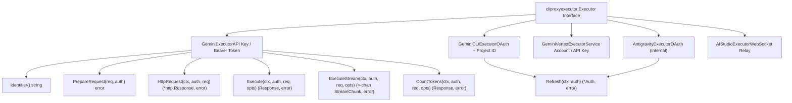
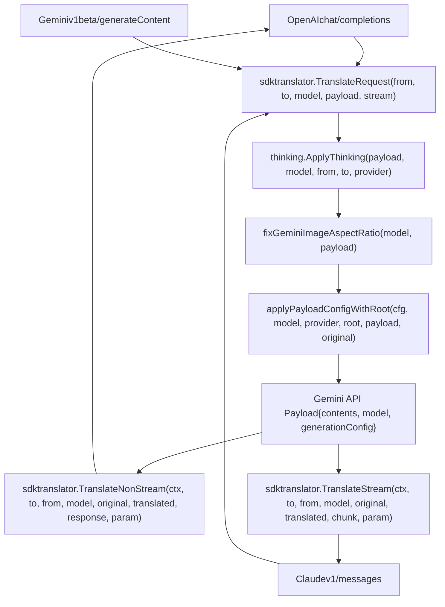

# Google Gemini and Vertex AI

Relevant source files

-   [internal/auth/claude/token.go](https://github.com/router-for-me/CLIProxyAPI/blob/c66cb0af/internal/auth/claude/token.go)
-   [internal/auth/codex/token.go](https://github.com/router-for-me/CLIProxyAPI/blob/c66cb0af/internal/auth/codex/token.go)
-   [internal/auth/gemini/gemini\_token.go](https://github.com/router-for-me/CLIProxyAPI/blob/c66cb0af/internal/auth/gemini/gemini_token.go)
-   [internal/auth/iflow/iflow\_token.go](https://github.com/router-for-me/CLIProxyAPI/blob/c66cb0af/internal/auth/iflow/iflow_token.go)
-   [internal/auth/kimi/token.go](https://github.com/router-for-me/CLIProxyAPI/blob/c66cb0af/internal/auth/kimi/token.go)
-   [internal/auth/qwen/qwen\_token.go](https://github.com/router-for-me/CLIProxyAPI/blob/c66cb0af/internal/auth/qwen/qwen_token.go)
-   [internal/misc/credentials.go](https://github.com/router-for-me/CLIProxyAPI/blob/c66cb0af/internal/misc/credentials.go)
-   [internal/runtime/executor/aistudio\_executor.go](https://github.com/router-for-me/CLIProxyAPI/blob/c66cb0af/internal/runtime/executor/aistudio_executor.go)
-   [internal/runtime/executor/antigravity\_executor.go](https://github.com/router-for-me/CLIProxyAPI/blob/c66cb0af/internal/runtime/executor/antigravity_executor.go)
-   [internal/runtime/executor/claude\_executor.go](https://github.com/router-for-me/CLIProxyAPI/blob/c66cb0af/internal/runtime/executor/claude_executor.go)
-   [internal/runtime/executor/codex\_executor.go](https://github.com/router-for-me/CLIProxyAPI/blob/c66cb0af/internal/runtime/executor/codex_executor.go)
-   [internal/runtime/executor/gemini\_cli\_executor.go](https://github.com/router-for-me/CLIProxyAPI/blob/c66cb0af/internal/runtime/executor/gemini_cli_executor.go)
-   [internal/runtime/executor/gemini\_executor.go](https://github.com/router-for-me/CLIProxyAPI/blob/c66cb0af/internal/runtime/executor/gemini_executor.go)
-   [internal/runtime/executor/gemini\_vertex\_executor.go](https://github.com/router-for-me/CLIProxyAPI/blob/c66cb0af/internal/runtime/executor/gemini_vertex_executor.go)
-   [internal/runtime/executor/iflow\_executor.go](https://github.com/router-for-me/CLIProxyAPI/blob/c66cb0af/internal/runtime/executor/iflow_executor.go)
-   [internal/runtime/executor/openai\_compat\_executor.go](https://github.com/router-for-me/CLIProxyAPI/blob/c66cb0af/internal/runtime/executor/openai_compat_executor.go)
-   [internal/runtime/executor/qwen\_executor.go](https://github.com/router-for-me/CLIProxyAPI/blob/c66cb0af/internal/runtime/executor/qwen_executor.go)
-   [internal/translator/antigravity/openai/chat-completions/antigravity\_openai\_request.go](https://github.com/router-for-me/CLIProxyAPI/blob/c66cb0af/internal/translator/antigravity/openai/chat-completions/antigravity_openai_request.go)
-   [internal/translator/gemini-cli/claude/gemini-cli\_claude\_request.go](https://github.com/router-for-me/CLIProxyAPI/blob/c66cb0af/internal/translator/gemini-cli/claude/gemini-cli_claude_request.go)
-   [internal/translator/gemini-cli/openai/chat-completions/gemini-cli\_openai\_request.go](https://github.com/router-for-me/CLIProxyAPI/blob/c66cb0af/internal/translator/gemini-cli/openai/chat-completions/gemini-cli_openai_request.go)
-   [internal/translator/gemini/claude/gemini\_claude\_request.go](https://github.com/router-for-me/CLIProxyAPI/blob/c66cb0af/internal/translator/gemini/claude/gemini_claude_request.go)
-   [internal/translator/gemini/openai/chat-completions/gemini\_openai\_request.go](https://github.com/router-for-me/CLIProxyAPI/blob/c66cb0af/internal/translator/gemini/openai/chat-completions/gemini_openai_request.go)
-   [internal/translator/gemini/openai/responses/gemini\_openai-responses\_request.go](https://github.com/router-for-me/CLIProxyAPI/blob/c66cb0af/internal/translator/gemini/openai/responses/gemini_openai-responses_request.go)

This page documents integration with Google Gemini and Vertex AI services, including authentication methods, executor implementations, OAuth flows, and provider-specific features. CLIProxyAPI supports multiple Gemini access patterns: API key-based Generative Language API, OAuth-based Gemini CLI (Cloud Code Assist), Vertex AI with service accounts or API keys, Antigravity (internal Google service), and WebSocket-based AI Studio.

For general provider integration concepts, see [Provider Integration](/router-for-me/CLIProxyAPI/6-provider-integration). For authentication management, see [Authentication Flows](/router-for-me/CLIProxyAPI/7-authentication-flows). For OAuth-specific setup across all providers, see [Provider-Specific OAuth Setup](/router-for-me/CLIProxyAPI/7.2-provider-specific-oauth-setup).

---

## Authentication Methods

CLIProxyAPI supports five distinct authentication patterns for accessing Google Gemini models, each with different endpoints, capabilities, and credential requirements.

### Authentication Pattern Overview

```mermaid
flowchart TD
    APIKey["API Key(Generative Language API)"]
    OAuth["OAuth Bearer Token(Gemini CLI)"]
    ServiceAccount["Service Account(Vertex AI)"]
    VertexAPIKey["Vertex API Key(Vertex AI)"]
    WebSocket["WebSocket Channel(AI Studio)"]
    GeminiExec["GeminiExecutorinternal/runtime/executor/gemini_executor.go"]
    GeminiCLIExec["GeminiCLIExecutorinternal/runtime/executor/gemini_cli_executor.go"]
    VertexExec["GeminiVertexExecutorinternal/runtime/executor/gemini_vertex_executor.go"]
    AntigravityExec["AntigravityExecutorinternal/runtime/executor/antigravity_executor.go"]
    AIStudioExec["AIStudioExecutorinternal/runtime/executor/aistudio_executor.go"]
    GenLangAPI["generativelanguage.googleapis.com/v1beta/models"]
    CloudCodeAPI["cloudcode-pa.googleapis.com/v1internal"]
    VertexAPI["{location}-aiplatform.googleapis.com/v1/projects/{project}/locations"]
    AntigravityAPI["cloudcode-pa.googleapis.com/v1internal (Antigravity)"]
    WSRelay["WebSocket Relaywsrelay.Manager"]

    APIKey --> GeminiExec
    OAuth --> GeminiCLIExec
    ServiceAccount --> VertexExec
    VertexAPIKey --> VertexExec
    WebSocket --> AIStudioExec
    OAuth --> AntigravityExec
    GeminiExec --> GenLangAPI
    GeminiCLIExec --> CloudCodeAPI
    VertexExec --> VertexAPI
    AntigravityExec --> AntigravityAPI
    AIStudioExec --> WSRelay
```


**Sources:** [internal/runtime/executor/gemini\_executor.go26-43](https://github.com/router-for-me/CLIProxyAPI/blob/c66cb0af/internal/runtime/executor/gemini_executor.go#L26-L43) [internal/runtime/executor/gemini\_cli\_executor.go35-42](https://github.com/router-for-me/CLIProxyAPI/blob/c66cb0af/internal/runtime/executor/gemini_cli_executor.go#L35-L42) [internal/runtime/executor/gemini\_vertex\_executor.go30-33](https://github.com/router-for-me/CLIProxyAPI/blob/c66cb0af/internal/runtime/executor/gemini_vertex_executor.go#L30-L33) [internal/runtime/executor/antigravity\_executor.go38-49](https://github.com/router-for-me/CLIProxyAPI/blob/c66cb0af/internal/runtime/executor/antigravity_executor.go#L38-L49) [internal/runtime/executor/aistudio\_executor.go26-31](https://github.com/router-for-me/CLIProxyAPI/blob/c66cb0af/internal/runtime/executor/aistudio_executor.go#L26-L31)

### API Key Authentication (Generative Language API)

The `GeminiExecutor` uses API keys for the official Generative Language API. API keys are configured in `config.yaml` under `gemini_keys` or extracted from auth metadata.

| Feature | Value |
| --- | --- |
| Endpoint | `https://generativelanguage.googleapis.com` |
| API Version | `v1beta` |
| Header | `x-goog-api-key` |
| Identifier | `gemini` |

Credential resolution logic at [internal/runtime/executor/gemini\_executor.go373-384](https://github.com/router-for-me/CLIProxyAPI/blob/c66cb0af/internal/runtime/executor/gemini_executor.go#L373-L384):

-   Checks `auth.Attributes["api_key"]` first
-   Falls back to `auth.Metadata["access_token"]` for OAuth bearer tokens
-   Resolves custom base URL from `auth.Attributes["base_url"]`

**Sources:** [internal/runtime/executor/gemini\_executor.go52-57](https://github.com/router-for-me/CLIProxyAPI/blob/c66cb0af/internal/runtime/executor/gemini_executor.go#L52-L57) [internal/runtime/executor/gemini\_executor.go59-73](https://github.com/router-for-me/CLIProxyAPI/blob/c66cb0af/internal/runtime/executor/gemini_executor.go#L59-L73) [internal/runtime/executor/gemini\_executor.go373-384](https://github.com/router-for-me/CLIProxyAPI/blob/c66cb0af/internal/runtime/executor/gemini_executor.go#L373-L384)

### OAuth Bearer Token (Gemini CLI)

The `GeminiCLIExecutor` uses OAuth tokens obtained via Google Cloud Platform authentication for the Cloud Code Assist endpoint. This pattern requires project ID association and supports multi-project configurations.

| Feature | Value |
| --- | --- |
| Endpoint | `https://cloudcode-pa.googleapis.com` |
| API Version | `v1internal` |
| OAuth Client ID | `681255809395-oo8ft2oprdrnp9e3aqf6av3hmdib135j.apps.googleusercontent.com` |
| Scopes | `cloud-platform`, `userinfo.email`, `userinfo.profile` |
| Identifier | `gemini-cli` |

Token source preparation at [internal/runtime/executor/gemini\_cli\_executor.go460-498](https://github.com/router-for-me/CLIProxyAPI/blob/c66cb0af/internal/runtime/executor/gemini_cli_executor.go#L460-L498) creates an `oauth2.TokenSource` using refresh tokens stored in auth metadata. Access tokens are automatically refreshed when expired.

**Sources:** [internal/runtime/executor/gemini\_cli\_executor.go35-46](https://github.com/router-for-me/CLIProxyAPI/blob/c66cb0af/internal/runtime/executor/gemini_cli_executor.go#L35-L46) [internal/runtime/executor/gemini\_cli\_executor.go60-62](https://github.com/router-for-me/CLIProxyAPI/blob/c66cb0af/internal/runtime/executor/gemini_cli_executor.go#L60-L62) [internal/runtime/executor/gemini\_cli\_executor.go460-498](https://github.com/router-for-me/CLIProxyAPI/blob/c66cb0af/internal/runtime/executor/gemini_cli_executor.go#L460-L498)

### Service Account (Vertex AI)

The `GeminiVertexExecutor` supports Google Cloud service account credentials for Vertex AI. Service account JSON is stored in auth metadata under the `sa` key.

| Feature | Value |
| --- | --- |
| Endpoint | `https://{location}-aiplatform.googleapis.com` |
| API Version | `v1` |
| Default Location | `us-central1` |
| Scopes | `cloud-platform` |
| Identifier | `vertex` |

Access token generation at [internal/runtime/executor/gemini\_vertex\_executor.go701-722](https://github.com/router-for-me/CLIProxyAPI/blob/c66cb0af/internal/runtime/executor/gemini_vertex_executor.go#L701-L722) uses `google.CredentialsFromJSON` to create an OAuth2 token source from service account JSON.

**Sources:** [internal/runtime/executor/gemini\_vertex\_executor.go30-33](https://github.com/router-for-me/CLIProxyAPI/blob/c66cb0af/internal/runtime/executor/gemini_vertex_executor.go#L30-L33) [internal/runtime/executor/gemini\_vertex\_executor.go173-189](https://github.com/router-for-me/CLIProxyAPI/blob/c66cb0af/internal/runtime/executor/gemini_vertex_executor.go#L173-L189) [internal/runtime/executor/gemini\_vertex\_executor.go701-722](https://github.com/router-for-me/CLIProxyAPI/blob/c66cb0af/internal/runtime/executor/gemini_vertex_executor.go#L701-L722)

### Vertex API Key

Vertex AI also supports API key authentication as an alternative to service accounts. API keys are configured via `auth.Attributes["api_key"]` and `auth.Attributes["base_url"]`.

**Sources:** [internal/runtime/executor/gemini\_vertex\_executor.go236-249](https://github.com/router-for-me/CLIProxyAPI/blob/c66cb0af/internal/runtime/executor/gemini_vertex_executor.go#L236-L249) [internal/runtime/executor/gemini\_vertex\_executor.go678-699](https://github.com/router-for-me/CLIProxyAPI/blob/c66cb0af/internal/runtime/executor/gemini_vertex_executor.go#L678-L699)

### WebSocket Relay (AI Studio)

The `AIStudioExecutor` routes requests through a WebSocket relay (`wsrelay.Manager`) for the AI Studio provider. This enables runtime credential registration via WebSocket connections without file storage.

**Sources:** [internal/runtime/executor/aistudio\_executor.go26-44](https://github.com/router-for-me/CLIProxyAPI/blob/c66cb0af/internal/runtime/executor/aistudio_executor.go#L26-L44) [internal/runtime/executor/aistudio\_executor.go54-110](https://github.com/router-for-me/CLIProxyAPI/blob/c66cb0af/internal/runtime/executor/aistudio_executor.go#L54-L110)

---

## Executor Architecture

### Executor Hierarchy and Responsibilities


**Sources:** [internal/runtime/executor/gemini\_executor.go40-57](https://github.com/router-for-me/CLIProxyAPI/blob/c66cb0af/internal/runtime/executor/gemini_executor.go#L40-L57) [internal/runtime/executor/gemini\_cli\_executor.go48-65](https://github.com/router-for-me/CLIProxyAPI/blob/c66cb0af/internal/runtime/executor/gemini_cli_executor.go#L48-L65) [internal/runtime/executor/gemini\_vertex\_executor.go173-189](https://github.com/router-for-me/CLIProxyAPI/blob/c66cb0af/internal/runtime/executor/gemini_vertex_executor.go#L173-L189)

### GeminiExecutor Implementation

The `GeminiExecutor` handles the official Generative Language API with both API key and OAuth bearer token support.

**Key Features:**

-   Supports both `x-goog-api-key` and `Authorization: Bearer` headers
-   Translates requests to Gemini format via `sdktranslator.TranslateRequest`
-   Applies thinking configuration via `thinking.ApplyThinking`
-   Fixes image aspect ratios via `fixGeminiImageAspectRatio`
-   Applies payload config via `applyPayloadConfigWithRoot`
-   Filters SSE usage metadata via `FilterSSEUsageMetadata`
-   Tracks usage via `newUsageReporter`

Request processing flow at [internal/runtime/executor/gemini\_executor.go105-204](https://github.com/router-for-me/CLIProxyAPI/blob/c66cb0af/internal/runtime/executor/gemini_executor.go#L105-L204):

1.  Parse model suffix for thinking configuration
2.  Extract credentials (`apiKey` or `bearer`)
3.  Create usage reporter for token tracking
4.  Translate request from source format to Gemini format
5.  Apply thinking configuration
6.  Fix image aspect ratios (Gemini-specific)
7.  Apply payload configuration defaults/overrides
8.  Build HTTP request with credentials
9.  Execute request via `newProxyAwareHTTPClient`
10.  Parse usage metadata and translate response back

**Sources:** [internal/runtime/executor/gemini\_executor.go40-54](https://github.com/router-for-me/CLIProxyAPI/blob/c66cb0af/internal/runtime/executor/gemini_executor.go#L40-L54) [internal/runtime/executor/gemini\_executor.go59-73](https://github.com/router-for-me/CLIProxyAPI/blob/c66cb0af/internal/runtime/executor/gemini_executor.go#L59-L73) [internal/runtime/executor/gemini\_executor.go92-204](https://github.com/router-for-me/CLIProxyAPI/blob/c66cb0af/internal/runtime/executor/gemini_executor.go#L92-L204)

### GeminiCLIExecutor Implementation

The `GeminiCLIExecutor` handles OAuth-based Cloud Code Assist with automatic token refresh and project ID management.

**Key Features:**

-   Uses `oauth2.TokenSource` for automatic token refresh
-   Supports multi-project configurations via comma-separated `project_id`
-   Implements model fallback via `cliPreviewFallbackOrder`
-   Updates token metadata after each refresh
-   Handles rate limiting with automatic model fallback

Token management at [internal/runtime/executor/gemini\_cli\_executor.go460-498](https://github.com/router-for-me/CLIProxyAPI/blob/c66cb0af/internal/runtime/executor/gemini_cli_executor.go#L460-L498):

-   Creates `oauth2.Config` with Gemini OAuth credentials
-   Builds token from refresh token in metadata
-   Wraps in `oauth2.ReuseTokenSource` for caching
-   Updates `auth.Metadata` with new tokens after refresh

Model fallback logic at [internal/runtime/executor/gemini\_cli\_executor.go615-643](https://github.com/router-for-me/CLIProxyAPI/blob/c66cb0af/internal/runtime/executor/gemini_cli_executor.go#L615-L643):

-   Detects experimental preview models (e.g., `gemini-3-pro-preview`)
-   Returns fallback order: primary model → stable version → alternative models
-   Retries with next model on HTTP 429 (rate limit)

**Sources:** [internal/runtime/executor/gemini\_cli\_executor.go48-62](https://github.com/router-for-me/CLIProxyAPI/blob/c66cb0af/internal/runtime/executor/gemini_cli_executor.go#L48-L62) [internal/runtime/executor/gemini\_cli\_executor.go68-85](https://github.com/router-for-me/CLIProxyAPI/blob/c66cb0af/internal/runtime/executor/gemini_cli_executor.go#L68-L85) [internal/runtime/executor/gemini\_cli\_executor.go104-250](https://github.com/router-for-me/CLIProxyAPI/blob/c66cb0af/internal/runtime/executor/gemini_cli_executor.go#L104-L250) [internal/runtime/executor/gemini\_cli\_executor.go460-498](https://github.com/router-for-me/CLIProxyAPI/blob/c66cb0af/internal/runtime/executor/gemini_cli_executor.go#L460-L498) [internal/runtime/executor/gemini\_cli\_executor.go615-643](https://github.com/router-for-me/CLIProxyAPI/blob/c66cb0af/internal/runtime/executor/gemini_cli_executor.go#L615-L643)

### GeminiVertexExecutor Implementation

The `GeminiVertexExecutor` supports both service account and API key authentication for Vertex AI, with special handling for Imagen models.

**Key Features:**

-   Dual authentication: service account JSON or API key
-   Location-based routing (default: `us-central1`)
-   Imagen model detection and conversion
-   Token caching per service account
-   Custom endpoint construction

Imagen support at [internal/runtime/executor/gemini\_vertex\_executor.go36-107](https://github.com/router-for-me/CLIProxyAPI/blob/c66cb0af/internal/runtime/executor/gemini_vertex_executor.go#L36-L107):

-   Detects Imagen models via `isImagenModel`
-   Uses `:predict` action instead of `:generateContent`
-   Converts request format via `convertToImagenRequest`
-   Converts response format via `convertImagenToGeminiResponse`
-   Transforms Imagen predictions to Gemini `inlineData` parts

Service account token generation at [internal/runtime/executor/gemini\_vertex\_executor.go701-722](https://github.com/router-for-me/CLIProxyAPI/blob/c66cb0af/internal/runtime/executor/gemini_vertex_executor.go#L701-L722):

-   Parses service account JSON from `auth.Metadata["sa"]`
-   Creates credentials via `google.CredentialsFromJSON`
-   Caches token source per auth ID
-   Generates access token with cloud-platform scope

**Sources:** [internal/runtime/executor/gemini\_vertex\_executor.go30-33](https://github.com/router-for-me/CLIProxyAPI/blob/c66cb0af/internal/runtime/executor/gemini_vertex_executor.go#L30-L33) [internal/runtime/executor/gemini\_vertex\_executor.go36-107](https://github.com/router-for-me/CLIProxyAPI/blob/c66cb0af/internal/runtime/executor/gemini_vertex_executor.go#L36-L107) [internal/runtime/executor/gemini\_vertex\_executor.go173-189](https://github.com/router-for-me/CLIProxyAPI/blob/c66cb0af/internal/runtime/executor/gemini_vertex_executor.go#L173-L189) [internal/runtime/executor/gemini\_vertex\_executor.go234-250](https://github.com/router-for-me/CLIProxyAPI/blob/c66cb0af/internal/runtime/executor/gemini_vertex_executor.go#L234-L250) [internal/runtime/executor/gemini\_vertex\_executor.go701-722](https://github.com/router-for-me/CLIProxyAPI/blob/c66cb0af/internal/runtime/executor/gemini_vertex_executor.go#L701-L722)

### AntigravityExecutor Implementation

The `AntigravityExecutor` handles the Antigravity service (Google's internal Gemini endpoint) with OAuth authentication and special Claude model support.

**Key Features:**

-   Dual base URL support with fallback (daily, sandbox, production)
-   Automatic token refresh with 3000s skew
-   Special handling for Claude models via streaming
-   Signature caching for multi-turn conversations
-   Stream-to-non-stream conversion for Claude models

Fallback URL logic at [internal/runtime/executor/antigravity\_executor.go1492-1521](https://github.com/router-for-me/CLIProxyAPI/blob/c66cb0af/internal/runtime/executor/antigravity_executor.go#L1492-L1521):

-   Checks `auth.Attributes["base_url"]` first
-   Falls back to daily endpoint: `https://daily-cloudcode-pa.googleapis.com`
-   Falls back to sandbox: `https://daily-cloudcode-pa.sandbox.googleapis.com`
-   Falls back to production: `https://cloudcode-pa.googleapis.com`

Claude model detection at [internal/runtime/executor/antigravity\_executor.go112-117](https://github.com/router-for-me/CLIProxyAPI/blob/c66cb0af/internal/runtime/executor/antigravity_executor.go#L112-L117):

-   Checks if model name contains "claude" (case-insensitive)
-   Routes to `executeClaudeNonStream` for non-streaming
-   Uses streaming endpoint with conversion for non-streaming requests
-   Converts stream chunks to single response via `convertStreamToNonStream`

**Sources:** [internal/runtime/executor/antigravity\_executor.go59-73](https://github.com/router-for-me/CLIProxyAPI/blob/c66cb0af/internal/runtime/executor/antigravity_executor.go#L59-L73) [internal/runtime/executor/antigravity\_executor.go110-232](https://github.com/router-for-me/CLIProxyAPI/blob/c66cb0af/internal/runtime/executor/antigravity_executor.go#L110-L232) [internal/runtime/executor/antigravity\_executor.go234-414](https://github.com/router-for-me/CLIProxyAPI/blob/c66cb0af/internal/runtime/executor/antigravity_executor.go#L234-L414) [internal/runtime/executor/antigravity\_executor.go416-596](https://github.com/router-for-me/CLIProxyAPI/blob/c66cb0af/internal/runtime/executor/antigravity_executor.go#L416-L596) [internal/runtime/executor/antigravity\_executor.go1492-1521](https://github.com/router-for-me/CLIProxyAPI/blob/c66cb0af/internal/runtime/executor/antigravity_executor.go#L1492-L1521)

### AIStudioExecutor Implementation

The `AIStudioExecutor` routes requests through a WebSocket relay for runtime credential registration without file storage.

**Key Features:**

-   WebSocket-based request/response transport
-   Runtime credential registration via `wsrelay.Manager`
-   SSE usage metadata filtering
-   Support for both stream and non-stream modes

WebSocket request handling at [internal/runtime/executor/aistudio\_executor.go54-110](https://github.com/router-for-me/CLIProxyAPI/blob/c66cb0af/internal/runtime/executor/aistudio_executor.go#L54-L110):

-   Builds `wsrelay.HTTPRequest` from standard `http.Request`
-   Routes via `relay.NonStream` or `relay.Stream`
-   Converts `wsrelay.HTTPResponse` back to `http.Response`
-   Maintains header and status code fidelity

**Sources:** [internal/runtime/executor/aistudio\_executor.go26-44](https://github.com/router-for-me/CLIProxyAPI/blob/c66cb0af/internal/runtime/executor/aistudio_executor.go#L26-L44) [internal/runtime/executor/aistudio\_executor.go48-110](https://github.com/router-for-me/CLIProxyAPI/blob/c66cb0af/internal/runtime/executor/aistudio_executor.go#L48-L110) [internal/runtime/executor/aistudio\_executor.go112-166](https://github.com/router-for-me/CLIProxyAPI/blob/c66cb0af/internal/runtime/executor/aistudio_executor.go#L112-L166) [internal/runtime/executor/aistudio\_executor.go168-250](https://github.com/router-for-me/CLIProxyAPI/blob/c66cb0af/internal/runtime/executor/aistudio_executor.go#L168-L250)

---

## OAuth Flow and Project Onboarding

### Gemini CLI Login Process

> **[Mermaid sequence]**
> *(图表结构无法解析)*

**Sources:** [internal/cmd/login.go51-184](https://github.com/router-for-me/CLIProxyAPI/blob/c66cb0af/internal/cmd/login.go#L51-L184) [internal/cmd/login.go186-279](https://github.com/router-for-me/CLIProxyAPI/blob/c66cb0af/internal/cmd/login.go#L186-L279)

### OAuth Callback Forwarder

The Management API provides OAuth callback forwarding for local development. When an OAuth flow completes, Google redirects to `localhost:{callbackPort}`, which must be forwarded to the Management API endpoint.

Callback forwarder implementation at [internal/api/handlers/management/auth\_files.go131-189](https://github.com/router-for-me/CLIProxyAPI/blob/c66cb0af/internal/api/handlers/management/auth_files.go#L131-L189):

-   Starts HTTP server on configured port (e.g., 54545 for Claude, 8085 for Gemini, 1455 for Codex)
-   Redirects incoming OAuth callbacks to Management API endpoint
-   Forwards query parameters preserving state and code
-   Automatically stops previous forwarder when restarting

**Sources:** [internal/api/handlers/management/auth\_files.go43-52](https://github.com/router-for-me/CLIProxyAPI/blob/c66cb0af/internal/api/handlers/management/auth_files.go#L43-L52) [internal/api/handlers/management/auth\_files.go131-189](https://github.com/router-for-me/CLIProxyAPI/blob/c66cb0af/internal/api/handlers/management/auth_files.go#L131-L189) [internal/api/handlers/management/auth\_files.go191-233](https://github.com/router-for-me/CLIProxyAPI/blob/c66cb0af/internal/api/handlers/management/auth_files.go#L191-L233)

### Project Selection and Multi-Project Configuration

Gemini CLI requires project ID association for Cloud Code Assist access. The system supports multiple project configurations.

Project selection logic at [internal/cmd/login.go295-385](https://github.com/router-for-me/CLIProxyAPI/blob/c66cb0af/internal/cmd/login.go#L295-L385):

-   Accepts comma-separated project IDs or `*` for all projects
-   Validates each project ID exists in available projects
-   Activates each project via `onboardUser` API call
-   Stores comma-separated project IDs in `auth.Metadata["project_id"]`

Project resolution at [internal/runtime/executor/gemini\_cli\_executor.go667-717](https://github.com/router-for-me/CLIProxyAPI/blob/c66cb0af/internal/runtime/executor/gemini_cli_executor.go#L667-L717):

-   Extracts `project_id` from `auth.Metadata`
-   Splits comma-separated values
-   Uses first project for single requests
-   Supports project-specific routing when needed

**Sources:** [internal/cmd/login.go295-385](https://github.com/router-for-me/CLIProxyAPI/blob/c66cb0af/internal/cmd/login.go#L295-L385) [internal/runtime/executor/gemini\_cli\_executor.go667-717](https://github.com/router-for-me/CLIProxyAPI/blob/c66cb0af/internal/runtime/executor/gemini_cli_executor.go#L667-L717)

### Token Refresh Mechanism

OAuth tokens expire and require refresh. Gemini CLI and Antigravity executors implement automatic token refresh.

Gemini CLI refresh at [internal/runtime/executor/gemini\_cli\_executor.go460-498](https://github.com/router-for-me/CLIProxyAPI/blob/c66cb0af/internal/runtime/executor/gemini_cli_executor.go#L460-L498):

-   Creates `oauth2.TokenSource` from refresh token
-   Wraps in `oauth2.ReuseTokenSource` for caching
-   Automatically refreshes when `tok.Valid()` returns false
-   Updates `auth.Metadata` with new tokens via `updateGeminiCLITokenMetadata`

Antigravity refresh at [internal/runtime/executor/antigravity\_executor.go1035-1106](https://github.com/router-for-me/CLIProxyAPI/blob/c66cb0af/internal/runtime/executor/antigravity_executor.go#L1035-L1106):

-   Checks if access token is expired with 3000s skew (`refreshSkew`)
-   Calls `refreshToken` with refresh token from metadata
-   Updates `auth.Metadata` with new access token, refresh token, expiry
-   Returns updated `Auth` object for persistence

**Sources:** [internal/runtime/executor/gemini\_cli\_executor.go460-498](https://github.com/router-for-me/CLIProxyAPI/blob/c66cb0af/internal/runtime/executor/gemini_cli_executor.go#L460-L498) [internal/runtime/executor/gemini\_cli\_executor.go500-507](https://github.com/router-for-me/CLIProxyAPI/blob/c66cb0af/internal/runtime/executor/gemini_cli_executor.go#L500-L507) [internal/runtime/executor/antigravity\_executor.go1035-1106](https://github.com/router-for-me/CLIProxyAPI/blob/c66cb0af/internal/runtime/executor/antigravity_executor.go#L1035-L1106) [internal/runtime/executor/antigravity\_executor.go1565-1635](https://github.com/router-for-me/CLIProxyAPI/blob/c66cb0af/internal/runtime/executor/antigravity_executor.go#L1565-L1635)

---

## Request Processing Pipeline

### Translation and Format Conversion


**Sources:** [internal/runtime/executor/gemini\_executor.go113-129](https://github.com/router-for-me/CLIProxyAPI/blob/c66cb0af/internal/runtime/executor/gemini_executor.go#L113-L129) [internal/runtime/executor/gemini\_cli\_executor.go116-132](https://github.com/router-for-me/CLIProxyAPI/blob/c66cb0af/internal/runtime/executor/gemini_cli_executor.go#L116-L132) [internal/runtime/executor/gemini\_vertex\_executor.go266-298](https://github.com/router-for-me/CLIProxyAPI/blob/c66cb0af/internal/runtime/executor/gemini_vertex_executor.go#L266-L298)

### Thinking Configuration

Extended thinking configuration is applied to Gemini requests via model name suffixes and configuration rules. The `thinking.ApplyThinking` function injects thinking parameters into request payloads.

Thinking suffix parsing at [internal/thinking/thinking.go](https://github.com/router-for-me/CLIProxyAPI/blob/c66cb0af/internal/thinking/thinking.go):

-   Parses model name suffixes like `model-name(8192)` or `model-name[budget=high]`
-   Extracts thinking budget configuration
-   Validates model capabilities against `registry.ModelInfo.Thinking`

Application in Gemini executor at [internal/runtime/executor/gemini\_executor.go123-126](https://github.com/router-for-me/CLIProxyAPI/blob/c66cb0af/internal/runtime/executor/gemini_executor.go#L123-L126):

```
body, err = thinking.ApplyThinking(body, req.Model, from.String(), to.String(), e.Identifier())if err != nil {    return resp, err}
```
**Sources:** [internal/runtime/executor/gemini\_executor.go123-126](https://github.com/router-for-me/CLIProxyAPI/blob/c66cb0af/internal/runtime/executor/gemini_executor.go#L123-L126) [internal/runtime/executor/gemini\_cli\_executor.go126-129](https://github.com/router-for-me/CLIProxyAPI/blob/c66cb0af/internal/runtime/executor/gemini_cli_executor.go#L126-L129) [internal/runtime/executor/gemini\_vertex\_executor.go283-286](https://github.com/router-for-me/CLIProxyAPI/blob/c66cb0af/internal/runtime/executor/gemini_vertex_executor.go#L283-L286)

### Image Aspect Ratio Fixes

Gemini API has specific requirements for image aspect ratios. The system applies automatic fixes to ensure compatibility.

Fix implementation at [internal/runtime/executor/gemini\_executor.go386-442](https://github.com/router-for-me/CLIProxyAPI/blob/c66cb0af/internal/runtime/executor/gemini_executor.go#L386-L442):

-   Traverses `contents[].parts[]` in request payload
-   Finds parts with `inlineData.mimeType` starting with `image/`
-   Checks for invalid `aspectRatio` values (not `1:1`, `3:4`, `4:3`, `9:16`, `16:9`)
-   Removes invalid `aspectRatio` fields to use Gemini defaults

**Sources:** [internal/runtime/executor/gemini\_executor.go128-129](https://github.com/router-for-me/CLIProxyAPI/blob/c66cb0af/internal/runtime/executor/gemini_executor.go#L128-L129) [internal/runtime/executor/gemini\_executor.go386-442](https://github.com/router-for-me/CLIProxyAPI/blob/c66cb0af/internal/runtime/executor/gemini_executor.go#L386-L442) [internal/runtime/executor/gemini\_cli\_executor.go131-132](https://github.com/router-for-me/CLIProxyAPI/blob/c66cb0af/internal/runtime/executor/gemini_cli_executor.go#L131-L132)

### Payload Configuration Application

The `applyPayloadConfigWithRoot` function applies configuration defaults and overrides from `config.yaml` to request payloads.

Configuration structure:

-   `payload_config.defaults` - Applied to all requests
-   `payload_config.overrides` - Forced values that override client requests
-   Model-specific sections under provider names

Application logic at [internal/runtime/executor/common.go](https://github.com/router-for-me/CLIProxyAPI/blob/c66cb0af/internal/runtime/executor/common.go):

1.  Merge defaults into payload (non-override)
2.  Apply model-specific defaults
3.  Force overrides into payload
4.  Apply model-specific overrides

**Sources:** [internal/runtime/executor/gemini\_executor.go129-130](https://github.com/router-for-me/CLIProxyAPI/blob/c66cb0af/internal/runtime/executor/gemini_executor.go#L129-L130) [internal/runtime/executor/gemini\_cli\_executor.go132-133](https://github.com/router-for-me/CLIProxyAPI/blob/c66cb0af/internal/runtime/executor/gemini_cli_executor.go#L132-L133)

### Usage Tracking and Reporting

Usage tracking captures token consumption for billing and quota management via the `usageReporter` pattern.

Reporter lifecycle at [internal/runtime/executor/gemini\_executor.go110-111](https://github.com/router-for-me/CLIProxyAPI/blob/c66cb0af/internal/runtime/executor/gemini_executor.go#L110-L111):

```
reporter := newUsageReporter(ctx, e.Identifier(), baseModel, auth)defer reporter.trackFailure(ctx, &err)
```
Usage extraction for Gemini at [internal/runtime/executor/common.go](https://github.com/router-for-me/CLIProxyAPI/blob/c66cb0af/internal/runtime/executor/common.go):

-   `parseGeminiUsage` - Extracts from `usageMetadata` in response
-   `parseGeminiStreamUsage` - Extracts from SSE stream chunks
-   `parseGeminiCLIUsage` - Extracts from CLI response format
-   Publishes via `reporter.publish(ctx, detail)`

**Sources:** [internal/runtime/executor/gemini\_executor.go110-111](https://github.com/router-for-me/CLIProxyAPI/blob/c66cb0af/internal/runtime/executor/gemini_executor.go#L110-L111) [internal/runtime/executor/gemini\_executor.go200](https://github.com/router-for-me/CLIProxyAPI/blob/c66cb0af/internal/runtime/executor/gemini_executor.go#L200-L200) [internal/runtime/executor/gemini\_executor.go310-312](https://github.com/router-for-me/CLIProxyAPI/blob/c66cb0af/internal/runtime/executor/gemini_executor.go#L310-L312)

---

## Special Features

### Imagen Support in Vertex AI

The `GeminiVertexExecutor` provides transparent support for Imagen image generation models by detecting model names and applying format conversions.

**Imagen Detection and Routing**

Model detection at [internal/runtime/executor/gemini\_vertex\_executor.go36-52](https://github.com/router-for-me/CLIProxyAPI/blob/c66cb0af/internal/runtime/executor/gemini_vertex_executor.go#L36-L52):

```
func isImagenModel(model string) bool {    lowerModel := strings.ToLower(model)    return strings.Contains(lowerModel, "imagen")} func getVertexAction(model string, isStream bool) string {    if isImagenModel(model) {        return "predict"  // Imagen uses predict, not generateContent    }    // ... rest of logic}
```
**Request Format Conversion**

Imagen API expects a different request structure than Gemini. The conversion at [internal/runtime/executor/gemini\_vertex\_executor.go109-170](https://github.com/router-for-me/CLIProxyAPI/blob/c66cb0af/internal/runtime/executor/gemini_vertex_executor.go#L109-L170):

-   Extracts prompt from `contents[0].parts[0].text` or `messages` format
-   Builds Imagen-specific request structure:

    ```
    {  "instances": [{"prompt": "..."}],  "parameters": {"sampleCount": 1, "aspectRatio": "1:1"}}
    ```

-   Preserves optional parameters: `aspectRatio`, `sampleCount`, `negativePrompt`

**Response Format Conversion**

Imagen responses are converted to Gemini format at [internal/runtime/executor/gemini\_vertex\_executor.go54-107](https://github.com/router-for-me/CLIProxyAPI/blob/c66cb0af/internal/runtime/executor/gemini_vertex_executor.go#L54-L107):

-   Extracts `predictions[].bytesBase64Encoded` from Imagen response
-   Wraps in Gemini-compatible structure:

    ```
    {  "candidates": [{    "content": {      "parts": [{"inlineData": {"mimeType": "image/png", "data": "..."}}],      "role": "model"    },    "finishReason": "STOP"  }]}
    ```

-   Sets zero token counts (Imagen doesn't provide usage)

**Sources:** [internal/runtime/executor/gemini\_vertex\_executor.go35-52](https://github.com/router-for-me/CLIProxyAPI/blob/c66cb0af/internal/runtime/executor/gemini_vertex_executor.go#L35-L52) [internal/runtime/executor/gemini\_vertex\_executor.go54-107](https://github.com/router-for-me/CLIProxyAPI/blob/c66cb0af/internal/runtime/executor/gemini_vertex_executor.go#L54-L107) [internal/runtime/executor/gemini\_vertex\_executor.go109-170](https://github.com/router-for-me/CLIProxyAPI/blob/c66cb0af/internal/runtime/executor/gemini_vertex_executor.go#L109-L170)

### Extended Thinking Configuration

Extended thinking enables models to spend more tokens on reasoning before generating the final response. CLIProxyAPI supports thinking configuration via model suffixes and configuration files.

**Thinking Model Capabilities**

Model capabilities are defined in `registry.ModelInfo.Thinking`:

-   `Enabled: true` - Model supports thinking
-   `BudgetTokens: []int{1024, 2048, 4096, 8192, 16384, 32768}` - Available budget levels
-   Default budget varies by model

**Suffix Syntax**

Models can be requested with thinking suffixes:

-   `gemini-2.0-flash-thinking-exp-1219(8192)` - Set 8192 token budget
-   `claude-3-5-sonnet-20241022[budget=high]` - Use high budget preset
-   `gemini-3-pro-thinking` - Use default thinking budget

**Application in Gemini Executors**

The `thinking.ApplyThinking` function is called in all Gemini executors:

-   [internal/runtime/executor/gemini\_executor.go123-126](https://github.com/router-for-me/CLIProxyAPI/blob/c66cb0af/internal/runtime/executor/gemini_executor.go#L123-L126)
-   [internal/runtime/executor/gemini\_cli\_executor.go126-129](https://github.com/router-for-me/CLIProxyAPI/blob/c66cb0af/internal/runtime/executor/gemini_cli_executor.go#L126-L129)
-   [internal/runtime/executor/gemini\_vertex\_executor.go283-286](https://github.com/router-for-me/CLIProxyAPI/blob/c66cb0af/internal/runtime/executor/gemini_vertex_executor.go#L283-L286)
-   [internal/runtime/executor/antigravity\_executor.go140-143](https://github.com/router-for-me/CLIProxyAPI/blob/c66cb0af/internal/runtime/executor/antigravity_executor.go#L140-L143)

The function injects `thinkingConfig` into the Gemini request payload when thinking is enabled for the model.

**Sources:** [internal/runtime/executor/gemini\_executor.go106-107](https://github.com/router-for-me/CLIProxyAPI/blob/c66cb0af/internal/runtime/executor/gemini_executor.go#L106-L107) [internal/runtime/executor/gemini\_executor.go123-126](https://github.com/router-for-me/CLIProxyAPI/blob/c66cb0af/internal/runtime/executor/gemini_executor.go#L123-L126) [internal/runtime/executor/gemini\_cli\_executor.go106-107](https://github.com/router-for-me/CLIProxyAPI/blob/c66cb0af/internal/runtime/executor/gemini_cli_executor.go#L106-L107) [internal/runtime/executor/gemini\_cli\_executor.go126-129](https://github.com/router-for-me/CLIProxyAPI/blob/c66cb0af/internal/runtime/executor/gemini_cli_executor.go#L126-L129)

### Model Fallback for Rate Limiting

Gemini CLI implements automatic model fallback when encountering rate limits (HTTP 429) on experimental preview models.

**Fallback Order Logic**

Implementation at [internal/runtime/executor/gemini\_cli\_executor.go615-643](https://github.com/router-for-me/CLIProxyAPI/blob/c66cb0af/internal/runtime/executor/gemini_cli_executor.go#L615-L643):

1.  Detect if model is a preview version (e.g., `gemini-3-pro-preview`)
2.  Generate fallback sequence:
    -   Primary: `gemini-3-pro-preview`
    -   Fallback 1: `gemini-3-pro` (stable version)
    -   Fallback 2: `gemini-2.5-pro` (alternative)
3.  Return `[]string` with fallback order

**Application in Execute Methods**

Non-streaming at [internal/runtime/executor/gemini\_cli\_executor.go146-250](https://github.com/router-for-me/CLIProxyAPI/blob/c66cb0af/internal/runtime/executor/gemini_cli_executor.go#L146-L250):

```
models := cliPreviewFallbackOrder(baseModel)for idx, attemptModel := range models {    // ... prepare request with attemptModel    httpResp, errDo := httpClient.Do(reqHTTP)    if httpResp.StatusCode == 429 && idx+1 < len(models) {        log.Debugf("rate limited, retrying with next model: %s", models[idx+1])        continue    }    // ... handle success or return error}
```
Streaming at [internal/runtime/executor/gemini\_cli\_executor.go285-434](https://github.com/router-for-me/CLIProxyAPI/blob/c66cb0af/internal/runtime/executor/gemini_cli_executor.go#L285-L434) uses identical logic.

**Sources:** [internal/runtime/executor/gemini\_cli\_executor.go146-250](https://github.com/router-for-me/CLIProxyAPI/blob/c66cb0af/internal/runtime/executor/gemini_cli_executor.go#L146-L250) [internal/runtime/executor/gemini\_cli\_executor.go285-434](https://github.com/router-for-me/CLIProxyAPI/blob/c66cb0af/internal/runtime/executor/gemini_cli_executor.go#L285-L434) [internal/runtime/executor/gemini\_cli\_executor.go615-643](https://github.com/router-for-me/CLIProxyAPI/blob/c66cb0af/internal/runtime/executor/gemini_cli_executor.go#L615-L643)

### Antigravity Base URL Fallback

The `AntigravityExecutor` implements a sophisticated fallback mechanism across multiple Google internal endpoints.

**Fallback Order**

Implementation at [internal/runtime/executor/antigravity\_executor.go1492-1521](https://github.com/router-for-me/CLIProxyAPI/blob/c66cb0af/internal/runtime/executor/antigravity_executor.go#L1492-L1521):

1.  Custom URL from `auth.Attributes["base_url"]` if specified
2.  Daily endpoint: `https://daily-cloudcode-pa.googleapis.com`
3.  Sandbox endpoint: `https://daily-cloudcode-pa.sandbox.googleapis.com`
4.  Production endpoint: `https://cloudcode-pa.googleapis.com`

**Retry Logic**

Execute method at [internal/runtime/executor/antigravity\_executor.go154-231](https://github.com/router-for-me/CLIProxyAPI/blob/c66cb0af/internal/runtime/executor/antigravity_executor.go#L154-L231):

```
baseURLs := antigravityBaseURLFallbackOrder(auth)for idx, baseURL := range baseURLs {    httpReq, errReq := e.buildRequest(ctx, auth, token, baseModel, translated, false, opts.Alt, baseURL)    // ... execute request    if errDo != nil && idx+1 < len(baseURLs) {        log.Debugf("request error on base url %s, retrying with fallback", baseURL)        continue    }    if httpResp.StatusCode == 429 && idx+1 < len(baseURLs) {        log.Debugf("rate limited on base url %s, retrying with fallback", baseURL)        continue    }    // ... handle success or final error}
```
**Sources:** [internal/runtime/executor/antigravity\_executor.go154-231](https://github.com/router-for-me/CLIProxyAPI/blob/c66cb0af/internal/runtime/executor/antigravity_executor.go#L154-L231) [internal/runtime/executor/antigravity\_executor.go1492-1521](https://github.com/router-for-me/CLIProxyAPI/blob/c66cb0af/internal/runtime/executor/antigravity_executor.go#L1492-L1521)

### SSE Usage Metadata Filtering

Gemini streaming responses include usage metadata in SSE chunks. The `FilterSSEUsageMetadata` function removes inline usage to prevent duplicate tracking.

Filter implementation at [internal/runtime/executor/common.go](https://github.com/router-for-me/CLIProxyAPI/blob/c66cb0af/internal/runtime/executor/common.go):

-   Detects SSE lines starting with `data:`
-   Parses JSON payload
-   Checks for `usageMetadata` or `response.usageMetadata` fields
-   Removes usage metadata if `response.candidates` exists
-   Preserves terminal chunk usage metadata (final chunk with complete usage)

Application in stream processing at [internal/runtime/executor/gemini\_executor.go305](https://github.com/router-for-me/CLIProxyAPI/blob/c66cb0af/internal/runtime/executor/gemini_executor.go#L305-L305):

```
filtered := FilterSSEUsageMetadata(line)payload := jsonPayload(filtered)
```
**Sources:** [internal/runtime/executor/gemini\_executor.go305-306](https://github.com/router-for-me/CLIProxyAPI/blob/c66cb0af/internal/runtime/executor/gemini_executor.go#L305-L306) [internal/runtime/executor/gemini\_cli\_executor.go389](https://github.com/router-for-me/CLIProxyAPI/blob/c66cb0af/internal/runtime/executor/gemini_cli_executor.go#L389-L389)

---

## Configuration

### API Key Configuration

Gemini API keys are configured in `config.yaml` under the `gemini_keys` section.

```
gemini_keys:  - api_key: "YOUR_API_KEY_HERE"    models:      - "gemini-1.5-pro"      - "gemini-1.5-flash"    exclude_models:      - "gemini-exp-*"
```
Synthesis logic at [internal/config/synthesizer.go](https://github.com/router-for-me/CLIProxyAPI/blob/c66cb0af/internal/config/synthesizer.go):

-   Creates one `Auth` per API key entry
-   Sets `auth.Attributes["api_key"]` with the key value
-   Sets `auth.Provider = "gemini"`
-   Registers with `GeminiExecutor`

**Sources:** [internal/config/config.go](https://github.com/router-for-me/CLIProxyAPI/blob/c66cb0af/internal/config/config.go) [internal/config/synthesizer.go](https://github.com/router-for-me/CLIProxyAPI/blob/c66cb0af/internal/config/synthesizer.go)

### OAuth Credential Files

OAuth credentials are stored as JSON files in the `auth-dir` directory (default: `./auth`).

**Gemini CLI Format:**

```
{  "type": "gemini-cli",  "email": "user@example.com",  "project_id": "project-123,project-456",  "access_token": "ya29.a0...",  "refresh_token": "1//0g...",  "expired": "2024-01-01T00:00:00Z",  "last_refresh": "2024-01-01T00:00:00Z",  "checked": true,  "auto": false}
```
**Vertex AI Format:**

```
{  "type": "vertex",  "email": "service-account@project.iam.gserviceaccount.com",  "project_id": "my-project",  "location": "us-central1",  "sa": "{\"type\":\"service_account\",\"project_id\":\"my-project\",...}"}
```
File loading at [internal/config/synthesizer.go](https://github.com/router-for-me/CLIProxyAPI/blob/c66cb0af/internal/config/synthesizer.go):

-   Watches `auth-dir` for `*.json` files
-   Parses JSON and extracts `type` field
-   Routes to appropriate executor based on type
-   Registers with `AuthManager`

**Sources:** [internal/config/synthesizer.go](https://github.com/router-for-me/CLIProxyAPI/blob/c66cb0af/internal/config/synthesizer.go)

### Vertex AI Configuration

Vertex AI credentials can be configured via service account JSON or API key.

**Service Account Configuration:**

```
# No config.yaml entry needed - use JSON file in auth-dir
```
**API Key Configuration:**

```
vertex_keys:  - api_key: "YOUR_VERTEX_API_KEY"    base_url: "https://us-central1-aiplatform.googleapis.com"    project_id: "my-project"    location: "us-central1"
```
Credential extraction at [internal/runtime/executor/gemini\_vertex\_executor.go678-699](https://github.com/router-for-me/CLIProxyAPI/blob/c66cb0af/internal/runtime/executor/gemini_vertex_executor.go#L678-L699):

-   Checks `auth.Attributes["api_key"]` first for API key mode
-   Falls back to `auth.Metadata["sa"]` for service account mode
-   Resolves project ID from multiple sources
-   Resolves location with default `us-central1`

**Sources:** [internal/runtime/executor/gemini\_vertex\_executor.go678-699](https://github.com/router-for-me/CLIProxyAPI/blob/c66cb0af/internal/runtime/executor/gemini_vertex_executor.go#L678-L699) [internal/runtime/executor/gemini\_vertex\_executor.go723-771](https://github.com/router-for-me/CLIProxyAPI/blob/c66cb0af/internal/runtime/executor/gemini_vertex_executor.go#L723-L771)

### Project ID Resolution

Project IDs are resolved from multiple sources with the following precedence:

1.  `auth.Attributes["project_id"]` (highest priority)
2.  `auth.Metadata["project_id"]`
3.  Service account JSON `project_id` field
4.  Default value or error

Implementation at [internal/runtime/executor/gemini\_cli\_executor.go667-717](https://github.com/router-for-me/CLIProxyAPI/blob/c66cb0af/internal/runtime/executor/gemini_cli_executor.go#L667-L717):

```
func resolveGeminiProjectID(auth *cliproxyauth.Auth) string {    if auth == nil {        return ""    }    // Check attributes first    if attr := auth.Attributes["project_id"]; attr != "" {        return strings.Split(attr, ",")[0]  // Use first if comma-separated    }    // Check metadata    if meta, ok := auth.Metadata["project_id"].(string); ok && meta != "" {        return strings.Split(meta, ",")[0]    }    return ""}
```
**Sources:** [internal/runtime/executor/gemini\_cli\_executor.go667-717](https://github.com/router-for-me/CLIProxyAPI/blob/c66cb0af/internal/runtime/executor/gemini_cli_executor.go#L667-L717) [internal/runtime/executor/gemini\_vertex\_executor.go723-771](https://github.com/router-for-me/CLIProxyAPI/blob/c66cb0af/internal/runtime/executor/gemini_vertex_executor.go#L723-L771)

### Base URL Customization

Custom base URLs can be configured for all Gemini variants to support proxies or alternative endpoints.

**Configuration via Attributes:**

-   Gemini: `auth.Attributes["base_url"]` → replaces `generativelanguage.googleapis.com`
-   Gemini CLI: Not customizable (uses `cloudcode-pa.googleapis.com`)
-   Vertex AI: `auth.Attributes["base_url"]` → replaces `{location}-aiplatform.googleapis.com`
-   Antigravity: `auth.Attributes["base_url"]` → replaces fallback chain

Resolution in Gemini executor at [internal/runtime/executor/gemini\_executor.go373-384](https://github.com/router-for-me/CLIProxyAPI/blob/c66cb0af/internal/runtime/executor/gemini_executor.go#L373-L384):

```
func resolveGeminiBaseURL(auth *cliproxyauth.Auth) string {    if auth != nil && auth.Attributes != nil {        if base := strings.TrimSpace(auth.Attributes["base_url"]); base != "" {            return base        }    }    return glEndpoint  // "https://generativelanguage.googleapis.com"}
```
**Sources:** [internal/runtime/executor/gemini\_executor.go138](https://github.com/router-for-me/CLIProxyAPI/blob/c66cb0af/internal/runtime/executor/gemini_executor.go#L138-L138) [internal/runtime/executor/gemini\_executor.go373-384](https://github.com/router-for-me/CLIProxyAPI/blob/c66cb0af/internal/runtime/executor/gemini_executor.go#L373-L384) [internal/runtime/executor/gemini\_vertex\_executor.go678-699](https://github.com/router-for-me/CLIProxyAPI/blob/c66cb0af/internal/runtime/executor/gemini_vertex_executor.go#L678-L699)

### Payload Configuration Rules

Request payload defaults and overrides can be configured per provider and per model.

**Configuration Structure:**

```
payload_config:  defaults:    gemini:      generationConfig:        temperature: 0.7        topP: 0.9    models:      gemini-2.0-flash-thinking-exp:        generationConfig:          temperature: 1.0  overrides:    gemini:      safetySettings:        - category: "HARM_CATEGORY_HARASSMENT"          threshold: "BLOCK_NONE"
```
Application logic:

1.  Start with translated request payload
2.  Merge `defaults.{provider}` non-recursively (don't override existing fields)
3.  Merge `defaults.models.{model}` non-recursively
4.  Force merge `overrides.{provider}` (override existing fields)
5.  Force merge `overrides.models.{model}`

**Sources:** [internal/runtime/executor/gemini\_executor.go129-130](https://github.com/router-for-me/CLIProxyAPI/blob/c66cb0af/internal/runtime/executor/gemini_executor.go#L129-L130) [internal/runtime/executor/common.go](https://github.com/router-for-me/CLIProxyAPI/blob/c66cb0af/internal/runtime/executor/common.go)
