# Anthropic Claude

Relevant source files

-   [internal/auth/antigravity/auth.go](https://github.com/router-for-me/CLIProxyAPI/blob/c66cb0af/internal/auth/antigravity/auth.go)
-   [internal/auth/claude/anthropic\_auth.go](https://github.com/router-for-me/CLIProxyAPI/blob/c66cb0af/internal/auth/claude/anthropic_auth.go)
-   [internal/auth/claude/utls\_transport.go](https://github.com/router-for-me/CLIProxyAPI/blob/c66cb0af/internal/auth/claude/utls_transport.go)
-   [internal/auth/codex/openai\_auth.go](https://github.com/router-for-me/CLIProxyAPI/blob/c66cb0af/internal/auth/codex/openai_auth.go)
-   [internal/auth/qwen/qwen\_auth.go](https://github.com/router-for-me/CLIProxyAPI/blob/c66cb0af/internal/auth/qwen/qwen_auth.go)
-   [internal/cmd/anthropic\_login.go](https://github.com/router-for-me/CLIProxyAPI/blob/c66cb0af/internal/cmd/anthropic_login.go)
-   [internal/cmd/iflow\_login.go](https://github.com/router-for-me/CLIProxyAPI/blob/c66cb0af/internal/cmd/iflow_login.go)
-   [internal/cmd/openai\_device\_login.go](https://github.com/router-for-me/CLIProxyAPI/blob/c66cb0af/internal/cmd/openai_device_login.go)
-   [internal/cmd/openai\_login.go](https://github.com/router-for-me/CLIProxyAPI/blob/c66cb0af/internal/cmd/openai_login.go)
-   [internal/cmd/qwen\_login.go](https://github.com/router-for-me/CLIProxyAPI/blob/c66cb0af/internal/cmd/qwen_login.go)
-   [internal/runtime/executor/aistudio\_executor.go](https://github.com/router-for-me/CLIProxyAPI/blob/c66cb0af/internal/runtime/executor/aistudio_executor.go)
-   [internal/runtime/executor/antigravity\_executor.go](https://github.com/router-for-me/CLIProxyAPI/blob/c66cb0af/internal/runtime/executor/antigravity_executor.go)
-   [internal/runtime/executor/claude\_executor.go](https://github.com/router-for-me/CLIProxyAPI/blob/c66cb0af/internal/runtime/executor/claude_executor.go)
-   [internal/runtime/executor/codex\_executor.go](https://github.com/router-for-me/CLIProxyAPI/blob/c66cb0af/internal/runtime/executor/codex_executor.go)
-   [internal/runtime/executor/gemini\_cli\_executor.go](https://github.com/router-for-me/CLIProxyAPI/blob/c66cb0af/internal/runtime/executor/gemini_cli_executor.go)
-   [internal/runtime/executor/gemini\_executor.go](https://github.com/router-for-me/CLIProxyAPI/blob/c66cb0af/internal/runtime/executor/gemini_executor.go)
-   [internal/runtime/executor/gemini\_vertex\_executor.go](https://github.com/router-for-me/CLIProxyAPI/blob/c66cb0af/internal/runtime/executor/gemini_vertex_executor.go)
-   [internal/runtime/executor/iflow\_executor.go](https://github.com/router-for-me/CLIProxyAPI/blob/c66cb0af/internal/runtime/executor/iflow_executor.go)
-   [internal/runtime/executor/openai\_compat\_executor.go](https://github.com/router-for-me/CLIProxyAPI/blob/c66cb0af/internal/runtime/executor/openai_compat_executor.go)
-   [internal/runtime/executor/proxy\_helpers.go](https://github.com/router-for-me/CLIProxyAPI/blob/c66cb0af/internal/runtime/executor/proxy_helpers.go)
-   [internal/runtime/executor/qwen\_executor.go](https://github.com/router-for-me/CLIProxyAPI/blob/c66cb0af/internal/runtime/executor/qwen_executor.go)
-   [internal/translator/claude/gemini/claude\_gemini\_request.go](https://github.com/router-for-me/CLIProxyAPI/blob/c66cb0af/internal/translator/claude/gemini/claude_gemini_request.go)
-   [internal/translator/claude/openai/chat-completions/claude\_openai\_request.go](https://github.com/router-for-me/CLIProxyAPI/blob/c66cb0af/internal/translator/claude/openai/chat-completions/claude_openai_request.go)
-   [internal/translator/claude/openai/responses/claude\_openai-responses\_request.go](https://github.com/router-for-me/CLIProxyAPI/blob/c66cb0af/internal/translator/claude/openai/responses/claude_openai-responses_request.go)
-   [internal/translator/codex/claude/codex\_claude\_request.go](https://github.com/router-for-me/CLIProxyAPI/blob/c66cb0af/internal/translator/codex/claude/codex_claude_request.go)
-   [internal/translator/codex/gemini/codex\_gemini\_request.go](https://github.com/router-for-me/CLIProxyAPI/blob/c66cb0af/internal/translator/codex/gemini/codex_gemini_request.go)
-   [internal/translator/codex/openai/chat-completions/codex\_openai\_request.go](https://github.com/router-for-me/CLIProxyAPI/blob/c66cb0af/internal/translator/codex/openai/chat-completions/codex_openai_request.go)
-   [internal/translator/openai/claude/openai\_claude\_request.go](https://github.com/router-for-me/CLIProxyAPI/blob/c66cb0af/internal/translator/openai/claude/openai_claude_request.go)
-   [internal/translator/openai/claude/openai\_claude\_request\_test.go](https://github.com/router-for-me/CLIProxyAPI/blob/c66cb0af/internal/translator/openai/claude/openai_claude_request_test.go)
-   [internal/translator/openai/gemini/openai\_gemini\_request.go](https://github.com/router-for-me/CLIProxyAPI/blob/c66cb0af/internal/translator/openai/gemini/openai_gemini_request.go)
-   [internal/util/proxy.go](https://github.com/router-for-me/CLIProxyAPI/blob/c66cb0af/internal/util/proxy.go)
-   [sdk/auth/antigravity.go](https://github.com/router-for-me/CLIProxyAPI/blob/c66cb0af/sdk/auth/antigravity.go)
-   [sdk/auth/claude.go](https://github.com/router-for-me/CLIProxyAPI/blob/c66cb0af/sdk/auth/claude.go)
-   [sdk/auth/codex.go](https://github.com/router-for-me/CLIProxyAPI/blob/c66cb0af/sdk/auth/codex.go)
-   [sdk/auth/codex\_device.go](https://github.com/router-for-me/CLIProxyAPI/blob/c66cb0af/sdk/auth/codex_device.go)
-   [sdk/auth/iflow.go](https://github.com/router-for-me/CLIProxyAPI/blob/c66cb0af/sdk/auth/iflow.go)
-   [sdk/auth/qwen.go](https://github.com/router-for-me/CLIProxyAPI/blob/c66cb0af/sdk/auth/qwen.go)

This page documents Claude integration in CLIProxyAPI, covering OAuth 2.0 authentication, API key configuration, thinking blocks with signature caching, cloaking features, and the Antigravity executor architecture.

Related pages: [Provider Integration](/router-for-me/CLIProxyAPI/6-provider-integration), [Authentication Flows](/router-for-me/CLIProxyAPI/7-authentication-flows), [OAuth Flow Architecture](/router-for-me/CLIProxyAPI/7.1-oauth-flow-architecture), [Extended Thinking Configuration](/router-for-me/CLIProxyAPI/8.3-thinking-and-reasoning-configuration)

## Overview

CLIProxyAPI supports Claude through two primary executors:

| Executor | Use Case | Authentication |
| --- | --- | --- |
| **ClaudeExecutor** | Direct Claude API access | API key or OAuth token |
| **AntigravityExecutor** | Claude models via Antigravity API | OAuth token (GCP project required) |

The Antigravity executor is the primary path for Claude Code OAuth authentication, providing enhanced features like thinking block signature validation and interleaved thinking with tools.

**Sources:** [internal/runtime/executor/claude\_executor.go1-40](https://github.com/router-for-me/CLIProxyAPI/blob/c66cb0af/internal/runtime/executor/claude_executor.go#L1-L40) [internal/runtime/executor/antigravity\_executor.go1-76](https://github.com/router-for-me/CLIProxyAPI/blob/c66cb0af/internal/runtime/executor/antigravity_executor.go#L1-L76)

## OAuth 2.0 Setup

CLIProxyAPI supports two authentication methods for Claude:

| Method | Configuration | Use Case |
| --- | --- | --- |
| **API Key** | `claude-api-key` array in config.yaml | Production with static credentials |
| **OAuth 2.0 (PKCE)** | Management API `/anthropic-auth-url` | User-delegated access |

### Authentication File Format

OAuth tokens are stored in `auths/claude-{email}.json`:

| Field | Type | Description |
| --- | --- | --- |
| `type` | string | Always `"claude"` |
| `access_token` | string | Bearer token for API requests |
| `refresh_token` | string | Token for refresh |
| `email` | string | Account email |
| `expired` | string | RFC3339 expiration timestamp |
| `last_refresh` | string | RFC3339 last refresh time |

**Sources:** [internal/api/handlers/management/auth\_files.go854-875](https://github.com/router-for-me/CLIProxyAPI/blob/c66cb0af/internal/api/handlers/management/auth_files.go#L854-L875)

### OAuth Flow with PKCE

Claude uses OAuth 2.0 with PKCE (Proof Key for Code Exchange) for secure user authentication. The flow is initiated via Management API and handled by a temporary callback forwarder on port 54545.

**OAuth Flow Implementation**

> **[Mermaid sequence]**
> *(图表结构无法解析)*

**Sources:** [internal/api/handlers/management/auth\_files.go708-875](https://github.com/router-for-me/CLIProxyAPI/blob/c66cb0af/internal/api/handlers/management/auth_files.go#L708-L875) [internal/api/handlers/management/auth\_files.go714-725](https://github.com/router-for-me/CLIProxyAPI/blob/c66cb0af/internal/api/handlers/management/auth_files.go#L714-L725)

### Callback Forwarder for Web UI

The `callbackForwarder` is a temporary HTTP server on port 54545 that forwards OAuth callbacks to the main server. This enables browser-based OAuth flows where Claude redirects to `http://localhost:54545/callback`.

**Callback Forwarder Architecture**

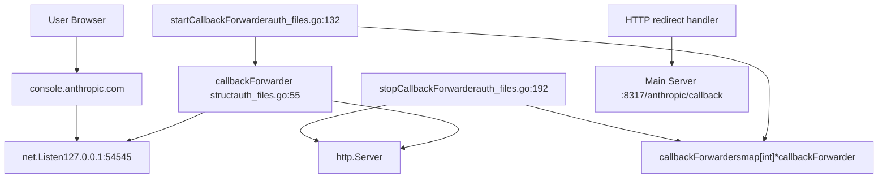
The forwarder runs only during WebUI OAuth flows (`is_webui=true`). When the browser receives the callback at `:54545/callback`, it redirects to `:8317/anthropic/callback` where the main handler processes the authorization code.

**Sources:** [internal/api/handlers/management/auth\_files.go55-59](https://github.com/router-for-me/CLIProxyAPI/blob/c66cb0af/internal/api/handlers/management/auth_files.go#L55-L59) [internal/api/handlers/management/auth\_files.go132-189](https://github.com/router-for-me/CLIProxyAPI/blob/c66cb0af/internal/api/handlers/management/auth_files.go#L132-L189) [internal/api/handlers/management/auth\_files.go192-221](https://github.com/router-for-me/CLIProxyAPI/blob/c66cb0af/internal/api/handlers/management/auth_files.go#L192-L221)

### Token Refresh

The `ClaudeExecutor.Refresh` method automatically refreshes expired access tokens using the stored refresh token.

**Token Refresh Flow**

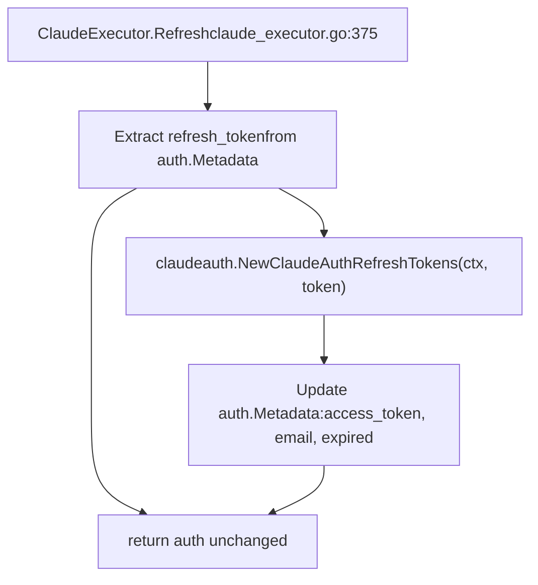
The refresh process:

1.  Extracts `refresh_token` from `auth.Metadata` [internal/runtime/executor/claude\_executor.go380-388](https://github.com/router-for-me/CLIProxyAPI/blob/c66cb0af/internal/runtime/executor/claude_executor.go#L380-L388)
2.  Calls Claude OAuth token endpoint via `claudeauth.RefreshTokens()` [internal/runtime/executor/claude\_executor.go389-393](https://github.com/router-for-me/CLIProxyAPI/blob/c66cb0af/internal/runtime/executor/claude_executor.go#L389-L393)
3.  Updates metadata with new `access_token`, `refresh_token`, `email`, `expired`, and `last_refresh` [internal/runtime/executor/claude\_executor.go394-407](https://github.com/router-for-me/CLIProxyAPI/blob/c66cb0af/internal/runtime/executor/claude_executor.go#L394-L407)

**Sources:** [internal/runtime/executor/claude\_executor.go375-407](https://github.com/router-for-me/CLIProxyAPI/blob/c66cb0af/internal/runtime/executor/claude_executor.go#L375-L407)

## Thinking Modes

Claude supports extended thinking via the `thinking` configuration. CLIProxyAPI automatically injects thinking configuration based on model name suffixes.

### Model Suffix to Budget Mapping

The `injectThinkingConfig` method maps model name suffixes to `budget_tokens`:

| Model Suffix | Budget Tokens | Description |
| --- | --- | --- |
| `-thinking-low` | 1024 | Minimal thinking budget |
| `-thinking-medium` | 8192 | Standard thinking budget |
| `-thinking-high` | 24576 | Extended thinking budget |
| `-thinking` | 8192 | Default thinking (medium) |

**Thinking Config Injection**

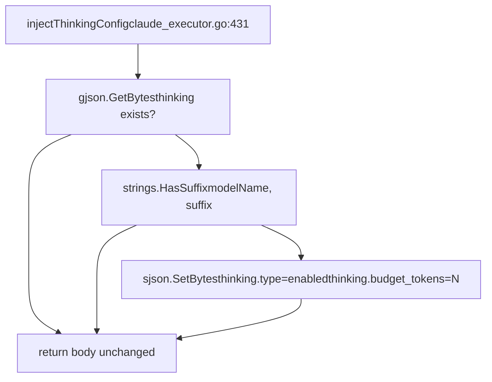
Example: A request to `claude-opus-4-5-thinking-high` will have:

```
{  "thinking": {    "type": "enabled",    "budget_tokens": 24576  }}
```
**Sources:** [internal/runtime/executor/claude\_executor.go431-455](https://github.com/router-for-me/CLIProxyAPI/blob/c66cb0af/internal/runtime/executor/claude_executor.go#L431-L455)

### Thinking Blocks with Signature Caching

CLIProxyAPI implements a sophisticated signature caching system for Claude thinking blocks to enable multi-turn conversations with thinking enabled. When Claude generates thinking content, it produces a signature that must be included when referencing that thinking in subsequent messages.

**Signature Cache Architecture**

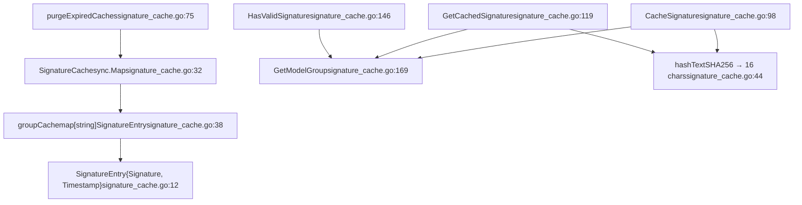
The cache stores signatures by model group (e.g., all Claude Sonnet models share signatures) and thinking text hash. Signatures expire after 3 hours [internal/cache/signature\_cache.go19](https://github.com/router-for-me/CLIProxyAPI/blob/c66cb0af/internal/cache/signature_cache.go#L19-L19)

**Usage in Request Translation**

When translating Claude requests to Antigravity format, the translator checks for cached signatures:

> **[Mermaid sequence]**
> *(图表结构无法解析)*

**Key Behaviors:**

1.  **Cache Priority:** Cached signatures take precedence over client-provided signatures [internal/translator/antigravity/claude/antigravity\_claude\_request.go104-109](https://github.com/router-for-me/CLIProxyAPI/blob/c66cb0af/internal/translator/antigravity/claude/antigravity_claude_request.go#L104-L109)
2.  **Signature Validation:** Only signatures ≥50 characters are considered valid [internal/cache/signature\_cache.go22-25](https://github.com/router-for-me/CLIProxyAPI/blob/c66cb0af/internal/cache/signature_cache.go#L22-L25)
3.  **Tool Call Handling:** Tool calls without valid thinking signatures use the sentinel value `"skip_thought_signature_validator"` to bypass validation [internal/translator/antigravity/claude/antigravity\_claude\_request.go189-194](https://github.com/router-for-me/CLIProxyAPI/blob/c66cb0af/internal/translator/antigravity/claude/antigravity_claude_request.go#L189-L194)
4.  **Signature Storage:** Response translator caches signatures from server responses [internal/translator/antigravity/claude/antigravity\_claude\_response.go193-203](https://github.com/router-for-me/CLIProxyAPI/blob/c66cb0af/internal/translator/antigravity/claude/antigravity_claude_response.go#L193-L203)

**Sources:** [internal/cache/signature\_cache.go1-169](https://github.com/router-for-me/CLIProxyAPI/blob/c66cb0af/internal/cache/signature_cache.go#L1-L169) [internal/translator/antigravity/claude/antigravity\_claude\_request.go93-165](https://github.com/router-for-me/CLIProxyAPI/blob/c66cb0af/internal/translator/antigravity/claude/antigravity_claude_request.go#L93-L165) [internal/translator/antigravity/claude/antigravity\_claude\_response.go186-210](https://github.com/router-for-me/CLIProxyAPI/blob/c66cb0af/internal/translator/antigravity/claude/antigravity_claude_response.go#L186-L210)

### max\_tokens Validation

The `ensureMaxTokensForThinking` function ensures `max_tokens > thinking.budget_tokens` to satisfy Claude API requirements.

**Validation Logic**

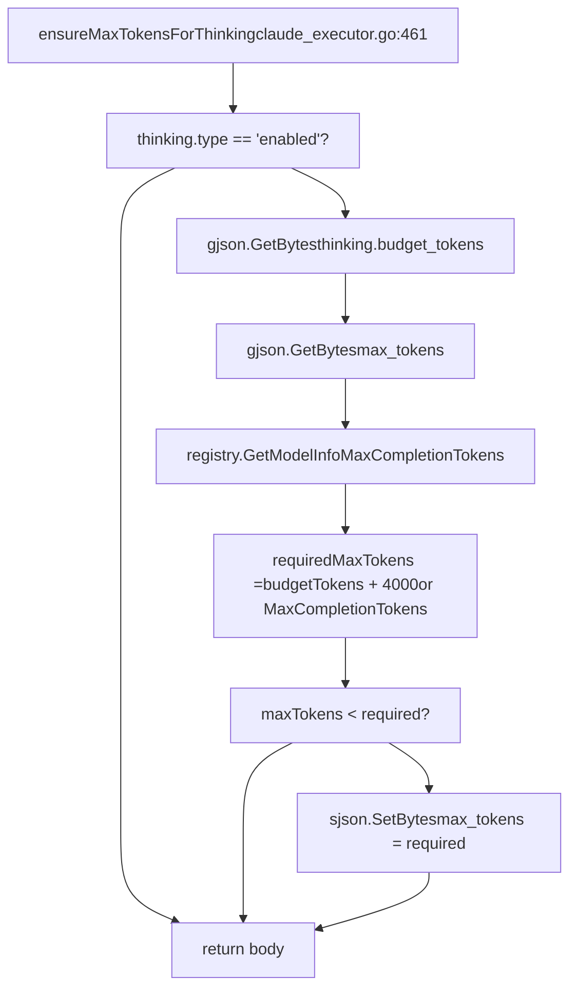
The function:

1.  Checks if `thinking.type == "enabled"` [internal/runtime/executor/claude\_executor.go463-465](https://github.com/router-for-me/CLIProxyAPI/blob/c66cb0af/internal/runtime/executor/claude_executor.go#L463-L465)
2.  Retrieves `thinking.budget_tokens` from request [internal/runtime/executor/claude\_executor.go467-470](https://github.com/router-for-me/CLIProxyAPI/blob/c66cb0af/internal/runtime/executor/claude_executor.go#L467-L470)
3.  Looks up model's `MaxCompletionTokens` from registry [internal/runtime/executor/claude\_executor.go475-478](https://github.com/router-for-me/CLIProxyAPI/blob/c66cb0af/internal/runtime/executor/claude_executor.go#L475-L478)
4.  Sets `max_tokens = MaxCompletionTokens` or `budget_tokens + 4000` if registry unavailable [internal/runtime/executor/claude\_executor.go481-485](https://github.com/router-for-me/CLIProxyAPI/blob/c66cb0af/internal/runtime/executor/claude_executor.go#L481-L485)
5.  Updates request if current `max_tokens` is insufficient [internal/runtime/executor/claude\_executor.go487-490](https://github.com/router-for-me/CLIProxyAPI/blob/c66cb0af/internal/runtime/executor/claude_executor.go#L487-L490)

**Sources:** [internal/runtime/executor/claude\_executor.go461-491](https://github.com/router-for-me/CLIProxyAPI/blob/c66cb0af/internal/runtime/executor/claude_executor.go#L461-L491)

## Beta Features

Claude beta features are controlled via the `Anthropic-Beta` header and request body `betas` field. CLIProxyAPI automatically manages beta feature headers.

### Beta Header Management

The `applyClaudeHeaders` function sets default beta features required for Claude CLI compatibility:

| Beta Feature | Purpose |
| --- | --- |
| `claude-code-20250219` | Claude Code CLI support |
| `oauth-2025-04-20` | OAuth authentication support |
| `interleaved-thinking-2025-05-14` | Interleaved thinking mode |
| `fine-grained-tool-streaming-2025-05-14` | Tool streaming enhancements |

**Header Construction Process**

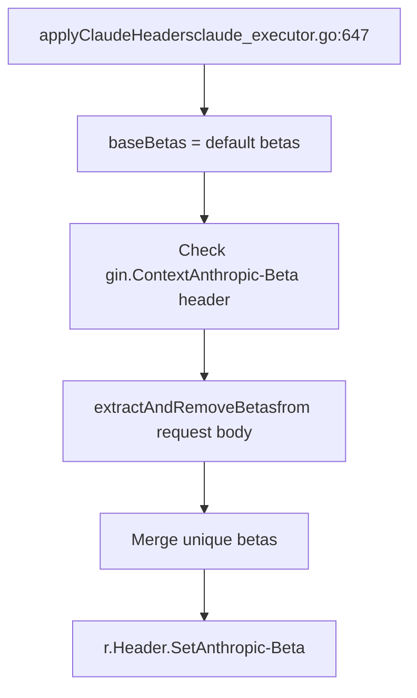
**Sources:** [internal/runtime/executor/claude\_executor.go647-678](https://github.com/router-for-me/CLIProxyAPI/blob/c66cb0af/internal/runtime/executor/claude_executor.go#L647-L678)

### Request Body Beta Extraction

The `extractAndRemoveBetas` function extracts the `betas` array from the request body and moves it to the header:

**Beta Extraction Flow**

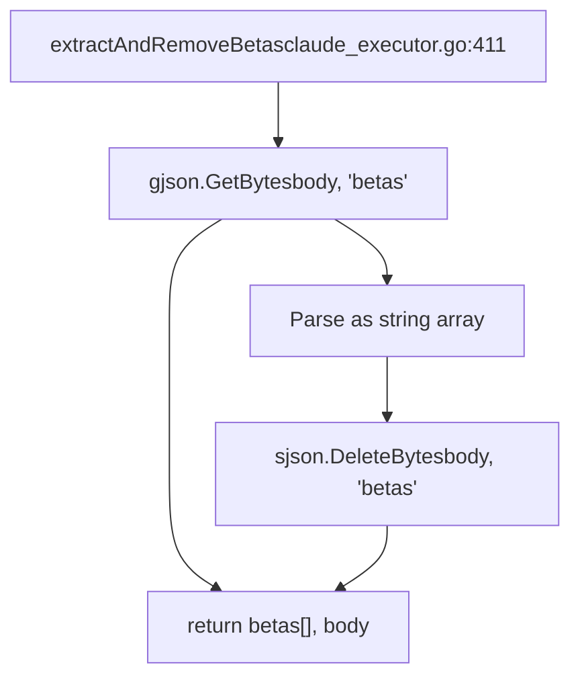
This allows clients to specify beta features in the request body:

```
{  "model": "claude-opus-4-5",  "betas": ["custom-beta-feature"],  "messages": [...]}
```
The `betas` field is extracted and merged with default betas in the `Anthropic-Beta` header.

**Sources:** [internal/runtime/executor/claude\_executor.go411-428](https://github.com/router-for-me/CLIProxyAPI/blob/c66cb0af/internal/runtime/executor/claude_executor.go#L411-L428)

## Cloaking Features

The `applyCloaking` function implements system prompt injection and sensitive word obfuscation to help Claude Code requests avoid detection by content filters. This is applied to requests before sending to the upstream API.

**Cloaking System Architecture**

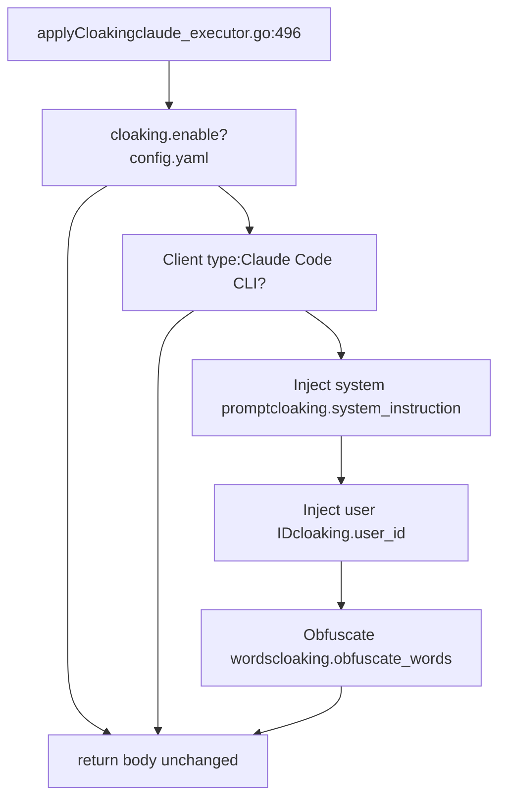
**Cloaking Configuration Example:**

```
cloaking:  enable: true  system_instruction: "Custom system instruction to inject"  user_id: "fake-user-id-12345"  obfuscate_words:    - original: "sensitive_word"      replacement: "benign_word"
```
**Cloaking Mechanisms:**

1.  **System Instruction Injection:** Prepends a custom system message to influence model behavior [internal/runtime/executor/claude\_executor.go519-540](https://github.com/router-for-me/CLIProxyAPI/blob/c66cb0af/internal/runtime/executor/claude_executor.go#L519-L540)
2.  **Fake User ID:** Injects a user\_id in the metadata field to appear as a different user [internal/runtime/executor/claude\_executor.go543-558](https://github.com/router-for-me/CLIProxyAPI/blob/c66cb0af/internal/runtime/executor/claude_executor.go#L543-L558)
3.  **Word Obfuscation:** Replaces specified words in user messages with alternatives to avoid content filters [internal/runtime/executor/claude\_executor.go561-621](https://github.com/router-for-me/CLIProxyAPI/blob/c66cb0af/internal/runtime/executor/claude_executor.go#L561-L621)

The cloaking system only activates for Claude Code CLI clients, detected via User-Agent header patterns [internal/runtime/executor/claude\_executor.go506-517](https://github.com/router-for-me/CLIProxyAPI/blob/c66cb0af/internal/runtime/executor/claude_executor.go#L506-L517)

**Sources:** [internal/runtime/executor/claude\_executor.go496-705](https://github.com/router-for-me/CLIProxyAPI/blob/c66cb0af/internal/runtime/executor/claude_executor.go#L496-L705)

## Antigravity Executor for Claude

The `AntigravityExecutor` is the primary executor for Claude models accessed via OAuth. It proxies requests through Google's Antigravity API, which provides additional features like thinking block validation and interleaved thinking.

**Antigravity Architecture**

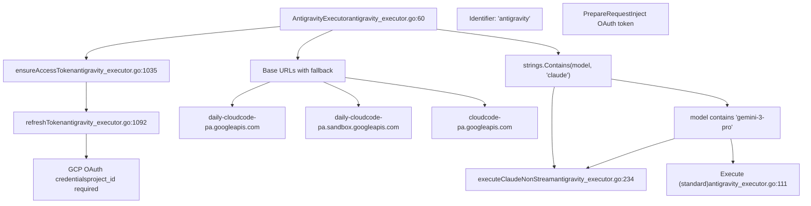
**Claude-Specific Request Processing:**

For Claude models, the Antigravity executor uses a specialized flow that:

1.  **Translates to Antigravity format** using streaming mode for function calling preservation [internal/runtime/executor/antigravity\_executor.go256-257](https://github.com/router-for-me/CLIProxyAPI/blob/c66cb0af/internal/runtime/executor/antigravity_executor.go#L256-L257)
2.  **Applies thinking configuration** from model suffix [internal/runtime/executor/antigravity\_executor.go259-262](https://github.com/router-for-me/CLIProxyAPI/blob/c66cb0af/internal/runtime/executor/antigravity_executor.go#L259-L262)
3.  **Uses streaming endpoint** even for non-streaming requests, then converts to non-stream format [internal/runtime/executor/antigravity\_executor.go340-397](https://github.com/router-for-me/CLIProxyAPI/blob/c66cb0af/internal/runtime/executor/antigravity_executor.go#L340-L397)
4.  **Converts stream to non-stream** by accumulating parts and building a complete response [internal/runtime/executor/antigravity\_executor.go416-596](https://github.com/router-for-me/CLIProxyAPI/blob/c66cb0af/internal/runtime/executor/antigravity_executor.go#L416-L596)

**Base URL Fallback Strategy:**

The executor tries multiple base URLs in order:

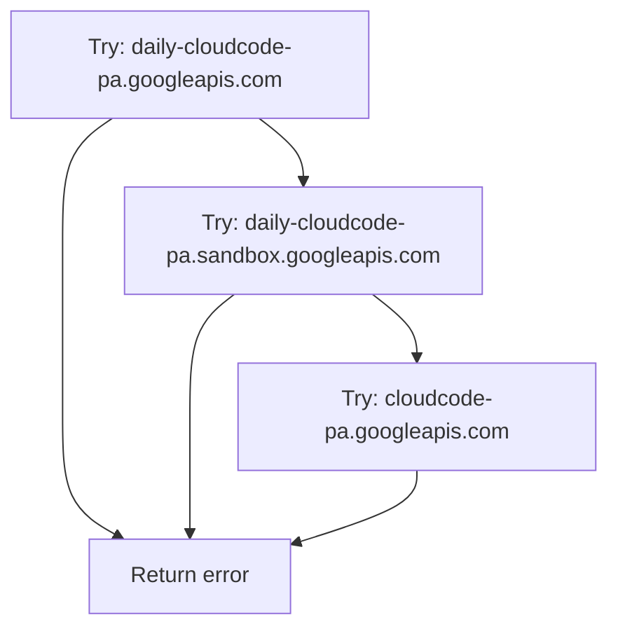
This provides resilience against rate limits on individual endpoints [internal/runtime/executor/antigravity\_executor.go154-215](https://github.com/router-for-me/CLIProxyAPI/blob/c66cb0af/internal/runtime/executor/antigravity_executor.go#L154-L215)

**Sources:** [internal/runtime/executor/antigravity\_executor.go59-769](https://github.com/router-for-me/CLIProxyAPI/blob/c66cb0af/internal/runtime/executor/antigravity_executor.go#L59-L769) [internal/runtime/executor/antigravity\_executor.go234-414](https://github.com/router-for-me/CLIProxyAPI/blob/c66cb0af/internal/runtime/executor/antigravity_executor.go#L234-L414)

## System Instructions

The `checkSystemInstructions` function ensures Claude Code identification is present in the `system` field for all models except `claude-3-5-haiku`.

### System Instruction Structure

Claude Code requires a specific system message identifying the client:

```
{  "system": [    {      "type": "text",      "text": "You are Claude Code, Anthropic's official CLI for Claude."    }  ]}
```
**System Instruction Injection Logic**

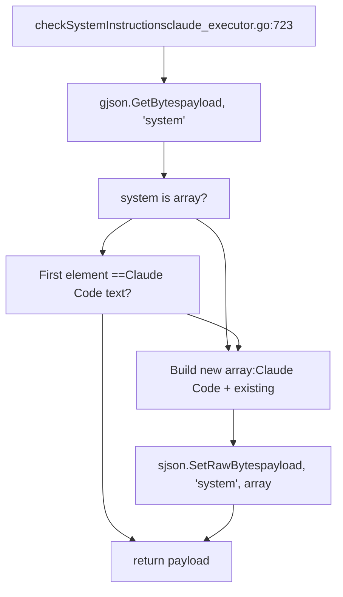
The function:

1.  Checks if `system` is an array [internal/runtime/executor/claude\_executor.go726](https://github.com/router-for-me/CLIProxyAPI/blob/c66cb0af/internal/runtime/executor/claude_executor.go#L726-L726)
2.  Validates if the first element is the Claude Code message [internal/runtime/executor/claude\_executor.go727](https://github.com/router-for-me/CLIProxyAPI/blob/c66cb0af/internal/runtime/executor/claude_executor.go#L727-L727)
3.  If missing or incorrect, prepends the Claude Code instruction to existing system messages [internal/runtime/executor/claude\_executor.go728-736](https://github.com/router-for-me/CLIProxyAPI/blob/c66cb0af/internal/runtime/executor/claude_executor.go#L728-L736)
4.  If `system` is not an array, creates a new array with the Claude Code instruction [internal/runtime/executor/claude\_executor.go737-738](https://github.com/router-for-me/CLIProxyAPI/blob/c66cb0af/internal/runtime/executor/claude_executor.go#L737-L738)

This ensures all Claude requests include the proper client identification, which may affect model behavior and feature availability.

**Sources:** [internal/runtime/executor/claude\_executor.go723-740](https://github.com/router-for-me/CLIProxyAPI/blob/c66cb0af/internal/runtime/executor/claude_executor.go#L723-L740)

## Request Execution

The `ClaudeExecutor` implements standard executor methods for non-streaming, streaming, and token counting operations.

### Execute Method

The `Execute` method handles non-streaming requests:

**Non-Streaming Request Flow**

> **[Mermaid sequence]**
> *(图表结构无法解析)*

**Sources:** [internal/runtime/executor/claude\_executor.go44-151](https://github.com/router-for-me/CLIProxyAPI/blob/c66cb0af/internal/runtime/executor/claude_executor.go#L44-L151)

### ExecuteStream Method

The `ExecuteStream` method handles SSE streaming responses:

**Streaming Request Flow**

> **[Mermaid sequence]**
> *(图表结构无法解析)*

When `from == to` (both Claude format), lines are forwarded without translation to preserve exact SSE formatting, with each line appended with a newline character [internal/runtime/executor/claude\_executor.go322-339](https://github.com/router-for-me/CLIProxyAPI/blob/c66cb0af/internal/runtime/executor/claude_executor.go#L322-L339)

**Tool Prefix Stripping:** For OAuth tokens, the executor strips the `claudeToolPrefix` from streaming responses using `stripClaudeToolPrefixFromStreamLine` [internal/runtime/executor/claude\_executor.go331-333](https://github.com/router-for-me/CLIProxyAPI/blob/c66cb0af/internal/runtime/executor/claude_executor.go#L331-L333)

**Sources:** [internal/runtime/executor/claude\_executor.go219-382](https://github.com/router-for-me/CLIProxyAPI/blob/c66cb0af/internal/runtime/executor/claude_executor.go#L219-L382)

### CountTokens Method

The `CountTokens` method uses Claude's beta token counting endpoint:

**Token Counting Flow**

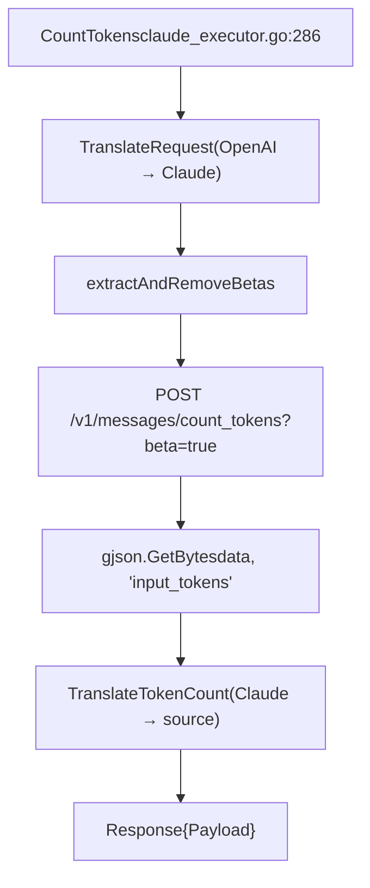
**Sources:** [internal/runtime/executor/claude\_executor.go286-373](https://github.com/router-for-me/CLIProxyAPI/blob/c66cb0af/internal/runtime/executor/claude_executor.go#L286-L373)

## Management API

Claude-specific Management API endpoints for OAuth and configuration:

| Endpoint | Method | Purpose |
| --- | --- | --- |
| `/v0/management/anthropic-auth-url` | GET | Initiate OAuth flow |
| `/v0/management/get-auth-status?state={state}` | GET | Poll OAuth status |
| `/v0/management/auth/files` | GET/POST/DELETE | Manage token files |

### OAuth Initiation

```
GET /v0/management/anthropic-auth-url?is_webui=trueAuthorization: Bearer <management_key>
```
Response:

```
{  "status": "ok",  "url": "https://console.anthropic.com/oauth/authorize?...",  "state": "random-state-string"}
```
### Status Polling

```
GET /v0/management/get-auth-status?state=random-state-stringAuthorization: Bearer <management_key>
```
Responses:

```
{"status": "wait"}                          // Still waiting{"status": "ok"}                            // Success{"status": "error", "error": "timeout"}     // Failed
```
**Sources:** [internal/api/handlers/management/auth\_files.go708-875](https://github.com/router-for-me/CLIProxyAPI/blob/c66cb0af/internal/api/handlers/management/auth_files.go#L708-L875)

## Special Features

### HTTP Headers for Claude Code CLI

The `applyClaudeHeaders` function sets specific headers to identify as the Claude CLI client:

```
r.Header.Set("Anthropic-Beta", "claude-code-20250219,oauth-2025-04-20,interleaved-thinking-2025-05-14,fine-grained-tool-streaming-2025-05-14")r.Header.Set("Anthropic-Version", "2023-06-01")r.Header.Set("Anthropic-Dangerous-Direct-Browser-Access", "true")r.Header.Set("X-App", "cli")r.Header.Set("User-Agent", "claude-cli/1.0.83 (external, cli)")
```
These headers enable beta features like Claude Code, OAuth support, interleaved thinking, and fine-grained tool streaming.

**Sources:** [internal/runtime/executor/claude\_executor.go621-686](https://github.com/router-for-me/CLIProxyAPI/blob/c66cb0af/internal/runtime/executor/claude_executor.go#L621-L686)

### Response Body Decompression

The `decodeResponseBody` function handles multiple compression encodings including gzip, deflate, brotli, and zstd:

**Decompression Flow**

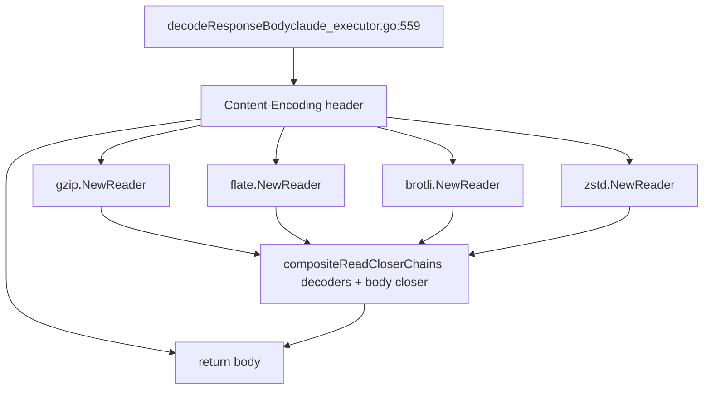
The function creates a `compositeReadCloser` that properly chains the decompression reader with the original response body, ensuring both are closed correctly [internal/runtime/executor/claude\_executor.go541-619](https://github.com/router-for-me/CLIProxyAPI/blob/c66cb0af/internal/runtime/executor/claude_executor.go#L541-L619)

**Sources:** [internal/runtime/executor/claude\_executor.go541-619](https://github.com/router-for-me/CLIProxyAPI/blob/c66cb0af/internal/runtime/executor/claude_executor.go#L541-L619)

### Tool Prefix for OAuth Tokens

When using OAuth tokens (not API keys), the executor applies a tool prefix to function declarations to avoid conflicts:

**Tool Prefix Application**

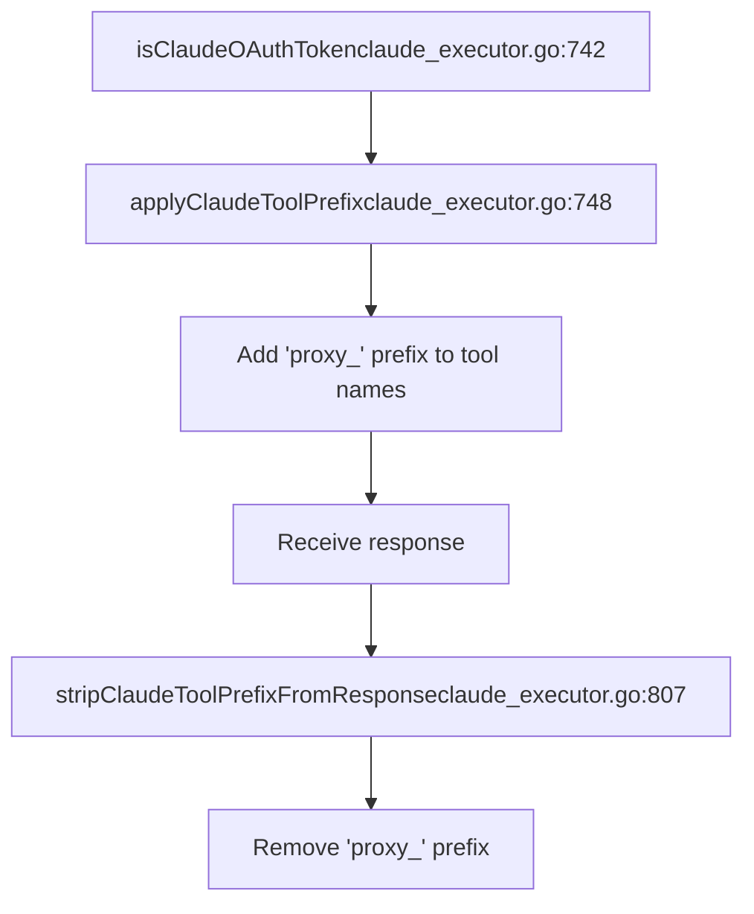
The prefix `"proxy_"` (defined as `claudeToolPrefix`) is added before sending requests and removed from responses [internal/runtime/executor/claude\_executor.go38-39](https://github.com/router-for-me/CLIProxyAPI/blob/c66cb0af/internal/runtime/executor/claude_executor.go#L38-L39) [internal/runtime/executor/claude\_executor.go128-129](https://github.com/router-for-me/CLIProxyAPI/blob/c66cb0af/internal/runtime/executor/claude_executor.go#L128-L129) [internal/runtime/executor/claude\_executor.go202-203](https://github.com/router-for-me/CLIProxyAPI/blob/c66cb0af/internal/runtime/executor/claude_executor.go#L202-L203)

**Sources:** [internal/runtime/executor/claude\_executor.go38-39](https://github.com/router-for-me/CLIProxyAPI/blob/c66cb0af/internal/runtime/executor/claude_executor.go#L38-L39) [internal/runtime/executor/claude\_executor.go742-871](https://github.com/router-for-me/CLIProxyAPI/blob/c66cb0af/internal/runtime/executor/claude_executor.go#L742-L871)

### SSE Streaming Format Preservation

When translating Claude responses to Claude format (no translation needed), the executor preserves the exact SSE formatting by forwarding lines directly without translation:

```
if from == to {    // Direct forward without translation    cloned := make([]byte, len(line)+1)    copy(cloned, line)    cloned[len(line)] = '\n'    out <- cliproxyexecutor.StreamChunk{Payload: cloned}}
```
This ensures that Claude CLI clients receive identical streaming behavior as if connecting directly to Claude, including proper SSE event formatting [internal/runtime/executor/claude\_executor.go322-339](https://github.com/router-for-me/CLIProxyAPI/blob/c66cb0af/internal/runtime/executor/claude_executor.go#L322-L339)

**Sources:** [internal/runtime/executor/claude\_executor.go322-339](https://github.com/router-for-me/CLIProxyAPI/blob/c66cb0af/internal/runtime/executor/claude_executor.go#L322-L339)

### Credential Resolution

The `claudeCreds` function resolves credentials from the auth object with fallback logic:

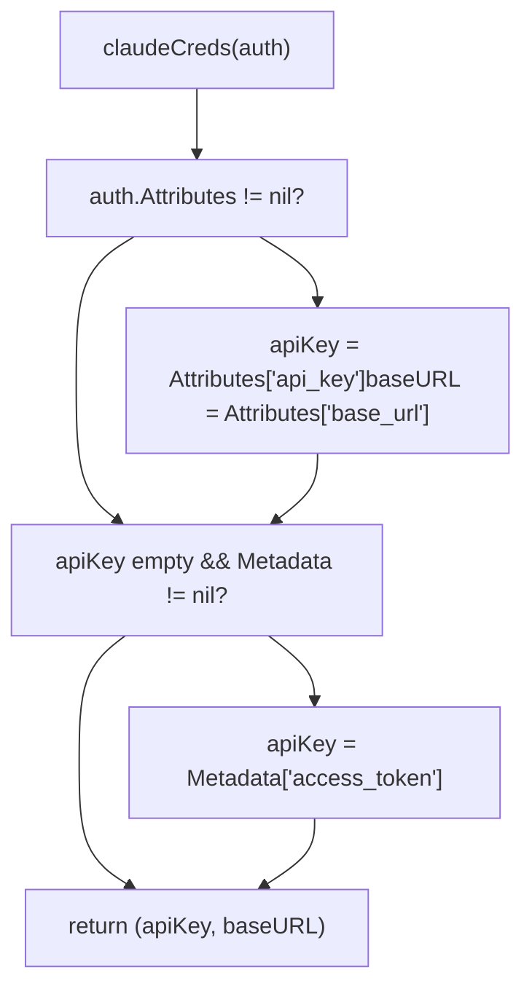
This allows both API key-based credentials (via `Attributes`) and OAuth-based credentials (via `Metadata.access_token`) to work seamlessly.

**Sources:** [internal/runtime/executor/claude\_executor.go332-346](https://github.com/router-for-me/CLIProxyAPI/blob/c66cb0af/internal/runtime/executor/claude_executor.go#L332-L346)
