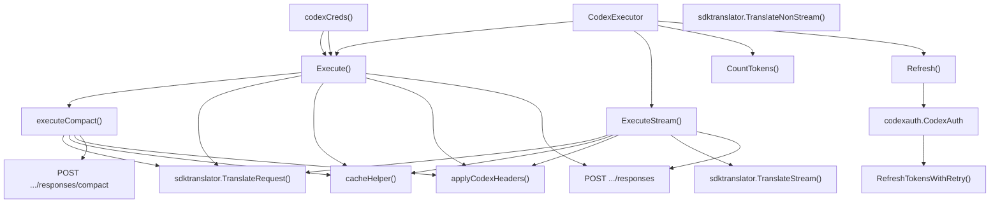
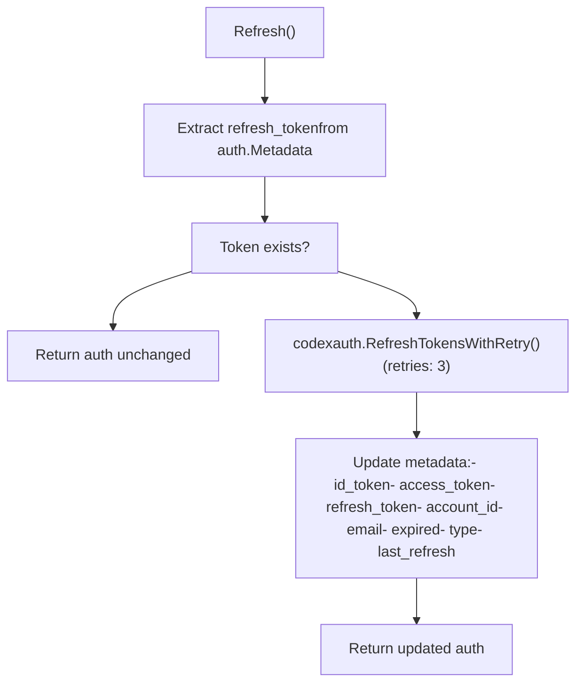
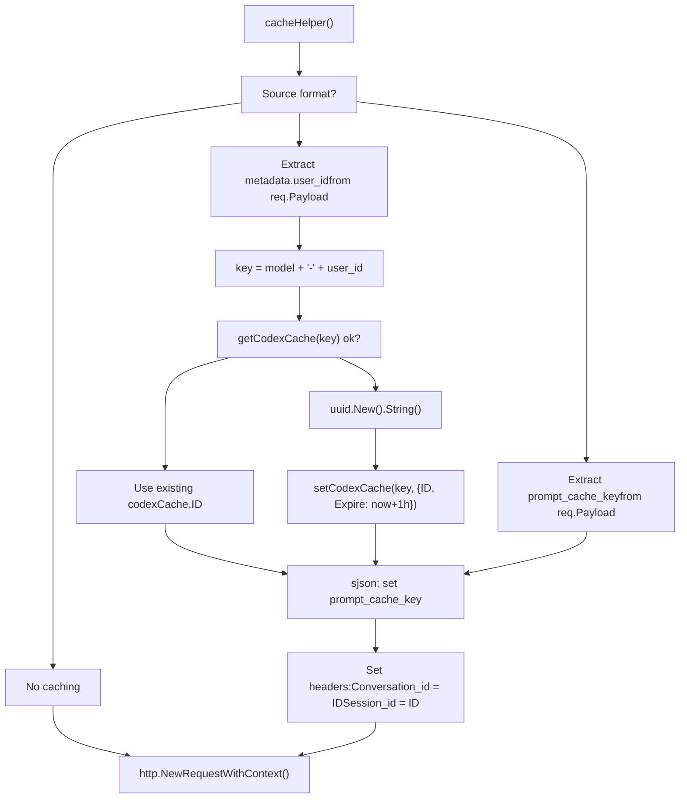
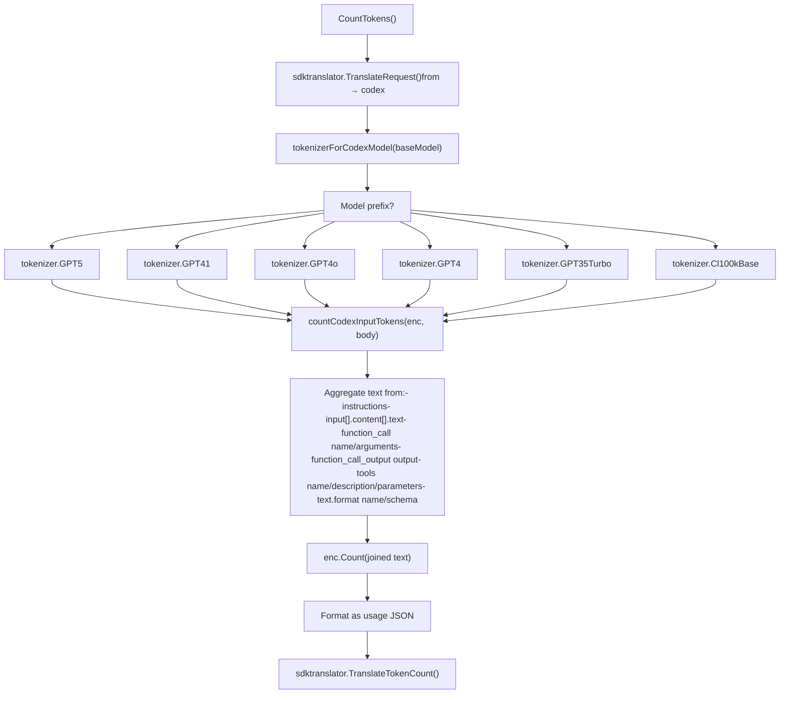

# OpenAI Codex

Relevant source files

-   [internal/auth/antigravity/auth.go](https://github.com/router-for-me/CLIProxyAPI/blob/c66cb0af/internal/auth/antigravity/auth.go)
-   [internal/cmd/anthropic\_login.go](https://github.com/router-for-me/CLIProxyAPI/blob/c66cb0af/internal/cmd/anthropic_login.go)
-   [internal/cmd/iflow\_login.go](https://github.com/router-for-me/CLIProxyAPI/blob/c66cb0af/internal/cmd/iflow_login.go)
-   [internal/cmd/openai\_login.go](https://github.com/router-for-me/CLIProxyAPI/blob/c66cb0af/internal/cmd/openai_login.go)
-   [internal/cmd/qwen\_login.go](https://github.com/router-for-me/CLIProxyAPI/blob/c66cb0af/internal/cmd/qwen_login.go)
-   [internal/runtime/executor/aistudio\_executor.go](https://github.com/router-for-me/CLIProxyAPI/blob/c66cb0af/internal/runtime/executor/aistudio_executor.go)
-   [internal/runtime/executor/antigravity\_executor.go](https://github.com/router-for-me/CLIProxyAPI/blob/c66cb0af/internal/runtime/executor/antigravity_executor.go)
-   [internal/runtime/executor/claude\_executor.go](https://github.com/router-for-me/CLIProxyAPI/blob/c66cb0af/internal/runtime/executor/claude_executor.go)
-   [internal/runtime/executor/codex\_executor.go](https://github.com/router-for-me/CLIProxyAPI/blob/c66cb0af/internal/runtime/executor/codex_executor.go)
-   [internal/runtime/executor/gemini\_cli\_executor.go](https://github.com/router-for-me/CLIProxyAPI/blob/c66cb0af/internal/runtime/executor/gemini_cli_executor.go)
-   [internal/runtime/executor/gemini\_executor.go](https://github.com/router-for-me/CLIProxyAPI/blob/c66cb0af/internal/runtime/executor/gemini_executor.go)
-   [internal/runtime/executor/gemini\_vertex\_executor.go](https://github.com/router-for-me/CLIProxyAPI/blob/c66cb0af/internal/runtime/executor/gemini_vertex_executor.go)
-   [internal/runtime/executor/iflow\_executor.go](https://github.com/router-for-me/CLIProxyAPI/blob/c66cb0af/internal/runtime/executor/iflow_executor.go)
-   [internal/runtime/executor/openai\_compat\_executor.go](https://github.com/router-for-me/CLIProxyAPI/blob/c66cb0af/internal/runtime/executor/openai_compat_executor.go)
-   [internal/runtime/executor/qwen\_executor.go](https://github.com/router-for-me/CLIProxyAPI/blob/c66cb0af/internal/runtime/executor/qwen_executor.go)
-   [internal/translator/codex/openai/responses/codex\_openai-responses\_request.go](https://github.com/router-for-me/CLIProxyAPI/blob/c66cb0af/internal/translator/codex/openai/responses/codex_openai-responses_request.go)
-   [internal/translator/codex/openai/responses/codex\_openai-responses\_request\_test.go](https://github.com/router-for-me/CLIProxyAPI/blob/c66cb0af/internal/translator/codex/openai/responses/codex_openai-responses_request_test.go)
-   [internal/translator/codex/openai/responses/codex\_openai-responses\_response.go](https://github.com/router-for-me/CLIProxyAPI/blob/c66cb0af/internal/translator/codex/openai/responses/codex_openai-responses_response.go)
-   [sdk/auth/antigravity.go](https://github.com/router-for-me/CLIProxyAPI/blob/c66cb0af/sdk/auth/antigravity.go)
-   [sdk/auth/claude.go](https://github.com/router-for-me/CLIProxyAPI/blob/c66cb0af/sdk/auth/claude.go)
-   [sdk/auth/codex.go](https://github.com/router-for-me/CLIProxyAPI/blob/c66cb0af/sdk/auth/codex.go)
-   [sdk/auth/iflow.go](https://github.com/router-for-me/CLIProxyAPI/blob/c66cb0af/sdk/auth/iflow.go)
-   [sdk/auth/qwen.go](https://github.com/router-for-me/CLIProxyAPI/blob/c66cb0af/sdk/auth/qwen.go)

This page documents the OpenAI Codex provider integration, which enables access to GPT-5 and related models through ChatGPT's backend API. The integration supports OAuth authentication via authorization code (with PKCE) and device flows, prompt caching via conversation IDs, and local token counting.

For the provider executor architecture, see page 3.4. For request translation details, see page 3.5. For OAuth setup, see page 7.2.

## Overview and Architecture

The Codex integration is implemented through the `CodexExecutor` class, which implements the `ProviderExecutor` interface. It communicates with the ChatGPT backend API at `https://chatgpt.com/backend-api/codex` using either OAuth access tokens or API keys. The executor handles request translation from OpenAI format to Codex's Responses API format, manages conversation state for prompt caching, and provides token counting capabilities.

### CodexExecutor Architecture

**`CodexExecutor` methods and their relationships**

Sources: [internal/runtime/executor/codex\_executor.go39-45](https://github.com/router-for-me/CLIProxyAPI/blob/c66cb0af/internal/runtime/executor/codex_executor.go#L39-L45) [internal/runtime/executor/codex\_executor.go80-278](https://github.com/router-for-me/CLIProxyAPI/blob/c66cb0af/internal/runtime/executor/codex_executor.go#L80-L278) [internal/runtime/executor/codex\_executor.go280-400](https://github.com/router-for-me/CLIProxyAPI/blob/c66cb0af/internal/runtime/executor/codex_executor.go#L280-L400) [internal/runtime/executor/codex\_executor.go560-597](https://github.com/router-for-me/CLIProxyAPI/blob/c66cb0af/internal/runtime/executor/codex_executor.go#L560-L597)

## Authentication and Credentials

The `CodexExecutor` supports two authentication modes through the `codexCreds()` helper:

| Authentication Mode | Configuration | Access Pattern |
| --- | --- | --- |
| OAuth | `auth.Metadata["access_token"]` | ChatGPT web subscription |
| API Key | `auth.Attributes["api_key"]` | Direct API access |

Both modes use the same request format and endpoint, differing only in the `Authorization` header and presence of OAuth-specific headers.

Sources: [internal/runtime/executor/codex\_executor.go676-690](https://github.com/router-for-me/CLIProxyAPI/blob/c66cb0af/internal/runtime/executor/codex_executor.go#L676-L690)

## OAuth Flow and Token Refresh

OAuth authentication for Codex is initiated through the Management API and managed by the `CodexAuth` service:

### OAuth Authentication Flow

`CodexAuthenticator` in `sdk/auth/codex.go` supports two flows selected by `shouldUseCodexDeviceFlow(opts)`:

**Authorization Code Flow (default, with PKCE)**

> **[Mermaid sequence]**
> *(图表结构无法解析)*

**Device Flow (alternative)**

When `shouldUseCodexDeviceFlow(opts)` returns true, `loginWithDeviceFlow()` is called. This does not require a local callback server and uses the device authorization endpoint instead.

Sources: [sdk/auth/codex.go38-200](https://github.com/router-for-me/CLIProxyAPI/blob/c66cb0af/sdk/auth/codex.go#L38-L200) [internal/cmd/openai\_login.go29-80](https://github.com/router-for-me/CLIProxyAPI/blob/c66cb0af/internal/cmd/openai_login.go#L29-L80)

### Token Refresh Mechanism

The `Refresh()` method automatically renews expired tokens using the stored refresh token. `CodexAuthenticator.RefreshLead()` returns 5 days, so tokens are refreshed 5 days before expiry.

**`Refresh()` logic flow**

Sources: [internal/runtime/executor/codex\_executor.go560-597](https://github.com/router-for-me/CLIProxyAPI/blob/c66cb0af/internal/runtime/executor/codex_executor.go#L560-L597) [sdk/auth/codex.go34-36](https://github.com/router-for-me/CLIProxyAPI/blob/c66cb0af/sdk/auth/codex.go#L34-L36)

## Request Translation

The Codex executor translates incoming requests to the Codex Responses API format using the `sdktranslator` package. The translation path for the `"codex"` format target is implemented in `internal/translator/codex/openai/responses/`.

### Request Transformation (`ConvertOpenAIResponsesRequestToCodex`)

`ConvertOpenAIResponsesRequestToCodex` applies the following transformations to the outgoing payload:

| Operation | Field | Value / Behavior |
| --- | --- | --- |
| Force streaming | `stream` | `true` |
| Disable storage | `store` | `false` |
| Enable parallel tool calls | `parallel_tool_calls` | `true` |
| Request encrypted reasoning | `include` | `["reasoning.encrypted_content"]` |
| Remove token limits | `max_output_tokens`, `max_completion_tokens` | deleted |
| Remove sampling params | `temperature`, `top_p` | deleted |
| Remove tier/user | `service_tier`, `user` | deleted |
| Normalize string input | `input` (if string) | Wrapped into message array |
| Role normalization | `input[].role == "system"` | Converted to `"developer"` |

The `convertSystemRoleToDeveloper` helper traverses the `input` array and rewrites any `"system"` role to `"developer"`, which is required by the Codex API.

### Response Translation

**Streaming:** `ConvertCodexResponseToOpenAIResponses` passes SSE events through with minor fixups. For `response.created`, `response.in_progress`, and `response.completed` events, the `response.instructions` field is patched back from the original request (the Codex API strips it).

**Non-streaming:** `ConvertCodexResponseToOpenAIResponsesNonStream` extracts the `response` object from the `response.completed` event and restores `instructions` from the original request.

Sources: [internal/translator/codex/openai/responses/codex\_openai-responses\_request.go10-60](https://github.com/router-for-me/CLIProxyAPI/blob/c66cb0af/internal/translator/codex/openai/responses/codex_openai-responses_request.go#L10-L60) [internal/translator/codex/openai/responses/codex\_openai-responses\_response.go15-48](https://github.com/router-for-me/CLIProxyAPI/blob/c66cb0af/internal/translator/codex/openai/responses/codex_openai-responses_response.go#L15-L48)

## Compact Mode (`executeCompact`)

When `opts.Alt == "responses/compact"`, `Execute()` delegates to `executeCompact()`. This path hits the `/responses/compact` endpoint synchronously (no streaming).

**Differences from standard `Execute()`:**

| Aspect | `Execute()` | `executeCompact()` |
| --- | --- | --- |
| Translation target format | `"codex"` | `"openai-response"` |
| Upstream endpoint | `.../responses` | `.../responses/compact` |
| `stream` field | forced `true` | deleted |
| Response handling | Reads SSE until `response.completed` | Reads full JSON body |

Sources: [internal/runtime/executor/codex\_executor.go80-84](https://github.com/router-for-me/CLIProxyAPI/blob/c66cb0af/internal/runtime/executor/codex_executor.go#L80-L84) [internal/runtime/executor/codex\_executor.go193-278](https://github.com/router-for-me/CLIProxyAPI/blob/c66cb0af/internal/runtime/executor/codex_executor.go#L193-L278)

## Prompt Caching and Conversation IDs

The `cacheHelper()` method implements prompt caching to reduce latency and costs for repeated requests. It generates and manages conversation IDs that serve as cache keys.

### Caching Strategy

**`cacheHelper()` decision flow**

-   **Cache Key**: `"{model}-{user_id}"` for Claude-format requests
-   **Cache Structure**: `codexCache{ID string, Expire time.Time}`
-   **Cache Duration**: 1 hour
-   **Headers Set**: `Conversation_id` and `Session_id` both set to the same cache ID

Sources: [internal/runtime/executor/codex\_executor.go599-633](https://github.com/router-for-me/CLIProxyAPI/blob/c66cb0af/internal/runtime/executor/codex_executor.go#L599-L633)

## Request Headers and Protocol

The `applyCodexHeaders()` function configures HTTP headers based on authentication mode and client context:

### Header Configuration

`applyCodexHeaders()` sets the following headers. The `codexClientVersion` constant is `"0.101.0"` and `codexUserAgent` is `"codex_cli_rs/0.101.0 (Mac OS 26.0.1; arm64) Apple_Terminal/464"`.

| Header | Value | Condition |
| --- | --- | --- |
| `Content-Type` | `application/json` | Always |
| `Authorization` | `Bearer {token}` | Always |
| `Version` | `0.101.0` (`codexClientVersion`) | Always |
| `Session_id` | UUID | Always |
| `User-Agent` | `codex_cli_rs/0.101.0 ...` (`codexUserAgent`) | Always |
| `Accept` | `text/event-stream` or `application/json` | Based on `stream` param |
| `Connection` | `Keep-Alive` | Always |
| `Originator` | `codex_cli_rs` | OAuth only (no `api_key` attr) |
| `Chatgpt-Account-Id` | `auth.Metadata["account_id"]` | OAuth only |

API key mode is detected by checking `auth.Attributes["api_key"]`. When set, `Originator` and `Chatgpt-Account-Id` are not sent.

Sources: [internal/runtime/executor/codex\_executor.go31-33](https://github.com/router-for-me/CLIProxyAPI/blob/c66cb0af/internal/runtime/executor/codex_executor.go#L31-L33) [internal/runtime/executor/codex\_executor.go635-674](https://github.com/router-for-me/CLIProxyAPI/blob/c66cb0af/internal/runtime/executor/codex_executor.go#L635-L674)

## Token Counting

The `CountTokens()` method estimates input token usage without making an API request, using the `tiktoken-go` library:

### Token Counting Implementation

**`CountTokens()` → `tokenizerForCodexModel()` → `countCodexInputTokens()`**

Token counting is performed locally without an upstream API call.

Sources: [internal/runtime/executor/codex\_executor.go402-436](https://github.com/router-for-me/CLIProxyAPI/blob/c66cb0af/internal/runtime/executor/codex_executor.go#L402-L436) [internal/runtime/executor/codex\_executor.go438-558](https://github.com/router-for-me/CLIProxyAPI/blob/c66cb0af/internal/runtime/executor/codex_executor.go#L438-L558)

## Streaming Response Handling

The `ExecuteStream()` method processes Server-Sent Events (SSE) responses from the Codex API:

### Streaming Pipeline

> **[Mermaid sequence]**
> *(图表结构无法解析)*

**Key Features:**

1.  **Large Buffer**: 52,428,800 bytes (50MB) scanner buffer for handling long responses
2.  **SSE Parsing**: Extracts JSON from lines prefixed with `data:`
3.  **Usage Tracking**: Parses `response.completed` events for token metrics via `parseCodexUsage()`
4.  **Translation**: Real-time conversion from Codex format to source format via `sdktranslator.TranslateStream()`
5.  **Error Propagation**: Scanner errors sent through the channel with `StreamChunk{Err: err}`

**Completion Detection for `Execute()`:**

Because the Codex API always streams, `Execute()` also connects to the streaming endpoint (`stream: true`) but reads the full response body synchronously, scanning for the `response.completed` event type to extract the final result.

Sources: [internal/runtime/executor/codex\_executor.go280-400](https://github.com/router-for-me/CLIProxyAPI/blob/c66cb0af/internal/runtime/executor/codex_executor.go#L280-L400) [internal/runtime/executor/codex\_executor.go162-191](https://github.com/router-for-me/CLIProxyAPI/blob/c66cb0af/internal/runtime/executor/codex_executor.go#L162-L191)

## Configuration and Setup

The Codex client configuration supports both authentication methods through the main configuration structure:

### Configuration Parameters

| Parameter | Type | Description | Usage |
| --- | --- | --- | --- |
| `CodexKey` | `[]CodexKeyConfig` | API key configurations | API key authentication |
| `AuthDir` | `string` | Token storage directory | OAuth token persistence |
| `ForceGPT5Codex` | `bool` | Force Codex model usage | Model selection override |
| `RequestLog` | `bool` | Enable request logging | Debugging and monitoring |

The client automatically selects the appropriate authentication method and endpoint based on the provided configuration, supporting seamless switching between ChatGPT backend access and direct API integration.

**Sources:** [internal/client/codex\_client.go153-158](https://github.com/router-for-me/CLIProxyAPI/blob/c66cb0af/internal/client/codex_client.go#L153-L158) [internal/client/codex\_client.go444-451](https://github.com/router-for-me/CLIProxyAPI/blob/c66cb0af/internal/client/codex_client.go#L444-L451) [internal/client/codex\_client.go456-465](https://github.com/router-for-me/CLIProxyAPI/blob/c66cb0af/internal/client/codex_client.go#L456-L465)
