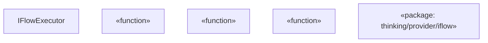
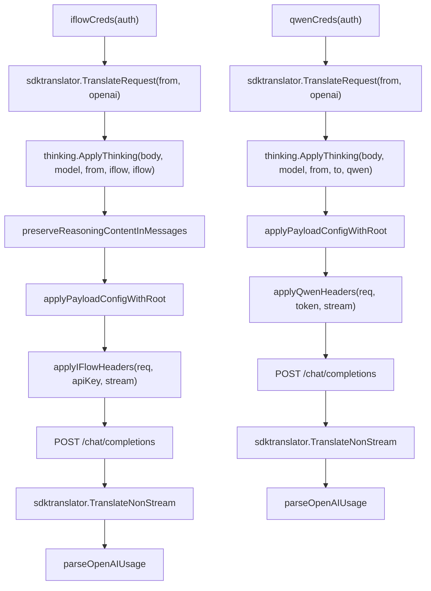

# Qwen and iFlow

Relevant source files

-   [internal/api/handlers/management/model\_definitions.go](https://github.com/router-for-me/CLIProxyAPI/blob/c66cb0af/internal/api/handlers/management/model_definitions.go)
-   [internal/auth/antigravity/auth.go](https://github.com/router-for-me/CLIProxyAPI/blob/c66cb0af/internal/auth/antigravity/auth.go)
-   [internal/cmd/anthropic\_login.go](https://github.com/router-for-me/CLIProxyAPI/blob/c66cb0af/internal/cmd/anthropic_login.go)
-   [internal/cmd/iflow\_login.go](https://github.com/router-for-me/CLIProxyAPI/blob/c66cb0af/internal/cmd/iflow_login.go)
-   [internal/cmd/openai\_login.go](https://github.com/router-for-me/CLIProxyAPI/blob/c66cb0af/internal/cmd/openai_login.go)
-   [internal/cmd/qwen\_login.go](https://github.com/router-for-me/CLIProxyAPI/blob/c66cb0af/internal/cmd/qwen_login.go)
-   [internal/config/oauth\_model\_alias\_migration.go](https://github.com/router-for-me/CLIProxyAPI/blob/c66cb0af/internal/config/oauth_model_alias_migration.go)
-   [internal/config/oauth\_model\_alias\_migration\_test.go](https://github.com/router-for-me/CLIProxyAPI/blob/c66cb0af/internal/config/oauth_model_alias_migration_test.go)
-   [internal/config/oauth\_model\_alias\_test.go](https://github.com/router-for-me/CLIProxyAPI/blob/c66cb0af/internal/config/oauth_model_alias_test.go)
-   [internal/registry/model\_definitions\_static\_data.go](https://github.com/router-for-me/CLIProxyAPI/blob/c66cb0af/internal/registry/model_definitions_static_data.go)
-   [internal/runtime/executor/aistudio\_executor.go](https://github.com/router-for-me/CLIProxyAPI/blob/c66cb0af/internal/runtime/executor/aistudio_executor.go)
-   [internal/runtime/executor/antigravity\_executor.go](https://github.com/router-for-me/CLIProxyAPI/blob/c66cb0af/internal/runtime/executor/antigravity_executor.go)
-   [internal/runtime/executor/claude\_executor.go](https://github.com/router-for-me/CLIProxyAPI/blob/c66cb0af/internal/runtime/executor/claude_executor.go)
-   [internal/runtime/executor/codex\_executor.go](https://github.com/router-for-me/CLIProxyAPI/blob/c66cb0af/internal/runtime/executor/codex_executor.go)
-   [internal/runtime/executor/gemini\_cli\_executor.go](https://github.com/router-for-me/CLIProxyAPI/blob/c66cb0af/internal/runtime/executor/gemini_cli_executor.go)
-   [internal/runtime/executor/gemini\_executor.go](https://github.com/router-for-me/CLIProxyAPI/blob/c66cb0af/internal/runtime/executor/gemini_executor.go)
-   [internal/runtime/executor/gemini\_vertex\_executor.go](https://github.com/router-for-me/CLIProxyAPI/blob/c66cb0af/internal/runtime/executor/gemini_vertex_executor.go)
-   [internal/runtime/executor/iflow\_executor.go](https://github.com/router-for-me/CLIProxyAPI/blob/c66cb0af/internal/runtime/executor/iflow_executor.go)
-   [internal/runtime/executor/openai\_compat\_executor.go](https://github.com/router-for-me/CLIProxyAPI/blob/c66cb0af/internal/runtime/executor/openai_compat_executor.go)
-   [internal/runtime/executor/qwen\_executor.go](https://github.com/router-for-me/CLIProxyAPI/blob/c66cb0af/internal/runtime/executor/qwen_executor.go)
-   [internal/thinking/provider/iflow/apply.go](https://github.com/router-for-me/CLIProxyAPI/blob/c66cb0af/internal/thinking/provider/iflow/apply.go)
-   [internal/util/claude\_model.go](https://github.com/router-for-me/CLIProxyAPI/blob/c66cb0af/internal/util/claude_model.go)
-   [internal/util/claude\_model\_test.go](https://github.com/router-for-me/CLIProxyAPI/blob/c66cb0af/internal/util/claude_model_test.go)
-   [internal/watcher/diff/oauth\_model\_alias.go](https://github.com/router-for-me/CLIProxyAPI/blob/c66cb0af/internal/watcher/diff/oauth_model_alias.go)
-   [sdk/auth/antigravity.go](https://github.com/router-for-me/CLIProxyAPI/blob/c66cb0af/sdk/auth/antigravity.go)
-   [sdk/auth/claude.go](https://github.com/router-for-me/CLIProxyAPI/blob/c66cb0af/sdk/auth/claude.go)
-   [sdk/auth/codex.go](https://github.com/router-for-me/CLIProxyAPI/blob/c66cb0af/sdk/auth/codex.go)
-   [sdk/auth/iflow.go](https://github.com/router-for-me/CLIProxyAPI/blob/c66cb0af/sdk/auth/iflow.go)
-   [sdk/auth/qwen.go](https://github.com/router-for-me/CLIProxyAPI/blob/c66cb0af/sdk/auth/qwen.go)

This page documents the Qwen and iFlow provider integrations in CLIProxyAPI, covering their executor implementations, authentication flows, request signing, and thinking configuration. Both providers accept incoming requests in any supported format and translate them to OpenAI-compatible payloads before forwarding.

For generic OpenAI-compatible providers (no custom auth), see [6.6](/router-for-me/CLIProxyAPI/6.6-openai-compatible-providers). For the overall executor interface that both providers implement, see [3.4](/router-for-me/CLIProxyAPI/3.4-provider-executor-system). For the general OAuth flow architecture, see [7.1](/router-for-me/CLIProxyAPI/7.1-oauth-flow-architecture).

---

## Provider Summary

| Feature | Qwen | iFlow |
| --- | --- | --- |
| Executor identifier | `"qwen"` | `"iflow"` |
| Auth method | Device flow OAuth | Authorization code flow (local callback server) |
| Upstream format | OpenAI `/chat/completions` | OpenAI `/chat/completions` |
| Default base URL | `https://portal.qwen.ai/v1` | `iflowauth.DefaultAPIBaseURL` |
| Request signing | Bearer token only | HMAC-SHA256 + Bearer token |
| Thinking support | Yes (`thinking.ApplyThinking`) | Yes (boolean toggle semantics) |
| User-Agent | `QwenCode/0.10.3 (darwin; arm64)` | `iFlow-Cli` |
| Refresh lead | Defined by `QwenAuthenticator.RefreshLead()` | 24 hours |

---

## Qwen

### Authentication

Qwen uses a **device flow** OAuth handshake rather than a browser redirect to a local callback server. The user receives a URL and device code, authenticates in a browser independently, and the executor polls for token issuance.

The login entry point is `DoQwenLogin` in [internal/cmd/qwen\_login.go](https://github.com/router-for-me/CLIProxyAPI/blob/c66cb0af/internal/cmd/qwen_login.go)

**Authentication diagram:**

> Qwen Device Flow

> **[Mermaid sequence]**
> *(图表结构无法解析)*

Sources: [internal/cmd/qwen\_login.go](https://github.com/router-for-me/CLIProxyAPI/blob/c66cb0af/internal/cmd/qwen_login.go) [sdk/auth/qwen.go](https://github.com/router-for-me/CLIProxyAPI/blob/c66cb0af/sdk/auth/qwen.go)

The `QwenAuthenticator` (in `sdk/auth/qwen.go`) implements the `Authenticator` interface with `Provider()` returning `"qwen"` and a `RefreshLead()` that controls how far in advance the token is refreshed automatically.

### QwenExecutor

`QwenExecutor` is defined in [internal/runtime/executor/qwen\_executor.go](https://github.com/router-for-me/CLIProxyAPI/blob/c66cb0af/internal/runtime/executor/qwen_executor.go) and satisfies the `ProviderExecutor` interface.

**Code entity map:**

Sources: [internal/runtime/executor/qwen\_executor.go](https://github.com/router-for-me/CLIProxyAPI/blob/c66cb0af/internal/runtime/executor/qwen_executor.go) [sdk/auth/qwen.go](https://github.com/router-for-me/CLIProxyAPI/blob/c66cb0af/sdk/auth/qwen.go)

**Credential resolution:**

`qwenCreds(auth)` extracts the access token and base URL from `auth`. The token is stored in `auth.Metadata["access_token"]`. If no base URL is stored, the executor falls back to `"https://portal.qwen.ai/v1"`.

[internal/runtime/executor/qwen\_executor.go72-76](https://github.com/router-for-me/CLIProxyAPI/blob/c66cb0af/internal/runtime/executor/qwen_executor.go#L72-L76)

**Request flow (non-streaming):**

1.  `qwenCreds(auth)` resolves token and base URL.
2.  Request payload is translated from the incoming format to OpenAI format via `sdktranslator.TranslateRequest(from, sdktranslator.FromString("openai"), ...)`.
3.  `thinking.ApplyThinking` applies any thinking budget suffix from the model name.
4.  `applyPayloadConfigWithRoot` applies any payload config overrides.
5.  `applyQwenHeaders` sets `Authorization: Bearer <token>`, `User-Agent: QwenCode/0.10.3 (darwin; arm64)`, and `Content-Type: application/json`.
6.  Request is sent to `<baseURL>/chat/completions`.
7.  Response is translated back using `sdktranslator.TranslateNonStream`.
8.  Usage is parsed with `parseOpenAIUsage`.

[internal/runtime/executor/qwen\_executor.go66-155](https://github.com/router-for-me/CLIProxyAPI/blob/c66cb0af/internal/runtime/executor/qwen_executor.go#L66-L155)

**Token refresh:**

`Refresh(ctx, auth)` calls `qwenauth.NewQwenAuth` to exchange the stored refresh token for new access and refresh tokens. On success, `auth.Metadata["access_token"]` and `auth.Metadata["refresh_token"]` are updated in place.

---

## iFlow

### Authentication

iFlow uses a standard **authorization code flow** with a local HTTP callback server. The flow is handled by `IFlowAuthenticator` in [sdk/auth/iflow.go](https://github.com/router-for-me/CLIProxyAPI/blob/c66cb0af/sdk/auth/iflow.go)

Key parameters:

-   Default callback port: `iflow.CallbackPort`
-   Refresh lead: **24 hours** (`RefreshLead()` returns `new(24 * time.Hour)`)

**Authentication diagram:**

> iFlow Authorization Code Flow

> **[Mermaid sequence]**
> *(图表结构无法解析)*

Sources: [sdk/auth/iflow.go](https://github.com/router-for-me/CLIProxyAPI/blob/c66cb0af/sdk/auth/iflow.go) [internal/cmd/iflow\_login.go](https://github.com/router-for-me/CLIProxyAPI/blob/c66cb0af/internal/cmd/iflow_login.go)

After login, the token data (including any session cookies) is stored in the `auth` object and persisted to the auth directory. The cookie-based session is what `Refresh` subsequently relies on.

### IFlowExecutor

`IFlowExecutor` is defined in [internal/runtime/executor/iflow\_executor.go](https://github.com/router-for-me/CLIProxyAPI/blob/c66cb0af/internal/runtime/executor/iflow_executor.go) Its identifier is `"iflow"`.

**Code entity map:**

Sources: [internal/runtime/executor/iflow\_executor.go](https://github.com/router-for-me/CLIProxyAPI/blob/c66cb0af/internal/runtime/executor/iflow_executor.go) [internal/thinking/provider/iflow/apply.go](https://github.com/router-for-me/CLIProxyAPI/blob/c66cb0af/internal/thinking/provider/iflow/apply.go)

### Request Signing

iFlow requires **HMAC-SHA256 request signing** in addition to bearer token authentication. The `applyIFlowHeaders` function (implemented using `crypto/hmac`, `crypto/sha256`, `encoding/hex`) constructs and attaches a signature header alongside the `Authorization: Bearer <apiKey>` and `User-Agent: iFlow-Cli` headers.

A new `uuid` is generated per request for tracing purposes.

[internal/runtime/executor/iflow\_executor.go1-27](https://github.com/router-for-me/CLIProxyAPI/blob/c66cb0af/internal/runtime/executor/iflow_executor.go#L1-L27)

### Request Flow

**Non-streaming:**

1.  `iflowCreds(auth)` resolves `apiKey` and `baseURL`. If `baseURL` is empty, `iflowauth.DefaultAPIBaseURL` is used.
2.  Payload is translated to OpenAI format via `sdktranslator.TranslateRequest(from, sdktranslator.FromString("openai"), ...)`.
3.  `thinking.ApplyThinking(body, req.Model, from.String(), "iflow", e.Identifier())` is called — note the `"iflow"` target string, which routes into the iFlow-specific thinking logic.
4.  `preserveReasoningContentInMessages(body)` is called to preserve any existing reasoning blocks in the message history before forwarding.
5.  `applyPayloadConfigWithRoot` applies any payload config overrides.
6.  `applyIFlowHeaders` sets all required headers including the HMAC-SHA256 signature.
7.  Request is sent to `<baseURL>/chat/completions`.
8.  Response is translated back using `sdktranslator.TranslateNonStream`.
9.  Usage is parsed with `parseOpenAIUsage`.

[internal/runtime/executor/iflow\_executor.go74-174](https://github.com/router-for-me/CLIProxyAPI/blob/c66cb0af/internal/runtime/executor/iflow_executor.go#L74-L174)

**Streaming** follows the same steps but sets `stream: true` in the payload and processes SSE lines through `sdktranslator.TranslateStream`.

### Thinking Configuration

iFlow uses **boolean toggle semantics** for thinking, unlike Claude's token budget or Gemini's budget integer. The `internal/thinking/provider/iflow` package implements this:

-   Thinking is enabled or disabled via a boolean field (e.g., `enable_thinking: true`).
-   No `thinking_budget` integer is sent.
-   The model name suffix mechanism (see [8.3](/router-for-me/CLIProxyAPI/8.3-thinking-and-reasoning-configuration)) triggers this behavior by routing through `thinking.ApplyThinking` with `"iflow"` as the provider hint.

[internal/thinking/provider/iflow/apply.go](https://github.com/router-for-me/CLIProxyAPI/blob/c66cb0af/internal/thinking/provider/iflow/apply.go)

The `preserveReasoningContentInMessages` function ensures that reasoning content blocks from prior turns are not stripped before being forwarded to iFlow, preserving multi-turn thinking continuity.

---

## Request Pipeline Comparison

> Qwen and iFlow Request Pipelines

Sources: [internal/runtime/executor/qwen\_executor.go66-155](https://github.com/router-for-me/CLIProxyAPI/blob/c66cb0af/internal/runtime/executor/qwen_executor.go#L66-L155) [internal/runtime/executor/iflow\_executor.go74-174](https://github.com/router-for-me/CLIProxyAPI/blob/c66cb0af/internal/runtime/executor/iflow_executor.go#L74-L174)

---

## Configuration

Both providers are configured in `config.yaml` with auth credentials stored in the auth directory. Authentication is triggered via the management API or CLI login commands.

| Config element | Qwen | iFlow |
| --- | --- | --- |
| Login command | `DoQwenLogin` | `DoIFlowLogin` |
| Auth type string | `"qwen"` | `"iflow"` |
| Token storage field | `auth.Metadata["access_token"]` | `auth.Attributes["api_key"]` (derived key) |
| Base URL override | `auth.Attributes["base_url"]` | `auth.Attributes["base_url"]` |
| Refresh source | `qwenauth.NewQwenAuth` | `iflowauth.NewIFlowAuth` |

For a step-by-step guide on initiating these OAuth flows via the management API, see [7.2](/router-for-me/CLIProxyAPI/7.2-provider-specific-oauth-setup). For how credentials are selected across multiple accounts and how cooldown/retry logic applies, see [8.1](/router-for-me/CLIProxyAPI/8.1-credential-routing-and-failover).

Sources: [internal/runtime/executor/qwen\_executor.go](https://github.com/router-for-me/CLIProxyAPI/blob/c66cb0af/internal/runtime/executor/qwen_executor.go) [internal/runtime/executor/iflow\_executor.go](https://github.com/router-for-me/CLIProxyAPI/blob/c66cb0af/internal/runtime/executor/iflow_executor.go) [sdk/auth/qwen.go](https://github.com/router-for-me/CLIProxyAPI/blob/c66cb0af/sdk/auth/qwen.go) [sdk/auth/iflow.go](https://github.com/router-for-me/CLIProxyAPI/blob/c66cb0af/sdk/auth/iflow.go) [internal/cmd/qwen\_login.go](https://github.com/router-for-me/CLIProxyAPI/blob/c66cb0af/internal/cmd/qwen_login.go) [internal/cmd/iflow\_login.go](https://github.com/router-for-me/CLIProxyAPI/blob/c66cb0af/internal/cmd/iflow_login.go) [internal/thinking/provider/iflow/apply.go](https://github.com/router-for-me/CLIProxyAPI/blob/c66cb0af/internal/thinking/provider/iflow/apply.go)
