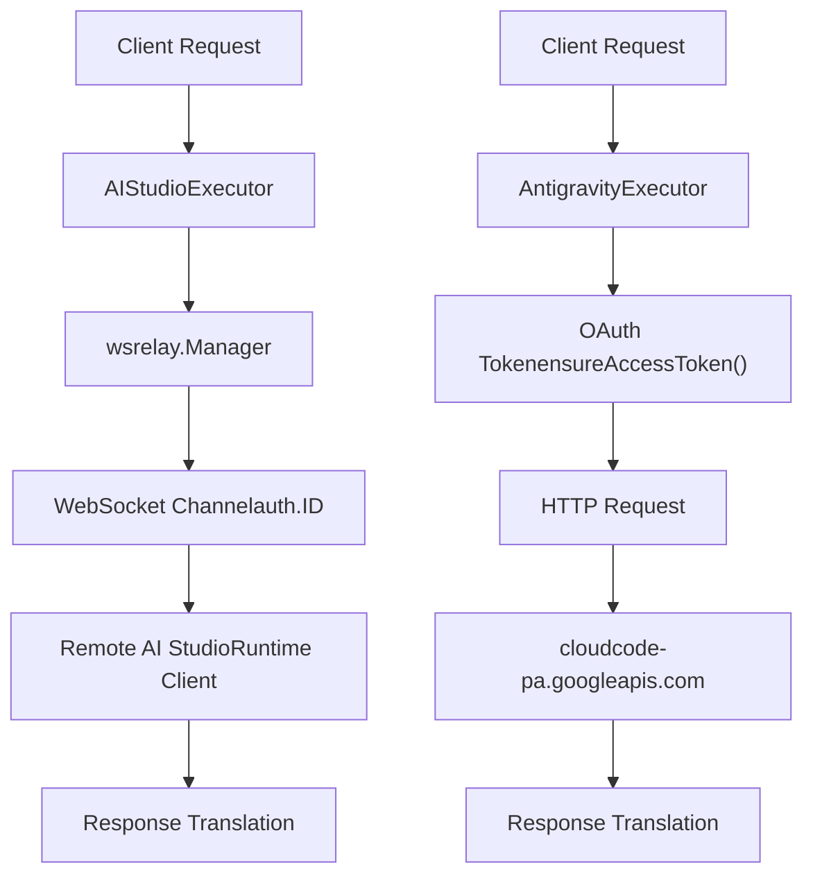
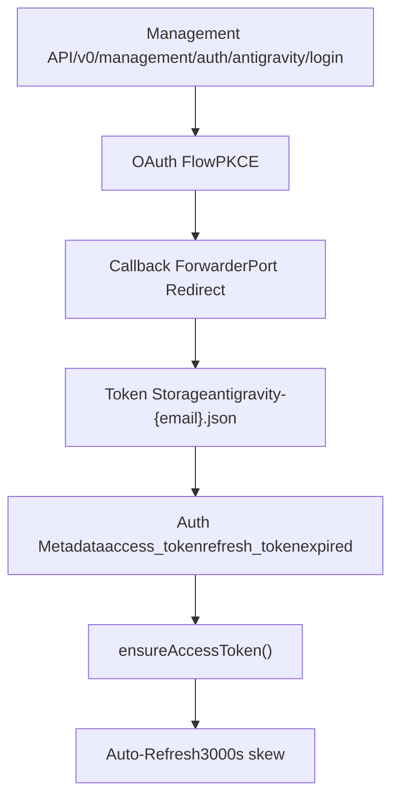
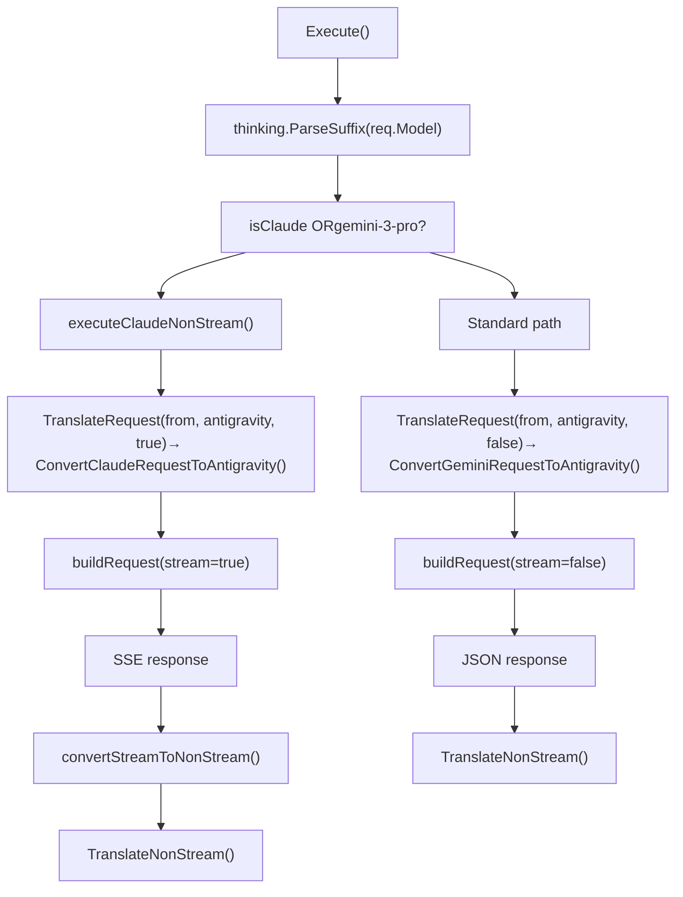
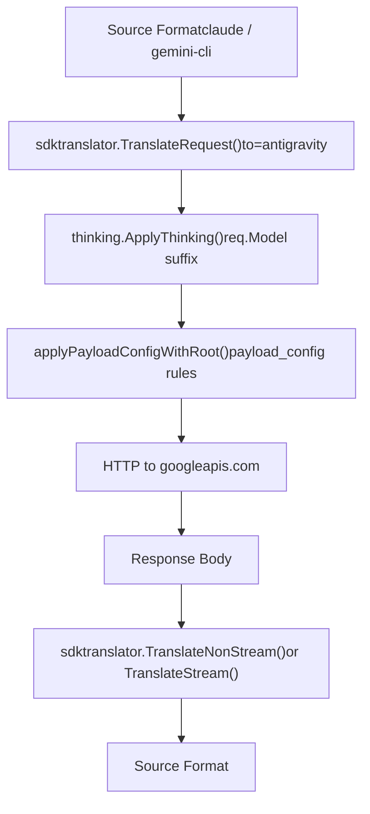
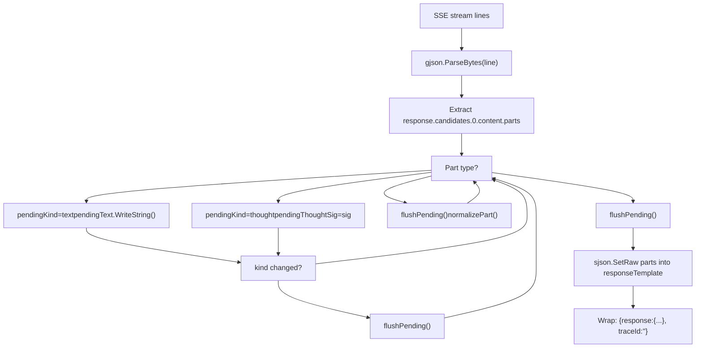
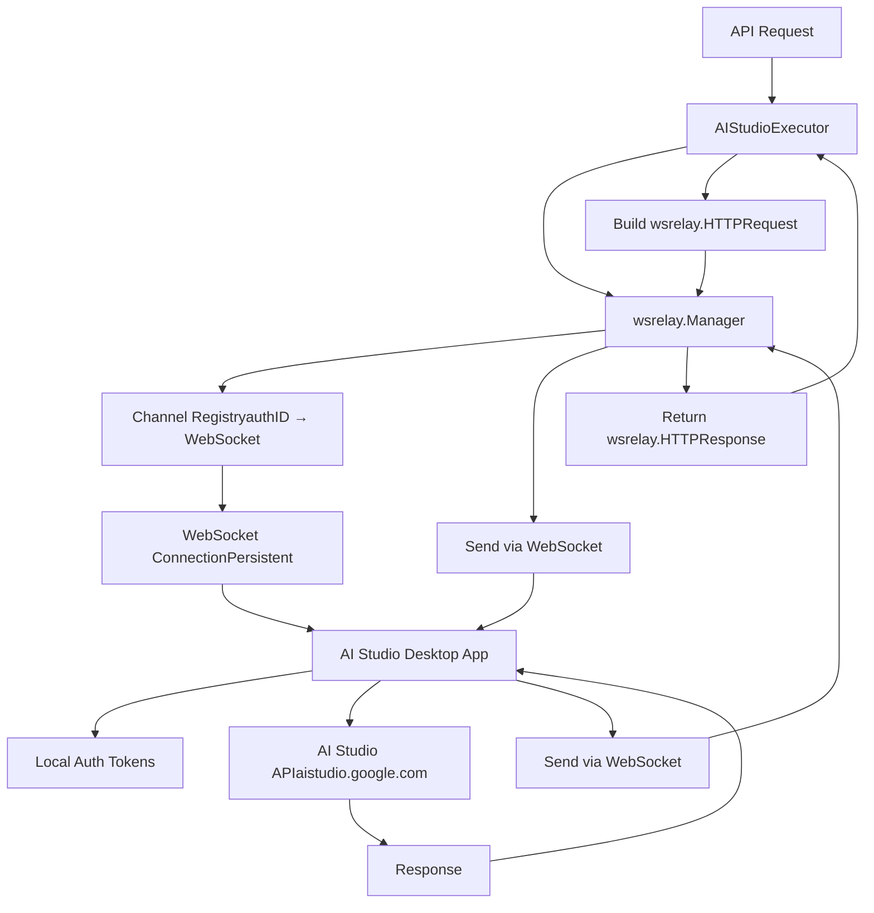
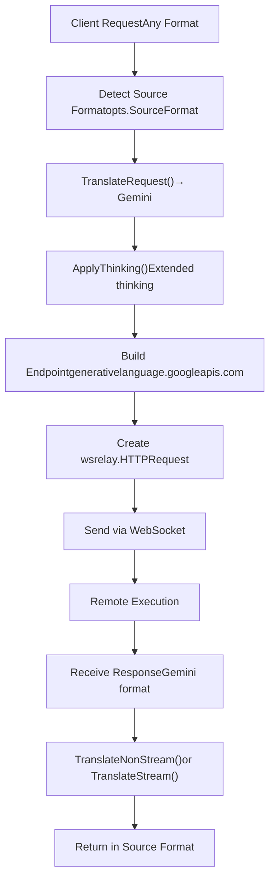
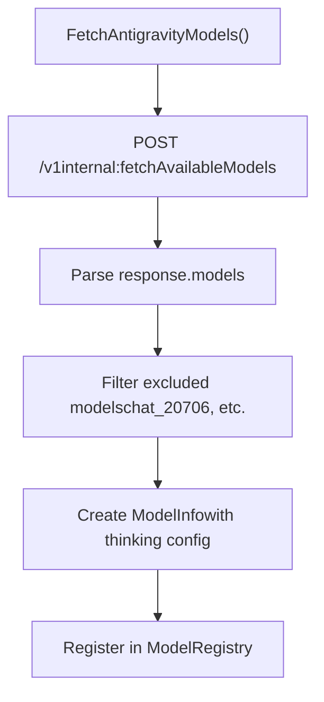

# Antigravity and AI Studio

Relevant source files

-   [internal/auth/antigravity/auth.go](https://github.com/router-for-me/CLIProxyAPI/blob/c66cb0af/internal/auth/antigravity/auth.go)
-   [internal/cache/signature\_cache.go](https://github.com/router-for-me/CLIProxyAPI/blob/c66cb0af/internal/cache/signature_cache.go)
-   [internal/cache/signature\_cache\_test.go](https://github.com/router-for-me/CLIProxyAPI/blob/c66cb0af/internal/cache/signature_cache_test.go)
-   [internal/cmd/anthropic\_login.go](https://github.com/router-for-me/CLIProxyAPI/blob/c66cb0af/internal/cmd/anthropic_login.go)
-   [internal/cmd/iflow\_login.go](https://github.com/router-for-me/CLIProxyAPI/blob/c66cb0af/internal/cmd/iflow_login.go)
-   [internal/cmd/openai\_login.go](https://github.com/router-for-me/CLIProxyAPI/blob/c66cb0af/internal/cmd/openai_login.go)
-   [internal/cmd/qwen\_login.go](https://github.com/router-for-me/CLIProxyAPI/blob/c66cb0af/internal/cmd/qwen_login.go)
-   [internal/runtime/executor/aistudio\_executor.go](https://github.com/router-for-me/CLIProxyAPI/blob/c66cb0af/internal/runtime/executor/aistudio_executor.go)
-   [internal/runtime/executor/antigravity\_executor.go](https://github.com/router-for-me/CLIProxyAPI/blob/c66cb0af/internal/runtime/executor/antigravity_executor.go)
-   [internal/runtime/executor/claude\_executor.go](https://github.com/router-for-me/CLIProxyAPI/blob/c66cb0af/internal/runtime/executor/claude_executor.go)
-   [internal/runtime/executor/codex\_executor.go](https://github.com/router-for-me/CLIProxyAPI/blob/c66cb0af/internal/runtime/executor/codex_executor.go)
-   [internal/runtime/executor/gemini\_cli\_executor.go](https://github.com/router-for-me/CLIProxyAPI/blob/c66cb0af/internal/runtime/executor/gemini_cli_executor.go)
-   [internal/runtime/executor/gemini\_executor.go](https://github.com/router-for-me/CLIProxyAPI/blob/c66cb0af/internal/runtime/executor/gemini_executor.go)
-   [internal/runtime/executor/gemini\_vertex\_executor.go](https://github.com/router-for-me/CLIProxyAPI/blob/c66cb0af/internal/runtime/executor/gemini_vertex_executor.go)
-   [internal/runtime/executor/iflow\_executor.go](https://github.com/router-for-me/CLIProxyAPI/blob/c66cb0af/internal/runtime/executor/iflow_executor.go)
-   [internal/runtime/executor/openai\_compat\_executor.go](https://github.com/router-for-me/CLIProxyAPI/blob/c66cb0af/internal/runtime/executor/openai_compat_executor.go)
-   [internal/runtime/executor/qwen\_executor.go](https://github.com/router-for-me/CLIProxyAPI/blob/c66cb0af/internal/runtime/executor/qwen_executor.go)
-   [internal/translator/antigravity/claude/antigravity\_claude\_request.go](https://github.com/router-for-me/CLIProxyAPI/blob/c66cb0af/internal/translator/antigravity/claude/antigravity_claude_request.go)
-   [internal/translator/antigravity/claude/antigravity\_claude\_request\_test.go](https://github.com/router-for-me/CLIProxyAPI/blob/c66cb0af/internal/translator/antigravity/claude/antigravity_claude_request_test.go)
-   [internal/translator/antigravity/claude/antigravity\_claude\_response.go](https://github.com/router-for-me/CLIProxyAPI/blob/c66cb0af/internal/translator/antigravity/claude/antigravity_claude_response.go)
-   [internal/translator/antigravity/claude/antigravity\_claude\_response\_test.go](https://github.com/router-for-me/CLIProxyAPI/blob/c66cb0af/internal/translator/antigravity/claude/antigravity_claude_response_test.go)
-   [internal/translator/antigravity/gemini/antigravity\_gemini\_request.go](https://github.com/router-for-me/CLIProxyAPI/blob/c66cb0af/internal/translator/antigravity/gemini/antigravity_gemini_request.go)
-   [internal/translator/antigravity/gemini/antigravity\_gemini\_request\_test.go](https://github.com/router-for-me/CLIProxyAPI/blob/c66cb0af/internal/translator/antigravity/gemini/antigravity_gemini_request_test.go)
-   [sdk/auth/antigravity.go](https://github.com/router-for-me/CLIProxyAPI/blob/c66cb0af/sdk/auth/antigravity.go)
-   [sdk/auth/claude.go](https://github.com/router-for-me/CLIProxyAPI/blob/c66cb0af/sdk/auth/claude.go)
-   [sdk/auth/codex.go](https://github.com/router-for-me/CLIProxyAPI/blob/c66cb0af/sdk/auth/codex.go)
-   [sdk/auth/iflow.go](https://github.com/router-for-me/CLIProxyAPI/blob/c66cb0af/sdk/auth/iflow.go)
-   [sdk/auth/qwen.go](https://github.com/router-for-me/CLIProxyAPI/blob/c66cb0af/sdk/auth/qwen.go)

This page covers the setup and operation of two specialized Google-based providers: **Antigravity** (Google Deepmind's agentic coding assistant) and **AI Studio** (WebSocket-based multi-account provider). Both leverage Google Cloud infrastructure but use different authentication and communication mechanisms.

For general Gemini configuration, see [Google Gemini and Vertex AI](/router-for-me/CLIProxyAPI/6.1-google-gemini-and-vertex-ai). For WebSocket relay architecture details, see [WebSocket and AI Studio Integration](/router-for-me/CLIProxyAPI/8.7-websocket-and-runtime-authentication).

---

## Overview

**Antigravity** is Google Deepmind's advanced agentic AI coding assistant that uses OAuth authentication to access Claude and Gemini models through Google Cloud infrastructure. It provides extended thinking capabilities and signature caching for multi-turn conversations.

**AI Studio** is a WebSocket-based provider integration that enables runtime multi-account load balancing for AI Studio accounts. Unlike traditional HTTP-based executors, AI Studio routes all requests through a WebSocket relay channel, allowing dynamic provider registration without server restarts.

### Architecture Comparison


**Sources:** [internal/runtime/executor/antigravity\_executor.go59-232](https://github.com/router-for-me/CLIProxyAPI/blob/c66cb0af/internal/runtime/executor/antigravity_executor.go#L59-L232) [internal/runtime/executor/aistudio\_executor.go27-110](https://github.com/router-for-me/CLIProxyAPI/blob/c66cb0af/internal/runtime/executor/aistudio_executor.go#L27-L110)

---

## Antigravity Provider

### Authentication Flow

Antigravity uses OAuth 2.0 with PKCE for authentication. The OAuth flow is initiated through the Management API and uses Google's OAuth endpoints.

#### OAuth Credentials


**Sources:** [internal/runtime/executor/antigravity\_executor.go38-52](https://github.com/router-for-me/CLIProxyAPI/blob/c66cb0af/internal/runtime/executor/antigravity_executor.go#L38-L52) [internal/api/handlers/management/auth\_files.go235-241](https://github.com/router-for-me/CLIProxyAPI/blob/c66cb0af/internal/api/handlers/management/auth_files.go#L235-L241)

#### Key Configuration Constants

| Constant | Value | Purpose |
| --- | --- | --- |
| `antigravityAuthType` | `antigravity` | `Identifier()` return value |
| `antigravityClientID` | `<ANTIGRAVITY_CLIENT_ID>` | OAuth client ID |
| `antigravityClientSecret` | `<ANTIGRAVITY_CLIENT_SECRET>` | OAuth client secret |
| `antigravityBaseURLDaily` | `https://daily-cloudcode-pa.googleapis.com` | Daily endpoint (primary) |
| `antigravitySandboxBaseURLDaily` | `https://daily-cloudcode-pa.sandbox.googleapis.com` | Daily sandbox endpoint |
| `antigravityBaseURLProd` | `https://cloudcode-pa.googleapis.com` | Production endpoint |
| `defaultAntigravityAgent` | `antigravity/1.104.0 darwin/arm64` | Default `User-Agent` header |
| `refreshSkew` | `3000 * time.Second` | Token refresh lead time |

**Sources:** [internal/runtime/executor/antigravity\_executor.go38-52](https://github.com/router-for-me/CLIProxyAPI/blob/c66cb0af/internal/runtime/executor/antigravity_executor.go#L38-L52)

### Model Support

Antigravity provides access to both Claude and Gemini models through Google Cloud infrastructure. The executor detects model type based on naming conventions and applies appropriate request handling.

#### Execute() Non-Streaming Routing

The `Execute()` method applies a model-type branch: Claude models and `gemini-3-pro` are handled by `executeClaudeNonStream()`, which internally uses an SSE connection to the upstream and calls `convertStreamToNonStream()` to assemble the final JSON body. All other models use a standard non-streaming HTTP request.

`ExecuteStream()` does **not** apply this branch — all models go through the same streaming code path regardless of model type.

**Execute() model dispatch (non-streaming path)**


**Sources:** [internal/runtime/executor/antigravity\_executor.go111-258](https://github.com/router-for-me/CLIProxyAPI/blob/c66cb0af/internal/runtime/executor/antigravity_executor.go#L111-L258) [internal/runtime/executor/antigravity\_executor.go261-463](https://github.com/router-for-me/CLIProxyAPI/blob/c66cb0af/internal/runtime/executor/antigravity_executor.go#L261-L463) [internal/runtime/executor/antigravity\_executor.go647-843](https://github.com/router-for-me/CLIProxyAPI/blob/c66cb0af/internal/runtime/executor/antigravity_executor.go#L647-L843)

#### Supported Endpoints

| Endpoint | Method | Purpose |
| --- | --- | --- |
| `/v1internal:generateContent` | POST | Non-streaming generation |
| `/v1internal:streamGenerateContent` | POST | Streaming generation |
| `/v1internal:countTokens` | POST | Token counting |
| `/v1internal:fetchAvailableModels` | POST | List available models |

**Sources:** [internal/runtime/executor/antigravity\_executor.go42-45](https://github.com/router-for-me/CLIProxyAPI/blob/c66cb0af/internal/runtime/executor/antigravity_executor.go#L42-L45)

### Request Processing

#### Fallback URL Strategy

Antigravity implements a sophisticated fallback mechanism to handle rate limits and availability issues:

> **[Mermaid sequence]**
> *(图表结构无法解析)*

**Sources:** [internal/runtime/executor/antigravity\_executor.go147-231](https://github.com/router-for-me/CLIProxyAPI/blob/c66cb0af/internal/runtime/executor/antigravity_executor.go#L147-L231) [internal/runtime/executor/antigravity\_executor.go632-768](https://github.com/router-for-me/CLIProxyAPI/blob/c66cb0af/internal/runtime/executor/antigravity_executor.go#L632-L768)

#### Translation Pipeline

The executor calls `sdktranslator.TranslateRequest(from, to, baseModel, payload, stream)` with the target format `sdktranslator.FromString("antigravity")`. The translator registry dispatches to concrete functions based on the source/target format pair.

**Antigravity request/response translation stages**


The `"antigravity"` format string maps to the following translator functions:

| Direction | Source Format | Target Format | Translator Function | File |
| --- | --- | --- | --- | --- |
| Request | `claude` | `antigravity` | `ConvertClaudeRequestToAntigravity()` | `internal/translator/antigravity/claude` |
| Request | `gemini-cli` | `antigravity` | `ConvertGeminiRequestToAntigravity()` | `internal/translator/antigravity/gemini` |
| Response stream | `antigravity` | `claude` | `ConvertAntigravityResponseToClaude()` | `internal/translator/antigravity/claude` |

**Sources:** [internal/runtime/executor/antigravity\_executor.go131-150](https://github.com/router-for-me/CLIProxyAPI/blob/c66cb0af/internal/runtime/executor/antigravity_executor.go#L131-L150) [internal/translator/antigravity/claude/antigravity\_claude\_request.go37](https://github.com/router-for-me/CLIProxyAPI/blob/c66cb0af/internal/translator/antigravity/claude/antigravity_claude_request.go#L37-L37) [internal/translator/antigravity/gemini/antigravity\_gemini\_request.go19-30](https://github.com/router-for-me/CLIProxyAPI/blob/c66cb0af/internal/translator/antigravity/gemini/antigravity_gemini_request.go#L19-L30) [internal/translator/antigravity/claude/antigravity\_claude\_response.go66-88](https://github.com/router-for-me/CLIProxyAPI/blob/c66cb0af/internal/translator/antigravity/claude/antigravity_claude_response.go#L66-L88)

### Special Features

#### Signature Caching

Antigravity validates `thoughtSignature` values on every thinking block it processes. The `internal/cache` package provides an in-process signature cache keyed on `(modelGroup, SHA-256(thinkingText))`.

| Function | Description |
| --- | --- |
| `cache.CacheSignature(model, text, sig)` | Store a signature for a thinking text |
| `cache.GetCachedSignature(model, text)` | Look up cached signature by thinking text |
| `cache.HasValidSignature(model, sig)` | Check length ≥ `MinValidSignatureLen` (50) and model group match |
| `cache.GetModelGroup(model)` | Normalize model name to a group key |

Entries expire after `SignatureCacheTTL = 3 * time.Hour`. A background goroutine started via `cacheCleanupOnce` purges stale entries every `CacheCleanupInterval = 10 * time.Minute`.

When `ConvertClaudeRequestToAntigravity()` encounters a `tool_use` content block that has no valid thinking signature available (e.g. first turn, or unsigned thinking), it injects the sentinel string `"skip_thought_signature_validator"` into the `thoughtSignature` field of the `functionCall` part. This bypasses server-side signature validation for that turn.

**Sources:** [internal/cache/signature\_cache.go1-155](https://github.com/router-for-me/CLIProxyAPI/blob/c66cb0af/internal/cache/signature_cache.go#L1-L155) [internal/translator/antigravity/claude/antigravity\_claude\_request.go100-210](https://github.com/router-for-me/CLIProxyAPI/blob/c66cb0af/internal/translator/antigravity/claude/antigravity_claude_request.go#L100-L210)

#### Stream-to-Non-Stream Conversion

For Claude models, `executeClaudeNonStream()` performs an internal streaming HTTP request and reassembles the chunks into a single response body via `convertStreamToNonStream()`.

The `convertStreamToNonStream()` method on `AntigravityExecutor` scans the SSE lines, accumulating `text` and `thought` content parts using a `pendingKind`/`pendingText`/`pendingThoughtSig` state machine. A `flushPending()` closure merges adjacent parts of the same kind before appending to the final `parts` array.

**convertStreamToNonStream() part accumulation**


The assembled response is then passed to `sdktranslator.TranslateNonStream()` together with the `ConvertAntigravityResponseToClaude()` translator, which uses a `Params` struct (defined in `internal/translator/antigravity/claude`) to maintain streaming state across multiple calls during the overall response-to-SSE conversion.

**Sources:** [internal/runtime/executor/antigravity\_executor.go465-645](https://github.com/router-for-me/CLIProxyAPI/blob/c66cb0af/internal/runtime/executor/antigravity_executor.go#L465-L645) [internal/translator/antigravity/claude/antigravity\_claude\_response.go27-45](https://github.com/router-for-me/CLIProxyAPI/blob/c66cb0af/internal/translator/antigravity/claude/antigravity_claude_response.go#L27-L45)

### Configuration Example

```
# No explicit configuration needed in config.yaml# Authentication handled via Management API OAuth flow # Optional: Payload configuration for Antigravity modelspayload_config:  - model_pattern: "claude-.*"    provider: "antigravity"    config:      request:        max_tokens: 8192        temperature: 0.7
```
### Token Management

The executor automatically manages OAuth token lifecycle:

> **[Mermaid stateDiagram]**
> *(图表结构无法解析)*

**Sources:** [internal/runtime/executor/antigravity\_executor.go1035-1080](https://github.com/router-for-me/CLIProxyAPI/blob/c66cb0af/internal/runtime/executor/antigravity_executor.go#L1035-L1080)

---

## AI Studio WebSocket Relay

### Architecture

AI Studio uses a WebSocket-based relay architecture that enables runtime provider registration without server restarts. The `wsrelay.Manager` handles bidirectional communication between the proxy server and remote AI Studio clients.


**Sources:** [internal/runtime/executor/aistudio\_executor.go1-110](https://github.com/router-for-me/CLIProxyAPI/blob/c66cb0af/internal/runtime/executor/aistudio_executor.go#L1-L110) [internal/wsrelay/manager.go](https://github.com/router-for-me/CLIProxyAPI/blob/c66cb0af/internal/wsrelay/manager.go)

### Authentication

AI Studio authentication is channel-based. Each authenticated client registers with a unique auth ID, and requests are routed to the appropriate channel.

#### Channel Registration

> **[Mermaid sequence]**
> *(图表结构无法解析)*

**Sources:** [internal/api/handlers/management/auth\_files.go505-510](https://github.com/router-for-me/CLIProxyAPI/blob/c66cb0af/internal/api/handlers/management/auth_files.go#L505-L510)

### Request Flow

#### Non-Streaming Requests

> **[Mermaid sequence]**
> *(图表结构无法解析)*

**Sources:** [internal/runtime/executor/aistudio\_executor.go113-166](https://github.com/router-for-me/CLIProxyAPI/blob/c66cb0af/internal/runtime/executor/aistudio_executor.go#L113-L166)

#### Streaming Requests

> **[Mermaid sequence]**
> *(图表结构无法解析)*

**Sources:** [internal/runtime/executor/aistudio\_executor.go169-292](https://github.com/router-for-me/CLIProxyAPI/blob/c66cb0af/internal/runtime/executor/aistudio_executor.go#L169-L292)

### Message Types

AI Studio WebSocket protocol supports multiple message types:

| Message Type | Direction | Purpose |
| --- | --- | --- |
| `HTTPRequest` | Server → Client | Send HTTP request for execution |
| `HTTPResponse` | Client → Server | Complete HTTP response |
| `StreamStart` | Client → Server | Stream initialization with status/headers |
| `StreamChunk` | Client → Server | SSE stream chunk |
| `StreamEnd` | Client → Server | Stream completion |
| `Error` | Client → Server | Error during execution |

**Sources:** [internal/runtime/executor/aistudio\_executor.go252-292](https://github.com/router-for-me/CLIProxyAPI/blob/c66cb0af/internal/runtime/executor/aistudio_executor.go#L252-L292)

### Translation and Format Handling

The AI Studio executor translates all requests to Gemini format before forwarding:


**Sources:** [internal/runtime/executor/aistudio\_executor.go293-374](https://github.com/router-for-me/CLIProxyAPI/blob/c66cb0af/internal/runtime/executor/aistudio_executor.go#L293-L374)

### Runtime Provider Registration

AI Studio providers are registered dynamically at runtime:

```
// Runtime-only attribute prevents file persistenceauth.Attributes["runtime_only"] = "true" // WebSocket channel identifierauth.ID = channelID // Provider typeauth.Provider = "aistudio"
```
These runtime providers appear in the auth list but do not persist to disk. When the WebSocket connection closes, the provider is automatically removed.

**Sources:** [internal/api/handlers/management/auth\_files.go505-510](https://github.com/router-for-me/CLIProxyAPI/blob/c66cb0af/internal/api/handlers/management/auth_files.go#L505-L510)

### Error Handling

The executor implements comprehensive error handling for WebSocket failures:

> **[Mermaid stateDiagram]**
> *(图表结构无法解析)*

**Sources:** [internal/runtime/executor/aistudio\_executor.go208-249](https://github.com/router-for-me/CLIProxyAPI/blob/c66cb0af/internal/runtime/executor/aistudio_executor.go#L208-L249)

### Configuration

AI Studio does not require explicit configuration in `config.yaml`. The provider is registered dynamically when WebSocket clients connect.

```
# No configuration needed for AI Studio# Providers register at runtime via WebSocket # Optional: WebSocket server configurationwebsocket:  enabled: true  path: /ws/relay  max_connections: 100
```
For WebSocket relay setup and desktop client integration, see [WebSocket and AI Studio Integration](/router-for-me/CLIProxyAPI/8.7-websocket-and-runtime-authentication).

---

## Model Registry Integration

Both Antigravity and AI Studio register models dynamically:

### Antigravity Model Fetching


**Sources:** [internal/runtime/executor/antigravity\_executor.go931-1033](https://github.com/router-for-me/CLIProxyAPI/blob/c66cb0af/internal/runtime/executor/antigravity_executor.go#L931-L1033)

### Model Capability Configuration

Both executors support extended thinking configuration from the static model registry:

```
if modelCfg.Thinking != nil {    modelInfo.Thinking = modelCfg.Thinking}if modelCfg.MaxCompletionTokens > 0 {    modelInfo.MaxCompletionTokens = modelCfg.MaxCompletionTokens}
```
**Sources:** [internal/runtime/executor/antigravity\_executor.go1019-1027](https://github.com/router-for-me/CLIProxyAPI/blob/c66cb0af/internal/runtime/executor/antigravity_executor.go#L1019-L1027)

---

## Comparison Table

| Feature | Antigravity | AI Studio |
| --- | --- | --- |
| Authentication | OAuth 2.0 (PKCE) | WebSocket channel-based |
| Transport | HTTP/HTTPS | WebSocket relay |
| Model Support | Claude, Gemini | Gemini (via AI Studio) |
| Persistence | File-based tokens | Runtime-only |
| Fallback URLs | Yes (daily/prod) | No (single endpoint) |
| Thinking Support | Yes (with caching) | Yes (via translation) |
| Multi-account | Yes (OAuth tokens) | Yes (WebSocket channels) |
| Registration | Management API OAuth | WebSocket connection |

**Sources:** [internal/runtime/executor/antigravity\_executor.go1-1571](https://github.com/router-for-me/CLIProxyAPI/blob/c66cb0af/internal/runtime/executor/antigravity_executor.go#L1-L1571) [internal/runtime/executor/aistudio\_executor.go1-400](https://github.com/router-for-me/CLIProxyAPI/blob/c66cb0af/internal/runtime/executor/aistudio_executor.go#L1-L400)
