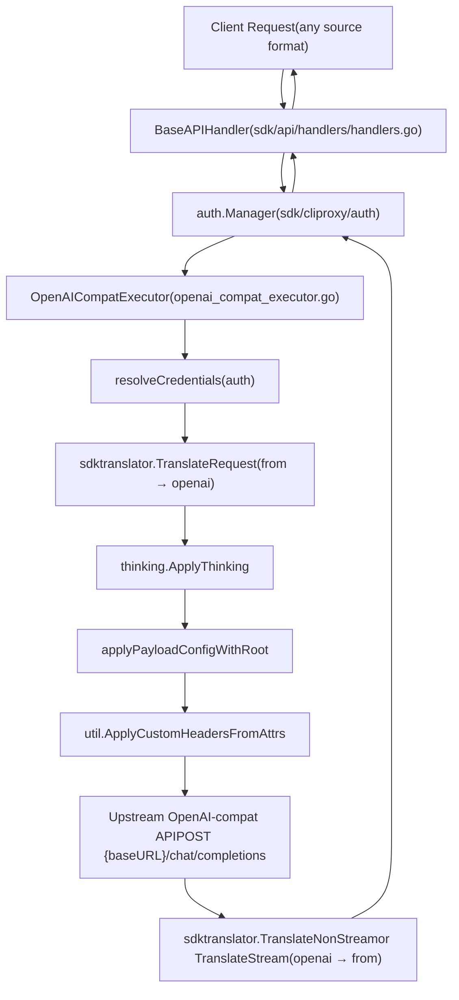
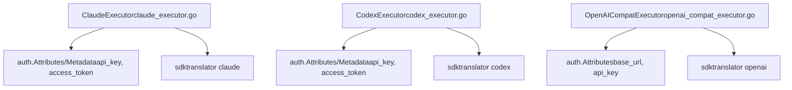

# OpenAI-Compatible Providers

Relevant source files

-   [internal/api/middleware/request\_logging\_test.go](https://github.com/router-for-me/CLIProxyAPI/blob/c66cb0af/internal/api/middleware/request_logging_test.go)
-   [internal/api/middleware/response\_writer\_test.go](https://github.com/router-for-me/CLIProxyAPI/blob/c66cb0af/internal/api/middleware/response_writer_test.go)
-   [internal/config/sdk\_config.go](https://github.com/router-for-me/CLIProxyAPI/blob/c66cb0af/internal/config/sdk_config.go)
-   [internal/runtime/executor/aistudio\_executor.go](https://github.com/router-for-me/CLIProxyAPI/blob/c66cb0af/internal/runtime/executor/aistudio_executor.go)
-   [internal/runtime/executor/antigravity\_executor.go](https://github.com/router-for-me/CLIProxyAPI/blob/c66cb0af/internal/runtime/executor/antigravity_executor.go)
-   [internal/runtime/executor/claude\_executor.go](https://github.com/router-for-me/CLIProxyAPI/blob/c66cb0af/internal/runtime/executor/claude_executor.go)
-   [internal/runtime/executor/codex\_executor.go](https://github.com/router-for-me/CLIProxyAPI/blob/c66cb0af/internal/runtime/executor/codex_executor.go)
-   [internal/runtime/executor/codex\_websockets\_executor.go](https://github.com/router-for-me/CLIProxyAPI/blob/c66cb0af/internal/runtime/executor/codex_websockets_executor.go)
-   [internal/runtime/executor/gemini\_cli\_executor.go](https://github.com/router-for-me/CLIProxyAPI/blob/c66cb0af/internal/runtime/executor/gemini_cli_executor.go)
-   [internal/runtime/executor/gemini\_executor.go](https://github.com/router-for-me/CLIProxyAPI/blob/c66cb0af/internal/runtime/executor/gemini_executor.go)
-   [internal/runtime/executor/gemini\_vertex\_executor.go](https://github.com/router-for-me/CLIProxyAPI/blob/c66cb0af/internal/runtime/executor/gemini_vertex_executor.go)
-   [internal/runtime/executor/iflow\_executor.go](https://github.com/router-for-me/CLIProxyAPI/blob/c66cb0af/internal/runtime/executor/iflow_executor.go)
-   [internal/runtime/executor/openai\_compat\_executor.go](https://github.com/router-for-me/CLIProxyAPI/blob/c66cb0af/internal/runtime/executor/openai_compat_executor.go)
-   [internal/runtime/executor/qwen\_executor.go](https://github.com/router-for-me/CLIProxyAPI/blob/c66cb0af/internal/runtime/executor/qwen_executor.go)
-   [sdk/api/handlers/handlers.go](https://github.com/router-for-me/CLIProxyAPI/blob/c66cb0af/sdk/api/handlers/handlers.go)
-   [sdk/api/handlers/handlers\_stream\_bootstrap\_test.go](https://github.com/router-for-me/CLIProxyAPI/blob/c66cb0af/sdk/api/handlers/handlers_stream_bootstrap_test.go)
-   [sdk/api/handlers/header\_filter.go](https://github.com/router-for-me/CLIProxyAPI/blob/c66cb0af/sdk/api/handlers/header_filter.go)
-   [sdk/api/handlers/header\_filter\_test.go](https://github.com/router-for-me/CLIProxyAPI/blob/c66cb0af/sdk/api/handlers/header_filter_test.go)
-   [sdk/api/handlers/openai/openai\_responses\_websocket.go](https://github.com/router-for-me/CLIProxyAPI/blob/c66cb0af/sdk/api/handlers/openai/openai_responses_websocket.go)
-   [sdk/cliproxy/auth/conductor\_executor\_replace\_test.go](https://github.com/router-for-me/CLIProxyAPI/blob/c66cb0af/sdk/cliproxy/auth/conductor_executor_replace_test.go)

This page documents the `openai-compat` executor — CLIProxyAPI's mechanism for proxying requests to any third-party API that speaks the OpenAI `/chat/completions` wire format. It covers the executor implementation, credential resolution, request translation pipeline, and configuration patterns.

For the broader provider executor interface and how executors are selected, see [3.4](https://github.com/router-for-me/CLIProxyAPI/blob/c66cb0af/3.4) For request translation internals, see [3.5](https://github.com/router-for-me/CLIProxyAPI/blob/c66cb0af/3.5) For how auth credentials are stored and rotated, see [3.3](https://github.com/router-for-me/CLIProxyAPI/blob/c66cb0af/3.3)

---

## Overview

CLIProxyAPI can route inference requests to any OpenAI-compatible upstream (e.g., OpenRouter, Together AI, or self-hosted vLLM instances) without requiring dedicated OAuth flows. The `OpenAICompatExecutor` handles these providers generically: it resolves a `base_url` and `api_key` from the auth credential record, translates the inbound request into OpenAI format, and forwards it to the upstream.

Multiple distinct providers are supported simultaneously. Each is identified by a unique provider name string (e.g., `"openrouter"`, `"together"`) that is registered at startup and matched against auth credentials at request time.

---

## Executor Architecture

**Diagram: OpenAICompatExecutor request flow**


Sources: [internal/runtime/executor/openai\_compat\_executor.go72-177](https://github.com/router-for-me/CLIProxyAPI/blob/c66cb0af/internal/runtime/executor/openai_compat_executor.go#L72-L177)

---

## `OpenAICompatExecutor`

Defined in [internal/runtime/executor/openai\_compat\_executor.go26-33](https://github.com/router-for-me/CLIProxyAPI/blob/c66cb0af/internal/runtime/executor/openai_compat_executor.go#L26-L33)

```
type OpenAICompatExecutor struct {
    provider string     // e.g. "openrouter", "together"
    cfg      *config.Config
}
```
Created via `NewOpenAICompatExecutor(provider string, cfg *config.Config)`. The `provider` string becomes the executor's `Identifier()` return value, which the auth manager uses to match credentials.

### Methods

| Method | Behavior |
| --- | --- |
| `Identifier()` | Returns `e.provider` |
| `PrepareRequest(req, auth)` | Sets `Authorization: Bearer <apiKey>`, applies custom headers |
| `HttpRequest(ctx, auth, req)` | Calls `PrepareRequest`, then executes via proxy-aware HTTP client |
| `Execute(ctx, auth, req, opts)` | Non-streaming: POST to `/chat/completions` or `/responses/compact` |
| `ExecuteStream(ctx, auth, req, opts)` | Streaming: POST to `/chat/completions` with SSE |
| `Refresh(ctx, auth)` | No-op — API key credentials do not expire |

Sources: [internal/runtime/executor/openai\_compat\_executor.go36-70](https://github.com/router-for-me/CLIProxyAPI/blob/c66cb0af/internal/runtime/executor/openai_compat_executor.go#L36-L70)

---

## Credential Resolution

The private `resolveCredentials(auth *cliproxyauth.Auth)` method extracts two values from the auth record's `Attributes` map:

| Attribute key | Purpose |
| --- | --- |
| `base_url` | Base URL for the upstream (e.g., `https://openrouter.ai/api/v1`) |
| `api_key` | API key sent as `Authorization: Bearer <api_key>` |

If `baseURL` is empty, `Execute` returns HTTP 401 (`missing provider baseURL`). If `apiKey` is empty, the `Authorization` header is omitted entirely (some endpoints allow unauthenticated access).

Sources: [internal/runtime/executor/openai\_compat\_executor.go40-53](https://github.com/router-for-me/CLIProxyAPI/blob/c66cb0af/internal/runtime/executor/openai_compat_executor.go#L40-L53) [internal/runtime/executor/openai\_compat\_executor.go78-83](https://github.com/router-for-me/CLIProxyAPI/blob/c66cb0af/internal/runtime/executor/openai_compat_executor.go#L78-L83)

---

## Request Pipeline

**Diagram: Translation and injection steps inside Execute/ExecuteStream**

> **[Mermaid sequence]**
> *(图表结构无法解析)*

Sources: [internal/runtime/executor/openai\_compat\_executor.go84-176](https://github.com/router-for-me/CLIProxyAPI/blob/c66cb0af/internal/runtime/executor/openai_compat_executor.go#L84-L176) [internal/runtime/executor/openai\_compat\_executor.go179-295](https://github.com/router-for-me/CLIProxyAPI/blob/c66cb0af/internal/runtime/executor/openai_compat_executor.go#L179-L295)

### Translation Format

The executor always translates to the `"openai"` format for the upstream request, regardless of what format the client sent. For `/responses/compact`, it uses `"openai-response"` instead.

```
from = opts.SourceFormat           // e.g. "claude", "gemini", "openai"
to   = sdktranslator.FromString("openai")  // always openai for chat/completions
```
The response is translated back from `openai` to the original `from` format.

Sources: [internal/runtime/executor/openai\_compat\_executor.go85-96](https://github.com/router-for-me/CLIProxyAPI/blob/c66cb0af/internal/runtime/executor/openai_compat_executor.go#L85-L96)

### Custom Headers

After `Authorization` is set, `util.ApplyCustomHeadersFromAttrs(httpReq, attrs)` is called with the full `auth.Attributes` map. Any attribute key prefixed with `header_` is injected as a request header. This allows per-credential header customization (e.g., for OpenRouter's `HTTP-Referer` or `X-Title` fields).

Sources: [internal/runtime/executor/openai\_compat\_executor.go120-125](https://github.com/router-for-me/CLIProxyAPI/blob/c66cb0af/internal/runtime/executor/openai_compat_executor.go#L120-L125)

### User-Agent

All requests carry `User-Agent: cli-proxy-openai-compat`.

Sources: [internal/runtime/executor/openai\_compat\_executor.go121](https://github.com/router-for-me/CLIProxyAPI/blob/c66cb0af/internal/runtime/executor/openai_compat_executor.go#L121-L121)

---

## Supported Endpoints

| `opts.Alt` value | Upstream URL | Request format | Response format |
| --- | --- | --- | --- |
| `""` (default) | `{baseURL}/chat/completions` | `openai` | `openai` |
| `"responses/compact"` | `{baseURL}/responses/compact` | `openai-response` | `openai-response` |
| (streaming) | `{baseURL}/chat/completions` | `openai` | SSE stream |

For streaming, the executor sets `Accept: text/event-stream` and `Cache-Control: no-cache`, then reads the SSE stream line by line, calling `sdktranslator.TranslateStream` per chunk.

Sources: [internal/runtime/executor/openai\_compat\_executor.go86-104](https://github.com/router-for-me/CLIProxyAPI/blob/c66cb0af/internal/runtime/executor/openai_compat_executor.go#L86-L104) [internal/runtime/executor/openai\_compat\_executor.go208-247](https://github.com/router-for-me/CLIProxyAPI/blob/c66cb0af/internal/runtime/executor/openai_compat_executor.go#L208-L247)

---

## Thinking Support

Like other executors, `OpenAICompatExecutor` calls `thinking.ApplyThinking` after translation. This injects reasoning/thinking parameters based on model name suffixes before the request is sent upstream. See [8.3](https://github.com/router-for-me/CLIProxyAPI/blob/c66cb0af/8.3) for full thinking configuration documentation.

Sources: [internal/runtime/executor/openai\_compat\_executor.go106-109](https://github.com/router-for-me/CLIProxyAPI/blob/c66cb0af/internal/runtime/executor/openai_compat_executor.go#L106-L109)

---

## Configuration

### Auth Credential File

An auth credential record for an OpenAI-compatible provider must have:

-   `type` matching the registered executor name (e.g., `openrouter`)
-   `attributes.base_url`: the upstream base URL
-   `attributes.api_key`: the API key

Example auth credential structure (YAML):

```
type: openrouterattributes:  base_url: "https://openrouter.ai/api/v1"  api_key: "sk-or-v1-..."
```
Any additional `attributes` entries prefixed with `header_` are forwarded as HTTP headers to the upstream.

### Provider Registration

Each distinct OpenAI-compatible provider name must correspond to a registered `OpenAICompatExecutor` instance. Executors are created via `NewOpenAICompatExecutor(providerName, cfg)`. In the standard service startup, these are registered alongside other executors in the executor registry. See [3.4](https://github.com/router-for-me/CLIProxyAPI/blob/c66cb0af/3.4) for how executors are registered.

### Model Definitions

Models served by an OpenAI-compatible provider are declared in the model registry under that provider's name. The `model` field in the outgoing request is set to the resolved base model name (after stripping any thinking suffixes). The proxy does not apply any additional model name transformation. See [3.6](https://github.com/router-for-me/CLIProxyAPI/blob/c66cb0af/3.6) for model registry details.

---

## Payload Configuration

The `applyPayloadConfigWithRoot` call allows global or model-specific payload rules (defaults, overrides, field deletions) to be applied before the request is forwarded. These rules are configured in `config.yaml` under `payload_config`. See [5.4](https://github.com/router-for-me/CLIProxyAPI/blob/c66cb0af/5.4) for full documentation of payload configuration rules.

Sources: [internal/runtime/executor/openai\_compat\_executor.go98-99](https://github.com/router-for-me/CLIProxyAPI/blob/c66cb0af/internal/runtime/executor/openai_compat_executor.go#L98-L99)

---

## Comparison with Other Executors

**Diagram: OpenAICompatExecutor vs. provider-specific executors**


| Feature | `OpenAICompatExecutor` | `CodexExecutor` | `ClaudeExecutor` |
| --- | --- | --- | --- |
| Auth type | API key only | API key + OAuth | API key + OAuth |
| Token refresh | None | Yes | Yes |
| Upstream format | OpenAI `/chat/completions` | Codex Responses API | Anthropic Messages API |
| Custom base URL | Required (from `base_url` attr) | Optional | Optional |
| Multiple provider instances | Yes (one per name) | No | No |

Sources: [internal/runtime/executor/openai\_compat\_executor.go26-295](https://github.com/router-for-me/CLIProxyAPI/blob/c66cb0af/internal/runtime/executor/openai_compat_executor.go#L26-L295) [internal/runtime/executor/codex\_executor.go37-45](https://github.com/router-for-me/CLIProxyAPI/blob/c66cb0af/internal/runtime/executor/codex_executor.go#L37-L45) [internal/runtime/executor/claude\_executor.go34-43](https://github.com/router-for-me/CLIProxyAPI/blob/c66cb0af/internal/runtime/executor/claude_executor.go#L34-L43)

---

## Usage Statistics

The executor reports token usage via the `usageReporter` pattern shared across all executors. It calls `parseOpenAIUsage(body)` on the response body to extract `prompt_tokens`, `completion_tokens`, and `total_tokens` from the OpenAI-format usage object. `reporter.ensurePublished(ctx)` is called to guarantee at least one usage record even if the upstream omits the `usage` field.

Sources: [internal/runtime/executor/openai\_compat\_executor.go168-172](https://github.com/router-for-me/CLIProxyAPI/blob/c66cb0af/internal/runtime/executor/openai_compat_executor.go#L168-L172)
