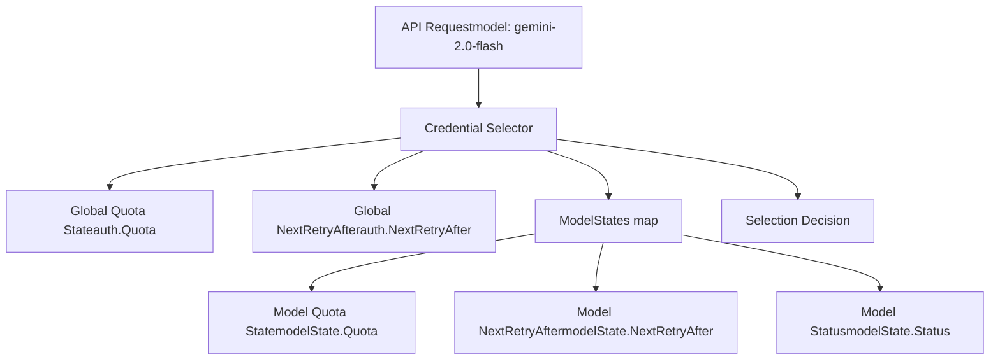
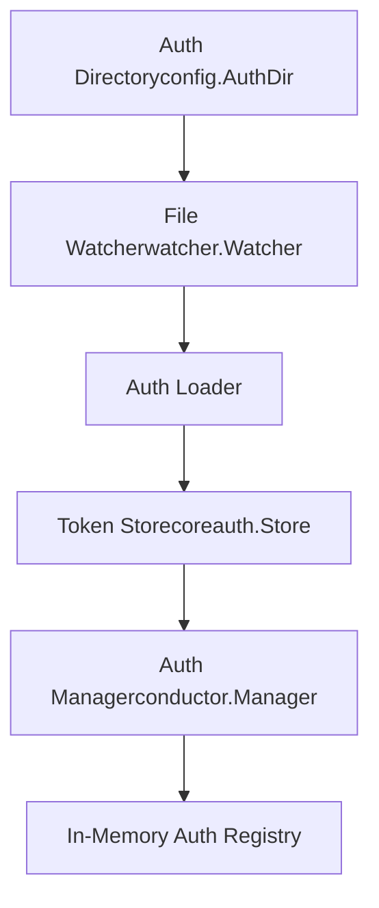
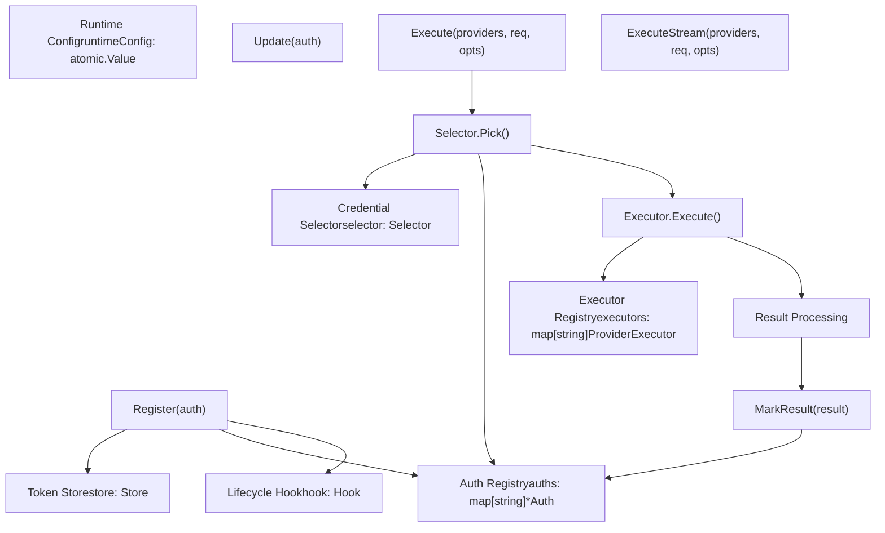
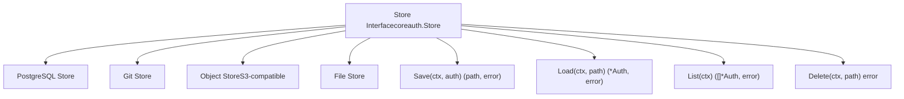
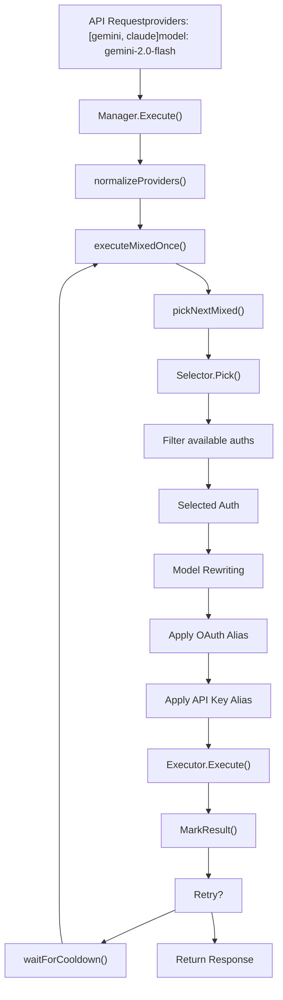
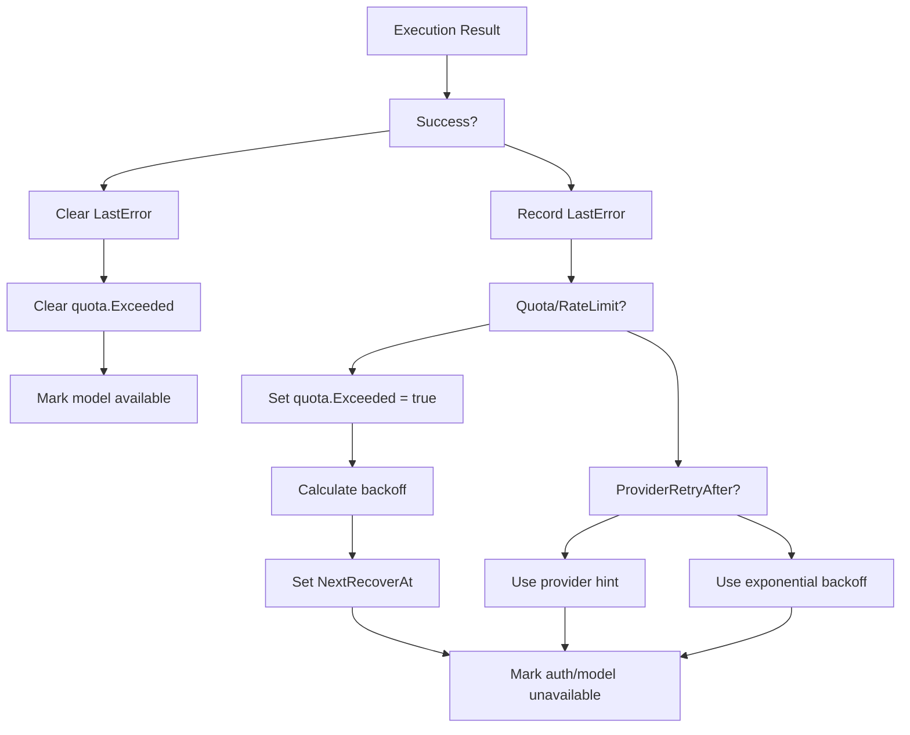

# Authentication Flows

Relevant source files

-   [internal/watcher/config\_reload.go](https://github.com/router-for-me/CLIProxyAPI/blob/c66cb0af/internal/watcher/config_reload.go)
-   [sdk/cliproxy/auth/conductor.go](https://github.com/router-for-me/CLIProxyAPI/blob/c66cb0af/sdk/cliproxy/auth/conductor.go)
-   [sdk/cliproxy/auth/selector.go](https://github.com/router-for-me/CLIProxyAPI/blob/c66cb0af/sdk/cliproxy/auth/selector.go)
-   [sdk/cliproxy/auth/selector\_test.go](https://github.com/router-for-me/CLIProxyAPI/blob/c66cb0af/sdk/cliproxy/auth/selector_test.go)
-   [sdk/cliproxy/auth/types.go](https://github.com/router-for-me/CLIProxyAPI/blob/c66cb0af/sdk/cliproxy/auth/types.go)
-   [sdk/cliproxy/auth/types\_test.go](https://github.com/router-for-me/CLIProxyAPI/blob/c66cb0af/sdk/cliproxy/auth/types_test.go)

## Purpose and Scope

This document explains how CLIProxyAPI manages authentication credentials across multiple AI providers. It covers the core authentication mechanisms, credential lifecycle, storage backends, and selection strategies used to route requests to the appropriate credentials.

For detailed information on specific topics, see:

-   OAuth flow implementation and callback handling: [OAuth Flow Architecture](/router-for-me/CLIProxyAPI/7.1-oauth-flow-architecture)
-   Provider-specific OAuth configuration: [Provider-Specific OAuth Setup](/router-for-me/CLIProxyAPI/7.2-provider-specific-oauth-setup)
-   API key and service account credential management: [API Key and Service Account Management](/router-for-me/CLIProxyAPI/7.3-api-key-and-service-account-management)
-   Token expiration and automatic refresh: [Token Refresh and Lifecycle](/router-for-me/CLIProxyAPI/7.4-token-refresh-and-lifecycle)

---

## Authentication Overview

CLIProxyAPI supports multiple authentication methods to accommodate different provider requirements and deployment scenarios. All authentication data flows through a unified **Auth Manager** (`Manager` in [sdk/cliproxy/auth/conductor.go](https://github.com/router-for-me/CLIProxyAPI/blob/c66cb0af/sdk/cliproxy/auth/conductor.go)) that orchestrates credential selection, execution, and lifecycle management.

### Supported Authentication Methods

| Method | Use Case | Persistence | Auto-Refresh |
| --- | --- | --- | --- |
| **OAuth** | User-scoped provider access (Gemini, Claude, Codex, etc.) | Token Store | Yes |
| **API Keys** | Provider API keys from config or auth files | Token Store or Config | No |
| **Service Accounts** | GCP service account JSON files | Token Store | Yes (via SDK) |
| **Runtime-Only** | WebSocket-injected credentials (AI Studio) | Memory Only | Provider-dependent |

Sources: [sdk/cliproxy/auth/types.go15-66](https://github.com/router-for-me/CLIProxyAPI/blob/c66cb0af/sdk/cliproxy/auth/types.go#L15-L66) [sdk/cliproxy/auth/conductor.go116-147](https://github.com/router-for-me/CLIProxyAPI/blob/c66cb0af/sdk/cliproxy/auth/conductor.go#L116-L147)

---

## Authentication Data Model

### Auth Structure

Each credential is represented by an `Auth` struct that encapsulates:

```
Auth {
  ID: string              // Unique identifier (filename or generated UUID)
  Index: string           // Stable runtime hash for deduplication
  Provider: string        // Provider key (gemini, claude, codex, etc.)
  Prefix: string          // Optional routing prefix (e.g., "team-a/")
  FileName: string        // Backing file path for persisted credentials
  Storage: TokenStorage   // Provider-specific token persistence interface
  Status: Status          // Lifecycle status (active, error, disabled, etc.)
  Disabled: bool          // Operator-controlled disable flag
  Unavailable: bool       // Transient unavailability (quota exceeded, cooldown)
  Attributes: map[string]string  // Immutable provider metadata (api_key, base_url)
  Metadata: map[string]any       // Mutable runtime state (tokens, cookies)
  Quota: QuotaState       // Recent quota/rate limit tracking
  ModelStates: map[string]*ModelState  // Per-model availability tracking
  CreatedAt: time.Time
  UpdatedAt: time.Time
  LastRefreshedAt: time.Time
  NextRefreshAfter: time.Time
  NextRetryAfter: time.Time
}
```
**Key Fields:**

-   **Attributes**: Immutable configuration data used by executors (e.g., `api_key`, `base_url`, `priority`)
-   **Metadata**: Mutable provider state such as OAuth tokens, refresh tokens, expiration timestamps
-   **ModelStates**: Per-model cooldown and quota tracking, enabling fine-grained credential selection
-   **Index**: Computed hash from filename or API key for stable identification across restarts

Sources: [sdk/cliproxy/auth/types.go15-66](https://github.com/router-for-me/CLIProxyAPI/blob/c66cb0af/sdk/cliproxy/auth/types.go#L15-L66) [sdk/cliproxy/auth/types.go126-164](https://github.com/router-for-me/CLIProxyAPI/blob/c66cb0af/sdk/cliproxy/auth/types.go#L126-L164)

### Quota and Cooldown Tracking


**Quota State Structure:**

-   `Exceeded`: Boolean flag indicating quota/rate limit hit
-   `Reason`: Human-readable description from provider
-   `NextRecoverAt`: Timestamp when quota may be available again
-   `BackoffLevel`: Progressive cooldown exponent for retry backoff

The system tracks quota state at two levels:

1.  **Global auth-level**: Applies to all models for this credential
2.  **Per-model level**: Tracks individual model quota states independently

Sources: [sdk/cliproxy/auth/types.go68-96](https://github.com/router-for-me/CLIProxyAPI/blob/c66cb0af/sdk/cliproxy/auth/types.go#L68-L96) [sdk/cliproxy/auth/selector.go239-296](https://github.com/router-for-me/CLIProxyAPI/blob/c66cb0af/sdk/cliproxy/auth/selector.go#L239-L296)

---

## Authentication Sources and Loading

### File-Based Authentication

Credentials can be loaded from JSON files in the configured auth directory:


**Loading Process:**

1.  File watcher detects `.json` files in `config.AuthDir`
2.  Files are parsed for `type` field to determine provider
3.  Token storage wrapper is created from file metadata
4.  Auth record is registered with the manager
5.  Models are registered with the global model registry

Sources: [internal/api/handlers/management/auth\_files.go681-743](https://github.com/router-for-me/CLIProxyAPI/blob/c66cb0af/internal/api/handlers/management/auth_files.go#L681-L743) [sdk/cliproxy/auth/conductor.go408-424](https://github.com/router-for-me/CLIProxyAPI/blob/c66cb0af/sdk/cliproxy/auth/conductor.go#L408-L424)

### Configuration-Based Authentication

API keys can be defined directly in `config.yaml`:

```
gemini_key:  - api_key: "AIza..."    models:      - name: "gemini-2.0-flash-exp"        alias: "gemini-flash"      claude_key:  - api_key: "sk-ant-..."    base_url: "https://api.anthropic.com"    models:      - name: "claude-3-5-sonnet-latest"
```
Config-based credentials are materialized as `Auth` entries with:

-   `Attributes["api_key"]`: The API key value
-   `Attributes["base_url"]`: Optional provider endpoint override
-   Provider-specific model alias mappings compiled into lookup tables

Sources: [sdk/cliproxy/auth/conductor.go250-324](https://github.com/router-for-me/CLIProxyAPI/blob/c66cb0af/sdk/cliproxy/auth/conductor.go#L250-L324)

### Runtime Authentication

WebSocket connections can inject credentials at runtime without persistence:

-   Marked with `Attributes["runtime_only"] = "true"`
-   Not persisted to disk
-   Excluded from file-based listing when disabled
-   Commonly used for AI Studio dynamic credential injection

Sources: [sdk/cliproxy/auth/types.go498-503](https://github.com/router-for-me/CLIProxyAPI/blob/c66cb0af/sdk/cliproxy/auth/types.go#L498-L503) [internal/api/handlers/management/auth\_files.go361-364](https://github.com/router-for-me/CLIProxyAPI/blob/c66cb0af/internal/api/handlers/management/auth_files.go#L361-L364)

---

## Auth Manager (Conductor Pattern)

The `Manager` in [sdk/cliproxy/auth/conductor.go](https://github.com/router-for-me/CLIProxyAPI/blob/c66cb0af/sdk/cliproxy/auth/conductor.go) orchestrates all credential operations using a conductor pattern:


**Core Responsibilities:**

1.  **Credential Registration**: Add/update credentials via `Register()` and `Update()`
2.  **Selection Strategy**: Delegate to pluggable `Selector` (round-robin, fill-first, priority-based)
3.  **Execution Orchestration**: Route requests through selected credentials with retry logic
4.  **Result Tracking**: Update quota state, cooldowns, and availability based on execution outcomes
5.  **Auto-Refresh**: Schedule token refresh when credentials approach expiration
6.  **Persistence**: Delegate to `Store` backend for durable token storage

Sources: [sdk/cliproxy/auth/conductor.go116-169](https://github.com/router-for-me/CLIProxyAPI/blob/c66cb0af/sdk/cliproxy/auth/conductor.go#L116-L169) [sdk/cliproxy/auth/conductor.go408-443](https://github.com/router-for-me/CLIProxyAPI/blob/c66cb0af/sdk/cliproxy/auth/conductor.go#L408-L443)

### Credential Selection Strategies

The manager supports two built-in selection strategies:

| Strategy | Behavior | Use Case |
| --- | --- | --- |
| **RoundRobinSelector** | Cycle through available credentials per model | Fair distribution across accounts |
| **FillFirstSelector** | Always pick first available credential | Burn accounts sequentially (stagger subscription caps) |

Both strategies respect:

-   Priority levels via `Attributes["priority"]`
-   Model-specific cooldowns via `ModelStates`
-   Global unavailability flags
-   Disabled credentials

Sources: [sdk/cliproxy/auth/selector.go19-237](https://github.com/router-for-me/CLIProxyAPI/blob/c66cb0af/sdk/cliproxy/auth/selector.go#L19-L237) [sdk/cliproxy/auth/conductor.go149-169](https://github.com/router-for-me/CLIProxyAPI/blob/c66cb0af/sdk/cliproxy/auth/conductor.go#L149-L169)

**Selection Error Handling:**

When all credentials for a model are cooling down, the selector returns a `modelCooldownError` with:

-   HTTP 429 status code
-   `Retry-After` header with cooldown duration
-   JSON error body with reset time and model info

Sources: [sdk/cliproxy/auth/selector.go40-107](https://github.com/router-for-me/CLIProxyAPI/blob/c66cb0af/sdk/cliproxy/auth/selector.go#L40-L107)

---

## Token Storage Backends

Credentials are persisted via the `Store` interface, which supports multiple backends:


**Store Interface:**

-   `Save(ctx, auth)`: Persist or update credential record
-   `Load(ctx, path)`: Retrieve credential by identifier
-   `List(ctx)`: Enumerate all credentials
-   `Delete(ctx, path)`: Remove credential record

The manager calls `Save()` after credential registration or updates. The file store implementation writes JSON files to disk, while cloud backends serialize to their respective storage systems.

Sources: [sdk/cliproxy/auth/conductor.go183-188](https://github.com/router-for-me/CLIProxyAPI/blob/c66cb0af/sdk/cliproxy/auth/conductor.go#L183-L188) [internal/api/handlers/management/auth\_files.go831-868](https://github.com/router-for-me/CLIProxyAPI/blob/c66cb0af/internal/api/handlers/management/auth_files.go#L831-L868)

---

## OAuth Flow Integration

OAuth flows are initiated via the Management API and handled by provider-specific authenticators:

> **[Mermaid sequence]**
> *(图表结构无法解析)*

**Callback Forwarder Pattern:**

For Web UI integration, the system starts a temporary local HTTP server that redirects OAuth callbacks to the management API:

1.  **Local Server**: Binds to provider-specific port (e.g., 8085 for Gemini)
2.  **Redirect**: Forwards callback to `http://127.0.0.1:{server_port}/oauth/callback`
3.  **State Matching**: Validates state parameter to prevent CSRF
4.  **File-Based IPC**: Writes callback data to `.oauth-{provider}-{state}.oauth` file
5.  **Polling**: Background goroutine polls for file creation with 5-minute timeout
6.  **Cleanup**: Server shuts down after callback or timeout

Sources: [internal/api/handlers/management/auth\_files.go55-234](https://github.com/router-for-me/CLIProxyAPI/blob/c66cb0af/internal/api/handlers/management/auth_files.go#L55-L234) [internal/api/handlers/management/auth\_files.go870-1012](https://github.com/router-for-me/CLIProxyAPI/blob/c66cb0af/internal/api/handlers/management/auth_files.go#L870-L1012)

### OAuth Session Tracking

The management API maintains in-memory OAuth session state to track concurrent flows:

```
oauthSessions map[string]*OAuthSession {
  state: {
    Provider: "anthropic"
    Status: "pending" | "completed" | "error"
    Error: string
    CreatedAt: time.Time
  }
}
```
Sessions are tracked to:

-   Prevent duplicate flows with the same state
-   Allow cancellation via session cleanup
-   Provide status polling for async flows
-   Clean up stale sessions after timeout

Sources: [internal/api/handlers/management/auth\_files.go1014-1089](https://github.com/router-for-me/CLIProxyAPI/blob/c66cb0af/internal/api/handlers/management/auth_files.go#L1014-L1089)

---

## Credential Execution Flow

Request execution through credentials follows this path:


**Execution Steps:**

1.  **Provider Normalization**: Convert provider list to lowercase, deduplicate
2.  **Credential Selection**: Use selector to pick available credential for model
3.  **Model Rewriting**:
    -   Strip routing prefix if present (e.g., `team-a/gemini-flash` → `gemini-flash`)
    -   Apply OAuth model aliases from config
    -   Apply API key model aliases from per-credential config
4.  **Executor Invocation**: Call provider-specific executor with selected auth
5.  **Result Tracking**: Update quota state, cooldowns, and model availability
6.  **Retry Logic**: Retry on transient failures with exponential backoff

Sources: [sdk/cliproxy/auth/conductor.go472-563](https://github.com/router-for-me/CLIProxyAPI/blob/c66cb0af/sdk/cliproxy/auth/conductor.go#L472-L563) [sdk/cliproxy/auth/conductor.go565-619](https://github.com/router-for-me/CLIProxyAPI/blob/c66cb0af/sdk/cliproxy/auth/conductor.go#L565-L619)

### Model Alias Resolution

The manager applies two levels of model aliasing:

**1\. OAuth Model Aliases (Global):**

```
oauth_model_alias:  gemini:    gemini-flash: gemini-2.0-flash-exp    gemini-pro: gemini-1.5-pro-002
```
Applied to all OAuth credentials for the provider.

**2\. API Key Model Aliases (Per-Credential):**

```
gemini_key:  - api_key: "AIza..."    models:      - name: "gemini-2.0-flash-thinking-exp-1219"        alias: "gemini-flash-thinking"
```
Applied only to the specific API key credential. Resolved via cached lookup tables rebuilt on config reload.

Sources: [sdk/cliproxy/auth/conductor.go210-247](https://github.com/router-for-me/CLIProxyAPI/blob/c66cb0af/sdk/cliproxy/auth/conductor.go#L210-L247) [sdk/cliproxy/auth/conductor.go816-863](https://github.com/router-for-me/CLIProxyAPI/blob/c66cb0af/sdk/cliproxy/auth/conductor.go#L816-L863)

---

## Result Tracking and Quota Management

After each execution, the manager updates credential state based on the result:


**Quota Backoff Calculation:**

Progressive backoff levels increase cooldown duration:

```
backoffLevel = min(quota.BackoffLevel + 1, maxLevel)
duration = min(quotaBackoffBase * 2^backoffLevel, quotaBackoffMax)
```
Default values:

-   `quotaBackoffBase`: 1 second
-   `quotaBackoffMax`: 30 minutes

Per-credential override via metadata:

```
{  "disable_cooling": true,  "request_retry": 5}
```
Sources: [sdk/cliproxy/auth/conductor.go1270-1477](https://github.com/router-for-me/CLIProxyAPI/blob/c66cb0af/sdk/cliproxy/auth/conductor.go#L1270-L1477) [sdk/cliproxy/auth/conductor.go49-72](https://github.com/router-for-me/CLIProxyAPI/blob/c66cb0af/sdk/cliproxy/auth/conductor.go#L49-L72)

---

## Management API Endpoints

The Management API provides CRUD operations for auth files:

| Endpoint | Method | Purpose |
| --- | --- | --- |
| `/v0/management/auth/list` | GET | List all auth files with metadata |
| `/v0/management/auth/download` | GET | Download single auth file |
| `/v0/management/auth/upload` | POST | Upload auth file (multipart or JSON) |
| `/v0/management/auth/delete` | DELETE | Delete auth file(s) |
| `/v0/management/auth/patch-status` | PATCH | Enable/disable auth file |
| `/v0/management/auth/request-gemini-token` | POST | Initiate Gemini OAuth flow |
| `/v0/management/auth/request-anthropic-token` | POST | Initiate Claude OAuth flow |
| `/v0/management/auth/request-codex-token` | POST | Initiate Codex OAuth flow |

**Auth List Response:**

```
{  "files": [    {      "id": "gemini-user@example.com-project123.json",      "name": "gemini-user@example.com-project123.json",      "type": "gemini",      "provider": "gemini",      "email": "user@example.com",      "account_type": "oauth",      "status": "active",      "disabled": false,      "unavailable": false,      "runtime_only": false,      "size": 2048,      "created_at": "2024-01-01T00:00:00Z",      "updated_at": "2024-01-15T10:30:00Z",      "last_refresh": "2024-01-15T10:30:00Z"    }  ]}
```
Sources: [internal/api/handlers/management/auth\_files.go250-272](https://github.com/router-for-me/CLIProxyAPI/blob/c66cb0af/internal/api/handlers/management/auth_files.go#L250-L272) [internal/api/handlers/management/auth\_files.go356-428](https://github.com/router-for-me/CLIProxyAPI/blob/c66cb0af/internal/api/handlers/management/auth_files.go#L356-L428)

### Auth File Upload and Registration

Uploading an auth file triggers immediate registration:

1.  **File Validation**: Check `.json` extension and parse JSON
2.  **Persistence**: Write to `config.AuthDir/{filename}`
3.  **Registration**: Call `registerAuthFromFile()` to load into manager
4.  **Model Registration**: Extract provider-specific models and register with global registry
5.  **Hook Notification**: Trigger `OnAuthRegistered()` hook for external observers

Sources: [internal/api/handlers/management/auth\_files.go531-594](https://github.com/router-for-me/CLIProxyAPI/blob/c66cb0af/internal/api/handlers/management/auth_files.go#L531-L594)

---

## Authentication Flow Examples

### OAuth Flow for Gemini CLI

> **[Mermaid sequence]**
> *(图表结构无法解析)*

**Project Discovery:**

Gemini CLI auth requires a GCP project ID. The flow attempts:

1.  **Load existing**: Call `:loadCodeAssist` to check for existing project binding
2.  **Onboard new**: If not found, call `:onboardUser` to create project association
3.  **Verify API**: Check Cloud AI API is enabled via service usage API
4.  **Persist**: Save project ID in token metadata for future requests

Sources: [internal/api/handlers/management/auth\_files.go1014-1242](https://github.com/router-for-me/CLIProxyAPI/blob/c66cb0af/internal/api/handlers/management/auth_files.go#L1014-L1242) [internal/auth/antigravity/auth.go154-242](https://github.com/router-for-me/CLIProxyAPI/blob/c66cb0af/internal/auth/antigravity/auth.go#L154-L242)

### API Key Authentication

API keys require no OAuth flow:

1.  **Config Definition**: Define in `config.yaml` under provider-specific keys
2.  **Manager Load**: Auth manager reads config on startup
3.  **Materialization**: Create `Auth` entries with `Attributes["api_key"]`
4.  **Alias Compilation**: Build model alias lookup tables from config
5.  **Execution**: Executor injects API key into request headers

Sources: [sdk/cliproxy/auth/conductor.go250-324](https://github.com/router-for-me/CLIProxyAPI/blob/c66cb0af/sdk/cliproxy/auth/conductor.go#L250-L324) [sdk/cliproxy/auth/conductor.go865-908](https://github.com/router-for-me/CLIProxyAPI/blob/c66cb0af/sdk/cliproxy/auth/conductor.go#L865-L908)

---

## Security Considerations

### Credential Isolation

-   Auth files are stored with `0600` permissions (owner read/write only)
-   Management API is restricted to localhost by default via middleware
-   OAuth state parameters use cryptographically secure random generation
-   Callback forwarders bind to `127.0.0.1` only

Sources: [internal/api/handlers/management/auth\_files.go585](https://github.com/router-for-me/CLIProxyAPI/blob/c66cb0af/internal/api/handlers/management/auth_files.go#L585-L585) [internal/api/handlers/management/auth\_files.go144-148](https://github.com/router-for-me/CLIProxyAPI/blob/c66cb0af/internal/api/handlers/management/auth_files.go#L144-L148)

### Token Refresh Security

-   Refresh tokens are never exposed in API responses
-   Token expiration is validated before each request
-   Refresh lead time (default 5 minutes) prevents last-second failures
-   Failed refresh marks auth as unavailable with exponential backoff

Sources: [sdk/cliproxy/auth/types.go350-431](https://github.com/router-for-me/CLIProxyAPI/blob/c66cb0af/sdk/cliproxy/auth/types.go#L350-L431) [sdk/cliproxy/auth/conductor.go1479-1666](https://github.com/router-for-me/CLIProxyAPI/blob/c66cb0af/sdk/cliproxy/auth/conductor.go#L1479-L1666)

---

## Sources

This document was informed by the following source files:

-   [internal/api/handlers/management/auth\_files.go1-1999](https://github.com/router-for-me/CLIProxyAPI/blob/c66cb0af/internal/api/handlers/management/auth_files.go#L1-L1999)
-   [sdk/cliproxy/auth/conductor.go1-2000](https://github.com/router-for-me/CLIProxyAPI/blob/c66cb0af/sdk/cliproxy/auth/conductor.go#L1-L2000)
-   [sdk/cliproxy/auth/types.go1-480](https://github.com/router-for-me/CLIProxyAPI/blob/c66cb0af/sdk/cliproxy/auth/types.go#L1-L480)
-   [sdk/cliproxy/auth/selector.go1-297](https://github.com/router-for-me/CLIProxyAPI/blob/c66cb0af/sdk/cliproxy/auth/selector.go#L1-L297)
-   [sdk/auth/antigravity.go1-267](https://github.com/router-for-me/CLIProxyAPI/blob/c66cb0af/sdk/auth/antigravity.go#L1-L267)
-   [internal/auth/antigravity/auth.go1-345](https://github.com/router-for-me/CLIProxyAPI/blob/c66cb0af/internal/auth/antigravity/auth.go#L1-L345)
-   [internal/watcher/config\_reload.go1-136](https://github.com/router-for-me/CLIProxyAPI/blob/c66cb0af/internal/watcher/config_reload.go#L1-L136)
